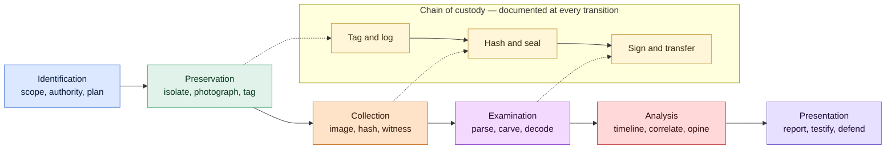

# Digital Forensics

## Why this matters

Incident response answers "what happened and how do we stop it". Digital forensics answers "can we prove what happened in a way that holds up in front of a judge, an arbitrator, or a regulator". The two disciplines share tools and vocabulary but they have different goals and different rules. Investigation can compromise evidence in the name of speed; forensics cannot. Once an incident has any plausible chance of becoming a court case, an HR termination, an insurance claim, a regulatory enforcement action, or a contract dispute, the work has to satisfy a higher standard. The difference between "we know what happened" and "we can prove what happened" is a forensically-sound process — and that process starts the moment the first analyst touches the keyboard.

The reality at `example.local` is that most incidents do not end up in court, and most never need to. But the few that do are the ones that matter most: the insider who walked out with the customer database, the contractor who altered the financial reports, the third party suing over a breach notification, the regulator asking for proof that the breach was contained. In each of those cases, the answer to "show us your evidence" determines whether the organisation wins or loses. Forensics is the discipline that turns observed activity into evidence — captured in the right order, hashed at the moment of capture, transported under chain of custody, analysed with reproducible tools, and reported in language a non-technical judge can read and a hostile expert cannot dismantle.

This lesson walks the full forensic process — order of volatility, imaging, memory analysis, file-system and registry artifacts, network and mobile and cloud forensics, anti-forensic detection, and the legal standards that courts apply to all of it. Examples use the fictional `example.local` organisation. The principles are technology-neutral; the menus differ between vendors but the discipline is the same.

The questions a forensic engagement must answer in writing:

- **Provenance** — where did this data come from, and can the path be reconstructed from capture to courtroom?
- **Integrity** — has the data been altered since capture, and how do we prove it has not?
- **Chain of custody** — every person who handled the evidence, every action they took, every transfer documented?
- **Reproducibility** — can a competing expert run the same tools against the same image and reach the same conclusion?
- **Scope discipline** — did the examination stay within the authorised legal scope, or did it stray into data the warrant or engagement letter did not cover?
- **Admissibility** — does the work satisfy Daubert, Frye, ISO/IEC 27037, and the local rules of the venue where it will be presented?

Those six questions are the spine of a defensible forensic practice. The rest of this lesson is about the techniques that answer them.

## Core concepts

Forensics borrows vocabulary from law, science, and computing. The vocabulary matters; sloppy language in a report is the easiest way for an opposing expert to discredit the work.

### Forensics vs IR — different goals, different rules

Incident response and digital forensics overlap, but they optimise for different outcomes. Conflating them is one of the most common mistakes a blue team makes.

- **Incident response** optimises for containment and recovery. The clock is the adversary's foothold; the cost function is dwell time and damage. IR can accept some loss of evidentiary fidelity if it gets the foothold off the network faster.
- **Digital forensics** optimises for prosecution-grade truth. The clock is the legal timeline; the cost function is admissibility. Forensics will not accept loss of evidentiary fidelity even if it slows the response, because the alternative is an investigation that fails in court.

In a real engagement the two disciplines run in parallel. The IR team contains the damage; the forensics team preserves the evidence. They share telemetry, but their actions are sequenced so that containment does not destroy what forensics still needs. A defensible programme has both teams in the room from the first hour, with a single incident commander deciding which discipline goes first on each disputed action.

### The order of volatility — RFC 3227

RFC 3227 codified the rule that the most volatile evidence is collected first. The order is dictated by physics, not preference: data that disappears the fastest is captured first, before the act of investigating destroys it.

1. **CPU registers, cache, and on-die state** — gone in microseconds. Rarely captured outside specialised hardware research.
2. **RAM and kernel memory** — gone the moment the system reboots. Captured live with WinPMEM, LiME, AVML, or vendor agents while the system is still running.
3. **Network state** — routing tables, ARP cache, established connections, listening ports, DNS resolver cache. Captured with `netstat`, `ss`, `arp`, `ip route`, or built-in EDR commands before the host is isolated.
4. **Process state** — running processes, open file handles, loaded modules, mounted filesystems. Captured live; lost on shutdown.
5. **Temporary file system and swap** — pagefile, hibernation file, `/tmp`, browser cache. Persists across reboots in some cases but is volatile under normal operation.
6. **Disk storage** — file system contents, slack space, unallocated clusters, journal entries. Persistent until overwritten.
7. **Remotely logged data** — SIEM logs, cloud audit trails, syslog on a central server. Persistent but subject to retention policies and provider deletion.
8. **Archival media and backups** — long-term storage. The last to capture and the most stable.

A practical rule: never reboot the system, never run software on it that the investigation has not authorised, never plug it into the network, and never pull the cable until memory has been imaged. Every action a responder takes alters volatile state.

### Chain of custody — what it is, why courts require it

Chain of custody is the documented record of who possessed the evidence, when, and what they did with it, from the moment of seizure through to courtroom presentation and eventual destruction. Courts require it because evidence whose path cannot be reconstructed cannot be trusted: a defence expert who can show that the evidence sat unattended on a desk for 48 hours has a credible argument that it was tampered with.

A defensible chain of custody captures, for every artefact:

- **Item description** — make, model, serial number, capacity, identifying marks, photographs.
- **Tag number** — a unique serialised tag attached to the item and referenced in every subsequent log entry.
- **Acquisition record** — who collected it, where, when (in UTC), under what authority, with what tooling, with what witnesses.
- **Hash values at acquisition** — typically SHA-256, often paired with MD5 for legacy compatibility, recorded in the log and printed on the evidence label.
- **Storage record** — where the item is held between actions, who has the key, what environmental controls apply.
- **Access log** — every time the item leaves storage, who took it, why, when it was returned, and what was done to it.
- **Signatures** — each transfer signed by both parties, with date and time.

The chain breaks the moment a single entry is missing or unverifiable. A broken chain is not necessarily fatal — courts can still admit the evidence if the gap is explained — but each break is a foothold for opposing counsel to challenge admissibility.

### Forensic imaging — bit-for-bit copies, write blockers, dual hashing

Forensic imaging produces a bit-for-bit copy of a storage device, including unallocated space, slack space, and recovered fragments that a logical copy would miss. The image is what the analyst works from; the original sits in evidence storage and is touched as little as possible.

Three disciplines define a defensible image:

- **Write blockers.** Hardware (Tableau, WiebeTech) or software (Linux's `read-only` mount, Windows registry-key blockers) that prevents any write to the source. Without a write blocker, the act of imaging modifies timestamps and journals on the source disk, which an opposing expert will exploit. Hardware blockers are preferred for legal-grade work.
- **Hash verification at every step.** The source is hashed before imaging. The image is hashed after imaging. The two hashes must match. If they do not, the image is invalid and the process restarts. Working copies made later are hashed and the hashes recorded with the chain of custody.
- **Dual hashing — MD5 plus SHA-256.** MD5 is cryptographically broken but courts and older tools still expect it; SHA-256 is the modern standard. Recording both ensures the image survives changes in expectation over the years it may sit in evidence storage. Tools like `dcfldd`, `dc3dd`, FTK Imager, and Guymager produce both hashes natively.

The image format itself matters. Raw `dd` images are the most portable. Expert Witness Format (E01) supports compression, metadata, and case-management features. AFF4 is the modern open standard. The format choice is documented in the case file so that any future analyst can open the image with appropriate tooling.

### Memory forensics — capture and analysis

RAM holds the running state of the system: process trees, open network connections, loaded modules, decrypted material, malware that lives only in memory, credentials in clear text. None of it survives a reboot. Memory forensics is therefore the highest-leverage activity in a live-system response.

**Capture tools:**

- **WinPMEM** — open-source memory acquisition for Windows. Runs as a signed driver, produces an AFF4 or raw image, captures the full physical address space.
- **LiME (Linux Memory Extractor)** — kernel module for Linux. Compiles against the running kernel; produces a raw memory dump.
- **AVML (Acquire Volatile Memory for Linux)** — Microsoft's userland-mode acquisition tool, useful in cloud workloads where loading kernel modules is restricted.
- **Vendor EDR agents** — most modern EDRs can trigger a memory snapshot as part of an incident response action, often without the analyst needing physical access.

**Analysis tools:**

- **Volatility 3** — the modern Python rewrite of the Volatility framework. Plugins parse process trees, network connections, registry hives loaded in memory, kernel modules, hidden processes, and injected code.
- **Rekall** — a fork with overlapping functionality, less actively maintained but still used in some toolkits.
- **MemProcFS** — exposes a memory image as a virtual file system, letting the analyst browse processes, handles, and modules with normal file-system tools.

A typical memory analysis pulls the process tree (`windows.pstree`), the loaded modules per process, the network connections (`windows.netscan`), the command-line arguments, the API hooks, and any injected or hidden modules. Anomalies in any of those views are usually where the investigation pivots.

### File system forensics — MFT, inodes, slack space, deletion recovery

File systems are not opaque containers; they are structured databases that record far more than the user-visible files. Forensic value comes from reading those structures directly rather than asking the operating system for a view of them.

- **NTFS Master File Table (MFT)** — every file and directory on an NTFS volume has an MFT record with timestamps, permissions, attributes, and (for small files) the file content itself. The MFT records survive deletion until overwritten; tools like `analyzeMFT.py`, MFTECmd, and The Sleuth Kit's `fls`/`icat` parse them directly.
- **NTFS timestamps** — four timestamps per file (Creation, Modification, Access, MFT change) stored in two attributes (`$STANDARD_INFORMATION` and `$FILE_NAME`). Timestamp tampering tools usually update one but not the other; the discrepancy is itself evidence.
- **ext4 inodes** — the Linux equivalent. `debugfs`, `extundelete`, and Sleuth Kit handle the parsing. ext4 journal entries can recover recent file operations even after deletion.
- **Slack space** — the unused bytes between the end of a file and the end of the cluster it lives in. Slack often contains fragments of previously-deleted files that the new file did not fully overwrite.
- **Unallocated space** — clusters not currently assigned to a file but possibly containing recoverable data from prior files. File-carving tools (PhotoRec, Foremost, Scalpel) recover files from unallocated space by recognising file signatures rather than relying on the file system.
- **Deletion behaviour** — most file systems do not zero deleted files. They mark the clusters available for reuse and let new writes overwrite gradually. Recovery is often possible until the clusters are reused, which on a busy disk can be hours and on a quiet disk can be years.

The Sleuth Kit and Autopsy provide a unified interface to most of these operations. SleuthKit is the command-line library; Autopsy is the GUI on top of it. Both are open source and both produce output that a trained analyst can defend in court.

### Windows registry forensics

The Windows registry is a hierarchical configuration database that records far more than configuration. Many of the most useful artefacts in a Windows investigation live in registry hives.

- **UserAssist** (`HKCU\Software\Microsoft\Windows\CurrentVersion\Explorer\UserAssist`) — records GUI program executions launched from the Start menu or shell. Values are ROT13-obfuscated; tools like RegRipper decode them. Useful for "did the user run this program".
- **ShimCache / AppCompatCache** (`HKLM\SYSTEM\CurrentControlSet\Control\Session Manager\AppCompatCache`) — records executables that the application-compatibility framework has seen. Records survive even if the file was deleted, making ShimCache a primary source for "this binary existed on the system at some point".
- **AmCache** (`%SystemRoot%\AppCompat\Programs\Amcache.hve`) — newer Windows artefact recording executables, install dates, and SHA-1 hashes. AmCacheParser is the standard tool.
- **Prefetch** (`%SystemRoot%\Prefetch\*.pf`) — Windows performance optimisation files recording executable launches, run counts, last run times, and loaded DLLs. PECmd parses them. Prefetch is one of the cleanest "did this program run" artefacts on Windows.
- **ShellBags** (`HKCU\Software\Microsoft\Windows\Shell\Bags`) — records folders the user has browsed in Explorer, including folders on removable media that have since been disconnected. Useful for proving a user navigated to a specific folder.
- **USB device history** (`HKLM\SYSTEM\CurrentControlSet\Enum\USBSTOR`) — records every USB storage device that has been connected, with vendor, product, serial number, and first/last connect times.
- **Run keys and persistence** (`HKCU\Software\Microsoft\Windows\CurrentVersion\Run`, plus a dozen sibling keys) — adversary persistence is frequently registered here.

RegRipper is the canonical open-source tool for parsing these artefacts; Eric Zimmerman's tools (Registry Explorer, RECmd) are the modern Windows-native equivalents.

### Network forensics — PCAP, NetFlow, DNS

Network forensics reconstructs activity from the wire and from the metadata that network devices already log. It complements host-based forensics by capturing what an adversary did between hosts, which the hosts themselves may not have logged.

- **PCAP (full packet capture)** — the complete contents of every captured packet, payloads included. Wireshark, tshark, NetworkMiner, and Brim/Zui parse PCAPs. NetworkMiner is particularly useful for extracting transferred files, credentials, and SSL certificates from a capture. Full PCAP is expensive to store, so it is usually kept only at choke points and only for a short retention window.
- **NetFlow / IPFIX / sFlow** — metadata for every flow: source, destination, port, protocol, byte count, packet count, start and end times. NetFlow is cheap to store at scale and gives a near-complete record of who talked to whom for months. It is the most cost-effective network-forensics data source for a mid-sized organisation.
- **DNS query logs** — every name resolution, ideally captured at the resolver. DNS is the cleanest signal for command-and-control beaconing, exfiltration to attacker domains, and DGA-based malware. Enterprises that capture DNS queries solve cases that enterprises that do not, cannot.
- **Firewall and proxy logs** — connection logs, blocked attempts, URL categories, file transfers through the proxy. Proxy logs in particular are useful because they decode TLS at the inspection point and record the actual URLs.
- **TLS metadata** — even without inspection, JA3/JA3S fingerprints, SNI fields, and certificate metadata identify clients and servers in encrypted traffic.

The forensic discipline on network data is the same as for host data: capture with documented tooling, hash, store under chain of custody, analyse from a working copy.

### Mobile forensics — iOS, Android, MDM concerns

Mobile devices are the highest-density evidence sources in modern investigations: messaging apps, location data, photo metadata, contacts, app activity, and biometric history. Mobile forensics is also the most technically constrained area of the discipline because device manufacturers actively resist extraction.

- **iOS** — full file-system extraction requires either a checkm8-style boot exploit (older devices) or a vendor tool like Cellebrite UFED, GrayKey, or MSAB XRY. Logical extraction (iTunes backup) is always available but misses much of the file system. Encryption is hardware-bound; without the passcode and the device's secure enclave cooperation, the file system is unreadable.
- **Android** — fragmented across vendors. ADB backup, custom recovery imaging, and chip-off extraction (physically desoldering and reading flash) are the major techniques. Full-disk encryption is now standard, raising the same passcode problem as iOS.
- **App data** — most apps store data in SQLite databases that the forensic tool extracts and parses. Signal, WhatsApp, iMessage, Telegram, and most banking apps each have their own structure that mature tooling decodes.
- **MDM bypass concerns** — Mobile Device Management can wipe a device remotely. A device under investigation must be put into a Faraday bag or an isolated radio environment immediately, before the suspect (or their MDM admin) issues a remote-wipe command. Airplane mode is not sufficient if the device can be turned back on.
- **Cloud backups** — iCloud, Google account backups, and vendor cloud sync often contain copies of the device data. These are subpoena targets when the physical device cannot be acquired.

Mobile forensics is the area where most blue teams need an external specialist with vendor tooling. The lesson here is operational: preserve the device correctly, document the seizure, and bring in the specialist before evidence is lost.

### Cloud forensics — provider logs, snapshots, jurisdictions

Cloud workloads change the forensic equation. The provider owns the underlying hardware; the customer owns the configuration and the data. Forensics in cloud is therefore part log analysis, part API-driven evidence collection, and part contract law.

- **Provider audit logs** — AWS CloudTrail, Azure Monitor / Activity Log, Google Cloud Audit Logs. These record API actions, who took them, when, and from where. They are the cloud equivalent of the operating-system event log and the most important single source.
- **Snapshot evidence** — for a compromised cloud VM or volume, the forensic procedure is to snapshot the disk and the memory (where the provider supports it) and then either analyse in-cloud or export to a forensic environment. Snapshots are bit-for-bit copies and hash like physical images.
- **SaaS audit trails** — Microsoft 365, Google Workspace, Salesforce, Slack, and most enterprise SaaS tools expose audit APIs. Pulling the relevant subset within retention is usually a race against the provider's default retention, which is often only 90 days.
- **Jurisdictional issues** — cloud data may be stored, replicated, or processed across multiple legal jurisdictions. A subpoena valid in one country may not bind a provider in another. Pre-negotiated data-processing agreements with right-to-audit clauses partially address this; they do not eliminate it.
- **Right-to-audit** — the customer's only forensic rights against the provider are the ones written into the contract. Without an explicit right-to-audit clause, the customer may have no formal way to request specific evidence beyond the standard logging the provider exposes.

A practical cloud forensics programme pre-stages: enables full audit logging, extends retention beyond defaults, exports logs to a customer-controlled storage layer, documents the snapshot procedure for each cloud platform in use, and maintains contracts that name forensic access explicitly.

### Anti-forensics — and how to detect it

Adversaries who care about not being caught run anti-forensic tooling to destroy evidence. Recognising the artefacts those tools leave is its own subdiscipline.

- **Timestomping** — modifying file timestamps to throw off timeline analysis. Tools like `timestomp` (Metasploit), `SetMACE`, and `nTimestomp` modify the `$STANDARD_INFORMATION` attribute on NTFS but typically do not modify `$FILE_NAME`. The mismatch between the two is itself an indicator.
- **Secure deletion** — tools like `sdelete`, `shred`, and BleachBit overwrite files multiple times. Detection works by noticing the absence of expected artefacts and by recovering parallel evidence (prefetch, AmCache, MFT records) that survives the wipe.
- **Encrypted volumes** — VeraCrypt, BitLocker without TPM-backed escrow, hidden volumes. Without the key the data is unrecoverable; the forensic value comes from showing that the encrypted volume existed and was used.
- **Log clearing** — `wevtutil cl`, `Clear-EventLog`. Generates an event-log-cleared event itself; the absence of expected logs combined with the presence of the cleared event is a strong indicator.
- **Browser artefact wipers** — clearing browser history, cookies, and cache. Detection often relies on shadow copies, prefetch entries for the wiper itself, and pagefile fragments that retained the cleared data.
- **Living-off-the-land binaries (LOLBins)** — using legitimate Windows tools (PowerShell, certutil, bitsadmin) instead of malware to avoid leaving anti-virus-detectable binaries. Detection is behavioural rather than signature-based.

The general principle: artefacts are redundant. A determined wiper might destroy the primary evidence, but the same activity usually leaves traces in three or four other places. The forensic analyst's job is to know where those redundant artefacts live.

### Legal and evidentiary standards — Daubert, Frye, ISO/IEC 27037

The work has to satisfy a legal standard, and that standard depends on the jurisdiction and the venue.

- **Daubert standard** (US federal courts, most US states) — expert testimony must be based on a methodology that is testable, has been peer-reviewed, has a known error rate, has standards governing its operation, and is generally accepted in the relevant community. Forensic tools that meet Daubert are documented, reproducible, and have published validation results.
- **Frye standard** (some US state courts) — older test focused on general acceptance in the scientific community. Most forensic tooling that satisfies Daubert satisfies Frye.
- **ISO/IEC 27037** — international guideline for the identification, collection, acquisition, and preservation of digital evidence. Lays out the procedural requirements that a defensible forensic engagement must meet.
- **ISO/IEC 27042** — international guideline for the analysis and interpretation of digital evidence. Covers competence, the analytical process, and reporting.
- **ISO/IEC 27041** — guidance on assuring the suitability and adequacy of incident investigative methods.
- **NIST SP 800-86** — US federal guide to integrating forensic techniques into incident response. Practical and tool-aware.
- **Local rules** — the rules of evidence in the venue where the case will be heard. A defensible programme consults legal counsel before the engagement, not after.

The forensic analyst's report has to anticipate that an opposing expert will read every line and look for failures in methodology. Sticking to facts, using validated tools, documenting every step, and avoiding speculation about motive or intent is what survives that scrutiny.

## Forensic process diagram

The diagram reads left to right through the six standard phases of a forensic engagement, with chain-of-custody documentation captured at every transition between phases. Identification scopes the engagement; preservation locks the evidence; collection captures it under controlled conditions; examination extracts the relevant artefacts; analysis interprets them; presentation delivers the report to the audience that needs it.

Read the diagram as a contract between phases. Identification fixes the scope — without an authorised scope, the rest of the work has no legal foundation. Preservation freezes the evidence — without preservation, normal system activity destroys what the case depends on. Collection produces the working copies — without disciplined imaging and hashing, the evidence is challengeable. Examination is the technical extraction — running the parsers, the carvers, the decoders. Analysis is the interpretation — building the timeline, correlating across sources, forming defensible conclusions. Presentation is the delivery — the written report, the deposition, the courtroom testimony. The chain-of-custody track underneath the operational phases is not a separate workflow; it is the documentation that every transition has to satisfy in order for the evidence to remain admissible.

## Hands-on / practice

Five exercises that build the muscle memory a forensic engagement requires. Each produces an artefact — a memory image, a verified disk image, a recovered file set, a parsed registry report, an extracted file inventory from a PCAP — that becomes part of a portfolio.

Run these in a dedicated lab against test data you own or are explicitly authorised to analyse. Touching real systems, accounts, or data without written authorisation turns the exercise into the incident.

### 1. Capture memory with WinPMEM and analyse with Volatility 3

On a test Windows endpoint, run WinPMEM to capture a full RAM image. Then open the image in Volatility 3 and answer:

- What is the SHA-256 hash of the image at capture, and where is it recorded in the chain-of-custody log?
- Run `windows.pstree` and `windows.pslist`. Are there processes whose parent does not exist, or whose name does not match the parent expected for that path?
- Run `windows.netscan`. Which processes hold network connections, and to what destinations? Are any of those destinations unfamiliar?
- Run `windows.cmdline`. What command-line arguments did each suspicious process run with?
- Run `windows.malfind` to look for injected code regions in process memory.

Document the analysis as a one-page memory-triage report. Memory analysis that has never been rehearsed against a known-good system is memory analysis that fails to recognise normal at 03:00.

### 2. Image a USB stick with `dd` and `dcfldd`, verify hashes

Take a small USB stick (8 GB or smaller is fine for the exercise) with some test data on it. Image it twice — once with plain `dd`, once with `dcfldd`. Answer:

- What is the SHA-256 hash of the source device, captured before imaging?
- What hashes does `dcfldd` produce during the imaging run, and do they match the source?
- How long did each tool take, and what verification output did each produce?
- Mount the image read-only on a working machine and confirm the file system is intact.
- Document the procedure as a runbook step in the IR playbook.

For real engagements, hardware write blockers are required. The exercise is about understanding the imaging discipline before the equipment shows up.

### 3. Recover deleted files with PhotoRec

Take a USB stick, copy some files to it (mix of file types — JPG, PDF, DOCX, TXT), then delete the files normally. Run PhotoRec against the device or against a `dd` image of it. Answer:

- How many files did PhotoRec recover, and of what types?
- Did the recovered files retain their original filenames, or did PhotoRec rename them by signature?
- Were any of the recovered files corrupt or partial? Why might that be?
- Run the same exercise after using a secure-delete tool (`sdelete -p 3`) on the source files. How many are still recoverable?

PhotoRec's value is that it works on file signatures rather than file-system metadata, so it recovers from devices where the file system is too damaged to mount. The exercise teaches both the power of carving and the limits of recovery against deliberate wipers.

### 4. Parse a Windows registry hive with RegRipper

Take a Windows registry hive (export from a test VM, or download a sample hive set from one of the public DFIR training datasets). Run RegRipper against it and answer:

- What entries does the `userassist` plugin produce, and what do they tell you about which programs were launched?
- What does the `usbstor` plugin show about USB devices that have been connected?
- What persistence locations does the `run` plugin reveal?
- Pick three other plugins of interest and produce their output.
- Cross-reference one of the artefacts (a launched program, for example) against the file system to confirm the binary still exists.

Save the RegRipper output and your annotations as a registry triage report. Mature analysts have a standard set of plugins they run on every Windows hive; the exercise is to find yours.

### 5. Capture a PCAP and pull all HTTP files with Wireshark plus NetworkMiner

In a test lab, generate some HTTP traffic (browse a few simple pages, download a couple of files) while running `tshark` or Wireshark with capture enabled. Save the PCAP. Open it in NetworkMiner and answer:

- How many distinct hosts appear in the capture?
- What files does NetworkMiner extract from the HTTP streams, and do the hashes match the originals?
- What credentials, if any, were captured (HTTP basic auth, form-post passwords, cookies)?
- What user-agent strings appear, and what do they tell you about the clients?
- Now run the same capture through Wireshark's `File > Export Objects > HTTP` and compare the two extraction results.

NetworkMiner and Wireshark cover overlapping but not identical ground. The exercise teaches the analyst to use both, and to recognise when one tool will see things the other misses.

## Worked example — `example.local` insider data theft

A senior account manager at `example.local` resigns on a Friday afternoon and announces a move to a direct competitor on the following Monday. The CRO requests a forensic engagement on the Monday morning to determine whether the departing employee took customer data. Scope is laptop, any USB devices in their possession, the corporate email and Slack accounts, and the cloud-storage tenant. The forensic engagement is authorised in writing by HR and Legal, with chain-of-custody requirements specified.

**Identification (Monday 09:00–10:00).** The forensic lead reviews the engagement letter with Legal. Scope is bounded to the named accounts and the named devices, with date range covering the 30 days preceding the resignation. The lead coordinates with IT to seize the laptop without alerting the employee (it is collected from their desk on the pretext of a hardware refresh) and with the cloud-platform admin to freeze the relevant accounts. Chain-of-custody documentation begins; the laptop is photographed, tagged (`example.local` evidence tag `EX-2026-0042`), and placed in a sealed evidence bag.

**Preservation (Monday 10:00–11:30).** The laptop is transported to the forensic workstation under signed transfer. The device is photographed in detail (serial number, surface condition, ports occupied). Power state is recorded (the laptop was found in sleep mode with the lid closed; battery sufficient for memory capture). The forensic workstation is configured with a hardware write blocker. The chain-of-custody log captures every step.

**Collection (Monday 11:30–15:00).** Memory is captured first. The forensic lead boots a USB-mounted forensic environment that triggers WinPMEM through the EDR's response action — preserving memory before any other action. SHA-256 hash captured: `7c3a...`. Disk image follows: a hardware write blocker is connected, and `dcfldd` produces a forensic image with SHA-256 `b9d2...` and MD5 `f4ee...`. The hashes match a verification pass against the source. Cloud-side: the cloud-storage admin produces an audit-log export covering the past 60 days and a tenant-wide content snapshot for the named account. Email and Slack exports are pulled through the platform admin APIs with chain-of-custody documentation. All artefacts are hashed at acquisition.

**Examination (Monday 15:00 — Wednesday 17:00).** The image is mounted read-only on the analysis workstation. Volatility 3 against the memory image shows the running process tree at sleep; one process of interest stands out — `7zip.exe` had been launched and exited approximately ninety minutes before the laptop was sealed, with a parent process of `explorer.exe` and a working directory of `C:\Users\<employee>\Documents\Customer-Lists\`. MFT analysis of the disk image shows a recently-deleted file `Customer-Export-2026-04.rar` whose record still references content fragments in unallocated space. PhotoRec carves the fragments and recovers a partial RAR archive that contains four CSV files of customer records.

**Analysis (Wednesday 17:00 — Thursday 12:00).** The forensic lead builds a timeline. UserAssist and Prefetch confirm the launch of `7zip.exe` at 14:18 on the day of resignation. ShellBags show the user navigated through the customer-list directory tree shortly before. USBSTOR reveals a USB device with serial `AAA12345` connected at 14:22 and disconnected at 14:31. NetFlow records from the corporate firewall show approximately 240 MB of upload to a consumer file-sharing service between 14:24 and 14:29 — the same nine-minute window. The cloud-storage audit log shows an authenticated download of three customer-segment files at 14:11. The Slack export shows no relevant content. The email export shows two outbound emails to a personal address with attachments named `Notes.docx` and `Templates.zip`; both recovered, both contain customer-relevant material. The forensic lead correlates these into a single timeline with cross-references and produces a 14-page report.

**Presentation (Thursday 12:00 — Friday 16:00).** The report covers scope, methodology, tooling versions, hash values at every stage, the timeline, the cross-references, and an evidentiary summary. It does not opine on the employee's intent, motive, or legal liability — those are matters for Legal and the courts. The report is delivered to Legal, HR, and the CRO under attorney-client privilege. Chain-of-custody documentation is bundled with the report. Legal makes the determination to pursue civil action; the report and the underlying evidence bundle are preserved in the forensic evidence vault for the duration of any litigation.

**Outcome.** The forensic engagement produces a defensible record. Legal pursues a civil action that settles within four months under non-disclosure terms, with the employee returning the exfiltrated data and signing affidavits about its non-distribution. The forensic process held up under opposing expert review. The lessons-learned exercise updates the offboarding playbook to include automatic monitoring of bulk download and archival activity in the 30 days preceding any voluntary resignation by a privileged-data-access employee, and adds a clause to the standard separation agreement requiring the employee to consent to forensic review of corporate devices on departure.

## Troubleshooting and pitfalls

- **Opening a live system without imaging memory first.** The act of running tools on a live system overwrites portions of memory and modifies running state. Capture memory before any other action, even simple commands.
- **Pulling the network cable before capturing live network state.** Established connections, ARP cache, DNS resolver state — all gone the moment connectivity changes. Capture first, then isolate.
- **Imaging a powered-on disk without a write blocker.** Even read-only mounts on most operating systems write to the journal. A hardware write blocker is the only reliable defence; software blockers are second-best.
- **Hash mismatch between source and image.** If the SHA-256 of the source does not match the SHA-256 of the image, the image is invalid and the process restarts. Documenting "we'll fix it later" is how cases are lost.
- **Single-hash documentation.** Using only MD5 (broken) or only SHA-256 (no legacy compatibility) is a corner-cutting move that opposing counsel will exploit. Capture both.
- **Broken chain of custody.** A missing transfer log, an unwitnessed handover, an unexplained 12-hour gap in the access record. Each break is a foothold for opposing counsel; cumulative breaks compromise admissibility.
- **Forensic workstation that has not been validated.** Imaging onto a workstation that has not been wiped, imaged with a known-clean baseline, and documented as forensically sound is how cross-contamination claims arise.
- **Encrypted disks without keys, encountered live and shut down before imaging.** Once a BitLocker-protected disk is powered off without escrow access, the data is gone. Always check encryption status and capture keys before shutdown.
- **Memory captured but not verified.** Memory acquisition tools sometimes silently truncate or skip ranges. A captured memory image that fails Volatility's basic sanity checks is not usable evidence.
- **Anti-forensic tools wiping artefacts before seizure.** A determined adversary who knows they are about to be seized will run wipers. Rapid seizure and Faraday-bag containment for mobile devices reduces this risk; perfect prevention is impossible.
- **Mobile device wiped remotely before bagging.** Mobile-device-management remote wipe takes seconds. The seizure procedure has to assume the device is online and will be wiped unless contained immediately.
- **Cloud provider log retention shorter than the incident window.** Many providers default to 90 days. An investigation that begins at month four against a six-month-old incident has no provider audit trail. Extend retention proactively; export to a customer-controlled storage layer.
- **Jurisdictional blockers on cloud evidence.** Data in jurisdiction A subject to a warrant from jurisdiction B may not be lawfully retrievable. Pre-negotiate with the provider and consult counsel before the engagement, not during.
- **Right-to-audit clause missing from the cloud contract.** Without it, the customer has no formal mechanism to compel evidence beyond the standard logs. Add the clause to every cloud and SaaS contract.
- **Examiner straying outside the authorised scope.** Reviewing data beyond the engagement letter — even with good intent — exposes the work to suppression motions and the analyst to professional liability. Stay in scope; ask for written scope expansion when needed.
- **Speculation in the report.** Opining on intent, motive, or future behaviour is the fastest way to be discredited on the stand. Stick to what the artefacts show; let counsel argue the implications.
- **Tooling without published validation.** Running a custom or undocumented tool that has no published validation results creates a Daubert vulnerability. Use validated tools where possible; document the validation steps for any custom tooling.
- **No anti-virus exclusion on the forensic workstation.** AV scanning the evidence image will quarantine the very files the case depends on. The forensic workstation runs without active AV, in an isolated network segment, with the trade-offs documented.
- **Time-zone confusion in the timeline.** Logs in local time, in UTC, and in epoch all in the same case is how analysts contradict themselves on the stand. Standardise on UTC for the report; show local time only where it adds clarity.
- **Failure to preserve original media.** Working from the image is correct; destroying or altering the original is not. The original sits in evidence storage for the duration of the case and beyond, in the condition it was acquired in.

## Key takeaways

- Forensics is the discipline that turns observed activity into prosecution-grade evidence. It overlaps with incident response but is governed by stricter rules.
- The order of volatility (RFC 3227) dictates capture sequence: CPU and memory first, network state next, then disk, then archival. Every action a responder takes alters something.
- Chain of custody is the documented record of every hand that touched the evidence. Breaks compromise admissibility; complete chains survive cross-examination.
- Forensic imaging requires write blockers, dual hashing (MD5 plus SHA-256), and verification that the image hash matches the source. Anything less is challengeable.
- Memory forensics is the highest-leverage activity on a live system. WinPMEM, LiME, and AVML capture; Volatility 3 analyses. Skip it and the case loses what only RAM held.
- File-system forensics reads the structures directly — MFT, inodes, slack space, unallocated clusters. Deletion does not zero data; recovery is often possible.
- Windows registry forensics gives high-value artefacts: UserAssist, ShimCache, AmCache, Prefetch, ShellBags, USBSTOR. RegRipper and Eric Zimmerman's tools parse them.
- Network forensics combines PCAP at choke points, NetFlow at scale, and DNS logs at the resolver. The investment is in the data sources; the analysis is straightforward once the data exists.
- Mobile forensics requires vendor tooling and immediate Faraday-bag containment. Remote wipe takes seconds; the seizure procedure has to assume hostile remote action.
- Cloud forensics is part log analysis, part API extraction, part contract law. Pre-stage logging, retention, and right-to-audit clauses before the incident.
- Anti-forensic tools leave their own artefacts. Redundancy across artefact types is the analyst's friend; if the wiper destroyed one source, four others probably remain.
- Daubert, Frye, ISO/IEC 27037, ISO/IEC 27042, and NIST SP 800-86 are the frameworks that govern admissibility. Validated tools, documented methodology, and tight scope discipline satisfy all of them.
- The forensic report is facts and provenance, not opinion about motive. Stick to what the artefacts show; let counsel argue the implications.
- Reproducibility is the test. A competing expert running the same tools against the same image must reach the same conclusion. If they cannot, the work has a flaw.
- Forensic readiness is a programme commitment. Pre-staged tooling, trained responders, contractual right-to-audit, retention policies aligned to investigation timelines — built before the incident, used during.

A forensic practice that answers the six questions at the top of this lesson — provenance, integrity, chain of custody, reproducibility, scope discipline, and admissibility — in writing, reviewed annually, validated against an independent expert, is a practice that survives its first real courtroom. One that does not is a practice that produces evidence the court will not hear.

For the controls and frameworks this discipline builds on, see the related lessons on [incident investigation and mitigation](./investigation-and-mitigation.md), [endpoint security](./endpoint-security.md), [log analysis](./log-analysis.md), [threat intelligence and malware analysis](../general-security/open-source-tools/threat-intel-and-malware.md), [risk and privacy](../grc/risk-and-privacy.md), and [security governance](../grc/security-governance.md).

## References

- RFC 3227 — *Guidelines for Evidence Collection and Archiving* — [https://www.rfc-editor.org/rfc/rfc3227](https://www.rfc-editor.org/rfc/rfc3227)
- NIST SP 800-86 — *Guide to Integrating Forensic Techniques into Incident Response* — [https://csrc.nist.gov/publications/detail/sp/800-86/final](https://csrc.nist.gov/publications/detail/sp/800-86/final)
- ISO/IEC 27037 — *Guidelines for identification, collection, acquisition and preservation of digital evidence* — [https://www.iso.org/standard/44381.html](https://www.iso.org/standard/44381.html)
- ISO/IEC 27042 — *Guidelines for the analysis and interpretation of digital evidence* — [https://www.iso.org/standard/44406.html](https://www.iso.org/standard/44406.html)
- SANS Digital Forensics and Incident Response curriculum — [https://www.sans.org/cyber-security-courses/?focus-area=digital-forensics](https://www.sans.org/cyber-security-courses/?focus-area=digital-forensics)
- Volatility Foundation — *Volatility 3 documentation* — [https://volatility3.readthedocs.io/](https://volatility3.readthedocs.io/)
- The Sleuth Kit and Autopsy — [https://www.sleuthkit.org/](https://www.sleuthkit.org/)
- Eric Zimmerman's tools — [https://ericzimmerman.github.io/](https://ericzimmerman.github.io/)
- The DFIR Report — case studies of real intrusions — [https://thedfirreport.com/](https://thedfirreport.com/)
- ENISA — *Electronic Evidence — A Basic Guide for First Responders* — [https://www.enisa.europa.eu/publications/electronic-evidence-a-basic-guide-for-first-responders](https://www.enisa.europa.eu/publications/electronic-evidence-a-basic-guide-for-first-responders)
