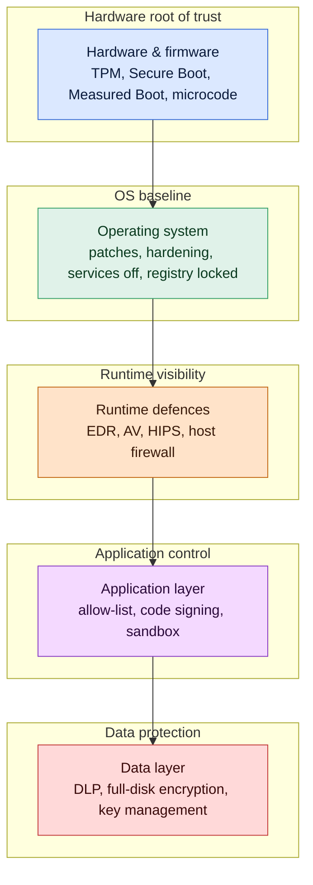

# Endpoint Security

## Why this matters

The endpoint is where users sit, where credentials are typed, where documents are opened, and where malicious email attachments first get to execute. However strong the network perimeter is, a single unpatched laptop with an outdated browser and no disk encryption can undo most of it. Endpoint security is the set of controls that tries to keep that laptop — and the thousand others like it — in a known-good state long enough for detection and response to catch an intruder before the intruder catches the crown jewels.

Endpoint security also sits closer to the user than almost any other control, which means it has to stay usable. A lockdown that keeps everything safe but makes the finance team unable to open a spreadsheet gets disabled within a week. A disk-encryption scheme with no recovery story loses data the first time a trusted platform module (TPM) fails. A patch policy that waits for "full certification" on every update leaves a known-exploited vulnerability open for three months. Good endpoint security is a balance between a hardened baseline, runtime detection, and an operational process that keeps the whole thing moving without crushing the people who rely on the machines.

This lesson walks the stack from the firmware upward: boot integrity, operating system hardening, runtime defences, data protection, and finally patch management. Examples use the fictional `example.local` organisation and the `EXAMPLE\` domain. Product categories are named neutrally — the principles travel between vendors; only the menus and the icons differ.

The questions every endpoint programme must answer for itself:

- **Integrity** — can the organisation prove a given laptop booted from software it approved, running firmware it approved, with configurations it approved?
- **Visibility** — if something malicious runs, does telemetry reach a central console fast enough to act on it?
- **Containment** — when a host is compromised, can it be isolated from the network and from sensitive data without waiting for a human to unplug it?
- **Data protection** — if the device is stolen, lost, or sent to disposal with the wrong drive still inside, is the data unreadable?
- **Recoverability** — if the endpoint is wiped, re-imaged, or replaced, how fast can the user be productive again on a clean, compliant build?
- **Coverage** — is every class of device (Windows, Linux, macOS, mobile, kiosk, server) actually enrolled, or are there islands the team forgot?

Those six questions are the spine of any defensible endpoint programme. The rest of this lesson is about the controls that answer them.

## Core concepts

Endpoint security is a stacking problem. At the bottom is the hardware and its firmware; above that sits the operating system, then the runtime and the applications, then the data. A serious endpoint programme places controls at every layer, because a control at one layer rarely blocks an attack that starts at another. The rest follows.

### Endpoint protection stack — antivirus, anti-malware, EDR and XDR

Endpoint protection is the concept of extending the security perimeter to the devices that connect to the network. No single product covers everything — modern endpoints run a stack, with each layer handling what the layer above or below cannot.

**Antivirus (AV)** products try to identify, neutralise, or remove malicious programs, macros, and files. They were originally designed to detect computer viruses; most current packages now cover viruses, worms, Trojans, ransomware droppers, and a broad class of unwanted software. Antivirus engines scan in two complementary ways. *Signature-based scanning* compares files and in-memory patterns against a dictionary of known-bad hashes and byte sequences. It is fast and precise for known threats, but it catches only what the dictionary already knows about — which is why the dictionary has to update every few hours. *Heuristic scanning* looks for suspicious behaviour and structure rather than specific signatures: encryption/decryption loops, attempts to hollow out another process, self-modifying code, or macros that spawn a command shell. Heuristics catch novel threats but generate more false positives.

**Anti-malware** is the broader term that covers everything the classical antivirus engine misses: adware, spyware, potentially unwanted programs, information stealers, and commodity trojans spread through phishing or infected sites. In practice, modern commercial products bundle antivirus and anti-malware engines together; the distinction lives on mostly in marketing material.

Antivirus and anti-malware products share a set of capabilities the buyer should insist on:

- **Automated updates** — signatures and engine components update multiple times per day without user interaction.
- **Scheduled automated scans** — full-disk and quick-scan jobs run on a rota, scoped to specific drives and file types.
- **Media scanning** — USB drives, optical media, and other removable storage are scanned automatically when attached.
- **Manual on-demand scans** — users or admins can trigger a scan of a specific file, folder, or drive.
- **Email scanning** — inbound and outbound messages and attachments are scanned before they reach the mail client.
- **Resolution options** — infected files can be quarantined, cleaned, or deleted, with configurable user prompts.

**Endpoint detection and response (EDR)** goes a layer deeper. Where antivirus asks "is this file bad?", EDR asks "is this process behaving badly?" — and keeps asking continuously, with telemetry from processes, network connections, registry changes, module loads, scripts, and child-process chains all streaming into a central console. EDR gives the analyst a searchable record of what each endpoint has done, the ability to isolate a host from the network with a single click, and automated response playbooks that can kill a process or roll back a ransomware encryption run. Most EDR products now include antivirus, anti-malware, software patching guidance, host firewall control, and some data-loss-prevention primitives in a single agent, which makes operations simpler.

**Extended detection and response (XDR)** extends the EDR model beyond the endpoint — email, identity, cloud workloads, and network telemetry feed the same correlation engine. The boundary between EDR and XDR is blurry in practice; the useful mental model is that EDR owns the endpoint story and XDR owns the cross-telemetry story.

**Unified endpoint management (UEM)** is an adjacent category focused on managing and securing a mixed fleet — desktops, laptops, smartphones, tablets, kiosks — from a single console. UEM enforces configuration baselines, pushes applications, and reports compliance; it is usually the system that lets the security team know a device even exists.

**Protection-stack summary:**

| Layer | Detects | Prevents | Responds | Best for |
|---|---|---|---|---|
| Antivirus | Known malware via signatures, some heuristics | Execution of matched files | Quarantine, clean, delete | Commodity malware, phishing attachments |
| Anti-malware | Broader unwanted software, adware, spyware | Install of matched software | Remove, block | Consumer-grade threats bundled with legit software |
| EDR | Behavioural, chain-of-events, in-memory | Process kill, isolation, rollback | Host isolation, playbook actions | Targeted attacks, lateral movement, ransomware |
| XDR | Cross-signal correlation across endpoint, email, identity, cloud | Same as EDR plus correlated controls | Unified case, cross-layer playbook | Multi-stage intrusions |
| UEM | Compliance drift, missing controls | Baseline enforcement | Push config, quarantine non-compliant | Fleet hygiene and coverage |

### Preventative controls — NGFW, host firewall, DLP, HIDS/HIPS, allow-list

Runtime detection catches what prevention missed. Prevention is still the cheaper control. A handful of preventative technologies live on or near the endpoint.

**Next-generation firewalls (NGFW)** inspect the traffic crossing them rather than only source, destination, and port. A classical firewall decides at layer 3/4; an NGFW also reads the application payload — HTTP, DNS, TLS metadata, SMB — and can block malicious content on the way in or exfiltration on the way out. NGFWs usually sit at the network edge rather than on the endpoint itself, but they are part of the endpoint's defence story because they reduce the volume of bad traffic that ever reaches the host.

**Host-based (personal) firewalls** are the on-host equivalent. Every mainstream operating system now ships one: Windows Defender Firewall on Windows, `iptables`/`nftables` on Linux, Application Firewall on macOS, `pf` on BSD. A host firewall tuned to one endpoint's actual usage pattern catches traffic a perimeter firewall cannot see — for example, a compromised laptop trying to pivot to another device on the same Wi-Fi network.

**Data loss prevention (DLP)** tries to keep sensitive data from leaving the environment without notice. On an endpoint, DLP watches file activity: copies to removable media, uploads to cloud-storage sync clients, and attachment of classified content to outbound email. Endpoint DLP is notoriously hard to tune — rulesets drift, agents hurt performance, and false positives frustrate users — so most mature programmes combine lightweight endpoint DLP with server-side DLP on mail and storage services, where the traffic is centralised.

**Host-based intrusion detection systems (HIDS)** watch host activity — file integrity, log patterns, process starts, network sockets — for signs of intrusion. Because they are tied to a single host, they can be tuned to that host's specific applications, reducing noise. A HIDS reports; it does not act. A **host-based intrusion prevention system (HIPS)** is a HIDS that can also respond — drop a connection, kill a process, reset a socket. The trade-off is that a HIPS can also respond incorrectly and take down a legitimate workflow, so tuning and a safe default posture matter.

**Application allow-list** (sometimes called application whitelisting) constrains which executables the operating system is allowed to run. Rather than listing what is forbidden — an impossible task — an allow-list enumerates what is permitted, usually by path, publisher, or cryptographic hash, and blocks everything else. Allow-lists are powerful on single-purpose machines: a database server, a kiosk, or a point-of-sale terminal has a small and well-known application set. On a general-purpose user laptop, allow-lists need careful curation and an escape hatch for legitimate new software.

### Boot and firmware integrity — UEFI Secure Boot, Measured Boot, Boot Attestation, TPM, hardware root of trust

An attacker who controls the firmware controls everything above it. Boot integrity is the characteristic of the intended hardware, firmware, and software load being in the expected state — and the ability to prove it.

**UEFI Secure Boot** is a feature of the Unified Extensible Firmware Interface that, when enabled, allows only signed drivers and operating-system loaders to run during boot. The firmware itself is signed by the manufacturer and protected against unauthorised updates by cryptographic keys held in the flash memory. Secure Boot blocks a category of attacks known as boot-level malware — rootkits that install themselves before the operating system and evade antivirus entirely. Secure Boot is supported by Microsoft Windows and all major Linux distributions.

**Measured Boot** complements Secure Boot by computing a cryptographic hash of each component that loads during boot — firmware, bootloader, kernel, initial ramdisk — and storing the resulting values in the TPM's platform configuration registers (PCRs). Rather than blocking anything up front, Measured Boot produces an evidence trail. A verifier can later ask the TPM what it measured and compare against known-good values. Measured Boot extends coverage past what the manufacturer signed.

**Boot attestation** is the reporting of that evidence. The TPM can produce a signed statement — an attestation — saying "these are the components that loaded". A remote server (a VPN gateway, a device-compliance service) can evaluate the attestation and decide whether to let the device onto the network. This is how a modern zero-trust architecture refuses admission to a device whose firmware has been tampered with, even if the user credentials are correct.

**Trusted Platform Module (TPM)** is a hardware chip on the motherboard dedicated to cryptographic operations. It generates and stores keys, produces random numbers, and exposes the platform configuration registers mentioned above. The TPM is physically separated from the hard drive and the operating system, so keys stored in it cannot be lifted by malware running in the OS. BitLocker, FileVault, and several Linux full-disk-encryption configurations use the TPM to store the disk-encryption key.

**Hardware root of trust** is the concept that if one layer of a system can be trusted by design, higher layers can chain their trust from it. Roots of trust are small, isolated, and limited to a few tasks so that the attack surface stays minimal. The TPM is one example; Apple's Secure Enclave on iOS/macOS silicon is another; signed boot ROM firmware burned into a CPU at manufacture is another. Once the root of trust has verified the first stage of boot, that stage verifies the next, and so on — a chain of trust that runs from silicon to the desktop login screen.

### Disk encryption — FDE, SED, Opal, BitLocker, LUKS

Hardening the operating system protects the data while the operating system is running. Disk encryption protects the data when it is not.

**Full-disk encryption (FDE)** encrypts every block written to the drive. When the machine is off, or before the user has logged in, the contents are unreadable without the key. Typical FDE implementations — BitLocker on Windows, FileVault on macOS, LUKS/dm-crypt on Linux — integrate with the TPM to store the disk-encryption key. On a machine with a TPM, the key is released only when the boot measurements match the expected values, meaning that pulling the drive out and plugging it into another machine does not give the attacker access.

**Self-encrypting drives (SEDs)** move the encryption into the drive controller itself. Every write is encrypted before it hits the media; every read is decrypted after the controller receives it. The encryption key never leaves the drive, which improves performance (no CPU cycles spent on cryptography) and security (the key cannot be scraped from system memory). The user or administrator provides an authentication key at boot that unlocks the drive.

**Opal** is a standard from the Trusted Computing Group for SED management. Opal-compliant drives expose a standard interface so that operating systems and security suites can enrol, lock, and unlock any Opal drive regardless of manufacturer. This gives tenants interoperability and an operating-system-independent management story.

In practice, most `example.local` laptops run **BitLocker on Windows** with TPM-backed key storage, and Linux servers run **LUKS** with a passphrase or a TPM-sealed key. macOS machines use **FileVault** in similar fashion. On the data-centre side, SEDs with Opal provide a hardware-performance path without the host operating system taking the encryption tax.

**Disk encryption options compared:**

| Option | Where encryption happens | Key storage | Performance | Typical use |
|---|---|---|---|---|
| BitLocker (software + TPM) | CPU, OS-level | TPM sealed | Good on modern CPUs | Windows laptops and desktops |
| LUKS / dm-crypt | CPU, OS-level | TPM or passphrase | Good | Linux servers and desktops |
| FileVault | CPU, OS-level | Secure Enclave | Good | macOS endpoints |
| SED (vendor) | Drive controller | On-drive, unlocked at boot | Best, no CPU cost | Servers, sensitive workstations |
| SED with Opal | Drive controller, standardised | On-drive | Best | Multi-vendor fleets |

### System hardening — attack surface reduction, registry, open ports/services, code signing, sandboxing

Hardening is the process of identifying what a system needs for its intended job and disabling everything else. The narrower the system's surface, the fewer vulnerabilities it can present now or in the future.

**Attack surface reduction** is the umbrella term. It includes closing unused ports, disabling unused services, removing default accounts, tightening file permissions, enforcing password policy, and turning off features that a given role does not need (for example, disabling Windows Script Host on machines that never run administrator scripts).

**Open ports and services.** Services on machines are accessed through TCP or UDP ports. A port that is open but not serving a useful function is a free attack surface. Map every listening port to a required service; close or block the rest. Tools like `netstat -ano` on Windows, `ss -tulpen` on Linux, and `nmap` against the host from a separate machine give the defender the same view an attacker gets during reconnaissance.

**Registry.** The Windows registry is the central repository of operating-system and application configuration. It is powerful and dangerous — unconstrained registry access gives malware an easy place to persist, hide, or elevate. Hardening the registry means applying group policies that restrict editing tools, backing up the registry on a schedule, and monitoring for writes to the usual persistence keys (`Run`, `RunOnce`, service keys, image-file-execution-options) through an EDR or a HIDS.

**Code signing** ties an executable to its publisher via a digital signature. When the operating system loader checks the signature before running the file, the user has reasonable assurance that the code came from the claimed publisher and has not been tampered with since signing. Code signing is the foundation for driver integrity on Windows, for package integrity on Linux (`rpm`, `apt` with GPG signatures), and for the allow-list policies discussed above. A hardening programme requires code signing for in-house software as well as trusting only a limited set of external publishers.

**Sandboxing** isolates a process from the rest of the system. Browsers run each tab in a sandbox so that a compromised renderer cannot read files outside the sandbox; PDF readers, document viewers, and email clients do similar. A sandbox is a boundary the attacker has to escape; every layer of boundary raises the cost of exploitation. Virtualisation is a form of sandbox for whole systems — a suspect file can be opened in a disposable VM and examined without risk to the host.

### Patch management lifecycle — inventory, categorize, test, deploy, verify

Every operating system and every application ships vulnerabilities; every vendor eventually patches them. The process that takes "a CVE was published" and ends with "every device in the estate is no longer exposed" is patch management.

**Update hierarchy.** Vendors use different names for different sizes of update. A **hotfix** is a small, targeted update for a specific problem, developed and released quickly. A **patch** is a more formal, larger update that can address several problems and sometimes adds functionality. A **service pack** is a large cumulative package that rolls up many patches and hotfixes into a single install — designed to bring a system up to the latest known-good level at once.

**The lifecycle** is a loop, not a project:

1. **Inventory** — know every device, every operating system, and every application in the estate. If the patch-management console cannot enumerate it, it will not be patched.
2. **Categorize** — classify updates by severity (critical, high, medium, low) and by whether they address an actively exploited vulnerability. Known-exploited vulnerabilities go to the front of the queue regardless of "normal" cadence.
3. **Test** — apply the update in a lab ring or to a small pilot group. Confirm the patch does not break the applications the organisation actually runs.
4. **Deploy** — roll out to progressively larger rings, typically starting with IT/security staff, moving to a broader pilot, then to the full fleet. This is the model colloquially called "Patch Tuesday ring rollout".
5. **Verify** — the patch console confirms which devices installed the update successfully and which failed. Failures are remediated — they do not sit forever in a "needs-attention" tab.

**Third-party updates** are the ones vendors other than the operating-system maker publish: browsers, PDF readers, office suites, communication clients, developer tooling. The sheer number and variety of third-party applications is the reason programmes scale poorly without dedicated tooling. A third-party patch manager (enterprise tools such as those provided by several vendors, or broader UEM platforms) covers what the OS's native update system does not.

**Auto-update** pushes the responsibility for applying the patch back to the client. Most operating systems and many applications now ship with an auto-update function that downloads and applies updates automatically. Automation is itself a security control — NIST SP 800-53 recognises it — because a manual process that relies on human discipline loses to a drive-by exploit within days of disclosure. The residual risk is that a bad update may break a legitimate workflow; the answer is ring-based rollout, telemetry on update health, and a tested rollback path.

## Endpoint defense-in-depth diagram

The diagram below reads bottom up — silicon at the base, data at the top. Each layer assumes the layers below it did their job; each layer catches what the layer above cannot see.

Read the diagram as a contract between layers. The hardware root of trust guarantees that the operating system that loaded is the one the organisation approved. The operating system baseline reduces the number of services an attacker can reach. Runtime defences assume that some malicious code will still get past prevention and aim to catch it by behaviour. Application controls stop unapproved binaries from ever running. Data protection ensures that if everything above fails — and a device is lost, stolen, or compromised — the data itself stays unreadable.

No single layer is sufficient. An EDR alone cannot protect a machine whose firmware has been rewritten. A TPM alone cannot stop a phishing download from executing in a user session. The point of defence in depth is that the cost for the attacker grows with each layer, and the probability that one of the layers produces telemetry visible to the defender grows as well.

## Hands-on / practice

Five exercises the learner can complete on a home lab, a workstation, or a small test fleet. Each produces an artefact — a policy XML, a GPO export, a firewall ruleset, a patch ring definition — that becomes part of a real portfolio.

Before starting, build the exercises on a dedicated test machine or virtual machine. Some steps (disabling services, writing firewall rules, toggling Secure Boot) can lock a user out of a production device. Tag every test artefact with `owner=<you>` and `lifecycle=lab` so cleanup is obvious.

### 1. Enable BitLocker with TPM on a Windows endpoint

Take a Windows 11 test laptop with a TPM 2.0 and enable full-disk encryption using BitLocker. Answer:

- Is the TPM present, enabled, and owned? (`tpm.msc` or `Get-Tpm` in PowerShell.)
- Where is the recovery key escrowed — a domain AD object, an Entra ID/Azure AD device record, or a printed envelope in a safe? (A recovery key no one can find is the same as no recovery key.)
- Is the encryption method XTS-AES-256? Is "used-space only" appropriate for a new drive, or do you need full-drive encryption for a reused device?
- Does Secure Boot, enabled in UEFI, combine with BitLocker so that changing the boot order triggers recovery prompts?

Export the BitLocker configuration through `manage-bde -status` and confirm the key protector is `TPM` or `TPM+PIN`, not just `RecoveryPassword`.

### 2. Deploy an EDR agent on a small test fleet

Install an EDR agent on two or three test endpoints (a Windows laptop, a Linux server, optionally a macOS machine). Register them with the management console and answer:

- Does the console see all three endpoints, reporting the expected version and the expected policy?
- Can you isolate one endpoint from the network via the console and then restore connectivity?
- Does the agent's telemetry surface a PowerShell `Invoke-WebRequest` to a suspicious URL when you run one deliberately? How quickly does the alert arrive?
- Is there a documented playbook for the three most common alerts the agent fires, so the analyst does not start from scratch every time?

### 3. Write a host-firewall rule on Windows and Linux

On a Windows endpoint, use `New-NetFirewallRule` (PowerShell) or `netsh advfirewall` to block outbound traffic to a specific IP range, except for whitelisted management ports. On a Linux server, write the equivalent `nftables` or `iptables` rules. Answer:

- Are the rules scoped to the correct profile (Domain, Private, Public) on Windows, or the correct interface on Linux?
- Is the default posture `deny` with explicit allow rules, or `allow` with explicit deny? Which does your policy actually require?
- Are logs enabled on blocks, so the SIEM can see repeated denied connections?
- Does the rule survive a reboot? (`netsh advfirewall` rules are persistent; iptables rules need `iptables-save` unless `nftables` or `firewalld` manages them.)

Export both rulesets to version-controlled files so they can be reviewed, diffed, and redeployed from infrastructure-as-code.

### 4. Write a Windows Defender Application Control (WDAC) or AppLocker allow-list policy

Pick a single-purpose machine — a database server, a kiosk, a build agent. Enumerate the executables and scripts it legitimately runs. In WDAC or AppLocker, write a policy that allows those specific publishers, paths, or hashes and blocks everything else. Answer:

- Does the policy start in `audit` mode? (It must. Enforce mode without a completed audit cycle will lock users out.)
- How long does audit run before you promote to enforce? (A week is a floor; a month is more realistic.)
- How are exceptions handled — ad-hoc approvals through a ticket, or a tightly scoped rule added by policy pipeline?
- What is the rollback path if the enforced policy blocks a critical application at 03:00?

Ship the policy via group policy or Intune, and keep the XML in a Git repository with a pull-request workflow.

### 5. Design a Patch Tuesday ring rollout

Draft a ring-based rollout plan for monthly Microsoft security updates across a fleet of roughly 1,500 endpoints. Answer:

- How many rings do you use? (Three to five is typical: pilot, early, broad, late.)
- Which teams sit in the pilot ring and accept the risk of early breakage in exchange for an early heads-up?
- What is the gate between rings — telemetry-based (no surge in errors), time-based (48 hours), or both?
- How are known-exploited vulnerabilities (those in the CISA Known Exploited Vulnerabilities catalog) handled? They typically bypass the normal rings and deploy in hours, not days.
- What is the reporting cadence to the CISO? (Weekly percentage of fleet patched by severity is the usual standard.)

Write the plan as a one-page runbook, not a slide deck. Put it in the same repository as the WDAC policy and the firewall rules so that the endpoint baseline lives as code.

## Worked example — `example.local` hardens 1,500 laptops and servers

`example.local` runs roughly 1,500 endpoints: 1,200 Windows 11 laptops used by staff across three offices, 180 Linux servers (Ubuntu LTS and Red Hat) in two data centres, 90 macOS laptops for the design and marketing teams, and 30 Windows Server hosts running Active Directory, file services, and the patch-management infrastructure. After a ransomware tabletop that surfaced multiple gaps — inconsistent BitLocker coverage, three unmanaged pilot laptops, an EDR agent missing from the Red Hat estate — the CISO approves an endpoint-hardening programme. The target is a known-good baseline, measured monthly, improving quarterly.

**Boot and firmware baseline.** Every Windows 11 laptop is procured with TPM 2.0 and UEFI Secure Boot enabled from the vendor. Measured Boot is enabled by default on Windows 11; attestation is required for VPN admission through the `EXAMPLE\vpn-gateway` service, which queries the device-compliance service before issuing a session. Servers use TPMs where available, Secure Boot on all x86_64 hosts, and signed kernel modules on Linux. Firmware patches ride on the normal patch cadence, with out-of-band updates when a manufacturer publishes a critical advisory.

**Disk encryption.** All Windows laptops run BitLocker with TPM+PIN. Recovery keys escrow to Azure AD device records and, for on-premises-joined machines, to the Active Directory object. macOS laptops run FileVault with recovery keys escrowed to the MDM. Linux servers run LUKS with TPM-sealed keys on newer hardware and passphrase-based unlocks on older servers, with the passphrase held in the enterprise secret manager with break-glass access.

**Endpoint protection stack.** A single EDR agent — which includes AV, anti-malware, a managed host firewall, and baseline DLP primitives — is deployed to every endpoint. Coverage is a KPI: the platform team publishes weekly reports showing every device in the configuration-management database that lacks the agent, and the `EXAMPLE\it-operations` team has a one-week SLA to install or decommission. On Linux servers, a HIDS (file-integrity monitoring plus log-based detection) supplements the EDR agent in the data centre, because the server baseline is more stable and file-integrity monitoring is high-value.

**Host firewall baseline.** Windows Defender Firewall is managed by group policy. The default posture is `deny` outbound with a small allow-list for business applications and managed updates, and `deny` inbound except for explicitly needed services. Linux servers run `nftables` rules deployed by configuration management (Ansible), with each server role contributing its own rule fragments. All block events are forwarded to the SIEM.

**Application control.** Windows Server hosts running single-purpose workloads — the build servers, the patch-management servers, the Active Directory domain controllers — run WDAC in enforce mode with policies generated from their audit logs and signed by `EXAMPLE\code-signing-ca`. User laptops run WDAC in audit mode only, because the productivity cost of enforce mode on general-purpose devices was judged too high at this maturity level; the audit logs feed the EDR's detection rules instead.

**OS hardening.** Every Windows endpoint runs the CIS Level 1 benchmark with a small number of documented exceptions, enforced via group policy. Linux servers run the CIS Level 1 benchmark via Ansible, with compliance reported into the configuration-management database. Open-port scans run weekly against every server from a trusted scanning host; any unexpected listener triggers a ticket to the server owner within 24 hours.

**DLP.** Endpoint DLP is deployed in monitor-only mode on Windows laptops, with hard-block rules for a short list of clearly sensitive patterns — credit-card numbers, government IDs, source code marked with the classification header. Most of the DLP work runs server-side on the mail gateway and the cloud-storage API, where volume is aggregated and false positives can be tuned centrally.

**Patch management.** Microsoft updates for Windows and the Microsoft app suite ride a four-ring cadence: pilot (IT and security staff, ~30 devices), early (engineering power-users, ~120 devices), broad (general fleet, ~1,000 devices), late (the last straggler ring, ~50 devices with application compatibility constraints). Gates are both telemetry-based and time-based: a ring does not promote if it saw a surge in application-crash telemetry, and no ring deploys within 24 hours of the previous ring. Known-exploited vulnerabilities skip the rings and deploy within 72 hours across all rings simultaneously. Linux servers patch via `unattended-upgrades` for security updates on general servers and a maintenance-window-driven `dnf/apt` rollout for kernel and critical packages. Third-party applications (browsers, PDF reader, communication client) patch through a third-party patch manager integrated with the same ring structure. Compliance is reported weekly: "% of fleet at latest security baseline, by severity and ring".

**Monitoring and response.** The EDR telemetry, HIDS events, firewall denies, and patch-status reports all feed the `EXAMPLE\secops` SIEM. Detection rules target the top ten endpoint threats from the annual tabletop (ransomware staging, credential dumping, persistence via registry, PowerShell download-cradle, Office macro spawn, unsigned driver load, unusual service install, kerberoasting, scheduled-task abuse, RDP brute force). The SOC retains 90 days of hot telemetry and one year of cold.

**User experience.** The programme keeps a user-experience budget: no single control is allowed to add more than a documented threshold of login time, boot time, or perceived application latency without a written exception. The goal is a baseline that holds for five years without repeated user complaints eroding the controls.

**Measurable outcomes after six months.** Fleet coverage reaches 99% for the EDR agent, 100% for BitLocker on Windows and FileVault on macOS, and 100% for LUKS on new Linux builds (older hosts have a remediation plan tracked by ticket). Median patch-to-deploy time for Microsoft security updates drops from 21 days to 6. The `EXAMPLE\it-helpdesk` team sees a rise in BitLocker recovery requests after the switch to TPM+PIN; a short user-education campaign plus faster recovery-key retrieval via the self-service portal brings resolution time under ten minutes.

The result is an endpoint estate whose state is knowable, whose deviations are visible, and whose recovery path is tested. No single control in the programme is novel. The combination — layered, measured, and operated — is what moves `example.local` from "best-effort hardening" to "defensible baseline".

## Troubleshooting and pitfalls

- **Assuming antivirus alone is enough.** A modern attacker will not drop a signature-matchable payload on disk. Antivirus catches commodity threats; EDR catches the targeted ones. A stack with only AV is a stack from 2005.
- **EDR agent missing from some hosts.** Coverage gaps are where adversaries live. Every build pipeline, every gold image, and every decommissioning runbook must treat the EDR agent as mandatory. Publish weekly "endpoint without agent" lists and chase them until the count is zero.
- **BitLocker without TPM, or with a weak PIN.** A BitLocker volume whose key protector is only a recovery password stored on a network share is roughly as strong as that share's access control. Use TPM or TPM+PIN; store the recovery key where only break-glass processes can reach it.
- **No recovery key escrow.** The first time a motherboard dies and a user needs their recovery key, the team will discover whether the escrow works. It is not the moment to find out the answer is "no".
- **Secure Boot disabled "temporarily" for a driver install.** Temporary almost always becomes permanent. Every Secure Boot exception must be tracked as a ticket with an expiry, and an audit rule must alert if Secure Boot is off on a device that is supposed to have it.
- **Host firewall defaulted to `allow outbound`.** Outbound is the path ransomware uses to talk to its command and control. The right default on managed endpoints is outbound-deny with an allow-list, even if it is annoying to build initially.
- **Application allow-list in enforce mode before audit completed.** An allow-list enforced without a full audit cycle will block legitimate tools and break users' workflows within hours. Always run audit for at least a sprint before promoting to enforce.
- **Registry persistence keys not monitored.** The `Run`, `RunOnce`, `Services`, and `Image File Execution Options` keys are classical persistence. If the EDR does not alert on unusual writes there, it is missing the easiest part of ransomware's playbook.
- **Unused services left running "just in case".** Services like Windows Remote Management, Telnet client, SMBv1, or a desktop sharing tool that nobody uses are attack surface. Disable them by default; justify the exceptions.
- **Disk encryption keys stored in unprotected memory.** Older implementations kept the key in RAM unprotected after unlock. Modern TPM-backed configurations keep the key handle in the TPM and protected memory. Verify your implementation; cold-boot attacks exist.
- **Patch cadence too slow.** If a known-exploited vulnerability waits three weeks for the next patch window, the organisation has chosen the attacker's speed over its own. Known-exploited goes out of band, always.
- **Third-party software not patched.** Browsers, office suites, PDF readers, and communication clients are the usual exploit path. A patch programme that only covers the OS misses most of the real threats.
- **Auto-update disabled "for stability".** Auto-update does need ring rollout and a rollback story, but disabling it entirely means the endpoint is frozen at the day the admin last touched it. That is not stability; it is ageing in place.
- **UEFI administrator password default or unknown.** If the UEFI setup is unprotected, an attacker with physical access can re-enable legacy boot and bypass Secure Boot. Set a UEFI admin password on every endpoint and escrow it.
- **HIPS rules that break more than they catch.** An over-aggressive HIPS rule can kill a legitimate service. Tune in monitor-only mode first, then promote to prevent only when false-positive rates are under control.
- **DLP that blocks legitimate work.** DLP in hard-block mode with untuned rules is the fastest way to lose executive support for the entire programme. Start in monitor, graduate specific high-confidence rules to block, and keep a visible exception process.
- **Forgetting servers.** Endpoint security tends to focus on laptops. A compromised Linux server in the data centre can be more valuable than any laptop. Servers need the same disciplines, adjusted for the stability and uptime expectations of the role.
- **Relying on a single vendor for every layer.** A layered defence with one vendor at every layer is a single supply-chain compromise away from disaster. Diversify where the operational cost is tolerable, especially between prevention and detection.
- **Hardening baselines written once and never reviewed.** CIS, STIG, and vendor baselines publish updates. A baseline from three years ago misses controls the industry added since then; review annually.
- **Measuring compliance only, not effectiveness.** "100% of laptops have EDR" is necessary but not sufficient. The next question is "did the EDR detect the last red-team exercise?" Measure outcomes, not just checkboxes.

## Key takeaways

- Endpoint security is a stack. Hardware root of trust, OS hardening, runtime detection, application control, and data protection each do something the others cannot.
- Antivirus and anti-malware catch commodity threats; EDR catches behavioural and targeted threats; XDR correlates across layers; UEM ensures every device is actually enrolled.
- Preventative controls — NGFW, host firewall, DLP, HIDS/HIPS, application allow-list — are cheaper than detection. Invest in them first.
- Boot integrity begins in hardware. UEFI Secure Boot blocks unsigned loaders, Measured Boot records what loaded, Boot Attestation reports the evidence, and the TPM stores the keys that make it all provable.
- Full-disk encryption — BitLocker on Windows, FileVault on macOS, LUKS on Linux, SEDs with Opal for hardware-based implementations — protects data when the device is off or stolen. Key storage in a TPM or Secure Enclave is what makes the encryption trustworthy.
- Hardening narrows the attack surface. Close unused ports, disable unused services, monitor the registry, require code signing, sandbox risky applications.
- Patch management is a lifecycle — inventory, categorize, test, deploy, verify — not a one-off project. Ring-based rollouts balance safety and speed. Known-exploited vulnerabilities skip the rings.
- Third-party applications are the easy attack path. A patch programme that only covers the operating system misses most of the exposure.
- Automation is a security control. Auto-update, automated compliance reporting, and policy-as-code for baselines scale to a fleet in a way a manual process cannot.
- Coverage is a KPI. Gaps — devices without EDR, laptops without BitLocker, servers without HIDS — are where adversaries hide. Measure coverage weekly.
- User experience is a constraint. A control that makes the work impossible gets disabled or bypassed. Budget the user-experience cost of each control and respect it.
- Endpoint security is never finished. Baselines age, threats change, and the fleet turns over every four to five years. The process — and the people running it — are the real control.

An endpoint programme that answers the six questions at the top of this lesson — integrity, visibility, containment, data protection, recoverability, and coverage — in writing, reviewed annually, signed by an executive sponsor, is a programme that scales. One that answers by tribal knowledge and the last person who remembers the GPO names will not survive its first incident.

## References

- NIST SP 800-53 — *Security and Privacy Controls for Information Systems and Organizations* — https://csrc.nist.gov/publications/detail/sp/800-53/rev-5/final
- NIST SP 800-123 — *Guide to General Server Security* — https://csrc.nist.gov/publications/detail/sp/800-123/final
- NIST SP 800-155 — *BIOS Integrity Measurement Guidelines (Draft)* — https://csrc.nist.gov/publications/detail/sp/800-155/draft
- NIST SP 800-147 — *BIOS Protection Guidelines* — https://csrc.nist.gov/publications/detail/sp/800-147/final
- NIST SP 800-193 — *Platform Firmware Resiliency Guidelines* — https://csrc.nist.gov/publications/detail/sp/800-193/final
- NIST SP 800-40 — *Guide to Enterprise Patch Management Planning* — https://csrc.nist.gov/publications/detail/sp/800-40/rev-4/final
- Microsoft BitLocker documentation — https://learn.microsoft.com/en-us/windows/security/operating-system-security/data-protection/bitlocker/
- Microsoft Windows Defender Application Control — https://learn.microsoft.com/en-us/windows/security/application-security/application-control/windows-defender-application-control/
- UEFI Forum — *UEFI Specifications* — https://uefi.org/specifications
- Trusted Computing Group — *TPM 2.0 Library Specification* — https://trustedcomputinggroup.org/resource/tpm-library-specification/
- Trusted Computing Group — *Storage Opal* — https://trustedcomputinggroup.org/work-groups/storage/
- CIS Benchmarks — https://www.cisecurity.org/cis-benchmarks
- DISA Security Technical Implementation Guides (STIGs) — https://public.cyber.mil/stigs/
- CISA Known Exploited Vulnerabilities Catalog — https://www.cisa.gov/known-exploited-vulnerabilities-catalog
- MITRE ATT&CK for Enterprise — https://attack.mitre.org/matrices/enterprise/
- OWASP Endpoint Security Guide — https://owasp.org/
