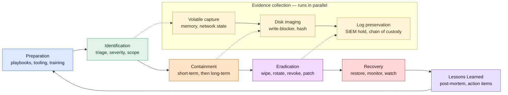

# Incident Investigation and Mitigation

## Why this matters

Every security control in the stack — the firewall, the EDR, the SIEM, the identity provider — exists to surface signals. Signals on their own do not protect anything. The work that turns a signal into a defended organisation happens after the alert fires: someone reads the alert, decides whether it is real, scopes how big it is, contains the damage, removes the foothold, and writes down what they learned. That work is incident investigation and mitigation, and the speed and quality of it determines whether the incident ends as a footnote in the monthly report or on the front page of the local newspaper.

Investigation is also where most blue teams spend their hardest hours. The detection engineers tune the alerts; the response engineers live with the consequences. A quiet alert at 03:00 about an unusual `EXAMPLE\sql-svc` login from an office IP is either a misconfigured maintenance job or the first foothold of an intrusion, and the analyst who picks it up has fifteen minutes to start figuring out which. Done well, the investigation answers four questions in order: what happened, how big is it, how do we stop it, and how do we keep it from happening again. Done badly, it answers none of them, and the organisation discovers months later that the answer was already in the logs the night the alert came in.

This lesson walks the full incident-response lifecycle as practised in `example.local` — preparation, identification, containment, eradication, recovery, and lessons learned — and the data sources, playbooks, and decision points that an effective investigation depends on. Examples use the fictional `example.local` organisation and the `EXAMPLE\` domain. Tooling is named neutrally: the principles travel between SIEM, EDR, and SOAR vendors; only the menus differ.

The questions every incident-response programme must answer for itself:

- **Speed** — from first alert to first containment action, how many minutes elapse?
- **Scope** — when an analyst declares an incident, do they know within the first hour how many accounts, hosts, and data stores are affected, or are they still guessing?
- **Evidence** — if the incident later becomes a legal matter, is the chain of custody intact and the volatile evidence preserved?
- **Containment quality** — does the containment action stop the adversary, or does it tip them off and burn the timeline?
- **Recovery confidence** — when the team brings systems back online, can they say with evidence that the foothold is gone?
- **Learning** — does the next incident benefit from the last, or does the team relearn the same lesson every quarter?

Those six questions are the spine of a defensible response programme. The rest of this lesson is about the practices that answer them.

## Core concepts

Incident response is a discipline that sits between detection and operations. It borrows vocabulary from both, and the vocabulary matters — analysts who use the words loosely produce reports nobody can read.

### Incident vs event vs alert — terminology

The terms get used interchangeably and they should not be. Precision here saves hours of confusion later.

- **Event** — any observable occurrence in a system or network. A user logged in. A process started. A packet was forwarded. Events are the raw material of monitoring; most are entirely benign.
- **Alert** — an event, or a correlated set of events, that a detection rule judged worth a human's attention. An alert is a hypothesis. It may be true positive, false positive, or duplicate.
- **Incident** — a confirmed adverse event with security impact. Someone has decided, on evidence, that something bad happened. An incident has a severity, an owner, a scope, and a ticket number.
- **Breach** — a subset of incident in which protected data left the organisation's control. Breach is a regulatory term as well as a technical one; in many jurisdictions a breach triggers notification obligations.

A useful rule: alerts get triaged, incidents get investigated, breaches get reported. Mixing the words mixes the responses.

### The IR lifecycle — NIST SP 800-61 and PICERL

NIST Special Publication 800-61 Revision 2 defines a four-phase lifecycle: Preparation; Detection and Analysis; Containment, Eradication, and Recovery; and Post-Incident Activity. The SANS Institute teaches a six-phase variant under the acronym PICERL — Preparation, Identification, Containment, Eradication, Recovery, Lessons Learned. The two are functionally identical; PICERL is easier to teach because each phase has a single name. This lesson uses PICERL.

**Preparation.** Everything done before the incident. Playbooks written, contact rosters maintained, access provisioned for the on-call analyst, evidence-collection tooling tested, legal counsel briefed, communication templates drafted, tabletops run twice a year. Ninety per cent of incident-response quality is decided in preparation. The team that improvises a containment plan at 03:00 will improvise badly.

**Identification.** The transition from "an alert fired" to "this is an incident". Triage decides severity, scopes the initial blast radius, and assigns an owner. Evidence collection begins here, because identification is the moment at which the organisation first commits to the proposition that something real is happening.

**Containment.** Action to stop the damage from spreading. Short-term containment is whatever can be done in minutes — isolate a host, disable an account, block an IP at the firewall — even if it is ugly. Long-term containment is the more considered version that lets the team operate while they investigate further: a quarantine VLAN, a separate hardened forensic image, a segmented copy of the production environment.

**Eradication.** Removal of the adversary's foothold. Wipe the affected hosts, rotate the credentials, revoke the sessions, kill the persistence mechanism, close the vulnerability that allowed entry. Eradication has to be evidence-driven; eradicating what you can see while leaving what you cannot is how organisations end up with reinfections two weeks later.

**Recovery.** Bringing affected systems back to normal operation, with monitoring tightened to detect any return. Recovery is gated on confidence that eradication was complete; rushing recovery is how the same incident reopens within a sprint.

**Lessons learned.** Post-mortem within two weeks, with a written report, root-cause analysis, and a list of action items each with an owner and a due date. Lessons learned is the only phase that creates lasting value across incidents; skipping it makes the team relearn the same lesson on the next round.

### Triage — the first 15 minutes

Triage is the analyst's first response to an alert: what is this, how serious is it, who needs to know. The first fifteen minutes set the tone for the rest of the incident.

A workable triage checklist:

- **Is the alert real?** Read the underlying detection logic. Look at the raw events the rule fired on. A surprising fraction of alerts are misconfigured rules firing on legitimate behaviour.
- **What is the severity?** Use a defined scale — a four-tier or five-tier severity, with explicit examples for each tier. Severity drives paging, escalation, and the size of the response.
- **Who is the asset owner?** A workstation, a server, an account, a database — every alert touches an asset, and that asset has an owner who needs to know.
- **Is anyone else seeing it?** Cross-reference the SIEM, the EDR, and the identity provider. A single alert is a hypothesis; correlated alerts are an incident.
- **Page the right people.** A defined paging policy — sev-1 pages the on-call lead within five minutes, sev-2 within thirty — keeps the response from stalling on "who do I call".

The output of triage is one of three states: false positive (close with reason), benign true positive (close with annotation), or incident (open a ticket and proceed to scoping).

### Scoping — how big is this

Once an alert becomes an incident, the next question is how far it spreads. Scoping answers four questions: what assets are affected, what accounts are involved, what data is at risk, and who is the actor.

- **Assets.** Start with the asset that fired the alert and pivot outward. Network neighbours, processes spawned, files written, credentials used. Each pivot adds nodes to the scope.
- **Accounts.** Whose credentials are involved? Service accounts, user accounts, machine accounts. An incident that started on one workstation often spreads through a single privileged account that was logged in there.
- **Data.** What data does the affected asset hold or have access to? PII, payment data, intellectual property, the customer database. Data scope drives regulatory and legal posture.
- **Actor.** Who is doing this? Insider error, insider malice, commodity malware, targeted attacker, automated scanner. The actor changes the playbook — a ransomware crew acts differently from a credential-stuffing botnet.

Scoping is iterative. The first scope is wrong; the third is closer; the fifth is usually defensible. Document each pivot in the ticket so the timeline can be reconstructed.

### Evidence collection — chain of custody, volatile vs non-volatile, memory before disk

Evidence is what supports the conclusions in the report and, if needed, what holds up in court. The discipline around evidence is older than computing — the principles transfer almost intact from physical investigation.

**Chain of custody** is the documented record of who handled the evidence, when, and what they did with it. Every action that touches an evidence artefact — capture, copy, transfer, analysis, storage — is logged with timestamp and operator. A break in the chain of custody is a break in the evidence's admissibility.

**Volatile vs non-volatile.** Volatile evidence disappears when the system is powered off or the process exits — RAM contents, network connections, running processes, mounted filesystems, ARP tables, DNS caches. Non-volatile evidence persists across reboots — disk files, registry hives, event logs (the on-disk parts), backup snapshots. The order of volatility matters: RFC 3227 codified the rule that the most volatile evidence is collected first, before the act of investigating destroys it.

**Memory before disk.** A live system has running processes, encrypted volumes that are unlocked, network sessions, and credentials in memory that vanish on shutdown. Memory acquisition tools — WinPMEM, LiME on Linux, AVML for cloud workloads — capture the RAM image while the system is still up. Disk imaging happens after, ideally from a powered-off device using a write-blocker, producing a forensic copy that the analyst works from while the original sits in evidence storage.

**Hashing.** Every captured artefact gets a cryptographic hash (SHA-256 is the modern default) at the moment of capture and again before each access. Hashes prove that the evidence has not been altered.

### Data sources — the logs that actually solve cases

The investigator's leverage comes from the data they can correlate. Mature programmes invest in a small set of high-value sources rather than logging everything badly.

- **Endpoint EDR telemetry** — process trees, command lines, network connections per process, file writes, registry writes, module loads. EDR is the highest-resolution source on the endpoint and the most useful single dataset in modern investigations.
- **Network NetFlow and PCAP** — NetFlow gives metadata for every flow (source, destination, port, protocol, byte count). PCAP gives full packet contents at chosen capture points. NetFlow is cheap and broad; PCAP is expensive and narrow. Use both at the choke points.
- **Identity logs** — authentication events from Active Directory, Entra ID, SAML providers, MFA tools. Identity logs answer "whose credentials moved where" and are essential for credential-theft and lateral-movement investigations.
- **Application logs** — web servers, database servers, mail servers, SaaS audit trails. Application logs answer the "what did the user do once they got in" question that infrastructure logs cannot.
- **DNS logs** — every name resolution. DNS catches command-and-control traffic that the host firewall missed and gives the cleanest signal on data exfiltration to attacker-controlled domains.
- **Threat intelligence** — IOC feeds, ATT&CK mappings, vendor reports. Intelligence is what lets the analyst recognise that "this command line is the standard way that group X stages a ransomware payload".
- **Vulnerability and inventory data** — what software is on each host, what version, what known CVEs apply. Inventory data answers "could this host plausibly have been the entry point".

Each source has its own retention horizon, its own cost, and its own quirks. The investigation is fastest when these sources are unified in a SIEM and an EDR console with cross-references that work in seconds, not in batch jobs that run overnight.

### Containment strategies — short-term isolation vs long-term

Containment trades information against damage. The longer the team observes, the more they learn about the adversary; the longer the team observes, the more damage the adversary can do.

**Short-term containment** is fast and ugly. Pull the network cable, isolate the host through the EDR console, disable the account, block the IP at the perimeter. Short-term containment buys time. It also tips the adversary off, which is sometimes acceptable and sometimes not.

**Long-term containment** is engineered. Move the affected host to a quarantine VLAN where the team can observe without the adversary spreading further. Build a parallel hardened environment for production workloads while the original is preserved for forensics. Rotate the credentials in a way that does not break recovery. The decision between short-term and long-term is a judgement call that benefits from playbooks written when the team was not under pressure.

A useful rule: when in doubt, contain. The cost of premature containment is a few hours of investigation lost; the cost of late containment is the entire estate.

### Eradication — removing the foothold without burning the timeline

Eradication is the phase where the adversary's access is removed. The job is harder than it looks because adversaries plant multiple footholds: a service account, a backdoor in a startup script, a legitimate-looking scheduled task, a stolen browser cookie that survives password rotation.

A defensible eradication checklist:

- **Wipe and re-image** affected hosts, do not "clean" them. A cleaned host is a host that may still have a foothold the team did not see.
- **Rotate credentials** — every account that touched the affected hosts, every service account that ran on them, the local admin password where it was shared. Rotate the Kerberos golden-ticket signing key (`krbtgt`) twice if domain controllers were touched.
- **Revoke sessions** — at the identity provider, at the SaaS layer, at any place that issues long-lived tokens. A rotated password without revoked sessions still leaves the adversary in the SaaS apps.
- **Close the entry point** — patch the vulnerability, fix the misconfiguration, retrain the user who clicked the phishing link, update the email gateway rule that missed the attachment.
- **Verify** — run targeted detections against the original indicators of compromise, scan the rebuilt hosts, watch the logs for the next forty-eight hours. Eradication that is not verified is not eradication.

### Recovery — bringing systems back

Recovery returns the affected systems to production with monitoring tuned to detect re-entry. The discipline here is patience: returning a host to production before eradication is verified is how the same incident reopens.

A workable recovery sequence:

- **Restore from a known-clean backup** or rebuild from gold images. Do not roll forward from the compromised state.
- **Apply the patch** that closes the entry point, before reconnecting to the network.
- **Re-enrol** in EDR, MDM, monitoring, and configuration management.
- **Add targeted detection** — write a SIEM rule for the specific indicators seen in this incident, with a longer retention than the default. The adversary may try the same path again.
- **Watch for re-entry** for at least two to four weeks, with the SOC primed for the specific patterns from this incident.

Recovery is also when communications change. The CISO talks to the board; legal talks to regulators if required; the customer-trust team prepares the public statement. None of that should be improvised.

### Lessons learned — post-mortem and action items

The post-mortem is a structured meeting within two weeks of the incident closing. The output is a written report with a fixed structure: timeline, root cause, what went well, what did not, action items, and a list of detection and prevention gaps to close. The report is reviewed by leadership and the action items are tracked to completion.

The post-mortem is blameless. The goal is to find the system failures, not to assign personal fault — analysts who fear blame will not surface the real problems, and the next incident will repeat the same gaps. Action items have owners and due dates; lessons-learned reports without due dates do not change behaviour.

### Playbooks and runbooks — pre-built decision trees

Playbooks are written in calm; they execute in chaos. A playbook for a specific scenario — phishing-with-credential-theft, ransomware on a workstation, suspected insider exfiltration — gives the on-call analyst a decision tree they can follow without inventing the steps under pressure. A runbook is the operational equivalent for a service or system: how to restart the SIEM, how to fail over the firewall, how to escalate a particular ticket.

A good playbook is one page or less, written in the imperative, and rehearsed in tabletops. Long playbooks rot; rehearsed playbooks stay current.

### SOAR — automation, briefly

Security Orchestration, Automation, and Response (SOAR) platforms execute parts of a playbook automatically: enrich an alert with threat intelligence, query the EDR for related activity, isolate a host, open a ticket, page the on-call. SOAR works best on the high-volume, low-judgement parts of triage. It scales the team's capacity rather than replacing analyst judgement. Automation that fires irreversible actions on every alert is a liability; automation that enriches and pre-stages while a human approves the action is the model that survives.

## IR lifecycle diagram

The diagram reads left to right through the six PICERL phases, with the parallel evidence-collection track running underneath the operational phases. Lessons Learned feeds back into Preparation; the loop is what makes the programme improve.

Read the diagram as a contract between phases. Preparation makes identification possible — without playbooks, the triage clock starts at zero understanding. Identification makes containment defensible — without a scope, containment is either too narrow or too broad. Containment makes eradication possible — without limiting the spread, the adversary keeps planting footholds while the team chases them. Eradication makes recovery safe — without removing the foothold, the recovered system is just a new attack platform. Lessons learned makes the next incident shorter — without it, the cycle repeats with the same gaps.

The evidence track underneath is parallel, not sequential. Memory acquisition begins the moment identification confirms an incident; disk imaging follows once containment has stabilised the host; log preservation runs throughout, because the SIEM's default retention is rarely long enough for an investigation that takes weeks.

## Hands-on / practice

Five exercises that build the muscle memory an investigation requires. Each produces an artefact — a playbook, a tabletop transcript, a memory image, a one-page brief, a post-mortem — that becomes part of a portfolio.

Run these against a dedicated lab environment or with explicit permission on test infrastructure. Touching production accounts, hosts, or data without authorisation turns the exercise into the incident.

### 1. Write a playbook for phishing with credential theft

Pick the most common scenario in modern enterprises: a user clicked a phishing link, entered credentials on a fake login page, and the adversary now has a valid session. Write a one-page playbook for the on-call analyst. Answer:

- What are the first three actions, in order, in the first ten minutes? (Hint: revoke sessions, force password reset, check MFA enrolment.)
- Which logs do you pull, and in what order? Identity provider, mail gateway, EDR on the user's host, SaaS audit logs.
- What is the trigger for declaring incident vs benign-clicked-but-no-credentials? Be explicit.
- Which stakeholders get paged at sev-2 vs sev-1, and on what timer?
- What is the recovery test that confirms the foothold is gone — a fresh login with an attempted session-replay, a token-revocation audit, a follow-up scan?

Save the playbook in the same Git repository as the rest of the IR documentation, with a review date six months out.

### 2. Run a tabletop exercise for ransomware on a file server

Convene the IR team, the IT operations lead, the legal lead, and the communications lead for a two-hour tabletop. Inject a scenario: at 14:30 on a Wednesday, the EDR fires twelve alerts within ninety seconds on the `EXAMPLE\fs-prod-01` file server, indicating mass file rename and shadow-copy deletion. Walk through:

- Triage and severity classification — how is sev-1 declared, by whom, on what evidence?
- Containment — isolate the server now, or watch for ten more minutes to scope the spread?
- Communications — when does the CFO learn, when does the customer-trust team draft a statement, when does legal involve outside counsel?
- Recovery — which backups are clean, how long does restoration take, what is the customer-facing impact?

Capture the discussion in writing. The action items from the tabletop are the input to the next quarter's preparation work.

### 3. Capture volatile memory with WinPMEM

On a test Windows endpoint, run WinPMEM (or a similar memory-acquisition tool) to capture a full RAM image. Answer:

- What is the size of the image, and where will you store images of that size during a real incident? (One laptop is 16-32 GB; a fleet of fifty is half a terabyte before compression.)
- What is the SHA-256 hash at capture, and how is it recorded in the chain-of-custody log?
- Can you open the image in Volatility 3 and list running processes, network connections, and loaded modules?
- How long did the capture take on a representative endpoint, and what was the user-visible impact during the capture?

Document the procedure as a runbook step inside the IR playbook for endpoint compromise. Memory acquisition that has never been rehearsed is memory acquisition that fails at 03:00.

### 4. Write a one-page executive brief for an active incident

Pick a scenario — credential stuffing against the SaaS portal, ransomware on a single workstation, a mid-sized supplier reporting a breach — and write the one-page brief that goes to the CISO and CFO four hours into the incident. The brief must contain:

- A two-sentence summary of what is known and what is not.
- The current scope: how many users, how many hosts, what data classes are involved.
- The actions taken in the first four hours, with timestamps.
- The decisions needed from leadership in the next four hours (legal counsel engagement, customer notification thresholds, regulator-notification clock starting).
- The next status update time.

The brief is half a page of facts and half a page of decisions. Test the format with a real executive once. Iterate.

### 5. Run a post-mortem template through a closed incident

Take a low-severity incident from the last quarter — a misconfigured firewall rule that blocked a legitimate service, an accidental password leak in a screenshot — and run the full post-mortem template against it. Capture:

- A timeline with every confirmed event, in UTC, sourced from logs.
- Root cause analysis using the "five whys" technique, going past the immediate cause to the systemic one.
- What went well — preserve the practices that worked.
- What did not — be specific, name systems and processes, not people.
- Action items, each with an owner, a due date, and a tracking ticket.
- A blameless tone throughout.

The post-mortem document is the artefact that turns experience into improvement. A team that produces these on a schedule outperforms a team that does not, every time.

## Worked example — `example.local` credential-stuffing incident

At 03:14 on a Tuesday, the SIEM at `example.local` fires a correlation rule named `auth-stuffing-burst-v3`: more than 800 failed authentications across more than 200 distinct usernames originated from a single residential-ISP IP block in the last fifteen minutes, against the public-facing Microsoft 365 tenant `example.local`. Twenty-three of those attempts succeeded.

**Triage (03:14–03:25).** The on-call SOC analyst, paged through the standard sev-2 channel, opens the alert. The detection logic is sound — same source, distributed targets, success rate above the false-positive threshold. The 23 successful authentications are the leverage point: the analyst pulls the corresponding sign-in logs from Entra ID and confirms the successes are interactive password authentications without MFA challenges. Severity is upgraded to sev-1 and the on-call IR lead is paged.

**Identification and scoping (03:25–03:55).** The IR lead opens an incident ticket and assembles the scope. Of the 23 successful authentications, 14 belong to accounts protected by Conditional Access policies that require MFA for the next session — the actor has the password but cannot complete the second factor. Nine accounts are not behind MFA; three of those have already had session tokens issued and have started accessing mailboxes. The scope is therefore three confirmed compromised accounts, all in the marketing department, all of whom were exempted from MFA two months earlier for a project that has since ended. The actor appears to be a credential-stuffing botnet using a leaked password list from an unrelated breach.

**Containment (03:55–04:20).** Short-term containment runs in parallel:

- The three confirmed compromised accounts have their passwords reset via the helpdesk break-glass process, with the user notified by phone where the contact roster has a number on file.
- Active sessions for those three accounts are revoked at the Entra ID layer, invalidating any tokens the actor was already using.
- Conditional Access is updated to require MFA for the entire `EXAMPLE\marketing` security group with no exceptions, immediately. The MFA exemption that allowed the compromise is removed from policy and added to a list for audit.
- The originating IP block is added to the named-location block list at the identity provider; future authentications from that range are denied outright.

**Eradication (04:20–05:30).** The IR team works through the foothold:

- Mailbox audit logs are pulled for the three compromised accounts, covering the window from first successful authentication through containment. Two accounts have read messages; one has forwarded a single message to an external address. The forward rule is removed and the recipient address is flagged for legal review.
- Session tokens for all three accounts are revoked again, this time with an organisation-wide token-revocation sweep on the Microsoft Graph API, to catch any tokens issued elsewhere in the four-hour window.
- The `krbtgt` account is not rotated — the incident did not touch on-premises Active Directory — but the IR lead notes the trigger conditions for that action in the ticket.
- The 14 accounts that resisted the attack thanks to MFA still have their passwords reset, because the actor has demonstrated knowledge of those passwords and they should be considered compromised even where authentication failed.

**Recovery (05:30–08:00).** Affected users get fresh passwords via the helpdesk verification process. Communications drafts a short notice for the marketing team explaining the password reset and the policy change. The CISO is briefed at 06:00 with the one-page status; the CFO is looped in at 07:00 once the scope is firm. Monitoring continues in heightened mode for 72 hours: the SOC has a saved view filtering on the three account names, the source IP block, and any successful authentication outside expected geographies.

**Lessons learned (post-mortem, completed 8 days later).** The post-mortem identifies three findings:

- **Root cause** — MFA exemption granted for a temporary project, never reviewed when the project ended. The exemption process had no expiry mechanism. **Action item:** every MFA exemption now expires automatically after 30 days unless renewed, owned by the IAM team, due in 21 days.
- **Detection gap** — the credential-stuffing rule existed but did not page the on-call lead automatically; it generated an email that the SOC analyst happened to be watching. **Action item:** sev-1 rules now page through the on-call rotation directly, owned by the SIEM engineering team, due in 14 days.
- **Process gap** — the helpdesk break-glass password-reset procedure had not been tested in eight months; the on-call analyst had to read the runbook from scratch under pressure. **Action item:** quarterly tabletop now includes a live break-glass reset against a test account, owned by the IR programme manager, due in 30 days and recurring quarterly.

**Outcome.** Three accounts were compromised for an average of 78 minutes each; one external email forward was created; no customer data was confirmed exfiltrated. The lessons-learned drive lifts marketing's MFA coverage from 92% to 100% within the action-item window, and the broader exemption-expiry policy lifts organisation-wide MFA coverage from 97% to 99.6% within 90 days. The next quarter's tabletop runs the same scenario with fresh injects and a different on-call team; the median triage time on credential-stuffing alerts drops from 14 minutes to 6.

## Troubleshooting and pitfalls

- **Treating an alert as an incident, or vice versa.** Alerts are hypotheses; incidents are confirmed. Promoting too eagerly inflates severity statistics; promoting too slowly delays response. Use a written triage rule.
- **No on-call rotation, or one that nobody trusts.** The on-call rotation must be staffed, paged reliably, and respected by the rest of the organisation. An on-call that answers in two hours is the same as no on-call.
- **Skipping evidence collection because "we know what happened".** Evidence that is not collected at the time cannot be reconstructed later. Memory in particular is gone the moment the system is rebooted. Capture first, analyse second.
- **Containing too late, hoping to learn more.** A few hours of additional observation rarely produces information that justifies the additional damage. Default toward containment and document the rationale either way.
- **Containing too early and tipping the adversary.** The opposite failure: an isolated host alerts the actor, who burns the timeline and pivots. The decision is contextual; playbooks should give the on-call a defensible default.
- **Eradication without rotation.** Wiping the host but leaving the credentials the actor stole is half a job. Every credential that touched the affected hosts is presumed compromised.
- **Recovery before verification.** Returning a host to production before eradication is verified is how the same incident reopens within a fortnight. Verification is non-negotiable.
- **No chain of custody.** If the incident later becomes a legal matter and the chain of custody is broken, the evidence may not be admissible. Log every handling action with timestamp and operator, even when the case looks technical only.
- **Skipping the post-mortem because the team is tired.** The post-mortem is the only phase that creates lasting value across incidents. A team that skips it relearns the same lesson every time.
- **Blameful post-mortems.** Analysts who fear blame stop surfacing real problems. The post-mortem must be blameless in tone and fact, focused on systemic failure, not individual fault.
- **Action items without owners or due dates.** A post-mortem report whose action items have no owner is a report that changed nothing. Track every item to completion in the same system used for normal engineering work.
- **Playbooks that have never been rehearsed.** A playbook written and filed but never run in a tabletop is a playbook that fails on first contact with a real incident. Rehearse twice a year, minimum.
- **No communication template.** When the incident is real and the executives are asking for an update every thirty minutes, the time to draft the structure of the brief has passed. Templates exist for a reason.
- **Single point of knowledge.** If only one analyst knows how to pull the relevant logs, the incident depends on that analyst being awake. Cross-train and document.
- **Logs not retained long enough.** Default SIEM retention of 30 days is too short for incidents that span weeks. Identify the high-value sources and extend retention to 12-24 months for those.
- **No threat-intel context.** An IOC without context is just a hash. Wire threat intelligence into the SIEM and EDR so the analyst sees "this is the standard staging path for group X" rather than "an unusual binary ran".
- **SOAR firing irreversible actions on flaky alerts.** Automation that auto-isolates hosts on every medium-severity alert will eventually take down a critical service. Keep humans in the loop for irreversible actions until the false-positive rate is well under control.
- **Confusing the IT incident process with the security incident process.** A user reporting a slow laptop is an IT ticket. A user reporting a phishing click is a security incident. Different processes, different SLAs, different escalation paths. Mixing them slows both.
- **Forgetting the third parties.** Many incidents touch suppliers, SaaS vendors, or managed-service providers. Their logs, their containment authority, and their notification timelines are all part of the response. Pre-negotiate the relationships.
- **Measuring mean-time-to-detect without measuring mean-time-to-contain.** Detection without containment is half the metric. The pair — MTTD and MTTC — is what shows whether the programme is improving.

## Key takeaways

- Incident response is the work that turns alerts into a defended organisation. Detection without investigation is noise.
- Use precise terminology: events, alerts, incidents, breaches. Mixing the words mixes the responses.
- The PICERL lifecycle — Preparation, Identification, Containment, Eradication, Recovery, Lessons Learned — covers every phase. NIST SP 800-61 says the same thing in four phases. Either model works; picking one and using it consistently is what matters.
- Preparation is where most of the quality is decided. Playbooks, paging, tooling, evidence procedures, tabletops — built before the incident, used during.
- Triage in the first fifteen minutes sets the trajectory. A defined severity scale, a paging policy, and a triage checklist keep the response from stalling.
- Scoping is iterative. The first scope is wrong; document each pivot so the timeline can be reconstructed later.
- Evidence collection follows the order of volatility — memory before disk, network state before logs that will rotate. Chain of custody is non-negotiable.
- Containment trades information against damage. Default toward containment when in doubt, and document the rationale either way.
- Eradication requires evidence-driven removal of every foothold — wipe hosts, rotate credentials, revoke sessions, close the entry point, verify.
- Recovery is gated on confidence. Restore from clean backups, re-enrol in monitoring, watch for re-entry, communicate clearly.
- Lessons learned creates lasting value. Blameless post-mortems with owned action items convert pain into improvement.
- High-value data sources — EDR, NetFlow and PCAP, identity logs, application logs, DNS, threat intel, inventory — solve cases. Investing in these few sources beats logging everything badly.
- SOAR scales judgement-light work; it does not replace analyst judgement. Keep humans in the loop for irreversible actions.
- Coverage is a KPI for response too. Untested playbooks, untrained on-call analysts, and unrehearsed tabletops are gaps that the next incident will find.
- Measure both detection and containment. Mean-time-to-detect and mean-time-to-contain together show whether the programme improves.

An incident-response programme that answers the six questions at the top of this lesson — speed, scope, evidence, containment quality, recovery confidence, and learning — in writing, reviewed annually, signed by an executive sponsor, is a programme that survives its first real incident. One that answers by hope and the on-call's instincts will not.

For the controls and frameworks that this response programme builds on, see the related lessons on [endpoint security](./endpoint-security.md), [log analysis](./log-analysis.md), [SIEM and monitoring tooling](../general-security/open-source-tools/siem-and-monitoring.md), [threat intelligence and malware analysis](../general-security/open-source-tools/threat-intel-and-malware.md), and [security controls](../grc/security-controls.md).

## Reference images

These illustrations are from the original training deck and complement the lesson content above.

  <figure><figcaption>Slide 1</figcaption></figure>
  <figure><figcaption>Slide 2</figcaption></figure>
  <figure><figcaption>Slide 15</figcaption></figure>
  <figure><figcaption>Slide 21</figcaption></figure>
  <figure><figcaption>Slide 23</figcaption></figure>
  <figure><figcaption>Slide 28</figcaption></figure>
  <figure><figcaption>Slide 43</figcaption></figure>
  <figure><figcaption>Slide 51</figcaption></figure>

## References

- NIST SP 800-61 Rev 2 — *Computer Security Incident Handling Guide* — [https://csrc.nist.gov/publications/detail/sp/800-61/rev-2/final](https://csrc.nist.gov/publications/detail/sp/800-61/rev-2/final)
- SANS Institute — *Incident Handler's Handbook* — [https://www.sans.org/white-papers/33901/](https://www.sans.org/white-papers/33901/)
- MITRE ATT&CK for Enterprise — [https://attack.mitre.org/matrices/enterprise/](https://attack.mitre.org/matrices/enterprise/)
- FIRST.org — Forum of Incident Response and Security Teams — [https://www.first.org/](https://www.first.org/)
- ENISA — *Good Practice Guide for Incident Management* — [https://www.enisa.europa.eu/publications/good-practice-guide-for-incident-management](https://www.enisa.europa.eu/publications/good-practice-guide-for-incident-management)
- RFC 3227 — *Guidelines for Evidence Collection and Archiving* — [https://www.rfc-editor.org/rfc/rfc3227](https://www.rfc-editor.org/rfc/rfc3227)
- NIST SP 800-86 — *Guide to Integrating Forensic Techniques into Incident Response* — [https://csrc.nist.gov/publications/detail/sp/800-86/final](https://csrc.nist.gov/publications/detail/sp/800-86/final)
- CISA — *Cyber Incident Response Playbook* — [https://www.cisa.gov/resources-tools/resources/federal-government-cybersecurity-incident-and-vulnerability-response-playbooks](https://www.cisa.gov/resources-tools/resources/federal-government-cybersecurity-incident-and-vulnerability-response-playbooks)
- Volatility Foundation — *Volatility 3* — [https://www.volatilityfoundation.org/](https://www.volatilityfoundation.org/)
- The DFIR Report — case studies of real intrusions — [https://thedfirreport.com/](https://thedfirreport.com/)
