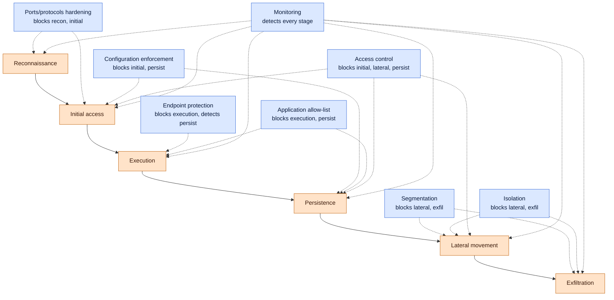

# Enterprise Mitigation Techniques

## Why this matters

Knowing how attacks work is half the job. The other half is choosing the right mitigation — the control that, when deployed and operated, actually changes whether the attack succeeds. A team that can describe Mimikatz in detail but cannot point to the configuration baseline that hardens LSASS, the segmentation rule that blocks lateral movement, or the allow-list that stops the unsigned binary running has done the homework but not the work. Mitigation is the visible output of a security programme; it is also the part auditors test.

Enterprise mitigation is not one technique but a family of eight, each addressing a different layer of the attack chain. **Segmentation** limits how far a compromise spreads. **Access control** decides who can touch what. **Application allow-listing** decides what code is permitted to run. **Isolation** keeps high-value systems away from everything else. **Monitoring** turns activity into evidence. **Configuration enforcement** keeps the baseline from drifting. **Endpoint protection** detects and contains what reaches the host. **Disabling unused ports and protocols** removes the surface attackers do not deserve.

This lesson walks each family, then layers them against an attack chain so the trade-offs are visible. Examples use the fictional `example.local` organisation and the `EXAMPLE\` domain. Product categories are named neutrally — the principles travel between vendors; only the menus differ.

The questions every mitigation programme must answer for itself:

- **Coverage** — does each of the eight families have a named owner, a written baseline, and a measurable signal?
- **Sequencing** — when the budget is fixed, which family is hardest to retrofit later, and therefore goes first?
- **Operability** — is each control reviewed by someone who reads its alerts, or is it a tick-box deployed and forgotten?
- **Compatibility** — do the controls fight one another (two AV agents, conflicting firewall rules, EDR breaking allow-list)?
- **Reversibility** — when a control breaks a legitimate workflow at 03:00, is there a documented rollback faster than "open a P1 incident"?
- **Audit-readiness** — can the team, on an hour's notice, show evidence each control is operating and that exceptions are tracked?

Those six questions are the spine of any defensible mitigation programme. The rest of this lesson is about the controls that answer them.

## Core concepts

Mitigation is a layering problem. No single family stops every attack; combinations stop most. The rest follows.

### Segmentation — VLANs, micro-segmentation, security zones

A flat network multiplies blast radius. When every host can reach every other host, a single foothold becomes a domain compromise in hours. Segmentation breaks the network into smaller pieces so that traffic between them is policed by a router, switch ACL, or firewall — and so that a compromise in one piece is bounded by what that piece can talk to.

**Physical segmentation** uses separate switches, routers, and cabling for high-sensitivity networks (cardholder data, control systems, classified). It is expensive but the boundary is undeniable. **Subnetting** divides an IP network into smaller subnetworks so devices with similar security needs can be grouped and policed at the gateway. **Virtual LANs (VLANs)** create logical segments inside a single switch, tagged at layer 2; servers, user workstations, voice phones, printers, and IoT devices each get their own VLAN, with inter-VLAN traffic routed through a firewall.

**Micro-segmentation** is the modern extension — security policy applied per workload, often per process, regardless of where the workload lives. A web tier can talk to the application tier on one port; the application tier can talk to the database tier on another; nothing else is permitted. Implementation is usually agent-based (host firewalls programmed by a central controller) or fabric-based (software-defined networking enforced by the hypervisor or smart NIC). Micro-segmentation matters in the data centre and the cloud, where physical boundaries no longer exist.

**Security zones** are the conceptual layer above the wires: production vs corporate, trusted vs untrusted, on-premises vs cloud, Tier 0 (domain controllers, PKI) vs Tier 1 (servers) vs Tier 2 (workstations). Each zone has its own admission rules and its own monitoring. A flat estate has no zones; a defensible estate has at least three or four. Read more in [Secure network design](../networking/secure-design/secure-network-design.md).

Segmentation also enables compliance — PCI DSS exempts out-of-scope networks from many requirements, and HIPAA's safeguards become enforceable rather than aspirational once data lives in a known segment.

### Access control — least privilege, RBAC vs ABAC, default-deny

Access control regulates who or what can touch which resource, under which conditions. Two main components carry it: **access control lists (ACLs)** that say what is permitted, and **permissions** on the resource itself that say at what level (read, write, execute, delete).

**Least privilege** is the rule that everyone — users, services, scripts, scheduled tasks — gets the minimum access needed for the job, and no more. A sales manager has read-only on the sales report; only the sales administrator has write. A backup service account does not need interactive logon. A web app's database user does not need to drop tables. The point is to limit what a compromise can reach, not to make legitimate work harder than it needs to be.

**Role-based access control (RBAC)** groups permissions by job role. Roles are assigned to users; permissions are assigned to roles. RBAC is easy to audit ("who is in the `EXAMPLE\finance-readonly` role?") and easy to revoke ("remove user from role"). It struggles when permissions need to depend on context — time of day, location, device posture.

**Attribute-based access control (ABAC)** answers that with a policy engine that evaluates attributes of the subject, resource, action, and environment. "Allow read on `/finance/quarterly` if the user is in `EXAMPLE\finance-staff`, the device is compliant, the connection is from a corporate IP, and it is during business hours." ABAC is more expressive and harder to operate; most mature programmes mix the two.

**Default-deny** is the posture: if no rule explicitly permits the action, the action is blocked. Network ACLs on firewalls and routers ship with an implicit deny-all, with allow rules added as exceptions. File-share permissions and identity-platform conditional access should follow the same shape. The opposite — default-allow with named denies — leaves every untracked permission open. See [AAA and non-repudiation](../general-security/aaa-non-repudiation.md) and [IAM and account management](../general-security/iam-account-management.md) for the identity side.

### Application allow-list (whitelist) — vs deny-list, WDAC, AppLocker, SELinux, code signing

An **application allow-list** enumerates what is permitted to run; everything else is blocked. A **deny-list** (block-list) does the opposite — names what is forbidden. Allow-lists are stronger because the universe of bad software is unbounded; the universe of approved software is small and knowable.

Allow-list rules typically use one of three identifiers: **path** (where the executable lives on disk), **publisher** (who signed it), or **cryptographic hash** (exact bit-for-bit identity). Hash is the most precise and the most brittle — every patch invalidates the rule. Publisher is the most operable for vendor software. Path is the easiest to bypass (an attacker drops the binary in an allowed folder).

**Windows Defender Application Control (WDAC)** is the kernel-level allow-list on Windows; policies are XML, signed by the organisation, and enforced before the loader runs the binary. **AppLocker** is the older user-mode equivalent — easier to write, weaker against motivated attackers. **SELinux** and **AppArmor** on Linux constrain what each binary can do regardless of its UID. **Code signing** is the foundation: a signed binary's publisher is verifiable, and an unsigned binary can be refused outright in policy.

The cost of an allow-list is curation. Single-purpose machines (kiosks, point-of-sale, build agents, domain controllers) have a small known software set and tolerate enforcement easily. General-purpose user laptops need an audit cycle, an exception process, and a rollback path before enforce mode. Many organisations run WDAC in audit on user laptops to feed detection rules and in enforce on servers; that is a defensible compromise.

### Isolation — sandboxing, VM/container boundary, jump host, air gap, DMZ

Isolation puts a wall between two systems so that a compromise on one side does not become a compromise on the other. The wall can be a **process sandbox** (browser tab, PDF reader), a **container** (namespace and cgroup boundary on Linux), a **virtual machine** (hypervisor boundary), a **jump host** (the only path admins are permitted to use into a restricted zone), an **air gap** (no network at all), or a **DMZ** (a buffer network between hostile and trusted).

Sandboxes are the cheapest isolation; air gaps are the strongest and the most operationally painful. The decision is which assets justify which strength. A web browser justifies a sandbox; a domain controller justifies a Tier 0 jump host with privileged access workstation (PAW) admission; an industrial control system that touches turbines justifies an air gap with one-way data diodes.

**Patching** and **encryption** are sometimes grouped with isolation because both reduce the consequences of a breach: a patched system has fewer ways in; an encrypted disk leaves stolen data unreadable. Both are covered in [Endpoint security](./endpoint-security.md).

### Monitoring — what counts as adequate, log retention, SIEM ingestion, alert tuning

Monitoring is what turns activity into evidence. Without it, the other seven mitigation families are blind — a control might be working or might be silently failing, and no one knows.

**Adequate monitoring** for an enterprise covers, at minimum: authentication events on every identity provider, process creation on every endpoint, network flow on every segment boundary, configuration change on every managed system, and DLP events on every egress path. The volumes are real — a 1,500-endpoint estate produces hundreds of millions of events per day. The point is not to read them all but to keep enough of them long enough that, when a question arises, the evidence is there.

**Log retention** balances storage cost against investigative reach. Hot retention (searchable in seconds) is typically 30 to 90 days; warm (minutes) is six months to a year; cold (hours, archived) is one to seven years depending on regulation. Retention shorter than a typical attacker dwell time — which industry studies put around 11 to 21 days — means the most important events are gone before anyone investigates.

**SIEM ingestion** centralises logs so correlation across sources is possible. The SIEM is also where **alert tuning** lives: every rule starts loud, and every false positive that survives the first week burns analyst trust. Tuning means raising thresholds, scoping to specific assets, suppressing known-good actors, and writing playbooks so that when an alert fires, the responder knows the next three moves. Read more in [Log analysis](./log-analysis.md) and [Investigation and mitigation](./investigation-and-mitigation.md).

The hard truth: monitoring without people reading the alerts is a ledger no one opens. Staffing the SOC, or paying a managed detection partner, is part of the control — not a separate item.

### Configuration enforcement — golden images, baselines, drift detection

Configuration enforcement keeps every managed system close to a written baseline, and detects when one drifts. The control has three parts: **the baseline** (what good looks like), **the deployment** (how good gets onto every system), and **the detection** (how drift gets noticed and corrected).

**Baselines** are written documents. **CIS Benchmarks** publish per-platform hardening recommendations across two levels of strictness. **STIG** (Security Technical Implementation Guides) and **DISA** publish DoD-grade baselines for Windows, Linux, network devices, databases, and applications. **Vendor baselines** (Microsoft Security Baselines, Red Hat hardening guides) cover their own platforms. An organisation picks one as the source of truth and documents the exceptions — the controls it cannot or will not apply, and why.

**Golden images** are the deployment artefact: a known-good operating system build, baselined and signed, used to provision every new system. The image is rebuilt monthly so the next deployed host is on the latest patches and the latest baseline.

**Drift detection** is the ongoing check. Configuration-management tools — **Ansible**, **Puppet**, **Chef**, **Salt** — pull the desired state from a Git repository and converge each host to it on a schedule. **MDM** (mobile device management) platforms do the equivalent for laptops and phones. When a host is found out of compliance, the tool either re-applies the baseline or raises a ticket. Manual remediation does not scale.

**Decommissioning** belongs in the same family: when a system retires, configuration enforcement says how to wipe it, what evidence to keep, and how to remove its identities and certificates. A box that nobody owns but is still on the network is a configuration the baseline did not catch.

### Endpoint protection solutions — AV, EDR, XDR

The endpoint is where users sit, attachments open, and credentials are typed. Endpoint protection turns the device into a sensor and a chokepoint.

**Antivirus (AV)** matches files against signatures and heuristics. It catches commodity threats — phishing attachments, drive-by downloads, macro malware — and is cheap, but a competent attacker will not drop a signature-matchable payload. AV alone is a 2005 control.

**Endpoint detection and response (EDR)** asks not "is this file bad" but "is this process behaving badly", with continuous telemetry from process creation, network sockets, registry, scripts, and parent-child chains streaming to a console. EDR provides isolation (one click, host off the network), playbook-driven response, and forensic timeline. Most EDR products bundle AV, anti-malware, host-firewall control, and baseline DLP.

**Extended detection and response (XDR)** correlates EDR with email, identity, cloud-workload, and network telemetry in one engine. The boundary between EDR and XDR is blurry; the useful mental model is that EDR owns the endpoint story and XDR owns the cross-telemetry story.

**When each is enough.** A homogeneous fleet of single-purpose servers with strong segmentation may be adequately protected by AV plus host-based intrusion prevention. A general-purpose user fleet with mobile users, cloud applications, and identity threats needs EDR at minimum. A multi-cloud, multi-identity, multi-platform enterprise wants XDR or something that behaves like one. The full stack and trade-offs live in [Endpoint security](./endpoint-security.md).

### Disabling unused ports and protocols — attack-surface reduction

Every listening port and every enabled protocol is attack surface. The mitigation is to disable everything not in active use.

**On Windows**, this means turning off SMBv1 (everywhere, every time, no exceptions in 2026), disabling NetBIOS over TCP/IP where DNS suffices, removing the Telnet client, scoping Windows Remote Management to administrative networks, and using `Get-NetTCPConnection` and `Get-Service` to enumerate what is actually listening. Group policy enforces the result across the fleet.

**On Linux**, the equivalents are `systemctl disable --now` for unused services, `ss -tulpen` to see what is listening, removing `xinetd`/`inetd`-managed services, refusing weak SSH ciphers, and disabling FTP/Telnet entirely. Configuration management writes the baseline; an OpenSCAP scan verifies it.

**On network gear**, this means turning off CDP/LLDP on user-facing ports, disabling unused management protocols (HTTP without HTTPS, SNMPv1/v2c, Telnet), restricting management plane to a dedicated VLAN, and shutting unused switch ports rather than leaving them in the default VLAN. The concrete protocol map lives in [Ports and protocols](../networking/foundation/ports-and-protocols.md).

The discipline applies everywhere: if the system does not need it, turn it off, and prove it stays off.

## Mitigation stack diagram

The diagram reads top to bottom along the attack chain. Each mitigation family is labelled with the kill-chain stage(s) it disrupts; together they form a layered defence where no single failure ends the game.

Read the diagram as a contract. No single mitigation covers the whole chain; **monitoring** is the only family that touches every stage, and even it depends on the others producing the events to monitor. **Ports/protocols hardening** raises the cost of reconnaissance and initial access. **Configuration enforcement** and **access control** narrow the attack surface so initial access has fewer paths. **Application allow-list** and **endpoint protection** stop execution and persistence on the host. **Segmentation** and **isolation** keep a single compromise from becoming a domain compromise.

The point of layering is that the cost for the attacker grows with each layer, and the probability that one layer produces telemetry visible to the defender grows with it.

## Mitigation vs attack mapping table

The table below maps four common attack types to the two or three mitigation families that most directly address each. It is not exhaustive — every real attack benefits from monitoring, and almost every one benefits from configuration enforcement — but the named families are the ones that change whether the attack succeeds.

| Attack | Primary mitigations | Secondary | Why it works |
|---|---|---|---|
| Phishing leading to credential theft | Access control (MFA, conditional access), Endpoint protection (link/attachment scanning), Configuration enforcement (no local admin) | Monitoring | MFA blocks the stolen-password use; EDR catches the dropper if the user clicked; baseline removes the local-admin path the dropper needed |
| Ransomware | Application allow-list, Endpoint protection (EDR with rollback), Segmentation | Monitoring, Configuration enforcement | Allow-list stops the unsigned binary running; EDR rolls back encrypted files; segmentation keeps one host's compromise from reaching file shares |
| Lateral movement (post-foothold) | Segmentation, Access control (tiered admin, no shared local accounts), Isolation (jump hosts) | Monitoring | Once inside, the attacker needs paths to crown jewels; segmentation removes the paths, tiering removes the credentials, jump hosts force admin traffic through choke points |
| Supply chain (compromised vendor binary) | Application allow-list (publisher rules), Configuration enforcement (signed updates only), Monitoring (telemetry on new processes from vendor agents) | Endpoint protection | Allow-list policies that include hash or publisher constraints catch tampered binaries; configuration enforcement refuses unsigned updates; SIEM rules flag unexpected vendor child processes |

The same exercise scales — pick any attack, name the two or three families that bend its outcome, and the lesson is the same: defence is a portfolio, not a product.

## Hands-on / practice

Five exercises the learner can complete on a home lab or a small test fleet. Each produces an artefact — a segmentation plan, a WDAC policy, a hardened-host runbook, a Sysmon configuration, an FIM rule set — that becomes part of a real portfolio.

Before starting, build the exercises on dedicated test machines or VMs. Some steps (disabling services, writing firewall rules, enforcing allow-list) can lock a user out of a production device. Tag every test artefact with `owner=<you>` and `lifecycle=lab` so cleanup is obvious.

### 1. Write a 3-VLAN segmentation plan

Design a segmentation for a 50-person `example.local` office: VLAN 10 for users, VLAN 20 for servers, VLAN 30 for IoT (printers, cameras, badge readers). Answer:

- What inter-VLAN flows are required for the office to function — print, file share, badge access, AD authentication, DNS — and what ports do they use?
- Which VLAN holds the default route, and where is the firewall between users and servers?
- What is the default posture between VLANs (deny with named allows, or allow with named denies)?
- Where is north-south traffic logged, and where east-west?
- How is a new device admitted to a VLAN — DHCP scope, 802.1X port authentication, or static MAC table?

Deliver as a one-page diagram plus an ACL table. Diff it against [Secure network design](../networking/secure-design/secure-network-design.md).

### 2. Deploy a WDAC allow-list policy in audit mode

Pick a single-purpose Windows machine — a kiosk, a build agent, a domain controller in a lab. Use WDAC Wizard to generate an allow-list policy from the binaries on disk, then deploy it in **audit** mode via group policy. Answer:

- Does the audit log (event ID 3076 for the kernel mode policy) reveal binaries you forgot — services, scheduled tasks, vendor agents?
- After a week of audit, can you promote the policy to enforce without breaking the workload?
- How are exceptions submitted — pull request to the policy repo, ticket, or ad-hoc approval?
- What is the rollback path if enforce locks out a critical service at 03:00?

Ship the policy XML to a Git repository. The repository, not a folder on someone's laptop, is the source of truth.

### 3. Harden an Ubuntu host by disabling unused services

Take an Ubuntu LTS server with the default install. Use `systemctl list-units --type=service --state=running` and `ss -tulpen` to enumerate what is running and listening. Answer:

- Which services are required for the host's role (SSH, the application, monitoring agent), and which are vestigial (CUPS, Avahi, ModemManager on a server)?
- For each vestigial service, run `systemctl disable --now <service>` and document why.
- Compare the listening-port set before and after with `ss -tulpen` exports.
- Does the same change apply to your golden image so the next deploy is hardened by default?

Capture the change as an Ansible playbook so it converges across the fleet, not just on this host.

### 4. Configure Sysmon for endpoint monitoring

Install **Sysmon** on a Windows test machine with a curated configuration (the SwiftOnSecurity or Olaf Hartong starter configs are good starting points). Answer:

- Which event IDs are most useful for detection (1 process creation, 3 network connect, 7 image load, 11 file create, 13 registry value set, 22 DNS query)?
- Are events forwarded to a central log collector via Windows Event Forwarding or an agent, or are they trapped on the host?
- Do you have a hunt query that finds PowerShell spawning `cmd.exe`, or `winword.exe` spawning a shell — classic macro malware patterns?
- Is the configuration reviewed quarterly to catch new evasion techniques?

The deliverable is the Sysmon XML and three written hunt queries.

### 5. Implement file-integrity monitoring on `/etc`

On a Linux server, deploy file-integrity monitoring (FIM) on `/etc` using **AIDE**, **Tripwire**, or your EDR's built-in FIM. Answer:

- What is the baseline — a known-good snapshot of `/etc` taken on a clean build?
- How often does FIM compare against the baseline (hourly is typical for a server, daily for a workstation)?
- When a change is detected, where does the alert go, and who reads it?
- How do you handle expected changes — a config-management run, a patch — without burying the unexpected ones?

A FIM that produces 200 alerts a day is a FIM no one reads. Tune until expected changes are filtered and unexpected ones surface.

## Worked example — `example.local` rolls out the eight families to an unsegmented small office

`example.local` runs a 90-person office on a flat /22 with one switch stack, one firewall to the ISP, and no internal segmentation. Endpoint coverage is patchy — AV on most laptops, no EDR, no allow-list, no central logging. After a tabletop where the auditors ran a domain compromise scenario in 18 simulated minutes, the CISO approves a six-month programme to roll out the eight mitigation families. Budget is fixed; sequencing matters.

**Days 0–30: monitoring and configuration enforcement first.** Without monitoring, the team cannot measure the impact of any other change. A SIEM is procured (or a managed detection partner contracted). Windows event forwarding is enabled on every domain-joined machine. Sysmon is deployed to a pilot ring. Baseline detection rules — failed logons, lateral SMB, suspicious PowerShell — are tuned for the first week of false positives. In parallel, **configuration enforcement** lands: a CIS Level 1 baseline is applied to every Windows endpoint via group policy; an Ansible role applies the equivalent to the 12 Linux servers. A golden image is rebuilt for the next deployment. Visible improvement at 30 days: the SOC can answer "did this happen" instead of "we have no logs".

**Days 30–60: ports/protocols and endpoint protection.** SMBv1 is disabled across the fleet (the file-server team confirms no consumer is left). Telnet, FTP, and the legacy print spooler driver are removed from baselines. Windows Remote Management is scoped to a management VLAN that does not yet exist but will. **EDR** is procured and deployed to every endpoint over four weeks; the existing AV is removed where the EDR replaces it (running both is asking for crashes). The `EXAMPLE\secops` SOC tunes the EDR's first hundred alerts. Visible improvement at 60 days: known-bad executions on user laptops generate alerts inside ten minutes, and the SOC can isolate a host from the network with one click.

**Days 60–120: segmentation and access control.** The flat network is broken into four VLANs — users, servers, IoT, and a management network for the firewall, switches, and patch infrastructure. Inter-VLAN traffic crosses a new internal firewall; default posture is deny. The migration is staged so each VLAN comes online with a two-week observation period; the SOC watches for legitimate traffic blocked by the new rules and tunes. **Access control** lands in parallel: the local admin password on every Windows endpoint is randomised by Microsoft LAPS; the four shared service accounts are split into named per-service accounts with rotated credentials; conditional access in the identity provider requires MFA for every admin and every external login. Visible improvement at 120 days: a phishing compromise on one user laptop no longer talks to the file server unprompted, and stolen passwords without the second factor go nowhere.

**Days 120–180: application allow-list and isolation.** **WDAC** is deployed in audit mode on every user laptop and in enforce mode on the three domain controllers, the two patch-management servers, and the build server. The audit logs from user laptops feed the SIEM and produce new detection rules. **Isolation** is the last piece: a privileged-access workstation programme means admins log into Tier 0 only from dedicated, hardened laptops; jump hosts mediate access to the server VLAN; the IoT VLAN is isolated from the rest entirely except for one allowed flow to the badge-access server. Visible improvement at 180 days: the same red-team scenario that completed in 18 minutes at the tabletop now requires the attacker to bypass three independent controls and produces telemetry at every step.

**What was deferred.** XDR (the team has EDR and a SIEM that overlap enough for now). Full DLP (monitor-mode endpoint DLP runs, but no hard blocks yet). Air-gapped backup network (planned for the following fiscal year). Documenting the deferrals — with the risk owners signing off — is part of the deliverable.

**Outcomes.** At 180 days, the same auditor-led tabletop runs again. The simulated attacker reaches the file server in 4 hours instead of 18 minutes; alerts fire in seven of the eight stages; the SOC isolates the foothold within 12 minutes. None of the controls are novel; the combination — layered, measured, operated — is what changes the result.

## Troubleshooting and pitfalls

- **Micro-segmentation breaks legitimate traffic on day one.** Segmentation always reveals a flow nobody documented. Deploy in monitor mode, watch the deny logs for two weeks, then tighten. Cutting over with no observation period guarantees an outage.
- **Allow-list breaks developer workflow.** Developers compile, install local tools, and run unsigned scripts. Enforce mode on developer laptops without an exception path is a fast way to lose engineering's support for the entire programme. Audit on developer endpoints and enforce on production servers is a defensible compromise.
- **EDR fighting AV.** Two real-time scanning engines on the same host fight over file-system hooks, eat CPU, and crash. Remove the legacy AV when the EDR rolls out, or configure exclusions explicitly.
- **Monitoring without people reading the alerts.** A SIEM with 400 unread alerts a day is a ledger no one opens. Either staff a SOC, contract a managed detection partner, or shrink the rule set to what someone actually responds to.
- **Golden images not updated for 18 months.** The image is the baseline at one moment; it needs to be rebuilt at least monthly. An old image deploys old patches and old baselines, and the first thing the new host does is fall behind.
- **"We already disabled SMBv1" said for five years.** A control without a verifying signal is a story. Run a quarterly sweep that proves SMBv1 is off; raise a ticket on every host that says otherwise.
- **Default-allow firewall on the host.** Outbound is the path C2 uses. Default-deny outbound with an allow-list is annoying to build but stops a class of egress on day one.
- **Tier 0 admins logging in from regular laptops.** A domain admin who reads email and browses the web on the same workstation hands the attacker domain admin the moment the workstation is compromised. PAW or jump host, no exceptions.
- **Configuration enforcement that only deploys, never detects.** Ansible converges hosts; it does not detect manual drift between runs. A scanner — OpenSCAP, the EDR's compliance module — must check the baseline periodically and raise tickets on deviations.
- **Allow-list enforced before audit.** Promoting WDAC or AppLocker to enforce without a full audit cycle locks users out within hours. Audit for at least a sprint; ideally a month.
- **VLANs without inter-VLAN ACLs.** A VLAN whose router routes everything is a VLAN that segments at layer 2 and not at layer 3 — useful for broadcast domains, useless for security.
- **Disabling SMBv1 but leaving SMBv2 with no signing required.** SMBv1 is the headline; SMBv2 with relay-able authentication is the actual lateral-movement path. Require SMB signing.
- **Endpoint DLP in hard-block mode without tuning.** Blocking the marketing team's attempt to send the press release because it contains "confidential" is the fastest way to lose executive support. Monitor first, tune, then graduate specific rules to block.
- **One vendor for prevention and detection.** A layered defence with one vendor at every layer is one supply-chain compromise from disaster. Diversify where the operational cost is tolerable.
- **No exception process for the allow-list.** When the developer needs a new tool, they will work around the policy if the official path is "open a ticket and wait two weeks". Make exceptions fast, named, and time-boxed.
- **Patching the OS, ignoring third-party software.** Browsers, PDF readers, communication clients, and developer tools are the dominant exploit path. Patch them with the same discipline as the OS.
- **Hardening baselines written once, never reviewed.** CIS, STIG, and vendor baselines update every year; threats move; a three-year-old baseline misses controls the industry added since. Review annually.
- **Measuring compliance not effectiveness.** "100% of laptops have EDR" is necessary but not sufficient. The next question is "did the EDR detect the last red-team exercise?" Outcomes, not checkboxes.
- **Decommissioning that leaves identities and certificates.** When a server retires, its AD object, service principal, and certificates must go too. A box that is gone but whose credentials are still valid is a ready-made foothold.
- **No one named owns the family.** Each of the eight families needs a named owner — a person, not a team. Ownership without a name diffuses until no one is responsible when the control breaks.

## Key takeaways

- Mitigation is the visible output of a security programme. Knowing attacks is half the job; choosing and operating the right control is the other half — and the part auditors test.
- The eight families are segmentation, access control, application allow-list, isolation, monitoring, configuration enforcement, endpoint protection, and disabling unused ports/protocols. Each addresses a different layer of the attack chain.
- Segmentation limits blast radius. A flat network turns a foothold into a domain compromise in hours; VLANs, micro-segmentation, and security zones break that chain.
- Access control runs on least privilege and default-deny, expressed through RBAC for the simple cases and ABAC for the contextual ones.
- Application allow-list is stronger than deny-list because the universe of bad software is unbounded. WDAC, AppLocker, SELinux, and code signing make it operable.
- Isolation is the wall between two systems. Sandboxes are cheap; air gaps are strong; jump hosts and DMZs are the workable middle.
- Monitoring is the only family that touches every stage of the chain — but only if someone reads the alerts and the retention is longer than dwell time.
- Configuration enforcement keeps systems on the baseline. Golden images, CIS/STIG baselines, and Ansible/Puppet/Chef/Salt/MDM make drift detectable and recoverable.
- Endpoint protection escalates from AV (commodity threats) to EDR (behavioural, targeted) to XDR (cross-telemetry). The right tier is the one matched to the threat model and the people running it.
- Disabling unused ports and protocols removes attack surface attackers do not deserve. SMBv1, Telnet, FTP, NetBIOS-NS, SNMPv1/v2c — turn them off, prove they stay off.
- Sequencing matters. Monitoring and configuration enforcement come first because everything else needs them. Allow-list and isolation come last because they are the most operationally expensive.
- Coverage and ownership are the real KPIs. Each of the eight families needs a named owner, a written baseline, and a measurable signal. Without all three, the family is a story, not a control.

A mitigation programme that names the eight families, owns each, measures each, and reviews each annually is a programme that scales. One that answers by tribal knowledge and the last person who configured the firewall will not survive its first incident.

## Reference images

These illustrations are from the original training deck and complement the lesson content above.

  <figure><figcaption>Slide 10</figcaption></figure>
  <figure><figcaption>Reference</figcaption></figure>
  <figure><figcaption>Reference</figcaption></figure>

## References

- NIST SP 800-53 — *Security and Privacy Controls for Information Systems and Organizations* (families AC, CM, SI) — [csrc.nist.gov/publications/detail/sp/800-53/rev-5/final](https://csrc.nist.gov/publications/detail/sp/800-53/rev-5/final)
- NIST SP 800-46 — *Guide to Enterprise Telework, Remote Access, and BYOD Security* — [csrc.nist.gov/publications/detail/sp/800-46/rev-2/final](https://csrc.nist.gov/publications/detail/sp/800-46/rev-2/final)
- NIST SP 800-114 — *User's Guide to Telework and Bring Your Own Device (BYOD) Security* — [csrc.nist.gov/publications/detail/sp/800-114/rev-1/final](https://csrc.nist.gov/publications/detail/sp/800-114/rev-1/final)
- NIST SP 800-125B — *Secure Virtual Network Configuration for Virtual Machine (VM) Protection* — [csrc.nist.gov/publications/detail/sp/800-125b/final](https://csrc.nist.gov/publications/detail/sp/800-125b/final)
- CIS Controls v8 — Control 4: Secure Configuration of Enterprise Assets and Software — [cisecurity.org/controls](https://www.cisecurity.org/controls)
- CIS Benchmarks — [cisecurity.org/cis-benchmarks](https://www.cisecurity.org/cis-benchmarks)
- DISA Security Technical Implementation Guides (STIGs) — [public.cyber.mil/stigs](https://public.cyber.mil/stigs/)
- MITRE D3FEND — Defensive Techniques Knowledge Base — [d3fend.mitre.org](https://d3fend.mitre.org/)
- MITRE ATT&CK for Enterprise — [attack.mitre.org/matrices/enterprise](https://attack.mitre.org/matrices/enterprise/)
- Microsoft Windows Defender Application Control — [learn.microsoft.com/windows/security/application-security/application-control](https://learn.microsoft.com/en-us/windows/security/application-security/application-control/)
- Microsoft Security Compliance Toolkit — [microsoft.com/download/details.aspx?id=55319](https://www.microsoft.com/en-us/download/details.aspx?id=55319)
- CISA Known Exploited Vulnerabilities Catalog — [cisa.gov/known-exploited-vulnerabilities-catalog](https://www.cisa.gov/known-exploited-vulnerabilities-catalog)
- Related lessons: [Endpoint security](./endpoint-security.md), [Investigation and mitigation](./investigation-and-mitigation.md), [Digital forensics](./digital-forensics.md), [Log analysis](./log-analysis.md), [Secure network design](../networking/secure-design/secure-network-design.md), [Ports and protocols](../networking/foundation/ports-and-protocols.md), [AAA and non-repudiation](../general-security/aaa-non-repudiation.md), [IAM and account management](../general-security/iam-account-management.md), [Security controls](../grc/security-controls.md), [Security governance](../grc/security-governance.md)
