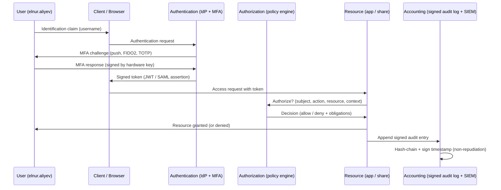

# AAA and Non-Repudiation

The [CIA triad](./cia-triad.md) tells you **what** to protect — confidentiality, integrity, availability. **AAA** answers the next three questions every system must answer about every action: *who is this?* (Authentication), *what are they allowed to do?* (Authorization), and *what did they actually do?* (Accounting). Bolted onto AAA is a fourth property — **non-repudiation** — that turns the accounting record into legally defensible proof: the actor cannot later deny that the action was theirs.

You will reach for AAA every time you design a login flow, every time you write an RBAC role, every time an auditor asks "how do you know it was Elnur?". Where CIA is the language of *risk*, AAA is the language of *access*, and non-repudiation is the language of *accountability*. Together they cover the full lifecycle of a controlled action: prove who you are, get permission, leave a tamper-evident trail.

## Why this matters

Three concrete situations make the model click:

1. A finance clerk approves a wire transfer at 23:47. The bank's auditor asks the next morning whether the clerk really pressed the button. **Authentication** says yes — they typed a password and tapped a hardware key. **Authorization** says yes — their role allowed transfers up to $50 000. **Accounting** has the timestamped log line. **Non-repudiation** is what makes the clerk unable to claim "that wasn't me" — the action was bound to a private key only they controlled, and the log was signed before it landed in the SIEM.
2. A network admin logs into a core switch using shared credentials called `admin`. Something is misconfigured at 02:00 and the network is down for an hour. The change log says `admin did it`. There is no AAA — without per-user authentication, you have no authorization model and no accountability. The shared account broke all four properties at once.
3. A SaaS customer disputes a $9 000 invoice, claiming they never clicked **I agree** on the renewal. The vendor's defence is the audit log: a TLS-protected HTTP POST from the customer's IP, signed by the customer's WebAuthn token, with a server-side signed timestamp. That stack is non-repudiation in action — and without it, the dispute is a he-said-she-said.

CIA tells you what to protect. AAA tells you who can do what. Non-repudiation gives you proof later. Skip any one of these layers and you are guessing at the next incident review.

## Core concepts

### Authentication terminology

A small vocabulary you will use every day:

- **Claim** — the assertion of an identity ("I am `EXAMPLE\elnur.aliyev`"). Anyone can make a claim; on its own it proves nothing.
- **Identification** — the act of presenting that claim to the system (typing the username, swiping the badge).
- **Authentication** — the system's verification that the claim is true (checking the password, validating the certificate, comparing the fingerprint).
- **Factor** — a category of evidence used during authentication (something you know / have / are / do / somewhere you are).
- **Credential** — the actual evidence presented (the password string, the certificate, the OTP code, the biometric template match).
- **Mutual authentication** — both sides verify each other. The client checks the server's TLS certificate; the server checks the client's mTLS certificate or token. Without mutual auth, an attacker who impersonates the server can harvest credentials.

Identification is "I claim to be Elnur." Authentication is "prove it." The two are not the same step, and confusing them is how phishing works — the attacker accepts your claim without ever proving they are the real server.

### Authentication methods and technologies

Modern enterprises mix several of these; you will rarely see only one.

| Method | What it is | Strength | Common pitfall |
|---|---|---|---|
| **Password** | A shared secret the user types. | Cheap, ubiquitous. | Reused, phished, brute-forced, leaked in breaches. |
| **PIN** | A short numeric secret, often paired with a device. | Local-only — useless without the device. | Often weak (4 digits), shoulder-surfed. |
| **Certificate** | An X.509 cert bound to a private key on the device. | Strong, mutual-auth ready. | PKI lifecycle (issuance, renewal, revocation) is hard. |
| **Smartcard / PKI card** | A card carrying a certificate; the user inserts it and enters a PIN. | Two factors at once (have + know). | Lost cards, reader compatibility. |
| **TOTP** | Time-based one-time password — code rotates every 30 s using a shared seed and the current time (RFC 6238). | Phishing-resistant against most attacks, no server roundtrip needed. | Seed leak gives the attacker the same code stream. |
| **HOTP** | HMAC-based one-time password — code increments per use (RFC 4226). | No clock dependency. | Counter desync between token and server. |
| **SMS** | A code texted to the user's phone. | Easy onboarding. | SIM-swap attacks, SS7 interception. The weakest popular factor. |
| **Push notification** | App on the phone shows "approve / deny". | Low friction. | MFA fatigue / push bombing if no number-matching. |
| **Phone call** | Voice readout of a code. | Works without smartphone. | Same SIM-swap exposure as SMS. |
| **Authenticator app** | Google Authenticator, Microsoft Authenticator, Authy — TOTP/HOTP locally on the phone. | No carrier dependency. | App seed backup hygiene. |
| **Hardware security key** | FIDO2 / WebAuthn token (YubiKey, Feitian, Token2). | Phishing-resistant by design — origin-bound. | Cost, lost-token recovery flow. |
| **Static codes** | Long-lived codes printed and stored. | Backup factor only. | Discovered, photographed, mailed. |
| **Directory service auth** | Active Directory, LDAP — the system checks the password against a central database. | Single source of truth. | One breach, every account affected. |
| **Federation** | Trust delegated to an identity provider (Google, Microsoft Entra ID, Okta) via SAML or OIDC. | Reuse strong IdP controls everywhere. | IdP outage takes everything down. |
| **Attestation** | A trusted third party (or a device's TPM) vouches for the identity / device state. | Binds auth to a known good device. | Attestation chain complexity. |

### The five factor categories

The classic three plus two attributes that often appear in modern policy engines:

1. **Something you know** — password, PIN, passphrase, security question. Cheap; the most phishable.
2. **Something you have** — hardware key, smartcard, phone running an authenticator app, certificate on the laptop's TPM. Adds physical possession to the equation.
3. **Something you are** — biometric: fingerprint, face, iris, voice, vein, gait. Hard to copy, impossible to change if compromised.
4. **Something you do** — behaviour: typing rhythm, swipe pattern, gesture. Adaptive, low friction, low strength on its own.
5. **Somewhere you are** — location: GPS, IP geolocation, network segment. Excellent as an *additional* factor for conditional access; weak on its own (VPNs spoof location).

A single factor is single-factor auth. Two from **different** categories is multi-factor auth (MFA). Two passwords is not MFA — both are the same factor and would fall to the same attack. The same applies to "two challenges, one factor": a password followed by a security question is two *something-you-knows* and offers no extra defence against a phishing page that asks for both.

Two-factor (2FA) is the common subset of MFA where exactly two categories are combined. **Step-up authentication** is the pattern where a baseline session is single-factor (browse the catalogue) and a sensitive action triggers a second factor (place the order, change the password). Step-up keeps friction low for routine work and high for the moments that matter.

### MFA attributes

When you compare MFA options, score each on these axes:

- **Strength** — how hard is it to defeat the factor? A FIDO2 key is strongest, SMS is the weakest popular option.
- **Phishing resistance** — does the factor refuse to produce a credential to a fake site? WebAuthn is origin-bound and resists phishing by construction. TOTP, push, SMS — all phishable.
- **Replay resistance** — can a captured credential be reused? OTPs and signed challenges resist replay; static passwords do not.
- **Cost** — hardware tokens cost $20-$60 each plus shipping and inventory. Authenticator apps are free but require the user's phone.
- **Friction** — every extra second at login costs aggregate productivity and pushes users toward shadow IT.
- **Recoverability** — what happens when the user loses the factor? Plan the recovery path before you roll it out, or your help-desk becomes the weakest link.

A good MFA programme picks **at least two** strong, phishing-resistant factors and treats SMS as a fallback only. Score every choice against all six axes — a factor that wins on cost and friction but loses on phishing resistance is a false economy the first time the help-desk gets a real attacker on the line.

### Biometrics deep dive

Biometric factors measure something biological that should be unique to the user. They are convenient, hard to share, and *cannot be re-issued* if the template leaks — which is the core trade-off you accept.

| Modality | What it measures | Strengths | Weaknesses |
|---|---|---|---|
| **Fingerprint** | Ridge pattern of a finger; modern sensors look for liveness (pulse, skin conductivity). | Cheap, fast, ubiquitous on phones and laptops. | Spoofable with silicone or photographic moulds; injuries change the pattern. |
| **Retina** | Blood-vessel pattern at the back of the eye; near-infrared scan. | Very high accuracy, stable for life. | Intrusive (laser near the eye), poor user acceptance, expensive readers. |
| **Iris** | Pigmentation pattern of the iris; can be photographed at distance. | Very high accuracy, contactless. | Can be captured covertly; high-resolution photos can spoof some readers. |
| **Facial** | Geometry of the face — distances between landmarks, sometimes 3D depth via IR dots. | Built into every modern phone, contactless, fast. | Twin / sibling false matches; can be unlocked by holding the phone in front of a sleeping owner. |
| **Voice** | Tonal qualities and speech patterns. | Works over the phone, hands-free. | High FAR/FRR historically; AI voice cloning now defeats most consumer systems. |
| **Vein** | Vascular pattern of the palm or finger, read with near-infrared. | Hard to spoof — pattern is internal. | Expensive sensors, slow industry adoption. |
| **Gait** | Walking pattern — stride length, speed, joint motion. | Captured at distance and passively, useful for tracking. | Changes with shoes, injury, mood; weak for one-shot auth. |

Biometric data is unique, irrevocable, and protected by [ISO/IEC 24745](https://www.iso.org/standard/75302.html) — store templates as transformed values, never raw, and keep them in hardware-backed enclaves (TPM, Secure Enclave, StrongBox) so a database leak does not become a permanent compromise.

### Biometric metrics — efficacy, FAR, FRR, CER

Every biometric system has two unavoidable failure modes:

- **False Acceptance Rate (FAR)** — the system says *yes* when it should say *no*. The wrong person gets in. This is the **security** failure.
- **False Rejection Rate (FRR)** — the system says *no* when it should say *yes*. The right person is locked out. This is the **usability** failure.

Both rates are controlled by a single threshold knob. Tighten the threshold and FAR drops while FRR rises; loosen it and the opposite happens. They cannot both go to zero.

- **Crossover Error Rate (CER)** — also called the Equal Error Rate (EER) — is the threshold setting where FAR equals FRR. CER is the single number you use to compare biometric systems: a lower CER means a better sensor and algorithm overall.
- **Efficacy rate** — the broader measure of how well the system performs in the real world, accounting for enrolment quality, environmental noise, and user demographics.

Rule of thumb: pick the threshold to push **FAR** as low as the organisation can tolerate. A user re-presenting a finger is annoying. An attacker walking in is a breach.

### Authorization models

Once you have authenticated, the system asks: *what are you allowed to do?* Five mainstream models:

| Model | How permissions are decided | Where you see it |
|---|---|---|
| **DAC — Discretionary Access Control** | The owner of a resource grants access to others. | NTFS permissions on a Windows file share, Unix `chmod`. |
| **MAC — Mandatory Access Control** | The system enforces policy based on labels (Secret, Top Secret) and clearances; users cannot override. | SELinux, military and intelligence systems. |
| **RBAC — Role-Based Access Control** | Permissions are attached to roles; users get roles. | Active Directory groups, Kubernetes Roles, AWS IAM roles. |
| **ABAC — Attribute-Based Access Control** | Access decided by a policy that evaluates attributes (user dept, resource label, time, device posture). | Azure conditional access, AWS IAM with conditions, OPA / Rego policies. |
| **ReBAC — Relationship-Based Access Control** | Access decided by relationships in a graph ("Elnur is a member of the Project Team that owns the document"). | Google Zanzibar, modern SaaS sharing models. |

Cross-cutting all five is the **principle of least privilege** — give every subject the minimum access needed to do their job, and no more. Least privilege is enforced by *design* (granular roles, short-lived tokens), by *operation* (regular access reviews), and by *culture* (admins refusing standing access in favour of just-in-time elevation).

Closely related is the **separation of duties** principle: no single role can complete a sensitive transaction end-to-end. The clerk who creates a vendor cannot also approve a payment to that vendor; the engineer who writes the code cannot also push it to production unreviewed. Separation of duties turns a fraud problem into a collusion problem, which is much harder to commit and much easier to detect.

Pair both principles with **need-to-know** — even within an authorised role, restrict access to the specific records the user must touch. A doctor in cardiology has the role to read patient records, but should only see the records of patients they actually treat. Modern ABAC and ReBAC engines make need-to-know practical at scale; legacy RBAC requires extra glue (data-tagging, dynamic groups, query-time filters).

### Accounting and audit trails

Accounting is the third A — the record of *what happened*. A useful audit trail captures, for every privileged or sensitive action:

- **Who** — authenticated subject identifier (`EXAMPLE\elnur.aliyev`, not just `admin`).
- **What** — the operation (`grant role`, `transfer funds`, `delete file`).
- **When** — UTC timestamp from a trusted clock source (NTP-synced, ideally signed).
- **Where** — source IP, hostname, geolocation if available.
- **Why** — change-ticket reference, business justification, request ID linking back to the calling system.
- **Outcome** — success, failure, error code.

Retention follows the regulatory and forensic need: 90 days hot in the SIEM is common, with one-year cold storage and seven-year archive for regulated logs (PCI, finance, healthcare). Protect log integrity with **append-only storage**, **WORM** media or **hash chaining** so an insider with ops privileges cannot quietly edit history. Logs that the operator can rewrite are not audit logs — they are diary entries.

Three operational details separate a working accounting practice from a checkbox one. First, **time synchronisation** — every host must NTP-sync to a trusted source, ideally with authenticated NTP, because timestamps are the spine of every correlation rule and every legal claim. Second, **clock skew tolerance** — when a SIEM correlates events across a hundred hosts, even a few seconds of drift turns "impossible travel" detections into noise. Third, **ingest-side authentication** — the channel from each log source to the SIEM should be mutually authenticated and encrypted; a forged log entry from a rogue device is worse than no log at all.

### Non-repudiation

**Non-repudiation** is the property that a subject cannot plausibly deny having performed an action. It is built from three pieces working together:

1. **Strong authentication** — the subject was reliably identified at the time of the action (MFA, hardware-backed credential).
2. **Integrity of the record** — the audit log entry was not modified after the fact (signed timestamps, append-only storage, hash chaining).
3. **Cryptographic binding** — the action was signed with a **private key that only the subject controlled**. A digital signature using the subject's private key gives you binding; the verifier uses the matching public key to confirm both *who signed* and *what was signed*.

When all three hold, the subject cannot say "that wasn't me" or "the log is wrong" without challenging the cryptography — which courts and auditors treat as strong evidence. The [eIDAS regulation](https://digital-strategy.ec.europa.eu/en/policies/eidas-regulation) in the EU and national e-signature laws elsewhere give qualified digital signatures the same legal weight as handwritten signatures, exactly because of these properties.

Break any of the three — shared keys, editable logs, weak auth — and non-repudiation collapses. A common failure mode is a shared signing key in CI/CD: the signature exists, but several people had the key, so it does not bind to one human.

### AAA in the wild

Four protocols carry most enterprise AAA traffic:

- **RADIUS** ([RFC 2865](https://datatracker.ietf.org/doc/html/rfc2865)) — Remote Authentication Dial-In User Service. UDP-based, widely used for VPN, Wi-Fi (WPA2/3 Enterprise via 802.1X), and network device login. Authentication and authorization are bundled in one round trip.
- **TACACS+** ([RFC 8907](https://datatracker.ietf.org/doc/html/rfc8907)) — TCP-based, originally Cisco. Separates authentication, authorization, and accounting into three independent message flows, which is why network admins prefer it for fine-grained command authorization on switches and routers.
- **Diameter** — RADIUS's successor for telco / 4G / 5G networks. TCP/SCTP, reliable, supports much larger attribute sets.
- **Kerberos** — the AD workhorse. Ticket-based authentication using a Key Distribution Center (KDC). The user authenticates once and receives a Ticket-Granting Ticket (TGT) that gets exchanged for service tickets without re-typing the password.

### Cloud vs on-premises AAA — the SAML/OIDC bridge

On-premises AAA was historically Active Directory plus RADIUS plus a smartcard reader. Cloud apps speak different protocols, and the bridge between the two is **federation**:

- **SAML 2.0** — XML-based assertions. The IdP (Active Directory Federation Services, Okta, Microsoft Entra ID) signs an assertion that says "this user authenticated, here are their attributes." The cloud app trusts the IdP's signature.
- **OIDC** — OpenID Connect on top of OAuth 2.0. JSON tokens (JWTs), better suited to mobile and SPA apps, dominant in modern SaaS.

A modern AAA design puts a single identity provider in the middle: AD or Entra ID for identity, MFA enforced centrally, conditional access policies (device posture, location, risk score), and federation tokens to every downstream cloud and on-prem app. Kerberos still authenticates inside the domain, RADIUS still gates the Wi-Fi and VPN, but everything flows from one source of truth. Pair with the [IAM and MFA tooling lesson](./open-source-tools/iam-and-mfa.md) and the [secrets and PAM lesson](./open-source-tools/secrets-and-pam.md) for the operational layer, and with [Active Directory Domain Services](../servers/active-directory/active-directory-domain-services.md) for the on-prem identity foundation.

## AAA flow diagram

Authentication produces a token. Authorization consumes it. Accounting records the outcome. Non-repudiation comes from the audit entry being **signed and chained** so it cannot be edited later without detection — that is the difference between a log and an audit log.

## Hands-on: practice

Five exercises sized for a couple of hours each. They reinforce the pieces above without needing a lab beyond a laptop.

### Exercise 1 — Compute the CER from FAR/FRR pairs

You are evaluating two fingerprint sensors. The vendor publishes the following measurements at different threshold settings (threshold 1 = strictest, 5 = loosest):

| Threshold | Sensor A FAR | Sensor A FRR | Sensor B FAR | Sensor B FRR |
|---|---|---|---|---|
| 1 | 0.001 % | 8.0 % | 0.005 % | 6.0 % |
| 2 | 0.01 %  | 4.0 % | 0.05 %  | 3.0 % |
| 3 | 0.1 %   | 1.0 % | 0.4 %   | 0.4 % |
| 4 | 1.0 %   | 0.1 % | 2.0 %   | 0.05 % |
| 5 | 5.0 %   | 0.01 %| 7.0 %   | 0.005 % |

Find the CER (where FAR meets FRR) for each sensor, and recommend one for a finance-team turnstile where false acceptance is a much worse outcome than a re-tap.

### Exercise 2 — Configure RADIUS for switch admin login

On a lab Cisco or open-source FreeRADIUS setup, configure the network device to authenticate admin logins against a RADIUS server backed by Active Directory. Verify three things: (1) successful login is logged with the AD user identifier, not a shared `admin` account; (2) failed login attempts are logged and rate-limited; (3) the shared secret between the switch and the RADIUS server is rotated and stored only in your secrets manager, not in the running config of the switch.

### Exercise 3 — Design an RBAC role for a 3-tier app team

A new team owns a three-tier application: a public web tier, a private API tier, and a database tier. Design four roles (`webops`, `appdev`, `dba`, `sre`) and decide for each:

- Which environments (dev / staging / prod) they have which kind of access in.
- Whether prod access is **standing** or **just-in-time** through a PAM tool.
- Which actions they can do **without** an approval (least privilege) and which require change-management approval.
- How break-glass elevation is logged and reviewed.

Document the result as an authorization matrix that fits on one page.

### Exercise 4 — Produce a non-repudiable digital signature

Generate a key pair (`openssl genrsa -out signer.key 4096` and a matching CSR), sign a contract PDF with the private key, then verify the signature with the public key. Then break it deliberately: edit one byte of the PDF, re-verify, and observe that the signature now fails. Write a one-page explanation of why this stack — private key + signature + integrity check — is what makes the signature non-repudiable, and what would break that property (shared key, weak hash, missing timestamp).

### Exercise 5 — Review a logging / SIEM config for completeness

Pick one application or service in your lab — a domain controller, a web server, a cloud account — and audit its logging against this checklist:

- Authentication successes and failures recorded with subject, source IP, and timestamp.
- Authorization decisions for sensitive actions (admin commands, data exports, privilege grants) recorded.
- Logs forwarded to a central SIEM within seconds, with TLS and message authentication.
- Retention policy meets regulatory needs (90 days hot, one year warm, seven years cold for regulated data).
- Log files protected against tampering by ops staff (append-only, separate write account, hash-chained or signed).

Write up the gaps you find and the controls that would close them.

## Worked example: rolling out modern AAA at example.local

`example.local` is the same 80-person firm from the [CIA triad lesson](./cia-triad.md). They have a working Active Directory, smartcards on a few finance laptops, and SMS-based MFA for the VPN. They want to rebuild around a single modern identity stack over the next two quarters.

### Target architecture

- **SSO** — Keycloak deployed on the Hyper-V cluster, federated to Active Directory for the source of identity. Every internal app (`portal.example.local`, internal Jira, Confluence, internal SaaS) authenticates through Keycloak using OIDC.
- **MFA** — WebAuthn (FIDO2) for engineers and admins; TOTP via Microsoft Authenticator for everyone else; SMS only as a recovery factor.
- **Network admin login** — FreeRADIUS authenticates to Active Directory for switch and firewall admin login, replacing the shared `admin` account on every device.
- **Wi-Fi** — WPA3 Enterprise with 802.1X, RADIUS-backed certificate auth for company-owned laptops.
- **Privileged access** — a PAM tool (Teleport, HashiCorp Boundary, or open-source equivalent) issues short-lived certificates for SSH and database access; no long-lived SSH keys on engineer laptops. See the [secrets and PAM lesson](./open-source-tools/secrets-and-pam.md) for the operational layer.
- **Accounting** — every Keycloak login, RADIUS auth, PAM session, and admin command lands in a central SIEM (Wazuh, Splunk, or ELK). The SIEM ingest pipeline TLS-protects the channel and signs each record.
- **Non-repudiation** — high-value transactions in the finance app (transfers > $5 000, contract approvals) are signed with the user's WebAuthn key and the resulting signature is stored in append-only object storage with a server-side trusted timestamp.

### Rollout phases

1. **Quarter 1 — identity consolidation.** Stand up Keycloak. Federate to AD. Migrate `portal.example.local` and one internal app first. Issue WebAuthn keys to the IT and engineering teams. Enable conditional access (block logins from unexpected countries, require compliant device for admins).
2. **Quarter 1 — accounting backbone.** Deploy the SIEM. Forward AD security logs, Keycloak events, and firewall logs. Define retention and write the first three detection rules (impossible travel, password spray, MFA fatigue).
3. **Quarter 2 — network and privileged access.** Roll out FreeRADIUS to switches and firewalls. Decommission the shared `admin` account. Deploy the PAM tool. Migrate engineers from long-lived SSH keys to short-lived certs.
4. **Quarter 2 — non-repudiation.** Add WebAuthn-based signing to the finance app for high-value transfers. Wire signed audit entries into immutable storage. Test the flow end-to-end with a mock dispute.

### Controls mapped to AAA

| Control | A — Authn | A — Authz | A — Acct | Non-repudiation |
|---|---|---|---|---|
| Keycloak SSO + WebAuthn | Strong | Issues claims for downstream | Login events to SIEM | Hardware key binding |
| FreeRADIUS for switches | Per-user AD auth | TACACS+-style command authz (planned) | Login attempts to SIEM | User-identifiable trail |
| PAM tool short-lived certs | mTLS to bastion | Role-bound session policy | Full session recording | Replay-evident transcripts |
| Signed finance transactions | WebAuthn at button-press | RBAC role check | Append-only audit | Cryptographic binding to user |
| SIEM with hash-chained ingest | n/a | n/a | Yes | Tamper-evident logs |

That is what "modern AAA" looks like at a small company — not one product, but a coherent stack where every action has an authenticated actor, an authorization decision, an audit record, and (for the actions that matter) a signature that nobody including the owner can repudiate.

### Success metrics for the rollout

The board will not read the architecture diagram, but they will read four numbers that prove the rollout is working:

- **MFA coverage** — percentage of human accounts with phishing-resistant MFA enrolled. Target 100 % for admins by end of Q1, 95 %+ for all employees by end of Q2.
- **Standing privilege** — number of accounts holding always-on admin rights. Target a 90 % reduction by end of Q2 as PAM short-lived certs replace permanent grants.
- **Mean time to log** — seconds from event to landing in the SIEM. Target under 60 seconds for security-critical sources; longer means detections fire too late.
- **Audit completeness** — percentage of business-critical actions (logins, role changes, transfers, data exports) with a signed and chained audit entry. Target 100 % for high-value transactions; partial coverage means a partial defence in disputes.

## Troubleshooting and pitfalls

- **Weak biometric thresholds** — sensors shipped with a default threshold that prioritises usability. For finance and admin access, tighten the threshold so FAR is well below 0.01 %. A grumpy user re-tapping is cheaper than an attacker walking in.
- **MFA fatigue / push bombing** — attackers spam push prompts until the user taps approve. Defeated by **number matching** (user types a code shown on the login screen) and by rate-limiting prompts per user per hour.
- **Shared service accounts breaking accountability** — `admin` shared by the whole network team destroys the third A. Replace with per-user RADIUS / TACACS+ auth and break-glass accounts that trigger an alert when used.
- **Audit logs writeable by ops staff** — if the same admins who can break the system can also rewrite the log, you have no audit trail. Send logs to a separate account / tenant, append-only, ideally with WORM or hash-chained storage.
- **Replay attacks on legacy auth** — NTLMv1, plain RADIUS without Message-Authenticator, unsigned SAML responses. Disable NTLMv1, require Message-Authenticator on RADIUS, sign and validate every SAML assertion.
- **Stolen sessions vs stolen passwords** — once an attacker has a valid session cookie or refresh token, they bypass MFA entirely. Mitigate with short token lifetimes, token binding to the device, and re-authentication for sensitive actions.
- **Cloud SSO without conditional access** — federated SSO with no device or location checks is a single key for every cloud app. Layer in conditional access (managed device, known network, low risk score) before claiming "we use SSO".
- **Biometric template theft** — a leaked fingerprint template is permanent: the user cannot grow new fingers. Store templates as transformed biometric cryptosystems per [ISO/IEC 24745](https://www.iso.org/standard/75302.html), keep them in hardware enclaves, and never centralise raw biometric data.
- **Broken non-repudiation when the signing key is shared** — a CI/CD signing key held by three engineers gives you the *form* of a signature without the *substance* of binding. Use per-user keys backed by hardware (HSM, smartcard, FIDO2) or attested workload identities for automation.
- **TOTP seed leak through QR-code screenshots** — the seed printed under the QR code travels to wherever the screenshot lands (Slack, support tickets, photo backups). Treat seeds as passwords, never paste them outside the device that will hold them.
- **SMS as a strong factor** — SIM-swap and SS7 interception both defeat SMS. Use it as a recovery factor only; never as the primary second factor for admin or finance access.
- **Help-desk credential reset becoming the weakest link** — an attacker calls the help-desk, sounds confident, gets a password reset. Enforce identity verification scripts (callback to a registered number, video verification, manager confirmation) and log every reset to the SIEM.
- **Standing privileged access** — admins logged in 24/7 with full rights are a long-lived target. Move to just-in-time elevation through a PAM tool; require approval and time-box the session.
- **Federation IdP outage taking everything down** — when the IdP is down, every federated app is down. Monitor the IdP, plan for a break-glass local account on critical systems, and run a tabletop on "what if SSO is unavailable".
- **Implicit deny disabled on cloud IAM** — explicit allows without an underlying default-deny is how secrets buckets become public. Confirm that the policy stack ends in a deny-by-default and audit explicit allows quarterly.
- **Browser-stored passwords mistaken for MFA** — autofill is convenience, not a factor. Users who think the browser "remembers" them are running single-factor.
- **Re-using the same hardware key without backup** — when the only YubiKey is lost, the user is locked out for hours. Issue two keys per privileged user; register both at enrolment.
- **Audit gap at the application layer** — infrastructure logs only show the login. The *what* — which row was changed, which file was downloaded — needs application-level logging. Audit your business-critical apps for accounting completeness, not just the OS.

## Quick-reference glossary

| Term | One-line meaning |
|---|---|
| **AAA** | Authentication, Authorization, Accounting — the access-control trio. |
| **MFA** | Multi-Factor Authentication — two or more factors from different categories. |
| **2FA** | Two-Factor Authentication — the two-factor subset of MFA. |
| **FIDO2 / WebAuthn** | Phishing-resistant, origin-bound public-key authentication standard. |
| **TOTP / HOTP** | Time-based / HMAC-based one-time passwords (RFC 6238 / RFC 4226). |
| **FAR** | False Acceptance Rate — wrong person accepted (security failure). |
| **FRR** | False Rejection Rate — right person rejected (usability failure). |
| **CER / EER** | Crossover / Equal Error Rate — threshold where FAR equals FRR. |
| **DAC / MAC / RBAC / ABAC / ReBAC** | Authorization models — discretionary, mandatory, role-, attribute-, relationship-based. |
| **Least privilege** | Subjects get the minimum access needed, no standing extras. |
| **Separation of duties** | No single role completes a sensitive transaction end-to-end. |
| **RADIUS / TACACS+ / Diameter / Kerberos** | The four AAA protocols carrying most enterprise traffic. |
| **SAML / OIDC** | The two federation protocols bridging on-prem identity to cloud apps. |
| **PAM** | Privileged Access Management — short-lived, audited admin access. |
| **Non-repudiation** | Property: the actor cannot plausibly deny having performed the action. |
| **WORM** | Write Once Read Many — storage that cannot be edited after write. |

## Key takeaways

- AAA answers the access-control questions CIA cannot: who is this, what may they do, what did they do.
- Authentication is built from factors: something you know / have / are / do / somewhere you are. MFA combines two from **different** categories.
- Phishing-resistant factors (FIDO2, WebAuthn, smartcards) are the modern baseline for privileged access; SMS is a fallback only.
- Biometric quality is summarised by the **Crossover Error Rate** — pick the threshold to push **FAR** as low as your users can tolerate, because false acceptance is the security failure.
- Authorization models (DAC, MAC, RBAC, ABAC, ReBAC) all serve **least privilege**; the model is a tool, the principle is the goal.
- Accounting only counts as audit if the operator cannot edit it — append-only storage, hash chaining, signed timestamps.
- **Non-repudiation** stands on three legs: strong auth, integrity of the record, cryptographic binding to a private key the user controlled. Break any leg and the property collapses.
- A modern enterprise AAA stack federates one identity source to everything: AD or Entra ID, RADIUS for the network, OIDC/SAML for apps, PAM for privilege, SIEM for accounting.

## References

- [NIST SP 800-63B — Digital Identity Guidelines: Authentication and Lifecycle Management](https://pages.nist.gov/800-63-3/sp800-63b.html)
- [NIST SP 800-118 — Guide to Enterprise Password Management (Draft)](https://csrc.nist.gov/pubs/sp/800/118/final)
- [FIDO Alliance — FIDO2 / WebAuthn specifications](https://fidoalliance.org/fido2/)
- [W3C Web Authentication (WebAuthn) Level 3](https://www.w3.org/TR/webauthn-3/)
- [RFC 2865 — Remote Authentication Dial In User Service (RADIUS)](https://datatracker.ietf.org/doc/html/rfc2865)
- [RFC 8907 — The Terminal Access Controller Access-Control System Plus (TACACS+) Protocol](https://datatracker.ietf.org/doc/html/rfc8907)
- [RFC 6238 — TOTP: Time-Based One-Time Password Algorithm](https://datatracker.ietf.org/doc/html/rfc6238)
- [eIDAS Regulation — Electronic Identification and Trust Services](https://digital-strategy.ec.europa.eu/en/policies/eidas-regulation)
- [ISO/IEC 24745 — Biometric Information Protection](https://www.iso.org/standard/75302.html)
- [OWASP Authentication Cheat Sheet](https://cheatsheetseries.owasp.org/cheatsheets/Authentication_Cheat_Sheet.html)
