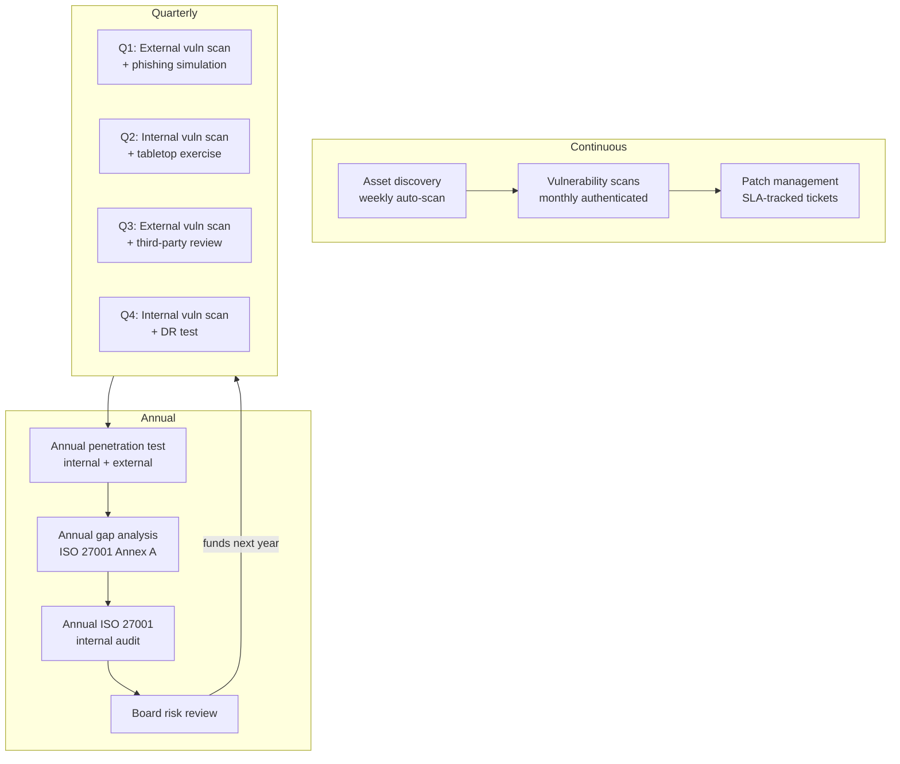

# Organizational Security Assessment

A **security assessment** is a structured, time-boxed engagement whose job is to answer one question: *what is the gap between the security posture this organization claims to have and the one it actually has?* It is not a single test and it is not a single tool — it is a process that frames a target, gathers evidence about it, rates the findings against business impact, and hands the business a prioritised plan it can actually execute.

That definition is deliberately broader than the things people often confuse it with. A **vulnerability scan** is one input — it tells you what unpatched software is reachable, but it does not tell you whether the missing patch matters to the business. A **penetration test** is one technique inside an assessment — it proves a vulnerability is exploitable, but it does not by itself review policy, training, or third-party risk. A **compliance audit** answers "do you meet the control text in this standard?" — which can be true while the company is still trivially breachable. A real assessment uses scans, manual testing, document review, and interviews together, weighs the findings against the way the company actually makes money, and produces something the executive team can sign off on, fund, and track to closure.

This lesson is the *process* half of the security-assessment material. The companion lesson on [Security Tools — The Working Toolkit](./security-tools.md) is the catalogue of utilities you reach for inside each phase. Read them in either order; in real engagements you will move between them constantly.

## The five assessment types side by side

There are six common engagement shapes — gap analysis, risk assessment, vulnerability assessment, penetration test, compliance audit, and red-team exercise. They overlap, and the same firm will run several of them in a year, but they answer different questions and they cost very different amounts. Picking the wrong shape is the single most common reason assessments fail to land: a board that asked for "a pentest" and got a 200-page compliance binder will not fund another one.

| Type | Question it answers | Scope | Depth | Output | Typical cost (USD) | Typical duration |
|---|---|---|---|---|---|---|
| Gap analysis | "How far are we from framework X?" | Whole control set (e.g. ISO 27001 Annex A, NIST CSF) | Document and interview review | Control-by-control gap matrix, roadmap | 5k–25k | 2–4 weeks |
| Risk assessment | "Which risks deserve money first?" | Crown-jewel assets and processes | Workshop-driven, qualitative + quantitative | Risk register with likelihood × impact | 8k–40k | 3–6 weeks |
| Vulnerability assessment | "What unpatched/misconfigured stuff is reachable?" | Network ranges, hosts, web apps | Mostly automated scans, light validation | Ranked findings list per asset | 3k–15k | 1–2 weeks |
| Penetration test | "Can an attacker actually get in and reach value?" | Defined targets and scenarios | Manual exploitation, chained attacks | Attack narrative, evidence, fixes | 15k–80k | 2–4 weeks |
| Compliance audit | "Do we meet the standard's text?" | Control set in scope (PCI-DSS, ISO, HIPAA) | Evidence-driven, formal testing | Pass/fail report, certificate, RoC | 20k–150k | 4–12 weeks |
| Red-team exercise | "How well does our blue team detect a real adversary?" | Whole estate, including people | Adversary emulation over weeks/months | Detection gap report, killchain story | 60k–300k | 6–12 weeks |

A useful rule of thumb: a healthy programme runs **gap analysis and risk assessment annually**, **vulnerability assessment quarterly**, **penetration test at least annually** for any internet-facing system, **compliance audits on the cadence the regulator demands**, and a **red-team exercise once your blue team is mature enough to learn from it** — usually year three or four.

Two failure modes appear repeatedly when a customer picks the wrong shape:

- **Bought a pentest, needed a vulnerability assessment.** A pentester chains attack paths and reports five exploit narratives. The customer wanted a list of every missing patch on every server. Both are valid; only one matched the ask.
- **Bought a compliance audit, needed a risk assessment.** The audit produces a clean report against a control framework. Six months later the company is breached through something the framework did not require — and the board is genuinely confused, because they were told they "passed".

The fix in both cases is the same: before you sign the SoW, write a single sentence that describes the *decision* the report is supposed to enable, then pick the engagement shape that actually produces that decision.

## Phase 1 — Scoping and pre-engagement

Scoping is where assessments are won or lost. The deliverable of this phase is a written agreement that says exactly what is being tested, when, by whom, and what happens when something goes wrong. Skipping it produces engagements where the tester finds something out of scope and is accused of overreach, or finds nothing in scope and is accused of being lazy.

A scoping document for a typical engagement covers:

- **Business objective** — one paragraph that explains *why* this assessment is being done. "Pre-SOC 2 audit", "post-merger integration", "board concern after vendor breach".
- **Assets in scope** — explicit IP ranges, hostnames, URLs, AD domains, mobile apps, cloud accounts. List both the IPs and the human-readable name; ambiguity here causes 02:00 phone calls.
- **Assets out of scope** — production database masters, the CEO's laptop, anything in a third-party SaaS where you do not own the licence to test. State them in writing.
- **Test windows** — date range and time-of-day windows. "Mon–Fri 19:00–06:00 local, plus weekends" is common for production targets.
- **Rules of engagement (RoE)** — what techniques are allowed (DoS yes/no, social engineering yes/no, physical entry yes/no), what evidence may be retained, what data must be immediately purged.
- **Communication tree** — the tester's primary and backup contact, the customer's primary and backup contact, the escalation path if a finding looks Critical, the path if the tester triggers an outage. Phone numbers, not just email.
- **Authorization letter** — a signed "get out of jail" letter the tester carries that names the project, the scope, the dates, and the customer signatory's contact. If a SOC sees the testing traffic and calls law enforcement, this letter is what defuses it.
- **NDA and data handling** — how findings, screenshots, and exfiltrated data are stored, encrypted, transferred, and destroyed.
- **Deliverables and acceptance** — what reports are produced, in what format, with what review cycle, and what counts as "done".
- **Commercial terms** — rate, change-control mechanism, re-test inclusion, who pays for travel.

The scoping document is signed by both sides before any traffic is generated. A common failure mode is starting "just the discovery scans" before the paperwork is back — discovery scans *are* testing, and they generate the same logs an attacker would.

## Phase 2 — Discovery and information gathering

Once the paperwork is signed, the team needs to know what is actually there. Customers consistently overestimate how complete their own asset inventory is; one of the highest-value things an assessment delivers is *an accurate map*.

Discovery has both a passive and an active leg.

**Passive / documentation-based:**

- Pull the customer's existing **asset inventory** (CMDB, spreadsheet, whatever exists) and treat it as a *hypothesis*, not the truth.
- Collect **network diagrams**, data-flow diagrams, and any architecture documents.
- Pull **policy and procedure documents** — security policy, AUP, incident-response plan, change-control procedure. Policy that does not match practice is itself a finding.
- Identify **owners** for each in-scope system and book short interviews. The owner of a system always knows things that are not in any document.
- Run **OSINT** passes — Shodan, Censys, certificate-transparency logs, the customer's public DNS, employee LinkedIn for org-chart inference, breach-data lookups for already-leaked credentials. Tools like `theHarvester` and SpiderFoot belong here.

**Active / on-network:**

- A polite **ping sweep** and **TCP/UDP port scan** of the in-scope ranges to confirm live hosts.
- **Service and version detection** (`nmap -sV`) to know what software you are dealing with.
- An **authenticated vulnerability scan** (Nessus, OpenVAS, Qualys) on a representative slice — authenticated scans find ten times more than unauthenticated ones.
- **Web crawl** of in-scope URLs (Burp Suite, ZAP) to map endpoints and forms.
- **Wireless survey** if the engagement includes the physical site.

```bash
# A typical day-1 discovery sweep — example.local /24
nmap -sn 198.51.100.0/24                 # who's alive
nmap -sS -sV -T4 -oA disc 198.51.100.0/24 # ports + versions, save all formats
nmap --script vuln -p 80,443,445 198.51.100.0/24
```

The discovery phase ends with a **validated asset list** — every host known to be in scope, its owner, its function, its operating system, its exposed services. Everything from here on tracks back to that list.

A common surprise at this stage is **shadow IT** — assets that are technically in scope (they sit on the customer's IP space or use the customer's domain) but were never in any inventory. A retired marketing landing page on a $5/month VPS, a finance team's Trello-style tool spun up on an old Hetzner box, a developer's "temporary" S3 bucket that has been temporary for three years. These are usually where the worst findings come from. Add them to the asset list, flag them to the customer immediately, and treat the difference between "claimed inventory" and "discovered inventory" as itself a finding worth reporting.

## Phase 3 — Testing and validation

Testing is where the assessment proves whether the discovered weaknesses matter. The cardinal rule is **blended assessment** — automated scans on their own produce too many false positives to be useful, and pure manual testing on a 1,000-host environment runs out of time before it finishes the first subnet. The answer is to let the scanners cover breadth and let humans cover depth.

A blended workflow per asset class:

- **Network and host** — automated scan → tester triages results → manual exploitation of the top 10–20 candidates → evidence collection.
- **Web application** — authenticated scanner pass → tester walks the application by hand against the OWASP WSTG checklist → manual exploitation of the auth, session, access-control, and injection chapters in particular.
- **Active Directory** — BloodHound / PingCastle data collection → tester reviews attack paths to Domain Admin → manual validation that the path actually works in the customer's specific configuration.
- **Cloud** — read-only role-based scan (ScoutSuite, Prowler, CloudSploit) → tester validates IAM and storage findings by hand → tests for cross-account or cross-tenant exposure.
- **Process / people** — interviews with operators, walkthroughs of incident response, optionally a phishing campaign if the RoE allows.

**Fail-safe procedures.** Testing real production carries risk. The tester maintains:

- A **kill switch** — a single command or signal that stops all running tools. Document it in the RoE.
- A **change log** — every account created, every file written, every config touched, with timestamps. This becomes the cleanup checklist on day one of reporting.
- A **don't-touch list** — assets discovered to be in scope but visibly fragile (legacy SCADA, old healthcare devices). Move them to "manual only, with customer in the room".

**Evidence collection standards.** Every finding that will appear in the report needs reproducible evidence. The minimum is:

- Timestamp (with timezone).
- Source IP and target IP/URL.
- Exact command or HTTP request used.
- The full response, not a summary screenshot of half of it.
- A screenshot showing the attack succeeded, with sensitive data redacted before it leaves the test environment.

Store evidence in an encrypted container per engagement. Never paste customer evidence into a personal note-taking tool, a public AI chat, or a chat channel that is not the engagement-specific one.

A simple evidence-folder layout that survives audits:

```text
engagement-2026-q2-example.local/
├── 00-scope/
│   ├── signed-sow.pdf
│   ├── auth-letter.pdf
│   └── roe.md
├── 10-discovery/
│   ├── nmap-disc.xml
│   ├── nessus-auth-2026-04-21.nessus
│   └── osint-notes.md
├── 20-testing/
│   ├── F-001-confluence-rce/
│   │   ├── request.txt
│   │   ├── response.txt
│   │   ├── screenshot-redacted.png
│   │   └── notes.md
│   └── F-002-tls10/
├── 30-report/
│   ├── draft-v1.docx
│   ├── final-v1.0.pdf
│   └── exec-briefing.pptx
└── 90-cleanup/
    ├── accounts-removed.md
    └── files-removed.md
```

The numeric prefixes keep the folders in lifecycle order in any file browser, and the `90-cleanup` folder is the last thing the lead reviews before signing off the engagement closed.

## Phase 4 — Analysis and risk rating

Raw findings are not yet a report. The analysis phase converts each technical finding into a **business-weighted risk** that an executive can compare to other risks in the company.

The standard input is the **CVSS v3.1** base score for the underlying vulnerability — this gives a vendor-neutral 0–10 severity. CVSS alone is not enough, because the same CVE has wildly different real-world impact depending on the asset it sits on. A CVSS 9.8 RCE on a powered-off lab box is a 9.8 on paper and a "low" in reality.

The pragmatic formula most assessment teams use is:

```text
Risk = Likelihood × Business Impact
```

- **Likelihood** is built from CVSS exploitability + exposure (internet-facing? authenticated? known exploit in the wild?) + compensating controls (WAF? EDR? network segmentation?).
- **Business Impact** is built from asset criticality (revenue-bearing? regulated data? safety-critical?) + blast radius (one host vs. the whole AD forest) + recovery cost.

Both are scored on the same 1–5 scale so the product lands on a 1–25 grid that maps cleanly to **Critical / High / Medium / Low / Informational**.

| Rating | Score | Meaning | Typical SLA to fix |
|---|---|---|---|
| Critical | 20–25 | Direct path to crown jewels, exploitable today | 7 days |
| High | 12–19 | Serious, exploitable with effort or lateral movement | 30 days |
| Medium | 6–11 | Real but limited, or requires chained conditions | 90 days |
| Low | 3–5 | Hardening item, no immediate path to harm | 180 days or next release |
| Info | 1–2 | Awareness only, no action required | n/a |

**Chaining low + low → high.** Some of the most valuable analysis happens here. A "Low" finding for verbose error pages plus a "Low" for self-registration plus a "Low" for missing rate-limiting can chain into a "High" account-takeover path. Walk every Low against every other Low at least once and ask "if I had both of these, what could I do?" Document the chain explicitly in the report — it is the one thing automated tools cannot find for you.

**Worked rating example.** A Confluence instance has CVE-2023-22515 unpatched (CVSS 9.8). The instance is internet-facing, has no WAF in front, and hosts the engineering wiki including credential-rotation runbooks. Likelihood = 5 (RCE, unauth, public exploit, no compensating control). Business Impact = 5 (full credential exposure, lateral path to AWS production). Risk = 25 → Critical, 7-day SLA. Compare to the *same* CVE on an internal Confluence behind VPN with EDR and Entra-ID-only access: Likelihood = 2 (internal only, MFA-gated), Impact = 4 (still hosts sensitive runbooks). Risk = 8 → Medium, 90-day SLA. Same CVE, same vendor patch — different ticket, different urgency, different conversation with the executive sponsor.

## Phase 5 — Reporting

The report is the only artefact the customer keeps. Months after the engagement, the tester is gone and the report is what survives. Treat it as the deliverable.

A good report has at least two audiences and therefore at least two layers. The **executive summary** is for the people who pay for the assessment — it must be readable in five minutes by someone who is not technical, and it must lead with risk, not technique. The **technical findings** are for the people who fix the issues — they must be reproducible by a junior engineer with the report alone.

A workable table of contents:

```text
1. Executive Summary                               (1–2 pages)
   1.1 Engagement objective and scope
   1.2 Headline findings (no jargon)
   1.3 Risk posture (heat map: count per severity)
   1.4 Top 5 recommendations
2. Engagement Details                              (1 page)
   2.1 Dates, team, scope confirmation
   2.2 Methodology summary (PTES / OWASP WSTG / NIST SP 800-115)
   2.3 Limitations and assumptions
3. Risk Methodology                                (1 page)
   3.1 CVSS v3.1 + business-impact formula
   3.2 Severity definitions and SLA mapping
4. Findings                                        (bulk of the document)
   For each finding:
     - ID, title, severity, CVSS vector, affected assets
     - Description (what it is, why it matters)
     - Evidence (commands, requests, screenshots)
     - Business impact (in plain language)
     - Recommendation (specific, actionable, version-pinned)
     - References (CVE, vendor advisory, OWASP/CIS link)
5. Strategic Recommendations                       (2–3 pages)
   5.1 Programme-level themes (e.g. "patch SLA not enforced")
   5.2 30/60/90 roadmap
6. Appendices
   A. Tools and versions used
   B. Full asset inventory tested
   C. Raw scanner output (separate encrypted attachment)
   D. Re-test criteria and pricing
```

**Re-test criteria** is the section everyone forgets. Spell out exactly what counts as "fixed" for each Critical and High finding — patch version, configuration change, evidence the customer must provide — and what the re-test will and will not cover. Without it, every re-test turns into a fresh negotiation.

Two reports are usually produced from the same content: a **board-friendly executive briefing** (10–15 slides, no CVE numbers, ROI of remediation, peer benchmarking) and the **full technical report**. Never deliver only the technical report to the board, and never deliver only the briefing to engineering — both audiences need both layers.

## Phase 6 — Remediation tracking

A finding that is not in a ticket is not getting fixed. Remediation tracking is what turns the report from a one-time document into a closed-loop improvement.

The mechanics:

1. Within one week of report delivery, every finding becomes a ticket — Jira, ServiceNow, Linear, whatever the customer already uses. One finding = one ticket. The finding ID from the report is the ticket title prefix so the two systems link.
2. Each ticket inherits the **severity SLA** from the risk rating. The SLA clock starts the day the report is delivered, not the day the ticket is groomed.
3. Each ticket has a named **owner** (a person, not a team) and a **due date** (the SLA, not "soon").
4. Tickets are reviewed in a **weekly remediation standup** for the first month and a monthly governance meeting after that. Slipped SLAs get visible — colour-coded on a wall chart, escalated to the executive sponsor.
5. When the engineer claims "fixed", the ticket moves to **Ready for re-test**, not **Closed**.
6. The **verification re-scan** runs against only the closed tickets — usually a focused re-run of the original test plus a quick confirmation that the fix did not introduce a new exposure. Re-tests are scoped by the criteria in section 4 of the original report.
7. A **closed-loop sign-off** — the customer signs that the finding is fixed *or* signs a documented risk acceptance with a named accepting executive and an expiry date.

Risk acceptance is legitimate; risk *amnesia* is not. Anything accepted has a calendar reminder to re-review at the acceptance expiry, no exceptions.

A minimal Jira ticket template that survives the next twelve months of audit:

```text
Title:        [F-014] High — Stored XSS in admin panel
Components:   AppSec, Web
Priority:     P1 (mapped from severity High, 30-day SLA)
Due date:     2026-05-23 (30 days from report delivery)
Assignee:     @platform-lead
Description:  Copy of the finding write-up from the report,
              plus the report ID and report version.
Acceptance:   - Vendor patch v9.4.7 deployed on all admin nodes
              - Re-test by partner confirms input is encoded on output
              - WAF rule for the affected endpoint kept in place
Linked:       jira://SEC-2026-Q2 (programme epic)
              confluence://reports/2026-Q2-final.pdf
```

Every report finding has exactly one ticket; every ticket has exactly one report finding. That one-to-one mapping is what lets the next assessment ask "what changed since last time" and get a defensible answer instead of a shrug.

## Annual rhythm at a healthy program

A single one-off assessment is theatre. The assessments that move the security needle are the ones that run on a calendar and feed each other.



The quarterly drumbeat catches drift between the bigger annual events. The annual events catch architecture-level issues that quarterly scans miss. The board review at year-end converts the year's findings into next year's budget — without that loop, the programme starves itself.

## Hands-on

These exercises are designed to be done in a notebook or shared doc with a peer reviewer. Each takes 30–60 minutes; combined they walk you through the same artefacts a real engagement produces.

### Exercise 1 — Scoping document for a fictional 200-user SaaS

Write a one-page scoping document for `example.local`, a 200-user B2B SaaS company that wants its first independent security assessment ahead of a SOC 2 Type I audit. The assessment must cover:

- The production AWS account (3 VPCs, ~80 EC2 instances, 4 RDS databases).
- The customer-facing web app at `app.example.local` and the admin app at `admin.example.local`.
- The corporate Microsoft 365 tenant including SharePoint and Exchange Online.
- A phishing simulation against all employees.
- *Out of scope:* the production database masters and any third-party SaaS the company does not own (Stripe, Salesforce, etc.).

The scoping document must include all bullet items from the Phase 1 list above. Aim for one page — if you cannot fit it on one page, your scope is too vague.

### Exercise 2 — Business-weighted risk scoring

Score the following five findings using `Risk = Likelihood × Business Impact` on a 1–5 scale each, then map to Critical / High / Medium / Low. Show your working.

| # | Finding | CVSS base | Asset context |
|---|---|---|---|
| 1 | Unauthenticated RCE in Confluence | 9.8 | Internal wiki, internet-facing, no WAF |
| 2 | Stored XSS in admin panel | 6.1 | Only reachable by authenticated admin users |
| 3 | TLS 1.0 enabled on customer portal | 5.3 | Customer portal, processes payment data |
| 4 | Missing security headers on marketing site | 4.3 | Static marketing site, no auth, no PII |
| 5 | Weak password policy in Active Directory | 7.5 | Production AD forest, MFA enforced for VPN only |

Expected outcome: at least one Critical, at least one Low, and a written justification of the chain you found between findings 2 and 5.

### Exercise 3 — Executive summary paragraph

You have just finished an external assessment that produced **2 Critical, 8 High, 14 Medium** findings, plus 31 Low and Info items. Draft the executive summary paragraph — maximum 150 words — that opens the report. Constraints:

- No CVE numbers.
- No tool names.
- One sentence on overall posture.
- One sentence per Critical, in plain English.
- One sentence on what to do in the next 30 days.
- One sentence on what to do in the next 90 days.

Read it aloud to someone non-technical. If they cannot summarise back what you said, rewrite it.

### Exercise 4 — 30/60/90 remediation plan

Take the same finding mix as Exercise 3 (2 Critical, 8 High, 14 Medium) and build a 30/60/90 plan as a table. For each window list:

- Which severity buckets are tackled.
- Estimated engineering effort in person-days.
- Owner team (Platform / AppSec / IT / SecOps).
- Definition of done for that window.
- The single biggest dependency (e.g. "Patch window approval", "Stakeholder buy-in for forced password reset").

The interesting answer is rarely "all Criticals in the first 30 days" — sometimes a Critical needs a vendor patch that is not yet released, and your 30-day deliverable is the compensating control instead.

## Worked example — example.local quarterly cycle

`example.local` is a 200-person fintech with a single AWS production account, a Microsoft 365 tenant, and an on-premises office in Baku running an `EXAMPLE\` Active Directory forest of about 220 user accounts and 40 servers. The CISO has a small team — herself, one SecOps engineer, one GRC analyst — and an external assessment partner on retainer.

Their Q2 calendar looks like this:

```text
Week 1  Mon  Internal vuln scan kicks off (authenticated, Nessus)
        Tue  Scan completes; partner triages overnight
        Wed  Triage meeting (CISO, SecOps, partner): findings ranked
        Thu  Tickets created in Jira, assigned, SLA clocks start
        Fri  Comms email to engineering managers with the top 10

Week 2  Mon  Remediation sprint 1 begins (Platform + AppSec teams)
              - Patch the 4 Critical Confluence and Jira instances
              - Disable TLS 1.0 on customer portal
              - Force password reset for accounts in last breach corpus
        Fri  Sprint 1 demo — what's done, what slipped, why

Week 3  Mon  Remediation sprint 2 (the High bucket)
              - AD tiering enforcement
              - Service-account password rotation
              - WAF rule review
        Fri  Sprint 2 demo

Week 4  Mon  Re-scan kicks off — same authenticated scan, same scope
        Tue  Re-scan completes; partner verifies closed tickets
        Wed  Closed-loop sign-off meeting; risk acceptances captured
        Thu  Tabletop exercise: ransomware on a developer laptop
        Fri  Board pack drafted — heat map, trend vs. Q1, asks
```

A snapshot of the Jira board at the end of week 4 looks like this:

```text
SEC-2026-Q2 board state (snapshot 2026-04-30)

  In Progress (3)            Ready for Re-test (6)        Done (11)
  ┌───────────────────────┐  ┌─────────────────────────┐  ┌──────────────────────┐
  │ F-001  Confluence RCE │  │ F-003  TLS 1.0 portal   │  │ F-004  Headers       │
  │ F-007  AD tiering     │  │ F-005  Pwned passwords  │  │ F-006  Old TLS cipher│
  │ F-009  WAF rule rev   │  │ F-008  Service accounts │  │ F-010  S3 ACL        │
  └───────────────────────┘  │ F-011  Outdated libs    │  │ ... 8 more           │
                             │ F-012  Verbose errors   │  └──────────────────────┘
                             │ F-013  Self-registr.    │
                             └─────────────────────────┘

  SLA breach: 0    On track: 9    At risk: 3 (F-001, F-007, F-009)
```

The "At risk" column is the one the CISO walks into the standup with. Every ticket that lands in it gets either a fast unblock (a meeting with the team that owns the dependency) or a documented, time-bound risk acceptance — never a quiet slip.

The board pack at end-of-quarter is two pages. Page 1 is the heat map: count of open findings per severity, this quarter and the previous three, with the SLA-breach count highlighted. Page 2 is the asks: budget for the two items the team cannot fix without money (e.g. "renew the EDR licence at the higher tier", "fund the AD tiering project").

By Q4, the same drumbeat has turned the AD forest from "flat with five Domain Admin accounts" to "tiered with two break-glass accounts in a vault", the public attack surface from "twelve internet-facing services with mixed patching" to "four services behind a managed WAF with a 7-day patch SLA", and the time from new CVE publication to fixed state from "we'll get to it" to a measurable median of nine days. None of those wins came from one big assessment — all of them came from a year of small, scheduled ones feeding a tracked backlog.

## Maturity of the assessment programme itself

The same way an organization's security has a maturity curve, so does its assessment programme. Year one is usually defensive — the company runs an assessment because a customer or regulator demanded one, and the report is treated as homework. Year two starts to integrate findings into the engineering backlog. Year three the calendar from the previous section is in place. Year four the security team starts running internal red-team exercises and the external assessors are used for adversary emulation rather than checklist work.

A quick self-diagnostic the team can do in fifteen minutes:

- Can you produce, today, the report from the last assessment without asking three people where it is? (Year-one fix: a `reports/` folder with retention policy.)
- Can you, today, point to the ticket for any individual finding from that report and see its status? (Year-two fix: the one-to-one mapping above.)
- Are last year's findings re-tested *before* this year's assessment kicks off, so the new test does not just rediscover them? (Year-three fix: re-test sprint two weeks before each new engagement.)
- Does the executive sponsor read the report unprompted, or does someone have to put it in front of them? (Year-four fix: the board summary is on the standing board agenda.)

The honest answers tell you which year you are in, regardless of how long the programme has technically existed.

## Common pitfalls

- **Scope creep mid-engagement.** "While you're at it, can you also test the new acquisition?" is the request that turns a clean two-week test into a chaotic five-week one. Answer: write a change order, requote, restart the clock — do not absorb scope silently.
- **No written authorization.** Verbal "yes, go ahead" from a manager does not protect anyone. If a SOC engineer at the customer reports the test traffic to law enforcement and the only authorization is a Slack message, the engagement is over and the tester has a problem. Always have a signed letter on hand.
- **Skipping the re-test.** The fix that nobody verified is not a fix. A finding marked "remediated" on the engineer's word, with no re-scan, has roughly a one-in-three chance of being incomplete.
- **No severity SLA.** Without an SLA per severity, the most exciting finding gets fixed first and the boring Criticals (the patch, the password policy, the unmanaged service account) sit forever. The SLA is what makes "Critical" mean something.
- **Mixing technical and executive audiences in one report.** The executive reads two pages and stops; the engineer reads two pages and assumes the rest is the same level of abstraction. Two layered deliverables, same source data.
- **"Compliant ≠ secure."** A clean PCI-DSS RoC means the company met the text of the standard on the day of the audit. It does not mean the company is hard to breach. The same applies to ISO 27001, SOC 2, HIPAA, and every other framework. Report compliance separately from risk; never let one substitute for the other.
- **Assessments without a remediation budget.** An assessment whose findings have nowhere to be fixed produces a binder, not security. Confirm before scoping that there is engineering capacity and budget waiting on the other side of the report.

## Key takeaways

- An assessment is a *process*, not a tool — scoping, discovery, testing, analysis, reporting, remediation tracking.
- Pick the engagement shape that answers the right question — gap, risk, vuln, pentest, compliance, red team are not interchangeable.
- The scoping document, the authorization letter, and the re-test criteria are the three documents engagements most often skip and most often regret skipping.
- Blend automated scanners with manual validation — neither alone produces a useful finding list.
- Risk = Likelihood × Business Impact; CVSS is an input, not the answer.
- Two reports, two audiences — the executive summary leads with risk, the technical report leads with reproducibility.
- Every finding becomes a ticket with a severity-driven SLA, an owner, and a re-test gate.
- A healthy programme runs on an annual rhythm — quarterly scans, annual pentest, annual ISO 27001 internal audit, continuous asset discovery — feeding a board review that funds next year.

## References

- PTES — Penetration Testing Execution Standard: https://www.pentest-standard.org/
- OWASP Web Security Testing Guide (WSTG): https://owasp.org/www-project-web-security-testing-guide/
- OWASP Application Security Verification Standard (ASVS): https://owasp.org/www-project-application-security-verification-standard/
- NIST SP 800-115 — Technical Guide to Information Security Testing and Assessment: https://csrc.nist.gov/pubs/sp/800/115/final
- NIST SP 800-30 Rev. 1 — Guide for Conducting Risk Assessments: https://csrc.nist.gov/pubs/sp/800/30/r1/final
- NIST Cybersecurity Framework (CSF) 2.0: https://www.nist.gov/cyberframework
- PCI-DSS v4.0 Penetration Testing Guidance: https://www.pcisecuritystandards.org/document_library/
- ISO/IEC 27001:2022 Annex A controls: https://www.iso.org/standard/27001
- CVSS v3.1 specification: https://www.first.org/cvss/v3.1/specification-document
- MITRE ATT&CK: https://attack.mitre.org/
- CIS Controls v8: https://www.cisecurity.org/controls/v8
