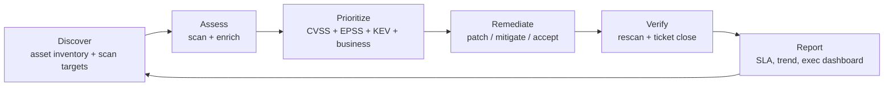

# Vulnerability Management

Every month, a 200-server Windows/Linux estate will pick up roughly **40 new CVEs** — counting OS, middleware, web stacks, firmware and the applications on top. Some are trivial (a local crash in a library nobody uses), some are internet-facing RCEs that will be weaponised within days. Without a repeatable process, a team tries to "patch Tuesday" its way through the stack and inevitably misses the one that matters: an Exchange server, an exposed Citrix gateway, an unpatched Log4j deep inside a vendor appliance.

**Vulnerability management** is the discipline that turns this firehose into a queue a small team can actually work. It is not "run a scanner once a quarter"; it is a continuous loop — discover, assess, prioritize, remediate, verify, report — with clear owners, SLAs and evidence at every step. When auditors ask *"how do you know you are not running a critical exploited-in-the-wild CVE today?"* a vulnerability management program is the answer.

This lesson walks the whole lifecycle: what the terms actually mean, how to scan without breaking production, how to score and prioritise, what to do when patching is impossible, and how a real monthly cycle looks at a fictional `example.local` shop.

## The vulnerability vs threat vs risk distinction

These three words get used interchangeably in meetings and it causes real confusion. Keep them separate.

| Term | What it is | Example |
|---|---|---|
| **Vulnerability** | A weakness in a system — a missing patch, a weak password policy, an exposed port | Log4j 2.14 on an internet-facing server |
| **Threat** | Someone or something that would exploit that weakness | A ransomware crew scanning for Log4j |
| **Risk** | Probability a threat exploits the vulnerability × impact if they do | "High — internet-exposed, RCE, customer data on box" |

A quick sanity check: a critical CVE on an air-gapped lab machine with no sensitive data is a serious *vulnerability* but a low *risk*. Same CVE on a public-facing web server handling payment data is the same vulnerability but an order of magnitude more risk. Your program optimises for risk, not CVSS number.

Two related terms you will see:

- **Exposure** — the broader condition that enables a vulnerability: an unsupported OS, an open S3 bucket, an admin with MFA off. Exposures often do not have a CVE but are just as dangerous.
- **Exploit** — working code that takes advantage of a vulnerability. "Exploit available" and "exploited in the wild" are very different things.

## The vulnerability management lifecycle

Vulnerability management is a **closed loop**. Skip a step and the output of the next one is wrong.



**Discover.** You cannot protect what you do not know exists. Feeds include Active Directory, DHCP leases, CMDB, cloud-provider APIs (Azure ARM, AWS Config), network discovery scans (nmap sweeps) and agent check-ins. The output is a living asset list with owner, criticality and environment tags. Typical tools: Lansweeper, ServiceNow CMDB, Microsoft Defender for Endpoint inventory, Tenable Asset Inventory.

**Assess.** Run authenticated vulnerability scans against the asset list — network-based scanners (Nessus, Qualys, OpenVAS) and endpoint agents (Rapid7 InsightVM agent, Qualys Cloud Agent, Defender Vulnerability Management). Enrich the raw findings with CVE metadata, CVSS, EPSS and KEV status before anyone looks at a dashboard.

**Prioritize.** Raw scanner output is a sea of red. Prioritization is where you separate "patch this weekend" from "roll into the next maintenance window". The inputs are CVSS base score, EPSS (exploit prediction), CISA KEV (known-exploited list), asset criticality, and internet exposure.

**Remediate.** Fix it. Patch is the obvious path but not the only one — mitigate with a WAF rule, reconfigure the service, segment the network, decommission the host, or accept the risk with written sign-off. Tickets flow out of the scanner into Jira / ServiceNow / Intune / WSUS / SCCM.

**Verify.** Every closed ticket triggers a re-scan of that asset. Until the scanner reports the finding gone, it is not gone. This step catches "patched but not rebooted", "patched the wrong version", and "patch rolled back by a GPO".

**Report.** Trend charts, SLA compliance, open critical count per business unit. Reports drive behaviour — if a team sees its open-critical count publicly week over week, it cleans up.

Loop. Run the cycle every month (monthly operational rhythm) with continuous discovery and weekly scans underneath it.

## Asset inventory first

A scanner without an asset list is a flashlight in a dark room — you see what the beam hits, nothing else. Shadow IT, forgotten VMs, the test box someone built in 2019 and the IoT printer nobody owns all sit in the dark.

**Feeds for a good inventory:**

- **Active Directory** — every domain-joined Windows host with last-seen timestamp.
- **DHCP leases** — everything that asked for an IP in the last 30 days.
- **DNS records** — anything someone bothered to name.
- **Cloud provider APIs** — Azure Resource Graph, AWS Config, GCP Asset Inventory.
- **Network scans** — nmap sweeps of every owned CIDR, cross-referenced with the above. Anything that shows up here but not in AD/DHCP is worth a look.
- **Agent check-ins** — Intune, Defender, SCCM, Jamf, Rapid7 agent.
- **CMDB** — ServiceNow, Lansweeper, Device42. The place where "owner" and "business criticality" actually live.

**Tag every asset with:**

| Tag | Values | Why |
|---|---|---|
| Environment | prod, staging, dev, lab | Patching cadence, maintenance window |
| Criticality | crown-jewel, high, medium, low | Prioritization input |
| Owner | person or team | Who gets the ticket |
| Exposure | internet-facing, DMZ, internal, air-gapped | Prioritization input |
| Data class | PII, PCI, PHI, internal, public | Risk amplifier |

If you can only add two tags, make it **criticality** and **exposure**. Those two turn "CVSS 9.8" into "patch Friday" versus "next maintenance window".

## Scanning types

Not all scans are the same, and the difference between them changes the findings by an order of magnitude.

| Axis | Option A | Option B | Trade-off |
|---|---|---|---|
| **Authentication** | Credentialed (scanner logs in as admin) | Non-credentialed (guesses from outside) | Credentialed finds 5–10× more real issues; non-credentialed reflects what an unauthenticated attacker sees |
| **Deployment** | Network-based (central scanner box) | Agent-based (lightweight client on each host) | Network scanner needs routes + creds; agent works on laptops that roam |
| **Intrusiveness** | Non-intrusive (banner grab, version check) | Intrusive (tries the exploit) | Intrusive finds real issues but can crash fragile systems |
| **Perspective** | External (from the internet) | Internal (from inside the LAN) | External shows attacker surface; internal shows east-west risk |
| **Target type** | Infrastructure (OS, services) | Web app (authenticated crawl) | Web apps need a session + crawl config, not just a port scan |
| **Mode** | Active (sends traffic) | Passive (sniffs traffic) | Active is authoritative; passive catches what active scans miss (IoT, fragile OT) |

**Representative tools:**

| Tool | Category | Typical use |
|---|---|---|
| **Nessus** (Tenable) | Network scanner | Authenticated weekly scans of the server estate |
| **OpenVAS / Greenbone** | Network scanner | Open-source alternative to Nessus |
| **Qualys VM / VMDR** | Network + cloud agent | Cloud-based scanning, agent for laptops |
| **Rapid7 InsightVM** | Network + agent | Agent for endpoints, scanner for servers |
| **Microsoft Defender Vulnerability Management** | Agent (via Defender for Endpoint) | Windows-heavy shops already using Defender |
| **Nikto, OWASP ZAP, Burp Suite** | Web app scanner | Authenticated web app scans, bug hunting |
| **Nmap `--script vuln`** | Ad-hoc | Quick spot checks, one-off targets |

**Credentialed scanning — the single highest-leverage setting.** A non-credentialed Nessus scan of a fully patched Windows Server shows maybe a dozen medium findings (certificate hygiene, TLS versions). The same host scanned with a local admin account shows hundreds of findings across OS, .NET, third-party apps. If you take one thing from this lesson: **turn on credentialed scanning** and accept the operational cost of managing scan credentials in a vault.

**Scan window matters.** Scanning production during business hours has crashed fragile devices for decades. Default to a maintenance window, use the "safe checks" profile for production, and keep the aggressive profile for staging.

## CVE, CWE, CVSS in one page

Three standards — all from the SCAP family — that you will see every day.

### CVE — Common Vulnerabilities and Exposures

A global ID for a specific vulnerability in a specific product. MITRE runs the program, hundreds of CNAs (Numbering Authorities — Microsoft, Red Hat, Cisco, GitHub, etc.) assign IDs.

Format: `CVE-YYYY-NNNNN` — year of publication, then a sequence number.

```
CVE-2021-44228    the Log4Shell vulnerability in Apache Log4j 2.x
CVE-2024-3094     the XZ Utils backdoor
CVE-2017-0144     EternalBlue / SMBv1
```

One CVE = one vulnerability. Different products with the same flaw get different CVEs.

### CWE — Common Weakness Enumeration

A taxonomy of weakness *classes*. CVEs are specific; CWEs are the generic bucket a CVE falls into.

```
CWE-79    Cross-site Scripting (XSS)
CWE-89    SQL Injection
CWE-502   Deserialization of Untrusted Data  ← CVE-2021-44228 maps here
CWE-287   Improper Authentication
CWE-798   Use of Hard-coded Credentials
```

Use CWEs for trend analysis ("we keep shipping CWE-79 — time for mandatory output-encoding training") and root-cause coding guidance. Use CVEs for operations.

### CVSS — Common Vulnerability Scoring System

A numeric severity score from 0.0 to 10.0 with a standard vector that shows how the number was derived. CVSS v3.1 is current; v4.0 exists but v3.1 is still overwhelmingly what scanners output in 2026.

**Severity bands (v3.1):**

| Score | Rating |
|---|---|
| 0.0 | None |
| 0.1 – 3.9 | Low |
| 4.0 – 6.9 | Medium |
| 7.0 – 8.9 | High |
| 9.0 – 10.0 | Critical |

**The base vector — eight metrics that produce the score:**

| Metric | Values | What it asks |
|---|---|---|
| AV — Attack Vector | N / A / L / P | Network / Adjacent / Local / Physical access needed |
| AC — Attack Complexity | L / H | Low / High — does attacker need special conditions |
| PR — Privileges Required | N / L / H | None / Low / High — auth level before exploit |
| UI — User Interaction | N / R | None / Required — does a user have to click |
| S — Scope | U / C | Unchanged / Changed — does it jump a trust boundary |
| C — Confidentiality | N / L / H | Impact on data confidentiality |
| I — Integrity | N / L / H | Impact on data integrity |
| A — Availability | N / L / H | Impact on service availability |

**Worked example — CVE-2021-44228 (Log4Shell):**

```
Vector: CVSS:3.1/AV:N/AC:L/PR:N/UI:N/S:C/C:H/I:H/A:H
Base score: 10.0 Critical
```

Parse it:

- `AV:N` — attackable over the **Network** (anywhere that can reach the vulnerable log-emitting endpoint)
- `AC:L` — **Low** complexity, no special conditions
- `PR:N` — **No** privileges needed, completely unauthenticated
- `UI:N` — **No** user interaction, attacker sends a crafted string
- `S:C` — **Scope changed**, exploited JNDI lookup lets the attacker pivot out of the logging library's context
- `C:H / I:H / A:H` — **High** impact on all three — full RCE means read, write, and shut down

Worst possible vector in every dimension → 10.0. That is why Log4Shell triggered emergency patching across the industry.

CVSS also defines **Temporal** and **Environmental** sub-scores (exploit maturity, remediation availability, your environment's modifiers). Most teams only ever use the **base** score, but Environmental is where "this box has no network exposure" legitimately knocks a 9.8 down.

## Prioritization that actually works

Ranking only by CVSS is what "never finishes patching" looks like. A typical scanner spits out thousands of findings at CVSS 7+. Nobody ships that.

**Real prioritization blends four signals:**

1. **CVSS base** — severity if exploited.
2. **EPSS** — [Exploit Prediction Scoring System](https://www.first.org/epss/) — probability (0–1) of exploit **in the next 30 days**. Computed from threat-intel, exploit-code availability, references and more.
3. **CISA KEV** — the [Known Exploited Vulnerabilities](https://www.cisa.gov/known-exploited-vulnerabilities-catalog) catalog. If a CVE is on KEV, someone is exploiting it **right now** in the wild. This is the single best prioritization signal.
4. **Your environment** — is the asset internet-facing? crown-jewel? carrying regulated data? is the vulnerable service actually running?

**A simple prioritization matrix:**

| KEV? | Exposure | CVSS | Action | SLA |
|---|---|---|---|---|
| Yes | Internet-facing | any | Patch / mitigate emergency | 72 hours |
| Yes | Internal | any | Patch in next window | 7 days |
| No | Internet-facing | Critical / High | Patch in next window | 14 days |
| No | Internet-facing | Medium | Schedule | 30 days |
| No | Internal | Critical | Patch in next window | 30 days |
| No | Internal | High | Monthly cycle | 60 days |
| No | Internal | Medium / Low | Quarterly cycle | 90 days |

Tune the numbers to your risk appetite and audit expectations, but the structure is sound: **KEV and exposure dominate CVSS**. A CVSS 6.3 KEV on a DMZ web server gets patched before a CVSS 9.1 lab finding.

**Why EPSS matters.** The FIRST.org EPSS model scores ~230,000 CVEs every day and consistently shows that the top 1% of EPSS captures 80%+ of what actually gets exploited. Feeding EPSS into prioritization means you patch the 1% first, not the 30% that scored 7+.

## Remediation paths

Patching is the default — but it is not the only option, and pretending it is leads to "we can't patch this 2015 LOB app so we do nothing" deadlock.

| Path | When it fits | Example |
|---|---|---|
| **Patch / update** | Vendor has a fix, the app tolerates it | `wsusscn2.cab` scan, WSUS/Intune/SCCM roll-out, `dnf update`, `apt upgrade` |
| **Mitigate** | Patch not possible this cycle | WAF rule blocking the exploit pattern, disable vulnerable module, change a config value, narrow firewall ACL |
| **Segment** | Can't patch, can't mitigate inline | Move the asset onto an isolated VLAN, restrict inbound to a jump host |
| **Remove / decommission** | Asset is not actually needed | Turn off the old Windows 2008 box whose only user retired |
| **Replace** | The fix is a new product | Migrate off the unsupported library, upgrade to the supported major version |
| **Accept** | Residual risk is tolerable | Documented risk acceptance signed by the business owner, tracked in a register, time-boxed |
| **Transfer** | Shift the financial risk | Cyber insurance policy, contract clause with the vendor |

**Signed risk acceptance is not "ignore it".** It has: a business justification, an expiry date (usually 6–12 months), the signing risk owner, and a compensating control. When the date passes it comes back into the queue.

**Patch management reality.** Every shop has the 10-year-old LOB app that only runs on Windows Server 2012 R2, the vendor appliance that ships with CentOS 7, and the production database that the DBA will not let you reboot. You will spend more time on compensating controls and segmentation around these than on emergency patching. That is normal.

## Security assessments beyond scans

A vulnerability scan is one tool in a larger assessment program. Do not confuse it with the others.

| Assessment | Goal | Scope | Who runs it | Duration | Cost (order of magnitude) | Output |
|---|---|---|---|---|---|---|
| **Vulnerability assessment** | Broad discovery of known issues | Wide — every asset in scope | In-house team with Nessus/Qualys | Hours to days | $ | Prioritised CVE list |
| **Penetration test** | Prove exploitation + impact | Narrow — specific targets, time-boxed | External consultants | 1–3 weeks | $$ | Report with exploited paths, evidence, risk rating |
| **Red team exercise** | Test detection + response across the whole org | Everything is in scope, stealth required | External (or a mature internal team) | 4–12 weeks | $$$ | Attack narrative, blue-team gap analysis |
| **Purple team** | Collaborative red + blue improving detections | Focused on specific TTPs | Mixed internal / external | 1–2 weeks | $$ | Detection rules, playbook updates |
| **Bug bounty** | Continuous crowdsourced testing | Defined scope, rules of engagement | Public or private researchers | Ongoing | $$ (pay per valid bug) | Submitted reports via platform |
| **Configuration audit** | Compare config vs a benchmark | OS / middleware / cloud | Internal team or auditor | Days | $ | Benchmark compliance report (CIS, DISA STIG) |
| **Code review / SAST / DAST** | Find bugs in custom code | Your codebase | Dev + AppSec | Continuous in CI | $ | CI pipeline failures, Jira tickets |

**Scanners find known CVEs. Pentests find business-logic bugs no scanner sees.** Running a pentest without first running a scanner wastes expensive consultant time on findings a $3k/year tool could have caught. Run the scan first, fix the low-hanging fruit, *then* bring in the pentest.

## Hands-on

Four exercises the learner can do with a lab VM and a browser.

### 1. `nmap --script vuln` against a test VM

Spin up a deliberately outdated Linux VM (Metasploitable2, or an old Ubuntu with known services). From another box on the same network:

```bash
# Basic port + service scan
nmap -sV -p- 192.0.2.10

# Version-matching vulnerability scripts
nmap -sV --script vuln 192.0.2.10 -oN vuln-scan.txt

# A smaller targeted run — only HTTP scripts on port 80
nmap -sV --script "http-vuln*" -p 80 192.0.2.10
```

Read the output. Each `|_` line under a port is a finding — note the `CVE-YYYY-NNNNN`, the `State: VULNERABLE`, and the references. Cross-check two CVEs against:

- https://nvd.nist.gov/vuln/detail/CVE-YYYY-NNNNN — base score, CWE, vector.
- The CISA KEV catalog — is this one of the 1,200+ known-exploited?

Write down which findings you would act on first **and why** using the matrix above. "CVSS 9.8" is not an answer; "KEV-listed, internet-exposed, remediation is a one-line config change" is.

### 2. Parse a CVSS v3.1 vector string by hand

Given the string:

```
CVSS:3.1/AV:N/AC:L/PR:N/UI:N/S:U/C:H/I:H/A:H
```

Decode each metric and state whether the vuln is worse or better than Log4Shell's `S:C` scope.

Expected answer:

- `AV:N` — Network attack vector
- `AC:L` — Low attack complexity
- `PR:N` — No privileges required
- `UI:N` — No user interaction
- `S:U` — Scope **unchanged** (the one difference from Log4Shell)
- `C:H / I:H / A:H` — Full impact

Base score: **9.8 Critical**. Slightly less severe than Log4Shell because the scope stays inside the vulnerable component. Verify by pasting the vector into the [FIRST CVSS v3.1 calculator](https://www.first.org/cvss/calculator/3.1).

Then try writing a vector yourself for a plausible scenario: a local privilege-escalation bug on Windows that requires the attacker to already have a low-priv account and tricks them into running an EXE. (Answer: `AV:L/AC:L/PR:L/UI:R/S:U/C:H/I:H/A:H` → 7.3 High.)

### 3. Pull the current CISA KEV catalog JSON and filter by vendor

CISA publishes KEV as JSON. Pull it, parse it, filter.

```bash
# PowerShell
$kev = Invoke-RestMethod `
    "https://www.cisa.gov/sites/default/files/feeds/known_exploited_vulnerabilities.json"

$kev.vulnerabilities.Count
$kev.vulnerabilities |
    Where-Object { $_.vendorProject -eq "Microsoft" } |
    Select-Object cveID, product, dateAdded, dueDate, knownRansomwareCampaignUse |
    Sort-Object dateAdded -Descending |
    Format-Table -AutoSize
```

```bash
# Bash + jq
curl -s https://www.cisa.gov/sites/default/files/feeds/known_exploited_vulnerabilities.json \
  | jq '.vulnerabilities[] | select(.vendorProject == "Microsoft")
        | {cveID, product, dateAdded, dueDate, knownRansomwareCampaignUse}'

# Count how many KEVs are linked to ransomware
curl -s https://www.cisa.gov/sites/default/files/feeds/known_exploited_vulnerabilities.json \
  | jq '[.vulnerabilities[] | select(.knownRansomwareCampaignUse == "Known")] | length'
```

Cross-reference the result with your asset inventory. Any Microsoft KEV whose `product` you run is your next patch. Any whose `dueDate` has passed is a finding in its own right — US federal agencies must remediate by that date under BOD 22-01, and the date is a useful SLA for everyone else too.

### 4. Write a 1-page remediation plan for 10 mock findings

You are the sec eng. You have these ten findings from Monday's scan. Write the plan for the Tuesday triage meeting.

| # | Asset | Exposure | CVE | CVSS | KEV? | EPSS |
|---|---|---|---|---|---|---|
| 1 | `dmz-web01` | Internet | CVE-2024-XXXX (web RCE) | 9.8 | Yes | 0.92 |
| 2 | `dc01` | Internal | CVE-2024-YYYY (privilege escalation) | 7.8 | Yes | 0.40 |
| 3 | `dev-jenkins` | Internal | CVE-2024-AAAA (Jenkins plugin) | 6.5 | No | 0.08 |
| 4 | `file01` | Internal | CVE-2021-ZZZZ (SMB info disclosure) | 5.5 | No | 0.01 |
| 5 | `dmz-web01` | Internet | TLS 1.0 enabled | 4.3 | n/a | n/a |
| 6 | `payroll-app` | Internal | CVE-2022-BBBB (Log4j 1.x) | 9.0 | No | 0.30 |
| 7 | `printsrv01` | Internal | PrintNightmare variant | 8.8 | Yes | 0.55 |
| 8 | `wsus01` | Internal | WSUS self-signed cert | 3.1 | n/a | n/a |
| 9 | `sql01` | Internal | Outdated SQL CU | 6.8 | No | 0.04 |
| 10 | `laptop-fleet` | Mobile | Chrome 1-version behind | 8.1 | No | 0.12 |

Expected shape of the plan:

- **72h (emergency):** 1 (KEV + internet + critical), 7 (KEV on print server, pre-position mitigation via GPO even if patch takes longer), 2 (KEV on DC — internal but game-over if exploited).
- **7 days:** 6 (Log4j 1.x — no KEV today but exploited-in-wild historically and likely to appear), 10 (laptop Chrome — Intune auto-update policy).
- **Next maintenance window (30 days):** 3, 5, 9.
- **Quarterly / accept + document:** 4, 8.

Deliverable: a one-page doc with the table, owner per row, target date per row, and a "residual risk accepted" line for anything not being patched this quarter.

## Worked example — example.local monthly cycle

This is what a real rhythm looks like at `example.local`, a 200-server Windows + Linux shop with a small DMZ and ~600 laptops.

**Weekly baseline.**

- **Every Saturday 02:00** — authenticated Nessus scan of the whole `10.0.0.0/16` server estate, credentialed via a `EXAMPLE\svc_scanner` account stored in the team password manager. Scan profile is "safe checks" in production, "aggressive" in the staging VLAN.
- **Continuous** — Rapid7 / Defender agent on every endpoint reports delta findings as soon as patches are missing.
- **Hourly** — CISA KEV JSON pulled into the SIEM; new entries that match assets in CMDB raise a P1 Slack alert.

**Monthly cycle.**

**Week 1 — scan and triage.**

- *Monday* — weekend scan results land in the VM platform. Security engineer exports everything at CVSS ≥ 7 or on KEV, enriches with asset criticality and EPSS, produces the triage sheet.
- *Tuesday 10:00* — 60-minute triage meeting. Attendees: sec eng, Windows lead, Linux lead, DBA, network, AppSec. The sheet is walked row by row. Every row leaves the meeting with an owner, a path (patch / mitigate / accept), and a target date.
- *Wednesday* — tickets created in Jira, linked to CMDB, SLA clocks started.

**Week 2 — emergency and KEV patches.**

- Everything KEV-listed or CVSS 9+ on internet-facing assets is patched **by Friday EOB**. DMZ gets an out-of-band maintenance window if needed.
- WSUS / Intune approves the patches; SCCM deploys to the server collection overnight.
- *Friday afternoon* — rescan of the patched assets only. Any still-vulnerable ticket goes back to the owner.

**Week 3 — monthly patch rollout.**

- Patch Tuesday updates land (second Tuesday each month). WSUS syncs, Intune deploys to pilot ring Wednesday, broad ring Thursday, servers Friday night.
- Non-Microsoft patches (Chrome, Firefox, Java, third-party drivers) roll in parallel via the same tooling.

**Week 4 — verification and reporting.**

- Rescan the full estate (mid-week, off-hours). Compare the "opened" and "closed" deltas against last month.
- Monthly VM report to the CISO and the IT director: total open criticals, SLA-missed count, top five repeat offenders (teams and CVEs), trend vs last 6 months.

**Quarterly.**

- External pentest against the DMZ (rotates which app each quarter).
- Config audit against the CIS Windows Server benchmark on a 10% sample.
- Risk-acceptance register review — anything expiring in the next quarter comes back to triage.

**Annually.**

- Formal risk assessment against NIST SP 800-30 / ISO 27005.
- Vendor review of the scanner tooling, compare against Qualys / Tenable / Rapid7 / Defender.
- Red team exercise (alternates with "purple team" year on year).

That is it. One engineer can run this for a 200-server shop if the tooling is set up well. Without the tooling the same engineer drowns.

## Common pitfalls

- **Scanning production during business hours with the "aggressive" profile.** It will crash something eventually — a fragile printer, an HP iLO, an old SCADA device — and you will be the reason. Use a safe-checks profile in prod and the aggressive profile in staging.
- **No credentialed scans.** Without creds you are seeing 10–20% of the actual findings. The most common "why do we have so few findings?" cause.
- **Ignoring low-CVSS exploited-in-the-wild CVEs.** A CVSS 6.1 on KEV is more urgent than a CVSS 9.8 that has no public exploit. Prioritize by KEV first, CVSS second.
- **Patching without verification.** "Ticket closed because the patch was deployed" is not the same as "rescan confirms the finding is gone". GPOs roll back, services do not restart, VMs get reverted from snapshots.
- **No SLA on remediation windows.** Without deadlines, tickets live forever. Enforce SLAs per severity and publish the missed-SLA count weekly.
- **Treating scanner output as the finished product.** Scanners produce raw findings; humans produce priorities. Every dashboard that ships to a business owner must be already triaged, not a CVE dump.
- **Forgetting about network and appliance firmware.** Switches, firewalls, hypervisors, iLO / iDRAC / IPMI. Nessus can reach most of them with SNMP or SSH credentials — set it up.
- **"We have a firewall, we're fine."** The firewall does nothing about the DMZ web server whose application has an RCE on port 443. Perimeter controls are not compensating controls for in-scope application vulns.
- **One scan a year for compliance.** PCI requires quarterly external and internal scans at minimum. More importantly: a year-old finding is a year of risk you did not know about.

## Key takeaways

- Vulnerability management is a closed loop — discover, assess, prioritize, remediate, verify, report — run monthly with continuous discovery underneath.
- Asset inventory comes first. A scanner without a trustworthy asset list is useless.
- Credentialed scanning is the single highest-leverage setting you can turn on.
- CVE identifies the bug, CWE classifies the weakness, CVSS scores the severity. Use all three for different purposes.
- Prioritize with KEV and exposure, not raw CVSS. A KEV-listed medium beats a non-KEV critical.
- Patching is one of six remediation paths. Mitigate, segment, remove, replace, accept, or transfer when patch is impossible — with documented risk acceptance, not silence.
- Pentests find business-logic bugs scanners cannot see — but only after you have cleaned up the scanner's low-hanging fruit.
- Every closed ticket must be verified by rescan. "Deployed" is not "fixed".

## References

- NIST SP 800-40 Rev. 4 — *Guide to Enterprise Patch Management Planning* — https://csrc.nist.gov/publications/detail/sp/800-40/rev-4/final
- NIST SP 800-30 Rev. 1 — *Guide for Conducting Risk Assessments* — https://csrc.nist.gov/publications/detail/sp/800-30/rev-1/final
- NIST SP 800-126 Rev. 3 — *The Technical Specification for SCAP* — https://csrc.nist.gov/publications/detail/sp/800-126/rev-3/final
- CISA Known Exploited Vulnerabilities catalog — https://www.cisa.gov/known-exploited-vulnerabilities-catalog
- CISA KEV JSON feed — https://www.cisa.gov/sites/default/files/feeds/known_exploited_vulnerabilities.json
- CISA Binding Operational Directive 22-01 — https://www.cisa.gov/news-events/directives/bod-22-01-reducing-significant-risk-known-exploited-vulnerabilities
- FIRST CVSS v3.1 specification + calculator — https://www.first.org/cvss/v3-1/specification-document / https://www.first.org/cvss/calculator/3.1
- FIRST EPSS (Exploit Prediction Scoring System) — https://www.first.org/epss/
- MITRE CVE — https://www.cve.org/
- MITRE CWE — https://cwe.mitre.org/
- NVD (National Vulnerability Database) — https://nvd.nist.gov/
- OWASP Risk Rating Methodology — https://owasp.org/www-community/OWASP_Risk_Rating_Methodology
- OWASP Web Security Testing Guide — https://owasp.org/www-project-web-security-testing-guide/
- PCI DSS 4.0 Requirement 11 (vulnerability + pen testing) — https://www.pcisecuritystandards.org/document_library/
