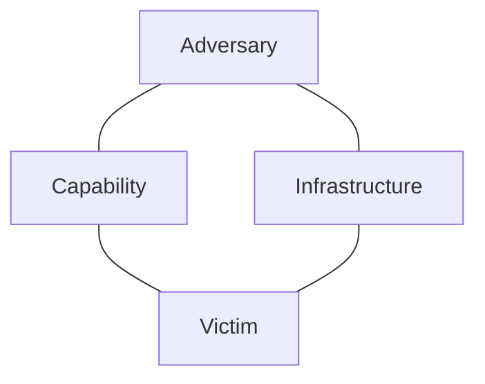

# Cyber Kill Chain, MITRE ATT&CK and Diamond Model

These models describe the same intrusion from different angles. **Cyber Kill Chain** asks *where the attack has progressed*. **MITRE ATT&CK** asks *what behaviour the adversary used and why*. The **Diamond Model** asks *which adversary, capability, infrastructure and victim are connected by the evidence*. Use them together; none is a substitute for written authorisation or a penetration-testing plan.

## Cyber Kill Chain: the progression

Lockheed Martin's model names seven stages of a conventional intrusion. The defender can try to detect or interrupt the activity at each stage.

| Stage | Meaning | Classroom example | Defensive question |
|---|---|---|---|
| **1. Reconnaissance** | Research the target | Collect public employee addresses | What information are we exposing? |
| **2. Weaponization** | Prepare a malicious payload and delivery mechanism | Build a booby-trapped attachment | Could this payload be detected before delivery? |
| **3. Delivery** | Send the payload to the target | Email the attachment | Did the gateway or user notice it? |
| **4. Exploitation** | Trigger a weakness | The attachment exploits an unpatched application | Was the weakness removed or blocked? |
| **5. Installation** | Establish a foothold | Malware installs on the endpoint | Did endpoint protection contain it? |
| **6. Command and Control (C2)** | Communicate with the compromised system | The endpoint contacts an attacker-controlled server | Is the outbound connection visible? |
| **7. Actions on Objectives** | Achieve the attacker's goal | Steal data or disrupt a service | Was the objective stopped and the impact measured? |

**Exam trap:** *delivery* is how the payload reaches the target; *exploitation* is when a weakness is triggered; *installation* is the foothold established afterward. Real incidents need not follow a neat straight line, and the model gives less detail about internal movement after initial access.

## MITRE ATT&CK: observed adversary behaviour

**ATT&CK** is a changing knowledge base of adversary behaviour, not a seven-step sequence or a complete penetration-testing methodology. It has Enterprise, Mobile and ICS knowledge bases. Its core terms are:

| Term | Question | Example |
|---|---|---|
| **Tactic** | Why is the adversary acting? | **Credential Access**: obtain credentials |
| **Technique** | How is that goal pursued? | **Phishing** for Initial Access |
| **Sub-technique** | Which more specific form? | A particular form of phishing |
| **Procedure** | What did a particular actor actually do? | The concrete lure, account and sequence observed in an incident |

These form **TTPs: Tactics, Techniques and Procedures**. A tactic is a goal, a technique is a method, and a procedure is an observed implementation. A technique may support more than one tactic; ATT&CK is not a universal chronological checklist. Its matrices and counts change over time, so learn the distinction rather than memorising a current number of tactics.

**Example:** an analyst sees a malicious email followed by execution on a workstation. The Kill Chain places delivery and exploitation in the sequence. ATT&CK maps the observed behaviour to relevant tactics and techniques, allowing the team to ask which detections and controls cover those behaviours. A technique label is a hypothesis until the evidence supports it.

## Diamond Model: the relationships

The Diamond Model describes an intrusion event with four linked features:

| Feature | Question | Possible evidence |
|---|---|---|
| **Adversary** | Who is behind the activity? | Actor hypothesis; attribution may remain unknown |
| **Capability** | What can they use or do? | Malware, phishing method, exploit |
| **Infrastructure** | What systems carry the activity? | Domain, IP address, email account, server |
| **Victim** | Who or what is targeted? | Organisation, account, endpoint |

**Example:** a suspicious domain sends a credential-harvesting email to an employee. The domain is infrastructure; the phishing method is capability; the employee or organisation is victim. The adversary may be unknown. Investigators can compare repeated events to see whether the same infrastructure or capability appears again. Do not infer a named actor from one shared domain or tool alone.

## Compare them in one incident

An employee receives a phishing email, opens an attachment, and the compromised computer contacts an external server.

- **Kill Chain:** delivery → exploitation/installation → command and control. It shows where an intervention could break the progression.
- **ATT&CK:** map the observed email, execution, persistence or C2 behaviours to the corresponding tactics and techniques. It shows what to detect or emulate.
- **Diamond Model:** connect the suspected adversary, attachment or malware capability, sending/C2 infrastructure and affected victim. It guides investigation and correlation.

The **CEH ethical hacking framework** is a different model. Its five phases — reconnaissance, vulnerability scanning, gaining access, maintaining access and clearing tracks — describe the broad attacker-like workflow taught in CEH. An authorised tester follows the rules of engagement, records evidence and reports findings; “clearing tracks” is studied to understand adversary behaviour, not as permission to conceal a test from its owner.

## Exam Focus / Remember

1. **Kill Chain = seven stages of attack progression.** Distinguish delivery, exploitation and installation.
2. **ATT&CK = behaviour knowledge base.** Tactic = why; technique = how; procedure = observed implementation.
3. **Diamond Model = adversary + capability + infrastructure + victim.** It relates evidence within an intrusion event.
4. **CEH framework = five broad hacking phases.** Do not confuse it with the seven Kill Chain stages.
5. The models support analysis and defence; none grants permission to test a real system.

## Quick quiz

1. A malicious document is sent to a target. Which Kill Chain stage is this?
2. In ATT&CK, does “Credential Access” describe *why* or *how*?
3. In the Diamond Model, which feature is a command-and-control domain?
4. Does a digital footprint or shared tool alone prove the adversary's identity?

**Answers:** 1. Delivery. 2. Why (a tactic). 3. Infrastructure. 4. No.

## Sources and further reading

- EC-Council, *Certified Ethical Hacker v13, Module 01: Introduction to Ethical Hacking*, “Hacking Methodologies and Frameworks,” module pp. 45–65. This lesson paraphrases the source and adds original examples.
- [Lockheed Martin, Cyber Kill Chain](https://www.lockheedmartin.com/en-us/capabilities/cyber/cyber-kill-chain.html).
- [MITRE, Get Started with ATT&CK](https://attack.mitre.org/resources/).
- Caltagirone, Pendergast and Betz, [*The Diamond Model of Intrusion Analysis*](https://threatconnect.com/wp-content/uploads/The_Diamond_Model_of_Intrusion_Analysis.pdf).
