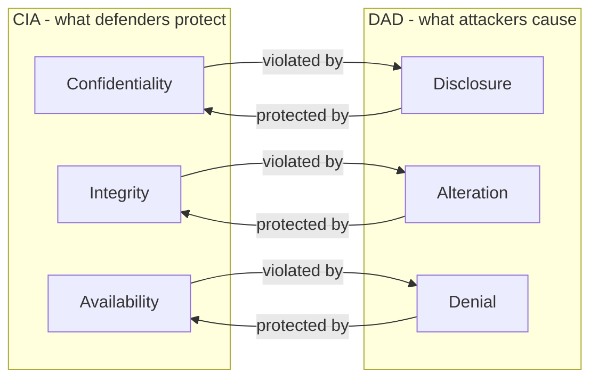
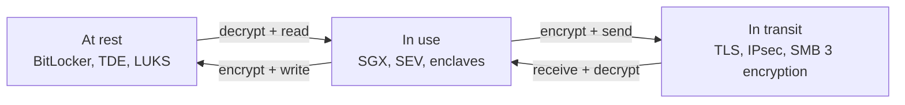

# CIA Triad

The **CIA triad** is the mental model every security engineer falls back on when they need to explain *what* an incident actually broke, *why* a control exists, or *how* much a finding matters. You will reach for it the first time someone asks "so is this a security incident or just an outage?", the first time you write a risk register, the first time an auditor asks you to justify a spending line. It is not a textbook definition you memorise once and forget — it is the vocabulary you use every week to turn messy reality ("the sales CSV ended up in a Gmail draft") into a clean ticket ("confidentiality breach, data classification control failed, remediate with DLP rule + training").

CIA is three questions asked of any asset at any moment. Can only the right people see it? Is it still exactly what it was? Can the people who should use it actually get to it? Everything in security — firewalls, backups, RBAC, TLS, EDR, DLP — exists to keep the answer *yes* to all three.

## The three pillars

| Pillar | Plain-English meaning | Example of a **violation** | Example of a **control** |
|---|---|---|---|
| **Confidentiality** | Only authorised subjects can read the data. | An unencrypted laptop with payroll data is left in a taxi and powered on by the finder. | Full-disk encryption (BitLocker, LUKS), RBAC on file shares, TLS in transit. |
| **Integrity** | Data and systems are exactly what they should be — no unauthorised change. | An attacker edits the AR ledger to erase a $40 000 invoice. | File-integrity monitoring, digital signatures, database constraints, hashing, code signing. |
| **Availability** | Legitimate users can reach the system and the data when they need to. | A ransomware outbreak encrypts the file server and staff cannot open any Word document for three days. | Backups with tested restore, RAID, clustering, DDoS mitigation, UPS + generator. |

Two things worth underlining right away.

1. **A violation does not require an attacker.** Confidentiality can be lost to a misconfigured S3 bucket. Integrity can be lost to a bad USB cable flipping bits. Availability can be lost to a power cut. CIA classifies the *outcome*, not the motive.
2. **The three can be in tension.** Locking a file behind strong encryption protects confidentiality; losing the key destroys availability. Asking everyone to MFA through a hardware token raises confidentiality and integrity; it lowers availability for the user who left the token at home. Security is this three-way trade-off being negotiated explicitly.

### A quick note on non-repudiation

Some frameworks extend the triad to a quartet: CIA + **non-repudiation**. Non-repudiation means a user cannot plausibly claim later that they did not perform an action. It is built from three pieces working together: strong **authentication** (the user was reliably identified), **integrity** of the log record (it was not edited after the fact), and a **cryptographic binding** (a digital signature using a private key only the user controlled). When an auditor asks "how do you know it was Elnur who approved this transfer?", non-repudiation is the answer, and it leans on all three CIA pillars to work. You will see it called out separately in PKI, digital-signature and audit-logging contexts; for everything else, CIA is enough.

## DAD triad — the attacker's mirror

**DAD** is the CIA triad inverted. Where CIA names what defenders want to preserve, DAD names what attackers (or accidents) try to cause.

- **Disclosure** — sensitive information reaches an unauthorised person. A violation of **Confidentiality**.
- **Alteration** — data is changed without authorisation (or corrupted unintentionally). A violation of **Integrity**.
- **Denial** — legitimate users cannot reach the system they are entitled to. A violation of **Availability**.

The mapping is one-to-one and it is how you classify an incident in a single sentence:

Why bother with DAD at all when CIA covers the same ground? Because during incident triage you are always talking about something that **already went wrong**, and DAD gives you verbs for that. A ticket titled "disclosure of customer PII via misconfigured S3 bucket" is clearer than "customer confidentiality event". DAD is the language of findings; CIA is the language of controls.

## Security control categories

Every control you deploy falls into one of three **categories** based on *who* implements it and *how*. These categories come straight out of NIST SP 800-53 and show up in every audit.

| Category | What it is | Examples at a small company (`example.local`, 80 users, 3 servers) |
|---|---|---|
| **Technical** | Hardware or software that enforces security directly in the digital plane. Also called *logical* controls. | NTFS ACLs on `\\FS01\Finance`, Windows Firewall rules, BitLocker on laptops, TLS 1.2+ on the Ubuntu web server, AD password policy, Defender for Endpoint. |
| **Operational** | The people-and-process controls that run day to day. A human is usually in the loop. | Monthly user-access review of `EXAMPLE\GRP-Finance`, nightly tape-out to an offsite safe, patch Tuesday routine, quarterly restore test, help-desk identity verification script. |
| **Managerial** | Strategic, documented, procedural controls written and owned by management. Also called *administrative*. | The written Information Security Policy, yearly risk assessment, vendor onboarding checklist, acceptable-use policy signed on hire, change-management process going through CAB. |

A rule of thumb: if a machine enforces it without a human, it is **technical**. If a human runs it on a schedule, it is **operational**. If it exists as a signed document and a sign-off, it is **managerial**. Most real-world controls are a blend — a backup is a technical tool, an operational runbook, and a managerial retention policy, all at once — and you will categorise by the dominant trait.

There is also a fourth category you will see in some frameworks and in many exam blueprints:

- **Physical** — locks, badges, fences, CCTV, HVAC, fire suppression. Some frameworks roll physical into operational, some treat it as its own category. The control matrix below keeps it separate because that is how most practitioners think about it.

## Security control types

Where *category* asks "who implements this?", **type** asks "what does it do in the incident lifecycle?". A control can be more than one type at once — a surveillance camera *deters* crime, *detects* the crime it does not deter, and generates evidence for *corrective* action afterwards.

| Type | Role in the lifecycle | Plain-English example |
|---|---|---|
| **Preventive** | Stops the event from happening in the first place. | A firewall blocks the inbound SYN flood. |
| **Detective** | Spots that an event is happening or has happened. | The SIEM flags 200 failed logins in a minute. |
| **Corrective** | Restores the system after an event. | The backup is restored over the encrypted files. |
| **Deterrent** | Discourages the attacker from trying. | A visible CCTV dome and a "No trespassing" sign. |
| **Compensating** | An alternative when the primary control cannot be used. | A time-limited firewall exception with extra logging because the app does not support TLS yet. |
| **Directive** | Tells people what they are supposed to do. | The acceptable-use policy, a "tailgating forbidden" sign on the server room door. |

### The control matrix

The matrix you will be asked to populate in interviews, exams, and audit interviews. Rows are control *category* (administrative, technical, physical), columns are control *type*. Examples are from `example.local`.

| | Preventive | Detective | Corrective | Deterrent | Compensating | Directive |
|---|---|---|---|---|---|---|
| **Administrative (Managerial / Operational)** | Hiring background checks, mandatory security awareness before AD account is enabled, separation of duties in finance | Monthly access-review of `EXAMPLE\GRP-Admins`, internal audit, reconciliation of invoices vs purchase orders | Incident-response plan, lessons-learned meeting, disciplinary process, BCP activation | Written warning that logs are monitored, sanctions in the AUP | Two-person rule for the `EXAMPLE\Domain Admins` password while the PAM tool is procured | Information security policy, acceptable-use policy, data-classification standard |
| **Technical (Logical)** | AD password policy, NTFS permissions, Windows Firewall, BitLocker, TLS, MFA, EDR blocking | SIEM correlation, Defender alerts, IDS signatures, file-integrity monitoring | Automated malware quarantine, Veeam restore, patch deployment via WSUS, account re-enable workflow | Warning banner at RDP logon ("authorised use only, activity is monitored") | A host-based firewall and jump-host combo on the Ubuntu web server because network segmentation is not ready | Group Policy that enforces screen-lock timeouts, log-on banner wording, USB-block GPO |
| **Physical** | Door locks on the server room, biometric access on the data-centre cage, mantrap at reception | CCTV with motion detection, door-open alarms, guard on night shift | Replace broken locks, re-issue lost access cards, fire-suppression discharge + recovery | Fences, lighting, visible cameras, guard dogs, barbed wire | Temporary armed guard while the access-control system is being replaced | Signage ("badge must be visible at all times"), evacuation maps, "no tailgating" posters |

You do not need to memorise every cell. You need to be able to look at any single control at work — say, a warning banner on the RDP login — and name both its *category* (technical, since a GPO enforces it) and its *type* (deterrent and directive, since it warns the user). That fluency is what gets tested.

## Data states and protection

Data is always in exactly one of three states, and each state has its own protection technology. If you have not thought about all three for a given asset, you have a gap.

| State | What it means | Protection technology | Concrete example |
|---|---|---|---|
| **At rest** | On disk, tape, backup, or object store — not moving, not being processed. | Full-disk encryption, volume encryption, file-level encryption, database TDE, encrypted backups, strong ACLs. | BitLocker on every laptop; TDE on the SQL Server instance; LUKS on the Ubuntu web server; S3 bucket encrypted with SSE-KMS. |
| **In transit** | Moving across a network — LAN, WAN, internet, internal service mesh. | TLS 1.2+, IPsec VPN, SSH, SMB encryption, WPA3 for wireless. | Outlook talks TLS to Exchange; `https://portal.example.local` uses a cert signed by the internal CA; SMB 3.1.1 encryption between the clients and `\\FS01`. |
| **In use** | Loaded into memory, being read, edited, computed on. This is the hardest state to protect because the CPU has to see the plaintext to do the work. | Trusted execution environments (Intel SGX, AMD SEV), secure enclaves (Apple T2, Android StrongBox), memory protection, process isolation, just-in-time decryption, homomorphic encryption (still rare in production). | A payment processor running the card-verification kernel inside SGX; a field-level decryption in the application code that keeps the plaintext alive for exactly one transaction. |

The common mistake is to assume "we encrypt our data" is enough. Encryption at rest does nothing while the OS is running and the volume is mounted — a running thief with a live session sees plaintext. Encryption in transit does nothing against an authenticated malicious insider at the endpoint. Each state needs its own control.

### How data moves between the three states

A real workflow touches all three states in a few seconds. A user opens a spreadsheet from `\\FS01\Finance` (at rest on the server's encrypted volume), the file travels over SMB with encryption (in transit), Excel decrypts and loads it into memory on the laptop (in use), then it gets written back — crossing the whole cycle in reverse. Every arrow is a place a control can fail.

### Cryptographic building blocks worth knowing

- **Symmetric encryption** (AES-256, ChaCha20) — one secret key, fast, used for bulk data: full-disk, backups, TLS session traffic after handshake.
- **Asymmetric encryption** (RSA, ECC) — public/private key pair, slow, used for key exchange, digital signatures and certificates.
- **Hashing** (SHA-256, SHA-3) — one-way fingerprint, *no key*, used for integrity checks and password storage (always with a salt and a slow KDF like bcrypt / Argon2 / PBKDF2).
- **MACs and AEAD** (HMAC-SHA-256, AES-GCM) — authenticated encryption or standalone authentication tags; these are what actually give integrity on top of confidentiality.
- **Key management** — TPM (on the device), HSM (in the data centre), KMS (in cloud). The weakest link is almost always key storage, not the algorithm.

## Data Loss Prevention (DLP)

**DLP** is the set of tools and rules that stop sensitive data from leaving places it should not. It works in two directions:

- **Discovery** — scans storage (file servers, mailboxes, SharePoint, endpoints) for content that matches a sensitive pattern: credit-card numbers, national IDs, "Confidential" labels, source-code keywords, etc.
- **Enforcement** — watches data in motion (email, web upload, USB copy, cloud sync) and applies an action when a rule matches.

### Endpoint DLP vs network DLP

| | Endpoint DLP | Network DLP |
|---|---|---|
| Where it runs | Agent on every laptop / desktop / server | Inline appliance or proxy at the network edge |
| Sees | Everything the user does locally — USB, clipboard, screenshot, print, SaaS apps over TLS via client-side hook | Anything traversing the network perimeter it is inline on |
| Blind spots | User who uninstalls the agent, offline devices that bypassed policy sync | TLS-encrypted traffic it cannot decrypt, mobile workers on home Wi-Fi, peer-to-peer |
| Typical product | Microsoft Purview Endpoint DLP, Symantec DLP Agent, CrowdStrike, Zscaler Client Connector | Forcepoint, Palo Alto NG DLP, Zscaler ZIA, Cisco Secure Email |

Most mature programmes run both — endpoint DLP handles USB and clipboard, network DLP catches the email and web channel.

### DLP actions

When a rule matches, the system can take one of four actions (or a combination):

| Action | What happens | When to use |
|---|---|---|
| **Log** | The event is written to the DLP console, user is not interrupted. | Tuning phase, low-severity patterns, telemetry only. |
| **Alert** | User sees a popup ("this email contains credit-card numbers, are you sure?"), security team gets a ticket. | Nudge users, surface accidents, feed into awareness training. |
| **Block** | The action is refused. Email does not leave, file does not copy. | High-severity patterns where false positives are cheap to override. |
| **Quarantine** | The file is moved to a holding area, the sender notified, a reviewer releases or drops. | Regulated data (PCI, PHI), large accidental exposures. |

### Concrete example

A user at `example.local` writes a new-customer import CSV and attaches it to an outbound email. The file contains 5 000 rows with a column of 16-digit numbers.

1. The endpoint DLP agent scans the attachment as the user hits **Send**.
2. A built-in "PAN (Primary Account Number) pattern" rule matches, confirmed by a Luhn checksum test.
3. The rule's threshold is "≥10 matches = high severity".
4. Action is **Block + Quarantine**.
5. The user sees: *"This email was blocked because it appears to contain credit-card numbers. If you need to send it, contact the security team."*
6. The security team gets a ticket with the message-ID, sender, recipient, match count, and a hash of the attachment. They decide: release to the legitimate partner, or pick up the phone because nobody should be emailing 5 000 PANs to anyone.

DLP will not catch everything — a determined insider will photograph the screen or retype the data into a personal laptop — and that is fine. DLP is one layer among many. Its job is to stop the *accidents* and the *lazy* exfiltration, and to raise the effort cost of the deliberate ones enough that the insider shows up in other controls (unusual access patterns, screenshot alerts, physical monitoring).

## Data minimization and obfuscation

Not all data needs to exist forever. Not all data needs to be *readable* where it sits. **Data minimization** reduces the volume and lifetime of sensitive data; **data obfuscation** reduces the sensitivity of what remains.

### Minimization

- **Collect less.** If the account-opening form does not need a date of birth, do not ask. The safest byte is the one you never stored.
- **Retain less.** Every dataset gets a retention period tied to the original business purpose. Logs that are only useful for 90 days get deleted on day 91.
- **Destroy properly.** *Delete* from the filesystem is not destruction — the bits are still on the disk. Use cryptographic erase (destroy the key that encrypted the volume), overwriting (DBAN, `shred`), or physical destruction (shredder, degausser) for media that leaves the building.

### Obfuscation techniques

| Technique | How it works | Reversible? | Typical use |
|---|---|---|---|
| **De-identification** | Remove direct identifiers (name, SSN, email). | Not by design, but re-identification attacks exist. | Analytics on medical cohorts. |
| **Tokenization** | Replace sensitive values with a meaningless token; a separate vault maps token → value. | Yes, only for holders of the vault. | PCI DSS — the app stores the token, only the payment processor can detokenise. |
| **Data masking** | Replace the value with a fictional one of the same shape (`4532-7812-****-1234`). | Usually no. | Non-prod environments, customer-service screens that show only partial data. |
| **Hashing** | One-way function; same input → same fixed output, different input → different output. | No — cannot be reversed (only brute-forced with guessing). | Password storage (always with salt), data integrity checks, deduplication keys. |
| **Anonymisation** | Statistical transformation (k-anonymity, differential privacy) so no row maps to one person. | No. | Public research datasets, published aggregate statistics. |

Do not confuse **masking** (cosmetic — the plaintext still exists somewhere) with **tokenization** (structural — the plaintext does not exist on the system at all). Auditors will. So should you.

## Hands-on: classify a scenario

For each scenario below, answer two questions:

1. **Which CIA pillar was violated?** (Confidentiality / Integrity / Availability — more than one may apply.)
2. **Which control category should prevent or fix it?** (Technical / Operational / Managerial / Physical)

### Scenarios

1. An employee at `example.local` emails a spreadsheet of salaries to their personal Gmail to work on over the weekend. No malicious intent.
2. A power cut takes out the small server rack because the UPS battery had not been tested in three years. The file server is down for six hours.
3. An attacker exploits an SQL injection on the Ubuntu web server and modifies three product prices from $99 to $0.01. Nobody notices for two hours.
4. A junior admin runs a PowerShell script on the wrong OU and deletes 40 user accounts in AD.
5. A departing developer walks out with a USB drive full of source code. The USB port was not locked, the laptop was not monitored.

### Answer key

1. **Confidentiality.** The data reached an unauthorised location (a personal, non-corporate account). Correct control categories: **Managerial** (acceptable-use policy that forbids this) and **Technical** (DLP rule blocking personal webmail uploads with sensitive content). An **Operational** awareness programme reinforces both.
2. **Availability.** The service was not reachable. Categories: **Operational** (a quarterly UPS test would have caught the battery) and **Physical** (proper environmental controls). A **Managerial** BCP would have set the testing cadence in the first place.
3. **Integrity** (the data was altered) and arguably **Confidentiality** (SQLi probably read data too before writing). Categories: **Technical** (input validation, WAF, prepared statements) and **Operational** (log review that would have spotted the UPDATE within minutes).
4. **Integrity** and **Availability** (the deleted accounts could not log in). Category: **Operational** (change-management approval, four-eyes on destructive scripts) plus **Technical** (AD Recycle Bin, tested restore).
5. **Confidentiality.** Categories: **Technical** (USB-block GPO, endpoint DLP), **Managerial** (off-boarding checklist with immediate revocation and exit interview), **Physical** (badge deactivation on the last day). No single control stops this; the layered combination does.

## Worked example: small company risk review

`example.local` is an 80-person professional-services firm. Their estate:

- **DC01** — Windows Server domain controller, DNS, DHCP, file shares. Hosted on Hyper-V.
- **FS01** — file server on the same Hyper-V host, shares `\\FS01\Projects` and `\\FS01\Finance`.
- **WEB01** — internet-facing Ubuntu server hosting the company website and a client portal (`https://portal.example.local`).
- Eighty domain-joined Windows laptops. MFA is set up only for the VPN.

You sit down to walk the CIA triad across the environment. You want **one real C, one real I, one real A risk** — with specific controls mapped to each.

### Confidentiality risk — the finance share

`\\FS01\Finance` currently allows `EXAMPLE\Domain Users` to read. Because a shortcut was convenient two years ago, every employee can browse the folder that holds payroll spreadsheets.

Controls that fix it, in order of priority:

1. **Technical** — replace the ACL with an allow-list of `EXAMPLE\GRP-Finance` only (preventive).
2. **Operational** — monthly access-review of `EXAMPLE\GRP-Finance` membership by the CFO (detective + administrative).
3. **Managerial** — write the data-classification standard that declares payroll as *Restricted* and names the owner (directive).
4. **Technical** — turn on Microsoft Purview endpoint DLP with a rule that blocks upload of any file from `\\FS01\Finance` to personal cloud storage (preventive + compensating, until we rebuild permissions properly).

### Integrity risk — the public website

`WEB01` runs WordPress with an old plugin that has a known deserialization bug. An attacker could alter content and customer data.

Controls:

1. **Technical** — patch the plugin today (corrective), run `unattended-upgrades` for security updates (preventive).
2. **Technical** — deploy a WAF with virtual-patching for the CVE in question (compensating while patching, preventive long-term).
3. **Operational** — nightly file-integrity monitoring on `/var/www` comparing hashes against a trusted baseline; any change is a ticket (detective).
4. **Managerial** — add a patching-SLA to the IT ops policy: critical CVEs on internet-facing hosts must be patched within 72 hours (directive).

### Availability risk — the single Hyper-V host

Both DC01 and FS01 run on the same Hyper-V host. If the host dies, the whole company logs in to nothing.

Controls:

1. **Technical** — add a second Hyper-V host, make a failover cluster, move DC01/FS01 onto clustered storage (preventive).
2. **Technical** — run a second domain controller DC02 on the new host so AD survives even without the cluster (preventive).
3. **Operational** — take daily VM-level Veeam backups to an offsite NAS; test restore monthly (corrective + detective).
4. **Physical** — install a UPS sized for 15 minutes of full load so the virtual cluster can shut down cleanly (preventive).
5. **Managerial** — document the RTO (4 hours) and RPO (24 hours) so there is a stated target you can either meet or declare you do not (directive).

Notice how every real fix is a stack of controls across categories, not a single heroic purchase. That is how security actually works.

### Putting it on the risk register

Once the controls are mapped, each risk gets a row on the risk register so the board can see what is being treated and what is being accepted:

| Risk | CIA pillar | Likelihood | Impact | Inherent risk | Treatment | Owner | Residual risk | Review date |
|---|---|---|---|---|---|---|---|---|
| Excess access to `\\FS01\Finance` | Confidentiality | High | High | High | Mitigate (4 controls above) | CFO + IT lead | Low | 2026-07-23 |
| Unpatched WordPress plugin on WEB01 | Integrity | Medium | High | High | Mitigate (4 controls above) | IT lead | Low | 2026-07-23 |
| Single Hyper-V host hosting DC01 + FS01 | Availability | Medium | Critical | High | Mitigate (5 controls above) | IT lead | Medium | 2026-07-23 |

The point of the register is not the format — it is the act of writing down a number for *likelihood* and *impact* before and after the controls. That conversation forces honesty: if your "high" residual risk is the same number as the inherent risk, your controls are not actually controlling anything.

## Troubleshooting common confusions

### "Integrity means encryption, right?"

No. **Integrity** is about unauthorised *change*. Encryption is primarily a **confidentiality** control. The two get confused because many encryption schemes include an authentication tag (AES-GCM, ChaCha20-Poly1305) that gives you integrity too — but the mechanism that gives you integrity is the MAC/signature, not the encryption itself. Hashing, digital signatures, and file-integrity monitoring are the integrity controls. Encryption is a side benefit when you happen to use an AEAD mode.

### "DLP replaces access control"

No. DLP watches data as it moves. If the user was never supposed to have opened the file in the first place, DLP is too late — that was the job of **NTFS permissions / RBAC / ABAC**. Build access control first, DLP second.

### "We have backups so we are covered on availability"

Backups cover you for *recovery*. They do nothing for an ongoing DDoS, a dead UPS, a fibre cut, or a cloud provider outage. Availability is a stack: redundancy, DDoS protection, capacity, monitoring, failover, *and* backup. Missing any layer leaves a gap.

### "Confidentiality only applies to PII"

No. Confidentiality applies to any information the organisation chooses to protect — trade secrets, source code, merger plans, pricing models, internal tickets. PII is one very regulated subset, but losing your pricing to a competitor is a confidentiality incident just the same.

### "A deterrent control is the same as a preventive control"

No. A **deterrent** discourages an attempt — a "CCTV in use" sign, a warning banner, a guard dog visible through the fence. A **preventive** control actively stops the attempt if it happens anyway. A sign is a deterrent; a locked door is preventive. You usually want both.

### "Hashing and encryption are interchangeable"

No. **Encryption** is reversible by design — you need the plaintext back, so you must be able to decrypt. **Hashing** is deliberately one-way — you never need the plaintext back, you only need to compare fingerprints. Passwords are hashed, not encrypted, because the system should never be able to recover the original password, only check that the user typed it right. A system that "encrypts passwords and can email them back to you" is a system that stores passwords in a recoverable form — which is the textbook definition of doing it wrong.

### "An air-gapped system does not need CIA analysis"

It still does. Air-gap kills the *network* attack surface; it does nothing for a malicious insider (confidentiality), a tampered update brought in on USB (integrity), or a broken air-conditioning unit that cooks the server (availability). The three questions still need answers; only the plausible attackers change.

## Quick-reference glossary

| Term | One-line meaning |
|---|---|
| **CIA** | Confidentiality, Integrity, Availability — the three properties security tries to preserve. |
| **DAD** | Disclosure, Alteration, Denial — the three violations CIA prevents. |
| **AAA** | Authentication, Authorization, Accounting — the access-control trio that supports CIA. |
| **DLP** | Data Loss Prevention — discovers sensitive data and stops it leaving the org. |
| **TDE** | Transparent Data Encryption — database engine encrypts data files at rest. |
| **HSM** | Hardware Security Module — tamper-resistant device for key storage and crypto operations. |
| **TPM** | Trusted Platform Module — on-board chip storing keys and measuring boot integrity. |
| **MFA** | Multi-Factor Authentication — combines two of: something you know / have / are. |

## Key takeaways

- CIA asks three questions of every asset: who can read it, is it still right, can legitimate users reach it.
- DAD is the attacker's mirror — disclosure/alteration/denial are the exact violations CIA tries to prevent.
- Controls sort two ways at once: **category** (technical / operational / managerial, plus physical) and **type** (preventive / detective / corrective / deterrent / compensating / directive). A single control usually has more than one type.
- Data is at rest, in transit, or in use — and each state needs its own protection. Encryption at rest alone is not enough.
- DLP stops the accidents and raises the effort for the deliberate; it is a layer, not a replacement for access control.
- Data minimization is the cheapest control — bytes you never stored cannot be leaked.
- Real risk reviews always stack controls across categories. A lone hero control is a gap hiding in plain sight.

## References

- [NIST SP 800-53 Rev. 5 — Security and Privacy Controls for Information Systems](https://csrc.nist.gov/publications/detail/sp/800-53/rev-5/final)
- [NIST SP 800-12 Rev. 1 — An Introduction to Information Security](https://csrc.nist.gov/publications/detail/sp/800-12/rev-1/final)
- [NIST Cybersecurity Framework 2.0](https://www.nist.gov/cyberframework)
- [OWASP — Confidentiality, Integrity, and Availability](https://owasp.org/www-community/Application_Threat_Modeling)
- [OWASP Top 10](https://owasp.org/www-project-top-ten/)
- [CISA — Cybersecurity Best Practices](https://www.cisa.gov/topics/cybersecurity-best-practices)
- [CISA — Defining Insider Threats](https://www.cisa.gov/topics/physical-security/insider-threat-mitigation/defining-insider-threats)
- [Microsoft Purview Data Loss Prevention documentation](https://learn.microsoft.com/en-us/purview/dlp-learn-about-dlp)
