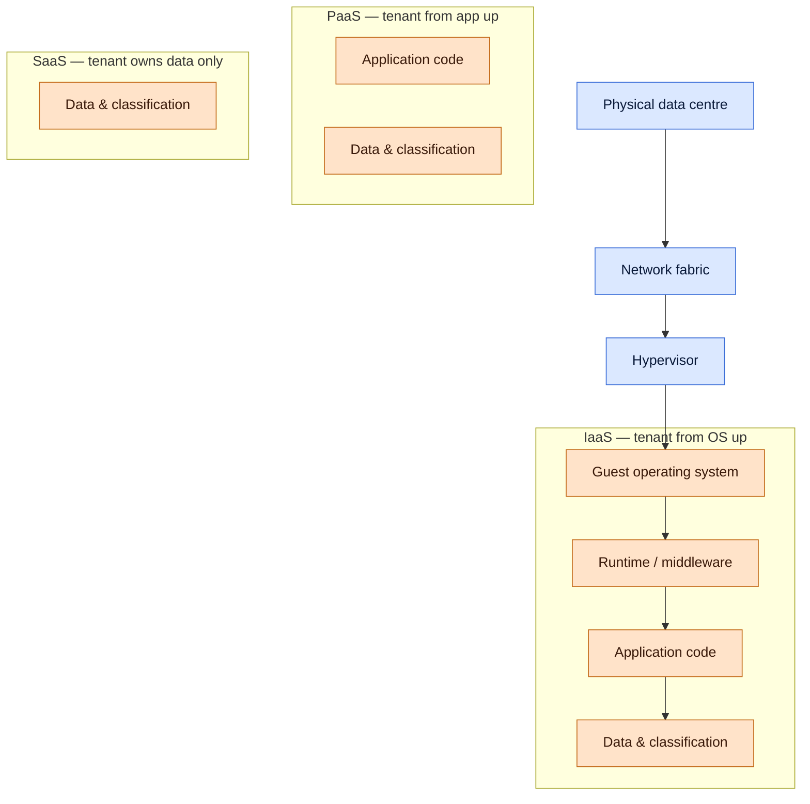

# Cloud Computing Security

## Why this matters

When an organisation moves a workload off its own hardware and into a cloud provider, it does not remove the security problem — it splits it. Some layers now belong to the provider. Some still belong to the tenant. The dangerous gap is the part in the middle that everyone assumes the other side is handling. Most real cloud incidents are not sophisticated zero-days; they are misconfigured storage buckets, leaked access keys committed into a public repository, over-permissive identity roles, and open security groups in front of a database that was supposed to be private.

Cloud security also changes the pace of everything. A single click spins up a virtual machine in seconds, a CI/CD pipeline provisions fifty VMs for a load test, and a developer deploys a function that runs across a dozen regions. Controls that used to rely on "a human touches every server" no longer scale. Detection has to come from logs the provider emits, guardrails encoded as policy-as-code, and identity rules that travel with each resource rather than each network segment.

This lesson walks the concepts from service models down to the hypervisor. Examples use the fictional `example.local` organisation and the `EXAMPLE\` domain. Provider names (AWS, Azure, GCP) appear in neutral terms — the principles are the same; only the menu and the icons differ.

The risk categories every cloud-adopting organisation must answer for itself:

- **Data residency and sovereignty** — where does the data physically sit, and which legal regimes apply?
- **Identity and access** — who can do what, with which credentials, from which networks, under what conditions?
- **Configuration** — are the controls set correctly, and will drift from that correct state be detected?
- **Tenant isolation** — do you trust the provider's hypervisor, multi-tenant services, and network separation for the workload in question?
- **Availability and resilience** — can the workload survive a regional outage, an account lockout, or a provider incident?
- **Exit and portability** — can you get your data and workloads back out in a reasonable time without paying a ransom?

Those six questions form the skeleton of any responsible cloud-risk conversation. The rest of this lesson is about the controls that answer them.

## Core concepts

Cloud security is a stacking problem. At the bottom is the physical data centre the provider runs. On top of that sit network fabric, hypervisors, guest operating systems, runtimes, applications, and finally data. Who owns each layer depends on the service model. Where those layers live depends on the deployment model. The rest follows.

### Service models — IaaS, PaaS, SaaS, and shared responsibility

The three classical cloud service models differ in how much of the stack the provider manages for you.

**Infrastructure as a Service (IaaS)** delivers virtualised compute, storage, and network as a pay-per-use resource. The tenant still provisions operating systems, patches them, installs middleware, configures security groups, and runs the application. The provider owns only the physical data centre, the network fabric, and the hypervisor. IaaS gives the most control and the most responsibility. Typical offerings are virtual machines, block storage, managed databases on raw VMs, and virtual private clouds.

**Platform as a Service (PaaS)** delivers a runtime where the tenant deploys code and data, and the provider manages everything below the runtime — OS, patching, scaling, load balancers, and often the database engine. The tenant's security job shrinks to application code, identity, and data classification. PaaS suits teams that want to ship features without owning servers.

**Software as a Service (SaaS)** delivers a complete application over the web. The tenant manages only their users, their data classification, and how the SaaS integrates with the rest of their environment. Office suites, customer relationship management, HR, and collaboration tools are the common examples. The security job is mostly identity, data governance, and sharing controls — the provider handles the code and the servers.

The **shared responsibility model** is the diagram every tenant has to internalise. The provider is responsible for *security of the cloud* — physical sites, network fabric, hypervisors, and the services themselves. The tenant is responsible for *security in the cloud* — identity, configuration, data, and any code they deploy. Both sides have to hold up their end, and neither side covers the other's mistakes.

**Shared responsibility matrix:**

| Layer | IaaS | PaaS | SaaS |
|---|---|---|---|
| Data classification and governance | Tenant | Tenant | Tenant |
| Identity and access management | Tenant | Tenant | Tenant |
| Application code | Tenant | Tenant | Provider |
| Runtime / middleware | Tenant | Provider | Provider |
| Guest operating system | Tenant | Provider | Provider |
| Virtual network and security groups | Tenant | Shared | Provider |
| Hypervisor | Provider | Provider | Provider |
| Physical host | Provider | Provider | Provider |
| Physical data centre | Provider | Provider | Provider |

The rule of thumb: the more the provider does, the less control the tenant has over how it is done — and the more the tenant depends on the contract and the compliance attestations to verify the provider's claims.

A useful way to think about the service models is to ask where the compute-second happens. In IaaS the tenant pays per VM-hour, and the VM is a durable thing the tenant named, patched, and snapshotted. In PaaS the tenant pays per request, per gigabyte, or per reserved capacity, and the server underneath has no name the tenant can point at. In SaaS the tenant pays per seat or per workspace, and compute is completely invisible. The cost model tracks responsibility: you pay for the things you own and manage, and you stop paying when you stop managing.

A second lens is blast radius. A compromised IaaS workload can spread as far as the VM's network and identity allow — often wider than expected, because VM identities are frequently over-scoped. A compromised PaaS workload is usually limited to the function or container image that was running, plus whatever the execution role could reach. A compromised SaaS tenant is scoped to that SaaS workspace — but a compromised SaaS *identity* can pivot into every other service the user is federated into, which is why SaaS account security is fundamentally an identity problem.

### Deployment models — public, community, private, hybrid

Where the cloud lives changes who can reach it and how it can be governed.

A **public cloud** is a multi-tenant environment operated by a commercial provider and open to any paying customer. Tenants are isolated by software (hypervisor, identity, network), not by hardware. Public cloud is the cheapest and most elastic option; it is also the one where tenants must trust the provider's tenant-isolation controls. The big commercial clouds — AWS, Azure, GCP, Oracle Cloud — are public clouds.

A **community cloud** is shared by several organisations with a common mission or regulatory profile. Public-sector entities, universities in a research consortium, or banks subject to the same regulator may share a community cloud to pool cost while keeping the tenant pool small and accountable. It sits between public and private in both cost and assurance.

A **private cloud** is dedicated to a single organisation. It can be hosted on-premises in the tenant's own data centre, or hosted by a provider in a single-tenant configuration. Private clouds give the strongest isolation and the clearest audit story; they also cost the most per unit of capacity and scale less elastically than public clouds.

A **hybrid cloud** combines two or more of the above so that workloads can move or span between them. A common pattern: sensitive regulated data in a private cloud, elastic compute in a public cloud, and integration scripts that shift load between them as demand changes. Hybrid architectures are not a single network — they are two or more networks interconnected by defined gateways, with identity, policy, and data classification that have to work consistently across both sides.

**Deployment-model trade-offs:**

| Model | Tenants | Typical cost | Isolation | Scale | Compliance story |
|---|---|---|---|---|---|
| Public cloud | Many (unbounded) | Lowest per unit | Software-enforced | Nearly unlimited | Relies on provider attestations |
| Community cloud | Few, shared interest | Medium | Software, but smaller pool | Medium | Shared audit across members |
| Private cloud (on-prem) | One | Highest | Strongest, physical | Limited to hardware | Fully controlled |
| Private cloud (hosted) | One | High | Strong, contract-backed | Medium-high | Provider contract plus tenant controls |
| Hybrid cloud | Mixed | Variable | Per-segment | Elastic on public side | Two policies, one governance layer |

The choice between models is rarely pure. Most organisations end up with a *de facto* hybrid — a SaaS collaboration suite, a public-cloud production estate, an on-prem legacy datacentre, and a handful of private-cloud workloads for highly regulated data. What matters is that the split is deliberate. If the architecture document can say "payroll runs here because residency, analytics runs there because elasticity, email runs in SaaS because economics" and every workload is accounted for, the estate is under control. If there are "mystery" workloads that nobody can place on that grid, the organisation does not actually know what it has.

Multi-cloud — deploying across two or more public clouds — is a separate design choice often conflated with hybrid. Multi-cloud buys provider-failure resilience and negotiating leverage but multiplies the operational burden (two IAM systems, two networking dialects, two log pipelines, two sets of CIS benchmarks). Use it where the benefit is clearly greater than the extra complexity, and not as a default.

### Cloud service providers, MSPs, and MSSPs

**Cloud service providers (CSPs)** sell the cloud menu: compute, storage, network, managed services, and the identity and billing layer that ties them together. The largest — AWS, Microsoft Azure, Google Cloud, Oracle Cloud — have global reach and practically unbounded capacity. Smaller regional providers and specialist providers compete on price, jurisdiction, or vertical focus. What matters for security is not the provider's logo — it is what is in the contract, what the attestation letters cover, and which service tier you subscribed to. A feature you assumed was included but is not in your tier will not be there when you need it.

A **managed service provider (MSP)** is a third party that remotely operates parts of a tenant's IT estate — server management, backup, patching, network operations, help desk. The tenant keeps the assets; the MSP runs them. MSPs are how small and mid-sized organisations get operational coverage they could not staff themselves. The security trade-off is trust — the MSP holds privileged credentials to tenant systems and sees tenant data during normal operations.

A **managed security service provider (MSSP)** is the security-specialised version: SOC monitoring, SIEM operations, vulnerability management, incident response retainers, and sometimes threat intelligence. An MSSP runs the security telemetry that the tenant's own team would otherwise run. The contract must spell out scope, escalation criteria, response SLAs, and which actions the MSSP can take autonomously versus which require tenant approval.

With both MSPs and MSSPs, "if it is not in the contract, it is not being done" is the survival rule. Default assumptions do not apply; the contract is the boundary.

Two contract clauses matter more than any other. First, the exit clause: how does the tenant get its data back when the engagement ends, in what format, and on what timeline? Tenants that skip this end up hostage to vendors whose notice periods and data-export fees are suddenly less favourable when a relationship has soured. Second, the right-to-audit clause: can the tenant (or its regulator) audit the MSP/MSSP's controls, and on what schedule? Without that right, the tenant is reliant on third-party attestations alone and cannot independently verify the service they pay for.

### On-premises versus off-premises, and edge paradigms — fog, edge, thin client

**On-premises** means the workload runs in a facility the tenant owns or leases directly. It is the baseline that pre-cloud IT was built on. Advantages: full control, high-bandwidth local connectivity, predictable jurisdiction. Drawbacks: capital cost for capacity, slow to scale, tenant owns every layer of the stack and all the operational labour.

**Off-premises** means the workload runs somewhere else — hosted in a colocation facility, in a managed service, or in a cloud. Off-premises trades some control for operational relief and elasticity.

Between classic cloud and classic on-prem, a set of architectures push compute closer to where data is produced, to manage latency and bandwidth:

**Fog computing** is a distributed architecture that places intelligent gateways between local devices and a central cloud. The gateway handles time-sensitive work locally — for example, aggregating telemetry, filtering anomalies, or running analytics — and forwards the summaries to the cloud for long-term storage and deeper analysis. Fog is an adjunct to the cloud, not a replacement; it is most useful when latency or bandwidth to the central cloud is a problem and when some data can be processed and discarded without ever leaving the local site.

**Edge computing** pushes compute all the way to the device producing the data — the edge of the network. In an Internet of Things (IoT) deployment with thousands of sensors, edge computing runs inference and control loops on small nearby devices rather than sending every reading to the cloud. Edge differs from fog mainly in scope: fog uses intermediate gateways, edge uses the devices themselves or a small node directly attached to them. Edge earns its keep when every millisecond matters — industrial control, autonomous vehicles, real-time safety systems — and when the network link is intermittent or expensive.

**Thin clients** take the opposite approach: minimal compute at the user's desk, with everything running on servers elsewhere. A thin client is effectively an input and output device — keyboard, monitor, network — that connects over a protocol like RDP or a browser to centrally managed desktops or applications. Thin clients shine where the security win is keeping data off endpoints: call centres, shared kiosks, high-security environments, and virtual desktop infrastructure (VDI) deployments.

The edge-versus-cloud choice also carries data-protection implications. Data processed at the edge never leaves the local site, which simplifies sovereignty compliance; data processed in the cloud may cross jurisdictions, which triggers contractual and legal controls. Thin-client architectures keep data off endpoints, which strengthens both data-loss prevention and the post-loss story — a stolen thin client has no drive to clone. Fog gateways live in the interesting middle: they hold enough data to be attractive targets but are rarely as hardened as data-centre equipment, so they deserve their own patching cadence, their own inventory, and their own physical-security posture.

**Edge paradigms compared:**

| Paradigm | Where compute runs | Latency | Best for | Security concern |
|---|---|---|---|---|
| Cloud | Remote provider region | Highest | Batch work, analytics | Transit, data sovereignty |
| Fog | Local gateway | Medium | IoT aggregation, pre-processing | Gateway patching, gateway theft |
| Edge | On the device itself | Lowest | Real-time control, IoT | Device tamper, supply chain |
| Thin client | Central server, dumb endpoint | Depends on link | VDI, shared terminals | Session hijack, link availability |
| Traditional on-prem | Local server | Low | Full-control workloads | Capex, scaling, patching at scale |

### Modern workload patterns — containers, microservices and API, infrastructure as code, serverless

Cloud did not just move servers; it changed how applications are packaged and run.

**Containers** bundle an application with its libraries, binaries, configuration, and runtime dependencies into a portable image that runs against a shared host kernel. Containers are lighter than full virtual machines because they do not each carry a complete guest operating system. They start in seconds, pack densely onto a host, and move between development, test, and production with the same image bits. The common runtime is Docker or an Open Container Initiative (OCI)-compliant alternative; the common orchestrator is Kubernetes. Security for containers shifts to the image (what is in it, what CVEs are in the dependencies), the registry (who can push and pull), the runtime (can a container write to the host, can it escape into the kernel), and the pod-to-pod network.

**Microservices and APIs** are the architectural pair that containers made practical. Rather than a single monolithic application, a system is decomposed into small services, each owning one responsibility, communicating over defined APIs. The usual API style is REST over HTTP, with the four verbs — GET to read, POST to create, PUT to update, DELETE to remove — and JSON payloads. Microservices shorten change cycles and isolate blast radius; they also multiply the number of network endpoints, identities, and audit trails to manage. API gateways, service meshes, and mutual TLS are the security plumbing that makes the pattern tenable.

**Infrastructure as code (IaC)** replaces click-ops in the cloud console with machine-readable templates — Terraform HCL, CloudFormation YAML, Bicep, Pulumi, Kubernetes manifests — checked into version control and applied by a pipeline. IaC turns infrastructure into a reviewable, diff-able, revertable artefact. Security benefits: peer review, policy-as-code checks (Open Policy Agent, tfsec, Checkov) that block dangerous patterns before apply, and a single source of truth for what is supposed to be deployed. Security risks: secrets committed into the template repository, over-permissive IAM that nobody reviewed, and drift between the code and the real world when someone clicks in the console.

**Serverless architecture** removes even the concept of a server from the developer's view. The tenant uploads a function (AWS Lambda, Azure Functions, Google Cloud Functions) or a container image to a managed service; the provider scales it, runs it on demand, and charges per invocation. Serverless slashes operational overhead and is ideal for event-driven work, burst load, and integrations. Security implications: the attack surface shifts almost entirely to identity (what the function is allowed to do) and to the data stores behind it. Runtime patching and OS hardening move to the provider, but misconfigured execution roles, excessive permissions, or exposed endpoints remain tenant problems.

**Services integration** is the tenant-owned layer that stitches all of this together — queues, event buses, workflow orchestrators, and identity — into a single business process. Most modern cloud designs are less about "a server" and more about "a graph of managed services talking to each other over policy-controlled endpoints".

A practical shift these patterns force on security teams is the move from "perimeter firewall at the edge" to "identity at every hop". Between two microservices the meaningful control is not the subnet — it is whether service A's workload identity is actually allowed to invoke service B on that specific route. Between a function and a database the control is an IAM role bound to the function, not an IP allowlist. Between a container and a secrets store the control is a short-lived token scoped to one secret, not a credential embedded in the image. Identity-first design is the through-line that connects containers, microservices, IaC and serverless into a coherent security story; without it, each pattern just adds places where a missing check can go unnoticed.

### Network abstraction — SDN, SDV, transit gateway, resource policies

Cloud networks do not look like physical networks. They are software artifacts defined by API calls.

**Software-defined networking (SDN)** separates the control plane (decisions about where traffic should go) from the data plane (the movement of packets). In SDN, a controller programs flow rules onto forwarding hardware or virtual switches; in cloud, SDN is invisible infrastructure — every virtual network, security group, and route table is an API call to a software-defined fabric. SDN makes networks reconfigurable by code, which is the prerequisite for cloud at scale. A related concept, **network function virtualisation (NFV)**, replaces dedicated hardware appliances (router, firewall, load balancer) with software instances running on commodity hardware.

**Software-defined visibility (SDV)** extends the same idea to traffic inspection. Instead of physically inserting a firewall or IDS appliance in-line with a data flow, SDV uses SDN primitives to direct selected traffic to virtual inspection points. Deep packet inspection, TLS termination, and DLP analysis become services that can be attached or detached by policy, without re-cabling.

A **transit gateway** is a cloud-native network hub that connects multiple virtual private clouds (VPCs) to each other and to on-premises networks over a single managed attachment. Rather than a mesh of VPC peerings, all attachments plug into the transit gateway, and route tables on the gateway control which segments can reach which. Transit gateways are the usual landing point for hybrid connectivity — VPN tunnels or dedicated circuits — and the place to centralise inspection or NAT for an entire cloud estate.

**Resource policies** are the declarative rules that say what may be provisioned, by whom, and under what conditions. In AWS they show up as service control policies (SCPs), IAM policies, and resource-based policies; in Azure as Azure Policy and RBAC role assignments; in GCP as IAM conditions and organisation policies. Resource policies are the guardrails: they can deny the creation of public storage buckets, require tags for cost allocation, restrict which regions a workload may deploy into, or forbid the attachment of a public IP. Expressed as code and applied at the organisation level, they become the tenant's primary preventive control.

Resource policies work best when they are layered: broad deny-rules at the organisation root, narrower allow-rules per business unit or environment, and specific role-based rules at the workload level. A common pattern is "deny public buckets anywhere except this one auditable exception account", rather than "hope nobody creates a public bucket". Encoded in IaC and checked in before any apply can run, such policies stop misconfigurations from reaching production at all — which is cheaper by orders of magnitude than discovering them in a post-incident review.

### Virtualization security — Type I and Type II hypervisors, VM sprawl, VM escape

Underneath almost every cloud service is virtualisation. A tenant's "server" is a virtual machine (VM) sharing hardware with many others, mediated by a hypervisor.

**Virtualisation** allows multiple operating systems to run concurrently on a single physical host. The hypervisor is the low-level program that allocates CPU, memory, I/O, and network to each guest and enforces isolation between them. The guest OSs believe they are running on dedicated hardware; the hypervisor makes that illusion work and — crucially — must prevent any guest from reaching outside its assigned resources.

**Type I hypervisors** run directly on the hardware, with no host OS underneath. They are also called bare-metal, native, or embedded hypervisors. Because they have direct access to CPU, memory, and I/O, Type I hypervisors are the high-performance enterprise option: VMware ESXi/vSphere, Microsoft Hyper-V Server, Xen, KVM. Every major public cloud runs Type I hypervisors under the hood.

**Type II hypervisors** run on top of a host operating system as a user application. Oracle VirtualBox and VMware Workstation/Player are the classic examples. Type II is simpler to install but slower and less isolated — the host OS is now between the guest and the hardware, so any compromise of the host OS endangers every guest. Type II hypervisors fit desktop development, lab use, and small test environments; they do not fit multi-tenant production.

**VM sprawl** is what happens when VMs are easy to create and nobody is responsible for cleaning them up. A test VM from three quarters ago still running and unpatched is not just a waste of spend — it is a vulnerable endpoint with a real IP, real credentials, and nobody watching it. Sprawl compounds over time: the unclaimed VM becomes a forgotten VM, the forgotten VM misses a patch cycle, the missed patch becomes a breach. **VM sprawl avoidance** combines naming conventions, mandatory tags for owner and expiry, automated hygiene reports, and a VM-management tool (vCenter, Azure Portal, AWS Systems Manager) that can actually enumerate everything. If the tenant cannot answer "how many VMs do we have and who owns each" within five minutes, sprawl is already underway.

**VM escape** is the scenario where code running inside a guest breaks out of the VM and executes on the underlying hypervisor or on another guest. It is the worst-case failure of virtualisation, and it undermines the foundational assumption that tenants are isolated. Real VM-escape vulnerabilities have been found and patched over the years (CVE-2017-4903 for VMware, CVE-2015-3456 "VENOM", among others); every responsible cloud provider treats hypervisor patching as top priority and designs additional defence in depth — hardware-assisted isolation features like Intel VT-x/VT-d and AMD-V, memory-safe paravirtualisation, and monitoring for anomalous hypercalls — to raise the cost of a successful escape.

For tenants that cannot tolerate the residual risk of co-tenancy — regulated workloads, secret-handling systems, crown-jewel databases — the answer is not to avoid the cloud but to pick the right tenancy model. Dedicated hosts, single-tenant physical servers, and confidential-computing tiers (where memory is encrypted even from the hypervisor using SGX, SEV, or TDX) all price in a premium for stronger isolation guarantees. The decision is a risk-based one: understand the workload's blast radius if a hypervisor flaw were to be exploited, and pay the premium only where the residual risk from shared tenancy is intolerable.

**Virtualization controls cheat sheet:**

| Risk | Primary control | Secondary control |
|---|---|---|
| VM sprawl | Tagging policy + owner-of-record + expiry | Automated inventory reconciliation |
| VM escape | Provider patches hypervisor promptly | Defence in depth: separation of trust zones onto different host pools |
| Stolen VM image | Encrypted images at rest, signed image provenance | Registry ACLs, image-scan gating |
| Over-privileged VM role | IAM least privilege, scoped instance profiles | Regular IAM access reviews |
| Noisy-neighbour side channel | Provider-side scheduling, dedicated hosts for sensitive workloads | Avoid co-tenancy for regulated workloads |
| Snapshots with sensitive data | Access-controlled snapshot storage + encryption | Snapshot-retention policy and shred |

## Shared responsibility diagram

The stack below reads bottom up — physical facility at the base, tenant data at the top. Each service model draws a different line across the stack: everything below the line belongs to the provider, everything above belongs to the tenant.

Read the diagram as a contract: in IaaS the tenant patches the OS; in PaaS the provider does and the tenant ships code; in SaaS the tenant governs users and data and the provider runs the rest. The boundary is drawn by the service tier the tenant subscribed to — crossing it unilaterally is how misconfigurations happen.

Two subtleties worth spelling out. First, the "data and classification" layer is always the tenant's — no service model relieves the tenant of classifying its data, deciding where copies may go, or applying encryption keys it controls. Second, identity is the thread that crosses the diagram vertically: who can reach the application, who can reach the runtime, who can reach the hypervisor management plane. Identity is the tenant's job across every service model, because the provider has no way to know which of your staff are authorised for which of your resources.

A common tenant mistake is to treat the diagram as a one-time architecture decision. It is not — it is a running operational model. Every new service introduces a new split of responsibility that the team needs to understand before production. A migration from VM-based SQL Server to a managed SQL service moves OS patching from the tenant to the provider, but moves backup-verification and key-management responsibilities in ways the tenant has to notice and staff for.

## Hands-on / practice

Five exercises the learner can do with free-tier cloud accounts, a terminal, and nothing exotic. None of them require paid support; all of them produce artefacts (policy JSON, Dockerfile, Terraform module, runbook, honeypot log) that become part of a real portfolio.

Before starting, spin up a dedicated cloud sandbox account separate from anything the organisation cares about. The exercises below include creating permissive test resources on purpose — none of that work belongs in a production account, and none of it should share networks, identities, or keys with real systems. Tag every resource with `owner=<you>` and `ttl=24h` so cleanup is automatic.

### 1. Write a security-group policy for a three-tier app

Design security groups (or network security groups, or firewall rules — whatever your provider calls them) for a classic three-tier app: public load balancer, private application servers, private database. Answer:

- Which group accepts traffic from the internet, and on which ports only?
- Which group accepts traffic only from the load-balancer group, and why is the rule written as "from the group", not "from an IP range"?
- Which group accepts traffic only from the app group on the database port, and which groups must never reach the database directly?
- Where is egress restricted — do your application servers really need to reach the whole internet, or just a handful of APIs?

Deploy the groups in a sandbox, then try to open an unauthorised path from a test VM and confirm the deny works.

### 2. Deploy a container with a read-only root filesystem

Take a simple web application in Docker. Start it with `--read-only` and a tmpfs mount for the few directories the app actually writes to. Answer:

- Which paths broke, and are those writes legitimate?
- Can you drop Linux capabilities (`--cap-drop=ALL` then add back only what is needed)?
- Did you run as non-root (`USER` in the Dockerfile, not root)?
- Did you pin the base image to a digest (`@sha256:...`) rather than a floating `:latest`?

Scan the final image with Trivy or the equivalent and fix any high/critical CVEs before pushing.

### 3. Define a least-privilege IAM role in infrastructure as code

Pick a small task — a function that writes one metric to one monitoring namespace, or a worker that reads from one queue. In Terraform or the provider-native IaC language, define the IAM role for it. Resist the temptation of a wildcard. Answer:

- Which specific actions (verbs) does the workload need? (e.g. `cloudwatch:PutMetricData`, not `cloudwatch:*`)
- Which specific resources? (Named queue ARN, named metric namespace, not `*`)
- Are there condition keys that further narrow the policy (source VPC, tag, time of day)?

Run the IaC through a policy-as-code linter (Checkov, tfsec, Open Policy Agent) to confirm it does not trip a known bad pattern.

### 4. Enable VM escape and side-channel mitigations on a host

On a Linux host, verify that the kernel mitigations for Spectre, Meltdown, and L1TF are active (`/sys/devices/system/cpu/vulnerabilities/`). For a VMware cluster, confirm per-VM advanced settings such as `sched.cpu.affinity` (for sensitive workloads) and Side Channel-Aware Scheduler. Answer:

- Is the hypervisor itself on the latest patch track?
- Is the firmware/microcode updated on the host?
- For sensitive workloads, are you using dedicated-host or bare-metal tiers rather than shared tenancy?
- Does the runbook include a patch window for emergency hypervisor CVEs?

### 5. Lab a honeypot in the cloud

Stand up a throwaway VM in a separate, isolated VPC and install a simple honeypot — for example, a Cowrie SSH honeypot. Give it a public IP, log everything, and watch the traffic for 48 hours. Answer:

- How long before the first login attempt? (Usually minutes.)
- What usernames and passwords are tried most?
- What commands are run after a successful fake login?
- What is the IP reputation of the source addresses?

Tear it down afterward, confirm the VPC has no shared path to production, and never let a honeypot share credentials, roles, or secrets with real systems.

## Worked example — `example.local` migrates on-prem payroll to hybrid cloud

`example.local` runs an internal payroll application on two physical servers in its datacentre. It is Windows-based, stores data in a SQL Server database, and is accessed by staff over the `EXAMPLE\` AD domain. Finance wants to move the application to the cloud to retire ageing hardware and gain elasticity at month-end. Compliance insists that payroll data cannot leave a single named jurisdiction. The CISO approves a hybrid-cloud migration.

**Target design.** The application tier moves to a public-cloud VPC in the jurisdiction-compliant region. The database tier — subject to the tightest data-residency rules — stays on-premises initially and is replicated to a private-cloud hosted instance for disaster recovery. A transit gateway connects the on-prem network and the cloud VPC. Identity is federated: `EXAMPLE\` on-prem AD syncs to the cloud identity provider via a secure connector, so users keep one sign-in.

**Service model choice.** The application servers run on IaaS virtual machines rather than PaaS, because the payroll vendor only supports specific OS and middleware versions. The DR database target, on the other hand, uses a managed PaaS relational service — less operational burden, same engine version. The hybrid split across service models is explicit in the architecture document.

**Deployment model.** Application tier: public cloud in `region-A`. DR database: private cloud hosted by the managed service provider (MSP). On-prem: the authoritative database through the end of year one, then a planned cutover. The architecture is therefore hybrid across three environments, and the shared responsibility model is applied per environment.

**Network.** Two VPCs: `payroll-prod` (application) and `payroll-dr` (DR database replication). Both attach to a transit gateway, which also terminates two diverse VPN tunnels to the on-prem datacentre. Security groups allow only the application VMs to reach the database port; nothing in the public cloud can reach on-prem directly except through the transit gateway and only on specific ports. A private endpoint is used for the DR database — no public IP, no internet path.

**Identity.** The application authenticates staff via federated SSO to the on-prem AD. Service accounts — one per application tier — are scoped IAM roles attached to the VMs, not embedded credentials. The break-glass account is stored in a vault with two-person access and alerts when used.

**Resource policies.** Organisation-level policies forbid any resource deployment outside `region-A`, forbid public IP addresses on database subnets, require tags `owner`, `app=payroll`, `classification=restricted`, and deny unencrypted storage. The policies are committed as code and reviewed in pull requests before any apply.

**Containers and serverless.** The nightly reporting batch is refactored into a container running on the orchestrator with a read-only root filesystem, non-root user, and a scoped IAM role that can only read specific database views and write to one object-storage bucket. A lightweight serverless function handles the month-end notification emails; it has a dedicated execution role with permission only to publish to one notification topic.

**Infrastructure as code.** All cloud infrastructure is defined in Terraform modules checked into the `EXAMPLE\DevOps` Git repository. Pipelines run Checkov, tfsec, and a custom policy that blocks any public storage and any IAM wildcard. Secrets are stored in the cloud secret manager; Terraform reads references, never values.

**Virtualisation controls.** VM images are built from a hardened golden image rebuilt weekly. Every VM has mandatory tags; a Lambda function runs nightly and shuts down any untagged VM older than 24 hours to control sprawl. The hypervisor patching cadence is part of the provider contract; the tenant tracks advisories via the provider's security bulletin and opens a change ticket whenever a critical hypervisor CVE is published.

**Monitoring.** Cloud logs — VPC flow logs, CloudTrail-equivalent audit logs, load-balancer access logs — flow into the on-prem SIEM via the transit gateway. Alerts are tuned so that any IAM policy change, any new public IP, any failed privileged sign-in, or any database connection from an unexpected source VPC pages the `EXAMPLE\secops` team.

**Data destruction.** When on-prem hardware is eventually decommissioned, drives follow the standard `example.local` destruction runbook — degauss HDDs, pulverise SSDs, chain-of-custody signatures from two `EXAMPLE\datacentre-techs`. Cloud storage buckets and snapshots use crypto-erase via key destruction as the primary method, backed by the provider's attested deletion process.

The result is a hybrid design where each tier sits at the deployment and service model that best matches its risk, responsibility is explicit on both sides, and identity, policy, and data classification travel consistently across the boundary.

**Cutover mechanics.** The migration itself is staged in three phases. Phase one lifts the application tier into the public-cloud VPC while the authoritative database remains on-prem, connected over the transit gateway with sub-10ms latency. Phase two stands up the DR database in the hosted private cloud, replicates from on-prem nightly, and runs a monthly tabletop where the `EXAMPLE\secops` team fails application traffic over to the DR target and back. Phase three, scheduled for month twelve, promotes the hosted private-cloud database to authoritative and the on-prem system to warm standby, providing a reversible rollback window if anything surprises the business before the final decommission.

**Observability and cost.** Every phase is accompanied by billing-tag policies so that finance can trace exactly what the payroll workload costs per region, per environment, and per service. Budgets with alerts are configured for `payroll-prod` and `payroll-dr` separately so a runaway script in DR cannot quietly burn through the production budget. Observability — metrics, logs, traces — flows into the existing SIEM, with retention tiers that match the data-classification policy (1 year hot, 6 more years cold for audit).

**Exit readiness.** The architecture committee records an explicit exit plan on day one: Terraform templates remain provider-portable as far as practical, the database engine and version are available from at least two major providers, and the backup format is open (SQL dump + tape) rather than a provider-proprietary snapshot. None of this is free insurance, but it means that if `example.local` ever wants or needs to move providers, the conversation starts from a documented plan, not a panic.

## Troubleshooting and pitfalls

- **Misconfigured storage buckets.** Setting a storage bucket to "public" is the single most common cloud breach headline. Default-deny public access at the organisation level, require encryption, and block the bucket from being made public unless an explicit exception is tagged and reviewed.
- **Leaked access keys in infrastructure as code.** IaC repositories checked into a public or even a widely-readable private Git provider are scanned constantly by adversaries. Use a secret manager; run a pre-commit secret scanner; rotate any key that ever existed in a Git history even after a rewrite.
- **Shared-responsibility misunderstandings.** "We assumed the provider was patching our OS" is said after the breach; that was an IaaS workload. Train teams on which service model they are using and which layer each side owns. Put it on the architecture diagram, not in a wiki nobody reads.
- **VM sprawl.** Untagged, unowned VMs accumulate and go unpatched. Automate inventory, require owner tags, alert on untagged resources, and shut them down on a schedule.
- **Over-permissive IAM roles.** Wildcards (`*`) in policies grow over time because nobody fails a change ticket for "too much access". Enforce policy-as-code checks that block wildcards, run periodic access reviews, and prefer short-lived credentials (STS, workload identity federation) over long-lived access keys.
- **Missing inspection for east-west traffic.** Cloud traffic between services in the same VPC often bypasses the perimeter firewall entirely. Use SDV, service meshes with mTLS, and VPC flow logs into a SIEM to see lateral movement.
- **Public IPs on databases.** Nothing in a well-designed cloud estate needs a database on the public internet. Use private endpoints, restrict security groups, and enforce this with resource policy.
- **Unencrypted snapshots shared across accounts.** Snapshots inherit permissions that can accidentally grant read access to other tenants. Require encryption on snapshots, restrict sharing, and audit for cross-account grants.
- **Over-scoped service accounts used by CI/CD.** A CI/CD runner with administrator rights is a single compromise away from a total breach. Scope pipeline roles to the resources they actually touch, and use environment-specific runners so a prod pipeline cannot touch non-prod credentials and vice versa.
- **Serverless execution roles with blanket permissions.** A Lambda with `*` on `s3:*` is a time bomb. Each function gets its own role, each role gets only the specific actions and resource ARNs it needs.
- **Forgotten private endpoints and peered VPCs.** Network connections created for one project and never torn down become hidden paths into environments they were never intended for. Inventory them, tag them with a lifecycle date, and schedule teardowns.
- **Assumed compliance from the provider.** A provider's compliance attestation (SOC 2, ISO 27001, PCI) covers the provider's side of the shared responsibility model. The tenant still has to achieve its own attestation on its own configuration.
- **Container image drift.** An image tagged `:latest` does not mean the same bits tomorrow. Pin to a digest, scan on every build, and gate deploys on a current scan result.
- **Forgetting to delete regions you never use.** Some providers enable every region by default. Turn off the ones the organisation will never deploy into; it removes a place an attacker can quietly use stolen credentials.
- **Treating the cloud console as authoritative.** Clicks made in the cloud console bypass IaC review, bypass policy-as-code, and create drift between what the code says and what the cloud does. Lock down console access to break-glass only, and route daily changes through pipelines.
- **Assuming the provider will tell you about their incident.** Provider breaches are disclosed when the provider chooses, through the channels they choose, at the level of detail they choose. Subscribe to provider security bulletins, monitor their status pages, and have a playbook for what you do when the provider — rather than your own estate — is compromised.
- **Neglecting key management.** Every cloud KMS lets you choose between provider-managed keys, customer-managed keys, and in some tiers customer-provided keys (BYOK/HYOK). Each choice has different recovery, audit, and compliance implications. Pick deliberately and document the choice.
- **Skipping logging because it costs money.** CloudTrail/Activity Log/Cloud Audit Logs are not optional. When an incident happens, missing logs are the difference between a one-hour investigation and an expensive multi-month forensic engagement. Budget for full audit logging as a non-negotiable line item.

## Key takeaways

- Cloud security splits responsibility between provider and tenant; the shared-responsibility model tells you who owns what at each layer.
- Service models — IaaS, PaaS, SaaS — draw different lines across the stack. More managed by the provider means less control, more convenience, and more dependence on the contract.
- Deployment models — public, community, private, hybrid — determine isolation, cost, scale, and jurisdiction. Hybrid requires governance that works across all segments, not one policy per environment.
- CSPs, MSPs, and MSSPs offer different slices. Read the contract — anything not in it is not being done.
- Edge paradigms — fog, edge, thin client — push compute to where the data is or keep it off the endpoint. Choose based on latency, bandwidth, and data-classification needs.
- Containers, microservices and APIs, infrastructure as code, and serverless are the modern workload shapes. Security moves to image provenance, identity scopes, API gateways, and policy-as-code.
- Network abstraction — SDN, SDV, transit gateway, resource policies — is software-defined and API-driven. Guardrails belong in code, not in wiki conventions.
- Virtualisation is the foundation. Type I hypervisors run bare-metal and are the enterprise standard; VM sprawl must be prevented by tagging and inventory; VM escape is the worst case and is mitigated by patching and defence in depth.
- Most cloud incidents are configuration, identity, and process failures — not zero-days. Invest in policy-as-code, least-privilege IAM, and telemetry before exotic defences.
- Cost and security converge. Tagging, budgets, and region restrictions are simultaneously financial governance and security controls — untagged spend is also untagged attack surface.
- Treat the provider as a partner, not an outsourced team. Read the bulletins, sign up for preview programs that affect your stack, and keep the relationship manager's number where the CISO can find it at 2am.

A cloud-security programme that answers the six risk questions at the top of this lesson — data residency, identity, configuration, tenant isolation, availability, and exit — in writing, reviewed annually, signed by an executive sponsor, is a programme that can scale with the organisation. One that answers them by tribal knowledge and ad hoc decisions will not survive its second audit.

## References

- NIST SP 800-145 — *The NIST Definition of Cloud Computing* — https://csrc.nist.gov/publications/detail/sp/800-145/final
- NIST SP 800-146 — *Cloud Computing Synopsis and Recommendations* — https://csrc.nist.gov/publications/detail/sp/800-146/final
- NIST SP 800-210 — *General Access Control Guidance for Cloud Systems* — https://csrc.nist.gov/publications/detail/sp/800-210/final
- Cloud Security Alliance — *Security Guidance for Critical Areas of Focus in Cloud Computing v4.0* — https://cloudsecurityalliance.org/research/guidance/
- Cloud Security Alliance — *Cloud Controls Matrix* — https://cloudsecurityalliance.org/research/cloud-controls-matrix/
- AWS Shared Responsibility Model — https://aws.amazon.com/compliance/shared-responsibility-model/
- Microsoft Azure Shared Responsibility — https://learn.microsoft.com/en-us/azure/security/fundamentals/shared-responsibility
- Google Cloud Shared Responsibility — https://cloud.google.com/architecture/framework/security/shared-responsibility-shared-fate
- ENISA — *Cloud Computing Risk Assessment* — https://www.enisa.europa.eu/topics/cloud-and-big-data
- Open Container Initiative — https://opencontainers.org/
- CIS Benchmarks for cloud providers and Kubernetes — https://www.cisecurity.org/cis-benchmarks
- Open Policy Agent — https://www.openpolicyagent.org/
- MITRE ATT&CK for Cloud matrix — https://attack.mitre.org/matrices/enterprise/cloud/
- OWASP Cloud-Native Application Security Top 10 — https://owasp.org/www-project-cloud-native-application-security-top-10/
