# Cloud Security Controls and Solutions

## Why this matters

The previous lesson on [cloud computing models](./cloud-computing-security.md) answered *where* a workload runs and *who owns which layer* of the stack. This one answers the next question: once the workload is running in that cloud, what controls keep it safe day to day?

The answer is rarely one product. A well-run cloud estate uses dozens of small controls that each solve a narrow problem — a bucket policy that blocks public access, a security group rule that stops lateral movement, a vault that hands out short-lived database passwords, a private endpoint that keeps API traffic off the public internet, a container image scan that fails the pipeline when a critical CVE lands. Taken one at a time, each control is boring. Taken together, they are the difference between an estate that survives its first bad week and one that becomes the cautionary tale in next quarter's board deck.

Most cloud incidents still come from misconfiguration — a storage bucket left open, an IAM role with a wildcard, a security group that allows `0.0.0.0/0` on a database port, a long-lived access key checked into a public repository. The controls covered in this lesson are the ones that stop those incidents. They live in the tenant's half of the shared-responsibility line, which means no provider contract or compliance certification will apply them for you.

This lesson covers the controls in practical terms — what each one does, when to use it, what to watch for — using the fictional `example.local` organisation and the `EXAMPLE\` domain. Cloud providers are referenced neutrally (AWS, Azure, GCP) only where a concrete term helps; the principles travel across all of them.

## Core concepts

Cloud operational security breaks down into six overlapping areas: availability, identity, storage, network, compute, and the cloud-specific security products that stitch the rest together. A seventh question — cloud-native versus third-party — runs across all six and decides which tool you buy, build, or rent.

### Resilience and availability

A cloud estate that goes down is a cloud estate that is failing at its most basic job. High availability (HA) in the cloud is delivered by redundancy across failure domains, most commonly **availability zones** — physically separate facilities within a region, connected by low-latency links, with independent power, cooling, and network uplinks. A workload that spans two or three zones can lose an entire data centre and stay online.

Redundancy has to be deliberate, not assumed. Spinning up a VM in a region does not place it in multiple zones automatically. The load balancer has to span zones, the auto-scaling group has to schedule instances across them, the managed database tier has to be configured for synchronous zone-level replication, and the storage bucket has to be configured for multi-zone or multi-region replication based on the residency constraints. As the source material bluntly puts it: *"you cannot just assume it will be high availability. It must be specified in your terms and architected in by the provider."*

Failover should be as transparent as possible. When a component fails, a well-designed HA system reroutes traffic to a healthy replica without user intervention — ideally without a dropped session. Health checks, connection draining, DNS time-to-live, and stateless application design are the ingredients that make that possible. A poorly-designed HA system survives the outage but logs every user out, or fails over but fails to fail back, or pretends to be healthy while the replica lags an hour behind.

Replication across zones also has a cost. Inter-zone bandwidth is charged, cross-region bandwidth more so, and synchronous replication adds latency to every write. The architecture decision is not "HA or no HA" but "what Recovery Time Objective and Recovery Point Objective does this workload need, and is the spend justified?" A tier-0 payments system earns full multi-region active-active; a tier-3 internal wiki is fine with a single-zone deployment and nightly snapshots.

### Identity and policy

Identity is the through-line of every cloud control. If the attacker gets a valid identity with broad permissions, network segmentation, encryption, and logging all degrade to noise. If the attacker cannot get an identity — or only gets one scoped to a single bucket for ten minutes — most of the other controls hold, even with misconfigurations elsewhere.

**Resource policies** are the declarative statements that say what any identity is allowed to do against a given cloud object. A bucket policy says who can read, who can write, and from which networks. An IAM role policy says which API calls an identity can make against which resources. An organisation-level policy says which regions are allowed, whether public IPs may be attached to a subnet, and whether an unencrypted volume is permitted to exist at all. Policies layer — broad organisation denies at the top, service-control rules per business unit, role policies on individual workloads — and the most restrictive rule wins.

**Integration with the enterprise IAM** is the operational reality that keeps resource policies meaningful. The cloud IAM should federate with the `EXAMPLE\` on-premises identity provider rather than hold a shadow directory of cloud-only accounts. Federation makes joiners, movers, and leavers flow automatically; it means the off-boarding of an `EXAMPLE\` employee removes their cloud access in one step rather than relying on someone remembering to log into every cloud console. Integration also puts every privileged action into the on-premises audit trail, which is where most compliance programmes already look.

**Secrets management** solves the problem that encryption, IAM, and networking all depend on keys, tokens, and passwords that themselves need protection. A cloud secrets service (AWS Secrets Manager, Azure Key Vault, GCP Secret Manager, HashiCorp Vault) stores credentials encrypted, hands them out over audited API calls to authenticated identities, supports automatic rotation, and never lets plaintext land in source control or a container image. The source material names the failure mode: *"it seems hardly a week goes by without a report of unencrypted data being exposed from a cloud instance."* The tenant's job is to put encryption and key management on every piece of sensitive data, and to prove the keys are held outside the resource they protect.

**Auditing** is the feedback loop. Every privileged API call, every policy change, every IAM role assumption should emit a log entry that flows into the SIEM. Cloud-specific audits — SOC 1/2, HITRUST, PCI, FedRAMP — depend on these logs being complete, tamper-evident, and retained for the period the compliance regime requires. Turning audit logging off to save money is the cheapest way to make an incident into an expensive forensic engagement.

### Storage security

Cloud object storage (S3, Azure Blob, GCS) was the first mainstream cloud service and remains the most commonly misconfigured. Four controls do most of the work:

**Permissions.** Bucket-level and object-level policies, integrated with the tenant IAM, decide who can list, read, write, and delete. The default must be deny. Public buckets should be impossible to create without an explicit organisation-level exception and a reviewed business justification.

**Encryption at rest.** Every object is encrypted on disk, ideally with a customer-managed key held in the tenant's KMS rather than the provider's default key. Customer-managed keys make revocation meaningful — destroy the key and the data is cryptographically erased, even if copies exist elsewhere in the provider's infrastructure.

**Replication.** Cross-zone and cross-region replication provide durability and HA, but they also mean the data physically exists in more places. Replication settings must respect data-residency constraints — a bucket holding EU personal data should not replicate to a US region just because that was the default template. Encrypted replication ensures the replicas are protected by the same keys as the source.

**HA-scoped buckets and storage classes.** Object storage tiers trade cost for availability and retrieval time. Frequently accessed data sits in a standard multi-zone tier; cold archival data lives in a glacier/archive tier. Lifecycle rules move objects between tiers automatically and delete them after a defined retention. Poorly-managed buckets accumulate forever and become both a cost problem and a discovery-request liability.

### Network security

Cloud networks are virtual, API-programmable, and in principle as flexible as the tenant designs them. In practice most organisations settle on a pattern close to a traditional three-tier network, adapted for cloud primitives.

**Virtual networks** (VPC in AWS/GCP, VNet in Azure) are the tenant's slice of the provider's fabric. Inside a VPC the tenant defines CIDR ranges, subnets, route tables, security groups, and gateways. The VPC is isolated from every other tenant by the provider's software-defined networking — there is no physical cable, but there is also no other tenant's traffic.

**Public and private subnets** mirror the on-premises DMZ model. A public subnet has a route to the internet gateway; it is where internet-facing load balancers and reverse proxies live. A private subnet has no direct internet path; it is where application servers, databases, caches, and internal APIs live. Egress from private subnets flows through a NAT gateway or an explicit proxy, giving the tenant a single place to inspect outbound traffic.

**Segmentation** separates workloads so that a compromise of one does not become a compromise of all. Tiered security groups enforce that public subnets can only reach the application subnet on specific ports, and the application subnet can only reach the data subnet on the database port. At the extreme, microsegmentation puts a policy on every workload-to-workload flow and refuses everything else. The zero-trust version of the idea says that no network location confers trust on its own — every request is authenticated and authorised at the workload boundary.

**VPC endpoints** (also called private endpoints or service endpoints) provide a private network path from the VPC to a managed cloud service — object storage, secrets manager, container registry — without the traffic crossing the public internet. The benefit is both security (the service is unreachable from anywhere but the VPC) and compliance (no data traverses the public internet). Endpoints also enable fine-grained resource policies that restrict access to the service based on the source VPC, which is often tighter than IP-based allowlists.

**API inspection and integration** is the cloud answer to the reality that most modern traffic is not a user hitting a web server — it is service A calling service B's API. Every request has to be validated for authentication, authorisation, and content shape. Next-generation secure web gateways (NG-SWG) and cloud-native API gateways inspect at the application layer, applying schema validation, rate limiting, and threat rules to API traffic that a traditional firewall could never see. Content inspection of API bodies — JSON schema checks, anti-deserialisation rules, injection filtering — stops errors and attacks from propagating between microservices.

### Compute security

**Security groups** are the stateful firewall rules attached to compute instances in the cloud. Each group is a named set of allow rules; the default is deny. Rules can reference CIDR ranges or, more powerfully, other security groups — "allow port 3306 from the `app-tier` security group" says something intent-bearing that survives IP reassignment and horizontal scaling. The naming and the intent are the point; groups full of `0.0.0.0/0` rules have all the semantic value of `ANY ANY PERMIT` on a legacy firewall.

**Dynamic resource allocation** is the cloud's ability to scale compute capacity up and down based on load. Auto-scaling groups add instances when CPU or queue depth crosses a threshold and remove them when demand falls. The security implication is that the set of machines running a workload changes constantly — IP-based trust is useless, and controls must be attached to the workload identity (instance profile, managed identity, workload identity federation) that every new instance acquires automatically at launch.

**Instance awareness** is the term the source material uses for the capability of firewalls, SWGs, and CASBs to distinguish between legitimate and malicious *instances* of the same cloud service. `company-a.okta.com` and `attacker-tenant.okta.com` both resolve to Okta; a dumb block of "Okta" blocks both, a dumb allow of "Okta" allows both. Instance awareness recognises the specific tenant or workspace inside a shared SaaS hostname and applies policy accordingly — allow `example.local`'s Okta tenant, block every other one. The same logic applies to cloud storage (allow the `example-corp` AWS account's buckets, block arbitrary buckets exfil destinations).

**Container security** is its own layer. Containers package an application with its dependencies and run on a shared kernel. Security focuses on the image (scan for CVEs at build time, pin to a digest, never pull `:latest` in production), the registry (signed pushes, ACLs, scanning at rest), the runtime (read-only root filesystems, non-root users, dropped capabilities, seccomp profiles), and the orchestrator (pod-to-pod network policies, service account scoping, admission controllers that block dangerous manifests). Running containers in a cloud environment brings the cloud's managed orchestration (EKS, AKS, GKE) and registry (ECR, ACR, Artifact Registry) — which solve many operational problems but also extend the shared-responsibility line into the container plane.

### Cloud-specific security products

Several product categories exist specifically for cloud-shaped risks.

**Cloud access security broker (CASB).** A CASB sits between users and cloud services, inspecting and enforcing policy on SaaS usage. It answers questions like: which employees use which SaaS apps, what data leaves the organisation into those apps, which apps are sanctioned, which are shadow IT, and are any of them exposing regulated data inappropriately. A CASB can operate inline (proxy mode), via API integration with the SaaS provider, or both. It applies DLP, anomaly detection, access controls, and compliance policies across a SaaS estate that would otherwise be invisible to the on-premises security stack.

**Next-generation secure web gateway (NG-SWG).** An SWG inspects user web traffic against company policy — URL filtering, application control, data loss prevention, antivirus, HTTPS inspection — before letting requests hit the internet. The next-generation variant adds application-layer awareness that traditional port-and-protocol firewalls cannot match, including CASB-style inspection of SaaS traffic. The source material pairs SWG and NG-firewall directly: both *"provide advanced network protection and are able to identify friendly versus malicious traffic,"* with SWGs specialising in application-layer inspection of modern internet traffic.

**Cloud firewalls.** A cloud firewall is either a provider-native service (AWS Network Firewall, Azure Firewall, GCP Cloud Firewall) or a virtual appliance from a third-party vendor running in the VPC. It replaces the physical perimeter firewall of the on-premises world — which no longer exists once workloads are split across a set of cloud services. Cloud firewalls do north-south filtering at the internet edge and east-west filtering between segments. Cost matters: the source material points out that barebones cloud environments do not include firewall functionality, and operational cost includes procurement *and* deployment *and* rule maintenance.

**Application security in the cloud.** Web Application Firewalls (WAF), API gateways, and runtime application self-protection (RASP) each play a part. A WAF sits in front of web applications and filters malicious HTTP — injection payloads, bot traffic, credential stuffing. It is usually a managed service tied to the provider's load balancer. An API gateway authenticates and rate-limits API traffic and enforces schema. RASP instruments the application itself to catch attacks the WAF missed. Who owns application security depends on the service model: in IaaS the tenant owns the stack up to the application; in PaaS the tenant owns the application code and relies on the provider for runtime patching; in SaaS the provider owns the whole application and the tenant is left with identity and data-governance controls.

### Cloud-native versus third-party — trade-offs and segmentation

Every control above exists in at least two forms: a cloud-native service sold by the provider, or a third-party product licensed separately and deployed into the cloud. The decision is not binary and rarely clean.

**Cloud-native controls** integrate tightly with the provider's telemetry, identity, and billing. They scale with the provider's fabric, appear in the provider's console, and are usually easier to stand up. They vary in capability by provider, and they lock the tenant into that provider's feature set — moving to another cloud requires re-tooling.

**Third-party controls** are usually more feature-rich, work consistently across clouds (which matters for multi-cloud estates), and often have deeper policy engines, better threat intelligence, and more mature audit exports. They also cost more, require their own operational expertise, and have to be deployed and maintained in every cloud the tenant uses.

The honest answer is usually hybrid: provider-native for the controls that live closest to the provider's fabric (IAM, KMS, VPC flow logs, basic firewalls), and third-party for the controls that must be consistent across clouds (CASB, SWG, SIEM, container image scanning). Cost, segmentation needs, and operational maturity decide where the line goes.

**Segmentation costs** deserve a specific callout. Firewalls between segments are procured, deployed, and operated, and those costs multiply with every subnet boundary. The source material is blunt: cost *"needs to be included, not only for firewalls around the cloud perimeter, but internal firewalls used for segmentation as well."* An architecture that calls for microsegmentation on paper and a flat network in practice is not a cost-conscious architecture — it is a deferred incident.

**OSI layer mapping.** Traditional IT firewalls operated at layers 3 and 4 — IP addresses and ports. Modern attacks live at layers 4 through 7, with application-layer payloads, TLS encapsulation, and API semantics. Cloud firewalls, NG-firewalls, and SWGs operate higher up the OSI stack to match. When evaluating a cloud security product, the question "which OSI layers does it inspect?" is usually the fastest way to separate marketing copy from capability.

**Decision matrix — cloud-native vs third-party:**

| Dimension | Cloud-native | Third-party |
|---|---|---|
| Integration with provider telemetry | Deep | Shallow to moderate |
| Cross-cloud consistency | Poor | Strong |
| Feature depth | Varies | Usually deeper |
| Cost model | Bundled, scales with usage | Licensed, plus deployment |
| Operational learning curve | Low per provider | One tool, works everywhere |
| Lock-in | High | Low |
| Audit story | Inside the provider's attestations | Independent of provider |

## Reference architecture diagram

The diagram below shows a multi-AZ VPC for a typical workload at `example.local`: CASB in front of user SaaS traffic, public subnet with load balancer plus WAF, private application subnet with security groups and secrets vault integration, private data subnet with encrypted replicated storage, and an audit/log pipeline that carries every control-plane event into the on-premises SIEM.

```mermaid
flowchart TB
    users["EXAMPLE&#92; users"]
    casb["CASB — SaaS inspection &amp; DLP"]
    saas["Sanctioned SaaS apps"]

    subgraph region["Cloud region"]
        subgraph vpc["VPC — example.local / payroll"]
            subgraph az1["Availability zone A"]
                pub1["Public subnet A: ALB + WAF"]
                app1["Private app subnet A: app VMs + SG"]
                data1["Private data subnet A: encrypted DB"]
            end

            subgraph az2["Availability zone B"]
                pub2["Public subnet B: ALB + WAF"]
                app2["Private app subnet B: app VMs + SG"]
                data2["Private data subnet B: DB replica"]
            end

            vault["Secrets vault — rotation &amp; audited access"]
            endp["VPC endpoints: storage, KMS, registry"]
        end

        audit["Cloud audit log pipeline"]
    end

    siem["on-prem SIEM — EXAMPLE&#92; secops"]

    users --> casb --> saas
    users --> pub1
    users --> pub2
    pub1 --> app1
    pub2 --> app2
    app1 --> data1
    app2 --> data2
    app1 --> vault
    app2 --> vault
    app1 --> endp
    app2 --> endp
    data1 --- data2
    audit --> siem
    casb --> siem
```

Read the diagram as a sequence of enforcement points. User traffic destined for SaaS flows through the CASB, where policy is applied before it reaches the SaaS provider. User traffic destined for the application hits the load balancer with a WAF in front of it, then a security-group-filtered path to the application tier in either zone. The application tier authenticates to the secrets vault for database credentials and uses VPC endpoints to reach managed services without touching the public internet. The database tier replicates across zones and never has a public IP. Every control plane event flows out through the audit pipeline into the on-premises SIEM where `EXAMPLE\secops` can correlate cloud events with the rest of the estate.

## Hands-on / practice

Five exercises the learner can do in a free-tier sandbox. Each produces a reusable artefact — policy JSON, Terraform module, runbook — worth keeping in a portfolio. Tag every sandbox resource with `owner=<you>` and `ttl=24h` so nothing lingers.

### 1. Write a least-privilege bucket policy

Create an object-storage bucket (`example-payroll-reports`) in the sandbox. Author a bucket policy that:

- Denies all public access by default, including a deny rule that blocks `"Principal": "*"` explicitly.
- Allows only a named IAM role (`example-payroll-reader`) to `GetObject`, scoped to one prefix (`reports/monthly/`).
- Allows a second role (`example-payroll-writer`) to `PutObject` only under the same prefix.
- Requires TLS in transit (`aws:SecureTransport = true` or the equivalent condition).
- Requires objects to be encrypted with a specific customer-managed key at write time.

Test it by trying to read from a third role and confirm the deny wins. Keep the policy JSON as a reusable template.

### 2. Stand up a secret and consume it via IAM role

In a cloud secret manager, store a fake database password for `example-payroll-db`. Configure automatic rotation every 30 days. Attach an IAM role to a sandbox VM or function with permission to read only that one secret. From the VM, fetch the secret at runtime using the cloud SDK — not an environment variable, not a file on disk. Answer:

- What happens if you detach the role? (The fetch should fail.)
- What happens after rotation — does the consumer pick up the new value automatically?
- Where does the audit trail record the `GetSecretValue` call?

### 3. Deploy a security-group rule that blocks lateral movement

Create three security groups: `example-web-sg`, `example-app-sg`, `example-db-sg`. Write rules so that:

- `example-web-sg` accepts TCP/443 from `0.0.0.0/0`.
- `example-app-sg` accepts TCP/8080 only from `example-web-sg` — referenced by group, not by IP.
- `example-db-sg` accepts TCP/5432 only from `example-app-sg`.
- No group accepts SSH/RDP from the internet.

Launch three test VMs using those groups. From the web VM, try to open a connection to the database on TCP/5432 — it should fail. From the app VM, it should succeed. This is the minimum test that your tiering is real and not aspirational.

### 4. Enable a VPC endpoint for private-only PaaS access

Pick one managed service — object storage is a good first target. Create a VPC endpoint for it in the sandbox VPC. Attach an endpoint policy that only permits access to the one bucket from step 1. Update the VM's route table to use the endpoint. From the VM, confirm:

- Requests to the bucket succeed.
- The traffic does not appear on the NAT gateway or internet gateway flow logs.
- Requests to a different bucket (one not covered by the endpoint policy) fail.

You have now made a managed service reachable only from the designated VPC, and only for one bucket — a pattern that scales to secrets managers, container registries, and telemetry endpoints.

### 5. Scan a container image and gate the build

Pick a simple Python or Node web app. Write a Dockerfile that:

- Uses a minimal base image pinned to a digest (`python:3.12-slim@sha256:...`).
- Sets a non-root `USER`.
- Makes the root filesystem read-only-friendly (writes only to `/tmp` or a named volume).

Build the image and scan it with Trivy (or Grype, or the provider's native scanner). Set a CI pipeline rule that fails the build if any `HIGH` or `CRITICAL` CVE is present. Fix a CVE by bumping the base image or a dependency, rebuild, and confirm the pipeline now passes. You have a working shift-left scan.

## Worked example — `example.local` hardens its cloud tenant

`example.local` has a mid-size cloud estate — about 120 VMs, a dozen managed databases, three object-storage buckets per environment, a SaaS collaboration suite, and a growing container footprint. A recent internal audit flagged drift between the infrastructure-as-code templates and the deployed state, a handful of storage buckets with broader permissions than expected, and no consistent view of SaaS usage. The CISO commissions a six-month hardening programme.

**Identity and policy baseline.** The cloud IAM is federated to the on-prem `EXAMPLE\` identity provider so every human account maps to a domain identity. Break-glass accounts are moved into a secrets vault with two-person access, multi-factor, and a pager alert whenever the credentials are read. Long-lived access keys are eliminated — CI/CD runners use workload identity federation to obtain short-lived tokens scoped to the environment they target. Organisation-level resource policies are deployed: no public IPs on database subnets, no unencrypted storage, no deployments outside the approved regions, mandatory tags (`owner`, `app`, `classification`, `environment`).

**Secrets management and rotation.** Database passwords, API keys, and service account credentials are moved into the cloud secret manager. Rotation is enabled where the service supports it (every 30 days for databases, 90 for external API keys). Applications read secrets at runtime via IAM-bound SDK calls; no plaintext secrets live in environment variables, images, or configuration files. A nightly job scans the Git repositories for any string matching the secret manager's patterns and opens a ticket for any hit.

**VPC topology.** Each environment (`prod`, `stage`, `dev`) gets its own VPC with three tiers of subnets across two availability zones. Public subnets host the application load balancer with a managed WAF. Private app subnets host the application VMs and container workloads. Private data subnets host the managed database and the internal cache. VPC endpoints are created for object storage, secrets manager, container registry, KMS, and the logging service — traffic to those services never leaves the VPC. A transit gateway connects the three VPCs and the on-premises data centre; routes are explicit, and `prod` has no direct network path to `dev`.

**Security groups.** Group references replace IP ranges wherever possible. The pattern is `web-sg` → `app-sg` → `db-sg`, with egress limited to what each tier actually needs — the database tier has no egress at all. Management access (SSH, RDP) is available only through a bastion host that is itself behind the VPN, with session recording enabled.

**CASB for the SaaS layer.** A CASB is deployed to cover the collaboration suite, CRM, and file-sharing services. Inline mode handles real-time DLP on uploads; API mode back-fills historical scanning and discovers over-shared documents. The CASB's shadow-IT discovery dashboard surfaces unsanctioned SaaS in use by employees — three apps were unknown to IT before the rollout. Two were approved after a review, one was blocked. Sign-in anomaly detection is wired into the `EXAMPLE\secops` SIEM.

**Container pipeline.** A standardised base image is built weekly from a hardened golden image and signed. Developer Dockerfiles must derive from the golden base. Every push triggers a Trivy scan, a Checkov scan of the Kubernetes manifests, and an SBOM generation. High or critical CVEs block the merge. At deploy time, an admission controller blocks any image whose digest is not in the signed allowlist, and any manifest that requests privileged mode, `hostNetwork`, or a root user.

**Cloud-native vs third-party decisions.** The tenant uses provider-native services for KMS, VPC flow logs, basic IAM, and identity federation — they integrate most tightly with the fabric and are covered by the provider's attestations. Third-party tools are chosen for CASB (must cover SaaS outside this one cloud), SIEM (must aggregate across cloud plus on-prem), and container image scanning (must produce audit artefacts consumable by the `EXAMPLE\` compliance team). The cost of each third-party tool is reviewed against the equivalent native alternative every renewal cycle.

**Auditing and log pipeline.** Cloud control-plane logs, VPC flow logs, load-balancer access logs, CASB events, and container-runtime events flow into the on-prem SIEM through a managed connector. Retention is tiered — 90 days hot, 13 months warm, 7 years cold — to match the data-classification and regulatory policies. Alerts fire on any IAM policy change, any new public IP, any disabled logging, any successful privileged sign-in from an unexpected source, and any security-group rule that widens access.

**Measured outcome.** Six months in, the drift between IaC and deployed state is reduced by monthly drift-detection runs that open tickets; the storage buckets are all confirmed private with customer-managed keys; shadow IT is quantified and reviewed monthly; and the mean time to detect a privileged policy change drops from "never, by accident" to under ten minutes. The programme is not finished — it never is — but the estate now passes its next audit without findings that would have been findings before.

## Troubleshooting and pitfalls

- **Misconfigured storage.** Public buckets remain the top-of-the-news cloud incident. Enforce a default-deny at the organisation level, require encryption, and forbid new public buckets except through a reviewed exception path. Audit existing buckets monthly.
- **Static keys in code.** Access keys committed into a repository — public or private — are scanned by adversaries within minutes. Rotate immediately on any leak, even after a history rewrite. Use short-lived credentials (STS tokens, workload identity federation) and a pre-commit secret scanner to catch the next one.
- **Over-permissive security groups.** `0.0.0.0/0` on a database port is the cloud equivalent of `ANY ANY PERMIT`. Policy-as-code linters must block wildcard open ports in pull requests, and a daily scan should alert on any group that was opened by hand in the console.
- **Shadow IT via SaaS.** Employees sign up for SaaS tools faster than IT can evaluate them. Without a CASB or equivalent visibility, sensitive data flows into services nobody has vetted. Deploy SaaS discovery, rank apps by risk, and give the business a fast-track approval path for low-risk tools so shadow IT is a choice, not a necessity.
- **Drift between IaC and deployed state.** Someone makes an "emergency" change in the console and forgets to reflect it in the template. The next deploy reverts it; or worse, the change never appears in review. Lock the console to read-only for daily work, run scheduled drift detection, and require changes through the pipeline.
- **Assumed HA that is actually single-zone.** Standing up a VM in a region places it in one zone unless the template says otherwise. Load balancers, managed databases, and storage must be explicitly configured for multi-zone. Test failover quarterly, not hypothetically.
- **Secrets rotation that breaks applications.** Rotating a password without updating every consumer breaks the workload. Use the secret manager's rotation hooks (Lambda rotation functions, Key Vault events) to update consumers atomically, and build applications to refresh cached secrets rather than hold them for process lifetime.
- **VPC endpoints with permissive endpoint policies.** A VPC endpoint without a restrictive endpoint policy gives the VPC access to *every* resource in the service account, not just the intended one. Always attach a resource-scoped endpoint policy and test it with a deliberate negative case.
- **Instance awareness not configured on SWG/CASB.** A blanket allow of "Dropbox" lets every Dropbox tenant through; a blanket block breaks the corporate Dropbox with the other tenants. Enable instance awareness and whitelist the `example.local` tenants explicitly.
- **Logging disabled to save money.** The first quarter after logging is disabled looks cheaper. The first incident after logging is disabled costs ten times the savings. Full audit logging is a non-negotiable line item.
- **Container image drift.** `:latest` means whatever the registry says at pull time. Pin to a digest, scan at build, gate at deploy, and fail the pipeline on critical CVEs rather than alerting a team nobody reads.
- **Misaligned auditing scope.** Cloud audits (SOC 2, PCI, FedRAMP) cover specific scopes that are easy to misread as "everything". Confirm which services and which regions are in scope, and do not assume a tier you did not subscribe to is attested.
- **East-west traffic that never hits a firewall.** Internal VPC traffic between security groups often bypasses the perimeter firewall entirely. Turn on VPC flow logs, inspect east-west traffic with a mesh or cloud-native firewall, and correlate against the SIEM.
- **Cost surprises from untuned scaling.** Dynamic resource allocation is a double-edged sword — it protects availability but also uncaps spend. Put a budget with alerts on every environment and a hard cap on non-production budgets so a runaway script cannot burn the month's allocation.

## Key takeaways

- Cloud operational security is the sum of many small controls, not one product. Bucket policies, security groups, VPC endpoints, secret rotation, image scanning, and audit pipelines together form the defence.
- Availability is architected, not assumed. Multi-zone and cross-region redundancy must be specified in the design and tested through real failover drills.
- Identity is the through-line. Federation with the on-premises `EXAMPLE\` IAM, short-lived credentials, and resource policies expressed as code are the controls that matter most when everything else fails.
- Storage security is four things: permissions, encryption, replication, and tiering. Each must respect the data-classification and residency policy.
- Network security in the cloud means virtual networks with tiered subnets, segmentation enforced by security groups, and VPC endpoints that keep managed-service traffic off the public internet.
- Compute security extends to containers. Image provenance, scanning, and admission control turn the container pipeline from an attack vector into a control point.
- CASB, NG-SWG, cloud firewalls, and WAF each solve a cloud-shaped problem. Pick them based on where the workload actually lives — SaaS needs a CASB, web apps need a WAF, user internet traffic needs an SWG, VPC traffic needs a cloud firewall.
- Cloud-native versus third-party is a cost, consistency, and lock-in decision. Most mature estates end up hybrid.
- Cost and segmentation are linked. Firewalls at every boundary sound good on paper and add up fast; design the segmentation the risk actually requires, and price it in from day one.
- Most incidents are still misconfiguration, over-permission, and drift — not novel attacks. Policy-as-code, drift detection, and honest auditing are the boring controls that prevent the expensive incidents.

A cloud operational-security programme that enforces these controls via code, audits them via logs, and reviews them via a scheduled cadence is one that scales. One that relies on tribal knowledge and hand-edited console settings is one that will fail its next audit — or its next incident.

## References

- NIST SP 800-210 — *General Access Control Guidance for Cloud Systems* — https://csrc.nist.gov/publications/detail/sp/800-210/final
- NIST SP 800-204B — *Attribute-based Access Control for Microservices-based Applications Using a Service Mesh* — https://csrc.nist.gov/publications/detail/sp/800-204b/final
- NIST SP 800-190 — *Application Container Security Guide* — https://csrc.nist.gov/publications/detail/sp/800-190/final
- Cloud Security Alliance — *Cloud Controls Matrix* — https://cloudsecurityalliance.org/research/cloud-controls-matrix/
- CIS Benchmarks for AWS, Azure, GCP, and Kubernetes — https://www.cisecurity.org/cis-benchmarks
- MITRE ATT&CK for Cloud matrix — https://attack.mitre.org/matrices/enterprise/cloud/
- OWASP API Security Top 10 — https://owasp.org/www-project-api-security/
- OWASP Cloud-Native Application Security Top 10 — https://owasp.org/www-project-cloud-native-application-security-top-10/
- Gartner — *Secure Access Service Edge (SASE) Convergence* research notes
- AWS Security Reference Architecture — https://docs.aws.amazon.com/prescriptive-guidance/latest/security-reference-architecture/
- Microsoft Cloud Adoption Framework — Security — https://learn.microsoft.com/en-us/azure/cloud-adoption-framework/secure/
- Google Cloud Security Foundations Guide — https://cloud.google.com/architecture/security-foundations
- HashiCorp Vault documentation — https://developer.hashicorp.com/vault/docs
- Open Policy Agent — https://www.openpolicyagent.org/
