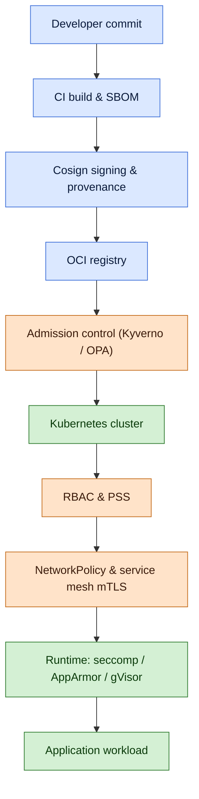

# Container and Kubernetes Security

## Why this matters

Containers and Kubernetes are no longer the new shiny thing — they are the default deployment runtime for almost every cloud-native workload built since the late 2010s. A modern application is rarely a binary on a server; it is a stack of container images pulled from a registry, scheduled by Kubernetes onto a worker node, talking to a dozen other services through a mesh, and reading secrets from somewhere external. Every layer of that stack is software, every layer is mutable, and every layer has a configuration that can be wrong.

Public incident data tells the same story year after year: container and Kubernetes breaches are almost never sophisticated kernel exploits. They are misconfigurations. A pod runs as root because nobody set `runAsNonRoot`. A namespace has no NetworkPolicy and a compromised pod walks freely into the database. A `cluster-admin` ClusterRoleBinding was given to the whole engineering team because RBAC felt fiddly. An image tagged `:latest` was pulled into production and nobody knows which CVEs are inside it. The kubelet on a worker node is exposed to the internet because a security group was too permissive. The pattern repeats across CNCF post-mortems, breach disclosures, and the published threat models from MITRE ATT&CK for Containers and the Trail of Bits Kubernetes review.

The fictional `example.local` organisation in this lesson follows the same path many real organisations took: starting from a Docker-Compose file on a single host, growing to a managed Kubernetes cluster, and learning that the controls that worked on the single host do not transfer. Container security is not just "Linux security in a smaller box". The image is a build-time artefact whose provenance must be proven cryptographically; the orchestrator is a control plane with its own attack surface; the pod-to-pod network is east-west traffic that perimeter firewalls never see; and the runtime is shared — a kernel exploit in one container is an exploit against every container on the host.

This lesson walks the full stack: image build, supply chain, runtime isolation, Kubernetes RBAC, admission control, network policies, and the threat model that ties them together. It assumes familiarity with the broader cloud picture from [Cloud Computing Security](./cloud-computing-security.md) and pairs with [Cloud Security Solutions](./cloud-security-solutions.md) for the protection-controls catalogue.

## Core concepts

### Container basics quick recap

A container is a Linux process that sees a different view of the system than its neighbours. The kernel provides that illusion using two primitives: **namespaces** isolate what the process can see (PID, network, mount, user, IPC, UTS, cgroup), and **cgroups** limit what it can use (CPU, memory, I/O, PIDs). The container shares the host kernel — there is no second kernel inside, unlike a virtual machine.

The **layered filesystem** is the second pillar. An image is a stack of read-only layers (each layer is a tar of filesystem changes plus metadata) plus a writable top layer the container modifies at runtime. Layers are content-addressed by SHA-256 digest, which is why pinning by `@sha256:...` is meaningful and pinning by `:latest` is not.

**Docker** popularised the format; the **Open Container Initiative (OCI)** standardised it. Today the OCI image specification, the OCI runtime specification (implemented by `runc`, `crun`, `runsc`, `kata-runtime`), and the OCI distribution specification define what is portable. Docker the company is now one of many — `containerd`, `CRI-O`, `Podman`, and others all consume OCI images. Kubernetes deprecated direct Docker support in 1.24 in favour of any CRI-compliant runtime.

### Image security — minimal base, pinning, multi-stage

A container image carries every binary, library, configuration file, and stray script that the build process left behind. Each one is potential attack surface. The first lever is the **base image**: a minimal base means fewer CVEs from day one.

- **Distroless images** (gcr.io/distroless) ship only the language runtime and the application — no shell, no package manager, no `curl`. An attacker who lands a shell still has nothing to run.
- **Alpine images** are tiny but use musl libc instead of glibc, which occasionally surfaces compatibility issues. They include `apk` and a shell.
- **Scratch** is the empty base. Statically compiled Go, Rust, or Zig binaries can run on `FROM scratch` with literally nothing else.
- **Wolfi / Chainguard images** are a newer minimal-and-signed track designed for supply-chain hygiene from the start.

The second lever is **pinning by digest, not tag**. `FROM nginx:1.25` resolves to whatever bits the registry returns when the build runs — the maintainer can republish the tag at any time. `FROM nginx@sha256:abc123...` always resolves to the same bytes. Production builds should pin every base image and every dependency by digest; updates become an explicit, reviewable diff in source control.

The third lever is **multi-stage builds**. A Dockerfile can declare multiple `FROM` stages, where the final stage copies only the compiled artefact from earlier build stages. The build toolchain, the source code, the test fixtures, the package caches — none of it ends up in the runtime image. A 1.2 GB build environment shrinks to a 12 MB runtime container.

### Image scanning — what tools do and do not catch

Image scanners parse the layers, identify installed packages and language dependencies, and match them against a vulnerability database. The leading open tools are **Trivy** (Aqua Security), **Grype** (Anchore), and commercial offerings like **Snyk Container** and **Prisma Cloud**.

CVE coverage has limits worth understanding:

- Scanners catch **OS package CVEs** (Debian, Alpine, RHEL advisories) reliably.
- They catch **language-ecosystem CVEs** (npm, PyPI, Maven, Go modules) when manifest files are present and parseable.
- They miss **vendored dependencies** that were copied into the source tree without a manifest entry.
- They miss **misconfigurations inside the image** (a `chmod 777` on `/etc`, an embedded secret, a debug binary) — those need a separate scanner like Trivy's misconfig mode, Dockle, or Hadolint.
- They have **no opinion on runtime behaviour**; an image with zero CVEs can still be malicious.

Scanning fits into three places in the lifecycle: at build time in the CI pipeline (block the merge if a critical CVE is introduced), at registry time (continuously rescan stored images as new CVEs are published), and at admission time (block deployment of an image whose latest scan failed).

### Software supply chain — SBOM, signing, SLSA

The **software supply chain** is everything that contributed to producing the running image: source code, dependencies, build environment, build steps, and the people and machines that touched them. A supply-chain attack injects malicious bits at any of those stages.

A **Software Bill of Materials (SBOM)** is a machine-readable inventory of what an image contains: every package, every version, every license. The two open standards are **CycloneDX** (OWASP) and **SPDX** (Linux Foundation). SBOMs are produced by the build (Syft, Trivy, the language toolchain) and travel with the image. When a new CVE drops, an organisation with SBOMs can answer "which of our running images are affected" in minutes; one without can take weeks.

**Image signing** binds an image digest to an identity. **Cosign** (part of the **Sigstore** project) signs OCI images with either a key pair or — more interestingly — a short-lived certificate issued via OIDC, with the signing event published to the **Rekor** transparency log. Verification at admission time checks both the signature and the log entry. **Notary v2** is the OCI-spec-aligned alternative pushed by Docker, Microsoft, and others.

**SLSA** (Supply-chain Levels for Software Artifacts) is a framework defining four levels of build provenance integrity:

| Level | What it requires |
|---|---|
| SLSA 1 | Build process is documented; provenance is generated automatically |
| SLSA 2 | Source and build are version-controlled; provenance is signed |
| SLSA 3 | Build platform is hardened; provenance is non-forgeable |
| SLSA 4 | Two-person review of every change; hermetic, reproducible builds |

A **provenance attestation** (in-toto format, signed with Cosign) records who built the image, from which source commit, with which build steps, on which platform. Admission policies can require both a valid signature and a provenance attestation that matches an expected source repository.

### Runtime isolation — capabilities, seccomp, AppArmor, gVisor

Once a container is running, the question is what it can do to the host. Linux gives several controls.

**Capabilities** split root's all-or-nothing power into 41 named privileges (`CAP_NET_ADMIN`, `CAP_SYS_ADMIN`, `CAP_CHOWN`, etc.). A container should drop all capabilities by default and add back only what the workload truly needs. `docker run --cap-drop=ALL --cap-add=NET_BIND_SERVICE` is the responsible idiom; in Kubernetes the equivalent lives in `securityContext.capabilities`.

**Seccomp** filters syscalls. A seccomp profile is a JSON list of allowed syscalls; anything else is blocked. The Docker default profile blocks roughly 50 dangerous syscalls; the Kubernetes `RuntimeDefault` profile is similar. Tight per-workload profiles can be auto-generated with tools like `bpftrace` traces or the Inspektor Gadget operator.

**AppArmor** and **SELinux** are mandatory access control systems that label processes and resources, then enforce policy on what each label may access. AppArmor (Ubuntu, Debian) uses path-based rules; SELinux (RHEL, Fedora, Android) uses type enforcement. Either prevents a compromised container from reading host files outside its expected scope.

**User namespaces** map a container's root (UID 0) to an unprivileged UID on the host. A breakout from the container then has the privileges of an unprivileged host user, not host root. Rootless containers (Podman, rootless Docker) take this further by running the entire container engine without root.

**gVisor** (Google) is a userspace kernel that intercepts syscalls and re-implements them in Go, providing strong isolation at a small performance cost. **Kata Containers** runs each pod in a lightweight VM with its own kernel, giving VM-grade isolation with container-grade ergonomics. Both fit workloads where the blast radius of a kernel exploit is unacceptable — multi-tenant SaaS, untrusted code execution, regulated workloads.

### Kubernetes architecture quick recap

A Kubernetes cluster has a **control plane** and one or more **worker nodes**.

The control plane components:

- **kube-apiserver** — the front door; everything reads and writes cluster state through it.
- **etcd** — the distributed key-value store holding all cluster state, including secrets.
- **kube-scheduler** — decides which node runs which pod.
- **kube-controller-manager** — runs control loops that drive actual state toward desired state.
- **cloud-controller-manager** — talks to the cloud provider for nodes, load balancers, storage.

Worker nodes run:

- **kubelet** — the node agent that talks to the api-server and starts containers.
- **kube-proxy** — implements the Service abstraction (iptables or IPVS rules).
- **container runtime** — `containerd` or `CRI-O`, executing OCI containers.

The cluster is a multi-tenant platform. Multiple teams share namespaces, RBAC scopes, and the underlying nodes. The blast radius of a misconfiguration is therefore the whole cluster unless explicit isolation (namespaces + RBAC + NetworkPolicy + PodSecurity + resource quotas) is in place.

### Kubernetes RBAC

Kubernetes **Role-Based Access Control** has four objects:

- **Role** — a set of allowed verbs (`get`, `list`, `create`, `update`, `delete`, `watch`) on resources (`pods`, `secrets`, `deployments`) within a namespace.
- **ClusterRole** — the same, cluster-wide, and required for non-namespaced resources (`nodes`, `clusterroles`, `persistentvolumes`).
- **RoleBinding** — grants a Role to a subject (user, group, or ServiceAccount) within a namespace.
- **ClusterRoleBinding** — grants a ClusterRole cluster-wide.

A **ServiceAccount** is the identity a pod uses to call the api-server. By default every pod gets the namespace's `default` ServiceAccount; explicit per-workload ServiceAccounts are part of least privilege.

Common RBAC misconfigurations: granting `cluster-admin` to a developer team because "they need to debug"; granting `*` verbs on `*` resources in a namespace; mounting the default ServiceAccount token into pods that never call the api-server; using long-lived tokens that never rotate.

### Authentication and authorisation

Kubernetes does not have a built-in user database. Authentication is plugged in:

- **kubeconfig** with X.509 client certificates — fine for cluster admins, painful at scale because revocation is hard.
- **OIDC integration** with an external IdP (Okta, Entra ID, Keycloak) — the recommended human-user path; Kubernetes validates the JWT and uses the claims for RBAC.
- **ServiceAccount tokens** — for in-cluster workloads. Modern Kubernetes uses **BoundServiceAccountTokenVolume** to issue short-lived (one-hour) tokens automatically rotated by the kubelet, replacing the old never-expiring tokens.
- **Webhook authenticators** for custom identity providers.

After authentication, authorisation is layered: RBAC, optional ABAC, optional Node authorizer (limits what kubelets can do), and finally admission controllers (covered below).

### Admission control

Admission controllers run after authentication and authorisation, on every write to the api-server. They come in two flavours:

- **Validating** admission webhooks accept or reject the request.
- **Mutating** admission webhooks can modify the request before it is persisted (inject a sidecar, set a default, add an annotation).

Two ecosystems dominate the policy-as-code space:

- **OPA / Gatekeeper** — uses Rego, a declarative language, with library-style ConstraintTemplates and per-cluster Constraints.
- **Kyverno** — Kubernetes-native policy as YAML, with mutate, validate, generate, and verifyImages rules.

Both can enforce signed images (Cosign verification), block `:latest` tags, require resource limits, prohibit `hostPath` volumes, mandate labels, and dozens more. Kyverno tends to be friendlier for teams without a Rego specialist; OPA is more flexible for complex logic.

### Pod Security Standards

The legacy **PodSecurityPolicy (PSP)** API was removed in Kubernetes 1.25. Its replacement is the **Pod Security Standards (PSS)**, a tiered profile applied via a built-in admission plugin (PodSecurity) or via Kyverno/OPA equivalents.

The three profiles:

| Profile | Scope | Examples of what it forbids |
|---|---|---|
| Privileged | No restrictions | Nothing — for trusted system workloads only |
| Baseline | Block known privilege escalation | hostNetwork, hostPID, privileged containers, host-path volumes, dangerous capabilities |
| Restricted | Hardened best practice | runAsNonRoot, allowPrivilegeEscalation false, drop ALL capabilities, read-only root, seccomp RuntimeDefault |

PSS labels are applied per namespace: `pod-security.kubernetes.io/enforce: restricted` blocks any pod that violates Restricted; `audit` and `warn` modes log without blocking. Most production namespaces should run Restricted; the few that need Privileged should be small, named, and reviewed.

### Network policies

By default every pod can reach every other pod across namespaces. **NetworkPolicy** changes that by declaring allowed ingress and egress per pod selector.

The pattern that matters: **default-deny per namespace**, then explicit allow rules. A NetworkPolicy that selects all pods in a namespace and allows zero ingress is the deny baseline; subsequent policies whitelist needed flows.

NetworkPolicy is an API; it needs a CNI plugin that implements it. **Calico** (using iptables or eBPF) and **Cilium** (eBPF, with deeper L7 policy via CiliumNetworkPolicy) are the leading choices. Cilium also offers identity-based policy keyed off pod labels rather than ephemeral IPs, which is a much better fit for the pod lifecycle.

### Service mesh briefly

A **service mesh** adds a sidecar proxy (Envoy, in most meshes) to every pod. The sidecar handles mTLS between pods, circuit-breaking, retries, and rich telemetry, transparent to the application code.

**Istio** is feature-rich, complex, and the de-facto standard for large clusters. **Linkerd** is simpler, lighter, written in Rust for the data plane, and easier to operate. **Cilium Service Mesh** integrates the mesh into the CNI for sidecar-less operation.

The security win is **mTLS by default** for all intra-cluster traffic, plus **workload identity** via SPIFFE / SPIRE — every pod proves who it is cryptographically, every connection is authenticated and encrypted, and authorisation policies can be expressed in terms of workload identity rather than IP.

### Secrets management

A Kubernetes **Secret** is a base64-encoded blob in etcd. Base64 is encoding, not encryption — anyone with `get secrets` permission reads the cleartext. Two layered fixes:

- **Encryption at rest for etcd** — configure `EncryptionConfiguration` to encrypt Secret resources with a KMS-backed key, ideally an external KMS (AWS KMS, GCP KMS, Azure Key Vault, HashiCorp Vault Transit) so the key is not stored beside the data.
- **External secret stores** — Vault, AWS Secrets Manager, GCP Secret Manager, Azure Key Vault — accessed by pods via the **External Secrets Operator** or the **Secrets Store CSI Driver**, with workload identity (IRSA, Workload Identity Federation) so no static credentials are ever stored in the cluster.

**Sealed Secrets** (Bitnami) is a middle path: secrets are encrypted in Git, decrypted in-cluster only by a controller. Useful for GitOps when an external store is not yet in place.

See [Secrets and Privileged Access Management](../open-source-tools/secrets-and-pam.md) for the broader secrets-tool landscape.

### Etcd security

Etcd holds the kingdom: every Secret, every ConfigMap, every workload definition. Compromise of etcd is compromise of the cluster.

The non-negotiable controls: **encryption at rest** with an external KMS; **mTLS** for all client and peer communication; **network isolation** so etcd is reachable only from the api-server's network; **regular encrypted backups** stored off-cluster; **separate etcd nodes** in production rather than co-locating with kube-apiserver.

Managed Kubernetes services (EKS, GKE, AKS) run etcd for you and handle most of this — but the tenant still has to enable Secret-resource encryption explicitly on most providers.

### Threat model

Two reference models guide container threat modelling:

- **MITRE ATT&CK for Containers** — the tactic-and-technique matrix specifically for container environments: Initial Access, Execution, Persistence, Privilege Escalation, Defense Evasion, Credential Access, Discovery, Lateral Movement, Impact.
- **Trail of Bits Kubernetes Threat Model** — a CNCF-published assessment covering control-plane, worker, and supply-chain attack vectors.

The headline attack patterns:

- **Container escape via privileged pod** — an attacker who can create a pod with `privileged: true` or specific capabilities (`CAP_SYS_ADMIN`, `CAP_SYS_PTRACE`) escapes to the host kernel.
- **Kubelet exposure** — the kubelet on every worker node has an HTTP API on port 10250; if unauthenticated and reachable, anyone can `exec` into any pod on that node.
- **Etcd theft** — an attacker who reaches etcd directly (network, backup, snapshot) reads every Secret in the cluster.
- **Image-tag tricks** — repointing `:latest` or a mutable tag at a malicious image, exploiting any deployment that does not pin by digest.
- **Compromised CI** — pipelines with cluster credentials are a high-value target; one stolen kubeconfig can deploy to production.
- **Supply-chain injection** — a typosquatted dependency, a compromised maintainer account, or a backdoored base image lands code in production through trusted build paths.
- **Token theft** — long-lived ServiceAccount tokens stolen from a compromised pod or container filesystem give the attacker the pod's API privileges.
- **Sidecar abuse** — a malicious init container or admission webhook injects a sidecar that exfiltrates secrets.

The defensive shape: harden the image, sign and verify it, isolate the runtime, scope RBAC, gate at admission, segment the network, encrypt etcd, and audit everything.

## Cloud-native security stack

The stack below shows where each control sits, from developer commit to running workload. Trust flows left-to-right; a failure at any earlier stage breaks the assumptions of every later stage.

Read this as a chain of cryptographic assertions and policy gates. The build stage produces an SBOM and a signature bound to a source commit. The registry holds those artefacts. Admission control verifies them before the cluster persists the workload. RBAC, PSS, and NetworkPolicy decide what the running workload can do; the runtime layer is the last line of defence if everything above failed.

The mistake to avoid is treating any one of these as sufficient on its own. A signed image with a `cluster-admin` ServiceAccount is still a disaster waiting; a hardened runtime with no admission control is one bad image away from a breach.

## Hands-on / practice

Five exercises a learner can run with a local Kubernetes (kind, k3d, minikube), Docker, and freely available tooling. None require paid services; all produce reviewable artefacts.

### 1. Build a multi-stage Dockerfile and scan with Trivy

Take a small Go or Python web application. Write a multi-stage Dockerfile: a `builder` stage with the full toolchain, and a final stage on `gcr.io/distroless/static-debian12` (Go) or a minimal Python runtime image. Pin both base images by `@sha256:` digest. Build it, then run `trivy image --severity HIGH,CRITICAL myapp:1.0`. Answer:

- How many CVEs in the builder image versus the final image?
- Which packages contributed the CVEs, and could a different base image eliminate them?
- Did Trivy find any misconfigurations (`trivy config Dockerfile`) such as missing `USER` or running as root?

Iterate until the final image scans clean at HIGH and CRITICAL.

### 2. Sign an image with Cosign and verify it at admission

Install `cosign`, generate a key pair (`cosign generate-key-pair`), push your image to a local registry, and sign it (`cosign sign --key cosign.key registry.local/myapp:1.0`). Verify the signature manually with `cosign verify`. Then deploy a Kyverno policy that requires `cosign verify` to succeed before any pod from that registry is admitted. Push an unsigned image and confirm admission rejects it.

### 3. Deploy a Kyverno policy that blocks `:latest`

Write a Kyverno ClusterPolicy that validates pod specs and rejects any container whose image reference uses the `:latest` tag or has no tag at all. Apply it cluster-wide. Try to deploy `nginx:latest` and `nginx` (no tag) and confirm both are blocked. Deploy `nginx:1.25.4` and confirm it is admitted. Then extend the policy to require digests (`@sha256:...`) and observe the failure message.

### 4. Create a default-deny NetworkPolicy in a namespace

In a sandbox namespace, deploy two pods: a client (`curl`) and a server (`nginx`). Confirm the client can reach the server. Apply a NetworkPolicy with `podSelector: {}` and an empty `ingress` array — the namespace default-deny. Re-test; the client should fail. Add a NetworkPolicy that allows ingress to the server pod from the client pod by label, and confirm reachability returns. Repeat for egress to deny outbound except to specific targets.

### 5. Configure RBAC so a developer can only access one namespace

Create a `dev-team` namespace and a ServiceAccount `alice`. Define a Role granting `get`, `list`, `watch`, `create`, `update`, `delete` on `pods`, `deployments`, `services`, and `configmaps` in that namespace only. Bind it. Generate a kubeconfig for the ServiceAccount. From that kubeconfig, confirm `alice` can manage workloads in `dev-team` but cannot read pods in `kube-system` or list `nodes`. Then attempt to escalate: can `alice` create a Role that grants more? (Answer: no — the escalate verb is required.)

## Worked example — `example.local` migrates to a hardened Kubernetes platform

`example.local` runs a customer-facing web platform — six services, twelve worker processes, three databases — on a single Docker-Compose host. The host is a 32-core VM, root access shared by the engineering team, no image scanning, no secrets management, and the deploy is `docker compose up -d` from a developer laptop. After a near-miss where a stale dependency CVE in a public-facing service almost shipped to production, the CTO approves a migration to a hardened Kubernetes platform.

**Target architecture.** A managed Kubernetes cluster (three control-plane replicas, six worker nodes spread across three availability zones), a private OCI registry, a CI/CD pipeline running in a separate hardened account, GitOps reconciliation via FluxCD, Kyverno admission policies, default-deny NetworkPolicies per namespace, Cilium as the CNI for L7 policy and Hubble flow visibility, and external secrets via Vault.

**Image build pipeline.** Every service has a multi-stage Dockerfile with a distroless runtime stage, base images pinned by digest, and a `USER` directive setting a non-root UID. The CI pipeline runs `trivy image` and fails the build on any HIGH or CRITICAL CVE. After scan, `syft` generates a CycloneDX SBOM, `cosign sign --keyless` signs the image (using the pipeline's OIDC identity), and `cosign attest` attaches the SBOM and the SLSA provenance. The image is pushed to the private registry tagged `service-name:git-sha-short`.

**GitOps deploy.** A separate Git repository (`example.local-gitops`) holds Kustomize manifests with image references pinned by digest. A Flux Kustomization reconciles the cluster every minute. Developers do not have direct cluster credentials; they raise pull requests against the GitOps repo, which are reviewed and merged. Flux then pulls the new manifests and applies them.

**Kyverno admission policies.**

- `verifyImages` — requires every image to be signed by `example.local`'s pipeline OIDC identity, with the signature in Rekor.
- `disallow-latest-tag` — blocks `:latest` and untagged images.
- `require-non-root` — rejects pods without `runAsNonRoot: true`.
- `require-resource-limits` — every container has CPU and memory limits.
- `restrict-host-namespaces` — bans `hostNetwork`, `hostPID`, `hostIPC`.
- `pod-security-standard` — sets the namespace `enforce: restricted` for all application namespaces; only `kube-system` and a small `infra` namespace are allowed `baseline`.

**RBAC.** A ServiceAccount per workload, each with a Role scoped to the resources its pod actually reads (typically nothing — most workloads do not need API access at all). Human access is via OIDC federation to `EXAMPLE\` SSO; developers receive Roles in their team namespace; cluster-admin is held by exactly four `EXAMPLE\platform-eng` engineers and audited monthly.

**Network policies.** Every namespace ships with a `default-deny` NetworkPolicy and explicit `allow-from-ingress-controller` and `allow-to-dns` policies. Service-to-service traffic uses Cilium's identity-based policy, expressed in terms of `app=` labels. Database namespaces only accept traffic from the matching application namespace.

**Secrets.** Vault runs in a dedicated namespace with auto-unseal via cloud KMS. The External Secrets Operator pulls secrets into Kubernetes Secrets, which are encrypted at rest in etcd via the KMS provider plugin. Vault authenticates pods via the Kubernetes auth method using BoundServiceAccountTokens, so no static credentials exist anywhere.

**OPA / policy in CI.** Before any GitOps PR can merge, a CI job runs OPA Conftest against the rendered manifests, applying the same policies Kyverno enforces in-cluster, plus a few build-time checks (no `imagePullPolicy: Always` with floating tags, no `emptyDir` for stateful data). Failures show up in the PR as review comments; merges are blocked until clean.

**Etcd and control-plane.** The managed provider runs etcd; `example.local` enables KMS-backed Secret encryption, configures audit logging to ship every API write to the SIEM, and restricts api-server access to a list of known IP ranges plus the cluster's internal load balancer.

**Service mesh.** Linkerd is deployed for mTLS between application pods. mTLS is on by default for every pod in mesh-enabled namespaces; ServerAuthorization policies restrict which client identities may reach each service.

**Outcome.** Six months in, `example.local` has not had an image-tag incident, no secret has leaked into a Git repo (pre-commit hooks plus the absence of static credentials), and an audit can be answered with "here is the SBOM for every running image, signed by our pipeline, with a Rekor log entry per signature". The platform team's runbook for "a new critical CVE was published" is a single command that lists every affected running image with its team owner.

## Troubleshooting and pitfalls

- **Privileged containers in production.** A pod with `privileged: true` is effectively root on the worker node. Block at admission via PSS Restricted or Kyverno; allow only in named system namespaces with documented justification.
- **`hostNetwork`, `hostPID`, `hostIPC`.** These flags share the host's network or process namespaces with the pod. A compromised pod sees and can interact with every other process on the node. Block them at admission.
- **Kubelet anonymous access.** The kubelet on port 10250 must require client cert auth and authorisation. Anonymous-allowed kubelets exposed to the network are a one-step takeover of every pod on the node.
- **Exposing kube-apiserver to the public internet.** Even with strong authentication, the api-server is the cluster's front door. Restrict to known networks; require OIDC; never expose it on `0.0.0.0` without a private endpoint.
- **`cluster-admin` everywhere.** Granting cluster-admin to a developer team because RBAC felt fiddly is the most common Kubernetes RBAC failure. Default to namespaced Roles; require explicit, audited justification for cluster-admin.
- **Default ServiceAccount tokens auto-mounted into every pod.** Most workloads never call the api-server. Set `automountServiceAccountToken: false` on Pod specs that do not need it; the mounted token is otherwise a credential exfiltrable from any compromised container.
- **Long-lived ServiceAccount tokens.** Pre-1.22 tokens never expired. Use BoundServiceAccountTokenVolume (default in modern clusters) to issue one-hour tokens auto-rotated by the kubelet.
- **Secrets in environment variables.** Environment variables are visible in `ps`, in container logs if echoed, and in Kubernetes events. Mount Secrets as files via a tmpfs volume, or use the Secrets Store CSI Driver to project from an external store.
- **Stale image scans.** A scan from six months ago does not protect against a CVE published last week. Continuously rescan registry images; gate admission on the latest scan result; treat scan-status drift as a vulnerability.
- **Image-tag tricks.** `:latest`, `:v1`, or any mutable tag means "whatever the registry returns now". Pin every image by digest; enforce at admission.
- **Missing seccomp profile.** Many clusters run pods with `seccompProfile: Unconfined` because the default before 1.27 was unrestricted. Set `seccompProfile.type: RuntimeDefault` cluster-wide via PSS Restricted or a Kyverno mutation.
- **No Pod Security enforcement.** PSP was deleted, and many clusters never adopted PSS. A Restricted-tier label on every application namespace is one of the highest-leverage controls available.
- **Inadequate audit logging.** The api-server's audit log records every authenticated request; without it, post-incident forensics is guesswork. Enable a comprehensive audit policy (Metadata for routine ops, Request/RequestResponse for sensitive verbs) and ship it off-cluster.
- **Unbounded resource requests.** Pods without CPU and memory limits can starve the node and trigger noisy-neighbour failures. Set defaults via LimitRange; require limits via Kyverno; observe with metrics.
- **Allowing `hostPath` volumes.** A `hostPath` mount lets a pod read or write the host filesystem — the canonical container-escape vector. Block at admission; use PersistentVolumes with explicit StorageClasses instead.
- **Trusting the in-cluster network.** Without a default-deny NetworkPolicy, every pod can reach every other pod. Lateral movement after one pod compromise is unrestricted. Default-deny per namespace, then explicit allow.
- **Mutating admission webhooks failing open.** A webhook with `failurePolicy: Ignore` means the cluster keeps accepting writes when the webhook is down. For security-relevant webhooks, set `failurePolicy: Fail` and ensure the webhook is highly available; for operational webhooks, fail-open may be the right choice — but make it explicit.
- **GitOps drift.** A platform team that lets engineers `kubectl apply` directly outside the GitOps flow has two sources of truth and no audit trail. Disable direct apply via RBAC; route all changes through the GitOps repository.
- **Etcd backups stored unencrypted or in the same blast radius.** An attacker who reads an etcd backup reads every Secret. Encrypt backups with a key the cluster does not hold; store them in a separate account or tenancy.

## Key takeaways

- Containers are processes with a layered filesystem, namespaces, and cgroups — they share the host kernel. Image hygiene and runtime confinement are the two halves of container security.
- Image security starts with a minimal base, pinning by digest, and multi-stage builds. Scan in CI, in the registry, and at admission; understand what scanners do not catch.
- Software supply chain demands SBOMs, signed images (Cosign / Sigstore), and provenance attestations (SLSA). Verify all three at admission, not just on the developer's laptop.
- Runtime isolation is layered: drop capabilities, apply seccomp, label with AppArmor or SELinux, prefer non-root and user namespaces. For untrusted workloads, gVisor or Kata.
- Kubernetes is a multi-tenant platform. Namespaces + RBAC + NetworkPolicy + PodSecurity + ResourceQuota make it tenant-safe; absent any of those, the blast radius is the cluster.
- RBAC must be least privilege. ServiceAccount per workload, Role scoped to actual needs, no default-token mount where unneeded, OIDC for humans, BoundServiceAccountTokens for pods.
- Admission control (Kyverno, OPA / Gatekeeper) is where policy meets reality. Block unsigned images, mutable tags, privileged pods, missing limits, host namespaces, and hostPath volumes.
- Pod Security Standards replaced PodSecurityPolicy. Restricted is the production default; Baseline for legacy that cannot meet Restricted; Privileged for tightly controlled system namespaces only.
- Network policy starts default-deny per namespace and adds explicit allows. CNI choice matters — Calico and Cilium are the leaders; Cilium offers identity-based and L7 policy.
- Service mesh provides mTLS and workload identity transparently. Useful in proportion to cluster size and risk; not free in operational complexity.
- Secrets are not encrypted by default — they are base64. Encrypt etcd with KMS; prefer external stores (Vault, cloud secret managers) accessed via workload identity.
- The threat model is published — MITRE ATT&CK for Containers and the Trail of Bits Kubernetes review. Use them to drive defensive coverage rather than reinventing categories.

A container and Kubernetes programme that pins, signs, scans, gates, segments, and audits — at every stage from commit to runtime — turns the platform's complexity from a liability into an advantage. One that relies on tribal knowledge and "we'll lock it down later" eventually shows up in a CVE-numbered post-mortem.

## References

- CIS Kubernetes Benchmark — [https://www.cisecurity.org/benchmark/kubernetes](https://www.cisecurity.org/benchmark/kubernetes)
- NIST SP 800-190 — *Application Container Security Guide* — [https://csrc.nist.gov/publications/detail/sp/800-190/final](https://csrc.nist.gov/publications/detail/sp/800-190/final)
- MITRE ATT&CK for Containers — [https://attack.mitre.org/matrices/enterprise/containers/](https://attack.mitre.org/matrices/enterprise/containers/)
- Kubernetes Pod Security Standards — [https://kubernetes.io/docs/concepts/security/pod-security-standards/](https://kubernetes.io/docs/concepts/security/pod-security-standards/)
- Kubernetes RBAC documentation — [https://kubernetes.io/docs/reference/access-authn-authz/rbac/](https://kubernetes.io/docs/reference/access-authn-authz/rbac/)
- Cosign / Sigstore — [https://docs.sigstore.dev/](https://docs.sigstore.dev/)
- SLSA framework — [https://slsa.dev/](https://slsa.dev/)
- CycloneDX SBOM specification — [https://cyclonedx.org/](https://cyclonedx.org/)
- SPDX SBOM specification — [https://spdx.dev/](https://spdx.dev/)
- OWASP Kubernetes Top Ten — [https://owasp.org/www-project-kubernetes-top-ten/](https://owasp.org/www-project-kubernetes-top-ten/)
- Trail of Bits — *Kubernetes Threat Model and Security Audit (CNCF)* — [https://github.com/kubernetes/community/tree/master/wg-security-audit](https://github.com/kubernetes/community/tree/master/wg-security-audit)
- Kyverno documentation — [https://kyverno.io/docs/](https://kyverno.io/docs/)
- OPA Gatekeeper — [https://open-policy-agent.github.io/gatekeeper/](https://open-policy-agent.github.io/gatekeeper/)
- Cilium documentation — [https://docs.cilium.io/](https://docs.cilium.io/)
- Related lesson — [Cloud Computing Security](./cloud-computing-security.md)
- Related lesson — [Cloud Security Solutions](./cloud-security-solutions.md)
- Related lesson — [Secure Application Development](../secure-app-development.md)
- Related lesson — [Enterprise Security Architecture](../architecture/enterprise-security-architecture.md)
- Related lesson — [Vulnerability and AppSec Tools](../open-source-tools/vulnerability-and-appsec.md)
- Related lesson — [Secrets and PAM Tools](../open-source-tools/secrets-and-pam.md)
- Related lesson — [OWASP Top 10](../../red-teaming/owasp-top-10.md)
- Related lesson — [Security Controls](../../grc/security-controls.md)
