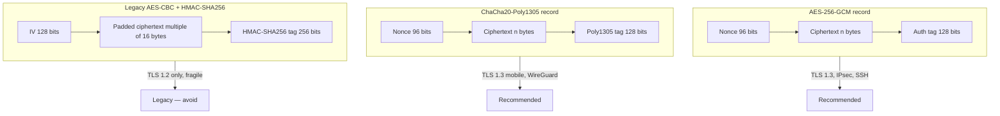

# Cryptography — Advanced Topics

The [basics lesson](./cryptography-basics.md) walks through the building blocks: symmetric and asymmetric ciphers, hashes, signatures, and the hybrid TLS handshake. This advanced pass covers what real systems running on `example.local` actually use today — AEAD modes, elliptic-curve key agreement, post-quantum migration, blockchain primitives, homomorphic encryption, zero-knowledge proofs, and the cryptanalysis attacks that keep showing up in incident reports.

## Why this matters

Most engineers can name AES, RSA and SHA-256. Far fewer can explain why AES-GCM replaced AES-CBC+HMAC, why a single nonce reuse is fatal, what `X25519` does inside TLS 1.3, or why your CISO is sending memos about post-quantum migration in 2026. Yet those are the questions that show up in code review, in vendor RFPs, and on every mature security audit.

The basics teach the building blocks. The advanced topics are where those building blocks get assembled into protocols you ship — and where a single wrong assumption (an ECB-mode database column, a 32-bit GCM nonce, a SHA-1 signature on a TLS chain) becomes a CVE. This lesson is the engineer's tour of the next layer.

## Core concepts

### Modes of operation revisited

A raw block cipher only encrypts one block. Modes of operation chain blocks together to encrypt arbitrary-length messages. Picking the wrong mode breaks an otherwise sound cipher.

| Mode | One-line | Authenticated | Use today |
|---|---|---|---|
| **ECB** | Encrypt each block independently. | No | **Never.** Identical plaintext blocks produce identical ciphertext (the "ECB penguin"). |
| **CBC** | XOR each plaintext block with the previous ciphertext, then encrypt. Needs a random IV. | No | Legacy only. Padding-oracle attacks (POODLE, Lucky 13) sank it for TLS. |
| **CTR** | Encrypt a counter, XOR with plaintext — a stream cipher built from a block cipher. | No | Building block inside GCM. Do not use bare CTR — no integrity. |
| **GCM** | CTR plus a Galois-field MAC tag. | **Yes (AEAD)** | Default everywhere — TLS 1.3, SSH, IPsec, disk encryption. |
| **CCM** | CTR plus CBC-MAC. | **Yes (AEAD)** | WPA2, IoT, constrained devices. Not "online" — needs message length up front. |
| **ChaCha20-Poly1305** | Stream cipher with a Poly1305 MAC. | **Yes (AEAD)** | TLS 1.3 alternative, preferred on mobile and CPUs without `AES-NI`. |
| **XTS** | Two-key tweakable mode for fixed-size sectors. | No (by design) | Full-disk encryption — BitLocker, LUKS, FileVault. |

The single rule of thumb that prevents most modern crypto bugs: **use AEAD by default**. AES-GCM or ChaCha20-Poly1305. Bare CBC, bare CTR and ECB do not belong in new code.

### AEAD — Authenticated Encryption with Associated Data

For most of the 2000s engineers tried to compose confidentiality and integrity by hand: encrypt with AES-CBC, then HMAC the ciphertext, then prepend or append the tag. This pattern, "encrypt-then-MAC", is correct *if* you implement it perfectly — and most implementations did not. Padding-oracle attacks (POODLE, Lucky 13, Bleichenbacher 2018) repeatedly extracted plaintext from "secure" CBC+HMAC TLS suites because timing or error-handling leaked one bit per query about the padding.

AEAD merges encryption and authentication into a single primitive that takes:

- **Plaintext** — the secret bytes.
- **Key** — typically 256 bits.
- **Nonce** — unique per message (96 bits for GCM, 96 bits for ChaCha20-Poly1305).
- **Associated Data (AD)** — header bytes that are authenticated but **not** encrypted. Typical AD: TLS record header, packet sequence number, file metadata.

Decryption either returns the plaintext or fails outright with a constant-time tag check. There is no "decrypt and then check" — the failure path is atomic, which is what kills padding-oracle attacks.

The two AEADs everyone ships today:

- **AES-256-GCM** — hardware-accelerated on every modern CPU via `AES-NI` and `PCLMULQDQ`. Fastest in TLS 1.3 on servers.
- **ChaCha20-Poly1305** — software-only, constant-time, 3-4x faster than AES on CPUs without `AES-NI` (older ARM, low-end IoT). RFC 8439 mandatory in TLS 1.3.

If your code calls anything except an AEAD construction, you have either a strong reason or a bug in waiting.

### Elliptic Curve Cryptography (ECC)

RSA security rests on the difficulty of factoring large integers. ECC rests on a different hard problem — the elliptic-curve discrete logarithm — which scales much better. The headline number: a 256-bit ECC key gives roughly the same security as a 3072-bit RSA key, and a 384-bit ECC key matches RSA-7680. Smaller keys mean smaller signatures, smaller certificates, and dramatically faster handshakes.

| Curve | Security level | Where it shows up |
|---|---|---|
| **P-256** (secp256r1, NIST P-256) | 128-bit | Default ECDSA / ECDH curve in TLS, most CAs. |
| **P-384** (secp384r1) | 192-bit | High-assurance and government deployments (CNSA Suite 1.0). |
| **P-521** (secp521r1) | 256-bit | Niche; rarely required. |
| **Curve25519 / X25519** | 128-bit | Modern ECDH (TLS 1.3, SSH, WireGuard, Signal). Designed to be misuse-resistant. |
| **Ed25519** | 128-bit | Signatures on the Edwards form of Curve25519. SSH default, many JWT libraries. |
| **Curve448 / X448 / Ed448** | 224-bit | Higher-assurance pair. TLS 1.3 supports it. |

In practice you will see two ECC operations:

- **ECDH** (Elliptic-Curve Diffie–Hellman) — both sides generate a key pair, swap publics, and each computes the same shared point. The x-coordinate becomes the shared secret. Used for **key agreement**, never to encrypt arbitrary data.
- **ECDSA / EdDSA** — signatures. ECDSA on P-256 is everywhere; Ed25519 is the modern default because it is deterministic, fast, and avoids the catastrophic nonce-reuse bug that broke the Sony PS3 ECDSA implementation.

Modern guidance: prefer **X25519** for key agreement and **Ed25519** for signatures unless a compliance regime forces P-256 or P-384.

### Diffie–Hellman variants

The 1976 Diffie–Hellman key exchange is the ancestor of every key-agreement protocol you use. The variants worth knowing:

- **Classical DH** — over a multiplicative group mod a 2048+ bit prime. Still in use for IKEv2 and some legacy TLS, but slow.
- **DHE** (ephemeral) — the long-term key is replaced by a fresh key per session. Provides Perfect Forward Secrecy (PFS).
- **ECDH / ECDHE** — the same idea on an elliptic curve. Smaller, faster, mainstream.
- **X25519** — ECDH on Curve25519 with a fixed parameter set, hard to misuse, the TLS 1.3 default. RFC 7748.
- **X448** — the higher-assurance sibling on Curve448.

In TLS 1.3, **all** key agreements are ephemeral — RSA key transport was removed entirely. If your TLS server still negotiates a non-`ECDHE` suite, it is running TLS 1.2 or worse and has no forward secrecy.

### Post-Quantum Cryptography (PQC)

A sufficiently large quantum computer running Shor's algorithm breaks every widely deployed public-key system: RSA, DH, ECDH, ECDSA, Ed25519. Symmetric crypto and hashes are weakened (Grover's algorithm halves the effective security level) but not broken — AES-256 stays at 128-bit post-quantum security, which is acceptable.

The threat is **not** "quantum computers exist tomorrow." It is **harvest-now, decrypt-later** — a hostile state records your TLS traffic today and decrypts it the year a 4000-qubit machine ships. Anything with a long confidentiality horizon (medical records, intelligence cables, banking PII, M&A drafts) needs a PQC plan now.

NIST finalised the first PQC standards in 2024:

| Standard | Algorithm | Replaces | Use |
|---|---|---|---|
| **FIPS 203 — ML-KEM** | Kyber (lattice-based) | RSA / ECDH key agreement | Key encapsulation in TLS, IPsec, SSH. |
| **FIPS 204 — ML-DSA** | Dilithium (lattice-based) | RSA / ECDSA / Ed25519 signatures | General-purpose signatures, code signing. |
| **FIPS 205 — SLH-DSA** | SPHINCS+ (hash-based) | — | Conservative signatures for very long-lived artefacts (firmware roots of trust). |

Migration today is **hybrid**: combine a classical KEM with a PQC KEM and feed both shared secrets into the KDF. If either holds, the session is safe. TLS 1.3 has a draft hybrid `X25519MLKEM768` group already shipped in Chrome and Cloudflare. Plan to follow the same pattern in IPsec, SSH and your internal PKI.

### Cryptographic agility

Every algorithm in this lesson will be deprecated eventually — DES was, MD5 was, SHA-1 was, RSA-1024 was. Building software that lets you swap primitives without a rewrite is **cryptographic agility**. The practical checklist:

- Algorithm and parameter identifiers travel with the data — never hard-code "AES-256-GCM" as the only branch.
- Wrap calls in a thin internal `crypto` module so a new algorithm is a one-file change.
- Version every ciphertext blob with a magic byte or header so you can identify legacy blobs and re-encrypt them on read.
- Plan for two algorithms in parallel during migration, not one swapped overnight.
- Test the migration path before you need it — staged rollout of TLS 1.3, hybrid PQC handshakes, signed code with both `RSA` and `Ed25519` chains.

The CISO's job is to write the policy. Your job is to make sure the code can actually execute it.

### Blockchain cryptography

Blockchain is not a single algorithm — it is a stack of well-known primitives bolted into a specific assembly:

- **Hash chain** — each block stores `H(previous_block || transactions)`. Tampering with any historical block invalidates every block after it. Bitcoin uses double SHA-256; Ethereum uses Keccak-256.
- **Merkle tree** — transactions inside a block are hashed pairwise up to a single root. A light client can prove a transaction is in a block by sending only `O(log n)` hashes, not the full block.
- **ECDSA on secp256k1** — Bitcoin and Ethereum addresses are derived from secp256k1 public keys. Signatures authorise transactions.
- **BLS signatures** — used by Ethereum 2.0 validators. BLS supports **signature aggregation**: thousands of validator signatures combine into one short signature, slashing on-chain storage.
- **Schnorr signatures** — Bitcoin Taproot (BIP-340) added Schnorr alongside ECDSA. Linear, aggregatable, smaller.
- **Hash-based proof-of-work / proof-of-stake** — orthogonal to crypto primitives but built on hash difficulty.

If you only remember one thing about blockchain crypto, remember that the security of every wallet boils down to "did the user keep the secp256k1 private key safe?" — same threat model as any other ECDSA key, with a much higher bounty.

### Homomorphic encryption

Homomorphic encryption lets you compute on ciphertext: `Enc(a) ⊕ Enc(b) = Enc(a + b)` for some operator. The decrypted result equals the plaintext computation. The decryption key never leaves the data owner.

Three tiers:

- **Partially Homomorphic Encryption (PHE)** — supports one operation indefinitely. RSA is multiplicatively homomorphic; ElGamal is multiplicatively homomorphic; Paillier is additively homomorphic. Cheap, mature, narrow.
- **Somewhat Homomorphic Encryption (SHE)** — supports a bounded number of additions and multiplications. Underlies most practical schemes.
- **Fully Homomorphic Encryption (FHE)** — supports arbitrary computation. Schemes: BFV, BGV (integer arithmetic), CKKS (approximate real arithmetic, popular for ML), TFHE (Boolean circuits, fast). Microsoft SEAL, OpenFHE, IBM HElib, Zama Concrete are the main libraries.

FHE was a research curiosity until ~2020. It is now real: encrypted medical analytics, encrypted ML inference, private database queries. The catch is performance — FHE operations are anywhere from 1,000 to 1,000,000 times slower than plaintext, depending on the scheme and circuit depth. Use it when the privacy gain justifies that cost; otherwise look at trusted execution environments (Intel SGX, AMD SEV, AWS Nitro Enclaves) or secure multi-party computation.

### Zero-knowledge proofs

A zero-knowledge proof (ZKP) lets a prover convince a verifier that some statement is true without revealing **why** it is true. Classic toy example: proving you know the secret colour-blindness-distinguishable sock pair without showing it.

Two flavours:

- **Interactive ZKPs** — prover and verifier exchange multiple challenge–response rounds (Schnorr identification, Fiat–Shamir before transformation).
- **Non-interactive ZKPs (NIZK)** — a single message suffices, typically using the Fiat–Shamir heuristic to derive challenges from a hash. This is what production systems use.

The two production-grade NIZK families:

- **zk-SNARKs** — Succinct Non-interactive ARguments of Knowledge. Tiny proofs (a few hundred bytes), millisecond verification, but require a **trusted setup** ceremony per circuit. Used by Zcash, Tornado Cash, ZK-rollups (zkSync, Scroll).
- **zk-STARKs** — Scalable Transparent ARguments of Knowledge. Larger proofs (tens of kilobytes), slower verification, but **no trusted setup** and **post-quantum** because they only need a hash function. Used by StarkNet, dYdX.

Where ZKPs land in real systems today: privacy coins, ZK-rollups for Ethereum scaling, anonymous credentials, password-leak checks, age verification without revealing age, and more recently zkML (proving an ML model produced a specific output without revealing the model).

### Cryptanalysis attacks

Real-world breaks rarely come from breaking the maths. They come from breaking the surrounding implementation. The attack catalogue every defender should know:

- **Brute force** — try every key. Defeated by sufficient key length (AES-128 is brute-force-safe for the foreseeable future).
- **Dictionary attack** — try common passwords against a hash. Defeated by salting and slow KDFs (Argon2id, scrypt, bcrypt).
- **Rainbow tables** — precomputed hash → password lookup tables. Defeated entirely by per-user salts.
- **Birthday attack** — find any two inputs that collide in an `n`-bit hash with about `2^(n/2)` work. Why MD5 (128-bit, 2^64 work) and SHA-1 (160-bit, 2^80 work) are dead.
- **Side-channel attacks** — exploit timing, power consumption, electromagnetic emissions, or cache behaviour. Defeated by **constant-time** code (`crypto.subtle`, libsodium, BoringSSL) — never compare MACs with `==`, always use `crypto_verify_16`.
- **Known-plaintext** — attacker has matched plaintext / ciphertext pairs. Modern ciphers are designed to resist it.
- **Chosen-plaintext (CPA)** — attacker can encrypt arbitrary plaintexts. AEAD modes are CPA-secure.
- **Chosen-ciphertext (CCA)** — attacker can submit chosen ciphertexts to a decryption oracle. AEAD modes are CCA-secure; bare CBC is not.
- **Padding-oracle** — server leaks one bit ("padding valid" vs "MAC failed") and the attacker walks the ciphertext byte by byte. POODLE (SSL 3.0), BEAST, Lucky 13 (TLS-CBC).
- **Bleichenbacher** — RSA PKCS#1 v1.5 padding oracle. The 1998 paper is back periodically as ROBOT (2017) and Marvin (2023). Use RSA-OAEP, not PKCS#1 v1.5.
- **Lucky 13** — micro-timing attack on TLS-CBC HMAC verification. Killed CBC suites in TLS 1.3.
- **DROWN, FREAK, Logjam** — protocol-level downgrade attacks on legacy SSL/TLS. Killed by removing the broken ciphers entirely.

The pattern is consistent: **the algorithm is fine, the protocol or the implementation leaks**. Your defence is to use modern AEAD, constant-time libraries, and keep the cryptographic perimeter as small as possible.

### Key management lifecycle

Algorithms are mature; key management is where most real systems fall over. The lifecycle every key must follow:

1. **Generation** — from a CSPRNG (`/dev/urandom`, `BCryptGenRandom`, `getrandom(2)`), inside an HSM where possible.
2. **Distribution** — secured by a higher-level mechanism (TLS-protected enrollment, manual transport, Shamir splitting for root keys).
3. **Storage** — HSM, KMS (AWS KMS, Azure Key Vault, GCP KMS), TPM, or at minimum encrypted with a master key from a secrets manager.
4. **Use** — accessed only by least-privileged services, audited, rate-limited.
5. **Rotation** — on a schedule (TLS 90 days, signing keys yearly, symmetric data keys driven by data volume) and **immediately** after suspected compromise.
6. **Escrow** — court-ordered or business-continuity copies in split custody. Almost never appropriate for end-user keys.
7. **Destruction** — cryptographically shred (overwrite + delete) when the key is retired. An HSM zeroise command is the gold standard.

Track the lifecycle. A key without a documented expiry is a key that lives forever, which is a key that eventually leaks.

## Modes diagram

How the wire format differs across the three constructions you will see most often:



The two AEAD constructions look almost identical on the wire — one nonce, one ciphertext, one tag, all atomic. The legacy CBC+HMAC layout has more moving parts and depends on the implementation getting MAC-then-encrypt vs encrypt-then-MAC right. That is why TLS 1.3 dropped it.

## Hands-on / practice

Five exercises. Run them on a lab box; do not point them at production.

### 1. Encrypt a file with AES-256-GCM in Python

```python
# pip install cryptography
import os
from cryptography.hazmat.primitives.ciphers.aead import AESGCM

key   = AESGCM.generate_key(bit_length=256)
nonce = os.urandom(12)            # 96-bit nonce — unique per message
aead  = AESGCM(key)

plaintext = b"Confidential memo for example.local"
aad       = b"doc-id=42; classification=internal"

ciphertext = aead.encrypt(nonce, plaintext, aad)
recovered  = aead.decrypt(nonce, ciphertext, aad)
assert recovered == plaintext
print("OK — ciphertext len:", len(ciphertext), "bytes")
```

Things to notice: the nonce is **never** reused under the same key, the AAD is authenticated but not encrypted, and `decrypt` either returns plaintext or raises `InvalidTag` — there is no "partial" failure.

### 2. ECDH key agreement with OpenSSL

```bash
# Both parties generate X25519 key pairs
openssl genpkey -algorithm X25519 -out alice.key
openssl genpkey -algorithm X25519 -out bob.key

# Extract publics
openssl pkey -in alice.key -pubout -out alice.pub
openssl pkey -in bob.key   -pubout -out bob.pub

# Each side derives the same shared secret
openssl pkeyutl -derive -inkey alice.key -peerkey bob.pub   -out alice_shared.bin
openssl pkeyutl -derive -inkey bob.key   -peerkey alice.pub -out bob_shared.bin

# Confirm they match
sha256sum alice_shared.bin bob_shared.bin
```

The two SHA-256 sums must match. Feed that shared secret into HKDF before using it as a symmetric key — never use the raw ECDH output directly.

### 3. Verify an Ed25519 signature

```bash
# Sign
openssl genpkey -algorithm Ed25519 -out signer.key
openssl pkey    -in signer.key -pubout -out signer.pub

echo "Release 1.4.0 of example.local agent" > release-notes.txt
openssl pkeyutl -sign -inkey signer.key -rawin -in release-notes.txt -out release-notes.sig

# Verify
openssl pkeyutl -verify -pubin -inkey signer.pub \
    -rawin -in release-notes.txt -sigfile release-notes.sig
# Output: Signature Verified Successfully
```

Change a single byte in `release-notes.txt` and re-run the verify step. The signature must fail loudly. There is no "close enough" — every digital signature is binary.

### 4. Build a minimal Merkle tree

```python
import hashlib

def H(b: bytes) -> bytes:
    return hashlib.sha256(b).digest()

def merkle_root(leaves: list[bytes]) -> bytes:
    nodes = [H(l) for l in leaves]
    while len(nodes) > 1:
        if len(nodes) % 2 == 1:
            nodes.append(nodes[-1])      # duplicate the last leaf
        nodes = [H(nodes[i] + nodes[i+1]) for i in range(0, len(nodes), 2)]
    return nodes[0]

txs  = [b"tx-A", b"tx-B", b"tx-C", b"tx-D"]
root = merkle_root(txs).hex()
print("Merkle root:", root)
```

Change any transaction byte and the root flips. This is the integrity primitive underneath Bitcoin blocks, Git's object tree, Certificate Transparency logs, and ZFS data scrubbing.

### 5. Demonstrate a padding-oracle attack (lab only)

Spin up a deliberately-vulnerable CBC service — for example, the "Cryptopals Set 3 Challenge 17" reference server, or `padding-oracle-attacker` from GitHub. Point a client at it that returns one bit per query: "padding valid" vs "padding invalid". Recover one byte at a time by manipulating the previous CBC block until the server accepts the modified padding.

Two lessons from doing this once:

- A single bit of side-channel leakage is enough to recover the entire plaintext. There is no "slightly broken" CBC.
- The fix is not "patch the error message" — it is "stop using CBC with a separate MAC, switch to AEAD".

Never point this at a system you do not own. Padding-oracle attacks are computer-misuse offences in most jurisdictions.

## Worked example — example.local plans PQC migration

`example.local` is a mid-sized financial firm. The CISO sends a memo: by 2030 every system holding regulated data must use a NIST PQC algorithm, and harvest-now-decrypt-later traffic must be hybrid-encrypted starting this fiscal year. The crypto team writes the plan.

**Step 1 — inventory.** A `crypto-bom` (cryptographic bill of materials) is built by scanning every host, service, and certificate. The output is an Excel sheet with one row per crypto-using system: the algorithm, key size, key location, data sensitivity, and confidentiality horizon.

| System | Algorithm today | Confidentiality horizon | Risk tier |
|---|---|---|---|
| Customer-portal TLS (`portal.example.local`) | RSA-2048 + ECDHE P-256 + AES-128-GCM | 2 years | High (PII in transit) |
| Internal RDP to DCs | TLS 1.0 + RSA-2048 | Forever (Kerberos secrets) | Critical |
| S/MIME on legal mail | RSA-2048 + AES-128-CBC | 25 years | Critical |
| Document signing CA | RSA-4096, SHA-256 | 30 years | Critical |
| BitLocker on laptops | AES-256-XTS | 5 years | Medium (symmetric, PQC-safe) |
| Backups to object storage | AES-256-GCM | 10 years | Medium |
| Internal microservices mTLS | ECDSA P-256 | 90-day rotation | Low |

**Step 2 — classify by exposure.** Anything that crosses an untrusted network and has a long horizon goes to the top of the queue. BitLocker on laptops can wait — AES-256 is post-quantum acceptable. Long-lived signatures (the document-signing CA) need PQC signatures **and** archival hash-based signatures (SLH-DSA) for defence in depth.

**Step 3 — prioritise hybrid TLS.** The first deliverable is hybrid `X25519MLKEM768` on the customer portal. Both Chrome and the example.local mobile app already support it. Roll it out on a canary edge, monitor handshake failure rates and added latency (about 1 KB extra in the ClientHello, single-digit milliseconds), then push fleet-wide.

**Step 4 — multi-year roadmap.**

- **2026 Q3** — hybrid PQC TLS on all internet-facing endpoints (`portal`, `api`, `vpn`).
- **2026 Q4** — internal CA emits dual-signature certificates (ECDSA + ML-DSA). Every consumer is upgraded to validate either.
- **2027** — S/MIME and signed-email migrate to ML-DSA. Old archives are re-signed in place.
- **2028** — SSH host and user keys reissued with hybrid Ed25519+ML-DSA suites.
- **2029** — Kerberos and Active Directory migrate (waiting on Microsoft's PQC roadmap).
- **2030** — legacy classical-only paths disabled. Quarterly crypto-bom review becomes a permanent control.

**Step 5 — capture the ongoing cost.** PQC keys are larger (ML-KEM public keys are ~1.2 KB; ML-DSA signatures are ~2.4 KB). Bandwidth, certificate sizes, hardware tokens and HSM capacity all need re-sizing. Build that into the budget early — projects fail when capacity arrives a year late.

The goal is not "perfect post-quantum security in 2026". It is "no system on `example.local` is still classical-only by the time a quantum computer is plausible". The earlier you start the inventory, the cheaper the migration.

## Troubleshooting & pitfalls

Eighteen failure modes that keep showing up in audits and post-mortems.

- **ECB mode in legacy code.** The "ECB penguin" is real — column-level encryption in some 2010-era databases is still ECB under the hood. Re-encrypt and migrate.
- **Reusing a GCM nonce under the same key.** A single collision lets an attacker recover the GHASH key and forge any future tag. Use a strict counter or a 96-bit random nonce, never both at once.
- **Reusing a one-time-pad key.** "Two-time pad" — XOR two ciphertexts and the keystream cancels, leaving plaintext-XOR-plaintext. Decades of WWII cryptanalysis killed Venona traffic this way.
- **MD5 or SHA-1 in legacy code paths.** Even if "only used for cache keys", attackers find a way. Rip them out.
- **Hard-coded curves or algorithms.** When you need to migrate to ML-KEM, "find every hard-coded P-256 in the repo" is the wrong starting point. Wrap algorithm selection.
- **Skipping the PQC roadmap.** "We will deal with quantum later" combined with 25-year confidentiality requirements is how a future regulator finds you.
- **Rolling your own crypto.** Even Bruce Schneier says do not roll your own. Use libsodium, Tink, BoringSSL, .NET `System.Security.Cryptography`, Windows CNG, or OpenSSL EVP — never a textbook implementation.
- **Comparing MACs with `==`.** Variable-time comparison leaks the tag byte by byte. Use `hmac.compare_digest`, `crypto.timingSafeEqual`, `subtle.ConstantTimeCompare`.
- **Trusting `Math.random()` or `rand()` for keys.** They are not cryptographically secure. Use `secrets`, `crypto.randomBytes`, `BCryptGenRandom`, `getrandom(2)`.
- **Storing keys next to the data they protect.** "Encrypted database" with the key in `appsettings.json` next door is theatre. Use a KMS or HSM.
- **No key rotation policy.** Rotating once is good; rotating on a schedule with automation is the goal.
- **Self-signed certs in production "temporarily".** They never get replaced. Use the internal CA or ACME from day one.
- **Signing PKCS#1 v1.5 with RSA.** Use RSA-PSS for new code. Bleichenbacher and friends keep finding ways to abuse v1.5.
- **TLS allowing CBC suites.** If your scanner reports `AES_128_CBC_SHA` is still negotiated, you are one Lucky-13-style bug away from headlines.
- **Disabling certificate validation to "make it work".** `curl -k`, `verify=False`, `TrustManager { return true }` — every one is a MITM invitation.
- **Confusing an HMAC tag with a digital signature.** HMAC proves "someone with the shared key wrote this." Signatures prove "this specific private key wrote this." They are not interchangeable for non-repudiation.
- **No constant-time check on signature verification.** ECDSA verification short-circuiting on the first byte mismatch leaks the signature one byte at a time.
- **Treating FHE or ZKPs as "not real yet".** They are real, deployed, and on the roadmap of every major cloud's confidential-compute story. Read the docs before the architecture meeting.

## Key takeaways

- Modes of operation matter more than the cipher — pick AEAD (AES-GCM or ChaCha20-Poly1305) by default and never use ECB.
- AEAD replaces the error-prone "encrypt-then-MAC" pattern with a single primitive that confidentiality and integrity cannot be accidentally split apart.
- ECC delivers the same security as RSA with much smaller keys; X25519 and Ed25519 are the modern misuse-resistant defaults.
- TLS 1.3 mandates ephemeral key agreement — forward secrecy is no longer optional.
- Post-quantum migration is happening **now** via hybrid handshakes; harvest-now-decrypt-later means long-lived data already needs a plan.
- Cryptographic agility is an architectural requirement, not a nice-to-have — every algorithm in this lesson will be replaced eventually.
- Blockchain, FHE and ZK-proofs are crypto primitives composed from familiar building blocks; understanding the building blocks demystifies the buzzwords.
- Real breaks come from implementations and protocols, not algorithms — constant-time code, authenticated modes, and rigorous key management close most of the gap.
- Key management is the discipline that decides whether your crypto investment delivers; track every key through generation, rotation and destruction.


## Reference images

These illustrations are from the original training deck and complement the lesson content above.

<div className="lesson-image-grid">
  <figure><figcaption>Slide 1</figcaption></figure>
  <figure><figcaption>Slide 2</figcaption></figure>
  <figure><figcaption>Slide 8</figcaption></figure>
  <figure><figcaption>Slide 9</figcaption></figure>
  <figure><figcaption>Slide 11</figcaption></figure>
  <figure><figcaption>Slide 12</figcaption></figure>
  <figure><figcaption>Slide 17</figcaption></figure>
  <figure><figcaption>Slide 23</figcaption></figure>
  <figure><figcaption>Slide 24</figcaption></figure>
  <figure><figcaption>Slide 38</figcaption></figure>
</div>
## References

- NIST FIPS 197 — *Advanced Encryption Standard (AES).* [csrc.nist.gov/publications/detail/fips/197/final](https://csrc.nist.gov/publications/detail/fips/197/final)
- NIST SP 800-38D — *Recommendation for Block Cipher Modes of Operation: Galois/Counter Mode (GCM) and GMAC.* [csrc.nist.gov/publications/detail/sp/800-38d/final](https://csrc.nist.gov/publications/detail/sp/800-38d/final)
- NIST SP 800-56A Rev. 3 — *Recommendation for Pair-Wise Key Establishment Schemes Using Discrete Logarithm Cryptography.* [csrc.nist.gov/publications/detail/sp/800-56a/rev-3/final](https://csrc.nist.gov/publications/detail/sp/800-56a/rev-3/final)
- RFC 8439 — *ChaCha20 and Poly1305 for IETF Protocols.* [rfc-editor.org/rfc/rfc8439](https://www.rfc-editor.org/rfc/rfc8439)
- RFC 8446 — *The Transport Layer Security (TLS) Protocol Version 1.3.* [rfc-editor.org/rfc/rfc8446](https://www.rfc-editor.org/rfc/rfc8446)
- NIST Post-Quantum Cryptography project — FIPS 203 ML-KEM, FIPS 204 ML-DSA, FIPS 205 SLH-DSA. [csrc.nist.gov/projects/post-quantum-cryptography](https://csrc.nist.gov/projects/post-quantum-cryptography)
- Latacora — *Cryptographic Right Answers (2018, still current).* [latacora.micro.blog/2018/04/03/cryptographic-right-answers.html](https://latacora.micro.blog/2018/04/03/cryptographic-right-answers.html)
- Real World Crypto symposium proceedings. [rwc.iacr.org](https://rwc.iacr.org/)
- See also: [Cryptography basics](./cryptography-basics.md), [PKI](./pki.md), [Security controls](../../grc/security-controls.md), [Secure protocols](../../networking/secure-design/secure-protocols.md), [VPN](../../networking/secure-design/vpn.md).
