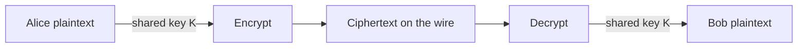
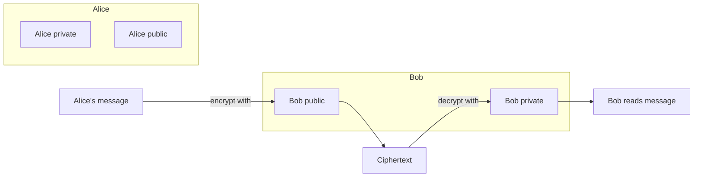
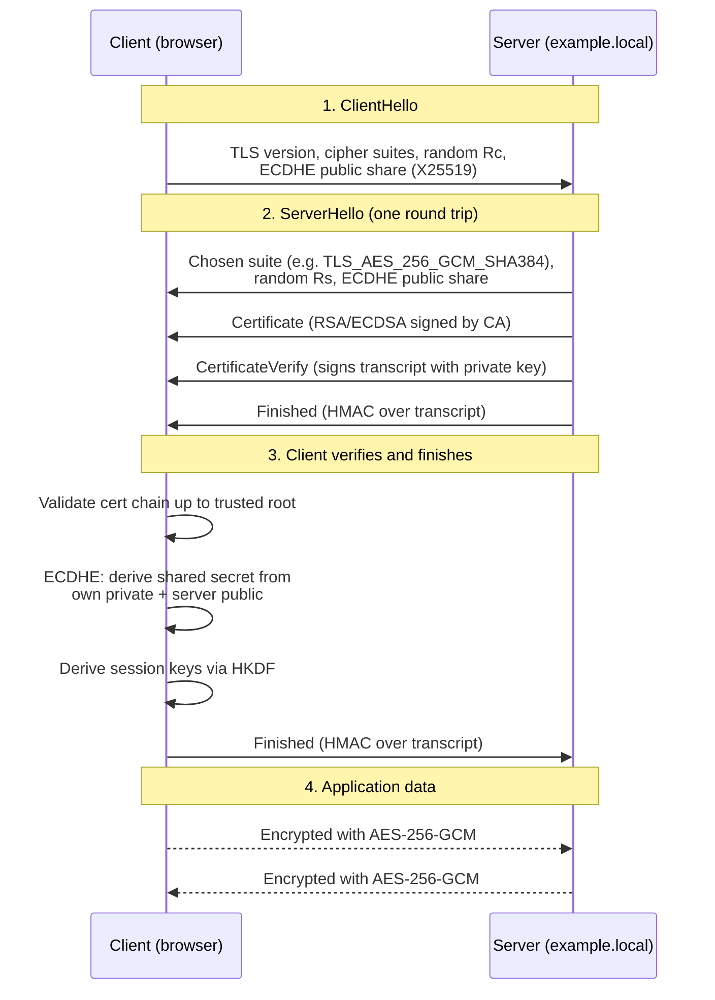
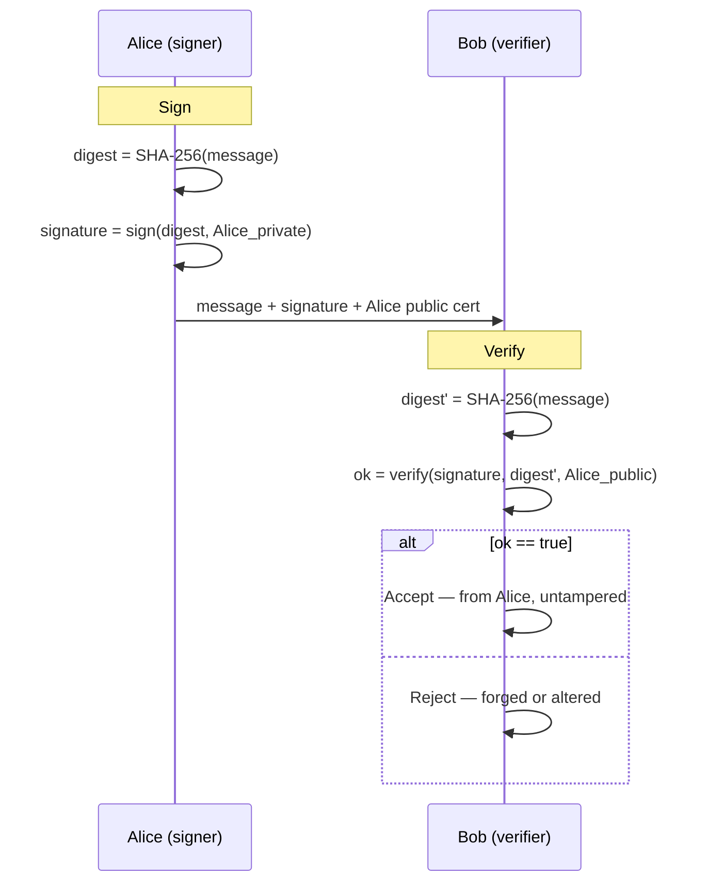

# Cryptography Basics

Cryptography is not an abstract maths lecture — it is the single most-used security technology on the planet. Every time you see the padlock in a browser, join a Wi-Fi network with a password, unlock a BitLocker-encrypted laptop, push a signed git commit, connect with RDP to `dc01.example.local`, or pay with a chip card, cryptography is doing the work. Without it the internet is a broadcast system where every coffee-shop Wi-Fi neighbour reads your email.

The job of cryptography is to deliver four guarantees on top of an untrusted channel:

- **Confidentiality** — only the intended recipient can read the message.
- **Integrity** — the message has not been changed in transit or at rest.
- **Authentication** — the party you are talking to is who they claim to be.
- **Non-repudiation** — a sender cannot later deny having sent a signed message.

Modern cryptography delivers those four guarantees with three primitive families — symmetric ciphers, asymmetric ciphers and hash functions — combined in protocols like TLS, IPsec, SSH, Kerberos, S/MIME and Signal. This lesson is the engineer's tour of those primitives: what they do, where each is used, and which mistakes keep ending up in incident post-mortems.

## Vocabulary you cannot skip

These terms show up in every crypto conversation. Misusing them is how engineers talk past each other.

| Term | One-line definition | Concrete example |
|---|---|---|
| **Plaintext** | The readable data before encryption. | `SELECT * FROM users;` |
| **Ciphertext** | The scrambled output after encryption. | `4f8b2a91...e7c3` (looks random) |
| **Key** | The secret that makes encryption / decryption work. | A 256-bit AES key. |
| **Cipher** | The algorithm that transforms plaintext ↔ ciphertext. | AES, ChaCha20. |
| **Algorithm** | The full mathematical specification (cipher + mode + parameters). | `AES-256-GCM`. |
| **Encode** | Reversible format conversion — **no secret**. | Base64, UTF-8. *Not* security. |
| **Encrypt** | Secret-keyed transformation — reversible only with the key. | AES-CBC of a file. |
| **Confusion** | The ciphertext must not reveal the key. | S-box substitution inside AES. |
| **Diffusion** | Flipping one plaintext bit changes many ciphertext bits. | AES round mixing. |
| **IV** (Initialisation Vector) | Random per-message input so the same plaintext encrypts differently each time. | 128-bit IV for AES-CBC. |
| **Nonce** | "Number used once" — unique per message, not necessarily secret. | 96-bit nonce for AES-GCM. |
| **Salt** | Random value mixed into a password hash so identical passwords hash differently. | 16-byte per-user salt for bcrypt. |

The encode/encrypt distinction trips up juniors constantly. Base64 is **not** encryption. Anyone who sees `SGVsbG8gd29ybGQ=` can reverse it in one shell command. If a ticket says "the password is encoded in Base64," treat that as plaintext.

## A very short history

The history of cryptography is a 2,000-year arms race between people trying to hide messages and people trying to read them. Early ciphers relied on a *secret algorithm*; modern cryptography relies on *public algorithms and secret keys* — a principle known as Kerckhoffs's principle. Everything below Enigma is of historical interest only; never roll your own and never use them for security.

- **~50 BC — Caesar cipher.** Shift each letter by 3. Broken in seconds with frequency analysis.
- **1553 — Vigenère cipher.** Caesar cipher with a repeating keyword. Held up for ~300 years, broken by Kasiski in 1863.
- **WWI / WWII — Enigma, Purple, SIGABA.** Electro-mechanical rotor machines. Enigma broken at Bletchley Park by Rejewski, Turing and colleagues — arguably the birth of computer science.
- **1976 — Diffie–Hellman.** First public-key exchange. Solved the "how do two strangers agree on a secret over an open line?" problem.
- **1977 — RSA.** First practical public-key cryptosystem.
- **1991 — PGP (Zimmermann).** Brought public-key crypto to email.
- **1994–1999 — SSL 1/2/3 → TLS 1.0.** Cryptography arrives on the web.
- **2001 — AES standardised.** Rijndael wins the NIST competition and replaces DES.
- **2008 — ChaCha20, then Poly1305.** Modern stream cipher + MAC, fast on software-only platforms (mobile).
- **2018 — TLS 1.3 (RFC 8446).** Removes everything broken, mandates forward secrecy.
- **Now — Post-quantum crypto.** NIST standardising Kyber (ML-KEM) and Dilithium (ML-DSA) to survive a future quantum computer.

The lesson from the timeline is simple: **cryptography that was "strong" twenty years ago is broken today.** Key sizes grow, algorithms deprecate, and any system you build must let you rotate to newer primitives without a full rewrite.

## Symmetric cryptography

Symmetric cryptography is the simple case — one shared secret key, used both to encrypt and to decrypt. It is fast, memory-cheap and ideal for bulk data: disk encryption, VPN tunnels, the actual application data inside TLS.



The whole design collapses if the key leaks — anyone with `K` reads everything. So the hard part of symmetric crypto is not the maths, it is **key distribution**: how do Alice and Bob agree on `K` without meeting in person? That problem is solved with asymmetric crypto (next section).

### Common symmetric algorithms

| Algorithm | Key size | Status | Notes |
|---|---|---|---|
| **AES-128 / AES-256** | 128 or 256 bits | Recommended | The default everywhere. Hardware-accelerated on every modern CPU (`AES-NI`). |
| **ChaCha20-Poly1305** | 256 bits | Recommended | Stream cipher with built-in MAC. Preferred on phones and devices without AES-NI. |
| **3DES** | 168-bit effective | Deprecated | Disallowed by NIST after 2023. Block size too small (`Sweet32` attack). |
| **DES** | 56 bits | Broken | Brute-forced in hours on modern hardware. Never use. |
| **RC4** | Variable | Broken | Biases in the keystream. Removed from TLS. |
| **Blowfish / Twofish** | 128–448 bits | Legacy | Fine maths, superseded by AES. |

### Block cipher vs stream cipher

A **block cipher** encrypts fixed-size chunks (16 bytes for AES). A **stream cipher** generates a pseudo-random keystream and XORs it with the plaintext one byte at a time. AES is a block cipher; ChaCha20 is a stream cipher. Most modern AES deployments actually wrap AES in a *mode* that turns it into a stream-like construction — see below.

### Modes of operation — the thing people get wrong

A raw block cipher only encrypts one block. To encrypt anything larger you need a **mode of operation**. Picking the wrong mode is how good ciphers get broken.

| Mode | What it does | Use? |
|---|---|---|
| **ECB** (Electronic Codebook) | Encrypt each 16-byte block independently. | **No.** Identical plaintext blocks produce identical ciphertext — the "ECB penguin" image famously shows the Linux penguin outline still visible after encryption. |
| **CBC** (Cipher Block Chaining) | Each block XORed with the previous ciphertext before encryption. Needs a random IV. | Legacy. Vulnerable to padding-oracle attacks if combined with the wrong MAC. |
| **CTR** (Counter) | Turns a block cipher into a stream cipher by encrypting a counter. | Good, but provides no integrity on its own. |
| **GCM** (Galois/Counter Mode) | CTR + built-in authentication tag (AEAD). | **Yes.** Default for TLS, SSH, disk encryption. |
| **CCM** | Counter mode + CBC-MAC, AEAD. | Common on constrained devices and Wi-Fi (WPA2). |
| **XTS** | Two-key mode designed for disk sectors. | **Yes** for full-disk encryption — BitLocker, LUKS, FileVault. |

The modern rule of thumb: **use AEAD modes** (Authenticated Encryption with Associated Data) — AES-GCM or ChaCha20-Poly1305. AEAD gives you confidentiality *and* integrity in one primitive so you cannot accidentally encrypt without authenticating.

## Asymmetric cryptography

Asymmetric cryptography uses two mathematically-linked keys per party: a **public key** you can share with the world, and a **private key** you guard like a credit-card PIN. Anything encrypted with the public key can only be decrypted with the matching private key — and, in reverse, anything signed with the private key can be verified by anyone with the public key.



This solves the problem symmetric crypto cannot: **Alice and Bob never needed to share a secret in advance.** Alice just fetches Bob's public key from a directory (or a TLS certificate) and encrypts to it.

### Common asymmetric algorithms

| Algorithm | Key size | Use |
|---|---|---|
| **RSA-2048** | 2048-bit modulus | Minimum viable today. TLS certificates, code signing, S/MIME. |
| **RSA-4096** | 4096-bit modulus | Higher security margin, slower. Root CAs. |
| **ECDSA** (P-256, P-384) | 256 / 384-bit elliptic curve | Faster and smaller than RSA for the same security. TLS, code signing. |
| **Ed25519** | 256-bit Edwards curve | Modern default for SSH keys, JWT `EdDSA`, modern TLS. |
| **ECDH / ECDHE** | 256-bit+ | Key exchange — not encryption. See "Key exchange". |
| **Kyber (ML-KEM)** | — | Post-quantum key encapsulation, NIST-standardised 2024. |

### Why not use asymmetric for everything?

Because it is **100–1000× slower than symmetric** and the output is much larger than the input. RSA-encrypting a 1 GB video file is a non-starter. In real systems you use asymmetric crypto only to exchange a short symmetric key, then encrypt the bulk of the data with AES or ChaCha20. This is the **hybrid model** — and it is exactly what TLS does.

## Hybrid in practice (TLS handshake mini-walkthrough)

The TLS 1.3 handshake is where symmetric, asymmetric and hashing all click together. When a browser connects to `https://example.local`, this runs in ~1 round-trip:



What each primitive is doing:

- **ECDHE** (asymmetric) — client and server each generate an ephemeral key pair and exchange publics; both independently derive the same shared secret. This is where forward secrecy comes from.
- **Certificate + signature** (asymmetric) — the server signs the handshake transcript with its long-term private key. The client checks the certificate chain up to a CA it trusts. This authenticates the server.
- **HKDF + SHA-384** (hashing) — mixes the shared secret and the transcript into the actual session keys.
- **AES-256-GCM** (symmetric AEAD) — encrypts and authenticates every application byte after the handshake.

Notice: the expensive asymmetric maths runs *once* at the start; the rest of the session is cheap symmetric AES-GCM. That is the hybrid model in practice, and it is the single most important cryptographic protocol on the internet.

## Hash functions

A hash function takes any input — one byte or one gigabyte — and produces a fixed-size fingerprint (the **digest**). Good cryptographic hash functions have three properties:

1. **Pre-image resistance** — given a hash, you cannot find an input that produces it.
2. **Second pre-image resistance** — given an input, you cannot find a *different* input with the same hash.
3. **Collision resistance** — you cannot find *any* two inputs with the same hash.

Hashes are **one-way** — there is no "decrypt the hash" operation. Anyone selling you software that "decrypts MD5" is selling you a lookup of precomputed common strings.

| Algorithm | Digest size | Status | Use |
|---|---|---|---|
| **MD5** | 128 bits | Broken (2004) | Never, except as a non-security checksum. |
| **SHA-1** | 160 bits | Broken (2017, SHAttered) | Never for new systems. Git is migrating away. |
| **SHA-256 / SHA-512** | 256 / 512 bits | Recommended | General-purpose default, TLS, code signing. |
| **SHA-3** | 224–512 bits | Recommended | Different design (Keccak), hedge against SHA-2 breaks. |
| **BLAKE3** | 256 bits | Recommended | Faster than SHA-256, parallel, modern design. |
| **bcrypt / scrypt / Argon2** | Variable | Recommended | **Password** hashing — deliberately slow, memory-hard. |

Do not hash passwords with SHA-256. Password hashing needs **slowness** on purpose to resist brute-force; use bcrypt, scrypt or (preferred) Argon2id.

### Concrete example — verifying a file

Both operating systems ship a built-in SHA-256 tool.

**Windows (PowerShell):**

```powershell
Get-FileHash -Algorithm SHA256 "C:\Downloads\Windows11.iso"
```

Output:

```
Algorithm   Hash                                                              Path
---------   ----                                                              ----
SHA256      E7A1F2C3...9B4D5E6F                                               C:\Downloads\Windows11.iso
```

**Linux / macOS / WSL:**

```bash
sha256sum /downloads/Windows11.iso
# or on macOS
shasum -a 256 /downloads/Windows11.iso
```

Output:

```
e7a1f2c3...9b4d5e6f  /downloads/Windows11.iso
```

Compare the digest byte-for-byte against the one published on the vendor's HTTPS page. If they match, the file was not corrupted *and* not tampered with in transit. If even one byte differs, throw the download away — a good hash is all-or-nothing. This is how Linux ISO mirrors, Windows update packages and Docker image layers all verify integrity.

## Digital signatures

A digital signature answers two questions at once: **who sent this** and **was it changed on the way**. It is the asymmetric equivalent of a hand-written signature, except mathematically enforceable.



Signing is always `hash + asymmetric encrypt-with-private-key`. You never sign the message directly — that would be slow and would leak structure. You hash first, then sign the digest.

### Where you already meet digital signatures

- **Microsoft Authenticode.** Every signed `.exe` and `.dll` on Windows carries a signature from the publisher. `signtool verify /pa installer.exe` checks it. Unsigned binaries trigger SmartScreen warnings.
- **Git commit / tag signing.** `git commit -S -m "fix"` uses your GPG or SSH key to sign the commit. GitHub shows a "Verified" badge; your `EXAMPLE\` CI can refuse unsigned commits.
- **JWT `RS256` / `ES256`.** The auth token your API issues is header + payload + signature. The API server verifies the signature with the issuer's public key — no DB lookup needed.
- **Code signing in CI.** Packages (`.msi`, `.appx`, `.deb`, container images with cosign, PowerShell modules) are signed by the build pipeline; the endpoint only installs if the signature chains to a trusted publisher.
- **TLS certificates.** A CA signs the server's public key; your browser accepts `https://example.local` only if that signature chains to a root it trusts.

Signature failure is never "maybe" — it either verifies or it doesn't. If verification fails, treat the artefact as hostile.

## Key exchange and PFS

**Key exchange** is the mechanism by which two parties end up with the same symmetric key without ever sending that key over the wire. **Diffie–Hellman** (1976) is the original: both sides generate a private number, derive a public number from it (`g^a mod p` in classic DH, a point on an elliptic curve in ECDH), swap publics, and each computes the shared secret from their own private and the peer's public. A passive eavesdropper sees both publics but cannot recover the secret — that is the discrete-logarithm hard problem.

**Perfect Forward Secrecy (PFS)** means the key-exchange keys are **ephemeral** — a fresh pair per session, thrown away when the session ends. Even if the server's long-term private key is stolen next year, past recorded traffic cannot be decrypted, because the ephemeral keys that actually protected that traffic are gone. In TLS, the `DHE` and `ECDHE` cipher suites provide PFS; the older `RSA` key-transport suites do not, which is why TLS 1.3 removes them.

Do not record traffic and decide "we'll deal with the crypto later." With PFS the decision is made at handshake time; without PFS, a future leak decrypts the past.

## Hands-on

Four short exercises. Do them on any lab machine.

### 1. Hash a file on Windows and on Linux

**Windows PowerShell:**

```powershell
# Create a test file
"Hello, example.local" | Out-File -FilePath C:\temp\hello.txt -Encoding utf8

# Hash it
Get-FileHash -Algorithm SHA256 C:\temp\hello.txt
Get-FileHash -Algorithm MD5    C:\temp\hello.txt   # demo only — do not use MD5 for security
```

**Linux / WSL:**

```bash
echo "Hello, example.local" > /tmp/hello.txt
sha256sum /tmp/hello.txt
md5sum    /tmp/hello.txt         # demo only
```

Change one character in the file and rerun. The whole digest flips — that is diffusion in action.

### 2. Generate an RSA or Ed25519 key pair with ssh-keygen

Works identically on Windows (PowerShell with OpenSSH) and Linux:

```bash
# Classic RSA
ssh-keygen -t rsa -b 4096 -C "e.mammadov@example.local" -f ~/.ssh/id_example_rsa

# Modern, shorter, faster
ssh-keygen -t ed25519 -C "e.mammadov@example.local" -f ~/.ssh/id_example_ed25519
```

You get two files: `id_example_ed25519` (the **private** key — never share it) and `id_example_ed25519.pub` (the **public** key — paste this into `~/.ssh/authorized_keys` on servers). Inspect them:

```bash
ssh-keygen -l -f ~/.ssh/id_example_ed25519.pub      # fingerprint
ssh-keygen -y -f ~/.ssh/id_example_ed25519          # derive public from private
```

### 3. Read a real TLS certificate in the browser

1. Go to any HTTPS site — `https://example.com`.
2. Click the padlock → **Connection is secure** → **Certificate is valid** (Chrome) / **Show Certificate** (Firefox).
3. Find:
   - **Subject** — who the cert identifies.
   - **Issuer** — which CA signed it.
   - **Public Key Info** — usually `RSA 2048` or `ECDSA P-256`.
   - **Signature Algorithm** — usually `sha256WithRSAEncryption` or `ecdsa-with-SHA384`.
   - **Validity** — issue and expiry dates. Most modern certs live 90 days (Let's Encrypt) or 1 year max.

Note that the public key algorithm (what the cert's key is) and the signature algorithm (what the CA used to sign the cert) are independent — a server can have an ECDSA key signed by an RSA-rooted chain.

### 4. Encrypt and decrypt a file with OpenSSL AES-256-GCM

OpenSSL ships on Linux and on modern Windows (`C:\Windows\System32\OpenSSL`, or via `winget install OpenSSL`).

```bash
# Encrypt
openssl enc -aes-256-gcm \
    -pbkdf2 -iter 600000 \
    -in  secret.txt \
    -out secret.enc \
    -pass pass:CorrectHorseBatteryStaple

# Decrypt
openssl enc -aes-256-gcm -d \
    -pbkdf2 -iter 600000 \
    -in  secret.enc \
    -out secret.out \
    -pass pass:CorrectHorseBatteryStaple

diff secret.txt secret.out   # no output = identical
```

`-pbkdf2 -iter 600000` turns the passphrase into a proper key with a slow key-derivation function. Without those flags OpenSSL falls back to an obsolete, fast derivation and the ciphertext is weakly protected. Always include them.

## Worked example — protecting a file share for example.local

A company file share needs three layers of crypto. Pick a primitive for each.

**Scenario.** `FS01.example.local` hosts `\\FS01\Projects`. Only domain users in `EXAMPLE\GRP-Engineers` should read. Data must stay secret if the disk is stolen, if an attacker sniffs the LAN, and if a rogue admin tries to impersonate the file server.

| Threat | Control | Primitive |
|---|---|---|
| Disk stolen out of the server rack | BitLocker on the data volume (Windows) or LUKS2 (Linux) | **AES-256-XTS** at rest |
| Attacker on the same VLAN sniffing traffic | SMB3 encryption (`Set-SmbServerConfiguration -EncryptData $true`) | **AES-128-GCM** / AES-128-CCM in transit |
| Impersonation of the file server | Kerberos mutual auth against the DC | **AES** session keys + **HMAC-SHA-256** |
| Integrity of any config file in the share | SHA-256 of file, signed by admin before publishing | **SHA-256 + RSA / Ed25519** |
| Tomorrow somebody leaks the KDC's long-term key | Kerberos is not PFS — mitigate with short ticket lifetime + frequent key rotation | N/A (accept residual risk) |

Notice how four independent crypto primitives stack to form one defensible system: AES-XTS for the disk, AES-GCM for the wire, Kerberos tickets for authentication, SHA-256 + signatures for published-config integrity. Missing any single one leaves a gap.

## Common mistakes

Real cryptographic algorithms are mature. Most real incidents come from one of these engineering mistakes.

- **Hard-coded keys in source.** Keys belong in a KMS, Vault or HSM, not in `config.py`. Once a key is in a git repo, treat it as public forever — rotate it and rewrite history will not save you.
- **Using MD5 or SHA-1 for passwords.** Even bcrypt is the old recommendation now; **Argon2id** is current. And always **salt**.
- **Reusing an IV or nonce with the same key.** For AES-GCM this is catastrophic — a single nonce collision leaks the authentication key and reveals the XOR of the two plaintexts. Use a counter or a 96-bit random nonce, never reuse.
- **ECB mode on real data.** If you can see the outline of what you encrypted, your mode of operation is broken. Use GCM or XTS instead.
- **Rolling your own crypto.** The algorithm is rarely the weakest link; *your implementation of it* is. Use libsodium, Windows CNG, .NET `System.Security.Cryptography`, or OpenSSL's EVP interface — not a textbook.
- **Trusting a self-signed cert "just for now."** It never gets replaced. Use your internal CA or Let's Encrypt from day one.
- **No key rotation, no HSM.** Keys that live forever eventually leak. Rotate on a schedule (SSH host keys: every few years; TLS: 90 days to 1 year; symmetric: driven by data volume).
- **Treating Base64 as encryption.** It is not. If you need a secret, encrypt it.
- **Skipping certificate validation to "make it work."** `curl -k`, `CURLOPT_SSL_VERIFYPEER = false`, `TrustManager { return true }` — every one of those is an invitation to a MITM.
- **Assuming quantum is someone else's problem.** Long-lived data (national ID, medical records, state secrets) should already be wrapped in a post-quantum KEM. Attackers are harvesting ciphertext today to decrypt later.

## Key takeaways

- Cryptography provides four guarantees — confidentiality, integrity, authentication, non-repudiation — and real systems need all four.
- Three primitive families do the work: symmetric ciphers for bulk data, asymmetric ciphers for identity and key exchange, and hash functions for integrity.
- Symmetric (AES-GCM, ChaCha20-Poly1305) is fast; asymmetric (RSA, ECC, Ed25519) is slow. Hybrid protocols like TLS use the best of both.
- Never use raw block ciphers — always pick an AEAD mode. Never use ECB.
- Hash ≠ encryption. Encoding ≠ encryption. Know the difference before you open a ticket.
- MD5 and SHA-1 are broken; SHA-256, SHA-3 and BLAKE3 are the defaults.
- Digital signatures = hash + asymmetric encryption with the private key. They are what every real "trust" decision (signed code, signed commits, TLS certs) is built on.
- Forward secrecy is non-negotiable in 2026 — use `ECDHE` cipher suites and TLS 1.3.

## References

- NIST SP 800-175B Rev. 1 — *Guideline for Using Cryptographic Standards in the Federal Government: Cryptographic Mechanisms.* https://csrc.nist.gov/publications/detail/sp/800-175b/rev-1/final
- NIST SP 800-57 Part 1 Rev. 5 — *Recommendation for Key Management.* https://csrc.nist.gov/publications/detail/sp/800-57-part-1/rev-5/final
- RFC 8446 — *The Transport Layer Security (TLS) Protocol Version 1.3.* https://www.rfc-editor.org/rfc/rfc8446
- RFC 5869 — *HMAC-based Extract-and-Expand Key Derivation Function (HKDF).* https://www.rfc-editor.org/rfc/rfc5869
- OWASP — *Cryptographic Storage Cheat Sheet.* https://cheatsheetseries.owasp.org/cheatsheets/Cryptographic_Storage_Cheat_Sheet.html
- OWASP — *Transport Layer Security Cheat Sheet.* https://cheatsheetseries.owasp.org/cheatsheets/Transport_Layer_Security_Cheat_Sheet.html
- Jean-Philippe Aumasson — *Serious Cryptography, 2nd Edition* (No Starch Press, 2024). The standard practitioner's book.
- Mozilla — *Server Side TLS configuration guidelines.* https://wiki.mozilla.org/Security/Server_Side_TLS
- NIST — *Post-Quantum Cryptography standards (FIPS 203 ML-KEM, FIPS 204 ML-DSA, FIPS 205 SLH-DSA).* https://csrc.nist.gov/projects/post-quantum-cryptography
