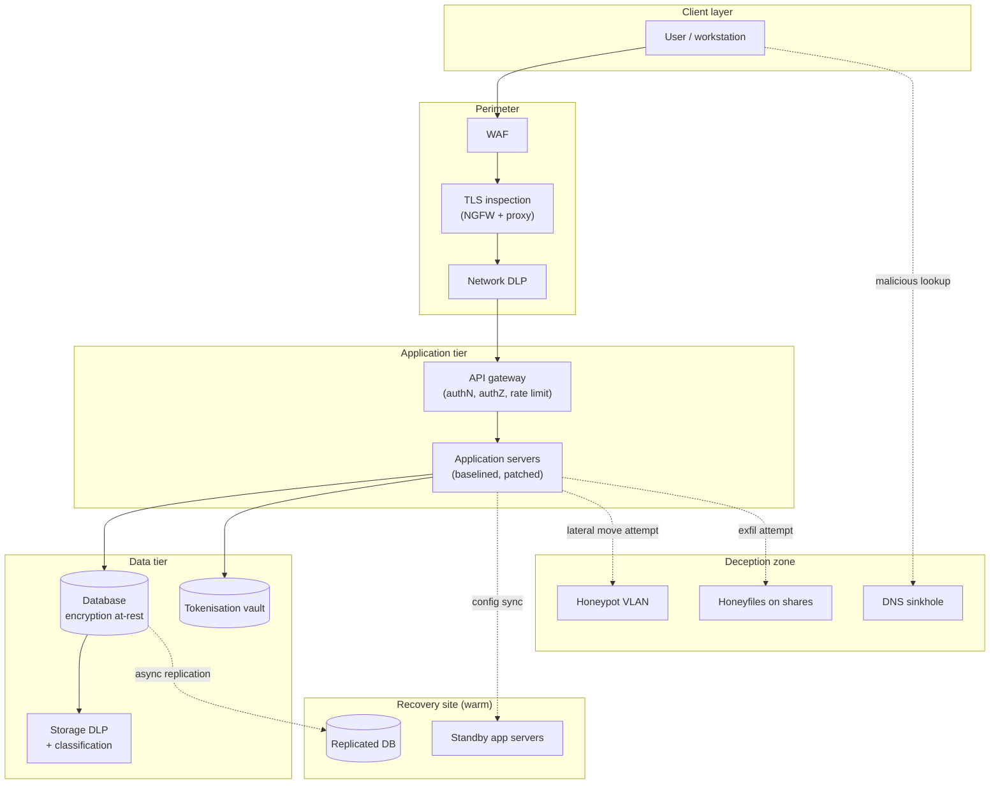

# Enterprise Security Architecture

## Why this matters

A single laptop running well is not an enterprise. The moment two systems need to talk to each other, someone has to decide how they agree on names, addresses, identities, encryption, logging, and what happens when one of them fails. Multiply that by five hundred users, three data centres, twenty SaaS tenants, a handful of partner integrations, and a regulator watching from two jurisdictions, and the decisions stop being local choices and become an architecture.

Enterprise security architecture is the discipline that turns those decisions into a written, followed, and auditable scheme. It is what keeps a new Windows server from shipping with an admin password of `Summer2026` because the baseline said otherwise. It is what keeps the finance database from leaking on a laptop stolen at an airport because the data at rest was encrypted and the clipboard was governed by DLP. It is what keeps the business running when a fibre cut takes out the primary data centre, because the warm site was specified, tested, and ready.

Get the architecture wrong and every other control is optional. A beautifully tuned firewall in front of an unpatched server is a waiting room for a breach. A SIEM fed by hosts with random names and overlapping subnets produces alerts nobody can triage. A DLP rule written against a database where the sensitive columns are not tagged catches nothing. The architecture is the skeleton; the individual controls are the muscle; remove the skeleton and the whole body collapses.

This lesson walks the architecture layer by layer — how configurations are defined and kept honest, how data is protected through its lifecycle, how geography and regulation constrain design, how a site stays standing when the building does not, how cryptographic boundaries are inspected without being broken, and how deception turns an attacker's reconnaissance into the defender's early-warning system. Examples use the fictional `example.local` enterprise and the `EXAMPLE\` domain.

The recurring theme is that security architecture is written before it is built. Every item in this lesson — the baseline, the naming convention, the subnet plan, the classification scheme, the recovery-site tier, the TLS-inspection policy, the honeynet placement — exists as a document first. The document is reviewed, agreed, and versioned. The engineering comes second and implements what the document says. Teams that flip that order — engineering first, document "when we have time" — end up with the system that actually exists rather than the system that was designed, and the gap between the two is where the audits fail and the breaches live.

## Core concepts

Enterprise security architecture is a layered problem. No single control — no best baseline, no encryption algorithm, no honeypot — is enough on its own. The sections below cover the layers in the order an architect would design them: first the shape of the systems (configuration), then the data they hold (protection), then the jurisdictions that constrain them (geography), then how they keep running (resiliency), then the boundaries that let security tooling see inside (cryptography), and finally the deliberate traps that turn an attacker's first step into an alert.

### Configuration management and baselines

Proper configuration is the foundation. A system's security posture is not what the vendor shipped — it is what the operator applied on top. Configuration management is the discipline of defining that "on top" clearly, applying it consistently, and monitoring for drift. Alterations to configurations can add functionality, remove functionality, or — most dangerously — silently change the behaviour of an existing program by pulling in outside code. Monitoring for unauthorised configuration change is a first-class security control.

A **baseline configuration** is the recorded starting point: the approved image, the hardening settings, the installed agents, the account policy, the audit policy, the firewall rules, the services disabled, the patches applied. It is created at system build, signed off, and declared the reference. Every future assessment is a comparison against the baseline.

A **baseline deviation** is any change from that reference. Deviations can be positive (a new patch reduces risk) or negative (a service quietly re-enabled by an installer increases it). The job is not to prevent all deviation — systems evolve — it is to see deviation, evaluate it, and either absorb it into a new baseline or remediate it. Automation is what makes this feasible at scale. Running a CIS-CAT scan against a hundred servers weekly and diffing against the last clean run catches the drifted host that no human would have noticed.

Three main sources supply baseline benchmarks, and mature enterprises pick from all of them:

- **Vendor hardening guides.** Microsoft Security Baselines, Red Hat STIGs, Cisco hardening guides. Authoritative for the specific product, usually conservative, and often the minimum an auditor will accept.
- **Government benchmarks.** DISA STIGs, ANSSI guides, NCSC profiles. Mandatory in regulated sectors, dense in detail, heavy to apply without automation.
- **Independent benchmarks.** The Center for Internet Security (CIS) publishes the most widely adopted cross-platform benchmarks with scored Level 1 and Level 2 profiles. Level 1 is a sensible default; Level 2 hardens further at the cost of functionality.

**Diagrams** carry the architecture. Network diagrams show physical and logical connections; data-flow diagrams show what moves where; trust-zone diagrams show which systems can reach which others. Graphical representation is not decoration — it is the only way a human can hold a medium-sized enterprise in mind. A diagram that is six months out of date is worse than no diagram, because people trust it.

**Standard naming conventions** kill an entire class of error. A server named `WEBPRD-EU1-APP-03` tells you the role (web), the environment (production), the region (EU1), the tier (application), and the index (03) before you ever open a console. A server named `SRV42` tells you nothing. The enterprise-wide convention covers servers, workstations, user accounts, groups, service accounts, network devices, VLANs, shares, DNS zones, and automation artefacts. The convention lives in a published document; onboarding runs through it; exceptions are logged.

A short `example.local` naming scheme:

| Object | Pattern | Example |
|---|---|---|
| Server | `{ROLE}-{ENV}-{SITE}-{NN}` | `APP-PRD-DC1-07` |
| Workstation | `{SITE}-{DEPT}-{NN}` | `HQ-FIN-042` |
| User account | `{firstname}.{lastname}` | `ayten.mammadova` |
| Privileged account | `adm-{firstname}.{lastname}` | `adm-ayten.mammadova` |
| Service account | `svc-{app}-{env}` | `svc-payroll-prd` |
| Security group | `sg-{resource}-{right}` | `sg-finance-share-rw` |
| DNS zone (internal) | `{site}.example.local` | `dc1.example.local` |
| VLAN | `V{NNN}-{purpose}` | `V210-srv-app` |

**Internet protocol (IP) schema** is the other half of naming. An address has a network portion and a host portion; how you divide them determines how many hosts fit in a subnet and how subnets nest. The historical **Class A/B/C** scheme splits at byte boundaries; modern **CIDR notation** (`10.20.0.0/16`) splits at the bit, giving finer granularity. A sane schema reserves ranges per site, per environment, and per tier — production, non-production, DMZ, management — so that a firewall rule can be written against a range, not a host list. Overlapping or ad-hoc ranges are the enemy of VPNs, mergers, and any future cloud integration.

A minimal `example.local` IP plan:

| Range | Purpose | Notes |
|---|---|---|
| `10.10.0.0/16` | HQ site | Subnetted into /24 per VLAN |
| `10.20.0.0/16` | DC1 production | `10.20.10.0/24` servers, `10.20.20.0/24` storage |
| `10.30.0.0/16` | DC2 warm site | Mirrors DC1 second octet |
| `10.40.0.0/16` | Branch offices | /22 per branch |
| `10.99.0.0/16` | Management / OOB | Never routed to user networks |
| `172.16.0.0/20` | Lab / non-production | Isolated from production |
| `192.168.250.0/24` | Honeynet | See deception section |

### Data protection lifecycle

Equipment can be replaced; the data cannot. Data protection is the set of policies, procedures, tools, and architectures that keep data confidential, intact, and available across three states: at rest, in transit, and in processing.

**Data sovereignty** is the starting constraint. Several countries have enacted legislation that data about their citizens, or data originating within their borders, must be stored within those borders and is subject to local law. LinkedIn famously withdrew from the Russian market after a data-localisation order rather than re-architect to store Russian user data on Russian servers. A multinational `example.local` has to decide — before the first byte is written — which jurisdictions hold which data and which applications can reach across borders. That decision cascades into database placement, replica topology, SaaS tenant region, backup location, and who administrators are.

**Data loss prevention (DLP)** watches for sensitive data leaving the network without authorisation. It sits at the intersection of data classification, user behaviour, and network or endpoint control. Enterprise DLP works at three points:

- **Endpoint DLP** — an agent on the workstation inspects clipboard, USB, print, and file operations, blocking or logging when it sees patterns like credit card numbers, national IDs, or tagged corporate documents.
- **Network DLP** — an inline appliance or cloud service inspects SMTP, HTTP, and HTTPS (with TLS inspection) for the same patterns on their way out.
- **Storage DLP** — scanners walk file shares, SharePoint, and databases to find sensitive data sitting where it should not, so it can be moved or tagged.

DLP is only as good as its classification. A rule for "credit card numbers" catches the obvious; a rule for "files tagged `example.local/confidential`" catches everything the business cares about, provided classification is consistent. The architecture decision is where to put the enforcement points and how to tag the data that feeds them.

**Data masking** hides data by substituting altered values. A test database built from production is masked so that names become pseudonyms, national IDs become valid-looking but fake numbers, and addresses become synthetic. Credit card receipts show `**** **** **** 1234` — the majority of digits redacted while the last four remain for user recognition. Masking makes reverse engineering impossible because the original value is not present. The common uses are test data sets, training environments, screenshots in documentation, and loading honeypots with believable-but-fake data.

**Tokenisation** replaces a sensitive value with an unrelated random token. The classic example is card payment: the merchant never stores the card number; instead, the payment processor returns a token that references the transaction in the processor's vault. If the merchant's database is breached, the tokens reveal nothing — there is no mathematical relationship to reverse. Tokenisation differs from encryption: encrypted data can be decrypted with the key, whereas a token is just a pointer to a record held elsewhere. Tokenisation preserves referential integrity (the same card always produces the same token within a scope), so analytics and reconciliation still work.

**Rights management** controls what people can do with data once they have it. At the file-system level this is read/write/execute; at the document level it extends to edit, print, copy, forward, screenshot, and revoke. **Digital rights management (DRM)** is the umbrella term; enterprise versions like Microsoft Purview Information Protection and Azure RMS embed rights into the document itself so that a copy sent outside the organisation still enforces "do not print, expires in 30 days" when opened. Rights management only scales when the enterprise has a classification scheme — public, internal, confidential, restricted — and tooling that applies the scheme consistently.

**Encryption** is the backbone. Three states, three approaches:

- **At rest** — data in storage. Whole-disk encryption (BitLocker, FileVault, LUKS) protects a lost laptop. Database-level encryption (TDE) protects a stolen backup. Column-level encryption protects specific sensitive fields even from a DBA. Object-storage encryption protects cloud buckets. The choice depends on the threat model: stolen hardware, malicious insider, or cloud-provider compromise.
- **In transit** — data moving between systems. TLS 1.2 or 1.3 is the default for anything crossing an untrusted network; IPsec VPNs or WireGuard protect site-to-site links; SSH protects administrative access. The architecture decision is where trust boundaries are — inside a trusted data-centre VLAN you may accept unencrypted internal traffic; between regions or over the internet, never.
- **In processing** — data actively used in memory or CPU. Operations on encrypted data are generally impractical (homomorphic encryption exists but is too slow for most workloads), so protection comes from other mechanisms: **protected memory schemes**, **address space layout randomization (ASLR)**, hardware enclaves (Intel SGX, AMD SEV, ARM TrustZone), and secure coding practices that wipe sensitive values from memory immediately after use.

**Encryption-state summary:**

| State | Primary threat | Typical control | Where it lives |
|---|---|---|---|
| At rest | Stolen device / stolen backup | FDE, TDE, column or file encryption | Disk, DB, object store |
| In transit | Network eavesdropping / MITM | TLS, IPsec, SSH, WireGuard | Network layer |
| In processing | Memory scraping, side-channel | ASLR, enclaves, secure coding | CPU, RAM |

Key management is the part of the encryption story that people forget. A disk encrypted with a key stored on the same disk protects nothing. Enterprise key management uses a dedicated **key management service (KMS)** — cloud-native like AWS KMS, Azure Key Vault, or GCP Cloud KMS, or on-prem like Thales, Entrust, or SafeNet HSMs. The KMS holds the **master keys**, issues short-lived **data keys** to applications, enforces role-based access, and logs every key use. Rotation policy, customer-managed vs provider-managed, and HSM-backed vs software-backed are all architectural decisions that belong in the design document, not a ticket.

### Geographical and regulatory considerations

The internet has no borders, but laws do. Any enterprise that operates in more than one jurisdiction has to design around a patchwork of rules on where data can live, who can access it, and who has to be notified when something goes wrong. The cost of getting this wrong ranges from a warning letter to a fine in the hundreds of millions, and in extreme cases the loss of the ability to operate in a market at all.

The European Union's **GDPR** applies to any processing of EU residents' personal data, wherever the processor sits. The UK has its own post-Brexit equivalent. California's CCPA, Brazil's LGPD, and similar laws in more than a hundred countries build on the same model. Several countries — China, Russia, India, Indonesia — add explicit **data localisation** requirements that force in-country storage for specified categories. The result is an enterprise-architecture question, not a legal one: which database sits in which region, which replica crosses which border, which administrator in which country can see which record.

Market forces add a second pressure. During the 2020 pandemic, Zoom faced public backlash when users discovered meeting metadata was being routed through Chinese data centres; the company re-engineered the routing in weeks. Customers now ask their SaaS providers where data lives before they buy. A clean geographical story — "EU data stays in EU regions, admins in the EU, backups in the EU" — is a sales asset, not just a compliance one.

Architectural choices driven by geography include:

- **Region-pinned cloud tenants.** The M365 tenant, the AWS region, the Azure resource group are all created in a specific geographic region and stay there. Multi-region replication is deliberate, not automatic.
- **Per-region database shards.** Customer records are sharded by country of residence; cross-region queries go through a governance layer.
- **Localised SaaS contracts.** Where a global SaaS product does not offer regional isolation, the enterprise may contract a separate tenant per jurisdiction.
- **Localised administrator rosters.** Only administrators within a jurisdiction can access that jurisdiction's data; global dashboards show aggregates, not records.
- **Data-transfer impact assessments.** Each cross-border flow is documented, justified, and reviewed against the receiving country's laws.
- **Encryption with customer-held keys.** When data must sit in a foreign jurisdiction but the operator does not want the local cloud provider (or local law enforcement) to be able to read it, customer-managed or customer-held keys move the cryptographic trust boundary back into the customer's jurisdiction.
- **Jurisdiction-aware logging.** Access logs themselves can be regulated data. Routing EU user access logs to a US SIEM can itself trigger a transfer question; a regional SIEM tier avoids it.

A short compliance-regime snapshot that drives architectural decisions:

| Regime | Scope | Architectural impact |
|---|---|---|
| GDPR (EU, 2018) | EU resident personal data anywhere | Regional tenant, DPO, DPIA, 72-hour breach notice |
| UK GDPR + DPA 2018 | UK resident personal data | Near-GDPR; adequacy decisions for transfers |
| CCPA / CPRA (California) | California resident data | Consumer rights, opt-out of sale, defined breach duties |
| LGPD (Brazil, 2020) | Brazilian personal data | Near-GDPR equivalent, Brazilian DPA (ANPD) |
| PIPL (China, 2021) | Data on individuals in China | Localisation for critical operators, security assessment for export |
| HIPAA (US) | Protected health information | Encryption, BAA with each processor, audit log retention |
| PCI DSS | Cardholder data | Tokenisation, network segmentation, quarterly scans |

### Site resiliency

The building burns down. The fibre is cut. The region goes offline. Site resiliency is the architectural answer: a second place where operations can continue.

**Response and recovery controls** turn the plan into muscle. **Disaster recovery (DR)** is the technical restoration of systems after a disruptive event. **Business continuity (BC)** is the broader plan that keeps the organisation delivering its services while DR is executed. Backups are half the problem; restoring them in the right order, at the right scale, with the right permissions, is the other half. A full data-centre recovery can be a multi-day operation, where the sequence matters — directory services and DNS before applications, bandwidth before bulk restores, and a cut-back plan for when primary systems return. Recovery also requires pre-staged structures and permissions: the new environment has to exist before the data lands in it, and the accounts that own the data have to exist before the data reaches them.

Three classical recovery-site models trade speed against cost:

- **Hot site** — a fully configured environment, matching production, staffed or ready to staff, with near-real-time data replication. Recovery time is minutes to hours. Most expensive; used for tier-1 systems where downtime costs measurable money per minute.
- **Warm site** — partially configured. Hardware is present, software may be present, but data is restored from backup and final configuration applied at the time of invocation. Recovery time is hours to a few days. Middle cost; used for important-but-not-critical services.
- **Cold site** — basic environmental controls (power, cooling, network drops) and empty floor space. Hardware is procured or shipped after the disaster. Recovery time is weeks. Cheapest; used for systems that can tolerate long outages or for overflow capacity.

**Recovery-site trade-offs:**

| Site type | RTO | RPO | Typical cost | Suitable for |
|---|---|---|---|---|
| Hot | Minutes to hours | Seconds to minutes | High | Tier-1 revenue systems |
| Warm | Hours to days | Hours | Moderate | Tier-2 business services |
| Cold | Weeks | Last full backup | Low | Tier-3 / archival |
| Cloud pilot-light | Minutes | Minutes | Moderate | Modern cloud-native equivalent of warm |
| Multi-region active/active | Zero | Zero | Highest | Global always-on services |

The architecture decision is not "which one" but "which tier for which service". A 500-person enterprise typically runs tier-1 (identity, email, ERP core) on hot or active/active; tier-2 (collaboration, intranet, analytics) on warm; and tier-3 (archive, reporting) on cold with documented manual restoration.

**Recovery objectives drive the design.** Two numbers govern every recovery conversation: the **Recovery Time Objective (RTO)**, the maximum acceptable outage before the service is back, and the **Recovery Point Objective (RPO)**, the maximum acceptable amount of data lost measured in time. A tier-1 payment system with RTO of 15 minutes and RPO of 1 minute demands synchronous replication and a hot standby. A tier-3 reporting archive with RTO of 5 days and RPO of 24 hours is perfectly served by nightly tape rotation. The business defines the objectives; the architecture delivers the means.

**Backups, snapshots, and replicas are different.** A backup is a point-in-time copy kept offline or immutable; it is the recovery of last resort against ransomware and operator error. A snapshot is a near-live copy that shares storage with the original; fast to create, fast to restore, useless if the underlying storage is lost. A replica is a continuously updated copy on separate storage or in a separate site; good for DR, bad for logical corruption because the corruption replicates too. A resilient architecture uses all three — replica for site failure, snapshot for quick rollback, backup (offline, immutable) for ransomware.

### Cryptographic boundary controls

Encryption protects data, but it also hides data from the security tools that are supposed to see threats. The cryptographic boundary is where the architecture decides which traffic gets inspected and how.

**SSL/TLS inspection** is the canonical boundary control at the network edge. TLS protects client-server traffic from eavesdropping, which is good — and also blinds IDS, DLP, and malware sandboxes, which is less good. A next-generation firewall (NGFW) or dedicated proxy performs inspection by terminating the TLS connection, decrypting the payload, applying security functions (IDS, URL filtering, DLP, sandboxing), re-encrypting with a different key, and forwarding to the destination. Two flavours:

- **Outbound (client-protection) inspection** — the firewall is the TLS server for clients leaving the network. Clients trust a private CA installed on every corporate device; the firewall dynamically generates a per-site cert signed by that CA.
- **Inbound (server-protection) inspection** — the firewall terminates TLS on behalf of internal servers, accepting the real server certificate and inspecting what clients send in.

TLS inspection is not free. It breaks certificate pinning in mobile apps, it can violate regulatory privacy requirements for categories like banking or medical sites, and it creates a high-value target — the inspection proxy holds the keys to every inspected session. The architecture decision is which categories to decrypt (general web) and which to bypass (banking, healthcare, personal), which users are in scope (employees on corporate devices) and which are not (contractors on BYOD).

**Hashing** is a boundary of a different kind: it lets you work with a representation of data without having to store the data itself. A fixed-length digest (SHA-256, SHA-3) uniquely identifies an input without revealing it. Enterprise uses:

- **Integrity verification** — a file's hash is recorded at creation; any later tampering changes the hash.
- **Password storage** — passwords are stored as salted hashes (bcrypt, Argon2, scrypt) so a database breach does not leak credentials in cleartext.
- **Tokenisation of identifiers** — an employee number can be hashed with a pepper to produce a stable, non-reversible analytics key.
- **Deduplication** — storage systems hash blocks to detect duplicates without comparing contents.

Hashing is a replacement for the data in contexts where comparison matters and reversal does not. It is not encryption — there is no key, and the operation is deliberately one-way.

**API considerations** close the boundary discussion. Modern enterprise applications talk to each other via APIs — REST, GraphQL, gRPC — and every API is a door to the data behind it. Insecure APIs are one of the most common breach vectors, consistently topping the OWASP API Security Top 10 and appearing behind some of the largest recent breaches (Optus 2022, T-Mobile 2023, Dell 2024). The architectural controls:

- **Authentication.** Every API call carries a credential — OAuth 2.0 bearer token, mutual TLS, signed JWT. Anonymous APIs are justified and documented per endpoint, not assumed.
- **Authorisation.** Authentication proves who; authorisation decides what. Fine-grained scopes on tokens, per-endpoint role checks, and object-level authorisation (the user can see order 42 if the user owns order 42) prevent "broken object level authorisation" — the most common API flaw.
- **Rate limiting.** Per-token, per-IP, per-endpoint. Protects against scraping and credential-stuffing.
- **Input validation.** Schema enforcement on every request; reject anything unexpected before the data reaches the business logic.
- **Inventory.** You cannot secure APIs you do not know about. An API gateway or API inventory tool discovers shadow APIs — endpoints developers published without architectural review.
- **Logging.** Every authenticated call logged with user, endpoint, parameters summary, and result, feeding the SIEM.

### Deception and disruption technology

Conventional controls try to keep attackers out. Deception technology assumes some get in anyway, and makes sure their first step into the environment is into a trap.

The idea is that a threat actor doing reconnaissance sees the same thing a legitimate user sees. If the environment contains fake assets — servers that look real but are not, files that look real but are not, records in a database that are never used — then any interaction with those assets is a reliable indicator of unauthorised activity. Nothing legitimate ever touches them. Every touch is signal.

This is a powerful inversion of the standard detection problem. Most SIEM rules fight a signal-to-noise ratio: "this process is unusual, but is unusual enough?" A deception asset has no baseline noise — legitimate users have no reason to open `salary_2026_final.xlsx` on the HR share because it is not a real file, and legitimate systems have no reason to authenticate to the fake domain controller because it is not a real DC. A single hit is enough. False positives collapse to near zero, and the response team can act with confidence.

**Honeypots** are single decoy systems designed to attract attackers. A honeypot server is configured to look like a real production server, with plausible hostname, plausible services, and fake data. It sits on a monitored network segment; every packet it receives is logged. A low-interaction honeypot simulates services at the protocol level (useful for catching automated scanners); a high-interaction honeypot is a real operating system with real services (useful for studying actual attacker behaviour, higher deployment risk). The trade-off matters in deployment: a low-interaction honeypot cannot be meaningfully compromised but also does not reveal attacker tradecraft; a high-interaction honeypot can be compromised and used as a pivot if not carefully isolated.

**Honeyfiles** are decoy files scattered through real file shares. A file named `salary_2026_final.xlsx` in the HR share, or `domain_admin_passwords.txt` in an administrator's home drive, is irresistible — and never accessed by legitimate users. Accesses can be wired through the DLP system so that opening, copying, or exfiltrating a honeyfile triggers an alert. Honeyfiles work because attackers doing lateral movement sweep for interesting filenames; the name is the bait. A variation is the **honeyrecord** — a fake row in a real database table, with a canary identifier that appears nowhere else. If that identifier ever shows up in logs, an API call, or a data-breach notice, the source of the leak is localised.

**Honeynets** are whole networks of honeypots — a fake enterprise inside the real one. Fake domain controllers, fake file servers, fake application servers, fake workstations, all sitting on a dedicated VLAN that no legitimate system ever touches. A honeynet is an attractive target during an attacker's reconnaissance phase; once they engage, the defender observes tooling, commands, and objectives in a controlled environment. Modern deception platforms (examples: Illusive, TrapX, Thinkst Canary) automate the deployment and make the honeynet look indistinguishable from the real environment.

**Fake telemetry** is the detail that makes deception work. An attacker who lands on a honeypot and sees no network traffic, no DNS queries, no logins, and no process activity realises quickly that they are in a fake environment. Fake telemetry is synthetic traffic generated on the honeynet — simulated users logging in, simulated file transfers, simulated DNS queries — at volumes that match the real enterprise. The attacker sees what looks like a living system; the defender sees every real packet the attacker sends, against a known-clean baseline.

**DNS sinkholes** are a related deception and disruption control. A DNS sinkhole is a recursive DNS server configured to return a non-routable address (or a monitoring server address) for specified malicious or unwanted domains. When malware on an infected host tries to contact its command-and-control domain, the sinkhole returns `127.0.0.1` or an internal investigation server. The malware cannot reach the C2; the defender sees which host asked and can isolate it. Sinkholes operate at different scales — a corporate resolver sinkholes for its enterprise; a public resolver like Quad9 sinkholes for its users; a top-level domain sinkhole can take down entire botnets. The 2017 WannaCry outbreak was famously slowed when a security researcher registered the malware's kill-switch domain, effectively creating an internet-scale sinkhole.

**Deception-layer summary:**

| Control | What it is | What it catches |
|---|---|---|
| Honeypot | Single decoy system | Scanners, lateral movement |
| Honeyfile | Decoy file or document | Insider exfiltration, ransomware |
| Honeyrecord | Decoy row in a real database | Data-leak source attribution |
| Honeynet | Network of honeypots | Full attacker tradecraft |
| Fake telemetry | Synthetic traffic on honeynet | Makes the trap convincing |
| DNS sinkhole | DNS that redirects bad domains | C2 communication, malware beacons |

## Architecture diagram

The pieces above stack into a layered enterprise reference architecture. User traffic flows from the left through a cryptographic-inspection perimeter, into application and data tiers that are themselves segmented, with a recovery site mirrored alongside and a deception zone deliberately wired into the environment to catch anyone who lands where they should not be. The diagram is a simplification — a real environment has many more components (SIEM, IdP, MDM, PAM, secrets vault, CI/CD pipelines) — but the spine it shows is the spine every concrete design inherits from.

Read it as two paths. The legitimate path runs user → perimeter → application → data, with the recovery site shadowing the data tier for continuity. The attacker path is the set of dotted lines — malware lookups into the sinkhole, lateral movement into the honeypot VLAN, exfiltration attempts into honeyfiles. Every dotted line is an alert, and every alert is high-confidence because nothing legitimate traverses it.

## Hands-on / practice

Five exercises the learner can do with a laptop, a hypervisor, and patience.

### 1. Write a baseline for a Windows Server

Pick a fresh Windows Server 2022 VM. Apply the CIS Level 1 benchmark by hand — or, more realistically, with the Microsoft Security Compliance Toolkit and the CIS-published GPO. For each setting changed, record:

- What the default was.
- What the CIS recommendation is.
- What the operational impact of the change is (does the RDP timeout break legitimate admin workflows?).
- The deviation, if any, from the benchmark, and why.

Export the final configuration as a GPO backup and a LGPO script. That script is your baseline. Next week, apply the same baseline to a second VM, run a CIS-CAT scan, and confirm both systems produce identical scores. That is configuration management in miniature.

### 2. Design an IP schema for a hypothetical 500-person enterprise

`example.local` has three sites — HQ (300 users), DC1 primary data centre (150 servers), DC2 warm site (matching DC1). Design a private IP plan that:

- Allocates ranges per site with room to grow 3×.
- Subnets each site into user, server, printer, camera, management, and guest VLANs.
- Reserves a non-overlapping range for the honeynet and a non-overlapping range for future cloud VPC peering.
- Uses a consistent second-octet convention (e.g. site) and third-octet convention (e.g. VLAN function) so that an admin can read `10.20.10.15` and know site/VLAN/host from the address alone.

Document it in a table and draw the network diagram. Commit both to the architecture repo.

### 3. Deploy a DLP rule for credit-card exfiltration

On a Microsoft 365 or Microsoft Purview tenant (use a developer tenant if you do not have production access), configure a DLP policy that:

- Detects credit-card numbers (PAN) using the built-in sensitive-information type.
- Covers Exchange Online, OneDrive, SharePoint, and Teams.
- Warns the user with an in-app notification on first match, and blocks external send with override + justification on subsequent matches.
- Reports every match to a dedicated mailbox and a SIEM connector.

Seed a test document with ten synthetic card numbers (use documented test card ranges, never real PANs) and attempt to email it externally. Verify the block, the override flow, the audit log entry, and the SIEM alert. Then intentionally leak a number in a Teams chat to prove the channel coverage.

### 4. Set up a honeypot VM

On an isolated VLAN (or a host-only network in your lab hypervisor), stand up a simple honeypot. Two options:

- **Low-interaction:** deploy a Cowrie SSH honeypot container. Configure a plausible `root` / `admin` / `user` account, set weak passwords, and log every session to a file and a remote syslog.
- **High-interaction:** install a minimal Ubuntu VM with SSH exposed, Filebeat shipping auth logs to an ELK stack, and Auditd recording every command.

Portscan it from another VM on the same VLAN and confirm the interaction is logged. Leave it running for a week on an internet-accessible network (with firewall-restricted source, never truly open) and review what the internet sends. The exercise shows how much noise the real internet generates and why a honeypot inside the enterprise is a stronger signal — because inside, there is no baseline noise.

### 5. Draft a site recovery plan

Pick one tier-1 service at `example.local` — for example, Active Directory. Write a recovery runbook that answers:

- What is the recovery objective (RTO, RPO)?
- Which recovery-site tier applies (hot, warm, cold), and where is it?
- What data is replicated, at what interval, over which channel?
- What is the declaration process — who has the authority to invoke DR?
- What is the restoration sequence — DNS before AD, AD before applications, applications before user access?
- How is failover tested, and how often (table-top quarterly, live annually)?
- What is the fail-back plan when the primary returns?
- Who is the incident commander; who is the communications lead; who briefs the executive?

Keep it to ten pages. A runbook nobody can read at 03:00 is not a runbook.

## Worked example — `example.local` enterprise architecture for 500 users

`example.local` is a 500-person professional-services firm with offices in three cities, a primary data centre (DC1), a warm recovery data centre (DC2), a Microsoft 365 tenant for collaboration, and a small AWS footprint for customer-facing web applications. The CISO asks the architecture team to produce a one-page reference architecture that ties together configuration, data protection, resiliency, and deception.

**Configuration baseline.** All Windows servers are deployed from a hardened image built monthly. The image applies the Microsoft Security Baseline plus the `example.local` overrides (stricter password policy, explicit list of allowed services, Defender ASR rules). Every server joins the `sg-baseline-prd` collection in Microsoft Configuration Manager on first boot, which runs a CIS-CAT scan within 24 hours. Deviations alert the platform team through ServiceNow. Linux servers follow CIS Ubuntu Level 1, deployed via Ansible, with the same deviation reporting into SIEM.

**Naming and IP.** Servers follow `{ROLE}-{ENV}-{SITE}-{NN}` — so `APP-PRD-DC1-07` is the seventh production application server in DC1. User accounts are `firstname.lastname`; privileged accounts are `adm-firstname.lastname` and live in a separate forest root OU with its own smart-card MFA. The IP schema allocates `10.10.0.0/16` to HQ, `10.20.0.0/16` to DC1, `10.30.0.0/16` to DC2 (same third-octet pattern as DC1), `10.40.0.0/16` to branches, `10.99.0.0/16` to out-of-band management. The honeynet lives at `192.168.250.0/24` on a dedicated VLAN reachable only from the NOC for management.

**Data protection.** Data is classified into four levels — public, internal, confidential, restricted — using Microsoft Purview Information Protection labels applied at creation. Restricted data (client case files, M&A documents, HR records) is encrypted at rest with customer-managed keys in an on-prem HSM, protected in transit with TLS 1.3, and locked in processing to specific application servers in a dedicated VLAN. DLP rules block external send of confidential-and-above without override, and storage DLP scans every file share monthly for untagged sensitive data. Credit-card data is tokenised at the payment-processor boundary; the enterprise database stores only tokens.

**Geographical considerations.** The firm has EU clients, so EU client data resides in an EU-region M365 tenant and an EU-region AWS account, with administrators based in the EU office. Cross-border data access goes through a governance workflow with per-request approval. Backups of EU data are retained in EU storage only.

**Site resiliency.** AD, email, ERP core, and the client-facing web application are tier-1 with DC2 as a warm site (4-hour RTO, 15-minute RPO). Collaboration, analytics, and intranet are tier-2 with a 24-hour RTO. Archival and reporting are tier-3 with a 7-day RTO from backup. The warm site is exercised quarterly with a table-top and annually with a live partial failover of the ERP. The runbooks are short, versioned, and printed in the NOC alongside their digital copies.

**Cryptographic boundaries.** At the internet perimeter, a pair of NGFWs perform outbound TLS inspection for all categories except banking and healthcare, using a private CA trusted by every corporate device via GPO. Inbound traffic to the customer-facing web application terminates TLS at a WAF that inspects, then re-encrypts to the backend. Passwords are stored as Argon2 hashes. File integrity is monitored with Tripwire on the critical servers.

**API posture.** Every internal microservice authenticates with mutual TLS plus OAuth 2.0 bearer tokens from the internal identity provider. External APIs for partners run through an Apigee gateway that enforces rate limits, schema validation, and fine-grained scopes per partner. A quarterly API inventory discovery run catches shadow endpoints, which are either adopted into the gateway or retired.

**Deception zone.** The honeynet VLAN hosts a deception platform that projects fake workstations, fake file servers, and a fake domain controller into the normal discovery surface. Honeyfiles with plausible names (`payroll_q3.xlsx`, `wiring_instructions.pdf`) sit in every user-share top-level folder and trigger DLP and SIEM alerts on access. Three honeyrecords exist in the customer database with canary identifiers that are watched across web logs, API calls, and public leak feeds. The DNS resolver sinkholes a regularly updated list of known malicious domains, returning a local monitoring address that records the source host for every hit.

**Monitoring.** Every layer ships logs to a central SIEM: configuration-drift alerts, DLP matches, TLS inspection verdicts, authentication events, honeynet interactions, sinkhole hits, API-gateway anomalies. The SIEM correlates — a single honeypot touch plus an internal credential use plus a DNS sinkhole hit equals an incident and pages the on-call.

The result is an architecture that is legible to new hires, defensible to auditors, and hostile to attackers. No control is perfect; together, they compound.

## Troubleshooting and pitfalls

Most of the pitfalls below are not technical — they are process failures. Architecture succeeds or fails in the follow-through more than in the initial design. The common thread across almost every one of these is the gap between what was written down and what people actually do day to day. Close that gap with automation, audits, and an engineering culture that treats the architecture as the authority, and most of the problems below never happen.

- **Baselines that are written but not applied.** A hardening guide in Confluence that never reaches production is decoration. Automate application (GPO, Ansible, Terraform) and automate verification (CIS-CAT, scanners). If a setting cannot be verified, it is not part of the baseline.
- **Diagram drift.** The network diagram that was accurate at go-live is wrong by month six. Put diagrams under version control, require a diagram update as part of every change ticket, and run a recurring reconciliation against the actual network.
- **Naming convention exceptions.** One `SRV42` in a sea of `APP-PRD-DC1-07` invites many more. Enforce naming in provisioning pipelines; reject non-compliant names at deploy time, not at audit time.
- **Overlapping IP ranges.** Two subnets chose `10.10.10.0/24` years apart. Fixing this during a merger or a cloud migration is painful. Keep a central IPAM tool; every new subnet goes through it.
- **DLP policies that block everything.** A rule that flags every 16-digit number catches credit cards and also catches part numbers. Tune with samples, stage rules in notify-only mode for a month, then move to block.
- **Masking that is reversible.** Substituting `A` for `1` and `B` for `2` everywhere is not masking. Use format-preserving encryption, deterministic tokenisation, or proper randomised substitution — and verify reversibility is impossible from the masked set alone.
- **Tokenisation treated as encryption.** Tokenisation vaults must be isolated, replicated carefully, and backed up — because losing the vault loses the mapping, which loses the data.
- **TLS inspection broken by pinning.** The iOS banking app refuses to connect through the corporate proxy because of certificate pinning. The answer is bypass categorisation (bypass banking), not disabling pinning on the device.
- **Hot site that cannot actually run.** A warm or hot site that has never been exercised is a cold site with delusions. Run live failovers annually, document what broke, fix it, repeat.
- **Backup without restore testing.** The backup succeeds every night; the first restore attempt is during the disaster. Restore a random tier-1 system from backup quarterly and verify it comes up clean.
- **Honeypots visible in asset inventory.** A vulnerability scanner that treats the honeynet as production generates fake criticals and masks real signal. Tag honeypot assets separately in inventory and suppress them in standard scans.
- **Honeypots connected to production services.** A honeypot that can reach the real domain controller is not a honeypot, it is an attack path. Isolate on a dedicated VLAN, allow outbound to the deception-management plane only.
- **APIs without inventory.** A team ships a new API endpoint; it appears in production; no security review happens because nobody knew. Mandate gateway registration as the only way to reach clients; detect shadow APIs with traffic analysis.
- **Data sovereignty ignored until audit.** A regulator asks where EU data is stored; the answer is "somewhere in us-east-1". The fix at audit time is very expensive. Bake region pinning into platform defaults.
- **DNS sinkhole without logging.** The sinkhole silently redirects; nobody reviews hits. The value of a sinkhole is the hit list — every hit is a compromised host. Feed it to the SIEM.

## Key takeaways

Enterprise security architecture turns the collection of "good practices" into a coherent design that people can follow, audit, and improve. The themes to carry out of this lesson are less about any single control and more about how the controls fit together — and that the architecture is a living document, not a one-off deliverable.

- Enterprise security architecture is the skeleton that every other control hangs on — configuration, data, geography, resiliency, cryptography, and deception in layered defence.
- Configuration management starts with a baseline (vendor + government + CIS), applies it consistently, and monitors for drift; naming conventions and a disciplined IP schema make the rest of operations legible.
- Data protection spans three states — at rest, in transit, in processing — with encryption as the backbone, and extends through DLP, masking, tokenisation, and rights management tailored to the data classification.
- Geographical and regulatory constraints drive architecture: region-pinned tenants, per-jurisdiction shards, and documented cross-border flows keep the enterprise compliant and saleable.
- Site resiliency matches a recovery-site tier (hot, warm, cold) to each service tier; DR and BC plans are tested, not just written, and backups without verified restores are a promise, not a control.
- Cryptographic boundaries — TLS inspection, hashing, hardened API gateways — let security tooling see inside encrypted traffic without breaking the security of the endpoints.
- Deception technology (honeypots, honeyfiles, honeyrecords, honeynets, fake telemetry, DNS sinkholes) turns any attacker interaction into a high-signal alert because nothing legitimate touches the bait.
- `example.local` and any real enterprise design from the architecture down, not the ticket up — written, versioned, reviewed, and tested.

## References

- NIST SP 800-53 Rev. 5 — *Security and Privacy Controls for Information Systems and Organizations* — https://csrc.nist.gov/publications/detail/sp/800-53/rev-5/final
- NIST SP 800-160 Vol. 1 Rev. 1 — *Engineering Trustworthy Secure Systems* — https://csrc.nist.gov/publications/detail/sp/800-160/vol-1-rev-1/final
- NIST SP 800-34 Rev. 1 — *Contingency Planning Guide for Federal Information Systems* — https://csrc.nist.gov/publications/detail/sp/800-34/rev-1/final
- NIST SP 800-209 — *Security Guidelines for Storage Infrastructure* — https://csrc.nist.gov/publications/detail/sp/800-209/final
- CIS Benchmarks — https://www.cisecurity.org/cis-benchmarks
- CIS Controls v8 — https://www.cisecurity.org/controls
- Microsoft Security Baselines — https://learn.microsoft.com/en-us/windows/security/threat-protection/windows-security-configuration-framework/windows-security-baselines
- ISO/IEC 27001:2022 — https://www.iso.org/standard/27001
- ISO/IEC 27002:2022 — https://www.iso.org/standard/75652.html
- GDPR — Regulation (EU) 2016/679 — https://gdpr-info.eu/
- OWASP API Security Top 10 — https://owasp.org/www-project-api-security/
- MITRE Engage — Deception and engagement framework — https://engage.mitre.org/
- The Honeynet Project — https://www.honeynet.org/
- Quad9 DNS sinkhole service — https://www.quad9.net/
- TOGAF — The Open Group Architecture Framework — https://www.opengroup.org/togaf
- SABSA — Sherwood Applied Business Security Architecture — https://sabsa.org/
