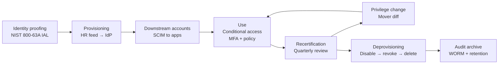

# Identity and Account Management

If [AAA](./aaa-non-repudiation.md) is the language of access, **Identity and Account Management (IAM)** is the operating system underneath it. Every login event you authenticate, every authorization decision you make, every accounting record you keep — they all assume that an identity exists, that it was vetted, that it carries the right attributes, and that it will be cleaned up when the human leaves. Get the identity layer wrong and the rest of your AAA stack is defending an empty box.

Modern enterprises have already crossed a line: there is no perimeter, only identities. A laptop in a coffee shop with the right token is "inside"; a server in the data centre with the wrong one is "outside". Cloud providers, SaaS apps, partner integrations, contractor laptops, CI/CD pipelines — every one of them resolves to an identity, an account, and a set of policies that decide whether to let it through. IAM is the discipline of making that resolution correct, consistent, and recoverable.

## Why this matters

Three patterns repeat in nearly every cloud-era breach report:

1. **Misconfigured access is the number-one cloud breach vector.** Every major incident review — Verizon DBIR, Mandiant M-Trends, the [CISA cloud advisories](https://www.cisa.gov/news-events/cybersecurity-advisories) — keeps listing the same root causes: over-permissive IAM roles, leaked long-lived keys, unrotated service principals, federation tokens with broad scopes, and forgotten admin accounts. The attackers do not break authentication; they walk in through accounts that should not have existed.
2. **Identity is the new perimeter.** When the network boundary dissolves, the only durable boundary left is *who is asking*. Conditional access, device posture, JIT elevation, signed audit trails — all of these assume a single, well-governed identity per human and per workload. Without that, "zero trust" is a marketing slogan painted on a flat network.
3. **Joiner-mover-leaver is the engine that breaks first.** A new hire shows up on Monday with no accounts. A finance clerk moves to procurement and keeps the old payment-approval rights. An engineer leaves and their GitLab token keeps deploying for six months. Every gap in the lifecycle is an audit finding waiting to happen — and an attacker waiting to use it.

The work of an IAM programme is to turn that messy reality into a small set of repeatable processes: prove the human is who they claim to be, create the right accounts, attach the right policies, monitor the use, recertify the access, and tear it all down at the end. Skip a step and the [governance findings](../grc/security-governance.md) will arrive before the breach does.

A second framing is worth keeping in mind throughout this lesson: IAM is the meeting point of three previously separate worlds. **HR** owns who is an employee. **Security** owns the policies. **IT operations** owns the directories, the tokens, and the sessions. None of the three can run an IAM programme alone. When HR fires someone on Friday and IT does not learn about it until the Monday standup, the breach window is the weekend. When security writes a JIT policy that operations cannot implement, the policy is shelfware. The structures, controls, and mappings in this lesson assume those three teams are talking to each other; if they are not, the first IAM project is to make them.

## Core concepts

### Identity proofing

Before you create an account, you decide *how confident* you are that the human in front of you is the human the account is for. [NIST SP 800-63A](https://pages.nist.gov/800-63-3/sp800-63a.html) calls this **identity proofing** and ranks it on three Identity Assurance Levels (IAL):

- **IAL1** — self-asserted. The user types a name and email; nothing is verified. Fine for newsletter signups, useless for payroll.
- **IAL2** — remote or in-person verification of authoritative evidence (passport, national ID, biometric match against the document). The current default for employees, finance customers, and most B2B onboarding.
- **IAL3** — in-person, supervised proofing with biometric capture and verifier-grade evidence. Required for very high-trust populations: federal contractors, clearance holders, signing certificates for executives.

Proofing failures show up later as *account takeover* and *synthetic identity fraud*: an account that was issued to a vague claim cannot be defended once the claim turns out to be wrong. Capture the proofing decision in the identity record so future risk engines and auditors can see why this account exists at all.

A subtler point: **IAL is not the same as authenticator strength**. A user can be IAL2-proofed at hire and then issued a weak password as their authenticator; conversely, a user who self-asserted at signup (IAL1) can later enrol a hardware key (AAL3 in NIST terms). Keep the two axes separate in policy: the proofing level controls the population of identities you trust to exist; the authenticator level controls how strongly each login is bound to that identity. Mixing the two is a common source of confused requirements ("we need MFA" when what is actually missing is identity proofing, or vice versa).

### Account types

Once a human (or workload) is proofed, you create one of five account types — and the type drives everything else (policy, lifecycle, monitoring):

- **Standard user account** — one human, one account, used for daily work. Issued from the HR system of record, scoped to the role, governed by the standard password and MFA policy.
- **Privileged / admin account** — elevated rights, separate from the user's daily account. Engineers log in as `EXAMPLE\elnur.aliyev` for email and `EXAMPLE\adm-elnur.aliyev` for domain admin work. The split keeps phishing on the daily account from compromising the privileged one.
- **Service account** — non-human, owned by an application or scheduled task. Cannot interactively log in, has a long random secret rotated by automation, and is monitored more strictly than human accounts because it never sleeps.
- **Shared / generic account** — used by multiple humans. Breaks the "trace every action to an individual" rule and should be avoided. Where unavoidable (kiosks, batch jobs, break-glass), wrap with PAM session brokering so the human is logged separately.
- **Guest / external account** — visitors, contractors, partners. Time-boxed, scope-restricted, often federated from the partner's own IdP rather than provisioned locally.

A useful design rule: never let a service account act like a user, never let a user account act like a service. Mixing the two means rotation is impossible (the user "needs" the password) and accountability is impossible (the service "shares" the account with several humans).

Modern cloud platforms add two more types worth naming explicitly. **Workload identity** (AWS IAM Roles, Azure managed identity, GCP service account, Kubernetes ServiceAccount) is a service account whose credentials never sit in a config file — the platform mints a short-lived token at runtime based on where the workload runs. Wherever it is available, prefer workload identity over a long-lived service account secret. **External / federated identity** is a user record local to your IdP that points back at a partner IdP for actual authentication; the local record carries policy and group membership, the partner IdP carries the password and MFA. Both types follow the lifecycle steps below, just with different provisioning sources.

### Account management lifecycle

Every account should travel through the same phases, regardless of type:

1. **Provisioning** — triggered by an authoritative source (HR system for employees, contractor tracking for vendors, ticket workflow for service accounts). The IAM platform creates the account in the directory, sets initial attributes, and pushes downstream provisioning.
2. **Configuration** — assign roles, group memberships, conditional access policies, MFA enrolment requirement, account expiration date if applicable. This is where least privilege gets applied at birth, not bolted on later.
3. **Use** — the account does its day job under the policies above. Authentication events, authorization decisions, and accounting records flow into the SIEM.
4. **Recertification** — periodic review (quarterly is common) by the account's manager and the resource owner: *do you still need this access?* Anything not affirmed gets removed.
5. **Privilege change** — promotion, transfer, project move. The IAM platform diffs the old role against the new and removes anything not justified by the new role. The "mover" step is where most lateral-rights creep enters the system.
6. **Deprovisioning** — disable on the last day, remove access tokens, revoke certificates and keys, archive owned files, and finally delete (or tombstone) after a retention window. Disable first, delete later — see the disablement-vs-deletion note below.

A few invariants make the lifecycle work in practice. There must be **one authoritative source per identity type** (HR for employees, contractor management for vendors, asset DB for service accounts) — without that, two systems will fight over the same record. Every step must produce **evidence** suitable for an auditor: a ticket ID, a timestamp, an actor, an outcome. And every account must have a **named owner** at all times — when the owner leaves, the ownership transfers as part of *their* offboarding, not after.

The hardest phase to operationalise is the *mover*. Joiners and leavers have natural triggers (HR records); movers often do not, because a transfer in HR may not list which old systems to remove access from. The fix is to compute a **role diff** at every transfer — old role's entitlements minus new role's entitlements equals what to revoke — and to require a positive affirmation from the new manager that the new role's access is correct. Without that, mover events accumulate cruft until the user is a walking violation of least privilege.

### Access control models

IAM uses the same five authorization models you saw in the [AAA lesson](./aaa-non-repudiation.md), and the choice drives the whole platform shape:

| Model | Decision basis | Where it shines |
|---|---|---|
| **DAC** | Resource owner grants access. | NTFS shares, SharePoint sites with delegated owners. |
| **MAC** | System enforces labelled clearances; users cannot override. | Classified networks, SELinux, regulated data with sensitivity labels. |
| **RBAC** | Permissions attached to roles; users inherit roles. | Active Directory groups, Kubernetes Roles, AWS IAM roles. |
| **ABAC** | Policy evaluates user, resource, and environment attributes. | Conditional access, AWS IAM with conditions, OPA / Rego. |
| **ReBAC** | Permissions follow relationships in a graph. | Modern SaaS sharing models (Google Drive, Notion, Zanzibar-style). |

Most large organisations end up with **RBAC for the bulk and ABAC for the edges**: roles handle the 80 % of access that follows the org chart; attribute policies handle the contextual 20 % (block from unmanaged device, require step-up MFA from a new country, restrict by data sensitivity label). MAC stays in regulated enclaves; DAC remains in collaborative file workloads; ReBAC creeps in wherever sharing is graph-shaped.

Two design rules keep the model from collapsing under its own weight. First, **role explosion is the failure mode of pure RBAC** — when every department wants its own role and every project wants a sub-role, you end up with thousands of roles nobody can audit. Mitigate by composing roles from a small set of *entitlement bundles* (read-finance, write-finance, approve-finance), and by promoting attributes that vary frequently (department, project, location) out of the role name and into ABAC conditions. Second, **policy decisions belong in a policy engine, not in application code** — externalise to a PDP (policy decision point) like OPA, Cedar, or the cloud provider's native engine, so a policy change does not require a code deploy. Both rules echo throughout the [security controls catalogue](../grc/security-controls.md) and the modern reference architectures.

### Account policies

Policies attached to the account control *when* and *from where* it can authenticate, regardless of whether the password is correct:

- **Login hours / time-of-day** — most workers do not need 03:00 admin access. Restrict office-hours roles to office hours; require explicit break-glass for off-hours work.
- **Network location** — block CFO logins from the manufacturing-floor VLAN, block kiosk subnets from administrative apps. The network is no longer the perimeter, but it is still a useful *attribute*.
- **Geofencing and geolocation** — IP-based country and region restrictions. Useful as an additional signal, weak as a sole control because VPNs and residential proxies trivially defeat it. Combine with device posture and risk score.
- **Concurrent sessions** — one interactive session per human per device class. Five simultaneous logins from different countries is not a power user, it is a credential leak.
- **Lockout policy** — N failed attempts in M minutes triggers a temporary lock with exponential backoff. Tune to the threat: too aggressive and a forgotten password becomes a help-desk ticket; too loose and online password spray succeeds.
- **Password complexity and history** — see the [password guidance](./aaa-non-repudiation.md). Modern policy is long passphrases, MFA-required, and screen against breach corpora; not "must contain symbol".
- **Account expiration** — every contractor, intern, and project account gets an expiry at creation. Forgetting to set expiry is how four-year-old accounts end up logged in from Belarus.
- **Impossible travel and risky-login policy** — when the IdP sees logins from Baku and Singapore 12 minutes apart, that account triggers step-up auth or a forced lock. Modern IdPs ship this as a built-in policy.

The right way to think about account policies is **layered defaults**. A baseline applies to every account; a stricter overlay applies to privileged accounts; a stricter-still overlay applies to break-glass accounts. New accounts inherit the baseline automatically; promotion to a privileged role *automatically* upgrades the policy without a separate ticket. If your platform requires manual policy assignment per account, you have already lost — assignments will drift, exceptions will accumulate, and the audit will find the gaps.

### JIT access and JEA

**Just-In-Time (JIT)** access replaces "Bob is always a domain admin" with "Bob can request domain admin for the next 60 minutes, with an approval, after which the rights expire automatically." The standing privilege footprint shrinks toward zero, and every elevation is logged with a justification.

**Just Enough Administration (JEA)** is the companion idea: even when Bob is elevated, restrict him to *exactly* the commands needed for the task. PowerShell JEA endpoints, sudo with command allowlists, and Kubernetes RoleBindings scoped to a namespace all implement this — give the smallest set of capabilities that still completes the job.

JIT + JEA together turn admin access from a permanent identity property into a short, audited, narrowly-scoped event. Combine with PAM (next) and you have the modern privileged access pattern.

The cultural shift matters as much as the tooling. Engineers used to standing access often resist JIT because the workflow adds friction. The counter-argument is twofold: (1) the friction is paid by the engineer rarely, while the absence of friction would be paid by everyone whenever the laptop is stolen or the account phished; and (2) once the workflow is fast (sub-30-second approvals for routine elevations, peer approval rather than manager approval, integration into the engineer's existing chat tool) the friction is below noticeable. A JIT workflow that takes ten minutes to approve will be circumvented within a week; one that takes thirty seconds becomes invisible.

### PAM — vault, session brokering, JIT elevation

[Privileged Access Management (PAM)](./open-source-tools/secrets-and-pam.md) wraps three capabilities into one platform:

1. **Vault** — the secrets store: long-lived service-account passwords, root credentials for break-glass, signing keys, database admin credentials. Humans never see the secret directly; they check it out for a session and the PAM tool injects it.
2. **Session brokering** — the human connects to the PAM bastion, the PAM bastion connects to the target system on their behalf, and the entire session is recorded (commands, screen, transcript). The human and the target never share a TCP path directly.
3. **JIT elevation** — the human requests "production database read access for one hour." An approval workflow runs (peer + change ticket), the PAM tool issues a short-lived credential, and the rights expire automatically.

Open-source and commercial implementations (Teleport, HashiCorp Boundary, CyberArk, BeyondTrust, Delinea) differ in feature emphasis, but the pattern is identical. Without a PAM tool, "least privilege for admins" means standing rights with good intentions; with a PAM tool, it means rights that did not exist five minutes ago and will not exist five minutes from now.

Two operational details separate a working PAM deployment from a vendor demo. First, the PAM tool itself must be **monitored and protected at least as well as the systems behind it** — its own admins, its own MFA, its own break-glass, its own immutable logs. Second, **session recording is only useful if someone reviews it** — wire a sample-review workflow into the SIEM (every Nth privileged session reviewed by a peer or by security) so the recordings function as a deterrent rather than as untouched archive volume. The [secrets and PAM lesson](./open-source-tools/secrets-and-pam.md) covers the operational deep dive; the lesson here is that PAM is the place where *privileged identity* and *privileged operations* finally meet.

### SSO — SAML 2.0 and OIDC

Single Sign-On lets a user authenticate once at the IdP and reach many apps without re-typing the password. Two protocols dominate:

- **SAML 2.0** — XML-based assertions, signed by the IdP. Older, heavier, dominant in enterprise SaaS and on-premise federation. Two flow shapes: **SP-initiated** (user clicks "log in" at the app, the app redirects to the IdP, the IdP authenticates and returns a signed assertion) and **IdP-initiated** (user starts at the IdP portal, picks an app, the IdP pushes an unsolicited assertion). SP-initiated is the safer default; IdP-initiated bypasses the app's relay-state checks and has been a phishing vector.
- **OIDC** — OpenID Connect, JSON tokens (JWTs) on top of OAuth 2.0. Lighter, designed for mobile, SPA, and modern SaaS. The ID token carries identity claims; the access token authorises API calls; the refresh token gets new short-lived tokens without re-authentication.

Pick OIDC for new builds; keep SAML where the SaaS vendor only supports it. Either way, sign and validate every assertion or token, set short lifetimes, bind tokens to the device when possible, and never use IdP-initiated SAML where SP-initiated will work.

A few SSO antipatterns recur in incident reports: assertions accepted with weak signature algorithms (SHA-1, RSA-1024); JWTs validated without checking the `iss`, `aud`, and `exp` claims; refresh tokens stored in browser local storage where a cross-site script can exfiltrate them; and apps that fall back to "local password" auth when the SSO check fails, defeating the entire purpose of federation. A code review for any SSO integration should look for these explicitly — they are not exotic vulnerabilities, they are the boring failures that show up in every penetration test report.

### Federation — SCIM and trust between domains

**Federation** is the trust relationship between identity domains. Your `example.local` IdP trusts the `partner.example` IdP for that partner's users, so they can reach your portal without you provisioning local accounts. The IdP-to-IdP relationship is established once (metadata exchange, signing certificates) and reused for every login.

Federation handles **authentication** — *was this user authenticated by the trusted IdP?* — but does not handle **provisioning** — *does this user exist in our system at all?* That gap is filled by **SCIM 2.0** ([RFC 7643](https://datatracker.ietf.org/doc/html/rfc7643), [RFC 7644](https://datatracker.ietf.org/doc/html/rfc7644)), the System for Cross-domain Identity Management. SCIM defines a REST API for create / update / disable / delete identity records across systems, so when HR adds a new joiner, SCIM pushes the account into Salesforce, GitLab, AWS, Slack, and the rest within minutes.

The pairing is **federation for sign-in, SCIM for lifecycle**. Federation without SCIM gives you logins for users your downstream apps have never heard of; SCIM without federation gives you accounts that still need their own passwords. Together they are the backbone of modern multi-app identity.

A practical detail to plan for: not every SaaS app supports SCIM, and the ones that do often charge an "enterprise tier" surcharge for it. Maintain a SaaS inventory with a column for *SCIM supported / SCIM enabled / lifecycle method*. Apps without SCIM need a fallback: scheduled CSV export from the IdP, custom IdP connector, or in the worst case a manual joiner-mover-leaver runbook with a named owner and a weekly drift report. The audit question that will land at year-end is simple — "for every SaaS app you use, show me how leavers are removed within X hours."

### Cloud identity — Entra, Workspace, AWS IAM, conditional access

The major cloud identity platforms cover similar ground with different vocabulary:

- **Microsoft Entra ID** (formerly Azure AD) — directory, MFA, conditional access, identity protection (risk scoring), Privileged Identity Management (PIM, the JIT layer), B2B for partners, B2C for customers. Federates to on-prem AD via Entra Connect.
- **Google Workspace / Cloud Identity** — directory, 2-Step Verification, context-aware access, BeyondCorp Enterprise for zero-trust app access, Cloud Identity Premium for non-Workspace identities.
- **AWS IAM and IAM Identity Center** — roles, policies, federation (SAML and OIDC), Identity Center for SSO across AWS accounts, fine-grained ABAC via tags and conditions, short-lived STS credentials for workloads.
- **Conditional access** — the policy engine common to all three: *if the user is on a managed device, on a trusted network, with a low risk score, allow; else require step-up; else block.* This is ABAC in production, and it is where most cloud breaches fail open when policies are missing or misconfigured.

The platforms differ; the discipline does not. Centralise identity in one IdP, federate to every cloud, layer conditional access on top, and route all events into the SIEM.

A subtle but important point: cloud IAM has its own identity model that is *not* the user identity. AWS IAM users, Entra service principals, GCP service accounts — these are workload identities the cloud itself uses internally, even when human access is federated from elsewhere. They need their own lifecycle (creation, ownership, rotation, deprovisioning), their own audit, and their own least-privilege treatment. A breach review that finds a "leaked AWS access key" almost always finds it on a workload identity that was created years ago for an experiment, never deleted, and slowly accumulated production permissions. Inventory both the human identities and the workload identities; subject both to the lifecycle.

### Hybrid identity — sync patterns, federated trust, challenges

Most real organisations are hybrid: on-prem AD for legacy apps, Entra or Okta for cloud SaaS, sometimes Google Workspace alongside. Three integration patterns appear:

- **Cloud-only** — the cloud IdP is the source of truth; on-prem joiners are migrated up. Cleanest, but requires retiring AD-bound apps or fronting them with modern auth proxies.
- **Synchronised / hash sync** — AD remains the source of truth, the IdP receives a synchronised copy (passwords as hashes-of-hashes for Entra Connect Password Hash Sync). Authentication can happen in either place. Simple, resilient to cloud outage, but identity changes lag the on-prem source by minutes.
- **Federated trust** — AD remains the source, the cloud IdP federates back to ADFS or Entra Connect Pass-Through Authentication for every sign-in. Strongest single-source-of-truth, but cloud SSO breaks if the on-prem federation server is down.

Hybrid challenges to plan for: drift between on-prem and cloud attributes, conflicting schema (AD `sAMAccountName` vs Entra UPN), service accounts that exist only in AD, partner B2B users that exist only in the cloud, and the universal need for a *master record* that resolves the question "is this Elnur the on-prem one or the cloud one?". A good hybrid IAM design names that master record and never lets the question become ambiguous.

The companion question is **password handling**. In hash-sync, the on-prem password (after a cloud-side re-hash) is what the cloud IdP checks; in pass-through and federation, every cloud login still touches the on-prem AD. Each option has a different break-glass story, a different latency profile, and a different blast radius when the on-prem environment is compromised. Document which model you use, why, and what happens when the on-prem side is unreachable — answer that on a whiteboard before, not during, the outage.

### Identity recertification and access reviews

Recertification is the periodic ritual where every access grant is re-justified. Owners (line managers, resource owners, application owners) receive a list of who has what access and click *keep / revoke / delegate* on each line. Anything not affirmed within the window is automatically removed.

Modern identity platforms (Entra Access Reviews, Okta Access Certifications, SailPoint, Saviynt) automate the campaign: schedule, notify, escalate, enforce, audit. The discipline is in *acting on the result*: if the manager rubber-stamps every line, the review is theatre; if revocations happen and accounts shrink quarter over quarter, the review is real. Map recertification to the [security controls catalogue](../grc/security-controls.md) and to the framework requirement (CIS Control 6, ISO/IEC 27001 A.9, SOX, HIPAA) so the work has audit value as well as security value.

Three campaign cadences cover most needs. **Quarterly** for privileged groups, application owners, and high-risk roles. **Annually** for standard user access and group memberships. **Event-driven** on every transfer, role change, or extended absence — the diff against the previous role is the recertification, performed by the new manager. Built well, recertification stops being a burden the manager dreads and starts being a tool the manager uses to discover what their team can actually do.

## IAM lifecycle diagram

The arrows that matter most are the loops: *Use → Recertification → Privilege change → Use* is the steady-state engine; *Use → Deprovisioning → Audit archive* is the exit ramp every account will eventually take. A programme that never closes accounts has a leak; a programme that closes them but never archives the audit trail has no defensible record afterward.

## Hands-on: practice

Five exercises sized for a couple of hours each. They reinforce the concepts above without needing a lab beyond a laptop and a free-tier cloud account.

### Exercise 1 — Set up SAML SSO from Keycloak to a sample app

Deploy Keycloak in a container. Create a realm, enrol two test users, and configure a SAML client for a sample app (any open-source SAML SP — Grafana, GitLab, or the SAMLtest.id sandbox). Verify three things: (1) SP-initiated login from the app redirects to Keycloak, authenticates, and returns a signed assertion; (2) the assertion's signature validates and the app extracts the username and group claims; (3) IdP-initiated login is *disabled* unless the app explicitly needs it. Document the metadata exchange and the signing-certificate rotation plan.

Then break it deliberately to see what the failure modes look like: tamper with one byte of the assertion and confirm the app rejects it; let the IdP signing certificate expire and observe the error path; force the assertion to use SHA-1 and confirm the modern SP refuses. The point of the exercise is not just to make SSO work, but to feel where it fails — those are the alerts you will see in production.

### Exercise 2 — Configure SCIM provisioning to a downstream app

Using the same Keycloak (or Entra ID free tier), enable SCIM 2.0 provisioning to a downstream app that supports it (GitLab, Slack, or a SCIM mock server). Confirm that creating a user in the IdP creates the account downstream within seconds, that updating attributes propagates, and that disabling the user disables the downstream account. Write up where the SCIM bearer token is stored, how it is rotated, and what happens when the SCIM endpoint is unreachable.

Add a stretch task: simulate a network partition between the IdP and the downstream app for ten minutes, then watch the reconciliation behaviour when the link recovers. Does the IdP retry? Does it batch? Are there gaps where lifecycle events were lost? Real-world SCIM rarely fails loudly — it more often quietly drops events — and confidence comes from understanding the recovery semantics before they matter.

### Exercise 3 — Design a JIT access workflow for production

Sketch a JIT workflow for a small engineering team that needs occasional production database access. Decide: who approves (peer? manager? on-call lead?), what justification is required (change ticket? incident ID?), how long the elevation lasts (15 minutes? 4 hours?), what is recorded (session transcript? query log?), and how break-glass works when the approver is unreachable. Implement a paper version on Confluence, then evaluate which PAM tool (Teleport, HashiCorp Boundary, CyberArk) you would buy or build. Include a rollback plan for when the JIT tool itself is down.

Capture three measurable goals up front: median time-to-approval, percentage of elevations that include a change ticket, and standing-privilege count after rollout. Without those numbers, "we use JIT now" can mean anything from "real reduction in attack surface" to "same standing access plus a click".

### Exercise 4 — Audit shared accounts for over-permissioning

Pick a real or lab environment and pull a list of every account flagged "shared", "generic", "service", or "kiosk". For each, answer: who owns it, what does it do, can it interactively log in, what privileges does it hold, when was its password last rotated, and what would break if you disabled it tomorrow. Write up the top three over-permissive shared accounts and propose either replacement (per-user PAM checkout) or hardening (no interactive login, scoped service principal, automated rotation).

### Exercise 5 — Build an account-recertification campaign script

Write a PowerShell or Python script that pulls every member of three privileged groups in your IdP (`Domain Admins`, `Cloud Admins`, `Database Admins`), correlates each member to the HR feed, flags anyone not in the active employee list or whose manager is missing, and emails each manager a one-click "keep / revoke" form. Add a 14-day deadline and an automatic revocation for un-actioned lines. Run the script in dry-run mode and review the output with a stakeholder before any account is touched.

Track the *outcome* of each campaign over time: how many members reviewed, how many revoked, how long until the deadline-driven revocations fired, and how many accounts came back the next quarter (a signal that revocations are being reversed without follow-up). The script is a tool; the metric is the programme.

## Worked example: example.local modernises its IAM

`example.local` is the same 80-person firm from the [AAA lesson](./aaa-non-repudiation.md) and the [CIA triad lesson](./cia-triad.md). Their identity layer has grown organically: AD on-prem, manual provisioning into Salesforce and GitLab, a shared `admin` account on AWS, no recertification, no SCIM, no JIT. The CFO has signed off on a two-quarter modernisation.

### Target architecture

- **Source of truth** — the HR system (BambooHR) drives identity. A new joiner record in HR triggers the IAM workflow; a termination record triggers deprovisioning.
- **Identity provider** — Microsoft Entra ID, federated to on-prem AD via Entra Connect (password hash sync, with cloud authentication primary). Existing AD accounts and groups synchronise up; new accounts are born in HR and propagated via SCIM.
- **Downstream provisioning** — SCIM 2.0 from Entra ID to Salesforce, GitLab, AWS Identity Center, Slack, and the internal portal. Joiner-mover-leaver propagates within five minutes of the HR change.
- **Conditional access** — managed device + low risk score required for admin scopes; MFA required for every login; legacy authentication blocked; logins from unexpected countries trigger step-up or block.
- **Production access via PAM** — Teleport (or HashiCorp Boundary) brokers SSH and database sessions to AWS production. Engineers request JIT elevation with a change-ticket reference; peer approval required for "Domain Admin"-class actions; sessions recorded, transcripts stored in WORM.
- **Recertification** — quarterly access reviews via Entra Access Reviews. Every privileged group, every guest account, every cross-tenant access grant. Un-affirmed access auto-revoked at the deadline.
- **Audit and accounting** — every Entra event, AD security log, SCIM operation, PAM session, and HR feed change lands in the SIEM. Logs are hash-chained at ingest and retained per the [security governance](../grc/security-governance.md) policy (90 days hot, 1 year warm, 7 years cold for regulated data).

### Rollout phases

1. **Quarter 1 — identity consolidation.** Stand up Entra ID, configure Entra Connect, federate the existing AD. Pilot SCIM provisioning to one downstream app (GitLab). Issue WebAuthn keys to admins. Enable conditional access in *report-only* mode to find broken flows before enforcement.
2. **Quarter 1 — joiner-mover-leaver.** Wire BambooHR to Entra as the provisioning source. Cut over Salesforce, AWS Identity Center, and Slack to SCIM. Decommission the manual ticket-driven account creation.
3. **Quarter 2 — privileged access.** Deploy Teleport. Migrate engineers from long-lived SSH keys to short-lived certificates. Enrol all production AWS accounts behind the PAM bastion. Eliminate the shared `admin` account on every device.
4. **Quarter 2 — recertification and audit.** Schedule the first quarterly access review. Configure the SIEM hash-chained ingest. Run a tabletop "what if the IdP is down" and validate the break-glass procedure.

### Controls mapped to IAM domains

| Control | Identity proofing | Provisioning | Authn / Authz | Recertification | Deprovisioning |
|---|---|---|---|---|---|
| HR feed → Entra ID | Captured at hire | Source of truth | n/a | Drives review scope | Termination triggers off-board |
| SCIM to downstream | n/a | Yes | n/a | Drift detection | Disables on revoke |
| Conditional access | n/a | n/a | Yes (ABAC) | n/a | n/a |
| Teleport PAM | n/a | n/a | JIT cert issuance | Session log review | Revokes on expiry |
| Entra Access Reviews | n/a | n/a | n/a | Yes | Auto-revoke at deadline |
| SIEM hash-chained ingest | n/a | n/a | n/a | Evidence for review | Tamper-evident audit |

That is what a modern IAM stack looks like at a small enterprise — not one product, but a coherent flow where HR drives identity, the IdP authenticates, SCIM provisions, conditional access decides, PAM elevates, reviews recertify, and the SIEM remembers.

### Success metrics for the rollout

- **Lifecycle latency** — minutes from HR change to downstream account state. Target under 10 minutes for joiners and movers; under 5 minutes for leavers.
- **Standing privilege footprint** — count of accounts with always-on admin rights. Target 90 % reduction by end of Q2 as JIT replaces standing.
- **Recertification revocation rate** — percentage of access lines revoked per quarterly cycle. A healthy programme runs 5–15 %; zero revocations means rubber-stamping.
- **Orphaned-account count** — accounts in any system without a matching active employee or owned service. Target zero, audit weekly.
- **MFA coverage on privileged groups** — percentage of privileged-group members enrolled in phishing-resistant MFA. Target 100 %; partial coverage means the unenrolled accounts are the attacker's first stop.
- **Time-to-approval for JIT** — median seconds from request to approval. Target under 60 seconds for routine elevations; longer means engineers will hoard standing access "just in case".

### Lessons from the rollout

A few patterns are worth naming explicitly because every IAM modernisation hits them. **The first SCIM cutover always finds two systems in disagreement** — usually a SaaS app whose user records were edited manually for years, drifted from the source of truth, and now refuse to reconcile. Plan a two-week reconciliation window for the first major app and budget engineering time for the cleanup. **Conditional access in enforce mode always blocks one VIP** — a board member on a personal laptop in an unexpected country, a CFO with an old phone that does not support modern auth. Identify and pre-handle the top ten edge cases before flipping the switch. **The PAM tool will be the first target** of the next red-team exercise because it concentrates the keys to the kingdom; harden it accordingly, with its own MFA, its own monitoring, and its own break-glass story documented in a sealed envelope rather than in the PAM tool itself.

## Troubleshooting and pitfalls

- **Disablement vs deletion** — disable when the human leaves, delete only after retention. Premature deletion orphans files, breaks ownership chains, and erases audit trails. A disabled account is reversible if the offboarding was wrong; a deleted one is not.
- **Orphaned service accounts** — a service account whose application was retired five years ago, still active, still authenticating from somewhere. Tie every service account to a named owner and a renewal date; auto-disable accounts whose owner has left.
- **Shared `admin` accounts on network gear** — the single most common AAA failure. One password, ten engineers, no individual accountability. Replace with per-user RADIUS / TACACS+ to AD; keep one break-glass account in the safe with a change-on-use seal.
- **Long-lived cloud access keys** — AWS access keys with no rotation, no scope, often committed to a private repo "just for testing". Eliminate with short-lived STS roles, IAM Identity Center, or workload identity federation.
- **SCIM token leakage** — the SCIM bearer token is a master key for downstream provisioning. Store in a secrets vault, rotate quarterly, restrict the IdP egress to the SCIM endpoint's IP range, alert on use from anywhere else.
- **Conditional access misconfiguration in enforce mode** — a "block legacy auth" rule that catches a legitimate Exchange ActiveSync user the morning of go-live. Always run new policies in *report-only* for two weeks before enforcement; have a named human accountable for every block.
- **MFA fatigue exploiting shared accounts** — push prompts to the shared phone of a kiosk operator, who eventually approves. Replace shared accounts with per-user; require number matching on every push.
- **Federation IdP outage taking everything down** — when Entra is unreachable, every federated SaaS is unreachable. Plan a break-glass local account on the most critical systems; document and test the recovery; monitor the IdP availability as a P1 service.
- **Stale guest / B2B accounts** — partner contractors invited two projects ago, still active, still in shared channels. Time-box every guest at invite, require quarterly re-invite, auto-disable on expiry.
- **Over-broad RBAC roles** — `App Owner` granting read-write on every customer record because the role was designed once and never narrowed. Audit role membership and role permissions against actual usage; split roles when usage diverges.
- **JIT without approval** — "self-service elevate to admin" without a peer approver is just standing privilege with extra clicks. Require a second human for any production-impacting elevation.
- **Recertification rubber-stamping** — managers approving 100 lines in 30 seconds. Sample audit the reviews; track revocation rate; require justification on retain decisions for privileged roles.
- **Hybrid drift** — an attribute changed in AD but never propagated to Entra (or vice versa) so policy decisions based on the attribute fire wrong. Monitor the sync pipeline, alert on backlog, run quarterly drift reports.
- **Service principals with owner = "shared mailbox"** — the registered owner left, the mailbox remains, no one is accountable. Forbid non-human owners on service principals; require a named human plus a backup.
- **Conditional access exemption lists** — "this one user is exempt" turns into a 200-name exception group nobody reviews. Time-box every exception, tie it to a ticket, recertify quarterly.
- **PAM tool itself becoming a single point of failure** — every admin path runs through one bastion; the bastion is down, the bank is offline. Plan the break-glass: documented procedure, sealed credentials in a safe, dual control to open.
- **Logging gaps at the application layer** — IdP and OS logs show "user logged in" but not "user exported the customer list." Audit the business-critical apps for accounting completeness, not just the platform.
- **Identity proofing decay** — the proofing was done once at hire and never refreshed. For high-trust roles, re-proof on role change and on long absences; capture the decision in the identity record.
- **Group nesting that hides effective permissions** — `App Read` is a member of `App Reviewer` is a member of `App Owner`, and the contractor placed in `App Read` ends up with owner rights through inheritance. Audit *effective* permissions, not just direct group membership; flatten or constrain nesting where the audit cannot reason about it.
- **Two-person rule defeated by single notification channel** — the approver's phone is also the requester's phone. Bind approvals to a different device class or a different channel (Slack approval for an SSH JIT request from the laptop, never both on the same device).
- **Ungoverned automation creating accounts** — an Ansible playbook, a CI pipeline, or a Terraform module silently creates IAM users outside the IAM platform. Inventory who can create accounts; alert on any account whose creation event does not have an IAM-platform parent record.
- **Conditional access bypass via "trusted IPs"** — the office NAT range marked trusted, then a VPN concentrator added to the same range, then a partner network, until "trusted IP" means "more than half the internet on a slow Tuesday". Recertify trusted-network lists quarterly; prefer device posture over IP whenever possible.

## Quick-reference glossary

| Term | One-line meaning |
|---|---|
| **IAM** | Identity and Access Management — the discipline of identities, accounts, and access. |
| **Identity proofing** | Verifying that a human is who they claim to be before issuing an account (NIST IAL1/2/3). |
| **Provisioning** | Creating accounts and entitlements, ideally driven from an authoritative source. |
| **Deprovisioning** | Disabling and eventually removing accounts when the user leaves or moves. |
| **Recertification** | Periodic review where access is re-justified or removed. |
| **JIT / JEA** | Just-In-Time elevation / Just Enough Administration — short-lived, narrowly-scoped admin rights. |
| **PAM** | Privileged Access Management — vault, session brokering, and JIT elevation in one platform. |
| **SSO** | Single Sign-On — authenticate once at the IdP, reach many apps. |
| **SAML 2.0 / OIDC** | The two federation protocols that carry SSO across domains. |
| **SCIM 2.0** | REST API standard for cross-domain identity provisioning (RFC 7643/7644). |
| **Federation** | Trust relationship between identity domains for cross-org sign-in. |
| **Conditional access** | ABAC policy engine that decides allow / step-up / block per request. |
| **Hybrid identity** | On-prem and cloud identity stacks integrated via sync or federation. |
| **Service account** | Non-human account for a workload; cannot interactively log in, rotated by automation. |
| **Break-glass** | Emergency-use account, sealed in a safe, alerts the world when used. |

## Maturity ladder

A small assessment to plot where an organisation sits and what to build next:

| Level | Identity | Provisioning | Privilege | Recertification |
|---|---|---|---|---|
| **Ad hoc** | Local accounts per app | Email / ticket-driven | Standing admin shared | None |
| **Repeatable** | Central directory (AD) | Manual but documented | Per-user admin separate from daily | Annual, ad-hoc |
| **Defined** | Single IdP for SSO | SCIM for major apps | JIT for some critical paths | Quarterly for privileged |
| **Managed** | HR-driven lifecycle | SCIM end-to-end | JIT default + JEA + PAM | Quarterly + event-driven |
| **Optimised** | Workload identity for all automation | Self-service with policy guardrails | Zero standing privilege | Continuous + risk-scored |

Most organisations sit between Repeatable and Defined; the journey to Managed is the meat of an IAM modernisation programme; Optimised is a multi-year destination that depends as much on engineering culture as on tooling. Use the ladder to set realistic targets quarter by quarter, and to argue for the budget needed to climb a rung.

## Key takeaways

- Identity is the new perimeter. Misconfigured access is the number-one cloud breach vector; IAM is the discipline that keeps it from being yours.
- Identity proofing happens before account creation, follows [NIST SP 800-63A](https://pages.nist.gov/800-63-3/sp800-63a.html) IAL levels, and is captured in the identity record so future decisions can refer to it.
- Account types (standard, privileged, service, shared, guest) drive different policies and lifecycles; never let one type act like another.
- The lifecycle is provision → configure → use → recertify → privilege change → deprovision → audit archive. Every gap in the loop is a finding.
- RBAC handles the bulk; ABAC handles the contextual edges; conditional access is ABAC in production.
- JIT + JEA + PAM together replace standing admin rights with short, audited, narrowly-scoped events.
- SSO is the user experience; federation is the trust; SCIM is the provisioning. Use OIDC for new builds, SAML where you must, SCIM for everything that supports it.
- Cloud identity (Entra, Workspace, AWS IAM) shares the same discipline under different vocabulary; centralise in one IdP, layer conditional access, route everything to the SIEM.
- Recertification is real only if it produces revocations. Track the rate, audit the reviewers, refuse to rubber-stamp.
- The maturity ladder (Ad hoc → Repeatable → Defined → Managed → Optimised) is a useful shared vocabulary for setting quarterly targets and arguing for IAM investment.
- HR, security, and IT operations must run the IAM programme together; a wall between any two of them is the root cause of nearly every lifecycle gap.
- Workload identities (cloud roles, managed identities, K8s service accounts) follow the same lifecycle as humans; treat them as first-class identities, not as configuration.

## References

- [NIST SP 800-63A — Digital Identity Guidelines: Enrolment and Identity Proofing](https://pages.nist.gov/800-63-3/sp800-63a.html)
- [NIST SP 800-63B — Digital Identity Guidelines: Authentication and Lifecycle Management](https://pages.nist.gov/800-63-3/sp800-63b.html)
- [NIST SP 800-63C — Digital Identity Guidelines: Federation and Assertions](https://pages.nist.gov/800-63-3/sp800-63c.html)
- [SAML 2.0 — OASIS Security Assertion Markup Language](https://docs.oasis-open.org/security/saml/v2.0/saml-core-2.0-os.pdf)
- [OpenID Connect Core 1.0](https://openid.net/specs/openid-connect-core-1_0.html)
- [RFC 7643 — System for Cross-domain Identity Management: Core Schema](https://datatracker.ietf.org/doc/html/rfc7643)
- [RFC 7644 — System for Cross-domain Identity Management: Protocol](https://datatracker.ietf.org/doc/html/rfc7644)
- [CIS Controls v8 — Control 5: Account Management](https://www.cisecurity.org/controls/account-management)
- [CIS Controls v8 — Control 6: Access Control Management](https://www.cisecurity.org/controls/access-control-management)
- [ISO/IEC 24760-1 — A framework for identity management](https://www.iso.org/standard/77582.html)
- [Cross-link: AAA and Non-Repudiation](./aaa-non-repudiation.md)
- [Cross-link: IAM and MFA tooling](./open-source-tools/iam-and-mfa.md)
- [Cross-link: Secrets and PAM](./open-source-tools/secrets-and-pam.md)
- [Cross-link: Active Directory Domain Services](../servers/active-directory/active-directory-domain-services.md)
- [Cross-link: LAPS — Local Administrator Password Solution](../servers/active-directory/laps.md)
