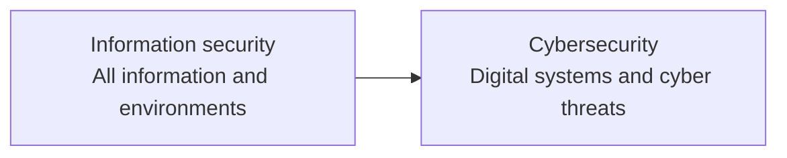

# Information Security and Cybersecurity

**Information security** and **cybersecurity** are often used as synonyms, but they are not identical. Both protect information and the systems that process it. The difference is mainly the **scope and environment**:

> **Information security protects information in any form. Cybersecurity protects digital systems, networks, devices, applications, and the information within them from cyber threats.**

## What is information security?

Information security (or **Infosec**) is the collection of policies, processes, people, physical safeguards, and technical controls used to protect information's **confidentiality, integrity, and availability**. The information does not need to be on a computer: a paper contract, a conversation, a USB drive, a database, and a backup are all information assets.

Infosec asks:

- Can only authorised people see the information?
- Has it remained accurate and free from unauthorised changes?
- Can authorised users access it when they need it?
- Can the organisation show who used it, when, and for what purpose?

Locking confidential contracts in a cabinet, restricting access to that cabinet, recording document destruction, and training employees are information-security controls even when there is no computer attack.

## What is cybersecurity?

Cybersecurity protects computers, servers, mobile and IoT devices, networks, cloud services, applications, and digital information from unauthorised access, exploitation, disruption, and data theft.

Cybersecurity is not just installing a firewall. Secure configuration, timely patching, identity and access management, logging, user education, incident response, and tested backups are equally important.

Typical cybersecurity work includes:

- monitoring endpoints, servers, and network traffic;
- finding and remediating vulnerabilities;
- enforcing multi-factor authentication and least privilege;
- detecting phishing, malware, ransomware, and account takeover;
- investigating incidents, containing the spread, and restoring systems;
- testing whether backups can actually be recovered.

## The scope difference

Information security is the wider umbrella. Cybersecurity focuses on its digital and network-connected part.

| Topic | Information security | Cybersecurity |
|---|---|---|
| Assets | Information in paper, spoken, physical, and digital forms | Digital devices, networks, applications, cloud services, and electronic data |
| Threats | Accidental disclosure, theft, fire, insider misuse, deletion, and cyber attacks | Phishing, malware, ransomware, DDoS, exploitation, account takeover, and data breaches |
| Controls | Policies, classification, physical access, retention, destruction, training, and audit | Firewalls, EDR/antivirus, IDS/IPS, SIEM, MFA, encryption, and vulnerability management |
| Outcome | Protect information throughout its lifecycle | Prevent, detect, and respond to attacks against digital environments |

The boundary is not rigid. Data classification is an Infosec policy, for example, but it also determines technical DLP rules. Most organisations use one security programme and team for both.

## How they relate

Cybersecurity can be understood as a specialised subset of information security:

This does not make one more important than the other. A firewall may block a network attack, but it does not stop an unauthorised person entering a server room or an employee leaving a confidential document on a printer. Good digital controls do not automatically solve physical, procedural, or human risks.

## The CIA triad

Both disciplines use the **CIA triad**:

| Principle | Meaning | Example control |
|---|---|---|
| **Confidentiality** | Only authorised people can see the information | Access control, encryption, data classification |
| **Integrity** | Information is not changed or corrupted without authorisation | Hashing, digital signatures, file-integrity monitoring |
| **Availability** | Authorised users can reach information when needed | Backups, restore tests, RAID, redundancy, DDoS protection |

A breach does not require an attacker. A misconfigured storage bucket can violate confidentiality, a faulty script can damage integrity, and a power failure can affect availability. CIA describes the result, not the motive.

## Core areas

Information-security programmes usually cover governance and risk, data classification and retention, people and processes, physical security, access management, business continuity, disaster recovery, and cybersecurity operations.

Cybersecurity programmes commonly cover network security, endpoint security, application and API security, cloud security, vulnerability management, threat detection, digital forensics, incident response, and user security.

The malware types in the source material illustrate common cyber threats:

- **Viruses** attach to files or programs and may spread when they run.
- **Worms** can spread between systems without direct user action.
- **Trojans** appear legitimate while performing malicious actions.
- **Spyware** secretly monitors activity or collects information.
- **Ransomware** encrypts data and demands payment for recovery.

A ransomware incident that begins with phishing is both a cybersecurity incident and an information-security problem: digital systems are attacked, confidentiality or availability may be lost, and the organisation must make process and recovery decisions.

## Practical examples

| Event | Main area | Why |
|---|---|---|
| An unauthorised person enters the server room | Information security | It is a physical information-asset risk |
| An employee leaves a confidential paper document on a printer | Information security | Confidentiality is lost without a cyber attack |
| A phishing link compromises a Microsoft 365 account | Both | A cyber attack affects an information asset |
| SQL injection in a web application | Cybersecurity | It exploits a digital application |
| A backup server fails after a power outage | Both | Availability and business continuity are affected |
| Shared administrator passwords are used everywhere | Both | A process weakness makes digital compromise easier |

## Building a sound security programme

1. **Inventory assets and information.** You cannot assess or protect what you do not know exists.
2. **Classify information.** Decide who may access it, how it may be shared, and how long it must be retained.
3. **Apply baseline controls.** MFA, least privilege, patch management, encryption, backups, and physical access controls are a practical starting point.
4. **Prepare people.** Teach users to recognise suspicious email, removable media, and unsafe sharing.
5. **Monitor and test.** Collect logs, investigate alerts, scan for vulnerabilities, and perform real restore tests.
6. **Plan incident response.** Decide in advance who makes decisions, what gets isolated, who is notified, and how evidence is preserved.

## Conclusion

**Information security** is the broader discipline: it protects information on paper, in conversation, on devices, in the cloud, and inside organisational processes. **Cybersecurity** is the part focused on digital systems and cyber threats. An organisation does not achieve information security by installing only a firewall and antivirus. Effective protection combines policy, people, physical safeguards, technology, monitoring, and tested recovery.
