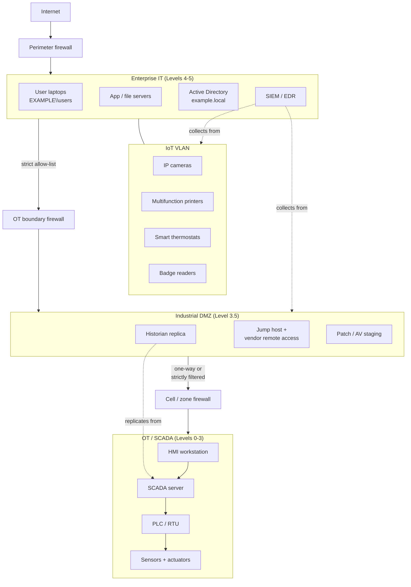

# Embedded Systems, IoT, and ICS Security

## Why this matters

An enterprise network used to be a list of servers, laptops, and printers. The same network today also runs the badge readers at the door, the HVAC controller in the basement, the IP cameras in the parking lot, the label printer on the shop floor, the PLC driving the conveyor, the infusion pump on a patient floor, and the smart TV in the boardroom. Most of those devices were bought by a team that does not report to IT, installed by an integrator who left years ago, and patched — if ever — only when the vendor says so. A typical mid-sized enterprise in 2026 has more embedded devices than laptops on its network, and only a fraction of them appear in the CMDB.

Each one of those devices is an **embedded system**: a purpose-built computer hidden inside something that is not sold as a computer. When they talk to each other across IP we call the assembly **IoT** (Internet of Things). When they control physical processes — pumps, valves, turbines, conveyor belts — we call it **OT** (Operational Technology), and the umbrella name for the control software is **ICS** (Industrial Control Systems) or **SCADA** (Supervisory Control and Data Acquisition). These categories overlap; a smart thermostat is IoT, the building-wide HVAC controller it talks to is OT, and the historian that stores all of that for reporting sits astride both worlds.

The security story is ugly. Embedded vendors optimise for cost and feature velocity, not security. Default credentials are documented in the manual. Firmware updates ship late, through a USB port, maybe never. The device runs a 2014 Linux kernel on a chip that has not been revved since manufacturing. The network stack trusts anything on the same VLAN. And because the device is "not a computer", nobody asks whether it should be on the domain, be scanned, be logged, or have MFA.

The incidents track the neglect. Mirai took over hundreds of thousands of IP cameras and DVRs using a list of 62 default credentials. Stuxnet showed a nation-state could wreck industrial centrifuges via a PLC. The Target breach started with an HVAC vendor. Ransomware on a single HMI workstation has halted pipelines, hospitals, and food-processing plants. None of these required novel cryptographic breakthroughs; they all required the defender to leave an embedded device with the vendor defaults on a reachable network.

The economics of the defender's side are equally awkward. A SIEM licence gets budget because the CFO can picture a breach. Segmenting the building-automation VLAN, adding a jump host for the integrator, and forbidding the HVAC vendor's laptop from direct network access — those do not show up on anyone's dashboard until the day they prevent an incident that now never happens. The work is unglamorous, cross-functional, and easy to defer. It is also consistently the highest-leverage thing a small security team can do.

This lesson walks the landscape: what the hardware categories are (Raspberry Pi, Arduino, FPGA, SoC), how SCADA/ICS environments differ from IT networks, what specialised systems (medical, vehicle, aircraft, smart meters) bring with them, which communication technologies (5G, Zigbee, narrow-band, SIM) show up in these devices, and what design constraints — power, compute, patching, implied trust — shape every decision. We end with a worked example at `example.local`: a mid-sized enterprise deploying an industrial SCADA stack for facility HVAC, and how security gets threaded into each layer.

## Core concepts

### Embedded vs general-purpose

A **general-purpose computer** — your laptop, a server, a VM — is built to run arbitrary workloads. It has a full OS, a package manager, a patching story, a user model, and an update lifecycle measured in days. An **embedded system** is the opposite: a fixed-purpose computer soldered into a larger product, built to do one job for ten years. It may run Linux, an RTOS, or no OS at all. It often has no package manager, no remote shell, no syslog, and no user accounts beyond a root prompt on a serial port nobody has ever plugged into.

The consequences for security:

| Property | General-purpose | Embedded |
|---|---|---|
| Patching cadence | Monthly at minimum | Rare, often never |
| Update channel | OS vendor + app store | Firmware image from manufacturer |
| User model | Multi-user, RBAC | Usually none, or one hard-coded admin |
| Attack surface | Wide but known | Narrow but unmonitored |
| Lifecycle | 3–5 years | 10–20 years in the field |
| Monitoring | SIEM agents, EDR | Usually none |
| Development priorities | Security + compatibility | Cost + feature velocity |
| Regulation | Sector specific | Often none at all |

The payoff is predictability: an embedded system does exactly one thing, forever, reliably. The price is that when a vulnerability lands, you have limited tools to respond. The vast majority of embedded security incidents come from devices doing **exactly what they were designed to do** — responding to a Modbus write, accepting a firmware image, trusting an unauthenticated peer — being used by an attacker the designer never contemplated.

### Development boards — Raspberry Pi, Arduino, FPGA

Three prototyping platforms that keep showing up in enterprise environments — sometimes as legitimate tools, sometimes as shadow IT someone wired into a production network.

**Raspberry Pi.** A low-cost single-board computer (under 100 USD) running a full Linux distribution on an ARM processor. Typical specs include a quad-core CPU, several gigabytes of RAM, Wi-Fi on 2.4 and 5 GHz, Bluetooth, Gigabit Ethernet, USB, GPIO pins for hardware interfacing, and enough horsepower to act as a desktop. Because it is a full Linux box, treat it like any other Linux host: unique credentials, SSH key auth, automatic updates, host firewall, and inclusion in your asset inventory. The convenience that made it popular with hobbyists also makes it popular as an unsanctioned jump box plugged under someone's desk, and as a production element in low-volume commercial products.

**Arduino.** A microcontroller board, not a computer. No OS, no filesystem, no network by default — the program runs directly on the chip when power is applied. Designed for sensor input and actuator output, specifically for interfacing with sensors and devices. If power is lost, once it is restored the device can begin functioning again — unlike a computer, which would have to reboot. The Arduino platform is expanded via a series of add-on boards called **shields** that layer in networking, displays, data logging, and other specific functions. The security story is different from a Pi: there is rarely a network interface to attack, but the code on the chip is usually unsigned, and replacing it physically is trivial. Arduinos show up inside custom hardware projects, lab equipment, and maker-built facility add-ons.

**FPGA (Field Programmable Gate Array).** Semiconductor chips built from a matrix of configurable logic blocks (CLBs) connected via programmable interconnects. The logic is programmed after manufacturing via hardware description languages like VHDL or Verilog, and can be reprogrammed as the design evolves. Unlike ASICs (which are etched for a single function at the factory) an FPGA can be reconfigured in the field. Used for digital signal processing, image and video pipelines, cryptographic acceleration, and software-defined radios where the radio's function is defined in software and can be updated. Security properties: the bitstream loaded into the FPGA can be signed or encrypted; older or cheap parts do not enforce this and a malicious bitstream can be swapped in. FPGAs excel at parallelism — they can process many independent tasks at once, which is why they turn up in real-time image pipelines and crypto accelerators. Disadvantages: they require HDL skills to program, and for the same workload they can consume more power than a custom ASIC.

**Wearables.** A close cousin of the development board world — fitness trackers, smartwatches, biometric sensors built around a tiny computer usually running a stripped-down Linux or an RTOS. Wearables are increasingly rich data sources (heart rate, sleep, location, activity), and protecting that data is the central security objective.

### SCADA / ICS overview

**SCADA** (Supervisory Control and Data Acquisition) is the umbrella term for systems that control physical processes via networked computers. Depending on the industry you may also hear **DCS** (Distributed Control System) or **ICS** (Industrial Control Systems) — for practical purposes they describe the same thing. Wherever computers directly control a physical process, SCADA is in the picture.

SCADA shows up in many industries:

- **Facilities.** Building automation, HVAC, elevators, water pressure pumps, fire alarms, access controls.
- **Industrial plants.** Environmental monitoring, surveillance, fire systems, general process computer control.
- **Manufacturing.** Programmable logic controllers executing process-specific instructions based on sensor readings and actuator settings — strict network segmentation is the standard practice here because manufacturing lines are business-critical.
- **Energy.** Electrical generation and distribution, chemical, petroleum, pipelines, nuclear, solar, hydrothermal. Distribution in particular spans geography — pipelines and transmission lines sit outside the corporate perimeter.
- **Logistics.** Moving material from point A to point B by sea, rail, road, or air. Two things under control: the transport system and the material itself.

A typical SCADA stack has five recognisable layers, usually mapped to the **Purdue Enterprise Reference Architecture** levels:

- **Level 0 — Field devices.** Sensors and actuators — temperature probes, flow meters, valves, motors.
- **Level 1 — Controllers.** PLCs (Programmable Logic Controllers) and RTUs (Remote Terminal Units) that read sensors and drive actuators in real time.
- **Level 2 — Supervisory / HMI.** Human-Machine Interface workstations where operators see the process and can intervene. Historians (time-series databases) record everything.
- **Level 3 — Operations management.** Plant-wide MES, batch managers, engineering workstations.
- **Levels 4 / 5 — Enterprise IT.** Corporate network, ERP, email, the rest of the business.

Historically Levels 0–3 were **air-gapped** from the IT network — no direct network connection, data moved by USB or manual entry. That isolation is eroding: modern business wants real-time production data in the ERP, remote vendor support, and cloud analytics. Each new connection expands the attack surface, and every SCADA environment now needs the IT-style controls that used to be unnecessary: segmentation, monitoring, authentication, patching. The closer the SCADA network looks to a regular IT network, the more IT-style security it needs.

### IoT device anatomy

Despite the variety, most IoT devices share a common shape:

- **A sensor or actuator** — the reason the device exists (temperature probe, camera sensor, motor driver).
- **A microcontroller or SoC** — runs the firmware, talks to the sensor, drives the radio.
- **A radio** — Wi-Fi, Bluetooth, Zigbee, cellular, LoRa, or similar.
- **A firmware image** — usually an embedded Linux or RTOS built once and deployed to millions of units.
- **A cloud backend** — the vendor's service the device phones home to, often via MQTT or HTTPS.
- **A mobile app** — how the end user configures the device.

The common failure modes track those parts: default credentials, unsigned firmware, plaintext protocols, hard-coded cloud endpoints, and cloud APIs that trust any authenticated device. IoT vendors chase feature scale; security comes second if at all.

**Sensors** deserve a sentence of their own. They translate a physical signal (temperature, pressure, voltage, position, humidity) into a digital reading. Precision, range, sample rate, and environmental resilience are the design axes. A humidity sensor that drifts by 5% once a year still functions; a sensor feeding a safety interlock that drifts silently can cause an incident. For security purposes, sensors are mostly interesting because their **readings are inputs** that downstream logic trusts — spoofing a sensor is sometimes easier than breaking the controller.

**Facility automation** is where all of this comes together in a building: security systems, HVAC, fire sensors, elevator controls, door readers, and IFTTT-style automation rules that tie events across them. The payoff is speed of response and removed manual errors; the cost is a dense, interconnected control plane that expands the blast radius of a single compromise.

### Specialised systems — medical, vehicle, aircraft, smart meters

Four specialised categories that deserve individual treatment because exploitation has safety consequences — people get hurt, not just data lost.

**Medical devices.** Pacemakers, infusion pumps, MRI machines, lab analysers. Often run stripped-down embedded Linux kernels that were current when the device shipped five or ten years ago. Regulatory approval (FDA 510(k), EU MDR) makes patching a slow process because any change may require recertification. As the base kernel version ages, new vulnerabilities land in the upstream code and the embedded device stays frozen on an unpatchable version. Patient safety makes them high-impact targets, which is why the FDA now explicitly requires cybersecurity in pre-market submissions.

**Vehicles.** A modern car has hundreds of microcontrollers on a **CAN bus** (Controller Area Network). Robert Bosch developed the CAN bus in the 1980s to replace massive wiring harnesses, and when BMW shipped the first CAN car in 1986 the harness weight dropped by over 100 pounds. Since 2008 a CAN bus is mandatory on new US and European cars. The bus was designed without authentication — any node can send any message — and research (Miller and Valasek's 2015 Jeep hack, ongoing Tesla and Toyota CAN work) has repeatedly shown full remote control is feasible when infotainment and drivetrain share a bus. Demonstrated attacks include disabling a moving vehicle over the internet and manipulating entertainment, steering, and braking.

**Aircraft.** Modern cockpits are "all-glass" — touchscreens replacing analog gauges. In-flight entertainment often runs standard Linux and sits on the same airframe network as flight control, separated by firewalls rather than physical isolation. Patching is strangled by aviation regulation; vulnerabilities pile up on legacy OS versions while the same bugs get cleaned up everywhere else.

**Smart meters.** Advanced Metering Infrastructure (AMI) is a US Department of Energy initiative that gives utilities two-way communication with every meter — real-time usage (granularity in minutes, not a monthly manual read), remote service change, disconnect, reconnect, outage detection. Attack surface covers the meter's radio, the neighbourhood concentrator, and the utility head-end. A compromised head-end can issue mass disconnect commands — the impact of that is not theoretical.

**Real-time operating systems (RTOSs).** Many of these specialised devices run an RTOS rather than a general-purpose OS. An RTOS is designed so each input is processed within a defined time budget; general-purpose OSes like Windows and Linux make poor real-time processors because the overhead of scheduling multiple threads introduces unpredictable latency. The security consequence of RTOS design is that any event which interferes with the timing budget can cause the system to fail its task — and because an RTOS is tightly scoped to one job, patches and updates are rare. Plan on long-lived, unpatched, timing-sensitive devices and build compensating controls accordingly.

**Surveillance systems** also deserve their own paragraph. High-end digital cameras with image processors and 4K feeds show up in media and enterprise environments, and most carry always-on VPNs because the footage is valuable enough to warrant it. At the other end of the spectrum are cheap consumer cameras — home surveillance, baby monitors, doorbells — that ship with weak defaults and live a second life as Mirai botnet nodes.

Other specialised systems worth naming:

- **VoIP phones.** The enterprise voice network is IP traffic now. VoIP is vulnerable to denial of service, toll fraud (outsiders making international calls on your PBX), eavesdropping, and spoofing. Traditional telco used to manage most of this; with VoIP it is on you. SIP over TLS and SRTP for the media stream are the baseline.
- **HVAC / building automation.** Not glamorous but consequential — the 2013 Target breach entry point was an HVAC vendor. "Smart building" systems have moved from stand-alone to internet-connected for central monitoring; the attack surface has grown accordingly.
- **Drones / UAVs.** Remote radio control, camera telemetry, autopilot firmware. Even hobbyist drones carry sophisticated autopilots. Enterprise deployments (inspection, surveying, delivery) add fleet management and video ingestion.
- **Multifunction printers / MFPs.** Print server + scan + fax, often running a full Linux with no one patching it. Research has demonstrated MFPs passing malware to the workstations printing through them.
- **Surveillance cameras.** Often shipped with hard-coded credentials — the Mirai botnet family lives on these. Modern high-end cameras are a small computer with a network stack, image processor, and 4K video output; many offer always-on VPN for live feeds.
- **RTOS-driven industrial equipment.** Robots, anti-lock braking computers, assembly-line controllers — anywhere hard real-time response is required. Patches are rare because the device is not a general-purpose platform.
- **System-on-a-Chip (SoC) designs.** A complete compute platform (CPU, GPU, networking, sometimes memory) on one die. Powers phones, tablets, embedded devices. Security properties are inherited from the SoC vendor — baseband isolation, secure boot, trusted execution environment — and are often opaque to the device integrator.

### Communication technologies — 5G, narrow-band, baseband, SIM, Zigbee

Pick the right radio for the job. A wildlife sensor in a remote forest and a pallet tracker in a warehouse both need to move data, but the right answer is very different.

| Tech | What it is | Good for | Trade-offs |
|---|---|---|---|
| **5G** | Latest cellular generation | Wide-area, high bandwidth, low latency | Expensive, overkill for simple sensors |
| **Narrow-band radio** | Low-data-rate radio on a narrow frequency band | Long range, low power (oilfield telemetry, remote sensors) | Tiny bandwidth |
| **Baseband radio** | Single-channel, unmodulated signal | Simple point-to-point | No multiplexing |
| **SIM card** | Subscriber identity module on a UICC | Identity + keys for cellular networks | Physical theft, SIM-swap attacks |
| **Zigbee** | IEEE 802.15.4 mesh for PANs | Home automation, medical telemetry, low-power mesh | Short range, small network |
| **Wi-Fi** | 802.11 family | Ubiquitous, well supported | Power hungry |
| **Bluetooth / BLE** | Short-range PAN | Wearables, peripherals | Short range, pairing attacks |
| **LoRa / LoRaWAN** | Long-range low-power WAN | City-wide sensor networks | Low data rate |

**Baseband** deserves a second mention. In cellular devices, the baseband processor is a separate chip that runs a closed-source real-time stack talking to the cell network. Historically many basebands trust any message from the tower, which is why rogue base stations (IMSI catchers) work. Baseband also refers more generally to the original unmodulated signal that is encoded onto a carrier before transmission — a single channel of communication. Broadband, by contrast, bundles many channels together and requires equipment to separate them out again.

**SIM cards** store the subscriber identity and the cryptographic keys the network uses to authenticate the device. Elements like provider identifier, serial numbers, and long-term keys live on a Universal Integrated Circuit Card (UICC). Attacks on SIMs include physical extraction and the now-notorious **SIM-swap** (tricking the carrier into porting a number to the attacker's SIM) — a particular risk because so many authentication flows still use SMS.

**Zigbee** is an IEEE 802.15.4 mesh protocol designed for small, low-power personal area networks — home automation, medical sensor telemetry, and low-bandwidth industrial data. It trades range and bandwidth for battery life measured in years. Security is defined in the standard but historically implemented poorly by cheap consumer gear; default keys and weak key distribution have been exploited.

### Design constraints — power, compute, patching, implied trust

Every decision in embedded design pushes against constraints that do not exist in general-purpose computing:

- **Power.** Many IoT devices run on battery or harvested energy for years. Every joule spent on TLS, large crypto keys, or idle CPU is a joule not available for the device's actual purpose. Power also dictates radio choice: cellular needs a lot; Zigbee and LoRa need very little.
- **Compute.** Tiny microcontrollers have kilobytes of RAM and megahertz of clock. AES-256 in constant time, certificate validation, or a full TLS handshake can be multiple seconds of stall. FPGAs, ASICs, and SoCs are the compute options; each trades performance, flexibility, and cost differently.
- **Network.** Bandwidth is expensive (cellular data), scarce (Zigbee), or both. Protocols are stripped down; MQTT and CoAP replace HTTP. The value of a networked fleet grows roughly with the square of the node count, which is why vendors push everything onto the network whether it needs it or not.
- **Cryptography.** Driven by the two above. The NIST Lightweight Cryptography project selected the Ascon family for standardisation to give embedded devices acceptable crypto at a fraction of the power cost. (Note: Ascon is not post-quantum safe.) Where full TLS is too heavy, designers reach for pre-shared keys, DTLS, or symmetric-only schemes — each with its own operational headaches.
- **Inability to patch.** The ecosystem for most embedded devices lacks a patch culture — no OTA pipeline, no signing keys in use, no CI building firmware regularly. Many devices ship once and never update. A Raspberry Pi or Arduino has a clear update path; the embedded controller in a surveillance camera does not.
- **Authentication.** Specialised devices often have no user at all, or one technician with a PIN. Full RBAC is overkill; a PIN plus physical security is the design target. That works until the device ends up on an internet-facing network and the implicit assumption of a trusted installer evaporates.
- **Range.** Range is a function of power and frequency. Extending range costs power, and internet connectivity costs security. Every watt pushed into the radio is a watt not powering the sensor.
- **Cost.** The value proposition is cost per deployed node. Extra features cost money; security is a feature that rarely shows up in the specification. Cost is simultaneously the reason the device exists and the reason the device is hard to secure.
- **Implied trust.** The deepest issue. Specialised devices were not designed with adversarial networks in mind, so they trust anything they can talk to. Wrap them in proper segmentation or they will hand over keys to anyone on the wire.

Then there is the classic embedded footgun: **weak defaults**. Devices ship with a documented admin/admin credential and an expectation that the installer will change it. At scale, across hundreds of meters, cameras, or switches, a meaningful fraction never get changed. This is the single most common root cause in public IoT breaches. Regulators have begun to ban ship-with-admin-admin defaults for consumer IoT (UK PSTI Act, California SB-327); enterprise-grade devices often remain behind. Your procurement team should refuse to buy anything that does not force a unique credential on first boot.

## Architecture diagram

A reference segmentation for an enterprise running both IT and OT / IoT at `example.local`. The point of the picture is the dual DMZ separating business IT from the control network, plus dedicated VLANs for IoT devices that should never sit next to general user traffic. Read it top to bottom: the further you travel from the internet, the smaller the number of people and devices that should be able to reach a given box, and the stricter the authentication, logging, and change control.



The rules of engagement: nothing in IT talks directly to a PLC; everything goes through the industrial DMZ. The historian lives in the DMZ and replicates from the OT side. Vendor remote access terminates at a jump host with MFA and session recording. The IoT VLAN is firewalled off from general user subnets and only allowed to reach its cloud endpoints and the SIEM collector.

A second pattern worth naming is the **unidirectional gateway** or **data diode** — a hardware component that physically allows traffic in one direction only (typically from OT to IT, so the historian replica can be populated without opening a return path). In environments where the business impact of an OT compromise is high — power generation, chemical plants, safety-instrumented systems — diodes are worth the cost. For many enterprises a strict firewall with deny-by-default rules and logging is sufficient.

The IoT VLAN in the diagram is deliberately separated from the OT/SCADA side. IoT devices (cameras, badge readers, MFPs) are built for consumer-grade networks and should not be allowed near industrial control surfaces. A single flat network hosting both is the most common real-world mistake.

## Hands-on / practice

Five exercises a learner can run against a lab network or a willing piece of production infrastructure. The goal is to see, with your own eyes, what an embedded or OT device exposes to the network around it. Most of these take under an hour and use tools you already have on a security workstation.

### 1. Fingerprint an IoT device on the network

Pick an IP camera, printer, or smart plug on a lab VLAN. From a Linux or WSL box:

```bash
# Find it on the segment
nmap -sn 192.0.2.0/24

# Full service + OS fingerprint
nmap -sV -O -p- 192.0.2.50 -oN iot-fingerprint.txt

# Banner grab the web UI
curl -sI http://192.0.2.50/
curl -s http://192.0.2.50/ | head -50

# SNMP sysDescr (often leaks full model + firmware)
snmpwalk -v2c -c public 192.0.2.50 sysDescr sysName
```

Look for: firmware version in banners, default web paths (`/cgi-bin/`, `/admin/`, `/setup.cgi`), HTTP basic auth realms that leak the model name, exposed Telnet (port 23), exposed RTSP (port 554), and SNMP on 161. Write down what the device told you without authenticating — that is what an attacker on the same VLAN sees. If the device responds to SNMP with community string `public`, that is a finding in its own right.

### 2. Check default credentials against a vendor list

Weak defaults are the most common root cause of public IoT breaches, so this is not a theoretical exercise. Using the fingerprint from exercise 1, look up the make and model on the vendor's support page and on public default-credentials lists (for example, the Mirai source code has a table; the CIRT default password DB is another). Then confirm the credentials have been changed:

```bash
# If Telnet is open (it should not be)
telnet 192.0.2.50

# HTTP basic auth probe (do not brute-force, just try the documented default)
curl -u admin:admin -sI http://192.0.2.50/

# For an MFP, probe the management port
curl -sI http://192.0.2.60:9100/

# SNMPv2 with the default community
snmpwalk -v2c -c public 192.0.2.50 system
```

Log whatever logs in. Any device on the inventory whose documented default still works is a P1 finding — rotate the credential immediately, and escalate if the device is on a segment that can reach user or server subnets. Keep the test **narrow and documented** — a single authentication attempt with the documented default is a legitimate assessment; a brute-force run against production gear is not.

### 3. OT / IT segmentation review

Segmentation is the single most important control between IT and OT. It is also the one most often misconfigured or silently regressed over time as someone adds "just one more rule" to get a dashboard working. The goal of this exercise is to confirm that from an ordinary user workstation you cannot reach OT assets directly.

Pick the cell or IoT VLAN from your network diagram. Confirm that a host on a user VLAN **cannot** open arbitrary ports into it. From a test laptop in the user subnet:

```bash
# Connectivity probe on a known OT port (Modbus TCP = 502, Ethernet/IP = 44818)
nc -vz 10.30.0.15 502
nc -vz 10.30.0.15 44818

# Scan the whole OT subnet for reachable TCP services
nmap -Pn -sT --top-ports 1000 10.30.0.0/24
```

Anything that comes back **should** be a deliberate allow-list entry in the OT boundary firewall (for example, historian replication on port 1433 to the DMZ). If you can reach a PLC directly on port 502 from a user VLAN, segmentation is broken and the remediation is a firewall rule, not a wish. File a P1 finding and rope in whoever owns the network — this is a breach waiting to happen.

Repeat the test quarterly. Rules drift; engineers "temporarily" open something for a vendor call and forget to revert. Regular, deliberate, documented checks catch that before an adversary does.

### 4. Firmware version audit

Firmware is the embedded-world equivalent of a software patch. For every IoT / OT asset, you want to know: what version is deployed, what version the vendor released last, and whether any of the releases between those two fixed security issues.

Export a CSV from your CMDB or the vendor's management tool with every IoT / OT device, its model, and its current firmware. Then for each vendor, pull the latest released firmware from the public support page and diff:

```powershell
# PowerShell — compare installed vs latest for a printer fleet
Import-Csv .\mfp-inventory.csv |
    ForEach-Object {
        [pscustomobject]@{
            Host    = $_.Host
            Model   = $_.Model
            Current = $_.FirmwareVersion
            Latest  = (Get-VendorLatest -Model $_.Model)
        }
    } |
    Where-Object { $_.Current -ne $_.Latest } |
    Sort-Object Model |
    Export-Csv .\mfp-firmware-delta.csv -NoTypeInformation
```

Anything behind more than one release — or behind a release marked security-relevant in the vendor changelog — is a remediation candidate. Log the exposure, open a ticket against the asset owner, and set a deadline consistent with your SLA matrix. If a vendor has stopped shipping firmware for a given model, the device is end-of-life from a security perspective; feed that into the replacement plan rather than letting it ride forever.

### 5. Baseline network traffic from an IoT device

Most IoT devices have a small, predictable set of outbound destinations. Point a capture at one for an hour and see:

```bash
# Capture all traffic to/from the device
sudo tcpdump -i eth0 -w iot-capture.pcap host 192.0.2.50

# Summarise destinations afterwards
tshark -r iot-capture.pcap -qz conv,ip
tshark -r iot-capture.pcap -qz hosts

# Decode application protocols (MQTT, HTTP, TLS SNI)
tshark -r iot-capture.pcap -Y "mqtt || http.request"
tshark -r iot-capture.pcap -Y "tls.handshake.extensions_server_name" \
  -T fields -e tls.handshake.extensions_server_name | sort -u
```

Expected: a DNS query or two, NTP, and a connection to the vendor's cloud on port 443. Unexpected: connections to IPs outside the vendor's ASN, cleartext HTTP on port 80, SMB scans, or anything resembling command-and-control beaconing. Treat anything unexpected as an incident and pull the device off the network while you investigate. Save the capture as a known-good baseline — future anomalies will be easier to spot against a reference.

## Worked example

`example.local` is a 1,500-employee manufacturing company with three sites. Facilities management wants to roll out a new **SCADA-based HVAC controller** across all three buildings — the ageing analog BMS is being replaced with a modern Modbus/TCP + OPC UA stack from a named vendor, with remote monitoring from the head office. The vendor proposal includes an internet-connected cloud dashboard, a 24/7 remote support tunnel, and direct connection of the new PLCs to the existing corporate network.

Security does not push back by saying "no". Security pushes back by redesigning the deployment so the business value is preserved and the risk is bounded. Here is how the security program threads into each phase.

**Phase 1 — pre-deployment threat model.**

The sec eng and facilities lead sit down with the integrator two months before the first sensor is installed. They enumerate:

- Assets: 12 PLCs (one per floor per site), 4 HMI workstations, 1 SCADA server per site, 1 central historian at HQ, 350 sensors and 80 actuators across the three buildings.
- Trust boundaries: between sensor network and PLC, between PLC and HMI, between HMI and historian, between site and HQ, between HQ SCADA and the corporate IT network.
- Threats: ransomware on the HMI workstations (Windows 10 LTSC); unauthorised commands on Modbus/TCP (no authentication in the protocol); vendor remote access abuse; weak defaults on the PLCs; lateral movement from the IoT VLAN (where smart thermostats live) into OT.
- Crown jewels: continuous operation during working hours; safety interlocks on boiler controls.

Output: a one-page threat model with a prioritised risk register. The integrator's contract is rewritten to require: signed firmware only, no plaintext protocols across site boundaries, no hard-coded credentials, a 72-hour patch SLA for critical CVEs affecting installed components.

**Phase 2 — network design.**

Built to the Purdue model. The key decision is that existing corporate IT and the new SCADA stack do not share a broadcast domain at any layer — every crossing is mediated by a firewall, and every firewall has deny-by-default with named allow rules.

- **OT VLAN (10.30.0.0/24)** — PLCs, sensors, actuators. No internet. No IT traffic.
- **HMI VLAN (10.31.0.0/24)** — HMI workstations and SCADA servers. Talks to OT VLAN on a strict allow-list (Modbus, OPC UA).
- **Industrial DMZ (10.32.0.0/24)** — historian replica, patch staging, vendor jump host with MFA and session recording. Talks to HMI VLAN on a strict allow-list (OPC UA tunnel to historian, RDP from jump host to HMI).
- **IT core** — AD (`example.local`), SIEM, endpoint management. Talks to DMZ on strict allow-list (SIEM collection, patch sync).

The OT boundary firewall is deny-by-default both ways. Every flow has a justification documented in a change ticket.

**Phase 3 — hardening the endpoints.**

- **PLCs.** Default passwords rotated before the PLC is ever connected to a network. Programming port (physical) normally disabled via a keyswitch left in the RUN position, with the key held by the OT lead. Firmware updated to the vendor's current release before commissioning.
- **HMI workstations.** Windows 10 LTSC, application whitelisting via WDAC, local admin rotated via LAPS as `EXAMPLE\hmi-admin`, domain joined to a dedicated OU with strict GPO. No email, no web browsing — the HMI is not a general workstation. USB ports disabled in firmware or via GPO except for specifically whitelisted maintenance sticks.
- **SCADA servers.** Hardened per CIS benchmark, minimal services, scanner agent reporting to the corporate vulnerability management platform, logs forwarded to SIEM. A second SCADA server per site in warm standby on separate physical hardware.
- **Historian.** The replica in the DMZ receives one-way from the OT side (dataflow diode where budget allows, strict firewall + unidirectional gateway otherwise). The DMZ copy is the one that IT analytics query. No IT user ever has a credential that can reach the source historian directly.

**Phase 3b — credential and key management.**

- Every device credential rotated off the factory default before connection. Credentials stored in the corporate password vault with audit logging.
- A single service account `EXAMPLE\svc_scada_scan` is used by the corporate vulnerability scanner to inventory HMI and SCADA server assets; it has read-only rights and is rotated monthly.
- Engineers who need access to the jump host enrol a FIDO2 security key in addition to their normal MFA factor. The extra factor is specifically for OT-impacting tasks.
- No shared accounts on HMIs. Each operator has a named login tied to Active Directory.

**Phase 4 — monitoring.**

- SIEM collects from the HMI VLAN, the DMZ, and the IT side. PLCs are too dumb to log; instead a passive network tap in the OT VLAN feeds an OT-aware IDS (tools like Nozomi, Dragos, or Claroty) that understands Modbus and OPC UA and can flag unexpected function codes, new PLC firmware pushes, or unauthorised write commands.
- Baseline established over the first two weeks of normal operation. Alerts tuned on anomalies: an HMI talking to a PLC it never talked to before, a write command outside business hours, a new MAC address on the OT VLAN.
- Every vendor remote-support session goes through the jump host with MFA and session recording. Recordings retained for 12 months.
- A physical "break-glass" procedure is documented for the case where the SCADA stack is unavailable — manual valve operation, paper logging, and a clearly named incident commander. The security controls must not prevent the plant from falling back to analog operation in a crisis.

**Phase 5 — ongoing maintenance.**

- Firmware updates to PLCs and sensors happen during scheduled quarterly maintenance windows, coordinated with facilities. The vendor's patch notes are reviewed by a qualified engineer; updates are staged on a twin in the lab first.
- HMI Windows patching piggybacks on the corporate patch cycle but with a one-week lag behind the main server fleet, so any broken patch is caught in IT before it hits OT.
- Annual red-team exercise includes the OT boundary; the explicit rules of engagement say "detect and segment, do not compromise production".
- Risk-acceptance register reviewed quarterly; any PLC that cannot be patched carries a documented compensating control (additional segmentation, tighter monitoring, physical key lock).
- Sensor and actuator inventory reconciled with the CMDB twice a year; any device that appears on the OT VLAN without a CMDB record is treated as a finding.

**Outcome.** The facilities upgrade delivers real-time energy dashboards, remote issue triage, and centralised reporting — without making the boiler controller reachable from a phishing link. The cost is the boundary firewall, the jump host, an OT-aware IDS licence, and about two extra weeks of integrator time. That is a cheap way to avoid being the next HVAC-vendor breach case study.

**What security was not asked to do.** Equally important: the program did not try to put an EDR agent on a PLC, did not demand Windows Update on an HMI that the vendor will only support at a specific patch level, and did not require the integrator to hand over firmware source. Pushing controls that the devices cannot host is how security loses credibility with engineering. The right answer is segment, monitor, control who can reach the box, and make sure the box you buy is one whose vendor treats security seriously.

**How the deployment is measured.** A handful of numbers reported to the CISO quarterly: number of flows allowed across the OT boundary firewall (target: stable or shrinking), count of vendor remote sessions (logged with purpose), mean time to detect anomalous OT traffic, patch SLA compliance for HMI workstations, and firmware-version delta against latest vendor release for PLCs. Each number is an indicator; together they tell a story about whether the program is eroding or holding.

## Troubleshooting and pitfalls

- **Treating IoT devices as "just another computer".** They are not. They lack agent support, patch cadence, and user accounts. Force-fitting endpoint management onto a camera breaks the camera. Build IoT controls around network segmentation and monitoring, not host agents.
- **Buying without a lifecycle conversation.** Facilities bought the new BMS on a capex cycle; IT got handed the firewall requirement three months later. Involve security at procurement, not at go-live.
- **Leaving default credentials on anything deployed at scale.** If you deploy 200 cameras and rotate the password on 190, the remaining 10 are your breach story. Use installation checklists with a mandatory credential-rotation step and verify via a scanner sweep.
- **Flat networks in the plant.** "We have a firewall at the perimeter" means nothing if the HMI and the corporate laptop are on the same VLAN. East-west traffic on a flat plant network is how ransomware gets from an email attachment to the PLCs.
- **Vendor remote access straight into OT.** The integrator's laptop with a static VPN into the control network is a textbook ransomware entry point. Terminate remote access at a jump host with MFA and session recording.
- **Patching SCADA like IT.** You cannot apply a Patch Tuesday reboot to a running PLC. OT patching needs planned windows, vendor validation, and tested rollback. Stage patches in the DMZ, test on a twin, deploy in maintenance windows.
- **Forgetting that specialised systems are life-safety systems.** Medical devices, vehicles, aircraft, and certain industrial controls can kill people if they misbehave. Security on these devices is safety engineering — document, review, and do not ship a change without a formal risk analysis.
- **Assuming air-gap is still intact.** Every "air-gapped" network turns out to have a USB stick, a maintenance laptop, or a rogue cellular modem. Audit periodically by looking at DNS queries from the supposedly isolated segment.
- **Believing the radio layer is safe because it is weird.** Zigbee, baseband, proprietary 433 MHz — all have been broken publicly. A researcher with an SDR and a weekend can often replay or inject; a motivated adversary with a few thousand dollars of kit absolutely can.
- **Forgetting the supply chain.** The firmware on that camera was built on a Linux image from a chip vendor, with libraries from an SoC vendor, delivered by an integrator, installed by a subcontractor. Any one of them can ship you a backdoor; your only defence is segmentation and monitoring.
- **No lifecycle plan.** Devices bought in 2020 will still be on your network in 2035. Plan the decommission date at purchase; do not discover it when the vendor stops shipping firmware.
- **Ignoring the safety case.** In OT, the first question should always be "does this control change the physics of the process?" A security misconfiguration that could cause a boiler to over-pressurise is an engineering problem, not an IT problem. Loop safety engineering into the change-control flow.
- **No logging of vendor remote sessions.** Your integrator pays one contractor to patch a PLC, that contractor's laptop carries ransomware, your weekend is ruined — and you have no recording of what was done, because the jump host had session recording disabled "for performance". Always record, always keep the recording, always review periodically.
- **Scanner sweeps against fragile OT devices.** Even a polite port scan has crashed PLCs, HMIs, and sensors over the years. Use passive discovery (span port feeding an OT-aware tool) for the OT VLAN rather than active nmap. Reserve active scanning for IT and the DMZ.
- **Assuming one standard fits all.** Modbus, OPC UA, DNP3, BACnet, EtherNet/IP, PROFINET — industrial protocols are a zoo. Each has its own security (or lack of). A rule that makes sense for Modbus is wrong for OPC UA. Invest in an OT-aware IDS that speaks the protocols you actually run.
- **Confusing "we segmented it" with "we segmented it properly".** A VLAN alone is not segmentation; the router or firewall between the VLANs is. If the "OT VLAN" shares an L3 gateway with user traffic and has no ACL, it is not segmented.

## Key takeaways

- Embedded systems are purpose-built computers inside everything from printers to pacemakers. They optimise for cost and longevity, not security.
- IoT is the networked variant; OT / ICS / SCADA is the industrial variant. They overlap but the engineering cultures differ.
- Treat development boards — Raspberry Pi, Arduino, FPGA — as real assets when they enter production; especially a Pi, which is a full Linux host.
- SCADA networks should be segmented per the Purdue model: field devices and controllers inside, DMZ for crossovers, IT outside.
- Specialised systems (medical, vehicle, aircraft, smart meters) bring safety consequences — security there is safety engineering.
- The communication layer matters: 5G, Zigbee, narrow-band, baseband, and SIM each have their own failure modes and appropriate uses.
- The defining design constraints are power, compute, patchability, authentication, range, cost, and implied trust. Every security decision trades against these.
- Weak defaults plus inability to patch equals permanent exposure. Mitigate with segmentation, monitoring, and compensating controls when patching is off the table.
- Vendor remote access and flat OT networks are the two most common real-world breach paths. Fix both before you fix anything else.
- Security for embedded and OT is mostly about containment. You cannot patch everything; you can control who talks to what, watch for surprises, and keep a manual fallback.
- Procurement is where embedded security is won or lost. Push security requirements into the contract before money changes hands.

## References

- CompTIA Security+ SY0-701 — embedded and specialized system objectives
- NIST SP 800-82 Rev. 3 — *Guide to Operational Technology (OT) Security* — https://csrc.nist.gov/publications/detail/sp/800-82/rev-3/final
- NIST SP 800-213 — *IoT Device Cybersecurity Guidance for the Federal Government* — https://csrc.nist.gov/publications/detail/sp/800-213/final
- NIST SP 800-213A — *IoT Device Cybersecurity Requirements Catalog* — https://csrc.nist.gov/publications/detail/sp/800-213a/final
- NISTIR 8259 series — *Foundational Cybersecurity Activities for IoT Device Manufacturers* — https://csrc.nist.gov/publications/detail/nistir/8259/final
- NIST Lightweight Cryptography Project (Ascon) — https://csrc.nist.gov/Projects/lightweight-cryptography
- ISA/IEC 62443 — *Security for Industrial Automation and Control Systems* — https://www.isa.org/standards-and-publications/isa-standards/isa-iec-62443-series-of-standards
- Purdue Enterprise Reference Architecture — https://www.isa.org/
- CISA ICS Advisories — https://www.cisa.gov/news-events/cybersecurity-advisories/ics-advisories
- CISA — *Recommended Practice for Securing Control Systems* — https://www.cisa.gov/uscert/ics/Recommended-Practices
- OWASP IoT Top 10 — https://owasp.org/www-project-internet-of-things-top-10/
- OWASP Embedded Application Security Project — https://owasp.org/www-project-embedded-application-security/
- FDA Cybersecurity in Medical Devices — https://www.fda.gov/medical-devices/digital-health-center-excellence/cybersecurity
- Auto-ISAC — https://automotiveisac.com/
- Zigbee Alliance / Connectivity Standards Alliance — https://csa-iot.org/
- 3GPP 5G Security specifications (TS 33.501) — https://www.3gpp.org/
