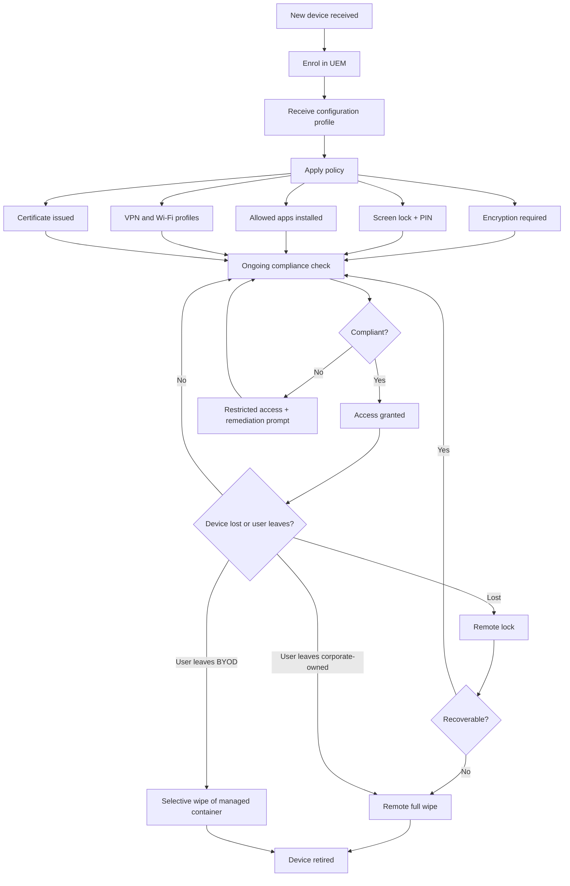

# Mobile Device Security

## Why this matters

A modern enterprise walks out of the building every evening. Laptops, phones, tablets, and smartwatches carry calendar entries, customer records, engineering drawings, privileged credentials, and second-factor tokens onto public transport, into coffee shops, through airports, and home. Unlike a desktop bolted to a desk inside a physical perimeter, a mobile device is at risk of loss or theft every minute it is powered on, and is exposed to radio attackers, malicious app stores, hostile charging ports, and captive-portal Wi-Fi networks the corporate firewall will never see.

That changes the security model in three concrete ways. First, the device itself is the perimeter — if an attacker gains physical possession of an unlocked phone, the badge reader, firewall, and SOC contribute nothing. Second, the radios on the device (cellular, Wi-Fi, Bluetooth, NFC) are all simultaneously active attack surfaces, and most of them are on by default. Third, the user is both the operator and the adversary in some sense: the same person who needs to open an expense report on the train also wants to install a flashlight app from a third-party store, jailbreak the device to customise the lock screen, or sideload a game. Mobile security has to make the secure path the easy path.

This lesson covers the radio and connection attack surface (Wi-Fi, Bluetooth, NFC, infrared, USB, GPS, RFID), the authentication controls the device itself can enforce (PINs, biometrics, context-aware factors, push notifications), the management platforms that enforce enterprise policy at scale (MDM, UEM, MAM), on-device data protection (full-device encryption, containerization, storage segmentation, MicroSD HSMs), tampering and integrity threats (rooting, jailbreaking, sideloading, custom firmware, carrier unlocking, SEAndroid), the peripheral and communication controls a policy must address (camera, microphone, SMS/MMS/RCS, Wi-Fi Direct, tethering, hotspot, USB OTG, GPS tagging, mobile payment), and the deployment models an organisation chooses between (BYOD, COPE, CYOD, corporate-owned, VDI). Examples use the fictional `example.local` organisation and the `EXAMPLE\` domain.

## Core concepts

Mobile security is layered like wireless security is layered. At the bottom are the radios, which define the reachable attack surface. Above them sit the operating system's trust model (code signing, sandboxing, mandatory access control) and the device's hardware security primitives (secure enclave, trusted execution environment, MicroSD HSM). Above that, an enterprise management platform (MDM/UEM/MAM) projects corporate policy onto the device. The user's choices — passcode strength, biometric enrolment, which apps they install, which networks they join — determine whether those layers actually operate as intended.

### Radio and connection attack surface

A smartphone exposes a bouquet of radios. Each one is a potential channel for data exfiltration, malware delivery, or surveillance, and each one has its own protocol, range profile, and historical catalogue of attacks.

**Wi-Fi** uses the 2.4 GHz and 5 GHz bands governed by the Wi-Fi Alliance. A mobile device associates with access points owned by the enterprise, by the user's home network, by whatever coffee shop or airport or hotel the user passes through, and by any attacker running a rogue AP within range. The wireless-security lesson covers the protocol layer in depth; on mobile, the critical controls are strict server-certificate validation for WPA2/WPA3-Enterprise profiles, disabling auto-join for unknown open networks, and preferring enterprise-managed profiles delivered via MDM over user-entered configurations.

**Bluetooth** is a short-to-medium range wireless protocol at 2.4 GHz, originally designed for personal area networks at around 10 metres but now stretched via high-gain antennas and newer versions out to several hundred metres or, in some outdoor applications, kilometres. Bluetooth pairing establishes a trust relationship between two devices using a passkey. Historical weaknesses — default passkeys, discoverable mode left on, bluejacking, bluesnarfing, BlueBorne — are mostly mitigated in modern stacks, but the safe defaults still apply: discoverable mode off unless actively pairing, passkeys entered on both devices rather than relying on a factory default, pairings reviewed and purged periodically, and Bluetooth disabled entirely in very high-threat environments.

**NFC (Near Field Communication)** is a very short range radio standard — around 10 cm or less — used today primarily for contactless payment and transit cards. Its short range is its main defence. An attacker has to be close enough that the user would notice, although skimming through a pocket is still feasible with a purpose-built reader. NFC traffic itself is not cryptographically protected at the protocol level; the applications that run on top (Apple Pay, Google Pay, transit applets) add their own authentication and tokenisation. Relay attacks, where two radios between an attacker's device and the victim's tag extend the effective range, are the main practical threat.

**Infrared (IR)** remains on some devices as a remote-control transmitter and in some specialised healthcare and industrial equipment. IR cannot penetrate walls, its range is short, and there is no encryption in the base protocol — any application requiring confidentiality over IR has to layer it on. Modern handsets have mostly dropped IR in favour of Bluetooth or Wi-Fi Direct for the same use cases.

**USB** is the physical cable interface. Mobile devices charge and transfer data over the same connector (Lightning, USB-C, micro-USB on older Android), which means every charging port is a potential data port. Malicious USB chargers ("juice jacking"), BadUSB devices that impersonate keyboards, and forensic tools that exploit unlocked devices are all real attacks. Controls include USB Restricted Mode (iOS) that blocks data transfer when the device has been locked for over an hour, requiring explicit authorisation ("Trust this computer?") on first connection, and avoiding public charging ports in favour of the user's own charger or a USB data blocker.

**GPS (Global Positioning System)** is a receive-only radio — satellites transmit highly precise time signals and the receiver computes its position. GPS itself has no authentication, so GPS spoofing (transmitting counterfeit satellite signals) can trick a device into reporting the wrong location. In most commercial environments this is not a primary threat; in high-risk environments (government, critical infrastructure) anti-spoofing receivers or cross-checks against cellular triangulation and Wi-Fi geolocation matter.

**RFID (Radio Frequency Identification)** tags sit in badges, inventory labels, some smart cards, and embedded systems. Tags are active (battery-powered) or passive (drawing power from the reader's RF energy). Range runs from centimetres to a few hundred metres depending on type. Because RFID is the identification medium for building-access cards in many enterprises, RFID security is building-security.

Several attack classes apply to RFID:

- **Attacks on the tag and reader chips themselves** — physical tampering, side-channel analysis, power-glitching.
- **Attacks on the communication channel** — eavesdropping with a software-defined radio, replay attacks capturing a legitimate exchange and replaying it later, man-in-the-middle by combining eavesdropping with spoofed responses.
- **Attacks on the back-end reader and database** — the usual IT attack surface of web, database, and API endpoints the reader communicates with.
- **Cloning** — if the tag does not use cryptographic challenge-response, an eavesdropped exchange is sufficient to produce a counterfeit tag.

ISO/IEC 18000 and ISO/IEC 29167 specify cryptographic primitives for RFID confidentiality, tag and reader mutual authentication, untraceability, and over-the-air privacy; ISO/IEC 20248 adds a digital-signature data structure. Modern building-access cards that use these standards resist cloning; older low-frequency 125 kHz proximity cards (HID Prox, EM4100) generally do not and are cloned routinely in red-team engagements.

**Point-to-point and point-to-multipoint** are communication-topology terms that apply across several of these radios. Point-to-point means one transmitter speaking to exactly one receiver — Bluetooth pairing and a USB cable both fit this model. Point-to-multipoint means one transmitter broadcasting to multiple receivers — Wi-Fi beacon frames and NFC tag reads by any nearby reader fit this model. The distinction matters because broadcast-mode traffic has a larger observable attack surface by definition.

### Authentication on mobile

Every layer of mobile security depends on getting authentication right at the device level. An unlocked device hands the attacker everything — email, messaging apps, saved passwords in the browser, single-sign-on tokens, the second factor for the user's other accounts.

**Passwords and PINs** are the baseline. Corporate policy should enforce minimum length, complexity, and rotation consistent with the rest of the password policy. A trivial four-digit PIN on a device that stores `EXAMPLE\` email is not acceptable; six digits minimum, eight preferred, and an alphanumeric passphrase for high-risk roles. Gesture-based unlock patterns (swipe-the-dots on Android) are convenient but leak their shape through the oil smudge on the screen surface; an attacker who sees the device at the right angle can recover the pattern visually.

**Biometrics** — fingerprint, face recognition, iris — are a convenience feature layered on top of a PIN or passphrase. Modern implementations (Apple's Secure Enclave, Android's StrongBox-backed biometric) are vastly better than early-generation sensors, but researchers and security conferences regularly demonstrate bypasses with lifted fingerprints, 3D-printed masks, and identical-twin impersonation. Biometrics make the device convenient enough that users accept strong underlying PINs. Biometrics should never be the only factor for high-value transactions; they should unlock the device, and a separate PIN or passphrase should gate things like payment authorisation or enterprise app login.

**Context-aware authentication** uses metadata about the authentication attempt to decide whether to trust it — who the user is, what resource they are requesting, which device they are on, which network they are on, which geographic location they are in, what time it is, whether the device has recently been compromised. A context-aware policy might allow a user on an enrolled corporate device inside the office to access SharePoint with a single factor, require MFA if the same user is on public Wi-Fi, and block access entirely if the device has failed a recent compliance check or is in a sanctioned country. Conditional-access engines in Microsoft Entra, Okta, and Google Workspace implement this pattern against the `EXAMPLE\` identity fabric.

**Push notification authentication** delivers a prompt to a trusted device — typically the user's already-enrolled phone — asking them to approve or deny a login. Apple's Apple Push Notification service (APNs) and Google's Firebase Cloud Messaging (formerly Android Cloud to Device Messaging) carry these prompts. Push is strictly stronger than SMS-based MFA because it is not vulnerable to SIM-swap attacks or SS7 interception, but it does have a social-engineering failure mode called "MFA fatigue" — an attacker who has a password triggers repeated push prompts until the user taps Approve to make the noise stop. Number-matching prompts (the user has to type a number shown on the login page into the push prompt) defeat this attack and are now standard in most enterprise MFA platforms.

### MDM, UEM, and MAM

Enterprise mobile security at scale requires a management platform. Three overlapping categories:

**Mobile Device Management (MDM)** is the original category. An MDM agent runs on the device and enforces enterprise policy: required PIN length, encryption on, screen-lock timeout, allowed and blocked apps, Wi-Fi and VPN profiles pushed from the server, certificate provisioning, and remote lock or wipe. Apple's Device Enrolment Program, Google's Android Enterprise, and vendor platforms like Microsoft Intune, Jamf, VMware Workspace ONE, and MobileIron all implement MDM. A well-configured MDM policy should enforce at minimum:

- Device locking with a strong PIN or passphrase.
- Encryption of data on the device (usually on by default on modern iOS and Android, but verified via policy).
- Automatic lock after a period of inactivity — typically 2 to 5 minutes.
- Remote lock capability if the device is reported lost.
- Automatic wipe after a configured number of failed PIN attempts — usually 10.
- Remote wipe capability for lost or stolen devices.

**Unified Endpoint Management (UEM)** extends MDM's scope from phones and tablets to every kind of endpoint — laptops, desktops, wearables, IoT, kiosks. The value proposition is a single console and a single policy framework spanning the whole endpoint estate rather than separate tools for each form factor. Intune, Workspace ONE, Jamf Pro (for Apple), and Ivanti Neurons are the big UEM platforms; modern enterprise deployments are almost always UEM rather than pure-play MDM.

**Mobile Application Management (MAM)** sits alongside MDM/UEM and focuses on the apps rather than the device. MAM distributes, configures, updates, and retires enterprise applications on managed devices, and on some platforms can enforce per-app policies even on unmanaged (BYOD) devices — copy-paste restrictions between corporate and personal apps, per-app VPN, per-app encryption, app-level remote wipe. MAM is the key technology for BYOD models where the employer does not manage the whole device but still needs to protect corporate data inside specific apps.

Across these platforms, a few capabilities appear repeatedly:

- **Enrollment.** A device is brought under management either user-initiated (user installs an agent and authenticates), zero-touch (Apple Business Manager or Android zero-touch provisioning ties the device to the enterprise at purchase time and enrolment happens automatically), or admin-initiated for company-owned devices.
- **Configuration profiles.** The server pushes down a bundle of settings — Wi-Fi, VPN, email accounts, certificate payloads, restrictions — that the OS applies and protects from user tampering.
- **App catalog.** An enterprise-curated list of approved apps, either pushed silently to managed devices or offered through a self-service storefront.
- **Content management.** Rules about which files can be stored on the device, opened in which apps, shared to which services. A document classified `EXAMPLE Internal` might be blocked from being opened in a personal cloud-storage app while being allowed in the managed email client.
- **Remote wipe.** The enterprise can trigger a wipe of the whole device (full factory reset) or a selective wipe that removes only the managed profile and its apps and data, leaving personal content untouched. Selective wipe is the sane default for BYOD; full wipe is fine for corporate-owned. The BYOD dilemma is that full wipe of a lost device also removes the user's personal photos, contacts, and apps, which is why containerisation and selective wipe exist.
- **Compliance checks.** The MDM agent periodically reports posture — OS version, jailbreak status, encryption state, required apps installed, required patches applied. Non-compliant devices can be put into a restricted state (warning banner, limited access) or blocked from enterprise resources entirely through conditional access.
- **Geofencing and geolocation.** Geofencing defines a virtual boundary using GPS or RFID; actions trigger when devices cross it (auto-enable VPN on site, disable camera on manufacturing floor, alert when a tagged asset leaves a building). Geolocation is the act of tracking the device's position, useful for recovering lost devices and for compliance in regulated industries. Both features require careful policy framing because of privacy law.

### Data protection on the device

Once the device is managed, the next question is protecting the data on it against the realistic threat of loss or theft.

**Full device encryption (FDE)** encrypts the entire storage volume with a key that is tied to the device's hardware and the user's unlock credential. Modern iOS has encrypted storage as standard since iPhone 3GS; modern Android has FDE or file-based encryption (FBE) on all devices since Android 10. Policy should verify FDE is active — an MDM compliance check — rather than assume. Regulated environments still sometimes require specific FIPS-validated encryption modules; a commercial-off-the-shelf review may not suffice.

**Containerization** divides the device into separate execution domains, typically one for work and one for personal. Each container has its own apps, data, and encryption; apps in the work container cannot read data in the personal container or vice versa, and the MDM can remotely control (including selectively wipe) the work container without touching the personal side. Samsung Knox, Android Work Profiles (Android Enterprise), and iOS User Enrolment implement variants of this pattern. Containerisation is the technical basis for BYOD that does not destroy the user's personal data on offboarding — wipe the work container, leave the rest alone.

**Storage segmentation** is a related concept: the logical separation of personal and corporate data within the device's storage, even if not full-blown container isolation. Enterprise apps write to enterprise-tagged storage areas; policy restricts movement of data out of those areas.

**MicroSD Hardware Security Module (HSM)** is a hardware security module in a MicroSD form factor. It provides a portable secure element for cryptographic keys — signing keys, PKI private keys, key-backup tokens — that resists extraction even if the host device is compromised. The card pairs with an app that performs the typical HSM operations: key generation, backup, restore, signing. MicroSD HSMs are niche — most users rely on the device's built-in secure enclave — but they show up in high-assurance roles where keys need to move between devices or survive a device wipe.

### Tampering and integrity

The OS-enforced trust model on iOS and Android is the foundation on which everything else rests. When a user (or an attacker) defeats that model, the security story collapses. Several specific threats:

**Rooting** is the Android term for escalating to superuser privilege, bypassing the OS-imposed restrictions on what apps and the user can do. A rooted device can read any file, modify system settings, install kernel modules, and disable security features at will. Users root devices for legitimate reasons — custom ROMs, removing carrier bloatware — but the security controls the enterprise relies on (app sandboxing, encryption key protection, MDM policy enforcement) can be undermined by a sufficiently motivated rooted user.

**Jailbreaking** is the iOS equivalent. Apple's App Store gatekeeping, code-signing requirements, and sandbox are bypassed; apps can run unsigned and with elevated privileges. A jailbroken iPhone is no longer the same trust environment as a stock iPhone, and iOS MDM controls can be circumvented on a jailbroken device. Jailbreaking voids the Apple warranty and blocks App Store access.

In both cases, MDM platforms detect root/jailbreak by looking for tell-tale files, services, SELinux state, and code-execution capabilities that should not be present on a stock device. Detection is an arms race — sophisticated rooters hide their tracks — but for the common-case adversary, detection catches most rooted devices. Policy typically blocks rooted or jailbroken devices from enterprise resources entirely.

**Sideloading** is the installation of apps outside the vendor's official store. On Android, sideloading is a built-in feature (enable "Install unknown apps" and install an APK from any source); on iOS, sideloading requires developer certificates, enterprise provisioning profiles, or jailbreaking, though the EU's Digital Markets Act is prompting wider support. Sideloaded apps bypass the store's malware review, so the user is trusting whoever provided the APK. Enterprise policy via MDM typically disables the "install unknown apps" permission for all apps that are not the enterprise app catalog itself.

**Custom firmware** is an alternative ROM or operating system image flashed onto the device, replacing the vendor firmware. LineageOS and GrapheneOS are well-known Android examples. Custom firmware can improve privacy and remove vendor bloatware, but it also bypasses vendor security testing, may omit or disable hardware security features, and is not trusted by most MDM platforms. For corporate-owned devices, custom firmware should be prohibited; for BYOD, it may be allowed if the MAM enforces sufficient app-level controls independently.

**Carrier unlocking** is the process of removing the carrier lock from a device so it accepts SIMs from any carrier. Historically a grey area, it is now explicitly legal in most jurisdictions after a reasonable ownership period. Unlocking itself is not a security issue; the technical process of unlocking sometimes involves unsigned firmware or debug interfaces that are, so the security-relevant question is how the unlock was performed, not that it was.

**Firmware OTA (over-the-air) updates** deliver patches to the device without cables or a trip to the vendor. OS vendors sign firmware images and the device verifies the signature before installation; this is the primary defence against an attacker distributing malicious firmware. Users should enable automatic OTA updates wherever possible, and MDM policy should verify that devices are running supported OS versions. Carrier-driven OTA delays are a chronic Android problem; Android enterprise programmes increasingly bypass the carrier to deliver updates directly.

**SEAndroid (Security Enhanced Android)** is the Android port of SELinux, providing mandatory access control (MAC) over every process on the device — even processes running as root. SEAndroid enforces a default-deny policy: anything not explicitly allowed by policy is denied. This is a significant defence-in-depth layer on top of the standard Android sandbox because even a successful privilege escalation to root leaves the attacker constrained by the SEAndroid policy. SEAndroid is not user-facing; it runs silently in the kernel and policy files. A rooted device with SEAndroid disabled or set to permissive is a considerably bigger concern than one with SEAndroid still enforcing.

**Enforcement and monitoring** is the operational layer that makes all of the above actually work. Policies must be consistent with the rest of the security policy. Training must cover mobile. Disciplinary action for violation must be consistent. The monitoring programme must actually watch for the conditions — non-compliant devices in the MDM console, unusual geographic access patterns, sudden changes in device posture — and produce tickets that get worked. A mobile security programme that issues policy but never audits it is security theatre.

**Third-party application stores** are a recurring source of malware on Android. The Apple App Store is strict enough that malware on iOS is rare in practice; Google Play is less strict and has repeatedly hosted malware that reached millions of installs before removal; third-party stores (those not run by Apple or Google) range from reasonably curated to outright malicious. Enterprise policy for managed devices should restrict app installation to the approved store and the enterprise app catalog.

### Peripheral and communication controls

A phone has microphones, cameras, storage, and communication channels that are useful and simultaneously are data exfiltration channels.

**Cameras** on mobile devices are always-on in a practical sense and can photograph whiteboards, documents, screens, and facility layouts. GPS tagging (geo-tagging) embeds the capture location in the photo metadata; if the device is not configured to strip this, a photo uploaded to the public internet leaks the user's location. Policy for camera use should address facilities where photography is forbidden, marking of sensitive areas, and whether MDM enforces no-camera zones via geofencing.

**Microphones** can record audio continuously and without obvious indicator. Apps that request microphone permission get it until revoked; a malicious app with microphone permission is a live surveillance device. Policy should default-deny microphone permission for apps that do not require it, enable the OS-level microphone indicator, and address meeting-room policy for audio-capable devices.

**SMS, MMS, and RCS** are the cellular-network messaging protocols. SMS carries short text over the signalling path and has been the mobile messaging standard since the 1980s; MMS carries multimedia content; RCS (Rich Communication Services) is the modern carrier-grade replacement supporting groups, read receipts, media, and encryption. Security implications: SMS is sent in the clear over the signalling network and is readable by the carrier and by any adversary with SS7 access; phishing via SMS (smishing) bypasses corporate email filters; MMS has historically had parser vulnerabilities (Stagefright on Android) that allowed remote code execution on receipt. RCS closes some of the SMS gaps, but only when both endpoints and both carriers support it. Enterprise messaging should use end-to-end encrypted clients (Signal, enterprise-managed Teams/Slack) rather than SMS for anything sensitive.

**Wi-Fi Direct** is a peer-to-peer Wi-Fi connection between two devices without an access point — one device acts as AP for the other. It uses WPA2 for encryption and supports service discovery so devices advertise capabilities before pairing (used by AirDrop, miracast, some printers). Enterprise concern: Wi-Fi Direct creates an ad-hoc connection that may not be visible to the enterprise network monitoring, and an attacker nearby can sometimes trick a device into connecting if service discovery is left open. Disable on sensitive devices.

**Tethering** is connecting one device to another so the first can share its network access. The classic case is a phone sharing its cellular data with a laptop. Tethering adds a new external network connection that the enterprise may not be monitoring — a laptop tethered over cellular bypasses the corporate proxy and DLP. Policy on managed laptops often disables tethering or requires a VPN terminator that is always active.

**Hotspot** is the same concept from the other direction — the device runs as an access point for other devices. A user who turns on their phone's hotspot to give their laptop internet access has the same monitoring gap.

**USB On-The-Go (USB OTG)** extends USB so a mobile device can act as either host or peripheral. An OTG cable lets a phone read a USB flash drive, attach a keyboard, or charge another device. Security implications: OTG is a data-exfiltration path to storage the enterprise cannot see and a data-ingress path for malicious USB devices. MDM on managed devices can disable USB OTG or restrict it to specific peripheral classes.

**External media** — flash drives, external hard drives, music players, smart watches — are all pathways for data in and out of the device. Policy should define where external media is permitted and where it is banned, and monitoring should audit actual usage.

**GPS tagging** embeds the capture location in photos and videos. CompTIA calls this GPS tagging; the rest of the world calls it geo-tagging. Posting a geo-tagged photo of a car in a driveway to an online marketplace publishes the home address. Policy should default-disable geo-tagging for most users and enable it only for specific use cases.

**Mobile payment** — Apple Pay, Google Pay, Samsung Pay — uses NFC to transmit a tokenised credit or debit card number to a payment terminal. The actual card number never leaves the device; what goes over NFC is a one-time token that is useless outside that specific transaction. Biometric or PIN authentication is required on the device before the NFC transmission. This stack is substantially more secure than a physical card, which broadcasts the real number over NFC and through the magstripe.

### Enterprise deployment models

How an organisation incorporates mobile devices is a trade-off between user preference (single device, familiar choice, their own OS version), corporate control (stringent policy, guaranteed compliance, centralised inventory), and cost (corporate pays versus user brings).

**Bring Your Own Device (BYOD)** has employees using their personal devices for work. Advantages: users prefer to carry one device and one they already know; cost of device hardware shifts to the user; faster onboarding for temporary workers. Disadvantages: users resist enterprise restrictions on their personal device; corporate control is limited; selective-wipe technology is required for offboarding; legal and privacy issues around what the employer can see on a personal device. BYOD is popular in small firms and organisations with many temporary workers.

**Corporate-Owned, Personally Enabled (COPE)** has the organisation providing the device, paying for it, and permitting the employee to use it for personal activities. The organisation controls security posture while giving the employee a reasonable user experience. COPE is the compromise sweet spot for most mid-size enterprises — the organisation gets to pick approved devices, enrol them, enforce policy, and wipe them on exit, while the employee does not have to carry two phones.

**Choose Your Own Device (CYOD)** gives the user a choice from an approved list. The device is organisation-owned; the user picks from (for example) three iPhone models and two Android models that the UEM supports. CYOD is common in larger enterprises where supporting a limitless matrix of device models would break the support team.

**Corporate-Owned, Business Only (COBO)** has the organisation provide devices that are used only for work. The employee may carry a separate personal device or not. This model gives the corporation complete control and is appropriate for regulated, high-risk, or classified environments; the downside is user dissatisfaction (two phones) and cost (the organisation pays for both phones directly or indirectly).

**Virtual Desktop Infrastructure (VDI)** sidesteps the mobile-security problem by putting the computing back in a controlled datacentre. The user's device becomes a window onto a virtual desktop hosted by the enterprise, running in a secure environment the IT team controls fully. VDI is especially useful for laptops — a contractor with a personal laptop accesses the enterprise through a VDI client, and no enterprise data ever persists on the contractor's machine. VDI requires substantial IT investment in the datacentre side and a good network connection at the endpoint; its security story is excellent when those are present.

The trade-off matrix at a glance:

| Model | Device owner | User freedom | Corporate control | Cost to employer |
|-------|--------------|---------------|---------------------|------------------|
| BYOD | Employee | High | Low (MAM only) | Low |
| CYOD | Employer | Medium (choice within list) | High | Medium |
| COPE | Employer | Medium-high (personal use allowed) | High | Medium-high |
| COBO | Employer | Low (work use only) | Very high | High |
| VDI | Either | Device: varies; VDI: low | Very high (inside VDI) | High (datacentre) |

## Enrollment and MDM lifecycle diagram

The diagram below traces the lifecycle of a managed mobile device from enrolment through routine compliance to eventual wipe.

The key transitions:

- **Enrolment** can be user-initiated, zero-touch (Apple Business Manager, Android zero-touch), or admin-initiated for staging.
- **Configuration profile** carries Wi-Fi, VPN, email, certificate, and restriction payloads signed by the UEM.
- **Compliance check** runs periodically — typically every few hours — and reports posture back to the UEM.
- **Conditional access** ties compliance status to resource access through the identity provider; a non-compliant device is denied SharePoint, Exchange, and sensitive apps until remediated.
- **Remote wipe** has two flavours: selective (wipe only the managed container, leave personal alone) for BYOD, and full (factory reset the whole device) for corporate-owned or lost devices where selective is not enough.

## Hands-on / practice

Five exercises that work in a controlled lab with a real MDM/UEM platform (Intune, Jamf, or Workspace ONE) and test devices you own or are authorised to manage.

### 1. Deploy an MDM configuration profile

In Intune (or equivalent), create a device compliance policy for iOS and Android with the following requirements: minimum OS version, encryption required, minimum 6-digit PIN, screen lock after 5 minutes, maximum failed attempts 10 before wipe, jailbreak/root detection enabled, and a banned-app list including at least two commonly-misused utilities. Assign the policy to a test device group containing one iOS and one Android device.

Answer: How long does it take for a newly-enrolled device to receive the policy? What does the user see when the device becomes non-compliant (wrong PIN length, for example)? What happens when the device is forcibly rooted or jailbroken — does the UEM report it, how long does the detection take, and what conditional-access action fires? Capture screenshots of the compliance console showing both a compliant and a non-compliant device.

### 2. Enforce geofencing

Configure a geofence around the lab (or a test office) using the UEM's location services. Create a policy that disables the camera inside the fence and enables it outside. Carry the test device across the boundary and verify the policy applies.

Answer: How does the UEM determine the device location — GPS, Wi-Fi, cellular, or a combination? What is the latency between crossing the fence and the policy taking effect? What does the user see? What privacy implications does the geofencing have for BYOD devices, and how does the UEM communicate this to users? Document the consent language the UEM shows on enrolment.

### 3. Enable and test remote wipe

In the UEM console, trigger a remote-lock and then a selective remote wipe on a test device enrolled in BYOD mode. Repeat with a test device enrolled in corporate-owned mode and trigger a full wipe.

Answer: What is the time between clicking wipe in the console and the device actually wiping? What data is removed in the selective wipe — apps, profiles, certificates, email, cached files — and what remains? What happens if the device is offline at the time of the wipe request? What happens when the device comes back online? Does the wipe ticket persist, and if so, for how long?

### 4. Test a jailbreak detection rule

Use a test Android device. Install a rooting tool (Magisk is the usual starting point — use a dedicated device, not your daily driver). Observe whether the UEM detects the root within its compliance check interval. Then use root-hiding modules to attempt to evade detection. Re-check compliance.

Answer: Which files, processes, and system properties does the UEM check to detect root? How quickly does detection fire? What evasion techniques defeat the UEM's checks, and what does the UEM vendor say about its detection guarantees? What conditional-access action triggers on the non-compliance — block all access, block only sensitive resources, send an alert, or just log? Document the evasion techniques and any additional attestation mechanisms (Google Play Integrity, Apple DeviceCheck) the UEM uses.

### 5. Design a BYOD policy

Write a two-page BYOD policy for `example.local`. It must cover: which devices and OS versions are permitted; what the user consents to (camera, location, enterprise wipe of managed container); what data the enterprise can and cannot see on a BYOD device; required security posture (PIN, encryption, OS version); app-level controls (MAM policies, containerisation); the selective-wipe process on offboarding; the user's recourse if a selective wipe accidentally removes personal data; and jurisdiction-specific privacy considerations (GDPR in Europe, CCPA in California, local employment law).

Answer: Which stakeholders need to sign off the policy? Which pieces of the policy are enforceable in the UEM versus contractual only? What training or attestation is required from the user at enrolment? What exception process exists for users who cannot meet the policy (old OS, missing hardware security)? Produce the policy document, a one-page user-facing summary, and a checklist the enrolment engineer uses to confirm everything is in place before a BYOD device is allowed near enterprise resources.

## Worked example — `example.local` rolls out UEM for 800 mixed iOS/Android devices

`example.local` is a 1,200-person professional-services firm. The CIO has approved a 12-month mobile-security programme to replace a legacy Exchange ActiveSync-only deployment with a modern UEM covering 800 mobile devices (phones and tablets) plus 900 laptops. The mobile fleet today is roughly 55% iOS and 45% Android, split across five generations of hardware. About 60% of the users want to bring their personal phone (BYOD); 40% accept a corporate-provided device (COPE). The CISO's requirements: mandatory encryption, MFA-backed access to Microsoft 365 and Salesforce, remote wipe capability, jailbreak/root detection, and a credible story for auditors on how corporate data is separated from personal data on BYOD devices.

**Platform selection.** After an RFP the team chooses Microsoft Intune, already in use for laptop management, and extends it to mobile. Apple Business Manager is configured to auto-enrol every new corporate-owned iPhone; Android Enterprise is configured for managed Google Play, with Work Profile (BYOD) and Fully Managed (COPE) deployment modes. Identity is `EXAMPLE\` Azure AD; the RADIUS certificate authority (`EXAMPLE-WIFI-CA`) issues EAP-TLS certificates to corporate-owned devices for Wi-Fi; a separate device-trust certificate is issued to both BYOD and corporate devices for conditional access.

**Policy baseline.** Compliance policies are authored for each of four device classes: corporate iOS, corporate Android, BYOD iOS (Work Profile or User Enrolment depending on model), BYOD Android (Work Profile). Common requirements across all four: minimum supported OS version (iOS 17+, Android 13+, adjusted yearly), encryption required, 6-digit PIN minimum (8 for corporate-owned), screen lock after 5 minutes, maximum 10 failed PIN attempts before wipe, jailbreak/root detection on, SafetyNet/Play Integrity attestation required on Android, TouchID/FaceID or fingerprint biometric allowed as unlock convenience over the PIN. Corporate-owned devices additionally block USB OTG, require `EXAMPLE\` managed Wi-Fi and VPN profiles, and block third-party app stores. BYOD devices allow personal apps without restriction but apply per-app policies to the managed work apps.

**App catalog and MAM policies.** The corporate catalog includes Outlook, Teams, OneDrive, SharePoint mobile, Salesforce Mobile, the internal expense-and-time-tracking app (published through Intune App Wrapping), and a handful of approved productivity tools. MAM policies on the Microsoft 365 apps enforce: encryption of app data, no copy/paste from managed to unmanaged apps, block printing to unmanaged printers, enforce Outlook as the only managed email client, no save-as to personal cloud storage, app-level PIN separate from device PIN, and automatic wipe of app data after 30 days offline.

**Containerisation.** On BYOD Android, Work Profile cleanly separates work apps and data from personal. On BYOD iPhone with User Enrolment, the OS creates a managed APFS volume for work data, separated from personal at the filesystem level. Both models support selective wipe on offboarding: when the user leaves the company or reports the device lost, Intune wipes the work container and leaves personal data untouched. This is the single most important technical control for BYOD; without it the BYOD programme would be legally and operationally untenable.

**Conditional access.** Azure AD conditional-access policies tie device compliance to resource access. A non-compliant device is denied access to Microsoft 365, Salesforce, and internal SharePoint until remediated. A device in a sanctioned country (export controls) is blocked for sensitive data. MFA is required from any location; passwordless authentication with Microsoft Authenticator push (with number matching) is the preferred second factor. SMS-based MFA is disabled.

**Remote wipe and incident response.** The service desk has a documented runbook: lost device reported -> confirm identity -> remote-lock via Intune -> if not recovered in 24 hours, selective wipe for BYOD or full wipe for corporate-owned -> ticket to the SOC to review any access from the device in the window between loss and wipe. Lost-device call volume is expected around 3-5 per month at this size.

**Jailbreak and root.** Intune's built-in jailbreak and root detection, augmented by Play Integrity attestation on Android and DeviceCheck on iOS, flags tampered devices. Policy is strict: a device that fails attestation is blocked from all corporate resources. Users who insist on rooted Android phones or jailbroken iPhones are explicitly excluded from the programme and must use a loaner.

**Cellular and messaging.** Corporate SMS is not used for anything sensitive. RCS is allowed for consumer-to-consumer messaging but not for business. Any business-critical messaging goes through Teams, with audit and retention policies applied.

**User experience.** The programme publishes a user handbook explaining what Intune sees and does not see on BYOD devices (it sees managed apps and managed container; it does not see SMS, personal photos, personal apps, call history, or location outside of geofence policy). Enrolment is a self-service process via the Company Portal app, taking around 15 minutes per device. The IT help desk has a dedicated queue for mobile issues for the first three months of rollout, then folds back into general support.

**Rollout waves.** IT enrols first (wave 1, 50 devices), then each business unit over six weeks (waves 2-6). Wave 1 catches three problems — an obscure Samsung model that would not accept the Work Profile, an Outlook MAM policy that broke calendar federation with a partner, and a Wi-Fi profile typo that pointed to the wrong RADIUS — all fixed before the rollout expands. After the full 800-device rollout is complete, the legacy ActiveSync access is disabled.

**Compliance reporting.** Monthly reports to the CISO and quarterly reports to the audit committee show the percentage of managed devices meeting each compliance policy, the number of incidents (lost/stolen), remediation times, and exception status. The programme's target is >97% compliance across the fleet within six months of rollout; actual numbers are tracked against that target.

**Audit evidence.** When the SOC 2 auditor arrives, the evidence pack includes: Intune policy exports, conditional-access policy exports, device enrolment counts, compliance reports from the past 12 months, remote-wipe incident log, user acceptance of the BYOD policy (via Microsoft 365 attestation), and sample device screenshots showing applied policies. The auditor accepts this as sufficient for the mobile-device control objective.

The programme is, again, not innovative. It is Intune with Apple Business Manager and Android Enterprise deployed carefully against a clear policy, with containerisation doing the heavy lifting on BYOD and conditional access cutting off the non-compliant tail. That is enough to take mobile from "unmanaged liability" to "documented and audited control".

## Troubleshooting and pitfalls

- **BYOD enrolment refused by user.** Users resist MDM on personal devices out of privacy concern. Publish clearly what the UEM can and cannot see, offer a loaner as an alternative to BYOD, and be prepared to lose a percentage of users to COPE. A BYOD programme that refuses to address the privacy question fails.
- **Jailbreak/root detection bypassed.** Detection is an arms race. Supplement UEM-native detection with attestation services (Play Integrity on Android, DeviceCheck on iOS). Accept that a determined attacker can hide a rooted device from many detection methods; use compensating controls.
- **Outdated OS versions.** Older phones stop receiving security updates after a vendor-defined window — typically 3 years for Android, 5 to 7 for iOS. Policy must require a supported OS version and the UEM must enforce it; otherwise the fleet accumulates unpatched devices.
- **Carrier-imposed update delays.** Android updates are frequently delayed by the carrier's testing cycle. Android Enterprise bypasses carriers for enrolled devices where possible; prefer devices in the Android Enterprise Recommended programme or deployed via zero-touch.
- **Selective wipe leaks.** A selective wipe that misses a managed app (because the app was offline for longer than the policy window) leaves corporate data on the device. MAM app-level policy must include a maximum offline period after which the app wipes itself locally.
- **Geofencing as the only control.** Geofencing helps, but devices leave the fence. The device and its data travel; the policies that protect them must work outside the fence too. Do not make geofencing the sole control on any sensitive data class.
- **Weak PINs despite policy.** Users pick the minimum-compliant PIN, which is still weak. Enforce minimum length appropriate to the data classification. For high-risk roles require a passphrase rather than a PIN.
- **Biometric-only authentication for high-value transactions.** A device-unlock biometric should not be the only factor approving a wire transfer or a credential change. Add a step-up authentication (PIN re-entry, push confirmation) for high-value operations.
- **SMS-based MFA.** SMS is vulnerable to SIM-swap and SS7 interception. Replace with push-based MFA (with number matching to defeat MFA fatigue), TOTP, or FIDO2 hardware tokens wherever possible.
- **Third-party app stores on managed devices.** Most malware on Android reaches users through sideloading or unofficial stores. Disable unknown-sources installation on corporate-owned devices; on BYOD devices, MAM must protect corporate data regardless of what else the user installs.
- **USB OTG and removable media on sensitive devices.** An attacker with a USB OTG cable and a few minutes can exfiltrate a lot. Disable USB data transfer, restrict OTG, and configure iOS USB Restricted Mode.
- **Public charging and juice-jacking.** Public USB charging ports can exfiltrate data from unlocked devices. Policy should discourage them; user training should explain why. USB data blockers ("USB condoms") are a cheap mitigation for travellers.
- **Bluetooth left discoverable.** A phone left in discoverable mode is a target for opportunistic pairing attempts. Discoverable should be on only during active pairing, and Bluetooth pairings should be reviewed and purged periodically.
- **Camera and microphone permission creep.** Apps accumulate permissions over time. Periodically audit which apps have microphone, camera, contacts, and location access, and revoke permissions that are no longer justified.
- **Cloud backup of MDM-managed data to personal accounts.** A user with iCloud Backup enabled on a personal Apple ID could back up managed data to a personal cloud, defeating selective wipe. MAM policy must block backups to personal accounts for managed apps.
- **Mixed personal and corporate contacts.** Contacts synced from corporate Exchange to a personal phone become accessible to any personal app with contact-list permission. Containerisation and per-app policies fix this; unmanaged ActiveSync does not.
- **MDM agent killed by the user.** On rooted Android, a user can kill the MDM agent. Use tamper detection, report a "device not checked in" condition, and block access after a short grace window.
- **Stale certificates.** EAP-TLS and certificate-based VPNs require valid, unexpired, non-revoked certificates. UEM-managed certificate renewal handles this automatically; manual processes drift and cause outages.
- **VPN always-on mis-scoped.** Always-on VPN is essential for unmanaged Wi-Fi but can break split-tunnel scenarios (internal networks, captive portals). Test the always-on VPN behaviour in each of the realistic network scenarios the fleet encounters.
- **Compliance grace periods too long.** A 14-day grace period between non-compliance and blocked access gives an attacker two weeks on a non-compliant device. Grace periods should balance user-friction against risk; 24 to 72 hours is more defensible for most policies.
- **Retired devices still enrolled.** When a device is decommissioned or sold, it must be removed from the UEM and wiped. Otherwise a second-hand buyer gets an enrolment record and possibly access.
- **GPS tagging left enabled.** Users post geo-tagged photos online and leak location. Default-disable geo-tagging on managed devices and provide a training nudge.
- **Corporate-owned devices used for personal after hours.** COPE allows this by design but creates content-classification ambiguity. Policy should be clear: personal use is permitted but the device remains corporate property and subject to corporate monitoring.
- **Contractor devices unmanaged.** Contractors often bring their own laptop and phone. If they access corporate resources, the access must go through VDI, a managed workspace app, or an enrolment profile appropriate to the relationship. Unmanaged contractor devices are the source of a recurring class of incidents.
- **Lack of SIEM integration.** UEM compliance events — jailbreak detection, policy violation, remote wipe — are high-signal. They should flow to the SIEM for correlation with other security telemetry.
- **BYOD without legal review.** The legal terms of a BYOD programme — what the employer can access, how wipes are handled, jurisdiction-specific privacy law — must be reviewed by legal and HR before rollout. Skipping this step produces lawsuits and wipes that cannot be executed.

## Key takeaways

- Mobile devices carry enterprise data everywhere the employee goes, so the device itself is the perimeter and physical loss or theft is a first-class threat.
- Each radio (Wi-Fi, Bluetooth, NFC, infrared, USB, GPS, RFID) has its own attack surface; defaults should be conservative and the whole stack should be auditable.
- RFID attacks span the tag, the communication channel, and the back-end reader/database; ISO/IEC 18000, 29167, and 20248 specify cryptographic protections, and older unprotected prox cards are trivially cloned.
- Device authentication stacks PIN/passphrase at the bottom, biometric as a convenience above, and context-aware factors at the top. Push notifications with number matching are the strongest MFA factor for most users.
- MDM, UEM, and MAM are overlapping enterprise management categories. UEM spans the whole endpoint estate; MAM focuses on app-level controls and is essential for BYOD.
- Full device encryption, containerisation, storage segmentation, and MicroSD HSMs together protect on-device data. Modern iOS and Android have FDE by default; policy must verify it rather than assume.
- Rooting, jailbreaking, sideloading, and custom firmware break the OS trust model and disqualify devices from enterprise access. Attestation services (Play Integrity, DeviceCheck) supplement UEM detection.
- SEAndroid enforces mandatory access control on Android; it is a defence-in-depth layer beneath the app sandbox that constrains even rooted processes.
- Peripheral controls — camera, microphone, USB OTG, GPS tagging, Wi-Fi Direct, tethering, hotspot, external media — are data-exfiltration paths that policy must address.
- Mobile payment (Apple Pay, Google Pay) with tokenised NFC is stronger than physical cards; the card number never leaves the device.
- Deployment models (BYOD, COPE, CYOD, COBO, VDI) trade user preference against corporate control; COPE and CYOD are the common enterprise compromises.
- Selective wipe of a managed container is the single most important BYOD control; it lets the employer remove corporate data without destroying personal data.
- A UEM without enforcement is policy theatre; compliance reports, conditional access, and the incident-response runbook are what make the platform actually operate.

An enterprise that can answer "which devices are enrolled, which OS versions are supported, what the policy says, what happens on loss, how BYOD data is separated, and how we detect tampering" has a mobile security story that holds up to both an audit and a red team. An enterprise that cannot is trusting 800 roaming endpoints to behave.

## Reference images

These illustrations are from the original training deck and complement the lesson content above.

  <figure><figcaption>Slide 1</figcaption></figure>
  <figure><figcaption>Slide 3</figcaption></figure>
  <figure><figcaption>Slide 5</figcaption></figure>
  <figure><figcaption>Slide 10</figcaption></figure>
  <figure><figcaption>Slide 11</figcaption></figure>

## References

- NIST SP 800-124 Rev. 2 — *Guidelines for Managing the Security of Mobile Devices in the Enterprise* — https://csrc.nist.gov/publications/detail/sp/800-124/rev-2/final
- NIST SP 800-164 — *Guidelines on Hardware-Rooted Security in Mobile Devices (Draft)* — https://csrc.nist.gov/publications/detail/sp/800-164/draft
- NIST SP 800-163 Rev. 1 — *Vetting the Security of Mobile Applications* — https://csrc.nist.gov/publications/detail/sp/800-163/rev-1/final
- OWASP Mobile Application Security Verification Standard (MASVS) — https://mas.owasp.org/MASVS/
- OWASP Mobile Security Testing Guide (MSTG) — https://mas.owasp.org/MASTG/
- Apple Platform Security Guide — https://support.apple.com/guide/security/
- Android Enterprise Security Paper — https://www.android.com/enterprise/security/
- Microsoft Intune documentation — https://learn.microsoft.com/mem/intune/
- Google Play Integrity API — https://developer.android.com/google/play/integrity
- ISO/IEC 18000 — *Information technology — Radio frequency identification for item management*
- ISO/IEC 29167 — *Information technology — Automatic identification and data capture techniques — Air interface for security services*
- ISO/IEC 20248 — *Automatic identification and data capture techniques — Data structures — Digital signature data structure*
- Samsung Knox Whitepaper — https://www.samsungknox.com/en/resources
- SEAndroid project page — https://source.android.com/docs/security/features/selinux
- Apple Business Manager — https://support.apple.com/guide/apple-business-manager/
- Android zero-touch enrolment — https://www.android.com/enterprise/management/zero-touch/
