# Physical Security Controls

## Why this matters

A perfectly hardened server stops mattering the moment somebody walks out of the building with its hard drive in a backpack. Every control above the physical layer — EDR, SIEM, least-privilege AD, whole-disk encryption — assumes an attacker cannot get their hands on the metal. Remove that assumption and the whole stack collapses: disks get cloned on a bench, firmware gets flashed, RAM gets dumped with a cold-boot attack, or the adversary simply plugs a rogue device into a spare network jack and pivots inward.

Physical security is the discipline that keeps the assumption honest. It runs from the curb to the inside of the safe and layers controls so that breaking one does not break the rest. A single bollard will not stop a motivated attacker, and a single badge reader certainly will not — but fence, gate, reception, mantrap, badge, camera, guard and locked rack together turn a drive-by attempt into a multi-step operation that makes noise, leaves evidence, and burns time the attacker does not have.

This lesson walks the layers from outside in — perimeter, entry controls, surveillance, personnel, locks and tokens, environmental hazards, sensitive zones — and finishes at the end of the asset lifecycle, where data destruction closes the loop on every byte the organisation ever produced. Examples use the fictional `example.local` data center and the `EXAMPLE\` domain.

## Core concepts

Physical security is a defense-in-depth problem. The goal is not one impenetrable wall, it is a sequence of controls where each layer buys time, generates signal, and makes the next layer's job easier. The layers below follow an attacker from the public road inward to the vault.

### Perimeter — bollards, fencing, lighting

The first job of the perimeter is to make clear where the property starts, deter casual trespass, and defeat vehicle-borne attack. **Bollards** are short, sturdy posts that block a vehicle from reaching a building wall or entry doors while still letting pedestrians pass. They are the controls that stop a rented truck from driving through a lobby. Placement matters more than count — bollards in front of glass facades, near critical plant, and at pedestrian entries where a vehicle could otherwise roll up.

**Barricades** extend the idea with walls, retractable gates, and planters that double as vehicle barriers. Inside a facility, barriers can be as simple as a turnstile separating a lobby from an employee corridor.

**Fencing** is the basic outer ring around owned property. Chain-link is the common default; barbed or razor wire raises the cost of climbing. For higher-security sites, anti-scale fencing uses closely spaced vertical poles that offer no footholds. Fences serve three purposes: mark the legal boundary, slow a climber long enough to be seen, and channel foot traffic toward a controlled gate.

**Lighting** turns every other control into a more effective one. Cameras see better, guards notice anomalies, and would-be intruders know they are visible. Under-lit parking structures, loading docks, and side entries are where incidents happen; well-lit approaches and well-lit interiors around server rooms sharply reduce the space an attacker can work in unobserved.

Placement tip: plan entrances and windows so that security desks have a natural line of sight to every controlled door. A security guard looking at a wall of monitors is one failure mode; a security guard seeing a suspicious approach through the lobby glass is a much better one.

**Perimeter control at a glance:**

| Control | What it stops | What it does not stop | Typical cost scale |
|---|---|---|---|
| Bollards | Vehicle ramming | A person on foot | $$ per bollard, crash-rated costs more |
| Chain-link fence | Casual trespass | A climber with minutes and gloves | $ per linear foot |
| Anti-scale fence | Climbing | Determined cutting through | $$$ per linear foot |
| Barbed / razor wire | Climbing (adds pain + time) | Nothing at ground level | $ extra per fence foot |
| LED perimeter lighting | Nighttime concealment | Day activity; floodlight-blinded cameras | $ per pole, low running cost |
| Vehicle gate with intercom | Uninvited vehicles | Pedestrians; piggybacking cars | $$ per gate, plus reader |

### Entry controls — vestibules, badges, reception, two-person integrity

Once a visitor reaches the building, the next layer controls who actually gets inside.

An **access control vestibule** (historically called a *mantrap*) is two closely spaced doors where the second will not unlock until the first has closed and relocked. The effect is that one person at a time passes through, and tailgating — the single most common physical bypass — becomes obvious. If an intruder rushes the first door, they are trapped between two locked doors in full view of a camera and a guard.

**Badges** are the default identity token inside an office. A picture-ID badge lets any employee distinguish staff from visitors at a glance; colour-coded lanyards and badge backgrounds extend that signal ("red lanyard = visitor, must be escorted"). Modern badges embed **RFID** or contactless smart-card technology so that access-control readers at doors log every pass, tie the pass to a user account, and can be revoked centrally the minute an employee leaves.

**Signage** reinforces the whole entry-control scheme. Restricted-area signs warn outsiders, "authorised personnel only" signs on doors prime staff to challenge strangers, and "emergency exit only — alarm will sound" signs cut accidental bypass. Visual cues like badge colour, lanyard colour, and coloured file folders give everyone the cognitive shortcut to notice when something is out of place. Signage is cheap and improves the behaviour of every other control on this page.

A common `example.local` badge-colour scheme:

| Lanyard / badge | Role | Escort required |
|---|---|---|
| Blue | Full-time employee | No |
| Green | Contractor with multi-month access | No inside authorised floors |
| Yellow | Short-term contractor / auditor | Yes in secure areas |
| Red | Visitor | Yes everywhere past lobby |
| Orange | Vendor delivery / maintenance | Yes in all back-of-house areas |
| White | Temporary / day pass | Yes |

**Reception** is the human layer between the lobby and the working floor. A receptionist logs visitors, issues temporary badges, calls escorts, and acts as the first filter against social-engineering attempts like fake delivery drivers and bogus "IT contractors". In high-security environments the receptionist does not actually open the door — a second person behind the line of sight controls the door so the receptionist cannot be forced to let someone through.

**Two-person integrity / control** formalises that split. For actions with meaningful risk — unlocking a vault, entering a data centre after hours, issuing a privileged credential — two authorised people must each complete a task, and either one refusing aborts the action. It is the physical equivalent of four-eyes approval in change management: no single mistake or coercion is enough.

**Entry-control comparison:**

| Control | Primary bypass it defeats | Attacker cost to defeat | Logging quality |
|---|---|---|---|
| Receptionist only | Random walk-in | Social engineering works | Manual, easy to fake |
| Single badge reader | Unauthorised access | Cloning, lost card | Automatic, per badge |
| Turnstile | Walk-past | Jump-over, shared badge | Per-badge pass |
| Access control vestibule | Tailgating | Coercion, forged badge | Per-person, anti-passback |
| Mantrap + biometric | Badge cloning | Biometric spoof, insider | Strongest default |
| Two-person integrity | Single compromised insider | Two colluding insiders | Two-party signed log |

### Surveillance — cameras, CCTV, motion recognition, object detection, industrial camouflage

Surveillance turns passive facilities into active ones. **Cameras** record evidence, feed real-time monitoring, and deter attempts that would otherwise be tried because "nobody is watching". A single camera is useful; a coverage map that has no blind spots at entries, exits, parking, loading docks, server-room doors and the interior aisles of the data hall is the goal.

**Closed-circuit television (CCTV)** is the umbrella term, but modern deployments are almost entirely IP-based. IP cameras stream video over the network to a video management system (VMS), which stores clips, handles retention, pushes alerts, and presents unified viewing. That convenience comes with a cost: an IP camera is a computer on the network and is vulnerable to the same attacks as any other endpoint — weak default credentials, unpatched firmware, open web admin ports. Treat the camera VLAN like any other sensitive tier.

**Motion recognition** uses infrared (IR) or software-based motion triggers to start recording only when there is activity. That cuts storage needs and makes review practical — hours of nothing become seconds of real events. IR motion sensors see heat signatures even in darkness, which is how perimeter systems detect people hiding in shadow.

**Object detection** is the step beyond motion. Modern analytics recognise people vs cars vs animals, count crossings in defined zones, detect abandoned objects, and flag when someone enters a restricted area. The same analytics help guards manage dozens of camera feeds by only surfacing the ones that matter.

**Camera coverage planning:**

| Zone | Camera type | Minimum coverage | Retention |
|---|---|---|---|
| Perimeter fence | PTZ + fixed IR, overlapping | Two cameras per side, no blind overlap | 30–90 days |
| Vehicle gate | Fixed HD + ANPR (plate reader) | Front and rear of every passing vehicle | 90 days |
| Main entrance | Fixed HD, face-height | Full lobby, reception desk, inner doors | 90 days |
| Vestibule / mantrap | Fixed HD inside, overhead | Every person from two angles | 90 days |
| Server room entry | Fixed HD + biometric log correlation | All entries and exits | 1 year |
| Server hall interior | Overhead fisheye + row-end PTZ | Every aisle, every rack door | 1 year |
| Loading dock | Fixed HD + license plate | All vehicles, all deliveries | 90 days |
| Parking lot | Fixed HD + thermal at night | Overlapping every row | 30 days |

**Industrial camouflage** is the idea that hiding the existence of a sensitive asset reduces its attack surface. Cell towers disguised as trees, electrical substations enclosed in plain walls, and data centres built to look like warehouses all apply the same principle — an attacker who cannot find the target cannot attack it efficiently. In a corporate setting this shows up as unmarked server rooms inside an office floor, no "Data Center" signage, and generic exterior branding for colo buildings.

**Alarms** tie sensors back to a human response. A sensor fires, the alarm fires, someone acts. That chain only works if alarms are tuned — too many false positives and operators start ignoring them ("alarm fatigue"); too few true positives and the whole system is theatre. Good alarm design: few, meaningful, actionable; escalating severity; and routed to the right role on the right schedule. A motion alarm in an unoccupied server hall at 03:00 should page the on-call; the same sensor at 14:00 should be suppressed because cleaners are in. Most modern PSIM platforms let you encode those rules.

### Personnel — guards, robot sentries, visitor logs

People are controls too. **Security guards** provide a visible presence with the authority and judgement to challenge anomalies that automated systems miss. A camera can see an open door; a guard can walk over, see that the door is wedged open with a chair, identify the employee responsible, and close the loop on the spot. Guards run the reception desk, patrol corridors, verify after-hours entries, and log visitor movements. To be effective at protecting information assets, guards must understand that the laptop they are watching is potentially more valuable than the building around it — cyber-aware guarding is a training program, not an assumption.

**Robot sentries** extend guard coverage at low marginal cost. Robots patrol empty corridors, warehouses and server halls, using cameras, thermal imagers, and LIDAR to detect unauthorised people, then escalate to a human operator. They are particularly useful for off-hours coverage of large sites where a full human patrol would be expensive or dangerous.

**Visitor logs** record who entered, when, who they visited, when they left, and what badge they carried. Paper logs still work; most facilities pair them with RFID-based automatic logs from the badge system. Logs are an investigation tool — *after* an incident, they reconstruct who was in the building — and a deterrent — visitors know their presence is attributed. A good log also captures equipment: every laptop, tape, server and replacement drive that leaves the building is signed out with owner and destination.

**Personnel-control trade-offs:**

| Control | Strength | Weakness | Best for |
|---|---|---|---|
| In-house guards | Judgement, institutional knowledge | Expensive, turnover, fatigue | 24/7 critical sites |
| Contracted guards | Cheaper, scalable | Lower loyalty, generic training | Non-critical or overflow shifts |
| Robot sentries | Tireless, consistent, cheap per hour | Limited judgement, easily fooled by novel scenarios | Large sites overnight |
| Concierge / receptionist | Friendly first impression, social filter | Not a physical obstacle | Daytime lobby |
| Police / on-call response | Authority to arrest | Slow arrival, not preventive | Actual incidents |
| Escort program | Controls visitor movement | Requires host availability | All visitor access to sensitive floors |

### Locks and tokens — electronic, physical, cable, USB blockers, cards

Locks turn "inside the building" into a set of compartments with different trust levels.

**Physical locks** are the oldest control still in use — a metal key aligns pins in a mechanical cylinder. They are inexpensive, require no power, and are trusted by default. They are also trivially picked by a skilled attacker with common tools in seconds to minutes; any manufacturing tolerance can be exploited. Physical locks defeat the casual opportunist, not the determined intruder.

**Electronic locks** replace the mechanical cylinder with a code- or card-reader controller. A PIN, RFID badge, or mobile credential unlocks the stop, with the attempt logged centrally. They are harder to defeat mechanically and can be re-keyed by software rather than a locksmith call — but they introduce new attack surface around the controller, the credentials database, and the power supply. A common mixed design is mechanical deadbolt plus electronic access — if the electronics fail, the door is still locked, and the mechanical key is held only by a small, audited group.

**Cable locks** (Kensington-style) anchor laptops, projectors and other portable gear to a fixed object through a slot in the device chassis. They defeat snatch-and-grab opportunism in open plan offices, conference centers, and airport lounges. They will not stop a professional who brings bolt cutters, but they raise the time and noise cost of theft to where the attacker looks for an easier target.

**USB data blockers** (sometimes called "USB condoms") are small pass-through dongles that physically break the data pins of a USB connector while leaving power pins intact. Plug a phone into an unknown charging kiosk via a data blocker and the phone still charges, but no data can move in either direction — defeating "juice-jacking" attacks that try to install malware or exfiltrate data via the charging cable. They are cheap, fit on a keyring, and belong in every field kit.

**Cards** are the working credential for most modern facilities. Proximity cards, smart cards, and mobile credentials on a phone all replace the brass key with a token that can be logged, revoked, and tied to a user account. Because cards are personal, the access system can issue per-user access policies — "Alice can enter the building 24/7; Bob can enter only 07:00–19:00; Charlie can enter the server room only with a buddy" — and generate real audit trails. Losing a card triggers a revoke in minutes, not a locksmith in days.

**Lock and token types at a glance:**

| Type | Power needed | Re-key cost | Audit trail | Typical attack |
|---|---|---|---|---|
| Mechanical pin-tumbler | None | Locksmith per cylinder | None | Lock picking, bumping, impressioning |
| Combination padlock | None | User-settable | None | Shimming, decode attacks |
| Electronic keypad | Yes | Software update | Per-attempt | Shoulder surfing, code reuse |
| Proximity card (125 kHz) | Reader only | Revoke in software | Per-pass | Long-range cloning |
| Smart card (13.56 MHz) | Reader only | Revoke + re-issue | Per-pass (with PKI) | Relay attacks, lost card + PIN |
| Mobile credential (BLE/NFC) | Phone battery | Revoke in MDM | Per-pass + device ID | Phone theft, OS compromise |
| Biometric only | Reader | N/A (re-enroll) | Per-attempt | Spoof, coercion |
| Cable lock | None | Simple re-key | None | Bolt cutters, screwdriver in minutes |
| USB data blocker | None | N/A | None | N/A — pass-through only |

### Environmental hazards — fire, moisture, temperature

Physical security is not only about adversaries. Fire, water and heat have destroyed more computers than any attacker.

**Water-based fire suppression systems** are the standard tool for structural fires in offices. Sprinklers reliably save the building. They also reliably destroy any computing equipment they spray. In rooms that mix people and equipment — general offices — water is the right trade-off. In rooms that are equipment-first — data centers, tape vaults, network rooms — water is a last resort.

**Clean-agent fire suppression systems** use a gas that displaces or smothers oxygen enough to break the combustion chain without soaking the room. The common agents include:

- **CO₂** — smothers the fire by displacing oxygen. Effective, but brings fatal oxygen levels for humans — used only in unoccupied spaces or with mandatory pre-discharge evacuation alarms.
- **Argon** — inert gas that lowers oxygen to roughly 12.5%, below the ~15% needed for combustion but above the ~10% where humans lose consciousness. People can be in the room during and after discharge.
- **Inergen (IG-541)** — a blend of nitrogen, argon and CO₂ that achieves the same oxygen reduction while the small CO₂ fraction causes humans to breathe more deeply and tolerate the lower O₂ better.
- **FM-200 / Novec 1230** — synthetic agents that absorb heat and interrupt the combustion chemistry rather than displacing oxygen.

**Fire suppression choice by room type:**

| Room | Occupancy | Recommended system | Why |
|---|---|---|---|
| General office | Always occupied | Wet-pipe sprinkler | Life safety first; water acceptable over furniture |
| Server hall | Rarely occupied | Clean-agent (Inergen, FM-200, Novec 1230) + pre-action sprinkler | Water destroys gear; gas allows safe egress |
| Tape vault / archive | Unoccupied | CO₂ or clean-agent | No humans; total flooding is acceptable |
| Network / MDF room | Rarely occupied | Clean-agent + VESDA early detection | Small room, high asset density |
| Kitchen / canteen | Always occupied | Class K wet-chemical on hood, sprinkler elsewhere | Grease fire chemistry |
| Battery / UPS room | Unoccupied | Clean-agent, not CO₂ near lithium | CO₂ can aggravate thermal runaway |

**Handheld fire extinguishers** are the first response to a small fire before the building-wide system discharges. Staff must know where they are, which class of fire they are rated for (A ordinary, B flammable liquid, C electrical, D metal, K kitchen), and when to use them vs when to evacuate and trigger the alarm.

**Fire detection devices** complement suppression with early warning. Photoelectric smoke detectors spot smouldering fires. Ionisation smoke detectors spot fast, flaming fires. Heat detectors react to a temperature threshold. Multi-criteria detectors combine sensors to reduce false alarms in dusty environments like data-centre subfloors. **VESDA** (very early smoke-detection apparatus) systems sample air continuously through a pipe network and raise a pre-alarm at particle concentrations far below what a spot detector sees — giving operators minutes to investigate before a real fire develops.

Beyond fire, environmental sensors cover the other hazards:

- **Moisture / leak sensors** under raised floors, near chilled-water lines, and in roof-mounted spaces catch leaks hours before a human walks past and sees water on the floor.
- **Temperature sensors** per rack or per row in a data center alert when the HVAC is losing the fight. A few degrees above the expected cold-aisle temperature is normal; a trend upward or a rapid jump indicates a failing CRAC or blocked airflow.

**Environmental sensor placement cheat-sheet:**

| Sensor | Where it goes | Alarm threshold |
|---|---|---|
| Cold-aisle temp | Top-of-rack, cold side | Greater than 24 °C sustained |
| Hot-aisle temp | Rear of every row | Rate of rise over 5 °C per hour |
| Subfloor moisture | Every row, near chilled-water lines | Any liquid detected |
| Room humidity | Two per room, opposite corners | Below 40% or above 60% |
| Roof leak | Above every drop-ceiling panel near plumbing | Any liquid detected |
| UPS-room temp | One per UPS unit | Per manufacturer spec |

### Sensors — motion, noise, proximity, moisture, temperature

Sensors are the nervous system of the physical security plan. Each sensor reduces the problem "what is happening in this space right now" to a signal the rest of the system can act on.

- **Motion detectors** — typically passive infrared (PIR) — detect a warm body moving in a covered volume. Used after-hours to catch intrusion in otherwise empty spaces, and used all the time to trigger camera recording so hours of "nothing" never have to be reviewed.
- **Noise detectors** — acoustic sensors tuned to specific signatures. Glass-break detectors listen for the specific frequency of breaking glass. Gunshot detectors exist in higher-threat environments. Broadband noise detectors can trigger on any unexpected sound in a space that should be quiet.
- **Proximity readers** — typically RFID or NFC — detect a badge at a short range. The obvious use is doors; the less-obvious use is check-in points along a guard patrol, so you have proof the guard actually walked the route rather than sat at the desk.
- **Moisture detectors** — detect the presence of liquid water, humidity above a threshold, or condensation on a surface. Subfloor moisture sensors save server halls.
- **Temperature sensors** — detect thermal anomalies, per rack or per zone. Feed into DCIM (data-center infrastructure management) dashboards that correlate temperature with load and airflow.

Sensors do not make decisions; they provide detection. The value is in routing their signals to a SIEM or physical-security information management (PSIM) platform where alarms are correlated and prioritised so operators respond to real events and not noise.

**Sensor-to-control mapping:**

| Sensor | What it detects | What it triggers |
|---|---|---|
| PIR motion | Warm body in volume | Camera record, alarm, light |
| Microwave motion | Movement through walls | High-security intrusion alarm |
| Glass-break acoustic | Specific frequency of breaking glass | Alarm, camera tag |
| Door contact (magnetic reed) | Door opened | Log entry, alarm if out-of-hours |
| RFID proximity | Badge presented | Unlock door, log pass |
| Temperature (per rack) | Threshold crossed | HVAC alert, DCIM ticket |
| Moisture (per row) | Liquid water | Facilities alarm, leak-response team |
| Smoke (photoelectric) | Smouldering particles | Fire-panel alarm |
| Smoke (ionisation) | Fast-burning fire particles | Fire-panel alarm |
| Heat (rate-of-rise) | Rapid temperature change | Fire-panel alarm |
| VESDA (air-sampling) | Trace smoke particulates | Pre-alarm, early investigation |

### Sensitive zones — vault, safe, screened subnet, air gap, Faraday cage, hot/cold aisles, protected cable distribution

Inside the building, the most sensitive assets sit behind additional physical controls.

A **vault** is a room-sized secured space with reinforced walls, a heavy-duty door, multi-factor entry controls, and typically environmental hardening (fire, temperature, humidity). Bank vaults protect cash; corporate vaults protect backup media, master keys, HSMs, and irreplaceable records.

A **safe** is a smaller version of the same idea — a locked container rated by how long it resists forced entry (e.g. "TL-30" means it withstood 30 minutes of attack by a UL-certified test tool). Ratings also cover fire resistance (how long the interior stays below a damage threshold while exposed to a standard fire). Secure cabinets and enclosures offer a lower but cheaper level of protection — good for bulk storage where a full safe would be overkill.

A **screened subnet** (historically *DMZ*) is the network-layer analogue of a building lobby — an area where external and internal traffic meet under controlled risk. In physical terms, the equivalent is the shared space between the reception area and the truly secure floor: common hallways, conference rooms, and staff cafeterias. These are not the crown jewels, but they are not the public sidewalk either, and access is constrained.

An **air gap** is the absence of any network connection between a sensitive system and the outside world. Classified networks, industrial control systems, and root certificate authority signing environments often run air-gapped. The discipline breaks the moment someone carries a USB stick across the gap to move data "just this once" — the infamous "sneaker net". Air gaps work only when accompanied by strict media-handling policy and monitoring.

**Faraday cages** are conductive enclosures that block electromagnetic fields, either to keep external interference out (protecting sensitive measurement gear) or to keep signals in (preventing eavesdropping on electromagnetic emissions — "TEMPEST"). A full-height Faraday-shielded room is used for classified computing; a smaller shielded enclosure at a test bench protects a forensic analysis or a cryptographic key ceremony.

**Hot and cold aisles** are the data-centre layout pattern that keeps cooling efficient at high rack density. All rack fronts face the cold aisle, all rack backs face the hot aisle; cold air comes up through the raised floor in the cold aisle, hot air rises and returns through ducts above the hot aisle. Blanking plates close any unused rack units so air does not short-circuit across the rack. Hot-aisle and cold-aisle containment — sliding doors and transparent ceilings that seal the aisle — lifts efficiency further by forcing all cool air through servers. The pattern is a physical control because the moment it breaks — a cabinet backwards, missing blanks, doors left open — thermal alarms appear and gear starts to throttle.

**Protected cable distribution (PDS)** hardens the physical layer against tapping and damage. PDS may be metallic conduit, poured concrete, sealed pull-boxes, or fiber in pressurised pipe. The goal is that any attempt to splice or cut the cable is either prevented outright or generates visible evidence. In high-assurance environments, cables carrying classified traffic must run in PDS between accredited spaces; elsewhere, basic conduit and patch-panel controls keep commercial cabling tidy and tamper-evident.

**Sensitive-zone controls summary:**

| Zone | Main threat | Primary control | Typical evidence of tamper |
|---|---|---|---|
| Vault | Theft of bulk sensitive assets | Reinforced walls + rated door + two-person control | Door log, seismic sensor, CCTV |
| Safe | Theft of individual high-value items | UL/EN-rated body + combination or biometric | Attempt counter, tamper switch |
| Air-gapped network | Cross-contamination | No network path + media controls | USB event log, inventory of cleared drives |
| Screened subnet (physical) | Mingling public and staff flows | Controlled common areas, badge-only inner doors | Badge logs, visitor register |
| Faraday cage | EM emanation / TEMPEST | Conductive enclosure, filter on every penetration | RF survey, seal inspection |
| Hot/cold aisle | Thermal failure, airflow loss | Blanking plates + containment doors | DCIM temp trend, door-open sensor |
| Protected cable distribution | Cable tapping / cutting | Conduit, pressurised pipe, tamper-evident seals | Pressure alarm, seal inspection |

### Secure data destruction — burning, shredding, pulping, pulverizing, degaussing, purging, third-party

The last physical control is the one on the way out the door. Old printouts, decommissioned drives, worn-out tapes, and retired smartphones all held data. If that media leaves the building without destruction, the data has left with it. Several methods apply to different media:

- **Burning** — incineration in a controlled furnace. Effective on paper and on shredded plastic/metal. Fully irreversible when combustion is complete.
- **Shredding** — physical tearing into small pieces. Cross-cut and micro-cut shredders handle paper; industrial shredders handle CDs, tapes, and even entire hard drives.
- **Pulping** — paper shred is slurried with water and chemical bleaching that destroys ink, then the slurry is recombined into new paper. Common at large print-destruction services.
- **Pulverizing** — mechanical crushing into unusable fragments. Used on hard drives and SSDs. A modern software equivalent is **crypto-erase**: data is stored encrypted, and destruction of the key renders every ciphertext block unrecoverable in a fraction of a second.
- **Degaussing** — exposes magnetic media (spinning disks, tape) to a strong magnetic field that randomises the magnetic domains. Effective on traditional HDDs and magnetic tape; **does not work** on SSDs or optical media, because they do not store data magnetically.
- **Purging** — sanitisation of storage space so that the data cannot be recovered but the media is reusable. Includes overwriting (multi-pass writes), cryptographic erase, and manufacturer-provided secure-erase commands.
- **Third-party destruction** — a contracted vendor collects, destroys, and certifies. Good contracts specify chain of custody, witnessed destruction, and certificates of destruction with serial numbers. Bad contracts allow the vendor to subcontract out, which is where media re-appears on auction sites years later. Look for NAID AAA certification, insist on a site visit before signing, and require per-batch certificates of destruction keyed to asset serial numbers. If the vendor cannot show you the destruction happening — live, on-site with your staff observing, or on high-resolution video with timestamp — treat that as a red flag.

Match the method to the media and the sensitivity. Paper memos: a cross-cut shredder is enough. Customer PII on a spinning disk: degauss, then pulverise. SSDs from a crown-jewel database: cryptographic erase followed by shred or incinerate — not degauss. Top-secret classified media: burn, per policy.

**Destruction method by media:**

| Media | Shred | Burn | Degauss | Pulverise | Crypto-erase | Notes |
|---|---|---|---|---|---|---|
| Paper | yes | yes | no | no | no | Cross-cut or micro-cut minimum; pulp for bulk |
| CD / DVD / Blu-ray | yes | yes | no | yes | no | Optical, not magnetic |
| Hard disk drive (HDD) | yes | yes | yes | yes | yes (if encrypted) | Degauss + pulverise is gold standard |
| Solid-state drive (SSD) | yes | yes | no | yes | yes | Degauss does nothing; crypto-erase or physical |
| Magnetic tape | yes | yes | yes | yes | no | Degauss the reel, then shred |
| USB flash drive | yes | yes | no | yes | yes | Same as SSD |
| Mobile phone | yes | yes | no | yes | yes (via MDM) | Factory reset + crypto-erase + physical |
| Printer hard disk | yes | yes | yes | yes | yes | Often forgotten; MFPs cache print jobs |

## Defense-in-depth diagram

The layers above stack from the public road inward. Each layer is a control; each control buys time and generates signal for the next.

```mermaid
flowchart LR
    road["Public road"]
    fence["Fence + bollards<br/>perimeter lighting"]
    gate["Gate + guard<br/>vehicle control"]
    reception["Reception desk<br/>visitor log, badges"]
    mantrap["Access control vestibule<br/>(mantrap)"]
    office["Office floor<br/>cameras, motion sensors"]
    server["Server room<br/>card reader + biometric"]
    vault["Vault / safe<br/>two-person control"]

    road --> fence --> gate --> reception --> mantrap --> office --> server --> vault
```

Read it as an attacker's path, not a visitor's path. An outsider has to defeat every layer; a trusted insider skips the outer layers but still hits access controls and logs at every inside boundary. Each layer also feeds surveillance — cameras and sensors — so that progress through the layers produces evidence rather than silence.

## Hands-on / practice

Four exercises the learner can do with nothing more than a notebook, a floor plan, and the tools they already own.

### 1. Walk a building as an auditor

Print the floor plan of an office you work in. Starting from the public sidewalk, walk the route a visitor would take to reach a server room. At every boundary — gate, door, turnstile, reception, stairwell — write down:

- What control is present (fence, guard, badge reader, camera, lock)?
- What is the failure mode? (A propped-open door? A camera pointed at a wall? A badge reader that releases on any RFID tag?)
- What signal would an attempted bypass generate, and who would see it?

Tally the layers. A well-designed building has six to eight distinct controls between the street and the server racks. A weak building has two or three and a lot of wishful thinking.

### 2. Design an access control vestibule

Sketch the layout of a two-door vestibule for a secure office entrance. Answer:

- How wide are the two doors, and how far apart?
- Which direction does each door open?
- Where is the badge reader, and is there one on both sides of the inner door (for exit)?
- Where is the camera, and what does it see?
- Where is the guard station that observes the vestibule?
- What happens if the inner door jams — are occupants trapped? (They should not be — emergency egress hardware on the inside is non-negotiable and must be fail-safe on fire alarm.)
- How do you handle a wheelchair, a large delivery, and a fire evacuation?

The answer changes everything from door size to sensor placement, and shows why "just install a mantrap" is a bigger design exercise than it looks.

### 3. Write a data destruction policy

Draft a one-page policy covering the disposal of five media types — paper, hard drives, SSDs, magnetic tape, and mobile phones. For each, specify:

- The destruction method (shred, degauss, pulverise, crypto-erase, burn)
- The required proof of destruction (log entry, certificate, photograph)
- Who is authorised to perform or witness the destruction
- The retention period for destruction records
- What data classes the method is approved for (public, internal, confidential, restricted)

Include a short "do not" list: do not throw drives in the skip, do not reuse storage between classifications, do not send classified media to general-purpose recyclers. Sign the draft with the fictional CISO at `example.local` and file it next to the access-control policy.

### 4. Review a CCTV coverage map

Take the same office floor plan from exercise 1, and overlay the existing camera positions and fields of view. Mark blind spots with a red pen. For each blind spot, answer:

- Is this where an attacker could work unobserved?
- Would adding one more camera, or repositioning an existing one, close the gap?
- Is the blind spot actually a privacy requirement (a restroom door, a nursing room, a counselling office)?
- What compensating control covers the gap? (Motion sensor plus door alarm; guard patrol; access-log correlation.)

Then look at lighting: every camera is only as good as the light in its field of view. Night-time coverage with unlit areas is theatrical security.

### 5. Plan a retired-drive disposal run

A batch of 50 decommissioned drives is due for destruction. Write the runbook:

- How do you collect and track the drives between decommission and destruction? (Locked transport case, signed manifest, serial-number log.)
- Where are they stored while waiting?
- What destruction method applies to the HDDs vs the SSDs in the batch?
- Do you destroy on-site with your own shredder or ship to a third-party vendor?
- What certificate and chain-of-custody evidence do you need at the end, and where is it filed?
- How would you demonstrate compliance to an auditor six months later?

Keep the runbook short enough that a new hire can execute it without asking questions.

## Worked example — new `example.local` data center

`example.local` is opening a new 1,500 m² data center on a suburban industrial park. The building holds ~400 racks, a tape vault, a network-operations center (NOC), and offices for ~40 staff. The CISO asks the physical-security team to plan controls from the street in.

**Perimeter.** The site sits in a fenced industrial estate with a shared gate, but `example.local` adds its own anti-scale fence around the building plot with a single vehicle gate on the east side. Bollards — reinforced steel, crash-rated — line the sidewalk in front of the lobby glass to defeat vehicle-ramming. LED perimeter lighting runs the fence line on dusk-to-dawn timers, with motion-activated high-output lights at the gate and rear loading dock. Two perimeter cameras per side provide overlapping coverage; a thermal camera watches the rear service area where lighting is deliberately dimmer.

**Vehicle and gate.** The vehicle gate is electric, operated by a badge reader and an intercom with a video feed to the NOC. Drivers without a pre-registered appointment cannot enter. Inside the gate, a parking pad for visitors is separated from the employee lot with a second electric gate for staff only. Deliveries go to a dedicated loading dock under camera and on a separate `EXAMPLE\logistics` badge group — freight drivers never need access to the main building.

**Reception and lobby.** The main entrance is fully glazed so the security desk has line of sight to the parking pad. Two receptionists staff the desk during business hours; after hours, the desk is backed up by the NOC via remote door control. Visitors sign in on a tablet that prints a photo badge with expiry time, hands the visitor a red-lanyard badge, and alerts the host by Teams to come collect them. A buffer bench separates the check-in zone from the inner doors so that a tailgater cannot simply walk past the desk.

**Access control vestibule.** The inner door from lobby to office floor is a two-door vestibule. The outer door unlocks by badge from the lobby side; the inner door only releases after the outer has closed and relocked, and requires a second badge tap. A camera inside the vestibule records every pass. Tailgating triggers an alarm and freezes the inner door until a guard clears it.

**Office floor and NOC.** The office floor has overhead cameras at every intersection and motion-triggered recording in conference rooms. The NOC itself is a screened subnet zone — staff-only, card-access, glass-walled so anyone at the operations desk can see the corridor, with a second mantrap protecting the entry from the general office.

**Server hall.** The server hall uses a hot-aisle/cold-aisle layout with rear-door heat exchangers; cold aisles are contained with sliding doors and transparent roofs to force all cool air through the servers. Racks are locked; the `EXAMPLE\datacentre-techs` AD group holds the master keys, with individual per-rack electronic locks logging each open-close event. Entry to the server hall requires badge plus PIN at a vestibule; after hours, entry additionally requires two-person integrity — two members of the `EXAMPLE\datacentre-techs` group must badge in within a 30-second window or the door does not release.

**Cabling.** All inter-room trunks run in metal conduit above the suspended ceiling, with tamper-evident pull-box seals. Fibre to the MDF is in PDS pressurised conduit; any loss of pressure raises an alarm in the NOC.

**Fire suppression.** Offices are on a standard water-based sprinkler system. The server hall and the tape vault use a clean-agent system — Inergen — with a 30-second evacuation delay and audible/visual alarms. VESDA (very early smoke-detection apparatus) air-sampling detectors run in the subfloor and above the drop ceiling to catch overheating gear before it flames. Handheld CO₂ extinguishers are mounted at every exit.

**Environmental sensors.** Moisture sensors run the full chilled-water loop and under every row of raised floor. Temperature sensors are deployed top-of-rack for every rack, feeding DCIM dashboards that alert on any cold-aisle temperature above 24 °C or any hot-aisle rise greater than 5 °C per hour.

**Vault.** A dedicated tape vault sits behind the server hall for backup tapes and HSM key material. Walls are reinforced, the door is a Class-II rated combination safe door, and entry requires two-person integrity plus a log entry. Tapes leaving the vault for off-site rotation go into locked transport cases signed out at the reception desk.

**Surveillance.** All cameras feed a central VMS on a segregated camera VLAN. Retention is 90 days for general footage, 1 year for data-hall footage, and indefinite for footage tagged during a security incident. Object detection flags people in restricted areas, vehicles idling near the fence, and any motion in the server hall outside the authorised-entry list.

**Data destruction.** Decommissioned drives are stored in a locked bin at the edge of the server hall, signed in by serial number. Weekly, the bin is collected by two `EXAMPLE\datacentre-techs` and run through an on-site degausser (for HDDs) and an on-site pulveriser (for both HDDs and SSDs). Paper goes into locked shred consoles emptied by a contracted, NAID-certified third-party vendor with witnessed on-site shredding and a signed certificate of destruction per visit. Retired phones are factory-reset, then crypto-erased via MDM, then pulverised.

The result is eight layers between the street and the tapes, every layer generates signal, and every control has a fallback. No layer is perfect; together they make compromise expensive, noisy, and slow.

## Troubleshooting and pitfalls

- **Propped-open doors.** The single most common bypass. A fire door wedged open for airflow, a vestibule held open for a delivery. Deploy door-ajar alarms with a 30-second timeout, and publish the alarm count to facilities leadership so culture follows.
- **Cameras watching walls.** IP cameras get bumped, maintenance covers them, and configurations drift. Audit the CCTV coverage map twice a year by walking the building with the live feed on a tablet.
- **Weak default credentials on cameras and access panels.** IP cameras ship with admin/admin and stay that way. Treat every physical-security device as an endpoint — change defaults, patch firmware, segment the camera VLAN, and disable services you do not use.
- **Shared badges.** A team that passes one badge around for "convenience" eliminates the audit trail. Each person, each badge, always. Enforce with anti-passback in the access system so a badge cannot enter twice without exiting first.
- **Tailgating culture.** Staff who hold doors for strangers because it is polite destroy the mantrap investment. Training, signage, and the occasional tabletop exercise where a tester tailgates in and debriefs calmly with the person who let them through shifts the norm.
- **Fire suppression mismatched to the room.** Water in a server room is a disaster. Clean-agent in an occupied office space is a waste (and potentially dangerous if badly sealed). Match suppression to occupancy and asset type.
- **Degaussing SSDs.** Degaussers do nothing to flash memory. If the runbook says "degauss the drives" but half the batch is SSDs, those drives left the building with readable data.
- **Air-gap bypass by USB.** Air gaps only work when media-handling policy is enforced. The first time an engineer crosses the gap with a USB stick "just this once", the gap is gone.
- **No inventory for the destruction step.** Drives pile up in a cupboard waiting for the annual destruction event. Between then and now, they are stolen or forgotten. Run destruction on a calendar, not on a "when we get around to it" basis.
- **Single point of failure on power for electronic locks.** When UPS fails, do locks fail-safe (unlocked, life-safety) or fail-secure (locked, asset-safety)? The answer differs by door — exterior life-safety doors must fail-safe; server rack cages must fail-secure. Document the choice per door, test it annually.
- **Forgetting the loading dock.** Every story of a warehouse-breach starts with an unguarded dock. Treat the service entry like the front door.
- **Assuming fire-suppression tests are unnecessary.** A clean-agent system that was never live-tested is one that you discover was misconfigured during your only fire. Schedule annual discharge tests with the vendor.
- **Forgetting printer/MFP hard drives.** Multifunction printers cache every print, scan, and fax on an internal drive. Destroy or purge that drive when the device leaves the building.

## Key takeaways

- Physical security is defense-in-depth from the public road inward — fence, gate, reception, vestibule, office, server room, vault. No single control is enough; the layers together make compromise expensive and slow.
- Every physical control has a failure mode. Propped doors, disabled cameras, shared badges, mismatched fire suppression — audit for the failure mode, not just the control.
- Surveillance is most useful when layered with motion triggers, object detection, and alarms that reach an operator; raw video archives no one watches are theatre.
- Personnel — guards, receptionists, escorts — are security controls, and need training on information assets, not just physical ones.
- Sensors (motion, noise, proximity, moisture, temperature) are the nervous system of the physical plan; route them to a PSIM or SIEM so signals become prioritised alerts.
- Environmental hazards — fire, water, heat — destroy more systems than attackers. Match fire suppression to the room, deploy leak and temperature sensors, and plan for loss of HVAC.
- Sensitive zones use vault/safe, air gap, Faraday cage, hot/cold aisle, and protected cable distribution to raise the bar inside the building.
- Data destruction is the last physical control and an often-skipped one. Match method to media — degauss HDDs, crypto-erase or pulverise SSDs, shred paper, burn classified — and always have chain-of-custody and certificate evidence.
- `example.local` and any real shop plan from the street in, not from the server room out.

## References

- NIST SP 800-88 Rev. 1 — *Guidelines for Media Sanitization* — https://csrc.nist.gov/publications/detail/sp/800-88/rev-1/final
- NIST SP 800-53 Rev. 5 — *Security and Privacy Controls*, Physical and Environmental Protection family (PE) — https://csrc.nist.gov/publications/detail/sp/800-53/rev-5/final
- ISO/IEC 27001:2022 — Annex A.7 Physical controls — https://www.iso.org/standard/27001
- CPTED — Crime Prevention Through Environmental Design — https://www.cpted.net/
- NFPA 75 — *Standard for the Fire Protection of Information Technology Equipment* — https://www.nfpa.org/codes-and-standards/all-codes-and-standards/list-of-codes-and-standards/detail?code=75
- NFPA 2001 — *Standard on Clean Agent Fire Extinguishing Systems* — https://www.nfpa.org/codes-and-standards/all-codes-and-standards/list-of-codes-and-standards/detail?code=2001
- ASHRAE TC 9.9 — *Thermal Guidelines for Data Processing Environments* — https://tc0909.ashraetcs.org/
- NAID AAA Certification for secure data destruction vendors — https://naidonline.org/
- Uptime Institute Tier Standard — https://uptimeinstitute.com/tiers
- TIA-942 — *Telecommunications Infrastructure Standard for Data Centers* — https://tiaonline.org/products/tia-942brevi/
- CISA Physical Security guidance — https://www.cisa.gov/physical-security
- FEMA 426 — *Reference Manual to Mitigate Potential Terrorist Attacks Against Buildings* — https://www.fema.gov/
