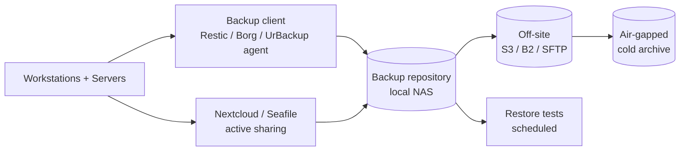

# Open-Source Backup and File Sharing

A focused look at the open-source tools that protect data at rest and in transit between humans — the backup engines that make ransomware survivable, and the self-hosted file-sharing platforms that replace consumer cloud accounts inside an organisation.

This page is a sibling of the broader [Open-Source Security Tools — Overview](./overview.md) and complements the detection coverage in [SIEM, Logging and Monitoring](./siem-and-monitoring.md) and the malware-response material in [Threat Intelligence and Malware Analysis](./threat-intel-and-malware.md). For server-side backup architecture beyond the tools themselves, see [Server backup strategy](../../servers/storage/backup.md).

The backup tools here are the recovery half of the data-protection story; the file-sharing tools are the everyday-collaboration half. Both halves together replace the SaaS bundle that most organisations default to when they have not deliberately chosen otherwise.

## Why this matters

Backup is the last line of defense against ransomware. Every other control — endpoint detection, network segmentation, MFA, patching — exists to reduce the *probability* of a destructive incident. Backup exists to bound the *blast radius* when one happens anyway. An organisation with tested, off-site, immutable backups treats ransomware as an outage; an organisation without them treats it as a near-death experience.

Commercial backup software is one of the more expensive corners of the IT budget. Veeam, Commvault, Rubrik and Cohesity all price into the tens or hundreds of thousands of dollars a year for a mid-sized environment, and that is before storage costs. For SMBs, university labs, hobby homelabs and even mid-tier businesses that have outgrown a single NAS, the open-source alternatives — **BorgBackup**, **Restic**, **UrBackup** — cover the same recovery scenarios at a fraction of the cost, and with full ownership of the encryption keys.

Self-hosted file sharing is the parallel story for active collaboration data. Consumer Dropbox, Google Drive Personal and OneDrive Personal accounts sprawl through every organisation that ever skipped a procurement step, taking proprietary intellectual property with them. **Nextcloud**, **Seafile** and **OnionShare** let a team collaborate, sync, and share without sending engineering source files through a third party that can read them.

- **Backup is recovery time, not backup time.** Vendors compete on backup speed; what matters is restore speed, restore reliability, and how recent the last *successfully tested* restore was.
- **Open-source backup tools own a real share of the production market.** Borg and Restic ship in production at large hosts and SaaS providers; this is not a homelab-only space.
- **Self-hosted file sharing is a sovereignty question.** When source code, customer data and internal documents live on a vendor's infrastructure, that vendor is part of your threat model whether you acknowledge it or not.
- **The encryption-key story matters.** With Borg, Restic and Nextcloud the keys are yours. With most SaaS cloud backup the keys are the vendor's, and any compelled disclosure or breach is yours to absorb.
- **Cost scaling is dramatically different.** Commercial backup grows with protected capacity in a way that turns a 50 TB environment into a six-figure annual line item. Open-source grows with hardware capacity, which is roughly two orders of magnitude cheaper.

This page maps the two families — **backup tools** and **self-hosted file sharing** — to the leading open-source projects, explains where each fits, and gives a 3-2-1-aligned deployment sketch you can copy.

## Stack overview

The backup and file-sharing stacks compose into a single data-protection plane with two parallel data flows — *passive* protection through the backup chain, *active* collaboration through the file-sharing layer. Both terminate in restore-tested, off-site copies of organisation data, but the access patterns and tools are deliberately different.

Read the diagram as data flow, not deployment. In practice the backup repository, the off-site replica and the cold archive can each live on different infrastructure — that is the point of the 3-2-1 rule. Nextcloud and Seafile sit alongside the backup chain as the *live* data plane that users actually touch, and they themselves get backed up by Borg or Restic into the same repository.

Two patterns to internalise. First, **active sharing and passive backup are different jobs**: Nextcloud is for collaboration, not for "the file I deleted six months ago that the auditors want today" — that is the backup tool's job. Second, **the backup chain only counts as 3-2-1 if the off-site copy is verified independently**; replicating a corrupt local repo to S3 produces two corrupt copies, not one healthy one.

## The 3-2-1 backup rule

The 3-2-1 rule is the single most repeated piece of backup advice for a reason: it survives most realistic failure modes without being unaffordable. It says you should keep **three** copies of data, on **two** different media types, with **one** copy off-site. Modern variants extend it to 3-2-1-1-0 — adding one immutable or air-gapped copy and zero verification errors on the most recent restore test.

Each tool covered here implements the rule slightly differently:

- **BorgBackup** typically owns the local-NAS copy (copy 1) and a remote SFTP or `borg serve` copy on a different site (copy 2). Append-only mode and key-based access produce a logical air-gap against ransomware.
- **Restic** is well suited to the cloud copy (copy 2 or 3) thanks to native S3, B2, Azure Blob, GCS and SFTP backends. A Restic repository on Backblaze B2 with object-lock enabled gives you both off-site and immutable in one step.
- **UrBackup** is the strongest choice for the on-prem copy of endpoints (copy 1, image-based), because the agent-and-server model and web UI fit the way most teams actually run desktop and laptop backup.
- **Nextcloud** and **Seafile** are not backup tools, but their server-side data must be backed up by one of the above; their client-side sync also acts as a soft second copy of user-edited files in many small teams.

The trap most teams fall into is "we have backups" without specifying which copies, which media, which sites, and when the last restore worked. Write the 3-2-1 mapping for `example.local` down on one page and review it quarterly.

A practical note on the 3-2-1-1-0 extension: the extra "1" stands for an immutable copy, and the "0" stands for zero verification errors on the most recent test. Both additions matter precisely because ransomware operators have learned to delete or encrypt the backup chain as part of the attack — the historical 3-2-1 rule was written before that threat model existed and needs updating.

## Backup — BorgBackup (Borg)

BorgBackup, usually shortened to Borg, is a deduplicating, encrypted, compressed backup program for Linux and Unix systems. It is the long-running, conservative choice for server-side backup and is what most "I run my own infrastructure" engineers reach for first.

In the open-source backup space Borg has the strongest claim to a default-for-servers position. The on-disk format is stable, the deduplication is content-defined chunking that works well on virtual machine images and large directories, and the security model is designed around a hostile remote storage assumption.

- **Deduplication-first design.** Borg breaks files into variable-size chunks, hashes each chunk, and stores it once even if it appears in dozens of backups. A nightly backup of a 200 GB server typically produces 2–5 GB of new data per night after the initial seed.
- **Encryption by default.** Repositories use authenticated encryption (`repokey` or `keyfile` modes) so that the remote storage host sees only opaque ciphertext. Compromising the storage host does not compromise the data.
- **Append-only repositories.** A repository can be configured so that the client cannot delete prior backups, only append new ones. Pruning runs from a separate trusted account. This single feature defeats the most common ransomware backup-destruction pattern.
- **Compression.** Borg supports `lz4`, `zstd`, `zlib` and `lzma` compression alongside deduplication. `zstd,3` is the modern sweet spot — better ratios than `lz4` at acceptable CPU cost.
- **Mature CLI and ecosystem.** `borgmatic` provides a YAML-driven wrapper, systemd timer units, retention policies and pre/post hooks. Most production Borg deployments are actually `borgmatic` deployments under the hood.
- **Trade-offs.** Borg has no first-party web UI; community frontends (BorgWarehouse, Vorta) cover desktop use but a server team typically lives in the CLI. Borg is also single-threaded for repository operations, which can become a bottleneck on very large repositories.
- **When to choose.** Linux-heavy fleets, server backup, append-only / hostile-remote storage assumptions, deduplication-friendly workloads such as VM images and database dumps.

For `example.local`, Borg is the default tool for nightly server backup to a local NAS, with the repository in `repokey-blake2` mode and append-only enforced on the storage server.

## Backup — Restic

Restic is a younger, Go-based backup program that competes directly with Borg. It is the choice when you want strong cloud backend support, simpler operational ergonomics, and a single static binary.

- **Multi-backend by default.** Restic ships native support for local filesystem, SFTP, S3, Backblaze B2, Azure Blob, Google Cloud Storage, OpenStack Swift, and any rclone-supported backend. This is the single biggest practical difference from Borg, which is happiest with SFTP and `borg serve`.
- **Dedup and encryption.** Like Borg, Restic uses content-defined chunking for deduplication and AES-256-CTR with Poly1305 for encryption. Encryption is mandatory; there is no plaintext mode.
- **Single static binary.** A Restic deployment is one Go binary. There are no daemons, no agents, no centralised manager. Cron and the binary are the deployment.
- **Snapshot model.** Each backup is a snapshot identified by a hash. Restore by snapshot ID or by `latest`. The snapshot list is queryable from any client with the repository password.
- **Concurrency.** Restic is parallel by default for both backup and restore, which makes it materially faster than Borg on multi-core systems with fast storage.
- **Trade-offs.** Memory consumption can be high on very large repositories (hundreds of millions of objects), because the in-memory index is held in RAM during operations. The `prune` step has historically been slower than Borg's; recent versions have improved this significantly.
- **When to choose.** Cloud-first backup, Windows servers (Restic supports Windows natively where Borg does not), heterogeneous fleets, simpler ops than Borg, and any case where the storage backend is S3-compatible object storage.

For `example.local`, Restic is the default tool for the *off-site* leg of the 3-2-1 — backing up the Borg repositories themselves to Backblaze B2 with object-lock for immutability.

## Backup — UrBackup

UrBackup is a client/server backup system that takes a different approach: a centralised server with a web UI, agents installed on each client, and support for both file-level *and* image-level backups. Where Borg and Restic are CLI-first server tools, UrBackup is GUI-first endpoint-and-server tool.

- **Image and file backups.** UrBackup is one of the few open-source tools that does proper image-level backup of Windows endpoints with VSS integration. You can restore a full disk image to bare metal from a bootable recovery ISO.
- **Web management UI.** A central server provides a web dashboard for client status, backup history, restore browsing, and scheduling. Operators do not need to SSH anywhere to see what backed up last night.
- **Cross-platform agents.** Agents run on Windows, Linux and macOS. Mobile (iOS, Android) is not supported.
- **Incremental and de-duplication.** File-level backups use rsync-style incremental transfers with file-hash deduplication across clients. Image backups use Volume Shadow Copy on Windows for consistency.
- **Trade-offs.** Not designed for multi-tenant or large enterprise environments — the database can grow unbounded under heavy fleet sizes, and there is no built-in support for multi-region replication. Encryption of backups at rest is supported but not the default; turn it on at deploy time.
- **When to choose.** Endpoint backup (laptops, desktops), bare-metal Windows recovery, mixed-OS small-to-mid environments where a central web UI matters, and any case where image-level restore is a hard requirement.

For `example.local`, UrBackup is the natural choice for the laptop fleet — a single UrBackup server in the office, agents on every Windows and macOS laptop, with the server's data store itself backed up nightly by Borg.

## Borg vs Restic vs UrBackup — comparison

| Dimension | BorgBackup | Restic | UrBackup |
|---|---|---|---|
| Language | Python + C | Go | C++ |
| Deduplication | Content-defined chunking | Content-defined chunking | File-level + image dedup |
| Encryption | Authenticated, mandatory | AES-256 + Poly1305, mandatory | Optional, off by default |
| Multi-target | SFTP, `borg serve`, local | S3, B2, Azure, GCS, SFTP, local, rclone | Local server only |
| File / image | File-level only | File-level only | File and image |
| Web UI | None first-party | None first-party | Built-in dashboard |
| Append-only | Yes (server-enforced) | Object-lock via backend | Server-enforced retention |
| Best for | Linux server backup | Cloud-tier and Windows | Endpoint + image |
| Concurrency | Single-thread per repo | Parallel by default | Multi-client server |

The honest summary: **Borg for the on-prem server backup, Restic for the cloud tier, UrBackup for endpoints**. They are not mutually exclusive — most mature `example.local`-shaped environments end up running all three.

## File sharing — Nextcloud

Nextcloud is the broadest of the self-hosted file-sharing platforms. It is positioned as a full Dropbox-plus-Office-365 replacement: file sync, calendar, contacts, video calls, document editing, and a plugin marketplace with hundreds of community apps.

- **Full collaboration suite.** The base server includes file sync. Bolted on top are Calendar, Contacts, Talk (video conferencing), Mail, Deck (Trello-style boards), and integrations with Collabora Online or OnlyOffice for browser document editing.
- **End-to-end encryption.** Nextcloud supports per-folder E2EE for sensitive data, alongside server-side encryption for everything else. Key management is client-side for E2EE folders.
- **Identity integration.** LDAP, SAML 2.0, OpenID Connect and OAuth2 are first-class. MFA is supported via TOTP, WebAuthn and U2F.
- **Plugin ecosystem.** The Nextcloud App Store has thousands of apps from community developers. Quality varies, so audit before installing in production.
- **Trade-offs.** Nextcloud's PHP backend is performance-sensitive on slow disks and small instances. The "Files API" call pattern from desktop clients can saturate a small VM under heavy use. Tuning Redis, OPcache and the database is mandatory above a few dozen users.
- **When to choose.** You want a single platform that replaces Dropbox plus Office 365 for a small-to-mid team, you value plugin extensibility, and you have the engineering capacity to tune PHP and run a database alongside it.

For `example.local`, Nextcloud is the platform of choice when the team needs *more* than file sync — calendars, contacts, video calls and document editing in one place.

## File sharing — Seafile

Seafile takes a deliberately narrower approach: it is a fast, sync-focused file platform with a smaller footprint than Nextcloud and a desktop-client experience that consistently beats it on large repositories.

- **Sync performance.** Seafile's "library" model and block-level sync protocol handle large directories and large files better than Nextcloud at the same hardware tier. Teams that sync 100 GB+ engineering folders typically prefer Seafile.
- **Optional E2EE per library.** Each library (top-level folder) can be created encrypted, with the password held client-side only.
- **Smaller footprint.** Seafile's Go and Python backend uses less RAM than Nextcloud at comparable user counts. A small VM goes further.
- **Cross-platform clients.** Desktop, mobile and web clients are all available and stable.
- **Trade-offs.** Fewer built-in collaboration apps — no calendar, no contacts, no video calls, no built-in document editor. Some advanced features (online office integration, audit logs) live in the Pro edition rather than the Community edition.
- **When to choose.** You want fast file sync first and collaboration features second. You have other tools for calendar, mail and chat. You care about performance per dollar of hardware.

For `example.local`, Seafile is the alternative to Nextcloud when the team needs sync-only and is paying for Microsoft 365 or Google Workspace separately for the collaboration suite.

## File sharing — OnionShare

OnionShare is a different category of tool entirely: it is for *one-time, anonymous* file sharing over the Tor network. There is no central server, no account, no persistent storage, and no record of the share once it ends.

- **Tor onion services.** Each OnionShare session creates an ephemeral `.onion` address. Recipients access it through Tor Browser; the sender's IP is never visible.
- **Three modes.** "Share" (download from sender), "Receive" (upload to sender) and "Host a website". The "Receive" mode is particularly useful for collecting sensitive material from a source who cannot use email.
- **No server infrastructure.** OnionShare runs on the sender's laptop. When the laptop closes, the share is gone.
- **Simple GUI and CLI.** Both desktop and command-line versions are available; the CLI is suitable for headless servers acting as a drop point.
- **Trade-offs.** Both ends need Tor — the recipient needs Tor Browser, the sender needs OnionShare running. Throughput is limited to Tor speeds (typically a few MB/s). Long uploads can fail mid-stream if Tor circuits change.
- **When to choose.** Whistleblower and journalist source-protection workflows. Sharing a single sensitive file with a recipient where neither party can be observed using a vendor service. Dead-drop for incident response evidence between organisations that do not trust each other's MFT.

For `example.local`, OnionShare is the tool the security team keeps in their incident response kit for sharing forensic artefacts with external responders or law enforcement under conditions that a corporate file share cannot satisfy.

## Tool selection

The matrix below maps the most common needs in this space to a recommended open-source tool. Use it as a starting point, not as a final architecture.

| Need | Pick | Why |
|---|---|---|
| Linux server backup, on-prem | BorgBackup | Mature, append-only, dedup-friendly |
| Cloud-tier backup | Restic | Native S3/B2/Azure/GCS backends |
| Windows endpoint image backup | UrBackup | VSS-integrated image, web UI |
| Mixed laptop fleet, central UI | UrBackup | Cross-platform agents, dashboard |
| Off-site immutable copy | Restic + B2 object-lock | Built for it, logs prove it |
| Database / VM-image dedup | BorgBackup | Best dedup ratio on those workloads |
| Full Dropbox + Office replacement | Nextcloud | Calendar, contacts, talk, plugins |
| Sync-only, fast on large folders | Seafile | Block-level sync, smaller footprint |
| Anonymous one-time file transfer | OnionShare | Tor onion service, no infra |
| Source-protection workflow | OnionShare | No accounts, no logs, Tor-only |
| 3-2-1 implementation | Borg + Restic + Cold | One on-prem, one cloud, one air-gap |

For most `example.local`-shaped environments the answer is **Borg for on-prem server backup + Restic for the cloud tier + UrBackup for endpoints + Nextcloud (or Seafile) for active collaboration + OnionShare in the IR toolkit**.

## Hands-on / practice

Five exercises to make this concrete in a home lab or a sandbox environment for `example.local`. Each one targets a different layer of the stack.

1. **Set up a Borg repo and back up `/etc` nightly with cron.** Initialise a new repository in `repokey-blake2` mode at `/srv/borg/etc-backup`. Write a wrapper script that calls `borg create ::etc-{now}` against `/etc`, exports the password from a root-only file, and prunes to keep 7 daily, 4 weekly and 6 monthly archives. Add a cron entry at 02:00 nightly. Verify that `borg list` shows new archives the next morning and that `borg extract --dry-run` against the latest archive completes cleanly.
2. **Deploy Restic with a B2 backend and verify a restore.** Create a Backblaze B2 account and bucket with object-lock in compliance mode. Initialise a Restic repository against the bucket. Back up `/var/log` with `restic backup`. Wait one day, run a second backup, and confirm dedup statistics from `restic stats`. Then restore the first snapshot to a temporary directory and `diff -r` it against the original to prove the restore is byte-identical for unchanged files.
3. **Install UrBackup server plus a Windows agent.** Deploy the UrBackup server in a Linux VM and the agent on a Windows test machine. Configure both file-level and image-level backup on a daily schedule. Wait for a full image to complete, then boot the recovery ISO in a separate VM and restore the image to confirm bare-metal recovery actually works. Document the time to restore.
4. **Deploy Nextcloud in Docker with object-storage backend.** Stand up the official Nextcloud image with a MariaDB sidecar via `docker compose`. Configure the primary file storage to point at an S3-compatible object store (MinIO works locally for the lab). Create three test users, share a folder between them, and confirm the underlying objects appear in the bucket. Enable TOTP MFA for the admin account.
5. **Share a sensitive file via OnionShare to a recipient on Tor.** Install OnionShare on a sender machine, install Tor Browser on a separate recipient machine. Create a new "Share" session for a single file, copy the resulting `.onion` URL out-of-band, open it in Tor Browser on the recipient, and download the file. Confirm the share auto-closes after one download by checking the OnionShare UI.

## Worked example — `example.local` 3-2-1 strategy

`example.local` previously had a single Synology NAS doing nightly snapshots of file shares, no server backup, and a free-tier Dropbox accumulating engineering source files in personal accounts. The new design implements true 3-2-1 with open-source tooling.

The driver was a near-miss with Ryuk-family ransomware at a peer organisation. Leadership signed off on a backup project the next quarter, with explicit requirements for off-site, immutable, and tested copies.

- **Copy 1 — Borg nightly to local NAS (on-prem).** Every Linux server runs `borgmatic` at 02:00 against a Borg repository on a dedicated NAS in the office. The NAS exposes the repository over SSH with `borg serve --append-only`, so a compromised server cannot delete prior archives. Retention: 14 daily, 8 weekly, 12 monthly. Nightly Healthchecks.io ping verifies the cron job ran.
- **Copy 2 — Restic weekly to Backblaze B2 (cloud).** Every Sunday night a Restic job backs up the Borg repositories themselves to a Backblaze B2 bucket with object-lock in compliance mode set to 90 days. The cloud copy is therefore a copy-of-a-copy that ransomware on the on-prem side cannot reach back to encrypt or delete.
- **Copy 3 — Monthly cold archive to USB drive in a fireproof safe (off-site air-gap).** On the first Monday of each month a 4 TB USB drive is rotated from a fireproof safe in a separate building, plugged into the backup host, populated with a fresh Restic snapshot, then returned to the safe. A second drive is held in a bank deposit box and rotated quarterly. This is the recovery copy of last resort and is genuinely off-line for 30 days at a time.
- **Active collaboration — Nextcloud replaces personal cloud accounts.** A Nextcloud instance hosted in the office on a dedicated VM became the engineering team's shared workspace. Personal Dropbox accounts were inventoried, content migrated, and accounts shut down within 90 days. The Nextcloud data directory is itself backed up by Borg as part of copy 1, by Restic as part of copy 2, and by the cold archive as part of copy 3.
- **Endpoints — UrBackup for laptops.** A single UrBackup server in the office backs up every Windows and macOS laptop nightly when on the corporate network, with image-level backup weekly and file-level daily. Laptop users no longer manage their own backup; restores are a ticket to IT instead of a personal problem.
- **Restore tests — quarterly.** Every quarter the IT team randomly selects one server, one laptop and one Nextcloud user and performs a full restore from the most recent off-site copy, timing each restore and signing the result. Failures result in an outage being declared on the backup chain itself.
- **Cost.** Hardware: ~$8,000 one-time for NAS, USB drives and the UrBackup VM. Cloud: ~$120/month for Backblaze B2. Subscriptions: $0. Engineering: 4 weeks for the rollout, ~10% of one FTE ongoing.

The first realistic disaster-recovery drill, six months in, restored a file deleted four months earlier from the cold archive in 90 minutes — a result that would have been impossible under the old single-NAS regime.

## Backup hygiene

A short list of hygiene practices that turn a backup deployment from "we have backups" into "we can survive ransomware".

- **Schedule restore tests.** An untested backup is a wish, not a backup. Every backup tool has a non-zero rate of silent corruption; only periodic restore tests find it. Quarterly is the floor; monthly is better for the most critical data.
- **Monitor backup health.** Every backup job should emit a success or failure signal to a monitoring system. A job that simply stops running with no alarm is the most common cause of "we discovered we had no recent backups" stories.
- **Alert on stale backups.** "Last successful backup more than 36 hours ago" should page someone. Silent backup failures are the most expensive kind of incident because nobody discovers them until restore time.
- **Rotate encryption keys.** Backup encryption keys should be in a password manager or HSM, with a documented rotation cadence (annually is fine for most environments) and a documented recovery procedure for the case where the production environment is down and the key is needed.
- **Use immutable / append-only buckets.** Object-lock on S3 and B2, append-only mode on Borg, write-once media for the air-gap. Without immutability the ransomware that encrypts your servers will also encrypt your backups.
- **Separate the backup credentials from the production credentials.** A compromised production admin account should not be able to delete backups. Run backup jobs as a dedicated identity with append-only access to the repository.
- **Document the recovery runbook.** During an incident is not the time to learn the `borg extract` syntax. A printed, off-line copy of the recovery procedure for each tool, kept in the same fireproof safe as the cold-archive drives, is the kind of preparation that pays off exactly once.

## Troubleshooting & pitfalls

A short list of mistakes that turn an open-source backup and file-sharing stack from "the thing that saved us" into "the thing we never tested".

- **Borg repository locks under concurrent jobs.** A Borg repository allows only one writer at a time. Two cron jobs racing for the same repository produce a `LockTimeout` and a failed backup. Stagger jobs, or use one repository per host, or use `borgmatic`'s built-in lock handling.
- **Restic memory blow-up on huge repositories.** Restic holds the repository index in memory during operations. A repository with tens of millions of small files can need 8–16 GB of RAM for prune and check operations. Size the backup host accordingly, or split into multiple repositories.
- **UrBackup database growing unbounded.** The UrBackup server stores per-file metadata in SQLite or MariaDB. Without retention pruning, a fleet of 100 endpoints can grow the database to the tens of GB and slow the web UI to a crawl. Configure retention limits up front and monitor database size monthly.
- **Nextcloud "Files API" performance on slow disks.** Nextcloud's PHP-based file metadata operations are slow on spinning disks and small instances. The desktop client's discovery phase saturates a small VM at startup. SSDs, OPcache, Redis and a tuned database are non-negotiable above 50 active users.
- **OnionShare circuit failures during long uploads.** Tor circuits rotate periodically and large transfers can fail mid-stream. For files above ~1 GB, split with `split` and reassemble at the recipient, or accept that retries are part of the workflow.
- **"Tested only on day one" syndrome.** The most common backup failure pattern is a successful initial test followed by years of un-tested operation, and a discovery of corruption during a real incident. If the calendar does not have a quarterly restore-test event, the backups are notional, not real.
- **Backups co-located with production.** A backup repository on the same hypervisor cluster, same SAN, or same building as the data it protects is one ransomware blast away from being equally useless. The whole point of off-site is *off-site*.
- **Forgetting Nextcloud and Seafile are themselves data.** The server-side data directory of a self-hosted file platform is some of the most important data the organisation owns. It must be in scope for backup, and the backup must include the database, not just the file tree.

## Key takeaways

The headline points to take away from this lesson, in order from "always true" to "useful when you remember it".

- **Borg, Restic and UrBackup together cover the full backup stack** — server, cloud, endpoint — at a tiny fraction of commercial tooling cost, with full key ownership.
- **3-2-1 is non-negotiable.** Three copies, two media, one off-site — and increasingly one immutable. Anything less is a single failure away from data loss.
- **Untested backups are wishes.** Schedule restore tests on the calendar; failures count as outages.
- **Immutability defeats the most common ransomware backup-destruction pattern.** Object-lock, append-only mode, or air-gap — pick at least one for at least one copy.
- **Nextcloud and Seafile replace consumer cloud accounts inside the org**, and matter for sovereignty, IP protection and regulatory exposure as much as for cost.
- **OnionShare is a specialist tool worth knowing about** for the rare case where it is the only tool that will work — anonymous, ephemeral, no infrastructure.
- **Backup tools and self-hosted file sharing are complementary, not overlapping.** The file-sharing platform owns the active data; the backup tool owns the historical and recovery copies.
- **The biggest open-source backup risk is operator capacity, not tool capability.** The tools work; the failure mode is the team that stops watching them.
- **Plan for 3-2-1-1-0 from day one.** It is much cheaper to design immutability and verification into the rollout than to retrofit them after the first scare.
- **The cost story for backup is not the whole story.** Yes, you save money. The bigger win is *recovery confidence* — knowing in advance, on the strength of last quarter's restore test, that the next ransomware incident is an outage and not a death sentence.

Putting it bluntly: an `example.local`-shaped organisation that adopts Borg + Restic + UrBackup + Nextcloud (or Seafile) can match commercial backup-and-collaboration coverage at perhaps 5% of the cost — provided the engineering capacity exists to run, monitor and restore-test the stack.

## References

- [BorgBackup — borgbackup.org](https://www.borgbackup.org)
- [borgmatic — torsion.org/borgmatic](https://torsion.org/borgmatic/)
- [Restic — restic.net](https://restic.net)
- [Restic documentation — restic.readthedocs.io](https://restic.readthedocs.io)
- [UrBackup — urbackup.org](https://www.urbackup.org)
- [Nextcloud — nextcloud.com](https://nextcloud.com)
- [Nextcloud admin manual](https://docs.nextcloud.com/server/latest/admin_manual/)
- [Seafile — seafile.com](https://www.seafile.com)
- [OnionShare — onionshare.org](https://onionshare.org)
- [Backblaze B2 object-lock](https://www.backblaze.com/cloud-storage/object-lock)
- [NIST SP 800-34 — Contingency Planning Guide](https://csrc.nist.gov/pubs/sp/800/34/r1/upd1/final)
- [CISA — Stop Ransomware: backup guidance](https://www.cisa.gov/stopransomware)
- [CISA / NSA / FBI ransomware response checklist](https://www.cisa.gov/sites/default/files/2023-02/StopRansomware-Guide_508c_v3_1.pdf)
- [3-2-1 backup rule — US-CERT historical guidance](https://www.cisa.gov/news-events/news/data-backup-options)
