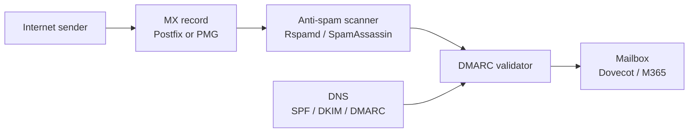

# Open-Source Email Security

A focused look at the open-source tools that defend the email perimeter — the spam scanners that score messages, the mail gateways that sit in front of mailboxes, and the all-in-one mail bundles that let a small team run their own server without standing up a dozen daemons by hand.

This page assumes you have already read the [Open-Source Stack Overview](./overview.md) and have at least a working firewall in place from [Firewall, IDS/IPS, WAF and NAC](./firewall-ids-waf.md). Email touches almost every other security layer — phishing flows into [Social Engineering](../../red-teaming/social-engineering.md), malware attachments cross over with [Threat Intel and Malware Analysis](./threat-intel-and-malware.md), and inbound rejections show up in [SIEM and Monitoring](./siem-and-monitoring.md) dashboards.

## Why this matters

Email is still the number-one initial-access vector. The Verizon DBIR has put phishing and email-borne payloads at the top of the breach-cause list every year for over a decade, and every red-team retro tells the same story: the cheapest way into most environments is a well-crafted message landing in someone's inbox. The defensive side of that equation is dominated by two commercial vendors — Proofpoint and Mimecast — who charge per mailbox per year, with the bigger deals running into six figures for a few thousand seats.

For a small or medium business that cannot stomach those numbers, the open-source side covers most of the same ground. A scanner like Rspamd or SpamAssassin handles the bulk-mail and phishing-pattern scoring; an appliance like Proxmox Mail Gateway puts a managed front door in place; bundles like Mailcow, Mail-in-a-Box and iRedMail let you self-host the whole mail stack if you must. Layered on top, the three DNS-based authentication standards — SPF, DKIM and DMARC — do the policy work that no scanner can do on its own.

For `example.local` — a 200-person organisation paying $30,000/year for a commercial email security gateway in front of Microsoft 365 — the open-source path is realistic. **Proxmox Mail Gateway in front of M365**, with **Rspamd doing the heavy filtering** and **SPF + DKIM + DMARC enforced at the DNS layer**, covers the day-to-day phishing, spam and malware filtering at perhaps a quarter of the commercial price.

- **Phishing is the top initial-access vector.** Year after year. No firewall, no EDR and no SIEM removes that — only filtering at the gateway and authentication at the DNS layer can.
- **Commercial filters are expensive and opaque.** Proofpoint and Mimecast invoices grow with mailbox count, not with risk, and the rule logic that decides what gets quarantined is a vendor black box.
- **Open-source filters are mature.** Rspamd and SpamAssassin both predate most of the commercial market and are battle-tested in millions of mailboxes — they are not toys.
- **Authentication is free.** SPF, DKIM and DMARC cost only DNS records and a little signing infrastructure. Skipping them is the single biggest unforced error in modern email security.
- **Self-hosting trades cost for responsibility.** A bundle like Mailcow gives you a full mail server in an evening, but you inherit IP-reputation management, deliverability tuning, and 24x7 uptime obligations the moment you cut over.
- **Gateway-only deployments preserve cloud mailbox economics.** Putting Proxmox Mail Gateway in front of M365 or Google Workspace gives you control over filtering without losing the operational benefits of hosted mailboxes.

This page maps the four families of tools — **anti-spam scanners, mail gateways, all-in-one bundles, and authentication** — to concrete picks, explains where each one fits, and gives you a worked deployment for `example.local`.

## Stack overview

The diagram below traces a single inbound message from the internet to a mailbox, with the three DNS-based authentication records feeding into the validator at the right place in the flow. Read it as data flow, not deployment — in practice the scanner and the validator may live inside the same daemon.

Two patterns to internalise. First, **the scanner and the authentication validator are conceptually separate even when the same daemon does both jobs**: scoring decides "is this spam-shaped", validating decides "did this domain authorise this sender". Confusing the two leads to bad rules — quarantining authenticated marketing mail, or accepting unsigned spear-phishing from your own CFO's spoofed address. Second, **DNS records are part of the security stack**: SPF, DKIM and DMARC are configuration that lives outside the mail server but feeds directly into the validator. Forgetting to publish them is the difference between protected and exposed.

## Anti-spam — Rspamd

Rspamd is the modern default for open-source mail filtering — written in C with Lua scripting, asynchronous, and roughly an order of magnitude faster than its older alternatives. It has been the default scanner in Mailcow and several other bundles for years, and the project has steady commercial backing through Vsevolod Stakhov's consulting.

The architecture is event-driven and built for high-throughput environments. Rspamd does not block on individual checks the way SpamAssassin's Perl pipeline does — it fans out DNSBL lookups, content scans, statistical scoring, and Bayesian classification in parallel and aggregates the result.

- **Scoring engine.** Each message accumulates a score from dozens of independent checks (DNSBL hits, fuzzy matches against known-spam corpora, statistical token analysis, header anomalies, URL reputation). The final score determines the action — accept, greylist, soft-reject, hard-reject or rewrite the subject.
- **Fuzzy hashing.** Rspamd builds shingled fingerprints of message bodies and shares them across a fuzzy-storage cluster. Once a campaign is fingerprinted on one node, the rest of the fleet recognises mutated copies of it. This is what catches mass campaigns that defeat content rules.
- **Bayesian and neural-net classifiers.** A built-in Bayesian classifier learns ham vs spam from operator-labelled corpora. The optional neural-net plugin adds a TensorFlow-style layer on top, often improving accuracy on harder corner cases — at the cost of opaque scoring decisions.
- **Native authentication checks.** SPF, DKIM signing and verification, DMARC evaluation, ARC and DKIM key rotation are all built in. You do not need a separate `opendkim` or `policyd-spf` daemon alongside Rspamd.
- **Postfix and Exim integration.** Rspamd plugs into Postfix via the milter protocol or Exim via the spam-checking ACL. The integration is documented and the typical setup takes minutes once the surrounding mail server is up.
- **Web UI.** Built-in dashboard for live message scoring, statistics, learning from quarantine, and rule tuning. The UI is a meaningful step up from the text-file ergonomics of older filters.
- **When to choose.** New deployments, high-throughput mailflows, anywhere you want a single daemon to handle scoring, authentication and classifier learning under one roof.

## Anti-spam — SpamAssassin

SpamAssassin is the elder statesman — first released in 2001, written in Perl, and still the filter that ships in countless hosting-provider mail stacks. The Apache Software Foundation maintains it, and the rule corpus continues to receive updates through the SpamAssassin Rules Project.

It is slower than Rspamd, more memory-hungry, and the Perl-on-startup model does not love modern containerised deployments. None of that has dislodged it from the millions of mail servers that have been running it for two decades — there is a long tail of cPanel, Plesk and shared-hosting installations where SpamAssassin remains the path of least resistance.

- **Rule-driven scoring.** Each message accumulates points from a large catalogue of regex and header rules. The default threshold (typically 5.0) marks the message as spam; rules ship as part of the core distribution and via add-on rule channels updated weekly.
- **Bayesian classifier.** A token-frequency Bayesian engine learns ham/spam over time. Operators feed it via `sa-learn` against quarantined and confirmed-clean corpora.
- **DNSBL and URIBL lookups.** Pluggable lookups against Spamhaus, Barracuda, SURBL and dozens of other reputation lists. Results contribute to the message score rather than directly accepting or rejecting.
- **Pyzor, Razor and DCC.** Distributed-checksum networks similar in spirit to Rspamd's fuzzy hashing — different protocols, similar effect.
- **Amavisd integration.** The conventional deployment puts SpamAssassin behind `amavisd-new`, which fans out content to SA, ClamAV and other scanners and re-injects the verdict into Postfix.
- **When to choose.** Existing hosting environments where SA is already wired in, smaller volumes where Perl overhead does not matter, or organisations that prefer the rule-by-rule legibility of the SA scoring model over Rspamd's combined-engine approach.

## Anti-spam — comparison

The table below compares the two filters on the dimensions that dominate the decision in practice — speed, accuracy, integration shape and ongoing maintenance load.

| Dimension | Rspamd | SpamAssassin |
|---|---|---|
| Language / runtime | C + Lua, asynchronous | Perl, fork-per-message |
| Throughput | High (thousands msg/sec/node) | Moderate (hundreds msg/sec/node) |
| Memory footprint | Compact, single daemon | Heavier, Perl interpreters |
| Built-in auth (SPF/DKIM/DMARC) | Yes, native | Via plugins or external daemons |
| Fuzzy / shared-corpus matching | Native fuzzy storage | Pyzor, Razor, DCC plugins |
| ML / neural-net option | Yes (TensorFlow plugin) | No (Bayesian only) |
| Default UI | Web dashboard built-in | None (text + amavisd-new addons) |
| Integration | Postfix milter, Exim ACL | Amavisd, MIMEDefang, MailScanner |
| Rule update cadence | Continuous, auto | Weekly via `sa-update` |
| Best fit | New, high-throughput | Legacy, hosting-platform |

The short version: **Rspamd for greenfield deployments**, SpamAssassin only when an existing platform ties your hands or when the rule legibility of SA matters more to your operators than raw throughput.

## Mail gateway — Proxmox Mail Gateway

Proxmox Mail Gateway (PMG) is a Debian-based appliance from the same team behind Proxmox VE. It bundles Postfix, Rspamd (or SpamAssassin), ClamAV, a quarantine database and a web admin UI into a single ISO that drops in front of an existing mail server — Microsoft 365, Google Workspace, or a self-hosted Exchange or Postfix.

The point of PMG is to be the front door. Your MX record points at PMG; PMG accepts inbound mail, scans it, and relays the surviving messages to the real mailbox infrastructure behind it. The real mailbox server never speaks to the internet directly.

- **Stack contents.** Postfix as the SMTP engine, Rspamd and SpamAssassin both available (Rspamd is the default in modern releases), ClamAV for malware scanning, regex and DKIM/SPF/DMARC policies, and a per-user quarantine database backed by PostgreSQL.
- **Position in the flow.** PMG is a perimeter scanner, not a mailbox host. A typical deployment puts PMG with the public MX records, and Postfix/Exchange/M365 sits behind it on a private interface, only accepting mail from PMG's IP.
- **Web admin.** All policy, quarantine review, user management and tracking happens through the web UI. The interface is solid — the same engineering culture that produced Proxmox VE.
- **Cluster mode.** PMG can run as a cluster of identical nodes sharing a synchronised quarantine and policy database. Useful for HA at a small scale; the licence-free version supports clustering.
- **Strengths.** Self-contained appliance, sensible defaults, strong web UI, integrates Rspamd's modern scanning under a friendlier admin layer than raw Rspamd. Cheap to run on a single VM for small organisations.
- **Trade-offs.** Open-source edition lacks the commercial subscription's signed package repository and direct support — you can run it for free in production, but the upgrade path expects you to either subscribe or be comfortable with the no-subscription channel. Quarantine UI is functional rather than beautiful.
- **When to choose.** You already have a working mail backend (M365, Google Workspace, Exchange, on-prem Postfix) and want a managed-feeling open-source filter in front of it without rebuilding the mailbox layer.

## Self-hosted bundle — Mailcow

Mailcow is the Docker-native all-in-one open-source mail server. The "dockerised" edition assembles Postfix, Dovecot, Rspamd, ClamAV, SOGo (groupware), nginx and a web admin UI into a single `docker-compose` deployment that comes up in under an hour on a fresh VM.

The project is European, GPLv3, and has a friendly active community. It is the default open-source bundle most teams reach for when they want a fully self-hosted mail experience without writing their own glue.

- **Components.** Postfix (SMTP), Dovecot (IMAP/POP3, sieve), Rspamd (filtering), ClamAV (malware), SOGo (webmail + CalDAV/CardDAV), nginx (reverse proxy), MariaDB (storage), Redis (caches and queues), ACME client (Let's Encrypt automation).
- **Web UI.** Mailcow's admin UI handles domain creation, mailbox management, alias and forwarding rules, quarantine review, DKIM key generation, and per-user 2FA. Operators rarely need to touch a config file after the initial deploy.
- **DKIM and ARC signing.** Built in. Generating a DKIM key for a new domain is a one-click operation; the public-key DNS record is shown ready-to-paste.
- **Rspamd dashboard.** Mailcow exposes Rspamd's web UI as a tab in the admin panel, so you can read scores, train ham/spam corpora and tune thresholds without leaving the bundle.
- **Updates.** A `update.sh` script pulls new container images and migrates the schema. Updates are usually painless but occasionally introduce breaking changes — pin to specific tags in production and test in staging first.
- **When to choose.** You want a complete self-hosted mail server with modern filtering, you are comfortable with Docker, and you want a single coherent project rather than a hand-assembled stack.

## Self-hosted bundle — Mail-in-a-Box

Mail-in-a-Box is the opinionated single-box bundle aimed at "I want a mail server tonight". It ships as a bash installer that turns a fresh Ubuntu 22.04 VM into a working mail server, web mail and DNS host in roughly twenty minutes.

The project's stated goal is to make self-hosted mail accessible to non-experts, and the design choices reflect that — there is one supported OS, one supported deployment shape, and very little tuning surface. That simplicity is the pitch.

- **Components.** Postfix, Dovecot, Roundcube webmail, OpenDKIM, OpenDMARC, SpamAssassin, ClamAV, nsd as the authoritative DNS server, nginx as the reverse proxy, plus a small admin UI.
- **DNS-as-part-of-the-bundle.** Unlike Mailcow, Mail-in-a-Box runs its own authoritative DNS — you point your registrar at the box and it serves SPF, DKIM and DMARC records automatically. This is convenient and slightly unusual; it also means the box is now in your DNS path.
- **Backups.** Built-in encrypted backup-to-S3 (or compatible) using duplicity. Restore is a documented procedure and works in practice.
- **Strengths.** Genuinely fast time-to-running, sensible defaults end-to-end, opinionated enough that there is one right way to do most things.
- **Weaknesses.** Less flexible than Mailcow — single-box, single-OS, no built-in clustering. Uses SpamAssassin rather than Rspamd, so filter throughput is lower. Smaller community, slower release cadence.
- **When to choose.** You want a personal or family-domain mail server that runs itself, or you want an evaluation deploy before committing to a more flexible platform.

## Self-hosted bundle — iRedMail

iRedMail is the long-running open-source mail server bundle from iRedMail.org, with a free open-source core and a paid Pro tier (iRedAdmin-Pro) that adds advanced admin features. It supports a wider OS matrix than the other bundles — Debian, Ubuntu, RHEL/Rocky/AlmaLinux, FreeBSD and OpenBSD.

The architecture is bare-metal-friendly rather than Docker-native, which appeals to operators who prefer system packages and `systemd` units over container orchestration. It is a popular choice in hosting and managed-services shops.

- **Components.** Postfix, Dovecot, Amavisd-new, SpamAssassin, ClamAV, Roundcube or SOGo for webmail, nginx or Apache, OpenLDAP / MariaDB / PostgreSQL as backend store options.
- **Backend choice.** Unusual flexibility — you can store user accounts in OpenLDAP, MariaDB or PostgreSQL depending on what fits your IT environment. Most other bundles pick one and stay there.
- **Multi-OS.** First-class support for both Debian-family and RHEL-family Linuxes, plus the BSDs. Useful when corporate policy mandates a specific base OS.
- **iRedAdmin (free) vs iRedAdmin-Pro (paid).** The free admin UI is functional but limited; per-user policies, quarantine review, password expiry and audit logging live in the paid tier. The mail server itself is fully open-source and works without the Pro UI.
- **Strengths.** Mature, OS-agnostic, comfortable for sysadmins who do not want Docker. Works well alongside existing system-management tooling (Ansible, Salt, Puppet).
- **Weaknesses.** Filter side is SpamAssassin-based, so slower than Mailcow; the free admin UI is the weakest of the three bundles; the upsell to Pro is constant.
- **When to choose.** You want a non-Docker bundle, you need RHEL or BSD support, or your team prefers system packages over container orchestration.

## Bundles — comparison

The matrix below compares the three bundles on the dimensions that dominate the decision in practice — packaging shape, filter engine, and operational complexity.

| Dimension | Mailcow | Mail-in-a-Box | iRedMail |
|---|---|---|---|
| Packaging | Docker Compose | Bash installer on Ubuntu | System packages, multi-OS |
| Default filter | Rspamd | SpamAssassin | SpamAssassin |
| Webmail | SOGo | Roundcube | Roundcube or SOGo |
| Groupware (CalDAV/CardDAV) | Yes (SOGo) | Limited | Yes (SOGo option) |
| DKIM management | UI, one-click | UI, automatic | UI, partial |
| Built-in DNS | No (external DNS) | Yes (nsd) | No (external DNS) |
| Multi-OS | Linux + Docker | Ubuntu only | Debian, RHEL, BSD |
| Clustering | Possible (manual) | No | Limited |
| Free admin UI | Full | Full | Limited (Pro for full) |
| Best fit | Modern self-hosted | Single-box, low-touch | Multi-OS, bare-metal |

The short version: **Mailcow** if you can run Docker and want the most modern bundle; **Mail-in-a-Box** if you want one box that just works; **iRedMail** if you need RHEL/BSD or system-package management.

## Email authentication essentials

No filter, however good, replaces the three DNS-based authentication standards. SPF, DKIM and DMARC are the policy layer that tells the world which servers are allowed to send mail for your domain and what to do when something else tries.

- **SPF (Sender Policy Framework, RFC 7208).** A DNS TXT record listing the IP addresses and hostnames authorised to send mail from your domain. Receivers compare the connecting IP against the record. SPF alone is fragile — it breaks on forwarding — but it is the foundation everything else builds on.
- **DKIM (DomainKeys Identified Mail, RFC 6376).** A cryptographic signature added to outbound mail headers, with the public key published in DNS. Receivers verify the signature against the published key. DKIM survives forwarding (the signature travels with the message) and proves the message was not modified in transit.
- **DMARC (Domain-based Message Authentication, Reporting and Conformance, RFC 7489).** A policy record that says "if SPF and DKIM both fail (and do not align with the From: domain), do this" — `none` (monitor only), `quarantine`, or `reject`. DMARC also produces aggregate reports back to the domain owner, giving you visibility into who is sending mail as your domain.
- **Alignment.** DMARC adds the requirement that the SPF or DKIM domain match (align with) the visible From: address. This is the bit that actually stops spoofing — SPF or DKIM alone can pass for an unrelated domain and still leave your brand impersonatable.
- **Layering order.** Publish SPF first, then DKIM, then DMARC at `p=none` to collect reports. Move DMARC to `p=quarantine` once reports show your legitimate sources are aligned, then to `p=reject` once you are confident nothing legitimate is being caught.
- **BIMI (Brand Indicators for Message Identification).** A newer standard that lets brands display a verified logo next to authenticated mail in supporting clients (Gmail, Apple Mail, Yahoo). Requires DMARC at `p=quarantine` or stricter, plus a Verified Mark Certificate from a recognised authority. Marketing-driven rather than security-critical, but a useful nudge towards strict DMARC adoption.

## Tool selection

The matrix below maps the most common email-security needs to a recommended open-source tool, with a one-line "why" — use it as a starting point when scoping a build, not as a final architecture.

| Need | Pick | Why |
|---|---|---|
| Filter only, in front of M365/Workspace | Proxmox Mail Gateway | Appliance shape, sensible defaults |
| Filter daemon for self-built stack | Rspamd | Modern, fast, native auth checks |
| Filter for legacy hosting platform | SpamAssassin | Already wired into cPanel/Plesk |
| Self-hosted mail server (Docker) | Mailcow | Most modern bundle, Rspamd built-in |
| Self-hosted mail (single-box, low-touch) | Mail-in-a-Box | One-shot installer, just works |
| Self-hosted mail (RHEL or BSD) | iRedMail | Multi-OS, system packages |
| Authentication policy | SPF + DKIM + DMARC | Foundation, free, DNS-only |
| Brand logo in supporting clients | BIMI | Requires strict DMARC anyway |
| Outbound malware scanning | ClamAV (in PMG/Mailcow) | Bundled, free signature feed |

For most `example.local`-shaped environments running M365 or Google Workspace, the answer is **PMG in front, Rspamd inside it, SPF + DKIM + DMARC at the DNS layer**. For environments that genuinely want to leave the cloud mailbox vendor, **Mailcow** is the default starting point.

## Hands-on / practice

Five exercises to make this concrete in a home lab or a sandbox environment for `example.local`. Each one targets a different layer of the email security stack, and together they exercise filtering, authentication, and end-to-end deliverability validation.

1. **Deploy Mailcow in Docker.** Spin up a fresh Ubuntu 22.04 VM with a public IP and a test domain. Clone the Mailcow repo, run `generate_config.sh` and `docker compose up -d`, then walk through the admin UI — add a domain, create two mailboxes, generate a DKIM key, and send a test message between the two accounts. Confirm the DKIM signature passes by checking the message headers in Roundcube.
2. **Configure Rspamd with the neural-net plugin.** On a Mailcow or standalone Rspamd install, enable the `neural` module. Feed it labelled ham and spam corpora using the Rspamd web UI's learning controls (a few hundred of each is enough for a baseline). Send a known-spam-shaped test message and inspect the Rspamd score panel to confirm the neural module contributed to the verdict.
3. **Set up SPF, DKIM and DMARC for `example.local`.** Publish an SPF record listing your sending sources, generate a DKIM key pair and publish the public half, then publish a DMARC record at `p=none` with an `rua=` aggregate-report mailbox. Send a message to a Gmail account, view the original, and confirm all three checks show `pass`.
4. **Deploy Proxmox Mail Gateway as a relay.** Install PMG from ISO on a small VM. Add `example.local` as a relay domain and point PMG to your real mail server (or M365 endpoint) as the next-hop. Update DNS to make PMG the public MX, send test mail from an external address, and confirm the message lands in the real mailbox via the PMG quarantine and tracking views.
5. **Test DMARC and deliverability.** Send a message from your real configured sender to the address shown by [mail-tester.com](https://www.mail-tester.com). Read the resulting report — confirm SPF, DKIM and DMARC all pass, fix any blacklist hits or content warnings, and re-test until you score 10/10. Repeat the same test from a Mailcow install to compare.

## Worked example — `example.local` puts PMG in front of M365

`example.local` runs Microsoft 365 for mailboxes. The current commercial email security gateway invoice is around $30,000/year for 200 users — a large fraction of the security tooling budget. The new design keeps M365 mailboxes (because moving them off would dwarf any filter savings) and replaces the commercial filter with Proxmox Mail Gateway in front.

The driver is twofold: cost reduction, and control over the filter rules and quarantine policy that the commercial vendor would not customise without expensive professional services.

- **PMG cluster.** Two PMG nodes in a small cluster, each on a 4-vCPU / 8 GB VM in the same data centre as the firewall. Public DNS MX records point to a load-balanced IP fronting the two nodes. ClamAV is enabled, Rspamd is the active scanner, and a quarantine retention policy of 14 days is set in the admin UI.
- **Inbound flow.** Internet senders hit the PMG MX. PMG performs SPF, DKIM and DMARC validation, runs Rspamd scoring, drops malware and known-bad senders, and relays the survivors to the M365 inbound connector. The M365 connector is restricted to only accept mail from PMG's outbound IPs.
- **Outbound flow.** M365 sends outbound mail through a connector to PMG, which adds the corporate DKIM signature, applies any outbound content rules, and relays to the public internet. This makes PMG the single egress point for email and gives the security team a place to add DLP-style outbound rules.
- **DNS.** SPF record lists PMG's outbound IPs and Microsoft's `include:spf.protection.outlook.com`. DKIM key generated by PMG, public half published as a TXT record. DMARC record at `p=quarantine` with aggregate reporting to a dedicated mailbox; reports are parsed weekly to spot new senders and shadow-IT mail flows.
- **Operational integration.** Quarantine notifications go to users daily; admins review the PMG dashboard once a day. Alerts on PMG node health flow into the existing Prometheus and Slack stack. Rspamd training data is sourced from operator-confirmed quarantine entries, not from open user buttons (which are noisy).
- **Cost.** PMG infrastructure ~$2,000/year (two VMs and a small load balancer). Engineering: ~3 weeks for the rollout, then ~10% of one FTE for tuning, quarantine review and DMARC report analysis. Net saving against the previous gateway: roughly $20,000/year, alongside meaningful gains in control and visibility.

The previous commercial gateway was opaque: blocked messages required vendor-side ticket escalation, and rule changes were not user-tunable. The new stack is fully under team control, with rules and policies in version control, and the DMARC reporting alone has surfaced two third-party senders nobody on the IT team knew about.

## Troubleshooting & pitfalls

A short list of mistakes that turn a clean open-source email stack into a deliverability incident. Most are operational rather than technical — the tools work, the failure modes are people-and-DNS patterns.

- **DMARC `p=reject` deployed too early.** Moving DMARC straight to `p=reject` before reading aggregate reports almost always breaks at least one legitimate sender — a marketing platform, a payroll provider, a forgotten internal app. Always run at `p=none` for at least a few weeks first, fix the alignment gaps, then move to `quarantine`, then to `reject`.
- **DKIM key rotation forgotten.** DKIM keys should be rotated periodically (annually is the common cadence). Forgetting to rotate is not a technical failure but it does erode the security guarantee — and DKIM key compromise in a third-party platform is a real incident class.
- **IP reputation when self-hosting outbound.** A new self-hosted mail server starts on an unknown IP, and major providers (Gmail, Microsoft) will throttle or junk mail from it for weeks until reputation builds. If you self-host, warm the IP gradually, register with feedback loops, and do not migrate large mailing lists on day one.
- **Rspamd training data leakage.** Letting end-users mark anything as "spam" via a button feeds garbage into the Bayesian and neural classifiers — including legitimate mail they just did not want. Source training data from operator-confirmed quarantine, not from raw user clicks.
- **Mailcow updates breaking integrations.** Mailcow's `update.sh` is generally safe but occasionally bumps a dependency that breaks an integration (SOGo URL changes, Rspamd module reshuffles). Pin to specific tags in production, test in staging, read the release notes before upgrading.
- **Catch-all addresses as malware funnels.** A `catch-all@example.local` address that accepts mail to any unknown local-part will collect attachment-laden spam at high volume. Disable catch-alls unless you have a specific business reason.
- **MX-only records with no fallback.** A single MX record pointing at a single host means a single-point-of-failure for inbound mail. Run two MX records (or a clustered gateway like PMG) and make sure both are reachable.
- **TLS misconfiguration.** Many modern senders prefer or require STARTTLS. A mail gateway with an expired or self-signed certificate may still accept mail, but it loses the privacy guarantees of opportunistic TLS — and MTA-STS (RFC 8461) is increasingly being enforced. Use Let's Encrypt and monitor expiry.
- **Quarantine never reviewed.** A quarantine that no human ever opens becomes a false-positive black hole. Either review it on a schedule or surface user-visible quarantine notifications so users can release their own false positives.
- **Self-hosting without a backup MX strategy.** If your single self-hosted mail server goes down for an afternoon, mail bounces. Either accept the risk explicitly, run a clustered setup, or contract a backup MX service.
- **Mermaid diagrams as policy, not implementation.** The stack overview diagram on this page is a pattern, not a configuration. Refresh it after every architectural change, or stop drawing it — a stale diagram is worse than none.

## Key takeaways

The headline points to take away from this lesson, in order from "always true" to "useful when you remember it".

- **Email is still the number-one initial-access vector.** Filter and authenticate, or accept that you are leaving the front door open.
- **Rspamd is the modern default filter.** SpamAssassin survives in legacy and hosting environments; new builds should start with Rspamd.
- **PMG is the right gateway shape for M365 / Google Workspace shops.** Keep cloud mailboxes, replace the commercial filter, save 60–80% of the line item.
- **Mailcow, Mail-in-a-Box and iRedMail solve different problems.** Mailcow for modern Docker-native shops, Mail-in-a-Box for one-box deployments, iRedMail for RHEL/BSD or system-package preferences.
- **SPF + DKIM + DMARC is non-negotiable.** It is free, it is DNS-only, and it is the only thing that stops domain spoofing.
- **Roll DMARC out gradually.** `none` then `quarantine` then `reject`, with weeks between each step and report review at every stage.
- **Self-hosting mail is a long-term operational commitment.** Deliverability, IP reputation and uptime all become your problem the day you cut over.
- **Quarantine review is a real job.** A filter that quarantines and is never read becomes a deliverability liability, not a security control.
- **Treat email security as code.** Version-control DNS records, rspamd rules and PMG policies; review changes via pull request the same way you review firewall rules.
- **Test deliverability before and after every change.** mail-tester.com, Gmail's "show original", and your own DMARC aggregate reports are the cheapest visibility you will ever buy.
- **The cost story is real, but the control story matters more.** Saving money on filter licensing is nice; owning the rule logic, the quarantine policy and the data is strategic.

Putting it bluntly: an `example.local`-shaped organisation that adopts PMG + Rspamd + SPF/DKIM/DMARC can match commercial-filter coverage at a fraction of the cost — provided someone reviews the quarantine and the DMARC reports on a schedule.

## References

- [Rspamd — rspamd.com](https://rspamd.com)
- [Rspamd documentation](https://rspamd.com/doc/)
- [SpamAssassin — spamassassin.apache.org](https://spamassassin.apache.org)
- [Mailcow — mailcow.email](https://mailcow.email)
- [Mailcow documentation](https://docs.mailcow.email)
- [Mail-in-a-Box — mailinabox.email](https://mailinabox.email)
- [iRedMail — iredmail.org](https://www.iredmail.org)
- [Proxmox Mail Gateway — proxmox.com](https://www.proxmox.com/en/proxmox-mail-gateway)
- [ClamAV — clamav.net](https://www.clamav.net)
- [Postfix — postfix.org](https://www.postfix.org)
- [Dovecot — dovecot.org](https://www.dovecot.org)
- [RFC 7208 — Sender Policy Framework (SPF)](https://datatracker.ietf.org/doc/html/rfc7208)
- [RFC 6376 — DomainKeys Identified Mail (DKIM)](https://datatracker.ietf.org/doc/html/rfc6376)
- [RFC 7489 — Domain-based Message Authentication, Reporting and Conformance (DMARC)](https://datatracker.ietf.org/doc/html/rfc7489)
- [RFC 8461 — SMTP MTA Strict Transport Security (MTA-STS)](https://datatracker.ietf.org/doc/html/rfc8461)
- [BIMI Group — bimigroup.org](https://bimigroup.org)
- [mail-tester.com — deliverability scoring](https://www.mail-tester.com)
- Related lessons: [Open-Source Stack Overview](./overview.md) · [Firewall, IDS/IPS, WAF and NAC](./firewall-ids-waf.md) · [SIEM and Monitoring](./siem-and-monitoring.md) · [Threat Intel and Malware Analysis](./threat-intel-and-malware.md) · [Social Engineering](../../red-teaming/social-engineering.md)
