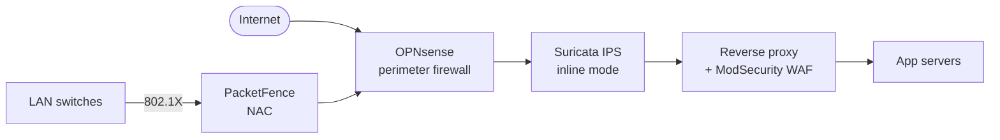

# Open-Source Firewall, IDS/IPS, WAF and NAC

A focused look at the open-source tools that make up the perimeter and inline-defense layers of a defensible network — the firewalls, intrusion detection engines, web application firewalls, and network access control systems that small teams can run without a single license dollar.

## Why this matters

Every commercial next-generation firewall vendor will quote you six figures for an appliance pair, plus subscription, plus professional services. For a regional bank, a regulator-mandated retailer, or a sovereign-state agency that price tag is just the cost of doing business. For `example.local` — a 200-person organisation that needs real perimeter controls but cannot stomach a $80,000 Palo Alto bill — the conversation is different.

The good news: an open-source perimeter stack built around **OPNsense + Suricata + ModSecurity** covers roughly 80% of what a commercial NGFW marketing slide promises. You lose some polish, some vendor-managed threat intel feeds, and some 24/7 telephone support. You gain full control, full inspectability, no rug-pulls, and a budget that fits inside a single FTE salary instead of a multi-year capex line.

- **Perimeter and inline detection are not optional.** Even a tiny office needs a stateful firewall, egress filtering, and some form of intrusion detection on the WAN edge. Skipping these is not "we are too small to care" — it is leaving the door open and hoping no one notices.
- **Commercial NGFW costs scale with throughput, not with risk.** A 1 Gbps appliance pair plus three years of subscription routinely lands around $50k–$150k. The same workload on OPNsense + Suricata runs on a $1,500 mini-PC with the same effective ruleset.
- **The community feeds are real.** Emerging Threats Open and the OWASP Core Rule Set are the same signature bases that several commercial products quietly bundle. You are not running a discount product — you are running the same engine with a different SKU.
- **The trade-off is operator effort.** Open-source perimeter tools require someone to tune them, watch the alerts, and update the rules. If no one will do that work, buy the commercial product. If someone will, the savings are massive.

This page maps the four control families — **firewall, IDS/IPS, WAF, NAC** — to the leading open-source tools, explains where each one fits, and gives you a concrete deployment sketch you can copy.

## Stack overview

The four control families compose into a single inline path. Traffic from the internet hits the perimeter firewall, gets inspected by an IDS/IPS engine, terminates at a reverse proxy with a WAF in front of the application, while NAC enforces who can plug into the LAN.

Read the diagram as a request path, not a deployment diagram. In practice OPNsense, Suricata and the reverse proxy may live on three boxes or one; PacketFence is a separate appliance pair that talks RADIUS to the access switches. The point is the *order* of controls — firewall first, IPS second, WAF closest to the app, NAC governing the L2 access layer.

## Firewalls — OPNsense and pfSense

The two dominant open-source firewall distributions both descend from the same FreeBSD + pf lineage but have diverged in governance and pace.

### OPNsense

OPNsense is a FreeBSD-based open-source firewall and routing platform that forked from pfSense in 2015 over governance disagreements. It bundles a stateful firewall, IPsec/OpenVPN/WireGuard, DHCP, DNS resolver, captive portal, HAProxy, and an inline Suricata IPS — all behind a modern web UI.

- **Key features.** Stateful packet filter, multi-WAN, traffic shaping, IDS/IPS via Suricata or Zenarmor, Netflow export, two-factor admin login, full configuration history with one-click rollback.
- **Plugin ecosystem.** First-party plugins for ntopng, HAProxy, Nginx, Tinc, Zerotier, Telegraf, Sensei (Zenarmor). Plugins are signed and version-pinned to the core release.
- **Release cadence.** Predictable: a major release every six months (year.1 / year.7) with a published roadmap. Security backports land within days.
- **High availability.** Native CARP support for active/passive failover; configuration sync between peers is built in.
- **When to choose.** You want a modern UI, an active maintainer signing each release, and clear governance — and you are willing to learn slightly different idioms from pfSense.

### pfSense

pfSense (community edition, "CE") is the original FreeBSD-based fork of m0n0wall. It is maintained by Netgate, who also sells appliances and a commercial "Plus" edition.

- **Key features.** Same FreeBSD + pf core, stateful firewall, VPN, traffic shaping, package manager with Suricata and Snort.
- **Plugin ecosystem.** Smaller and slower-moving than OPNsense's; some packages have been deprecated in favour of paid Plus-only features.
- **Release cadence.** Community edition releases have lagged Plus, with longer gaps between CE versions in recent years.
- **Hardware story.** Netgate sells appliances pre-loaded with pfSense Plus; the same hardware can run CE if you flash it yourself.
- **When to choose.** You have existing pfSense expertise, a Netgate appliance you want to keep supported, or you specifically need pfSense Plus features in a paid setup.

## OPNsense vs pfSense — comparison

| Dimension | OPNsense | pfSense CE |
|---|---|---|
| Release cadence | Twice yearly, predictable | Irregular, CE lagging Plus |
| GUI | Modern, AJAX-heavy, dark mode | Classic, slower to evolve |
| Plugin ecosystem | Active, signed, version-pinned | Smaller, some deprecations |
| License | BSD 2-clause | Apache 2.0 |
| Governance | Deciso B.V. + community | Netgate (commercial vendor) |
| Fork history | Forked from pfSense in 2015 | Forked from m0n0wall in 2004 |
| IDS/IPS | Suricata (built-in), Zenarmor plugin | Suricata or Snort (packages) |
| Default IPS | Suricata | None until installed |

For a greenfield deployment at `example.local`, OPNsense is the safer pick on governance and release cadence. pfSense remains a fine choice if you already run it and your operators know its quirks.

## IDS/IPS — Suricata, Zeek, Snort

Three projects dominate open-source network detection. They are not equivalent: Suricata and Snort are signature-driven engines that can drop packets inline, Zeek is a protocol-aware logging and scripting framework that observes rather than blocks.

### Suricata

Suricata is a high-performance, multi-threaded IDS, IPS and network security monitoring engine. It speaks the Snort signature language, supports Lua scripting, and emits structured EVE JSON logs that ship cleanly into ELK, Splunk, or Wazuh.

- **Detection approach.** Signature-based with anomaly detection, protocol parsing for HTTP/TLS/SSH/DNS/SMB, and file extraction.
- **Performance.** Multi-threaded by design — scales linearly with cores up to 40+ Gbps with proper NIC offloads (AF_PACKET, RSS, DPDK).
- **Deployment modes.** IDS (passive, SPAN/TAP), IPS (inline, NFQUEUE or AF_PACKET inline), or NSM (logging only).
- **Rule sources.** Emerging Threats Open (free) and ET Pro (paid) cover most general detections; OISF maintains the engine itself under the Open Information Security Foundation.
- **SIEM integration.** Native EVE JSON; Filebeat/Vector ship logs into ELK or Wazuh out of the box.

### Zeek (formerly Bro)

Zeek is not an IDS in the signature sense — it is a network analysis framework that turns packets into rich, protocol-aware logs and runs scripts over them. SOCs use it for forensic depth, threat hunting, and anomaly detection that signature engines miss.

- **Detection approach.** Script-based: Zeek's domain-specific language lets analysts express stateful logic across connections (e.g., "alert if a host beacons every 60s for an hour").
- **Performance.** Single-threaded core but scales horizontally via Zeek Cluster across worker processes.
- **Output.** Per-protocol logs (`http.log`, `dns.log`, `ssl.log`, `conn.log`) — a forensic gold mine for incident timelines.
- **Heritage.** Originated as Bro at Lawrence Berkeley National Lab in the 1990s; renamed Zeek in 2018. Still heavily used in research and academic networks.
- **When to choose.** You want metadata-rich logs and a hunting platform alongside (not instead of) a signature engine.

### Snort

Snort is the original open-source IDS, now in version 3 with a rewritten multi-threaded engine. Maintained by Cisco Talos, it ships with the same commercial-grade Talos rule subscriptions used by Cisco Firepower.

- **Detection approach.** Signature-based, plus preprocessor-based anomaly detection.
- **Performance.** Snort 3 is multi-threaded and competitive with Suricata; Snort 2 was single-threaded and is now legacy.
- **Rule format.** Snort rules; Suricata is largely compatible, which is why ET rules work on both.
- **Subscriptions.** Talos community rules are free with a 30-day delay; current rules require a paid Talos subscription.
- **When to choose.** You have an existing Talos subscription, your team knows Snort, or you specifically want Cisco-aligned rule packs.

## IDS/IPS — comparison

| Dimension | Suricata | Zeek | Snort 3 |
|---|---|---|---|
| Throughput per node | 10–40+ Gbps | 1–10 Gbps per worker | 5–20 Gbps |
| Deployment mode | IDS, IPS, NSM | NSM only | IDS, IPS |
| Rule format | Suricata rules (Snort-compatible) | Zeek scripts | Snort rules |
| Language ecosystem | Lua scripting, EVE JSON | Zeek DSL, very expressive | C++ plugins |
| Default rule source | ET Open, ET Pro | None — community scripts | Talos community + subscription |
| SIEM integration | Native EVE JSON | Per-protocol logs | Unified2 / JSON via plugin |
| Best at | Inline blocking + alerting | Forensic depth, hunting | Cisco-aligned signatures |

Most modern SOCs run **Suricata + Zeek together** — Suricata for alerting and inline blocking, Zeek for the metadata layer that powers hunting and incident response.

## Web Application Firewall — ModSecurity, BunkerWeb, SafeLine, wafw00f

Open-source WAFs split into rule-engine libraries (ModSecurity), all-in-one reverse-proxy distributions (BunkerWeb, SafeLine), and recon tools that fingerprint someone else's WAF (wafw00f).

### ModSecurity

ModSecurity is the original open-source WAF rule engine. It runs as a module inside Apache, Nginx, or IIS and applies a rule language (SecRule) against HTTP requests and responses. It is almost always paired with the OWASP Core Rule Set (CRS) — the open-source rule pack that powers most ModSecurity deployments in production.

- **Role.** Rule engine, not a complete product — you bring the web server and the rule pack.
- **Strengths.** Mature, embedded in Nginx/Apache, OWASP CRS gives a strong baseline against OWASP Top 10 attacks.
- **Weaknesses.** Tuning false positives is a real ongoing job; v3 and the libmodsecurity rewrite have had a complicated maintenance history.

### BunkerWeb

BunkerWeb is a modern Nginx-based WAF distribution that bundles ModSecurity + CRS, anti-bot, rate limiting, and TLS termination behind a single configuration surface. It ships as Docker, Kubernetes, or native Linux packages.

- **Role.** All-in-one reverse proxy with WAF defaults turned on.
- **Strengths.** Sensible defaults, container-native, good fit for a single team running one or two web apps.
- **Weaknesses.** Smaller community than ModSecurity standalone; documentation has gaps on advanced custom rules.

### SafeLine

SafeLine (developed by Chaitin) is a reverse-proxy WAF that uses semantic analysis instead of pure regex matching to detect attacks. It is widely deployed in China and gaining adoption elsewhere.

- **Role.** Standalone reverse-proxy WAF with a polished web UI.
- **Strengths.** Semantic detection claims fewer false positives on obfuscated payloads; easy installer.
- **Weaknesses.** Mostly Chinese-language community; English documentation is improving but still lags.

### wafw00f

wafw00f is not a WAF — it is a reconnaissance tool that fingerprints which WAF a target is running by sending probe requests and matching response signatures. Pentesters use it to plan bypass attempts.

- **Role.** WAF identification, not protection.
- **Strengths.** Recognises 150+ commercial and open-source WAFs.
- **Use case.** Run during external testing or as part of an attack-surface review of `example.local`'s public sites.

## WAF rule engines — OWASP CRS

The **OWASP Core Rule Set** is the open-source rule pack that gives ModSecurity (and any compatible engine) its actual detection logic. CRS rules are organised into categories — SQL injection, XSS, RCE, LFI, protocol violations — and each rule carries a severity score. Requests accumulate scores across all matching rules; once a request passes the **anomaly threshold** (default 5 for inbound), it is blocked.

This scoring model is the key to running CRS in production. A single high-severity rule blocks immediately; multiple lower-severity rules cascade and combine. Tuning a deployment means *adjusting which rules contribute to the score*, not disabling categories wholesale. CRS ships with a "paranoia level" knob (1–4) that controls how aggressive the rule pack is — start at PL1 in monitor mode, climb to PL2 once false positives are tuned.

## Network Access Control — PacketFence, OpenNAC, FreeRADIUS

NAC governs *who and what* can plug into the LAN. The open-source field has three serious players, scaling from full-featured suite to DIY framework.

### PacketFence

PacketFence is the most feature-complete open-source NAC. It supports 802.1X, MAC authentication bypass, captive portals for guest access, BYOD onboarding, VLAN assignment, and integration with RADIUS, LDAP, and Active Directory.

- **Deployment notes.** Requires its own DHCP, DNS, and SNMP read/write access to your access switches. Plan for a clustered pair in production — single-node PacketFence is a single point of failure for network access.
- **When to choose.** Mid-size organisation with managed switches and a real BYOD/guest problem.

### OpenNAC

OpenNAC is a modular NAC framework with a smaller community. It supports 802.1X and inline enforcement and integrates with multiple authentication backends.

- **Deployment notes.** Lighter than PacketFence but with fewer prebuilt integrations and a thinner documentation base.
- **When to choose.** You want a simpler NAC that you can extend in-house, and PacketFence's footprint is too large.

### FreeRADIUS

FreeRADIUS is the de facto open-source RADIUS server. It is not a complete NAC by itself — it is the protocol engine that authenticates 802.1X clients, often glued to a custom policy layer in Python or shell.

- **Deployment notes.** Extremely lightweight. Pairs naturally with LDAP/AD for user authentication and with internal scripts for posture checks.
- **When to choose.** You need 802.1X authentication and your team is happy writing the policy and management glue yourselves.

## Hands-on / practice

Five exercises to make this concrete in a home lab or a sandbox environment for `example.local`.

1. **Deploy OPNsense in a VM with WAN and LAN interfaces.** Spin up an OPNsense VM with two virtual NICs — one bridged to your home WAN, one on an isolated LAN. Walk through the installer, set the LAN IP to `192.168.50.1/24`, enable DHCP on LAN, and confirm a client behind it can reach the internet.
2. **Install Suricata and load the ET Open ruleset.** On a Linux box on the LAN, install Suricata, point it at the WAN-facing interface in IDS mode, and pull the Emerging Threats Open ruleset with `suricata-update`. Generate a test alert by curling a known malware-signature URL from the testmyids.com project.
3. **Deploy ModSecurity in front of an nginx test app and trigger a SQLi rule.** Build a simple nginx + ModSecurity + OWASP CRS container, put a deliberately vulnerable PHP test app behind it, and send a `?id=1' OR '1'='1` request. Confirm the request is blocked at PL1 and that the audit log records rule IDs.
4. **Configure 802.1X port authentication with FreeRADIUS.** Stand up FreeRADIUS, point a managed switch port to it via RADIUS, configure a Linux client with `wpa_supplicant` for EAP-TLS, and confirm the port only opens after the certificate is presented.
5. **Identify which WAF a target uses with wafw00f.** Run `wafw00f https://example.com` against three of your own public sites (with permission). Read the output, then try a second tool (like Nmap's http-waf-detect script) and compare results.

## Worked example — `example.local` perimeter rebuild

`example.local` is a 200-person engineering organisation moving off a small-business "all-in-one" router that has been the entire perimeter for four years. The router has no IDS, no WAF, weak logging, and a forced cloud-management portal. The new design replaces it with a proper open-source perimeter stack.

- **Edge firewall — OPNsense.** Two mini-PC nodes in CARP HA, terminating two ISP uplinks. Stateful filter, IPsec to the cloud VPC, WireGuard for remote workers. Logs shipped via syslog to the SIEM.
- **IDS — Suricata on a SPAN port.** A dedicated mirror port on the core switch feeds a Suricata box running ET Open + a small set of internal custom rules. Alerts land in Wazuh; high-severity alerts page the on-call.
- **Reverse proxy + WAF — Nginx + ModSecurity + OWASP CRS.** All inbound web traffic for `app.example.local` and `api.example.local` terminates at a pair of Nginx nodes in the DMZ. ModSecurity runs at PL1 in monitor mode for two weeks, then flips to block once tuning settles.
- **NAC — PacketFence on the user VLAN.** All access switches reconfigured for 802.1X with PacketFence as the RADIUS backend. Corporate laptops authenticate with machine certificates; phones and BYOD devices get a captive portal and land on a guest VLAN with internet-only egress.
- **Cost.** Hardware: ~$8,000 across the firewall pair, IDS box, two Nginx nodes, and the PacketFence pair. Subscriptions: $0 (using ET Open and OWASP CRS). Engineering: ~3 months of one engineer's time, ongoing ~10% of one FTE.

The previous all-in-one router cost roughly the same per year in subscription. The new stack delivers measurable detection, blocks real attacks during the rollout, and produces logs the SIEM can correlate. That is the open-source perimeter trade-off in one paragraph: you trade dollars for engineer-hours and you get a better outcome.

## Troubleshooting & pitfalls

A short list of mistakes that turn an open-source perimeter from "defensible" into "expensive theatre".

- **IDS without alerting glue is theatre.** Suricata generating a million `eve.json` lines that nobody reads is not detection — it is disk usage. Wire alerts into the SIEM, define which signatures page the on-call, and review the rest weekly. Without that step the IDS is decorative.
- **WAF stuck in monitor-only forever.** Every team plans to flip ModSecurity from "DetectionOnly" to "On" once tuning is finished. Many never do, because there is always one more false positive. Set a hard deadline (two weeks of monitoring, then block) and accept that some legitimate requests will need rule exceptions.
- **OPNsense plugin conflicts on upgrade.** Major OPNsense releases occasionally break third-party plugins. Read the release notes before upgrading, snapshot the VM, and have a rollback plan. Production firewalls upgrade on a maintenance window, not on release day.
- **PacketFence requires real infrastructure.** PacketFence is not a single VM you stand up in an afternoon. It needs DHCP it can control, DNS records, SNMP read/write on every access switch, RADIUS shared secrets, and a clustered backend. Budget weeks, not days, for a real deployment.
- **Rule-set lag time.** ET Open and OWASP CRS are excellent but not real-time — there is a window of hours to days between a new attack technique and a public signature. Pair the open-source feeds with at least one internal detection (a Zeek script, a custom Suricata rule) for the threats specific to `example.local`.
- **Single point of failure on the perimeter.** A standalone OPNsense box is the entire blast radius if it dies. Run CARP HA pairs in production, even at the cost of an extra mini-PC.

## Key takeaways

- **An OPNsense + Suricata + ModSecurity stack covers ~80% of what a commercial NGFW promises**, at a fraction of the cost — provided someone tunes and watches it.
- **Pick OPNsense over pfSense CE for greenfield**: better release cadence, cleaner governance, more active plugin ecosystem.
- **Run Suricata for alerting and inline blocking, Zeek for forensic depth.** They complement each other; mature SOCs run both.
- **WAFs need rule packs.** ModSecurity without OWASP CRS is just a regex engine — CRS is what makes it useful. Tune the paranoia level, set a deadline to leave monitor mode.
- **NAC is heavyweight.** PacketFence works, but plan for the infrastructure dependencies (DHCP, DNS, SNMP, switch config). FreeRADIUS alone is enough for many smaller organisations.
- **Open-source perimeter is engineer-hours, not dollars.** If you have the operator skill, it is one of the highest-leverage swaps in the entire security budget.

## References

- [OPNsense — opnsense.org](https://opnsense.org)
- [pfSense — pfsense.org](https://www.pfsense.org)
- [Suricata — suricata.io](https://suricata.io)
- [Zeek — zeek.org](https://zeek.org)
- [Snort — snort.org](https://www.snort.org)
- [ModSecurity — github.com/owasp-modsecurity/ModSecurity](https://github.com/owasp-modsecurity/ModSecurity)
- [OWASP Core Rule Set — coreruleset.org](https://coreruleset.org)
- [BunkerWeb — bunkerweb.io](https://www.bunkerweb.io)
- [SafeLine — github.com/chaitin/safeline](https://github.com/chaitin/SafeLine)
- [wafw00f — github.com/EnableSecurity/wafw00f](https://github.com/EnableSecurity/wafw00f)
- [PacketFence — packetfence.org](https://packetfence.org)
- [OpenNAC — opennac.org](https://opennac.org)
- [FreeRADIUS — freeradius.org](https://freeradius.org)
- [Emerging Threats Open ruleset — rules.emergingthreats.net](https://rules.emergingthreats.net/open/)
- [MITRE ATT&CK — Network detection mappings](https://attack.mitre.org/techniques/enterprise/)
- Related lessons: [Open-Source Stack Overview](./overview.md) · [SIEM and Monitoring](./siem-and-monitoring.md) · [Vulnerability and AppSec](./vulnerability-and-appsec.md) · [Network Devices](../../networking/foundation/network-devices.md) · [Secure Network Design](../../networking/secure-design/secure-network-design.md)
