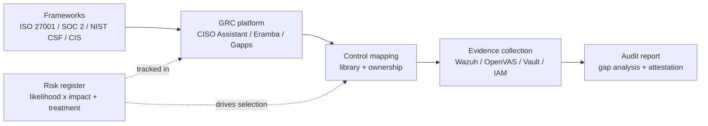

# Open-Source GRC Tools

A focused tour of the open-source governance, risk and compliance stack — the platforms a small security team uses to run a real ISO 27001, SOC 2 or NIS2 programme without paying ServiceNow GRC, OneTrust or Vanta-tier licence fees.

## Why this matters

GRC is how mature security programmes operate at scale. The risk register is where the board sees the threat model, the control library is where every framework requirement lives, and the evidence locker is what the auditor opens on day one of fieldwork. Without a real GRC platform, all three of those artefacts end up in a tangle of spreadsheets, SharePoint folders and tribal memory — which works at five people, struggles at fifty, and collapses at five hundred.

For most organisations the question is not "do we need a GRC tool" but "who pays for it". Commercial ServiceNow GRC, OneTrust, Vanta, Drata, AuditBoard and LogicGate all start cheap for a pilot and climb fast — typical pricing for a 200-person engineering shop runs $30k–$150k per year before audit-firm integrations, framework add-ons or the privacy module are layered on. For `example.local`, that line item competes with a junior security engineer.

Commercial GRC also has a marketing-shaped distortion field. Tools that sell themselves on "automated compliance" tend to overstate what the platform does and understate what the operator still has to do. The honest reading is that no GRC tool — open-source or commercial — eliminates the human work of writing policies, running access reviews and drafting risk treatments. They reduce the spreadsheet overhead, but the substantive compliance work still belongs to people.

The harder problem is not the licence cheque — it is the lock-in and the operating model. Every commercial GRC tool wants to be the system of record for everything, exports its data in shapes nobody else reads, and assumes you will keep paying every renewal. Open-source GRC trades the licence cheque for engineer-hours, but it also keeps the risk register, the control mappings and the evidence catalogue in formats you can read, fork and migrate.

- **Without a GRC tool, audit prep is a fire drill.** Every cycle is a frantic four-week sprint to gather screenshots, dig log files out of decommissioned hosts, and reconstruct the access-review history from email threads. With a GRC tool, the evidence already exists by the time the auditor asks for it.
- **Without a control library, frameworks become opinions.** ISO 27001 has 93 controls, SOC 2 has dozens of criteria, NIST CSF 2.0 has six functions and many subcategories — none of them survive being managed in one person's head. The control library is the canonical "what we promise to do" record.
- **Without policy lifecycle management, policies go stale.** A policy written in 2022 and never reviewed is worse than no policy because it lies to the auditor about how the organisation operates. The lifecycle (owner, version, last review, next review, attestation) is what keeps policies current and credible.
- **Without a risk register, risk is whatever the loudest voice says.** A well-run register gives the board a small, prioritised list of things that could realistically hurt the business — not a 400-row spreadsheet that nobody reads.
- **Open-source GRC is finally credible in 2026.** CISO Assistant CE, Eramba CE, OpenControl and Gapps are real platforms with real communities. They will not match Vanta on automated SaaS connectors out of the box, but they cover the substantive GRC work — register, controls, evidence, audit reports — for SME-scale organisations without the per-user pricing.

This page maps the open-source GRC landscape — full platforms, code-based control documentation, and the integration patterns that connect GRC artefacts back to the operational tools described elsewhere in this section. Cross-reference [Security Controls](../../grc/security-controls.md), [Risk and Privacy](../../grc/risk-and-privacy.md), and [Policies](../../grc/policies.md) for the human side of running the same programme.

Regulators have caught up on this point too. ISO 27001:2022 explicitly requires a documented risk-treatment process and an evidence-backed management review. NIS2 (in scope across the EU since late 2024) imposes board-level accountability for cyber risk that depends on a real risk register being in front of the board. SOC 2 Type 2 fieldwork is structurally an exercise in producing 9–12 months of evidence on demand. None of that is feasible at scale without a GRC tool — the question is just whether the tool is open-source or a commercial line item.

## What a GRC platform actually does

Strip away the dashboards and a GRC platform is a small set of linked databases plus the workflows that keep them honest. Knowing what the platform actually does makes the tool comparison much easier — most of the differences are about which of these primitives the tool emphasises.

- **Risk register.** A list of risks (what could go wrong), each scored on likelihood and impact, owned by a named person, with a treatment plan (accept, mitigate, transfer, avoid) and a review date. The register is the bridge between "the world" and "the controls" — every control should trace back to a risk it reduces.
- **Control library.** The catalogue of controls the organisation has committed to operate, mapped to the frameworks it cares about (ISO 27001:2022 Annex A, SOC 2 Trust Services Criteria, NIST CSF 2.0, CIS Controls v8, PCI DSS 4.0, GDPR, HIPAA). One control often satisfies multiple frameworks, which is why mapping matters more than enumeration.
- **Evidence locker.** The artefacts that prove each control is operating — Wazuh alert exports, Vault audit logs, OpenVAS scan reports, IAM enrolment lists, change-management tickets, training completion records. The locker is what the auditor walks through during fieldwork.
- **Audit and gap reports.** A snapshot of "what does our compliance posture look like right now" — which controls have current evidence, which are overdue, which are unmapped, which risks have no treatment. This is the report the CISO takes to the board and the auditor takes to the partner.
- **Policy and procedure lifecycle.** The actual documents (acceptable use, access control, incident response, business continuity) plus the workflow around them — owner, version, last review, next review, attestation log. The platform turns policies from PDFs-in-a-shared-folder into a tracked register with reminders.

A GRC platform that does these five things well will carry an organisation from "no programme" to "passing SOC 2 Type 1" comfortably. What it will not do is the operating discipline — somebody still has to update the register, collect the evidence, run the access reviews and write the policies. The tool removes the spreadsheet pain; it does not replace the operator.

A useful test when evaluating any GRC tool is to ask "where does each of those five primitives live, and how do they reference each other". A good platform makes the answer obvious — risk has-many controls, control has-many evidence-items, evidence has-many frameworks. A weak platform stores them as flat unrelated tabs that the operator has to keep cross-referenced in their head. The relational model is what determines whether the platform scales past the first cycle.

## Stack overview

The full picture is a flow from external frameworks into the GRC platform, then out into the operational tools that supply evidence and back into the audit-report artefact. The risk register runs in parallel — it informs control selection but lives on a separate cadence.

Read it left to right for compliance and bottom-up for risk. Frameworks tell you "what controls a reasonable security programme operates"; the GRC platform turns that into your control library; the library defines what evidence to collect; the evidence is generated by the operational stack ([SIEM and Monitoring](./siem-and-monitoring.md), [Vulnerability and AppSec](./vulnerability-and-appsec.md), [IAM and MFA](./iam-and-mfa.md)); the audit report is the periodic snapshot. The risk register sits alongside, asking the orthogonal question "are these the right controls to be operating in the first place".

The integration boundary is the part most teams underestimate. A GRC platform that nobody connects to the operational tools becomes shelfware in eighteen months — every quarter the evidence is collected by hand, the operator burns out, and the platform reverts to a glorified policy library. The "evidence pipeline" pattern (covered later) is the thing that keeps the GRC programme alive past the first audit.

Reading the diagram from the operational side is also instructive. The same Wazuh detection that fires for a brute-force login is the evidence for SOC 2 CC7.2 (system monitoring) and ISO 27001 A.8.16 (monitoring activities) and NIST CSF DE.AE (anomalies and events). One operational artefact, three framework controls — which is the whole reason the control library exists as a normalised layer between frameworks and evidence.

## GRC — CISO Assistant (Community Edition)

CISO Assistant CE is a modern open-source GRC platform built by intuitem on a Django + SvelteKit stack. It is the strongest "greenfield" choice in the open-source GRC space — a polished UI, broad framework coverage out of the box, an active community, and Docker-first deployment.

- **What it is.** A full GRC platform covering risk management, AppSec, compliance and audit, and privacy. Frameworks ship pre-loaded — ISO 27001:2022, SOC 2 TSC, NIST CSF 2.0, CIS Controls v8, PCI DSS 4.0, GDPR, HIPAA, NIS2, DORA and a long tail of regional standards (over 80 frameworks at the time of writing).
- **Modern UI.** SvelteKit front-end with a clean, navigable design — risk register, audit, evidence and policy views all look like 2026 software rather than 2010 enterprise GRC. The auto-mapping feature suggests how a control in one framework maps to controls in another, which removes a lot of manual cross-walking work.
- **Strengths.** Broad framework coverage, multilingual UI, Docker Compose deploy that runs in minutes, REST API for integration, active maintenance cadence, growing community on GitHub and Discord.
- **Trade-offs.** Some advanced features (advanced reporting, certain integrations, premium support) live in the commercial Enterprise edition. The community is younger than Eramba's, so there is less long-tail tribal knowledge in forums and Stack Overflow. The CE roadmap moves quickly, which is great for features and occasionally surprising for operators.
- **When to pick it.** Greenfield GRC programmes where the operator wants a modern UI, broad framework coverage and a deployment that does not feel like a 2008 LAMP application. This is the strongest "default" recommendation for `example.local`-shaped organisations starting from scratch in 2026.

The auto-mapping deserves a specific call-out — when you import ISO 27001 and SOC 2 in CISO Assistant, the platform suggests which Annex A controls satisfy which TSC criteria, which is normally a multi-week consulting engagement. The suggestions are not perfect, but they save substantial cross-walking time on the first import.

The deployment story is also unusually friendly for an open-source GRC tool. The upstream Compose file boots Postgres, the backend, the front-end and a worker in a single command, with sensible defaults for development and clear environment variables for production. That removes a class of "we deployed it and gave up after two days" failure modes that historically afflicted open-source GRC.

## GRC — Eramba (Community Edition)

Eramba is the established open-source GRC platform — a LAMP-stack (PHP + MySQL) application with a long history, a deep feature set, and an active enterprise tier (Eramba Enterprise) that funds ongoing development. The CE has been the de-facto open-source GRC choice for a decade.

- **What it is.** A full GRC platform covering risk assessment, policy review, compliance mapping, audit workflows, awareness programmes and custom controls. The CE includes the substantive GRC features; the Enterprise tier adds advanced automation, additional connectors, and premium support.
- **Mature feature set.** Eramba has been refined over many years and the depth of the features (workflow engine, custom report builder, third-party risk module, awareness training tracker) reflects that. A team that knows Eramba well can run a substantial compliance programme in it without reaching for a sidecar tool.
- **Strengths.** Deep feature coverage, established community, well-documented operating patterns, predictable LAMP deployment that any traditional sysadmin can run, clear paid-support escalation path through Eramba Enterprise.
- **Trade-offs.** UI is functional rather than modern — the look and feel is firmly enterprise-software, which suits some organisations and frustrates others. The CE intentionally lacks some automation features that exist in Enterprise (a deliberate commercial split, not a bug). The LAMP stack is conventional but heavier than CISO Assistant's containerised footprint.
- **CE vs Enterprise.** Pick CE when the team is comfortable with manual workflow operation and the budget for paid GRC tooling is zero. Pick Enterprise when automation, integrations and supported upgrades are worth the licence cost — typically when the GRC programme has matured past the bootstrap phase and operator time is the binding constraint.

Eramba's core strength is that it has been doing this for a long time — the workflows, terminology and report patterns reflect decades of accumulated GRC practice. For organisations with traditional IT operations and a preference for established tooling, Eramba CE remains an excellent choice.

A specific Eramba feature worth knowing is the third-party-risk module — every GRC programme eventually needs to track vendor risk (sub-processors under GDPR, vendors with prod access under SOC 2 CC9.2, supply-chain partners under NIS2) and Eramba's third-party module is more capable than what most other open-source tools ship. If vendor management is a primary need rather than an afterthought, Eramba moves up the shortlist accordingly.

## GRC — OpenGRC / OpenControl

OpenControl is a different shape of tool — not a platform with a UI, but a YAML-based schema for documenting security controls in version-controlled text. OpenGRC is the broader umbrella under which open-source GRC efforts (including OpenControl) have historically clustered.

- **What it is.** OpenControl defines a structured YAML format for describing controls, the systems they apply to, and the evidence that proves them. The output is a Git-native control catalogue that lives next to the code it describes. OpenGRC as a label has covered a series of open-source GRC initiatives over the years.
- **Code-based compliance.** The pattern is "controls as code" — the same review, branching and CI workflow that engineers use for application source applies to the control documentation. Pull requests change controls, code review enforces ownership, and CI can validate the YAML before merge.
- **Strengths.** Git-native (perfect version history, blame, review), trivially integrates with DevSecOps pipelines, lightweight (no database to operate), engineer-friendly format, naturally portable between organisations and tools.
- **Trade-offs.** No UI for non-technical stakeholders — the auditor sees YAML, not a dashboard. No risk register, no workflow engine, no evidence locker beyond what the file structure provides. The OpenControl ecosystem has narrowed over time as activity migrated to other tools — check current upstream activity before standardising.
- **When to pick it.** Engineering-heavy organisations that already operate everything else as code (Terraform, Ansible, Kubernetes manifests) and want their compliance artefacts to live in the same model. Often used alongside a UI-based tool rather than as a sole solution.

A common pattern is to use OpenControl-style YAML for the technical-control documentation that engineers maintain, and a CISO Assistant or Eramba instance for the workflow, risk register and policy lifecycle that non-engineers operate. The two complement each other rather than competing.

The historical context matters when evaluating OpenControl in 2026. The format saw substantial adoption in the late-2010s federal-IT and devsecops communities and remains a useful pattern, but the activity around the original OpenControl project has cooled. Treat "compliance as code in YAML" as a durable concept and pick the specific tooling — OpenControl's original schema, OSCAL, or a project-defined YAML — based on what the upstream is doing at evaluation time.

## GRC — Gapps

Gapps is a newer Python-based GRC platform with a friendly UI and an explicit focus on tracking compliance progress against multiple frameworks, with SOC 2 as a particularly strong starting case. It is the youngest of the four tools on this page and is positioned for fast-track compliance work.

- **What it is.** A Flask-based application providing control tracking, policy management, vendor questionnaires, framework mapping and progress reporting. Frameworks supported include SOC 2, NIST CSF, ISO 27001, HIPAA and others.
- **SOC 2 fast-track.** Gapps' control catalogue and workflows are notably well-suited to a first SOC 2 readiness exercise — the platform makes it easy to see "where am I against the criteria" and "what evidence am I missing" without the heavier ceremony of Eramba.
- **Strengths.** Friendly UI, Docker-based deployment, lightweight Python footprint, vendor-questionnaire feature is rare in open-source GRC, good fit for a small team running their first compliance programme.
- **Trade-offs.** Project status has historically been described as alpha / beta — check current upstream activity, release cadence and community size before standardising. Smaller community than CISO Assistant or Eramba means less Stack Overflow corpus and fewer reference deployments to learn from.
- **When to pick it.** A small team, mostly engineers, going for SOC 2 Type 1 in the next 6–9 months, who want the fastest possible path from zero to "tracked control posture". Validate the upstream is healthy at evaluation time.

Gapps' position in the landscape is "the lightest open-source GRC platform that still feels like a real product". For organisations whose primary GRC need is a single SOC 2 programme rather than a multi-framework operating model, it is a plausible choice — with the standard caveat that a project status closer to alpha than 1.0 should drive a careful evaluation before commitment.

The vendor-questionnaire feature is worth a specific mention. SOC 2 CC9.2 and ISO 27001 A.5.19–A.5.23 require the organisation to assess vendor security, which in practice means sending out (and tracking) a security questionnaire to every meaningful vendor. Doing this in a spreadsheet scales badly past ten vendors; Gapps' native questionnaire workflow turns it into a tracked process with reminders and response history.

## GRC — comparison table

| Dimension | CISO Assistant CE | Eramba CE | OpenControl | Gapps |
|---|---|---|---|---|
| ISO 27001 coverage | Yes (2022) | Yes | Manual | Yes |
| SOC 2 coverage | Yes | Yes | Manual | Yes (focus area) |
| NIST CSF coverage | Yes (2.0) | Yes | Manual | Yes |
| CIS Controls coverage | Yes (v8) | Yes | Manual | Partial |
| PCI DSS coverage | Yes (4.0) | Yes | Manual | Limited |
| Risk register | Yes | Yes | No | Yes |
| Evidence linking | Yes | Yes | File-based | Yes |
| Audit-report generation | Yes | Yes | No | Yes |
| Policy lifecycle | Yes | Yes | File-based | Yes |
| UI experience | Modern (SvelteKit) | Functional (LAMP) | None (YAML) | Friendly (Flask) |
| Operator complexity | Medium | Medium-High | Low (text only) | Low-Medium |
| Community size | Growing | Established | Narrowing | Small |

The headline reading: CISO Assistant is the strongest modern-default choice, Eramba is the most feature-complete established choice, OpenControl is the right answer for engineer-led code-as-compliance shops, and Gapps is the fastest path to a first SOC 2. None of these is wrong; the right one depends on the organisation, not the tool.

A column not shown in the table — and arguably the most important one — is "what does this look like to an auditor walking the platform for the first time". CISO Assistant and Gapps tend to interview well because the UI is modern and self-explanatory; Eramba interviews well once the auditor has seen it before but can feel dated on first contact; OpenControl does not interview as a UI at all, but reviews extremely well in a code-walkthrough format. Match the tool to the kind of audit conversation you expect to have.

## Tool selection — when to pick each

A short decision frame for `example.local`-shaped organisations evaluating the four tools.

- **CISO Assistant CE.** The default for a greenfield 2026 programme. Modern UI, broad framework coverage, active community, Docker-first deployment, multilingual support. Pick this when the operator wants tooling that looks like the rest of their stack and the framework coverage matters more than the depth of any single workflow. Especially strong when the team has no existing GRC muscle memory and wants the platform to teach them the workflow.
- **Eramba CE.** The default when the organisation values a mature, deep, established platform and is comfortable with a more traditional UI. Particularly strong for organisations with existing compliance discipline (large enterprises, regulated industries) where Eramba's workflow depth pays back. Clear paid escalation path to Enterprise if budget appears.
- **OpenControl / code-based.** The right answer for engineering-led organisations that want compliance artefacts to live in Git alongside the code they describe. Often paired with a UI-based tool rather than used alone. Pick this when "review compliance changes via pull request" is a feature, not a curiosity.
- **Gapps.** The fastest path to SOC 2 Type 1 for a small team. Friendly UI, Python footprint, vendor-questionnaire support. Pick this when the primary need is a single SOC 2 programme rather than a multi-framework operating model — and validate the project status at evaluation time.

A reasonable hybrid for `example.local` is "CISO Assistant CE for the platform, OpenControl-style YAML in the infrastructure repo for the technical-control documentation, and the [Policies](../../grc/policies.md) lesson's templates for the policy library". The three artefacts live in three places but reference each other cleanly, and each lives where it is easiest to operate.

Whichever tool wins, the most important decision is "who owns this on a Tuesday at 10am". A GRC platform without a named operator on the org chart will decay regardless of how good the software is. Budget the role before the licence — a part-time GRC operator (often paired with the security lead) is the difference between a programme that survives and a tool that becomes shelfware.

## Integrating GRC with the rest of the stack

The pattern that makes a GRC platform durable is the "evidence pipeline" — automated or semi-automated flows from the operational tools into the GRC platform's evidence locker, so the auditor's request lands on artefacts that already exist.

- **SIEM evidence.** Wazuh alert exports, log retention reports and detection-rule coverage map to ISO 27001 A.8.16 (monitoring), SOC 2 CC7 (system monitoring) and NIST CSF DE.CM. Schedule a monthly export of "alerts triaged" and "log retention proof" into the GRC evidence folder for the relevant controls.
- **Vulnerability evidence.** OpenVAS / Greenbone scan reports, patch-cycle metrics and remediation timelines map to ISO 27001 A.8.8 (technical vulnerability management), SOC 2 CC7.1 and PCI DSS 11.3. The evidence is the report plus the ticket history showing remediation.
- **IAM evidence.** Keycloak / Authentik exports of "users with MFA enabled", "privileged-role membership", and "access reviews completed" map to ISO 27001 A.5.16, A.5.17, A.5.18 and SOC 2 CC6.1, CC6.2, CC6.3. Quarterly access-review proof is one of the most-requested audit artefacts.
- **Secrets / PAM evidence.** Vault audit logs, Teleport session recordings and Vaultwarden access logs map to ISO 27001 A.5.17, A.8.5 and SOC 2 CC6.1, CC6.6. The "show me a recording of a production change" auditor question becomes a one-link answer.
- **Backup and DR evidence.** Restore-test results, RTO/RPO measurements and offsite-copy verification map to ISO 27001 A.8.13, SOC 2 A1.2, A1.3 and CIS Control 11. Schedule the restore-test exports straight into the GRC evidence folder.
- **Change-management evidence.** Pull-request approval records, release-tag history and change-advisory-board notes map to ISO 27001 A.8.32, SOC 2 CC8.1 and ITIL change-management practice. Most teams already have this in Git and ticketing — the GRC platform just needs the link.
- **Training and awareness evidence.** Phishing-simulation results, security-awareness completion rates and onboarding-training logs map to ISO 27001 A.6.3 and SOC 2 CC1.4. Most LMS platforms can export this as CSV — schedule the export the same way as the others.

The pattern is the same across all five integrations — the operational tool produces an artefact (export, report, log), the artefact is written to a defined location with a predictable name, and the GRC platform either ingests it via API or links to it in the evidence locker. The cron job that does the export is the difference between "GRC programme that lives" and "GRC programme that dies after the first audit".

A useful design rule for the evidence pipeline is "the auditor should never need shell access". Every artefact should be reachable from the GRC platform via a click — either as an inline link or as an attached file. If the answer to an evidence request is "let me SSH in and grep the logs", the pipeline is broken; the next person on call will not know how to run that grep, and the auditor will lose confidence in the programme.

## Hands-on / practice

Five exercises to make this concrete in a homelab or sandbox for `example.local`.

1. **Deploy CISO Assistant CE in Docker and import ISO 27001.** Run `docker compose up -d` against the upstream `compose.yaml`, log in, create the `example.local` organisation, and import the ISO 27001:2022 control library from the bundled framework catalogue. Walk through Annex A and confirm each control has a control-owner field, a status, and a link to evidence.
2. **Build a risk register with 10 risks.** In CISO Assistant or Eramba, create ten risks for `example.local` (ransomware, insider abuse, vendor breach, MFA bypass, expired TLS, prod data leak, DDoS, lost laptop, phishing, regulatory penalty), score each on likelihood (1–5) and impact (1–5), assign an owner, and set a treatment plan. Export the register as PDF and confirm it reads like a board-ready document.
3. **Map a CIS control to a Wazuh detection rule as evidence.** Pick CIS Control 8 (Audit Log Management). In the GRC platform, attach a Wazuh detection-rule export and a 30-day alert summary to that control as evidence. Document the linkage so the next auditor can see "we operate this control and here is the proof".
4. **Generate a SOC 2 readiness report from Eramba.** Import the SOC 2 TSC into Eramba CE, mark each criterion's status (in place / partial / not in place), generate the gap report, and identify the top 5 gaps. Convert each gap into a Jira-style ticket with an owner and a target date.
5. **Document one example.local control in OpenControl YAML.** Write a YAML file describing the "MFA required for all administrative access" control — with control-id, framework mappings (ISO A.5.17, SOC 2 CC6.1, NIST IA-2), implementation narrative, evidence pointer (link to Keycloak export script) and review cadence. Commit it to a Git repo and open a pull request.

After the five exercises a learner should be comfortable with the import-frameworks loop, the risk-register workflow, the evidence-linking pattern, the gap-report cycle and the controls-as-code pattern. Those five capabilities cover roughly 80% of what an open-source GRC operator does week-to-week.

A useful sixth exercise once those land: wire the GRC platform's OIDC client to the existing Keycloak (from the [IAM and MFA](./iam-and-mfa.md) lesson), so that GRC login uses the same SSO + MFA as the rest of the stack. The plumbing is two screens of configuration, but it removes a class of "shadow-account in the GRC tool" risk and gives the auditor a clean answer to "who can edit the control library".

## Worked example

`example.local` is a 200-person engineering organisation preparing for its first SOC 2 Type I audit. The compliance lead has six months to go from "no GRC platform" to "auditor-ready", and the budget for commercial GRC is zero. The build uses CISO Assistant CE as the platform of record.

- **Platform deployment.** Single CISO Assistant CE instance on a small VM behind the existing reverse proxy, OIDC SSO via the existing Keycloak, daily encrypted database backups to an off-site bucket, monthly restore-test verification. Total stand-up time: one engineer-week.
- **Framework import.** SOC 2 Trust Services Criteria (Security, Availability, Confidentiality at minimum) imported from the CISO Assistant framework catalogue. Each criterion gets an owner from the existing security and engineering team. ISO 27001:2022 imported alongside, with auto-mapping suggesting the Annex A controls that satisfy each TSC criterion — saves substantial cross-walking effort on the first cycle.
- **Risk register.** Twenty risks captured in the first month, scored on a 5x5 likelihood/impact matrix, each with an owner and a treatment plan. The top five (ransomware, prod data leak, lost laptop, vendor breach, MFA bypass) get explicit board attention with a quarterly review cadence.
- **Evidence collection.** Wazuh alert exports, Vault audit logs, OpenVAS scan reports, Keycloak MFA-enrolment list, Teleport session-recording samples and the change-management ticket export are scheduled to write into the GRC evidence folder weekly. Each control points to its corresponding evidence so the auditor can trace from criterion to artefact in two clicks.
- **Gap report and remediation.** The first generated gap report at month two flags 27 partial-or-missing controls. The team works through the gaps over three months — most are documentation gaps (no written policy, no review cadence) rather than technical gaps. By month five the gap report shows three open items, all with targeted dates inside the audit window.
- **Auditor walkthrough.** When the auditor arrives, the SOC 2 TSC view in CISO Assistant becomes the agenda. Each criterion has an owner, a status, evidence links and a control narrative. The auditor's traditional "send me 200 evidence requests" PDF becomes "click these links" — the audit fieldwork shrinks from four weeks to two.
- **Type II preparation.** With Type I in hand, the same platform becomes the basis for the Type II observation period. Evidence pipelines that were "monthly export" during Type I tighten to "weekly export with retention" for Type II, and the gap-report cadence moves from monthly to fortnightly. The platform investment in Type I pays back twice over during the Type II year.

The previous expected cost for a Vanta or Drata subscription plus auditor-firm consulting was approximately $60k for the first year. The open-source rebuild cost approximately $4k of compute and roughly two engineer-months across the build and run-up to the audit. The audit itself succeeded as a Type I clean opinion, and the organisation now has a real platform of record for the Type II window that follows.

The non-financial wins are arguably bigger. The risk register gets reviewed in real board meetings instead of being a document nobody opens. The control library gives every new engineer a clear answer to "what are we required to do here". The evidence pipeline keeps the GRC programme alive past the first audit instead of decaying back into spreadsheets the moment the auditor leaves.

A subtle but important second-order effect is what the rebuild reveals about the rest of the stack. The first time `example.local` tried to gather "list of all users with MFA enabled" for SOC 2 evidence, it surfaced three SaaS apps that were never wired into Keycloak and an admin-shaped service account that nobody could explain. None of those issues were caused by the GRC project — they were already there — but the GRC project is what made them visible and forced their fix. That pattern (compliance work as a forcing function for hygiene) repeats every audit cycle.

## Troubleshooting & pitfalls

A short list of failure modes that turn an open-source GRC project from "win" into "shelfware". Most of these are not novel — they are the same patterns commercial GRC tools hit too — but the open-source stack tends to surface them earlier because there is no managed-service team papering over the rough edges on your behalf.

- **GRC tools without operator process become shelfware.** The most common failure mode is "we deployed Eramba and now nobody updates it". A GRC tool is a system of record, not a magic compliance machine — somebody must own the register, the controls and the evidence on a defined cadence. Without that owner, the tool decays and the next audit is back to spreadsheets.
- **"Evidence as PDF screenshots" anti-pattern.** PDFs of dashboards taken once a quarter are the lowest-value form of evidence — they prove you took a screenshot, not that the control is operating. Wherever possible, evidence should be an exportable, reproducible artefact (a CSV of MFA-enrolled users, a JSON dump of access reviews) that the auditor can spot-check.
- **Framework-version drift.** ISO 27001:2022 is materially different from ISO 27001:2013 in Annex A structure. NIST CSF 2.0 added a new Govern function over CSF 1.1. SOC 2 TSC are revised periodically. A GRC tool loaded with the wrong framework version produces confident-looking reports against an outdated standard. Verify the framework version at import and reconfirm at every annual review.
- **Risk register that nobody updates.** A register imported once and never revisited is worse than no register, because it lies to the board. Build the quarterly register-review into the CISO calendar with the same priority as the operational reviews — and prune dead risks aggressively.
- **CISO Assistant upgrade paths.** CISO Assistant CE moves quickly, and upgrades occasionally need data migrations or configuration changes. Read the upstream release notes before every upgrade, run upgrades in a staging instance first, and back up the database before applying.
- **Eramba CE/Enterprise upgrade and licence transitions.** Moving between Eramba CE and Eramba Enterprise (in either direction) is a manageable but non-trivial migration. Plan the transition window, validate the data export/import cycle in staging, and confirm the licence terms before standardising.
- **Auto-mapping is a starting point, not an answer.** When CISO Assistant suggests "Annex A.5.17 satisfies SOC 2 CC6.1", treat it as a draft. Some mappings are genuinely 1:1, many are partial, and a few are wrong. A human compliance lead must review the mapping before the auditor arrives.
- **Mermaid diagrams broken by smart quotes.** GRC diagrams in this stack assume plain ASCII brackets and arrows. Pasting in smart quotes, em-dashes or non-breaking spaces from a word processor will silently break the render. Edit GRC diagrams in a code editor, not a doc tool.
- **Confusing the GRC tool with the policy library.** A GRC tool tracks the lifecycle of policies (owner, version, review date) but is rarely the best place to draft long-form policy text. Many teams write policies in a wiki or document tool and then attach the approved PDF to the GRC platform. Trying to use a GRC platform as a Word-replacement is a recipe for friction.
- **Backup and DR for the GRC platform itself.** The GRC database holds the risk register, control library and evidence catalogue — losing it is a months-of-rebuild event. Daily encrypted backups, off-site storage, quarterly restore tests. The GRC platform deserves the same DR rigour as production databases.
- **Over-fitting to one auditor's preferences.** Different audit firms ask for evidence in different shapes. Build the evidence pipeline around the framework and the control, not around the specific PDF template the current auditor likes — otherwise next year's auditor change is a full re-tooling event.
- **Letting CE feel like a downgrade from Enterprise.** When evaluating Eramba CE or CISO Assistant CE, do not measure them against the Enterprise feature list — measure them against the spreadsheet they are replacing. The honest baseline is "is the CE better than what we have now", which is almost always yes.

## Key takeaways

The headline points to remember from this chapter, condensed for handover or revision.

- **GRC tools are how mature programmes operate at scale.** Spreadsheets work at five people, struggle at fifty and collapse at five hundred. A real GRC platform is the bridge from "we do compliance" to "we run a compliance programme".
- **CISO Assistant CE is the strongest 2026 default.** Modern UI, broad framework coverage, active community, Docker-first deployment. Pick this for greenfield programmes unless there is a specific reason to go elsewhere.
- **Eramba CE remains the deep-feature establishment choice.** Mature, complete, with a clear paid escalation path. Pick this when traditional GRC depth matters more than UI modernity.
- **OpenControl-style YAML is the right answer for code-led shops.** Compliance-as-code lives in Git, reviews via pull request, integrates with the rest of the engineering workflow. Often paired with a UI tool rather than used alone.
- **Gapps is a fast-track SOC 2 platform** for small teams that need a single framework done quickly. Validate project health at evaluation time before standardising.
- **The evidence pipeline is what keeps GRC alive.** Operational tools (Wazuh, OpenVAS, Vault, Keycloak, Teleport) must produce evidence into the GRC platform on a defined cadence — without the pipeline, the platform decays after the first audit.
- **Risk register and control library are different artefacts.** The register asks "what could go wrong"; the library asks "what do we promise to do". They link, but they live on different cadences and answer different questions.
- **Auto-mapping is a starting point.** Tools that map ISO controls to SOC 2 criteria automatically save real time, but the mapping must be human-reviewed before the auditor sees it.
- **Plan for framework-version drift.** ISO 27001:2022, NIST CSF 2.0 and SOC 2 TSC revisions all matter. Confirm the right version at import and reconfirm annually.
- **Treat GRC as a product, not a project.** The first quarter is the install; every quarter after is updating risks, refreshing evidence, running the gap report and reviewing policies. Budget for ongoing operator time, not just the build sprint.
- **Federate GRC login with the rest of the SSO stack.** Wire CISO Assistant, Eramba or Gapps to the existing Keycloak / Authentik so a leaver's identity is removed from one place, not five. Shadow-accounts in the GRC tool are a quiet but real risk — the auditor noticing them is worse.
- **Do the integration work early.** Operational evidence pipelines (Wazuh, OpenVAS, Vault, Keycloak, Teleport into the GRC evidence locker) take longer to build than the GRC platform itself. Start the integration scaffolding in week two, not month six.
- **Distinguish CE from Enterprise honestly.** Eramba CE and CISO Assistant CE are real products, but neither is identical to its Enterprise sibling. Read the feature-comparison page before standardising and decide whether the gaps matter for the next 24 months — not for the next 5 years.
- **The control library is the pivot.** Every other GRC artefact (risk register, evidence locker, audit report, policy attestations) hangs off the control library. Get the library right — owners, framework mappings, status — and the rest of the platform clicks into place. Get it wrong and every report misleads.
- **Auditors care about repeatability, not perfection.** A control with imperfect-but-consistent evidence beats a control with sporadic perfect evidence. The GRC tool's main job is to make the evidence cadence visible — what was collected when, what was missed, what is overdue.

## References

The vendor and standards references that underpin this chapter — keep these handy when designing or operating the stack.

- [CISO Assistant — intuitem/ciso-assistant-community](https://github.com/intuitem/ciso-assistant-community)
- [Eramba — eramba.org](https://www.eramba.org)
- [OpenControl — open-control.org](https://open-control.org)
- [Gapps — github.com/bmarsh9/gapps](https://github.com/bmarsh9/gapps)
- [ISO/IEC 27001:2022 — Information security management systems](https://www.iso.org/standard/27001)
- [NIST Cybersecurity Framework 2.0](https://www.nist.gov/cyberframework)
- [AICPA SOC 2 — Trust Services Criteria](https://www.aicpa-cima.com/topic/audit-assurance/audit-and-assurance-greater-than-soc-2)
- [CIS Controls v8 — Center for Internet Security](https://www.cisecurity.org/controls/v8)
- [PCI DSS v4.0 — Payment Card Industry Data Security Standard](https://www.pcisecuritystandards.org/document_library/)
- [ENISA NIS2 Directive guidance](https://www.enisa.europa.eu/topics/nis-directive)
- [OSCAL — NIST Open Security Controls Assessment Language](https://pages.nist.gov/OSCAL/)
- [GDPR — General Data Protection Regulation full text](https://gdpr-info.eu)
- [HIPAA Security Rule overview](https://www.hhs.gov/hipaa/for-professionals/security/index.html)
- [SAMA Cyber Security Framework](https://www.sama.gov.sa)
- [DORA — Digital Operational Resilience Act](https://www.eiopa.europa.eu/digital-operational-resilience-act-dora_en)
- [OWASP SAMM — Software Assurance Maturity Model](https://owaspsamm.org)
- [ISACA COBIT — Control Objectives for Information Technology](https://www.isaca.org/resources/cobit)
- [Cloud Security Alliance — CCM (Cloud Controls Matrix)](https://cloudsecurityalliance.org/research/cloud-controls-matrix)
- Related lessons: [Open-Source Stack Overview](./overview.md) · [SIEM and Monitoring](./siem-and-monitoring.md) · [Vulnerability and AppSec](./vulnerability-and-appsec.md) · [IAM and MFA](./iam-and-mfa.md) · [Security Controls](../../grc/security-controls.md) · [Risk and Privacy](../../grc/risk-and-privacy.md) · [Policies](../../grc/policies.md)
