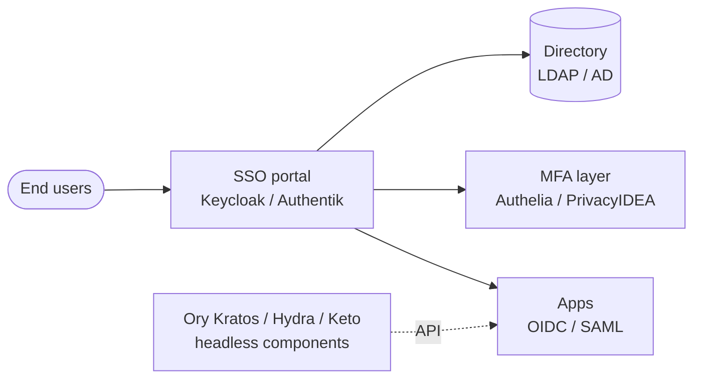

# Open-Source IAM and MFA

A focused tour of the open-source identity and access management stack — the SSO portals, identity brokers, and MFA front-ends that let a small team replace Okta or Auth0 without writing a six-figure cheque.

## Why this matters

Identity is the foundation of every other access control. The firewall rule, the S3 bucket policy, the Kubernetes RBAC binding — all of them resolve back to "who is this principal and what may they do". Get IAM wrong and the rest of the security stack is decorative; get it right and a single account disable shuts off every system at once.

For most organisations the question is not "do we need SSO and MFA" but "who pays for it". Commercial Okta, Auth0, Ping and Microsoft Entra P2 all start cheap and climb fast — typical pricing puts a 500-seat estate between $30k and $120k per year before MFA add-ons, lifecycle add-ons, or the directory premium tier. For `example.local`, a 200-person engineering shop on a flat IT budget, that is a real number that has to come out of headcount somewhere.

The harder problem is not the licence cost — it is the lock-in. Every commercial IdP makes export painful, every custom claim mapper is a one-way door, and every "advanced" feature lives behind one more SKU upgrade. Open-source IAM trades the licence cheque for engineer-hours, but it also trades the lock-in for a stack you can read, fork, and migrate.

- **Without SSO the password-reset desk runs the company.** Every app gets its own credential store, every employee forgets at least one password a quarter, and the helpdesk burns hours on resets that should never have existed. The economic cost of "no SSO" is hidden in helpdesk tickets and shadow-IT account sprawl.
- **Without MFA, credential phishing wins.** Username/password alone is not authentication in 2026 — it is a known-broken control. Every audit framework (PCI DSS 4, ISO 27001, NIST 800-63B) now mandates MFA for privileged or remote access, and incident reports keep proving that the few minutes a year MFA costs users buys back hundreds of incident-response hours.
- **Open-source IAM is battle-tested.** Keycloak runs identity for Red Hat, NASA, and a long tail of Fortune 500 deployments. Authentik, Authelia and the Ory stack power production identity for thousands of organisations. These are not experimental projects — they are mature alternatives with stable releases, active maintainers, and large operator communities.
- **The trade-off is operator effort.** You run the database, you patch the JVM, you debug the OIDC scope mismatch yourself. If your team will do that work, the savings versus commercial IdPs are large and durable. If they will not, paying Okta is the honest answer.

The IAM project also tends to surface a lot of historical hygiene issues — orphaned accounts no one disabled, shared credentials that "just work" in production, MFA-exempt service accounts that became full-power admins, and SaaS apps no one knew existed. The migration to a real IdP is often the first time a 200-person organisation has an honest inventory of who has access to what, which is itself a substantial security win even before the new MFA policy ships.

Regulators have caught up on this point too. ISO 27001:2022 control A.5.17, NIST 800-53 IA-2, and the SAMA Cyber Security Framework all explicitly require centralised identity, MFA for privileged access, and an auditable account lifecycle. The open-source stack on this page satisfies every one of those controls — what it does not do for you is the procedural side (access reviews, joiner-mover-leaver workflow, periodic recertification), which still has to be designed and run by the people side of the organisation.

This page maps the open-source IAM landscape — full identity providers, MFA front-ends, federation patterns — and shows how `example.local` would assemble them into a single coherent stack.

## IAM stack overview

A modern open-source IAM deployment is rarely a single product. End-users authenticate at an SSO portal, the portal brokers to applications via OIDC or SAML, an MFA layer enforces the second factor, and a backend directory holds the source-of-truth identities. The Ory components plug in as headless APIs when a product team wants identity primitives without a bundled UI.

Read the diagram as a control plane, not a deployment topology. Keycloak and Authentik are full SSO portals — they own the login UI and the protocol endpoints, and they typically also own the user database (or federate it from LDAP/AD). Authelia and PrivacyIDEA add or replace the MFA step in front of other systems; Authelia sits in the request path as a forward-auth gate, while PrivacyIDEA sits behind the IdP as a token backend. Ory Kratos and Hydra together cover identity and OIDC, but expect to write the login UI yourself. The arrows represent authentication and authorisation calls — in practice each line is HTTPS plus session cookies plus a healthy dose of TLS chain validation.

The two protocols you will see most often are **OpenID Connect (OIDC)** and **SAML 2.0**. OIDC is the modern default for new web and mobile apps — it is JSON over HTTPS, easy to debug with a token decoder, and has clean library support across every language. SAML is the older standard that dominates enterprise SaaS — Salesforce, Workday, and most legacy on-prem suites speak it natively. Any serious open-source IdP supports both, because the moment you connect a real-world app catalogue you will need both.

A third protocol worth knowing is **SCIM 2.0** for cross-domain user provisioning. SCIM is what makes "create a user in the IdP and have them appear in Slack, GitHub, and Salesforce automatically" possible without writing custom sync scripts. Keycloak ships SCIM via extensions; Authentik supports it natively; commercial IdPs sell it as a premium feature. For any organisation with more than a handful of integrated SaaS apps, SCIM is the difference between scaling provisioning and being permanently behind on offboarding.

## Identity provider — Keycloak

Keycloak is the de-facto open-source enterprise IdP. Originally built by Red Hat and now governed under the CNCF as part of the Cloud Native Computing landscape, it is a Java application (Quarkus-based since v17) that bundles SSO, identity brokering, user federation and MFA into a single web product. It powers identity for Red Hat's own SaaS portfolio and is widely deployed in regulated environments where the trade-off of operator complexity for total feature coverage makes sense.

- **Protocols.** OpenID Connect 1.0, OAuth 2.0, SAML 2.0, plus a REST admin API. SCIM 2.0 user provisioning is available via extensions. Token exchange (RFC 8693), CIBA, and device authorisation grant are all supported in recent versions.
- **Identity sources.** Native user database (PostgreSQL, MariaDB, etc.), LDAP and Active Directory federation (read/write with attribute mapping), and identity brokering to upstream IdPs (Microsoft Entra, Google, GitHub, any OIDC/SAML provider). Custom user storage SPIs let you back the user store with anything you can write Java for.
- **MFA built in.** TOTP, WebAuthn (FIDO2 security keys and platform authenticators), and recovery codes — all configurable per-realm with conditional flows. The flow editor lets you make MFA mandatory for some clients, optional for others, and trigger step-up auth via `acr_values`.
- **Strengths.** Mature, widely deployed, large ecosystem of integrations and Helm charts, full admin UI plus CLI (`kcadm.sh`), realm-level multi-tenancy, deep customisation through SPIs and themes.
- **Trade-offs.** Java/Quarkus footprint is heavy (1–2 GB RAM minimum for a real deployment), the admin UI is functional but not pretty, and major version upgrades — especially the Wildfly-to-Quarkus migration in 17 — have historically required careful planning and downtime.

The realm model is the key concept to grasp early. Each realm is an isolated identity tenant — its own users, its own clients, its own authentication flows, its own MFA policy. Most single-organisation deployments end up with one realm for employees and a separate `master` realm reserved for Keycloak administrators only. Multi-tenant SaaS deployments may run hundreds of realms in a single cluster, with shared themes and per-tenant configuration.

Keycloak's clustering story matters in production. It uses Infinispan for distributed caches (sessions, login attempts, realm metadata) and expects an external relational database for persistent state. A two-node cluster behind a load balancer with PostgreSQL streaming replication is a sensible baseline; sticky sessions are no longer required as of recent versions, but the cache topology still rewards thoughtful Helm chart sizing.

Theming is one of Keycloak's quiet superpowers. The login pages, account console, and email templates are all themable — you can ship a branded login experience that matches the rest of the corporate web estate, which makes Keycloak feel less "open-source compromise" and more "first-class identity product" to end-users. Themes are also where most professional Keycloak deployments hide the "powered by Keycloak" footer that the default templates include.

The Keycloak admin REST API is also worth keeping in mind for automation. Every action in the UI is reachable as an HTTP call, which means realm exports, user bulk operations, and provisioning workflows can all be scripted from CI or Ansible. Several teams now treat the realm export JSON as their infrastructure-as-code artefact for IAM and review changes via pull request before applying.

For an organisation that wants a single product covering SSO + brokering + MFA out of the box, Keycloak is the default open-source answer.

## Identity provider — Authentik

Authentik is the modern UI-first alternative to Keycloak — a Python/Django application with a polished admin interface and a flow-based authentication model. It is younger than Keycloak (launched 2018) but has gained substantial traction in self-hosted communities and SMB deployments where admin experience and quick setup outweigh the deepest integration coverage.

- **Protocols.** OAuth 2.0, OpenID Connect, SAML 2.0, LDAP (server and client), SCIM, plus a built-in proxy provider for forward-auth use cases that lets it cover the same Authelia-style territory without a second component.
- **Flows model.** Authentication, enrollment, recovery and authorisation are all expressed as configurable "flows" — chains of stages (identification, password, MFA, consent, etc.) you can reorder visually. This is dramatically more approachable than Keycloak's authentication SPI for non-Java teams, and makes "require WebAuthn for the admin group, password-only for everyone else" a five-minute change.
- **MFA built in.** TOTP, WebAuthn, SMS, email, Duo, static codes — all wired in as flow stages with sensible default templates.
- **Strengths.** Modern UI, sensible defaults, good Docker/Helm story, active community, built-in reverse-proxy mode for protecting non-OIDC apps, single-binary outpost workers that simplify deployment.
- **Trade-offs.** Smaller ecosystem than Keycloak, fewer enterprise federation hooks, and the flows model — while powerful — has its own learning curve when policies become non-trivial.

The "outpost" concept is worth understanding. An outpost is a small worker process that Authentik deploys alongside another service — a reverse-proxy outpost in front of a non-OIDC app, an LDAP outpost exposing the Authentik directory as an LDAP server, a RADIUS outpost for VPN integration. Outposts talk back to the central Authentik server via a websocket and let one Authentik install cover many integration patterns without bolting on separate components.

Authentik's "blueprints" feature lets configuration live as YAML files in version control rather than only in the admin UI. This is a genuine advantage for teams that want their identity configuration code-reviewed alongside the rest of their infrastructure — provider definitions, application bindings, group mappings and flows can all be declared in YAML and applied automatically on startup, which makes disaster recovery and environment promotion much cleaner than click-ops on a database.

A useful comparison point against Keycloak: Authentik tends to feel snappier in the admin UI, has a gentler initial learning curve, and produces shorter "first working integration" timelines. Keycloak tends to win on the long tail — obscure SAML edge cases, deeper customisation through Java SPIs, and the sheer breadth of community-maintained adapters. For most organisations either tool will do the job; the choice often comes down to the team's existing language preferences and how much they value bundled CNCF maturity over modern UX.

For a greenfield deployment where UI and operator experience matter as much as protocol coverage, Authentik is the strongest open-source competitor to Keycloak.

## Identity provider — Ory Stack (Kratos, Hydra, Keto)

Ory is a different shape of project: instead of one bundled product, it ships a family of headless, single-purpose Go services that compose into a custom IAM platform. The trade-off is obvious — you write your own login UI and integration glue, but you get a microservices-friendly toolkit you can shape to your stack and iterate on without fighting a bundled portal.

- **Ory Kratos.** Identity management — registration, login, password reset, profile management, MFA enrollment. Pure REST API; the login UI is your problem (Ory ships a reference UI in Node, but production teams typically write their own in their main app's framework).
- **Ory Hydra.** OAuth 2.0 and OpenID Connect provider. Hydra issues tokens and runs the protocol; it does not authenticate users itself — it delegates to Kratos or any other login system you wire in via the consent and login challenge endpoints.
- **Ory Keto.** Permission and relationship-tuple service inspired by Google's Zanzibar paper. Models fine-grained authorisation ("user X has role editor on document Y") at scale, with the same tuple-store + check-API pattern Zanzibar pioneered.
- **When to choose.** You are building a SaaS or platform that wants IAM primitives as services, your engineering team is comfortable in Go and REST, and you do not want to fight a bundled UI you cannot fully customise. Ory shines when identity is *part of the product* rather than an internal IT function.
- **When to avoid.** You are a small IT team looking for "an SSO portal we can install" — Ory will feel like a kit of parts when you wanted a finished product, and the time to first working login is measured in weeks rather than hours.

The Zanzibar-inspired design of Keto is the most distinctive piece. Where most authorisation systems ask "what role does this user have", Keto stores explicit relationship tuples ("user:alice is editor of doc:report-2026") and answers permission checks by walking the graph. This model scales to billions of relationships and supports indirect authorisation ("anyone in group X who has role Y on parent folder Z"), which is hard to express in classic RBAC.

Two other Ory components deserve a mention even though they are outside the headline trio. **Ory Oathkeeper** is an identity-aware reverse proxy that enforces access decisions at the edge — think of it as the Ory analogue to Authelia's forward-auth pattern. **Ory Hive** and the various developer-focused SDKs round out the surface area for teams building identity into a SaaS product. None of these are required for a basic deployment, but they are useful to know about when designing a full Ory-based architecture.

The Ory project's commercial sustainability story also deserves attention. Ory is an open-core company — the components are Apache 2.0 and self-hostable, but the recommended path for production is Ory Network, the hosted commercial service. This is not a problem in itself, but it does mean the polish of new features tends to land in Ory Network first and the self-hosted path can lag. For long-term planning, decide up front whether you are committing to self-hosting Ory or treating Ory Network as your real target.

Ory also offers Ory Network as a hosted commercial offering, which can be a smoother on-ramp than self-hosting the stack from scratch — a good "buy now, self-host later" path for teams who want the architecture without the day-one operational burden.

## Keycloak vs Authentik vs Ory — comparison

| Dimension | Keycloak | Authentik | Ory Stack |
|---|---|---|---|
| Architecture | Monolith (Java/Quarkus) | Monolith (Python/Django) | Microservices (Go) |
| Bundled UI | Yes (admin + login) | Yes (admin + login) | No — bring your own |
| OIDC + SAML | Both | Both | OIDC (Hydra), SAML via add-ons |
| Identity brokering | Strong | Strong | Via Kratos hooks |
| MFA built in | TOTP, WebAuthn, recovery | TOTP, WebAuthn, SMS, Duo | Via Kratos |
| Resource footprint | Heavy (1–2 GB RAM+) | Medium (~512 MB) | Light per service |
| Operator complexity | Medium | Low–Medium | High |
| Best for | Enterprise SSO, brokering | Greenfield + UX-sensitive | Microservices platforms |

For most `example.local`-shaped organisations the choice collapses to Keycloak (if you want the most mature and widely supported option) or Authentik (if you want a friendlier admin experience). Ory is a deliberate choice for teams building identity into a product, not for IT departments standing up SSO for an existing app catalogue.

A useful sanity check: if the team running the IdP is the same team building applications, Ory is plausible. If the team running the IdP is the IT or platform team, and applications are bought or run separately, Keycloak or Authentik is the right shape — bundled UI, bundled admin tools, bundled MFA, all visible to ops without writing code.

A second useful comparison: how much customisation will you actually need versus how much you think you need on day one? Most organisations dramatically over-estimate their need for unique authentication flows and dramatically under-estimate the cost of maintaining custom code in their IdP. Default flows in Keycloak or Authentik solve the 90% case; resist the urge to fork until you have hit a real wall in the defaults.

## MFA — Authelia

Authelia is a lightweight authentication and authorisation portal designed to sit in front of nginx or Traefik via the **forward-auth** pattern. It is a single Go binary, configured by a YAML file, and is by far the easiest way to put MFA in front of a collection of internal Docker-based web apps that do not natively support OIDC or SAML. The whole product fits comfortably on a Raspberry Pi if it has to.

- **Pattern.** The reverse proxy forwards every inbound request to Authelia's `/api/verify` endpoint; Authelia checks the session cookie and policy, returns 200 or 401, and the proxy lets the request through or redirects to the login portal. This makes any HTTP-served application "MFA-protected" without touching the application itself.
- **MFA support.** TOTP, WebAuthn (FIDO2), Duo push, plus password-only for low-sensitivity access tiers. Per-domain access rules let you mix MFA-required and password-only routes in a single policy file.
- **Identity backends.** Local YAML/SQL user file or LDAP/AD — the LDAP integration is solid enough to use against a real Active Directory in production.
- **Strengths.** Tiny footprint, excellent Docker/Compose story, sensible defaults, plays well with the existing reverse-proxy stack at most homelabs and small shops, easy to read and reason about.
- **Trade-offs.** Not a full IdP — no SAML, limited OIDC issuer support (added in recent versions but less mature than Keycloak), session-cookie SSO is scoped to a single domain root, and the YAML configuration grows quickly when policies become rich.

The forward-auth pattern itself is worth knowing in general — both nginx (`auth_request` directive) and Traefik (`forwardAuth` middleware) implement it, and several other tools (Authentik's outpost, oauth2-proxy, vouch-proxy) use the same shape. Once you understand "the proxy asks an external service whether to allow each request", you can swap the implementation without changing the apps.

The trade-off versus a real OIDC integration is observability. A forward-auth gate sees the URL and the user but not the application's notion of the user — there is no single sign-on at the application layer, so the app still treats every request as anonymous. For internal admin UIs that is fine; for anything that needs per-user audit logs inside the application, a real OIDC integration is the right answer.

Authelia is the right pick when you want to add MFA + SSO to a fleet of internal admin UIs (Grafana, Jellyfin, Nextcloud, Portainer, etc.) without standing up a full Keycloak cluster.

## MFA — PrivacyIDEA

PrivacyIDEA is a comprehensive token management server — a Python/Flask application that focuses on the *token lifecycle* rather than on being an IdP itself. It treats authentication as a separate concern and is typically wired into another front-end (FreeRADIUS, Keycloak, SAML provider) as the second-factor backend. Think of it as the open-source equivalent of an RSA SecurID or Duo administration console.

- **Token coverage.** TOTP, HOTP, WebAuthn/FIDO2, YubiKey (multiple modes — OTP, HMAC, FIDO2), smartcards, SMS and email OTP, paper TANs, push tokens, U2F, plus integrations for several hardware vendor protocols. Few products match the breadth.
- **Use cases.** Hardware-token-heavy environments — government, healthcare, finance — where YubiKeys, smartcards or older OTP devices are the primary second factor and where the audit story has to satisfy a regulator rather than an internal architecture review.
- **Integrations.** FreeRADIUS plugin, Keycloak provider extension, SAML, LDAP proxy, REST API for custom apps. The FreeRADIUS path in particular makes PrivacyIDEA the standard answer for "MFA on a VPN" or "MFA on an SSH bastion".
- **Strengths.** Best-in-class token type coverage, mature audit logs, designed for compliance-heavy deployments, granular RBAC for help-desk roles (e.g., "this support agent may unbind a lost token but not enrol a new one").
- **Trade-offs.** Heavier to operate than Authelia, less polished UI than Authentik, and most useful when paired with a separate IdP rather than alone.

The token lifecycle features are what set PrivacyIDEA apart in real audits. Each token has an enrolment date, an owner, an audit trail of every authentication attempt, a revocation history and an optional expiry. Help-desk staff can mark a token lost (rolling over to a backup), reset failed-attempt counters, and reassign hardware tokens between users without dropping the audit chain. That level of operational rigour is what regulated environments need and what Authelia's YAML files do not provide.

PrivacyIDEA also supports **policies** as a first-class concept — declarative rules that say things like "all engineers must enrol at least one FIDO2 token within 30 days", "no token may have more than 5 consecutive failed attempts before lockout", or "the help-desk role may unbind tokens but not enrol new ones for the finance OU". Policies are evaluated on every API call and are themselves auditable, which gives you a clean place to encode the security team's intent without scattering it across application configuration files.

The integration story matters in production. PrivacyIDEA is most often deployed as the second-factor backend for FreeRADIUS (which then fronts VPNs, SSH bastions, and network device logins) and as a Keycloak provider extension for the rest of the SaaS stack. This dual deployment means a single token enrolment covers both the network and the application layer — a real operational simplification when an engineer needs the same YubiKey to authenticate to the VPN, GitLab, and the cloud console.

PrivacyIDEA is the answer when "we need to enrol 200 YubiKeys and a few hundred smartcards across multiple apps" is the actual requirement.

## MFA — Keycloak's built-in MFA

Keycloak's authentication flows make it a competent MFA provider in its own right — for many organisations the built-in MFA is sufficient and removes the need for a separate token server in the architecture diagram.

- **Token types.** TOTP (Google Authenticator, Authy, etc.), WebAuthn (FIDO2 security keys and platform authenticators like Touch ID/Windows Hello), and recovery codes printed during enrolment.
- **Conditional MFA.** Authentication flows let you require MFA only for specific clients, IP ranges, user groups, or risk signals — e.g., "MFA always for admins, MFA off-network for everyone else, MFA always for the Salesforce client regardless of group". Conditions stack and execute in order, which is powerful but takes some practice to read.
- **Step-up authentication.** OIDC `acr_values` lets a high-sensitivity application request a stronger authentication tier on demand, even within an existing session — the pattern that makes "session-long for the wiki, re-prompt for production deploys" possible without two separate IdPs.
- **Why often enough.** The combination of TOTP for the workforce + WebAuthn for engineers and admins covers the realistic threat model for most organisations. Reach for PrivacyIDEA only when you genuinely need the wider token catalogue (smartcards, push tokens, vendor OTP devices).

WebAuthn deserves a special note. It is the FIDO2 web standard for hardware-backed authentication and is dramatically more phishing-resistant than TOTP — a TOTP code can be relayed to a phishing site within its 30-second window, but a WebAuthn assertion is bound to the origin and refuses to authenticate against the wrong domain. Every modern browser and every recent operating system supports it, and Keycloak's WebAuthn flow makes enrolment a single click for a user with a YubiKey or a Touch ID-equipped Mac.

Recovery codes are the unloved but essential safety net. Every TOTP and WebAuthn enrolment should hand the user a small set of one-time recovery codes that work as a fallback second factor — print them, store them in a password manager, and treat them as sensitive. Without recovery codes, a lost YubiKey becomes a help-desk ticket and a manual identity-proofing event; with them, the user gets back in within minutes and the help-desk only has to reissue the code set.

A second backup factor is the other half of the recovery story. The right pattern is "two YubiKeys per user, both enrolled, one carried and one stored at home" — losing the carried key is annoying but not blocking, because the stored key still works and the user can enrol a replacement at their own pace. Cheap-out on this and the first lost key becomes a Friday-evening pager event for the on-call IT engineer.

If you have already chosen Keycloak as your IdP, start with its native MFA and only layer PrivacyIDEA on top when token requirements outgrow what Keycloak ships.

## Federation and brokering

The most common open-source IAM pattern at small and mid-size organisations is not "Keycloak as the only directory" — it is **Keycloak as a broker** in front of an upstream identity source. This pattern is so common it deserves its own section.

- **Why broker.** Your existing employees already live in Microsoft Entra, Google Workspace, or on-prem AD. You do not want a second source of truth — you want one identity, federated into all the open-source apps that do not speak Entra natively or whose Entra integration costs an extra licence tier.
- **How it works.** Keycloak (or Authentik) is configured as an OIDC/SAML identity broker. End-users click "Sign in with Entra" at the Keycloak login page; Keycloak redirects them to the upstream IdP, receives the assertion, normalises the claims, and then issues its own OIDC/SAML tokens to the downstream applications. From the app's perspective it is talking to one IdP — Keycloak — without ever needing to know about the upstream.
- **What you gain.** A protocol translation layer (Entra speaks SAML and OIDC; many open-source apps speak only one or only OIDC with quirks), a single integration point for new apps, a place to layer additional MFA or attribute mapping, and a clean audit boundary. Adding a new SaaS to the SSO catalogue becomes a Keycloak-only change rather than an Entra-admin ticket.
- **What you give up.** A small extra hop in every login flow, and one more thing to monitor — but the integration cost savings on every new app are worth it, and the broker becomes the natural place to enforce additional MFA on top of whatever the upstream IdP provides.

A practical wrinkle worth knowing: when Keycloak brokers an upstream IdP, the upstream session cookie and the Keycloak session cookie are independent. A user who signs out of Entra is not automatically signed out of Keycloak, and vice versa. Configure single logout (SLO) carefully — both SAML SLO and OIDC back-channel logout are quirky in practice, and many teams end up with shorter Keycloak sessions as a pragmatic compromise.

Attribute mapping is the other federation detail that bites teams late. The upstream IdP uses one set of claim names (`upn`, `oid`, `groups` from Entra; `email_verified` and various Google extensions from Google Workspace), and downstream apps expect another (`email`, `preferred_username`, `roles` per OIDC norms). Keycloak's protocol mappers translate between the two, but the mapping has to be configured per-broker and per-client — it is not magic, and an unmapped claim is just an empty value in the issued token.

Group-claim handling deserves special care. Most apps drive authorisation off a group claim, but the upstream IdP's group representation (object IDs in Entra, full DNs in AD, simple strings in Google) rarely matches the format the app wants. Plan a transformation step in the broker — flatten DNs to short names, look up Entra group display names, or map upstream groups onto a curated set of downstream roles — and document it as the source of truth for "who can see what" in the SSO catalogue.

This pattern is so widespread that "Keycloak as broker for Microsoft Entra" is effectively the default open-source IAM design for organisations already on Microsoft 365.

## Tool selection — comparison table

| Need | Pick | Notes |
|---|---|---|
| Full enterprise IAM with SSO + brokering | Keycloak | The default open-source IdP; widest integration support |
| Greenfield + great admin UX | Authentik | Modern UI, flow-based config, easier learning curve |
| Identity primitives for a microservices product | Ory Kratos + Hydra + Keto | Headless, Go, API-first |
| MFA in front of Docker-based admin UIs | Authelia | Forward-auth with nginx/Traefik, tiny footprint |
| Hardware-token-heavy MFA (YubiKey, smartcards) | PrivacyIDEA | Widest token catalogue, compliance-friendly |
| Simple TOTP/WebAuthn for an existing Keycloak | Keycloak built-in MFA | No extra component needed |
| Broker Microsoft Entra into open-source apps | Keycloak (or Authentik) | The dominant federation pattern |

There is no shame in mixing tools — `example.local` ends up running Keycloak as the IdP plus PrivacyIDEA for hardware tokens plus Authelia for a couple of legacy admin UIs. That is the normal shape of an open-source IAM stack. The mistake is choosing a single product and bending it to do every job badly when two complementary products would each do their job well.

Sequence the rollout deliberately. Phase one is the IdP itself with a small pilot group of internal apps; phase two extends OIDC integration across the SaaS catalogue; phase three adds MFA enforcement, starting with admins and moving to general staff over a defined window; phase four hardens with hardware tokens, step-up authentication, and federation to upstream IdPs. Trying to deliver all four phases on day one is the most common reason open-source IAM projects stall.

Allow extra slack for the human side. Telling 200 engineers to enrol a YubiKey, training the help-desk on the new self-service flows, and writing the "what to do if your key is lost" runbook will take longer than the technical install. Plan a communication and training stream alongside the technical stream, and aim to have docs and screencast tutorials ready before the first all-hands MFA announcement.

## Hands-on / practice

Five exercises to make this concrete in a homelab or sandbox for `example.local`.

1. **Deploy Keycloak in Docker and create a realm.** Run `docker run -p 8080:8080 -e KEYCLOAK_ADMIN=admin -e KEYCLOAK_ADMIN_PASSWORD=admin quay.io/keycloak/keycloak:latest start-dev`, log into the admin console, create a realm `example-local`, add a test user with a password, and confirm you can log in as that user via the account console at `/realms/example-local/account`.
2. **Configure OIDC for a sample app.** In the same realm, create a public OIDC client `demo-app`, set the redirect URI to `http://localhost:3000/*`, then deploy a tiny sample app (oidc-client-js demo, or Grafana with OIDC enabled) and confirm the SSO redirect, login, and token exchange end-to-end. Inspect the resulting JWT in jwt.io to see the claims.
3. **Enable WebAuthn for users.** Add the WebAuthn authenticator to your browser flow, register a security key (YubiKey or platform authenticator like Touch ID/Windows Hello) on the test user, and verify the login now requires the second factor. Bonus: register a second key as a backup and confirm either works.
4. **Set up Authelia in front of an nginx test app.** Deploy a Docker Compose stack with nginx + a dummy app + Authelia, configure `auth_request` forward-auth in nginx, enrol TOTP for the test user, and confirm any direct request to the protected URL bounces through the Authelia portal. Read the access policy YAML and add a second rule for a sub-path.
5. **Integrate PrivacyIDEA tokens with Keycloak as step-up MFA.** Install the PrivacyIDEA Keycloak provider, enrol a TOTP token in PrivacyIDEA for the test user, configure a Keycloak authentication flow that calls PrivacyIDEA as the second factor, and verify the OIDC token exchange now includes the PrivacyIDEA challenge for high-sensitivity clients only.

After the five exercises a learner should be comfortable creating realms and clients, integrating an app via OIDC, enrolling and validating WebAuthn, deploying forward-auth in front of arbitrary HTTP services, and chaining a token backend behind an IdP for step-up scenarios. Those five capabilities cover roughly 80% of what an open-source IAM operator does on any given week.

A useful sixth exercise once those land: federate the lab Keycloak to a free Entra tenant or Google Workspace test account, configure attribute mapping for `email` and `groups`, and confirm that a sign-in via the upstream propagates the right claims into the downstream OIDC token. This is the single experience that most clearly shows why brokering, not forking, is the dominant pattern.

A seventh exercise for teams aiming at production: stand the lab Keycloak up in Kubernetes with the official Helm chart, point it at a managed PostgreSQL, and run a chaos test by killing a pod mid-login. The behaviour you want to see is "the user retries and gets in" — anything else (long delays, stuck sessions, full session loss) is a clustering misconfiguration that you would much rather catch in a lab than in production at 3am.

## Worked example — `example.local` IAM rebuild

`example.local` is a 200-person engineering organisation whose entire IAM strategy used to be "the Salesforce admin password lives in 1Password and three people know it". Every SaaS had its own user list, MFA was enforced inconsistently, and offboarding a leaver took the IT lead a day of clicking through admin consoles. The rebuild replaces that anti-pattern with a real open-source IAM stack.

- **Central IdP — Keycloak.** Two Keycloak nodes behind a load balancer, PostgreSQL HA backend, single realm `example-local`. Keycloak federates to the existing Microsoft Entra tenant for the workforce identity source, which means no shadow user database and no "where do I add a new joiner" ambiguity.
- **App integration — OIDC.** Salesforce, GitLab, Grafana, internal admin UIs and the wiki are all configured as OIDC clients in Keycloak. Provisioning happens via SCIM where the app supports it, manually otherwise. Disabling a leaver in Entra now logs them out of every connected app within minutes.
- **MFA — WebAuthn for engineers.** Every engineer enrols a YubiKey 5 (and a backup) as a WebAuthn credential in Keycloak. The default flow requires WebAuthn for the engineering group; TOTP is the fallback for non-engineers and contractors.
- **Hardware tokens — PrivacyIDEA + YubiKey for IT admins.** The IT and security teams enrol their YubiKeys in PrivacyIDEA (HOTP and FIDO2 modes), and Keycloak calls PrivacyIDEA as a step-up factor for any access to admin clients (Keycloak admin console, Vault root tokens, AWS root account console, the on-call paging system).
- **Internal admin UIs — Authelia.** A handful of legacy admin tools that do not speak OIDC (older switches' web UIs, a custom dashboard, etc.) live behind nginx + Authelia, with TOTP enforced and group membership pulled from LDAP for policy decisions.
- **Cost.** Hardware: ~$3,000 across the Keycloak pair, PrivacyIDEA box and Authelia VM. YubiKeys: ~$8,000 for full engineering and admin coverage. Subscriptions: $0. Engineering: ~2 months of one engineer's time, ongoing ~10% of one FTE.

The previous Okta quote for the same coverage was $48k/year. The open-source rebuild pays back in under six months and leaves `example.local` with a stack they fully control — no per-seat licence escalation, no surprise SKU repackaging, and a clear audit trail end-to-end.

The non-financial wins are arguably bigger. Offboarding now happens in Entra and propagates everywhere within minutes. New-joiner provisioning happens once instead of in five admin consoles. The audit team has a single source of truth for "who logged into what when". And the next time the IAM stack needs to change, `example.local` controls the upgrade path rather than waiting for a vendor's roadmap.

The migration timeline is worth being honest about. The Keycloak install and the first three OIDC integrations took two weeks. Reaching coverage of every internal app took another month. Rolling out WebAuthn enrolment to all engineers — the human side of the project, not the technical side — took six weeks of communication, training, and patience. The honest total was about three months from green-field to "the password reset desk is no longer a thing", which is fast for a project of this scope but not the one-week story sometimes implied by vendor marketing.

What `example.local` would do differently in retrospect is invest earlier in monitoring. The first month after launch surfaced a steady trickle of "I cannot log in" tickets that turned out to be cache invalidation issues across the Keycloak pair, and the team only spotted the pattern because users were vocal. Wiring Keycloak's metrics endpoint into the existing Prometheus + Grafana stack on day one would have caught the issue automatically and saved a week of guesswork.

## Troubleshooting & pitfalls

A short list of failure modes that turn an open-source IAM project from "win" into "regret". Most of these are not novel — they are the same patterns commercial IdPs hit too — but the open-source stack tends to surface them earlier because there is no managed-service team papering over the rough edges on your behalf.

- **Keycloak upgrade pain — Quarkus migration.** Keycloak 17 swapped Wildfly for Quarkus, with breaking changes to startup options, configuration files, and the SPI interfaces. Plan major upgrades carefully, test in staging, and snapshot the database. Skipping a major version is rarely supported and the migration steps assume you upgraded one major at a time.
- **TLS cert chains breaking SSO.** OIDC and SAML federation require trusted TLS chains end-to-end. A self-signed cert on the IdP, a missing intermediate on the broker, or a clock skew between IdP and SP all surface as cryptic "invalid signature" errors that look like protocol bugs but are really infrastructure bugs. Validate the chain with `openssl s_client` before debugging the protocol.
- **OIDC scope mismatch.** Apps request scopes (`openid`, `profile`, `email`, custom claims) that the IdP does not include in the issued token, and the app silently fails to populate user attributes. Read the access token in jwt.io during integration; do not trust the spec to hide bugs. Custom claims need to be added explicitly as protocol mappers in Keycloak.
- **MFA enrollment friction.** If TOTP or WebAuthn enrolment is awkward (broken QR codes, confusing prompts, no recovery story), users will work around it — they will share factors, write codes on sticky notes, or pressure the help-desk to disable MFA "just for them". Build a 5-minute self-service enrolment flow, document it with screenshots, and provide a clear recovery code path.
- **WebAuthn RPID confusion.** WebAuthn binds credentials to a *Relying Party ID* (the domain). If you register a key under `auth.example.local` and then change the IdP hostname, every credential becomes invalid and every user has to re-enrol. Pick the RPID up front and treat it as load-bearing — changing it is a forklift event.
- **Authelia session cookies across subdomains.** Authelia's session cookie is scoped to a domain root (e.g., `.example.local`). If your apps are split across multiple unrelated parent domains, the SSO experience breaks and users get prompted at every hop. Plan domain layout before deploying, not after.
- **Ory complexity for solo operators.** A one-person ops team trying to run Kratos + Hydra + Keto + a custom login UI will burn out. Ory is a great toolkit for a platform team with dedicated identity engineers; for a small IT shop running SSO as a side responsibility, pick Keycloak or Authentik and keep your weekends.
- **Database backups that exclude the IdP.** The IdP is the single most important database in the security stack — losing it means losing every login. Verify nightly backups, test restores quarterly, and keep at least one offline copy. A botched Keycloak upgrade with no usable backup is an outage measured in days.
- **Forgetting the break-glass account.** Every IdP needs a local admin account that does not depend on federation, MFA hardware, or the database being healthy in the way the rest of the system expects. Document the credentials, store them in a sealed envelope or a secret-sharing scheme, and test them at least once a year. Never lose access to your own IdP.
- **Service accounts that bypass MFA.** Every IdP grows a few "automation" accounts that exist to call APIs from CI pipelines or backend jobs. These accounts often end up MFA-exempt because TOTP does not fit the use case — and then quietly accumulate the kind of broad permissions that make them a top-tier compromise target. Use OAuth client credentials with rotated secrets, scope each one tightly, and audit them quarterly.
- **Mermaid renders incorrectly with pasted unicode.** The mermaid diagrams in this stack assume plain ASCII brackets and arrows. Pasting in smart quotes, em-dashes, or non-breaking spaces from a word processor will silently break the render. Edit IAM diagrams in a code editor, not a doc tool.

## Key takeaways

The headline points to remember from this chapter, condensed for handover or revision.

- **IAM is the foundation of access control** — every other security tool resolves back to "who is this principal", so this stack deserves first-class attention, not a "we will get to it later" backlog item.
- **Keycloak is the open-source enterprise default**, with the widest integration story, mature MFA, and strong identity brokering. If you only know one open-source IdP, know this one.
- **Authentik is the strongest UX-led alternative**, especially for greenfield self-hosted deployments where admin experience and quick configuration changes matter more than the deepest integration coverage.
- **The Ory stack is for product builders**, not IT teams — choose it when you want headless IAM primitives to embed in a SaaS, not a finished portal to roll out to employees.
- **MFA is non-negotiable.** Keycloak's built-in MFA (TOTP + WebAuthn) is enough for most organisations; reach for PrivacyIDEA only for hardware-token-heavy estates and Authelia for forward-auth on legacy admin UIs that do not speak OIDC.
- **Federate, do not fork.** "Keycloak as a broker for Microsoft Entra" is the dominant open-source pattern for organisations already on Microsoft 365 — keep one source of truth and broker the rest.
- **Plan for break-glass and backups.** A forgotten admin account or a missing database backup turns a normal incident into a multi-day outage. Treat the IdP as the most critical system in the stack, because it is.
- **Roll out in phases.** IdP first, then SSO catalogue, then MFA, then hardware tokens and federation. Trying to ship everything at once is the most common reason these projects fail to land.
- **Treat IAM as a product, not a project.** The first year is the install; every year after is integrating new apps, retiring old ones, rotating tokens, and patching the IdP. Budget for ongoing operator time, not just the build sprint.
- **Document the break-glass and DR plan.** The day you need them is the day you cannot read the wiki, so print them, store them offline, and test them on a calendar.

## References

The vendor and standards references that underpin this chapter — keep these handy when designing or operating the stack.

- [Keycloak — keycloak.org](https://www.keycloak.org)
- [Authentik — goauthentik.io](https://goauthentik.io)
- [Ory — ory.sh](https://www.ory.sh)
- [Ory Kratos — github.com/ory/kratos](https://github.com/ory/kratos)
- [Ory Hydra — github.com/ory/hydra](https://github.com/ory/hydra)
- [Ory Keto — github.com/ory/keto](https://github.com/ory/keto)
- [Authelia — authelia.com](https://www.authelia.com)
- [PrivacyIDEA — privacyidea.org](https://www.privacyidea.org)
- [OAuth 2.0 — RFC 6749](https://datatracker.ietf.org/doc/html/rfc6749)
- [OpenID Connect Core 1.0](https://openid.net/specs/openid-connect-core-1_0.html)
- [SAML 2.0 — OASIS standard](https://docs.oasis-open.org/security/saml/v2.0/saml-core-2.0-os.pdf)
- [WebAuthn — W3C recommendation](https://www.w3.org/TR/webauthn-2/)
- [FIDO2 — fidoalliance.org](https://fidoalliance.org/fido2/)
- [NIST SP 800-63B — Digital Identity Guidelines](https://pages.nist.gov/800-63-3/sp800-63b.html)
- [NIST SP 800-63-3 — Digital Identity Overview](https://pages.nist.gov/800-63-3/)
- [OWASP Authentication Cheat Sheet](https://cheatsheetseries.owasp.org/cheatsheets/Authentication_Cheat_Sheet.html)
- [Google Zanzibar paper — paper.zanzibar](https://research.google/pubs/zanzibar-googles-consistent-global-authorization-system/)
- [SCIM 2.0 — RFC 7644](https://datatracker.ietf.org/doc/html/rfc7644)
- [CNCF — Cloud Native Identity landscape](https://landscape.cncf.io/)
- [YubiKey developer documentation — developers.yubico.com](https://developers.yubico.com/)
- Related lessons: [Open-Source Stack Overview](./overview.md) · [Secrets and PAM](./secrets-and-pam.md) · [Firewall, IDS/IPS, WAF](./firewall-ids-waf.md) · [SIEM and Monitoring](./siem-and-monitoring.md) · [Active Directory Domain Services](../../servers/active-directory/active-directory-domain-services.md)
