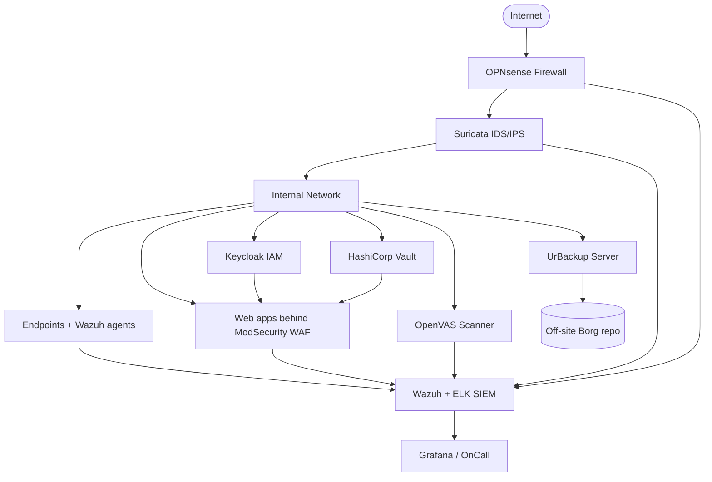

# Open-Source Security Stack — Overview

A practical roadmap for building a defensible, budget-friendly security program with mature open-source tools — and the asset inventory layer that makes everything else possible.

## Why this matters

Most security teams discover open-source the same way: a budget gets cut, a license renewal arrives at the wrong time, a regulator demands a control the existing platform does not offer. The reflex is to treat open-source as a fallback. That framing is wrong.

Commercial security suites are excellent, but they are not the only path to a defensible posture. The open-source security ecosystem has matured to the point where a small team at `example.local` can stand up firewalls, SIEM, vulnerability scanning, identity, secrets management, backup and red-team tooling without spending a single license dollar.

- **Democratisation of infosec.** The tools used by Fortune 500 SOCs — Suricata, Wazuh, OpenVAS, Keycloak, HashiCorp Vault — are all freely available, well documented, and battle tested. The gap between "what a global bank runs" and "what a five-person startup can run" has narrowed dramatically.
- **Mature, audited, free.** Many open-source projects are independently audited, have CVE response processes, and ship faster than their commercial peers. OWASP, CNCF, and Linux Foundation incubation give credible governance to the most important projects.
- **Budget-tight teams ship security.** A 0-budget startup, a public-sector agency under a hiring freeze, or a non-profit can deploy the same controls Gartner Magic Quadrant leaders sell — provided they invest in operator skill instead of license fees.
- **Sovereignty and auditability.** The source code is inspectable. There is no vendor backdoor, no opaque telemetry, no rug-pull when a private equity firm acquires your SaaS provider. For regulated and public-sector buyers in particular, this matters.
- **Skills compound.** Engineers who learn Wazuh, ELK, and Vault carry that knowledge between jobs and into the next architecture. Investments in operator skill outlast the specific project.

Open-source is not a shortcut. It shifts cost from licensing to engineering: you still pay, just in time, attention, and operational maturity. This overview maps the landscape and tells you where to start.

This page is the entry point. The sub-pages linked throughout go deeper into each category — pick the one whose problem you are facing today, and come back to the overview when you need to plan the next layer.

## The open-source security stack at a glance

There is an open-source equivalent for almost every commercial security category. Some of those equivalents are best-in-class even compared with paid alternatives; others are "good enough" with operator effort; a few are still maturing.

The table below maps every commercial security category to its open-source equivalent and points to the focused sub-page for each.

| Category | Commercial example | Open-source equivalent | Sub-page |
|---|---|---|---|
| Firewall / IDS / WAF | Palo Alto, Fortinet, F5 | OPNsense, Suricata, ModSecurity | [Firewall, IDS and WAF](./firewall-ids-waf.md) |
| SIEM and monitoring | Splunk, QRadar, Sentinel | Wazuh, ELK, Grafana | [SIEM and monitoring](./siem-and-monitoring.md) |
| Vulnerability and AppSec | Tenable, Qualys, Veracode | OpenVAS, ZAP, Semgrep, Nuclei | [Vulnerability and AppSec](./vulnerability-and-appsec.md) |
| Identity and MFA | Okta, Ping, Duo | Keycloak, Authentik, Authelia | [IAM and MFA](./iam-and-mfa.md) |
| Secrets and PAM | CyberArk, BeyondTrust | HashiCorp Vault, Teleport, JumpServer | [Secrets and PAM](./secrets-and-pam.md) |
| Email security | Proofpoint, Mimecast | Rspamd, Mailcow, Proxmox MG | [Email security](./email-security.md) |
| Backup and storage | Veeam, Commvault | UrBackup, Borg, Restic | [Backup and storage](./backup-and-storage.md) |
| Threat intel and malware | Recorded Future, Anomali | OpenCTI, MISP, Cuckoo | [Threat intel and malware](./threat-intel-and-malware.md) |
| Red team / adversary emulation | Cobalt Strike | Caldera, Atomic Red Team, Sliver | [Red team tools](./red-team-tools.md) |
| GRC | Archer, ServiceNow GRC | CISO Assistant, Eramba | [GRC tools](./grc-tools.md) |
| Asset management | ServiceNow CMDB, Lansweeper | GLPI, Snipe-IT, NetBox | (this page) |

Each sub-page covers the leading projects, trade-offs, and a recommended starting point.

Read the table as a *map*, not a *menu*. You will not deploy every category at once, and you may legitimately decide that a hosted commercial product is the right answer for one or two of these — open-source elsewhere does not stop you from buying Okta for identity, for example. The point is to know what choices exist before procurement assumes there are none.

## How to choose

Open-source is a buffet, not a tasting menu. The temptation — especially for a new security team trying to look productive — is to deploy ten things at once and call it a stack. That ends in a graveyard of half-configured tools and zero detections.

Pick deliberately. For each tool you consider, answer four questions:

1. **Maturity.** Does the project have a recent release, a documented roadmap, and a CVE response process? Look at the GitHub release cadence — at least one minor release in the last six months is a healthy floor. Avoid abandoned forks and "alpha" projects in production.
2. **Community.** How active are the GitHub issues, mailing list, and chat? A vibrant community is your unofficial support contract. Read the last 50 closed issues — are maintainers responsive, are answers technical, do contributors return? A dead community is a future migration project waiting to happen.
3. **Integration.** Does it speak the protocols and formats your other tools already use — syslog, OIDC, SAML, STIX, OpenAPI? Tools that integrate cleanly compound; isolated tools become silos. Prefer the project that exports its data over the project that locks it in, even if the latter has a prettier dashboard.
4. **Support model.** Will you self-support, hire a consultancy, or buy a commercial subscription from the upstream vendor (Elastic, Greenbone, Red Hat)? Decide *before* you deploy, not after the first incident. A signed support contract changes how the project responds when production is on fire.

If a tool fails on two or more of these, walk away — even if the feature list is impressive.

A second, often-forgotten dimension: **operational fit**. A Postgres-backed Python application is easy for one team and unfamiliar for another. The right tool for `example.local` is the one its operators can keep running at 3 a.m., not the one that scores highest on a feature matrix.

## Stack sequencing

In a green-field environment, deploy in this order. Each layer presupposes the previous one — building higher before lower is layered debt.

1. **Asset inventory** (GLPI, Snipe-IT, NetBox). You cannot defend what you cannot list.
2. **Identity** (Keycloak or Authentik). Centralise authentication before sprawling local accounts make it impossible.
3. **Perimeter and segmentation** (OPNsense, Suricata). Deny by default at the network edge.
4. **Endpoint and log telemetry** (Wazuh agents, syslog forwarders). Without telemetry, the SIEM is empty.
5. **SIEM** (Wazuh + ELK, or Grafana Loki). Centralise logs, write detections, alert.
6. **Vulnerability pipeline** (OpenVAS for infra, ZAP/Nuclei/Semgrep for apps). Find issues before attackers do.
7. **Backup and DR** (UrBackup, Borg, Restic). Ransomware-resilient, off-site, restore-tested.
8. **Secrets and PAM** (Vault, Teleport). Replace shared admin passwords with brokered, audited access.
9. **Threat intel and red team** (MISP, Caldera). Validate that everything above actually works.
10. **GRC** (CISO Assistant, Eramba). Document, evidence, and continuously prove the rest of the stack to auditors.

Skip a layer and the layers above it become decorative. A SIEM without telemetry is a database. A vulnerability scanner without an asset list is a firehose. A backup system without restore tests is a ransom invoice waiting to happen.

In a brown-field environment — meaning *you have something already* — the order changes slightly. Audit what exists, inventory the gaps, and prioritise the layer that is currently bypassed in production. Most often that is identity (shared admin accounts, no SSO) or backups (in-place snapshots only, no off-site copy).

## Architecture diagram

A representative `example.local` open-source security stack, showing how perimeter, inspection, identity, secrets, vulnerability scanning, and backup all feed (or are fed by) a central SIEM:

The diagram is illustrative; sub-pages cover the deployment details for each component. Note three properties that any good security architecture should exhibit:

- **Defence in depth.** Suricata sits behind OPNsense, ModSecurity sits in front of apps, Wazuh sits on every endpoint. Any single bypass does not equal compromise.
- **Centralised observability.** Every component ships logs to the SIEM. Detection and forensic analysis happen in one place rather than across ten dashboards.
- **Off-site, immutable backups.** Borg repos on a separate provider are the last line of defence against ransomware that takes out the primary backup server too.

Wherever possible, prefer agent-based telemetry (Wazuh, OpenSearch Beats) over agentless polling: it catches off-VPN endpoints and short-lived workloads that a scanner would miss. And keep the SIEM and the asset register reconciled — every endpoint Wazuh sees should also exist in Snipe-IT, and vice versa. Drift between the two is the earliest signal of either a missing inventory record or a rogue device.

## IT Asset Management — the prerequisite

Asset management is the unglamorous but essential foundation of every security program. It rarely shows up in a vendor demo. It rarely makes it into a quarterly board slide. And yet it is the difference between a security team that can answer "is this our machine?" in 30 seconds and one that takes 30 hours.

Every framework — NIST CSF, ISO 27001, CIS Controls — opens with the same instruction: inventory your assets. You cannot patch what you do not know exists. You cannot revoke access for a user whose laptop is not tracked. You cannot prioritise vulnerabilities without knowing which host runs which application. You cannot scope an incident without an authoritative list of what should and should not be on the network.

IT Asset Management (ITAM) is therefore the literal first control. CIS Control 1 ("Inventory and Control of Enterprise Assets") and CIS Control 2 ("Inventory and Control of Software Assets") sit at the top of the list because every other control downstream depends on them.

The three open-source platforms below dominate the space, each with a different scope and audience. None of them is the wrong answer; the wrong answer is to pretend a SharePoint spreadsheet counts.

## GLPI

> "A Free IT and Asset Management Software" — the project's own tagline.

[GLPI](https://glpi-project.org/) is a comprehensive IT asset and service management platform with full ITIL workflow support.

- **What it is.** A combined CMDB, ticketing system, and asset tracker, in active development since 2003. Originally written by a French community, today maintained by Teclib' with thousands of installations worldwide.
- **Strengths.** Full ITIL support (incident, change, problem, request); built-in helpdesk; LDAP/AD sync; rich plugin ecosystem (FusionInventory, OCS, monitoring connectors); multilingual; SLA tracking; financial information per asset (purchase date, warranty, depreciation).
- **Trade-offs.** UI feels dated compared to modern SaaS competitors; initial setup involves PHP, MariaDB, and configuration of cron jobs; plugin compatibility sometimes lags major version upgrades.
- **Choose it when** you need a single tool that combines asset tracking *and* an internal helpdesk, and you can tolerate a UI that prioritises function over polish. GLPI is especially strong for European public-sector and education organisations where ITIL alignment is a procurement requirement.
- **Avoid it when** the team is small enough that a unified ticketing + CMDB feels like overkill, or when you already use a separate ITSM platform (Jira Service Management, Zammad, etc.).

## Snipe-IT

> "Free, open source IT asset management software."

[Snipe-IT](https://snipeitapp.com/) is a focused, modern hardware and license inventory system.

- **What it is.** A lightweight Laravel (PHP) application for tracking physical assets, licenses, accessories, and consumables. Maintained by Grokability with a healthy community of self-hosters and a paid hosted offering.
- **Strengths.** Clean, modern UI; easy check-in / check-out workflow; barcode and QR support; REST API; CSV import; SAML and LDAP authentication; webhooks; well-documented Docker image.
- **Trade-offs.** No built-in CMDB or relationship modelling; no ticketing; integrations are fewer than GLPI's. It deliberately stays focused on the "asset lifecycle" problem.
- **Choose it when** your primary need is *hardware and license tracking* — laptops, monitors, software seats — and you do not want the overhead of a full ITSM suite. Snipe-IT is the fastest path to a credible inventory at a small or mid-size organisation.
- **Avoid it when** you need ITIL workflows, complex relationship modelling, or detailed network topology — those are not its job.

## NetBox

> "The cornerstone for network automation."

[NetBox](https://netbox.dev/) is the de facto open-source DCIM (Data Center Infrastructure Management) and IPAM (IP Address Management) platform.

- **What it is.** A source-of-truth database for network infrastructure: racks, devices, cables, IP addresses, VLANs, prefixes, circuits, and power. Originally built at DigitalOcean, now stewarded by NetBox Labs with a thriving open-source community.
- **Strengths.** Powerful REST and GraphQL APIs; strong automation story (Ansible, Terraform, NAPALM); change logging; custom fields; tenancy model for multi-customer environments; plugin framework for extensions like NetBox Branching and NetBox Topology Views.
- **Trade-offs.** Not designed for end-user device tracking — laptops and phones do not belong in NetBox. Deployment requires Postgres, Redis, and a worker process. Steeper learning curve for non-network operators.
- **Choose it when** you operate a data center, ISP, or sizeable network, and you need precise records of physical and logical network topology — not user laptops. NetBox is the go-to when network automation pipelines need a trustworthy single source of truth.
- **Avoid it when** your network is a flat office LAN with one or two switches — the modelling overhead exceeds the operational benefit.

## Asset management — comparison table

| Tool | Scope | Best for | Deployment complexity |
|---|---|---|---|
| GLPI | Hardware, software, ITSM tickets, contracts | IT teams that want assets + helpdesk in one tool | Medium (LAMP stack, plugins) |
| Snipe-IT | Hardware, licenses, accessories, consumables | Lean teams focused on physical asset lifecycle | Low (Docker one-liner) |
| NetBox | Network infrastructure, IPs, racks, circuits | NOC, DevOps, and data-center teams | Medium-High (Postgres, Redis, workers) |

You can — and many `example.local`-style organisations do — run more than one. The classic pairing is **Snipe-IT for hardware** plus **NetBox for the network**, with GLPI brought in if a ticketing platform is needed.

A useful rule of thumb: if a record describes *who has it*, it belongs in Snipe-IT. If it describes *where it is racked and what it connects to*, it belongs in NetBox. If it has a ticket attached, GLPI is the home.

## Hands-on / practice

The fastest way to evaluate an asset platform is to deploy it on a laptop and load real-shaped data into it. The three exercises below are deliberately small.

1. **Deploy GLPI in Docker.** Use the community `glpi-project/glpi` image with a MariaDB sidecar. Create an admin account, define one location (`example.local-HQ`), and add five sample assets. Bonus: enable the inventory plugin and register one agent so an endpoint reports its hardware automatically. Time-box: 45 minutes.
2. **Import a CSV asset list into Snipe-IT.** Spin up Snipe-IT via Docker Compose, prepare a CSV with `Asset Tag, Serial, Model, Status, Assigned To`, and use the bulk importer. Confirm the 50 sample rows land in the correct categories. Bonus: configure SAML SSO against your Keycloak test instance. Time-box: 30 minutes.
3. **Model a small datacenter in NetBox.** Stand up NetBox, create a site (`example.local-DC1`), one rack, two devices (a switch and a server), assign IP addresses from a `/24` prefix, and connect them with a cable record. Export the site via the REST API and verify the JSON shape. Time-box: 60 minutes.

Each exercise is small, self-contained, and gives you a feel for the tool before any production decision. Treat them as paid spike-time — what you learn in two hours saves a procurement mistake that would haunt you for years.

When you finish each exercise, write a one-page note: what you liked, what frustrated you, what would block production rollout. Six weeks later, those notes are the input for an honest tool selection — not a vendor demo.

## Worked example

The following walkthrough applies the choosing framework above to a realistic mid-size scenario.

`example.local` is a 250-person organisation across three offices. They have no existing CMDB. Spreadsheets in SharePoint are the current "system." The CIO asks the new security lead to recommend an open-source asset platform.

**Analysis.**

- 250 people implies roughly 350 endpoints (laptops, monitors, phones, printers) — clearly hardware-centric.
- Three offices means rack-and-cable detail is *not* the urgent need; the network is small and mostly cloud-hosted.
- No existing helpdesk tooling is in place either, but the IT team uses email and Teams chat. They will eventually need ticketing — but not on day one.
- Compliance pressure is moderate: the organisation has ISO 27001 ambitions for next year, which makes a credible asset register a hard requirement within twelve months.

**Recommendation.**

- **Snipe-IT for hardware.** Stand it up first. Import the SharePoint spreadsheet via CSV, attach assets to users via LDAP sync, print barcodes. This solves the "what do we own and who has it" question within a sprint and gives the auditor something concrete to look at.
- **GLPI later for ITSM.** Once Snipe-IT is stable, deploy GLPI as the helpdesk and begin migrating ticket flow off email. GLPI's CMDB can either be the secondary system or, eventually, the primary if the team consolidates.
- **NetBox deferred.** With three small offices and a flat network, NetBox is overkill today. Revisit when `example.local` opens a co-lo or builds an internal data center.

The point of the example: pick tools to match scope and lifecycle stage, not to match ambition. Buying the most powerful tool on day one is the most common — and most expensive — mistake.

A second `example.local`-flavoured pattern worth noting: when the security team is one person, *operability beats sophistication every time*. The tool that ships in 30 minutes and runs unattended for six months is more valuable than the tool with a richer feature set that requires weekly tuning.

## Common misconceptions

Three myths cause more bad open-source decisions than any others.

- **"Open-source = unsupported."** Wrong. Most leading projects offer paid commercial support — Greenbone for OpenVAS, Elastic for the ELK stack, Red Hat for Keycloak, NetBox Labs for NetBox, Teclib' for GLPI. And the community channels — GitHub Discussions, Discord, mailing lists — are often faster than commercial support tickets, especially for known issues.
- **"Free = no TCO."** Also wrong. The license is free; the operator is not. Budget for engineering time, training, hardware, and a paid support subscription for any tier-1 control. A serious estimate is one full-time engineer per three production-grade open-source security platforms during steady state, more during initial deployment.
- **"You must pick one tool."** Wrong again. Snipe-IT plus NetBox plus GLPI is a perfectly normal pairing — each owns a different scope. The cost of running three focused tools is often lower than forcing one tool to do everything badly. The same logic applies up the stack: Wazuh for endpoint plus Grafana Loki for logs plus OpenSearch for search-heavy use cases is a legitimate combination.
- **"Open-source means insecure by default."** Wrong. The source is auditable, the CVEs are public, and the response cycle is often faster than commercial vendors. The risk is in *operator misconfiguration*, not in the code itself — and that risk exists with commercial tools too.
- **"It is too hard to integrate."** Mostly wrong, sometimes true. Modern open-source security projects ship with REST APIs, OIDC support, syslog output, and Prometheus metrics by default. Integration friction is usually a sign that *one* of the tools you chose is the wrong fit, not that open-source is the wrong category.
- **"The community will fork it tomorrow."** Rare. Major projects with healthy governance (OWASP, CNCF, Linux Foundation, well-funded vendors) are stable. Fork risk is real for one-maintainer hobby projects — which you should not be running in production anyway.

## Key takeaways

Boil this overview down to a one-page handout:

- Open-source can deliver every category of security control a commercial stack offers, with mature, audited, well-supported projects.
- Start with **asset inventory**: NIST, ISO and CIS all begin there for a reason — and the rest of the stack is unbuildable without it.
- **GLPI** is the all-in-one ITSM + CMDB choice; **Snipe-IT** owns hardware and licenses; **NetBox** owns the network and data center.
- It is normal — even recommended — to run more than one asset tool. Pair them by scope rather than forcing one product to do everything.
- Choose tools against four criteria: maturity, community, integration, support model. Two strikes and you walk away.
- Deploy in sequence — assets, identity, perimeter, telemetry, SIEM, vulns, backup, secrets, intel — because each layer depends on the one below it.
- The license is free; the operator is not. Plan TCO honestly: people, hardware, training, and at least one paid support contract for tier-1 controls.
- Pilot before you procure. A two-hour Docker spin-up tells you more than any vendor demo, and it costs you only your own time.
- Document your decisions. Six months from now, the question "why did we pick Snipe-IT over GLPI?" will be asked by someone who was not in the room — write the answer down today.
- Reconcile asset inventory and SIEM telemetry: every endpoint the SIEM sees should also exist in your asset register, and unknown devices should generate alerts.

## References

Authoritative starting points and per-tool documentation:

- [OWASP Projects index](https://owasp.org/projects/) — the canonical list of OWASP-stewarded open-source security projects.
- [Awesome-Selfhosted: Security](https://github.com/awesome-selfhosted/awesome-selfhosted#security) — community-maintained catalogue of self-hostable security tooling.
- [Awesome Open Source Security](https://github.com/sbilly/awesome-security) — a broader curated list of security-relevant open-source projects.
- [The Open Source Security Foundation (OpenSSF)](https://openssf.org/) — Linux Foundation initiative for securing the open-source supply chain.
- [CNCF Landscape — Security and Compliance](https://landscape.cncf.io/) — interactive map of cloud-native security tooling.
- [CIS Critical Security Controls v8](https://www.cisecurity.org/controls) — Control 1 is "Inventory and Control of Enterprise Assets" for a reason.
- [NIST Cybersecurity Framework 2.0](https://www.nist.gov/cyberframework) — the IDENTIFY function maps directly to asset inventory.
- [ISO/IEC 27001:2022 Annex A.5.9](https://www.iso.org/standard/27001) — "Inventory of information and other associated assets" is a mandatory control.
- [GLPI on GitHub](https://github.com/glpi-project/glpi)
- [Snipe-IT on GitHub](https://github.com/snipe/snipe-it)
- [NetBox on GitHub](https://github.com/netbox-community/netbox)
- [GLPI documentation](https://glpi-project.org/documentation/)
- [Snipe-IT documentation](https://snipe-it.readme.io/)
- [Snipe-IT Docker image](https://hub.docker.com/r/snipe/snipe-it)
- [NetBox documentation](https://netboxlabs.com/docs/netbox/)
- Sub-pages of this category:
  - [Firewall, IDS and WAF](./firewall-ids-waf.md)
  - [SIEM and monitoring](./siem-and-monitoring.md)
  - [Vulnerability and AppSec](./vulnerability-and-appsec.md)
  - [IAM and MFA](./iam-and-mfa.md)
  - [Secrets and PAM](./secrets-and-pam.md)
  - [Email security](./email-security.md)
  - [Backup and storage](./backup-and-storage.md)
  - [Threat intel and malware](./threat-intel-and-malware.md)
  - [Red team tools](./red-team-tools.md)
  - [GRC tools](./grc-tools.md)
