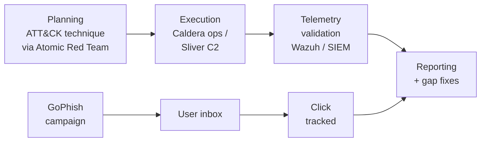

# Open-Source Red Team and Adversary Emulation

A focused look at the open-source tools that let a small purple team run credible offensive exercises — phishing simulations to build user muscle memory, adversary emulation to validate the SOC, and a modern C2 to stand in for the commercial frameworks that the budget will not cover.

This page assumes the detection stack from the [Open-Source SIEM and Monitoring](./siem-and-monitoring.md) lesson is already producing alerts you can score against, and the perimeter and TI capabilities from the [Threat Intel and Malware Analysis](./threat-intel-and-malware.md) lesson are giving you the TTPs worth emulating. Red-team tooling without a blue team to detect it is a fireworks display; the value is in the feedback loop.

## Why this matters

Purple-team work — running offensive exercises and measuring how the defence responds — is the single most reliable way to know whether your SIEM rules, your EDR coverage, and your user training actually work. Reading vendor datasheets does not tell you that; running a red-team exercise against your own environment does. The catch has historically been tooling: **Cobalt Strike** is the de-facto commercial C2, but it costs in the high four-figure-per-user range, requires distributor approval, and is geofenced out of several markets. For a 200-person `example.local`-shaped organisation, that is not a credible line item.

Open-source alternatives are now mature enough that the licence-free path is genuinely viable. **GoPhish** has displaced the commercial phishing platforms for most internal red teams; **MITRE Caldera** and **Atomic Red Team** are the same tools that MITRE itself uses to validate ATT&CK techniques; **Sliver** from Bishop Fox is a modern C2 that detection-engineering blogs treat as the open-source counterpart to Cobalt Strike. Pair them with quick scripted simulators like **APTSimulator** and **RTA** for fast SOC drills, and a small purple team can run a credible offensive program for the cost of the analyst time.

For `example.local` the right pattern is a small recurring cycle: monthly phishing simulation via GoPhish, quarterly Atomic Red Team passes against the standard workstation build, semi-annual full Caldera operations against a representative segment, and ad-hoc Sliver-based exercises when a specific TTP from threat intel needs to be validated. The cost is hardware that overlaps with the lab environment plus discipline; the output is a defensible, evidence-based picture of what the SOC actually catches.

- **Phishing simulation builds organisational muscle memory.** Annual security-awareness videos do not move the click-rate needle; monthly realistic phishing tests with immediate teachable moments do. GoPhish makes that operationally cheap.
- **Adversary emulation closes the gap between "we have rules" and "the rules fire".** A SIEM dashboard full of detections is meaningless until you confirm which ATT&CK techniques actually trigger them — and the only way to confirm that is to run the techniques.
- **Open-source C2 frameworks are now production-grade.** Sliver, Mythic and Havoc are mature enough that capable adversaries already use them — and your SOC needs to be able to detect them regardless of whether your own red team uses them.
- **Scripted simulators give the SOC fast feedback.** APTSimulator and RTA can run a long list of attacker actions in minutes, generating telemetry you can validate detection content against without standing up a full operation.
- **Purple-team work is where blue and red converge.** The point is not to "win" — it is to find the gaps and fix them, with both sides at the same table reviewing what fired and what did not.

## Ethics and authorization

These tools execute real attacker behaviour against real systems. Run them only with **written authorization** from the asset owner, with a clearly documented scope (which networks, which hosts, which users, which time windows), and with the SOC pre-notified for any exercise that is not a covert detection test. Coordinate with legal, HR, and IT operations before any phishing campaign that targets employees. In most jurisdictions — CFAA in the US, the Computer Misuse Act in the UK, the Council of Europe Cybercrime Convention everywhere it is ratified — running these tools without authorization is a criminal offence. The fact that the tooling is open source does not change that. When in doubt, do not run.

Written authorization should name the systems in scope, the techniques permitted, the time window, the kill-switch contact, and the named individuals authorised to operate. Keep that document on file for the same retention period you keep incident records. The same paperwork that protects the organisation legally is also what the security team relies on if a real incident response is triggered by red-team activity that was not communicated correctly.

## Stack overview

A working purple-team pipeline pairs an offensive flow with a defensive feedback loop. The offensive side picks ATT&CK techniques worth emulating, executes them via Atomic Red Team for individual TTPs or Caldera for chained operations, and uses Sliver where a proper C2 is needed. The defensive side reads the resulting telemetry through Wazuh and the SIEM, scores detection coverage, and feeds gaps back into rule development. Phishing campaigns sit in parallel — GoPhish drives email into user inboxes, tracks clicks and credential submission, and generates separate reporting for the awareness program.

Read the diagram as two flows that meet at the report. The technique flow on top is what most people picture when they hear "red team" — pick a TTP, execute it, see what the SOC catches. The phishing flow at the bottom is operationally separate but feeds the same scoring: did the user click, did the SOC see the inbound, did the EDR catch the payload if there was one, did anyone report the email. The output of both is the same: a list of confirmed gaps with owners and remediation deadlines.

The point worth internalising is that the **report is the product**, not the operation itself. A successful red-team exercise that does not produce written findings, scored detection coverage, and tracked remediation tickets has no business value. Wire the reporting before the first execution.

A useful operating discipline is to template the engagement report before the engagement starts — empty sections for scope, techniques attempted, detection score per technique, gaps identified, and remediation tickets created. Filling in a template is faster than writing from scratch under deadline pressure, and it forces the operators to think about what evidence the report will need before they generate it.

## Phishing simulation — GoPhish

GoPhish is the de-facto open-source phishing simulation platform. Written in Go, distributed as a single static binary, and configured through a clean web UI plus a REST API, it is what most internal red teams reach for first. The value proposition is straightforward: a benign realistic phishing email, sent from a domain you control, to a list of employees you have authorization to target, with click and submission tracking that lands in a dashboard ready for the awareness team.

The deployment story matches the rest of the design: download the binary, run it on a small VM, point it at an SMTP relay you control, and configure the public landing-page URL behind a TLS-terminating reverse proxy. The administrative UI binds to localhost by default — keep it there, behind a VPN, and reverse-proxy only the public landing page.

- **Single-binary Go deployment.** No runtime dependencies, no language stack to manage. A 200-MB binary plus a SQLite database file is the entire install on a test box; production deployments swap SQLite for MySQL or Postgres.
- **Campaign workflow.** The native abstraction is the **campaign** — a sending profile, an email template, a landing page, a target group, and a launch time. Each campaign produces a results dashboard with opens, clicks, submissions, and reported counts.
- **REST API.** Everything in the UI is also exposed via REST, which makes scripting recurring campaigns straightforward. The Python `gophish` SDK is the most-used client.
- **Templates and landing pages.** Templates support placeholder substitution (employee name, custom links) and inline tracking pixels. Landing pages can mimic any login flow; submitted credentials are captured server-side and never leave the platform.
- **Architecture caveats.** GoPhish has a history of the admin UI being mistakenly exposed to the internet — the default config binds to all interfaces. Always firewall or reverse-proxy the admin port, and rotate the default `admin/gophish` credential before the first run.
- **When to choose.** Default for any new internal phishing program. Mature, documented, and the deployment story is short enough for a single afternoon.

The trade-off worth flagging up front is that GoPhish does not ship with awareness training — once a user clicks, GoPhish records the event and that is the end of its responsibility. The teachable-moment workflow (a remediation page, a short training video, a manager notification) lives outside GoPhish, usually wired through a webhook into a separate awareness platform or a manual analyst process.

## Phishing simulation — King Phisher

King Phisher is the older Python-based phishing toolkit from SecureState (now archived but still functional). Where GoPhish optimises for the simplest path to a campaign, King Phisher optimises for **flexibility** — a richer template language, a plugin system that lets you extend the server with custom Python modules, and metric collection that includes browser fingerprint and geolocation data on every click.

The architecture is split into a server (Python, runs on the campaign host) and a client (a desktop GUI that the operator runs locally and connects to the server). That client/server split is the main complexity tax — most operators prefer GoPhish's single-binary web UI — but it does enable use cases like multiple concurrent operators and an operator workstation that is genuinely separate from the campaign infrastructure.

- **Python server + GTK client.** The server runs on Linux; the client is a desktop app. Setup is more involved than GoPhish — Python virtual environments, GTK dependencies, an SSH-based connection between client and server.
- **Plugin system.** Server and client both expose plugin APIs. Custom plugins can extend templating, add metric collectors, integrate with internal CRMs, or wire results into ticketing systems.
- **Metric depth.** Default metrics include geolocation, browser fingerprint, OS, click and submission timing — useful when the awareness program wants demographic detail rather than just aggregate click rates.
- **SPF/DKIM/DMARC awareness.** Built-in tooling for verifying the sending domain's email-authentication posture before launch — a fail-closed check that prevents campaigns from landing in spam folders.
- **Status caveat.** The original SecureState project was archived in 2021; community forks exist but maintenance is sporadic. Treat King Phisher as a working but legacy tool, not as a long-term default.
- **When to choose.** You need plugin-level customisation, multi-operator workflows, or richer per-click metrics than GoPhish gives. Otherwise default to GoPhish.

## Phishing simulation — Lucy Community Edition

Lucy was a hybrid phishing-simulation and security-awareness training suite — phishing campaigns plus an integrated LMS with videos and quizzes — sold by Lucy Security as both a paid commercial product and a stripped-down Community Edition. The Community Edition was a useful free option for small organisations that wanted training and phishing in one platform.

As of 2026 the honest status is that the **Community Edition is effectively abandoned**. The vendor has pivoted to Lucy SaaS and the on-prem Community Edition has not seen meaningful updates in years. New deployments should not start on Lucy CE — go to GoPhish for phishing and a separate LMS (Moodle, BookStack, or a SaaS awareness vendor) for training.

- **Combined phishing + LMS.** The original pitch was integration — campaigns that automatically enrolled clickers into remediation training. The integration is real but the platform is no longer maintained.
- **Template library.** Pre-built phishing templates, awareness videos, and quizzes covering common attack patterns. Useful as inspiration but increasingly dated.
- **Heavy installer.** A monolithic installer that pulls in PHP, MySQL, Apache and a long list of dependencies. Operationally heavier than GoPhish or King Phisher.
- **Status as of 2026.** Effectively abandoned at the Community Edition. Vendor focus is on the SaaS commercial product.
- **When to choose.** Almost never for new deployments. Mentioned for completeness because legacy installs persist; if you inherit one, plan a migration to GoPhish + a separate awareness platform.

## Phishing — comparison table

The three platforms target the same workflow but at different points on the maturity curve. The table below is what actually matters when picking one.

| Dimension | GoPhish | King Phisher | Lucy CE |
|---|---|---|---|
| Active maintenance | Active | Sporadic (forks) | Effectively abandoned |
| Deployment effort | Low (single binary) | Medium (client+server) | High (monolithic installer) |
| UI | Web | Desktop client | Web |
| API | REST + Python SDK | RPC | Limited |
| Plugin ecosystem | Minimal | Rich | Limited |
| Metric depth | Standard | Rich (geo, fingerprint) | Standard |
| Built-in LMS | No | No | Yes (legacy) |
| Architecture | Go + SQLite/MySQL | Python + SQLite | PHP + MySQL |
| Best fit | Default for new programs | Customisation, multi-operator | Legacy installs only |
| When to avoid | Heavy customisation needs | Solo operator, fast setup | New deployments |

The short version: **GoPhish for everything new**, King Phisher only when its plugin model is genuinely needed, Lucy CE not at all unless inherited.

## Adversary emulation — Atomic Red Team

Atomic Red Team is the open-source library of small, reproducible offensive tests maintained by Red Canary. Each test is an "atomic" — a minimal, well-documented action mapped to a specific MITRE ATT&CK technique ID — and the whole library is structured as YAML files in a public GitHub repo. Run an atomic for `T1059.001` (PowerShell command execution) and you get the smallest possible action that should fire your PowerShell logging rules; run an atomic for `T1547.001` (Registry Run Keys persistence) and you get a reproducible registry write you can scope a detection rule against.

The defining design choice is **no agent**. Atomics are shell scripts, PowerShell snippets, and Python helpers that run from a normal terminal on the target host. The orchestration layer (`Invoke-AtomicRedTeam` for PowerShell, the equivalent CLI tools for bash) is a thin wrapper that locates the YAML, substitutes parameters, executes, and cleans up.

- **MITRE ATT&CK indexed.** Every atomic is filed under a technique ID. The library covers the majority of Enterprise ATT&CK with at least one atomic per technique, often several variants.
- **No agent, no infrastructure.** Atomics run from the operator's existing shell. The only "deployment" is cloning the repo and installing `Invoke-AtomicRedTeam` or the CLI runner.
- **YAML-based and editable.** Every test is a YAML file with documented inputs, dependencies, executor, and cleanup steps. Editing is straightforward; contributing back via PR is encouraged.
- **Cleanup commands.** Most atomics ship with explicit cleanup blocks that reverse the registry write, delete the dropped file, or unwind whatever was changed. Use them — Atomic Red Team without cleanup leaves artefacts that confuse next-day analysts.
- **When to choose.** Validating individual ATT&CK technique coverage. Atomic Red Team is the right tool when the question is "does our SIEM catch T1059.001 specifically".

A useful pattern for ongoing detection coverage is to wire Atomic Red Team into a scheduled job — every quarter, run the full set of atomics covering the techniques your detection content claims to address, capture the SIEM response, and treat any technique that did not fire an alert as a regression to investigate.

## Adversary emulation — Caldera (by MITRE)

Caldera is MITRE's automated adversary emulation system — a server-plus-agent platform that chains ATT&CK techniques into structured operations and runs them against deployed agents. Where Atomic Red Team is "run one technique by hand", Caldera is "run a multi-step operation with a planner that selects the next action based on what it has discovered". It is the same project MITRE uses internally to validate ATT&CK and Engage scenarios.

The architecture is conventional: a central server with a web UI and REST API, agents (`sandcat`, `manx`) deployed to test hosts, and adversary profiles that define the operation as an ordered list of abilities (each ability mapped to an ATT&CK technique). The planner can run abilities sequentially, in batches, or driven by a custom planning module.

- **Adversary profiles.** Bundled profiles emulate documented threat actors and campaigns — APT29 hands-on-keyboard chains, Sandworm style operations, ransomware behaviour patterns. Custom profiles are straightforward YAML.
- **Agent platforms.** `sandcat` agent supports Windows, Linux and macOS. Communication channels include HTTP, HTTPS and DNS. Agents are noisy by default — they will be flagged by EDR — which is by design for purple-team use.
- **Web UI and REST API.** The UI is the operator console for launching operations and watching results in real time; the REST API is what you wire automation against.
- **Plugins.** A rich plugin ecosystem — Stockpile (default abilities), Atomic (Atomic Red Team integration), Manx (interactive shell agent), Response (defensive playbooks), and many community plugins.
- **When to choose.** Chained operations rather than individual technique tests. Caldera is the right tool when the question is "can we detect this specific actor's TTP chain end to end".

Caldera's planner is what distinguishes it from a script runner. A naive emulation runs technique A, then B, then C in a fixed order; Caldera's planner can choose the next ability based on what the previous abilities discovered (the host the agent landed on, the privileges available, the targets reachable from this position). That dynamic behaviour is what makes operations look closer to a real intrusion than a checklist.

## Adversary emulation — Sliver C2

Sliver is the modern open-source command-and-control framework from Bishop Fox — a Cobalt Strike alternative built in Go, with first-class support for the operator workflows that mature red teams expect. It is the open-source C2 most often described as "actually production-ready" by the detection-engineering community, and (because of that maturity) it is also the C2 that real attackers have started to adopt.

The architecture is server-plus-implant. The Sliver server runs on Linux, exposes an mTLS-protected operator API, and generates implants targeting Windows, Linux and macOS. Communication channels include mTLS, HTTPS, DNS and WireGuard. Operators connect via the `sliver` console (CLI) or the web UI; multi-operator collaboration is built in.

- **Modern C2 features.** Multiplayer (multi-operator), mTLS by default, configurable beacons, in-memory loaders, BOFs (Beacon Object Files) for offensive tradecraft, and a scripting interface for custom operator workflows.
- **Cross-platform implants.** Native Go compilation produces implants for Windows (PE), Linux (ELF) and macOS (Mach-O). Shellcode and shared-library variants too.
- **Communication channels.** mTLS, HTTPS, DNS over HTTPS, WireGuard, and named pipes (for lateral movement). Channel switching is built into the protocol.
- **Detection footprint.** Sliver is detected by every major EDR by default — the implant binary itself is signatured. Real operators recompile and obfuscate; for purple-team use, the unmodified default implant is exactly what you want, because it tests the SOC's baseline detection.
- **OpSec caveat.** Default Sliver server certificates are fingerprintable. A reused default cert is a gift to threat intel — and to the next attacker who uses Sliver against you.
- **When to choose.** Proper C2 emulation for purple-team operations. Sliver is the right tool when the question is "does our SOC detect a modern C2 beacon" or "can we simulate the kind of access an actual intrusion would establish".

The honest framing for Sliver in 2026 is that it is the best open-source C2 available and that it is also one of the most-abused C2 frameworks in real intrusions. Treat operator security with the same discipline you would apply to a live commercial framework — separate the operator workstation from anything that can reach production, audit every implant generated, and decommission server infrastructure between engagements.

## Adversary emulation — APTSimulator and RTA

APTSimulator (by Nextron Systems) and Red Team Automation / RTA (originally by Endgame, now Elastic) are the quick-and-dirty end of the adversary-emulation spectrum. Both are scripted simulators — a long list of attacker actions that run sequentially against the local host, generate telemetry, and exit. They are designed for blue-team training: a SOC analyst runs the script on a test VM and sees a flood of alerts, correlations, and detection-rule matches in their SIEM.

Neither replaces a proper Caldera operation or a Sliver C2 — they do not establish persistent access, they do not chain techniques based on discovery, and they only run on Windows. But for a fast SOC drill or a baseline test of "what does our SIEM catch right now", they are an order of magnitude faster to set up.

- **APTSimulator.** Windows batch script that simulates APT-style artefacts — registry persistence keys, suspicious file paths, fake malicious services, mock C2 beacon traffic, and so on. No real exploitation; pure artefact generation. Useful for AV/EDR signature checks and SIEM correlation-rule validation.
- **Red Team Automation (RTA).** Python-based framework with ~50 prebuilt scenarios covering process injection, LOLBin abuse, persistence, credential access, lateral movement primitives. Scenarios are mapped to ATT&CK techniques.
- **Status.** Both projects see modest maintenance — RTA is the more actively maintained of the two. Treat them as supplementary tools rather than the centre of an emulation program.
- **When to choose.** Quick SOC drills, baseline detection-coverage checks, training exercises for new SOC analysts. Run them on isolated test VMs with the SOC pre-notified, then review what fired and what did not.

A practical pairing is to run RTA quarterly as a baseline coverage check (does the SIEM still catch what it caught last quarter) and APTSimulator on demand when a specific actor's TTPs are in the news. Neither replaces structured emulation — they accelerate the feedback loop on the rules that already exist.

## Tool selection — comparison table

The matrix below maps the most common red-team needs to a recommended open-source tool. Treat it as a starting point for scoping, not a final architecture.

| Need | Pick | Why |
|---|---|---|
| Phishing simulation, default | GoPhish | Single binary, REST API, mature |
| Phishing with rich plugins | King Phisher | Plugin model, multi-operator |
| Individual ATT&CK technique test | Atomic Red Team | Per-technique YAML, no agent |
| Chained ATT&CK operation | Caldera | Planner, profiles, agents |
| Modern C2 emulation | Sliver | Production-grade, multiplayer |
| Fast SOC drill (Windows) | APTSimulator or RTA | Run-and-go scripted simulators |
| MITRE ATT&CK technique coverage | Atomic Red Team + Caldera | Atomic per-technique, Caldera for chains |
| Cobalt Strike alternative | Sliver | Closest open-source equivalent |
| Phishing + awareness LMS | GoPhish + separate LMS | Lucy CE no longer viable |
| Purple-team baseline assessment | RTA | Fast, broad, ATT&CK-mapped |

For an `example.local`-shaped environment the answer is **GoPhish + Atomic Red Team + Caldera + Sliver**, with APTSimulator and RTA as quick supplementary scripts when the SOC needs a fast drill. Skip Lucy CE entirely; treat King Phisher as a niche option.

A short note on overlap. There is real temptation to pick "the one emulation tool" — resist it. Atomic Red Team and Caldera answer different questions (per-technique coverage versus chained operation realism); Sliver answers a third (does the SOC catch a modern C2). The mature shops run all three at different cadences against different parts of the environment. Pick the tool that matches the question you are trying to answer this engagement, not the tool that won last engagement.

## Hands-on / practice

Five exercises to make this concrete in a home lab or an authorised test environment for `example.local`. Each one targets a different layer; together they exercise the full purple-team loop. Run every exercise on isolated test infrastructure with written authorization and SOC notification.

1. **Deploy GoPhish in Docker and run a benign campaign against your own test inbox.** Bring up GoPhish via the official container, configure an SMTP relay you control, and rotate the default admin credential before exposing the UI. Build a benign template ("IT password reset reminder") and a landing page, target a single test inbox you own, and launch. Confirm opens, clicks and submissions appear in the dashboard.
2. **Run an Atomic Red Team test for T1059.001 and verify Wazuh catches it.** Clone the Atomic Red Team repo on a test Windows host and install `Invoke-AtomicRedTeam`. Run the T1059.001 (PowerShell command execution) atomic. Confirm the PowerShell logging captures the command, the Wazuh agent forwards it, and a Wazuh rule fires for suspicious PowerShell. Then run the cleanup block and confirm artefacts are removed.
3. **Deploy Caldera and run an operation against a test Windows VM.** Stand up Caldera via the bundled Docker compose, deploy the `sandcat` agent to an isolated Windows test VM, and launch the bundled "Hunter" operation. Watch the abilities execute in the UI, then review which steps generated telemetry in the SIEM and which slipped through silently.
4. **Deploy Sliver and establish a session with a willing test endpoint.** Install the Sliver server on a small Linux VM, generate an implant for a willing Windows test host, and establish an mTLS session. Run a benign command (`whoami`, `hostname`), confirm the SOC sees the beacon traffic, and review what their EDR flagged. Rotate the default certificates before any further testing.
5. **Run APTSimulator on an isolated Windows VM and review SOC alerts.** Boot an isolated, snapshotted Windows test VM, copy the APTSimulator script, and run the full simulation. Watch the SIEM in parallel — count which alerts fired, which correlation rules triggered, and which simulated APT artefacts went undetected. Revert the snapshot when finished.

## Worked example — `example.local` purple-team exercise

`example.local` ran its first formal purple-team exercise in Q4, six months after the SOC stood up Wazuh and Suricata from the [SIEM lesson](./siem-and-monitoring.md). The exercise had three pillars — phishing, technique chains, and reporting — and was scoped to a single test segment with full written authorization from the CISO and IT operations, and pre-notification to the SOC manager (the analysts on shift were not told, to test detection rather than just response).

The driver was a pragmatic one: the security team had spent two quarters writing detection content, and nobody knew how much of it actually worked. The purple-team exercise was the first end-to-end test of the SOC, the rule set, and the user population in a single coordinated run.

- **Phishing campaign with GoPhish.** A two-week phishing simulation targeting all 200 employees with a benign "annual benefits enrolment" template and a landing page mimicking the internal SSO. Click rate, submission rate, report rate, and median time-to-report were captured per department. Followed within 24 hours by a teachable-moment email to clickers and a LinkedIn-Learning module assignment.
- **ATT&CK technique chain via Caldera.** A custom Caldera profile chaining T1566.001 (spear-phishing attachment, simulated by dropping a benign payload), T1059.001 (PowerShell), T1547.001 (Run Key persistence), T1003.001 (LSASS access, mocked), and T1041 (exfil over C2 channel). Run against three willing test workstations on the test segment.
- **Sliver C2 session for the endgame.** A Sliver implant with rotated certificates, beaconing over HTTPS to an external operator VM. Used to simulate a "successful intrusion" scenario for the IR tabletop the following week.
- **Blue team scored on detection rate.** Each TTP in the Caldera operation was scored: detected (alert fired within 15 minutes), partial (telemetry present but no alert), or missed (no telemetry). Final score: 12 of 17 TTPs detected, 3 partial, 2 missed. Two of the missed TTPs were rule-content gaps; the third was a logging gap on one host group.
- **Gaps fed back into rule development.** The two missed TTPs became Wazuh detection rule tickets with two-week deadlines; the partial detections became Suricata signature tasks; the phishing click rate (8% organisation-wide, 14% in one department) drove a targeted re-training program for the affected team.

The first formal purple-team exercise produced 11 concrete tickets — five Wazuh rules, two Suricata signatures, three logging-coverage gaps, and one re-training program — all closed within two months. The second exercise the following quarter scored 16 of 17 TTPs detected, with one partial. The third caught everything. The exercise cadence is now quarterly.

The exercise reports also feed the [vulnerability and AppSec](./vulnerability-and-appsec.md) program when emulation surfaces a missing patch path, and reference the [social engineering](../../red-teaming/social-engineering.md) and [initial access](../../red-teaming/initial-access.md) lessons for the offensive context that shapes each round.

The cost over the first year was modest: roughly one analyst-week per quarterly exercise (planning, execution, scoring, reporting), one shared lab VM for the GoPhish and Caldera servers, and a single dedicated operator workstation for Sliver. Hardware overlapped with the existing test lab; subscriptions were $0. The output, measured in confirmed detection-rule and logging-coverage gaps closed, paid back the analyst time in avoided real-incident hours within the first two quarters.

## Troubleshooting & pitfalls

A short list of mistakes that turn a purple-team program from "the thing that finds our gaps" into "the thing that gets the security lead fired". Most are operational and people-process patterns rather than technical failures of the tools.

- **Running offensive tools on production without notifying SOC is career-ending.** A Caldera operation that fires on production hosts during business hours, with no advance coordination, can trigger a real-world incident response — pages, on-call escalation, possibly law enforcement notification. Always pre-notify the SOC manager (even for covert tests where the analysts are not told), always have written authorization, and always have a kill-switch contact list.
- **GoPhish credentials accidentally exposed.** The GoPhish admin UI binds to all interfaces by default and ships with `admin/gophish` as the initial credential. Multiple GoPhish instances per year end up indexed by Shodan with the default credential intact, exposing campaign data and submitted credentials to anyone who finds them. Bind the admin port to localhost, reverse-proxy if remote access is needed, rotate the default credential before first use.
- **Sliver reused with default certs is a gift to attackers.** The default Sliver server certificate is fingerprintable in JA3/JA3S databases and via TLS metadata. A red-team Sliver instance with default certs can be picked up by threat-intel feeds and (worse) reused as a known-good fingerprint by a real attacker who scans for fingerprintable C2 infrastructure. Always regenerate certs, and rotate them between engagements.
- **Caldera operations leaving artefacts that confuse next-day analysts.** Caldera abilities create real registry keys, real files, real persistence entries. If the operation does not run cleanup, the next morning's SOC analysts will spend hours investigating "real" attacker artefacts that are actually leftover red-team litter. Always include cleanup abilities in the operation; document what cleanup did and did not remove in the engagement report.
- **Phishing simulations that erode trust if too aggressive.** A phishing simulation that uses a "you have been laid off" pretext, or impersonates the CEO making personal requests, or uses content that is genuinely upsetting, is the fastest way to destroy the security team's credibility with the workforce. Coordinate templates with HR, avoid topics that are genuinely sensitive (layoffs, compensation, family, health), and treat clicks as teachable moments rather than punishable offences.
- **Running Atomic Red Team without cleanup leaves rule-tuning headaches.** Each atomic creates artefacts; the cumulative effect across a quarterly run is dozens of stale registry keys, files, and scheduled tasks. Always run the cleanup blocks; if cleanup is missing for a specific atomic, write your own and contribute it back to the project.
- **Confusing detection coverage with prevention coverage.** A Caldera operation that the SIEM detects but the EDR did not block is a partial win, not a full one. Score detection and prevention separately; an alert that fires after the data left the network is still a failure of the prevention layer.
- **Test infrastructure leaking into production.** A Sliver implant intended for a test VM that was later cloned into production, a Caldera agent that survived a snapshot revert, a GoPhish landing page that ended up in a browser bookmark — every red-team artefact that escapes the test segment becomes a production risk. Inventory red-team assets, audit them after every exercise, and revert test VMs to clean snapshots immediately after engagement close.
- **No reporting discipline.** A red-team exercise without a written report, scored detection coverage, and tracked remediation tickets is theatre. Wire the reporting and ticketing flow before the first execution; if you cannot write a report at the end, you should not run the exercise at the start.
- **Phishing simulation rate-of-fire.** Monthly is healthy; weekly is fatiguing; daily is harassment. Pick a cadence that builds muscle memory without becoming background noise, and rotate templates so the workforce does not just memorise "the security team's emails".
- **Legal exposure when targets cross borders.** Phishing or technique tests against employees in jurisdictions with stricter privacy law (Germany, France, EU broadly) can require works-council approval or specific employee notice. Loop legal in before any cross-border exercise.

## Key takeaways

The headline points to take away from this lesson, in order from "always true" to "useful when you remember it".

- **Always run with written authorization, pre-notified SOC, and clear scope.** The single rule that prevents the entire program from becoming a career-ending incident.
- **GoPhish is the default for new phishing programs.** Mature, single-binary deployment, REST API. Skip Lucy CE; treat King Phisher as niche.
- **Atomic Red Team for individual technique validation; Caldera for chained operations.** The two are complementary — Atomic Red Team is "does this rule fire", Caldera is "does this kill chain get caught".
- **Sliver is the credible Cobalt Strike alternative.** Production-grade, multi-operator, mTLS by default. Always rotate certs.
- **APTSimulator and RTA are SOC drill tools, not full emulation platforms.** Run them for fast baseline coverage tests; do not mistake them for replacements for Caldera or Sliver.
- **The report is the product, not the operation.** A red-team exercise without scored coverage and tracked remediation is theatre.
- **Cleanup is non-negotiable.** Every offensive tool leaves artefacts; every operation must remove them. Otherwise next-day analysts waste hours investigating leftover red-team litter.
- **Coordinate phishing with HR and avoid sensitive pretexts.** A simulation that uses layoff or health pretexts destroys workforce trust faster than it builds awareness.
- **Score detection and prevention separately.** An alert after exfil is still a prevention failure.
- **Quarterly cadence works for full purple-team operations; monthly for phishing.** More often becomes noise; less often lets the rule set rot.
- **Sliver default certs are a known-bad fingerprint.** Regenerate before every engagement.
- **Open-source C2 frameworks are now what real attackers use.** Your SOC needs to detect them whether or not you run them yourself.

For an `example.local`-shaped organisation, **GoPhish + Atomic Red Team + Caldera + Sliver** plus quarterly purple-team cadence is a credible offensive program built entirely on open-source software at a hardware cost a small lab can absorb — provided the engineering capacity exists to maintain the tooling and the discipline exists to actually close the remediation tickets the exercises produce.

If only one habit survives from this lesson, make it the post-engagement remediation review. Tools come and go; the program that improves quarter over quarter is the one whose tickets get closed.

## References

- [GoPhish — getgophish.com](https://getgophish.com)
- [GoPhish documentation](https://docs.getgophish.com)
- [King Phisher — github.com/rsmusllp/king-phisher](https://github.com/rsmusllp/king-phisher)
- [Lucy Security](https://lucysecurity.com)
- [Atomic Red Team — atomicredteam.io](https://atomicredteam.io)
- [Atomic Red Team repo](https://github.com/redcanaryco/atomic-red-team)
- [MITRE Caldera — caldera.mitre.org](https://caldera.mitre.org)
- [Caldera repo](https://github.com/mitre/caldera)
- [Sliver — sliver.sh](https://sliver.sh)
- [Sliver repo](https://github.com/BishopFox/sliver)
- [APTSimulator — github.com/NextronSystems/APTSimulator](https://github.com/NextronSystems/APTSimulator)
- [Red Team Automation (RTA) — github.com/endgameinc/RTA](https://github.com/endgameinc/RTA)
- [MITRE ATT&CK — Enterprise techniques](https://attack.mitre.org/techniques/enterprise/)
- [NIST SP 800-115 — Technical Guide to Information Security Testing](https://csrc.nist.gov/publications/detail/sp/800-115/final)
- [Computer Fraud and Abuse Act (CFAA) overview](https://www.justice.gov/criminal/criminal-ccips/computer-fraud-and-abuse-act)
- [UK Computer Misuse Act 1990](https://www.legislation.gov.uk/ukpga/1990/18/contents)
- Related lessons: [Open-Source Stack Overview](./overview.md) · [Threat Intel and Malware Analysis](./threat-intel-and-malware.md) · [SIEM and Monitoring](./siem-and-monitoring.md) · [Vulnerability and AppSec](./vulnerability-and-appsec.md) · [Social Engineering](../../red-teaming/social-engineering.md) · [Initial Access](../../red-teaming/initial-access.md) · [OWASP Top 10](../../red-teaming/owasp-top-10.md)
