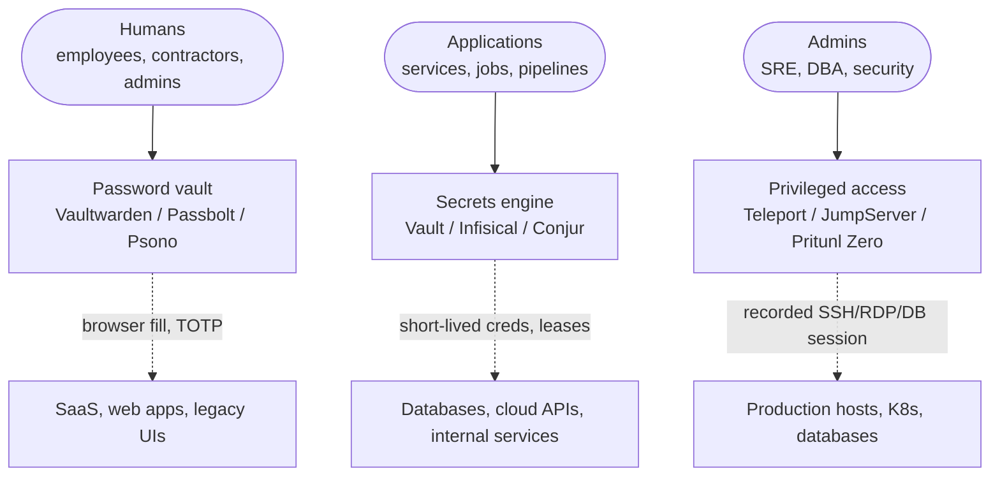

# Open-Source Secrets Management and Privileged Access

A focused tour of the three layers of secret-handling — password vaults for humans, secrets engines for machines, and privileged-access platforms for admins — and the open-source tools that cover each layer without a per-seat enterprise SKU.

## Why this matters

Secrets in `.env` files, Slack DMs, wiki pages and shared admin spreadsheets cause more breaches than zero-days. The pattern is depressingly consistent: a developer pastes a database password into a Confluence page "for now", a contractor screenshots an API key into a help-desk ticket, an SRE leaves a `terraform.tfvars` file in a public repo, and three months later somebody else's automated scanner finds it. None of these are exotic attacks. They are hygiene failures, and they are exactly what the secrets-management discipline exists to prevent.

The honest framing is that secret-handling is not one problem — it is three. **Humans** need a place to store the long tail of personal and team passwords (the Salesforce admin login, the office Wi-Fi pre-shared key, the wire-transfer portal). **Machines** need a place for application secrets (database credentials, API keys, TLS private keys, signing keys). **Admins** need controlled, audited sessions when they reach into production (SSH to a host, `psql` against the prod database, `kubectl` against the cluster). Each of those three audiences has different threat models, different tools, and different operational rhythms — and a stack that confuses them ends up with engineers pasting production database passwords into the same vault their grandmother uses for Netflix.

For most organisations the question is not "do we need a secrets manager and a PAM" but "which open-source stack covers the three layers without a six-figure cheque". Commercial CyberArk, BeyondTrust, Delinea and HashiCorp Vault Enterprise all start cheap for a pilot and climb fast — typical pricing for a 200-person engineering shop runs $40k–$200k per year once human accounts, machine identities and admin sessions are all priced. For `example.local`, that line item competes with hiring an extra engineer.

- **Without a secrets vault, secrets sprawl into source control and chat.** Every developer keeps "their copy" of the prod database URL in a shell history, a `.env.local`, a Notes app or a Slack DM. The first time the security team runs a secret scanner across the org it is a bad day, and it is always a bad day.
- **Without PAM, admin sessions are invisible.** "Who ran `DROP TABLE` on the prod replica at 03:47 last Tuesday" is a question that should have a one-click answer. Without a PAM in the path, the answer is "we think it was Alex but the SSH log got rotated".
- **Without a human password vault, sticky notes win.** A 200-person org accumulates hundreds of shared logins for SaaS tools, network gear and legacy admin UIs. If there is no sanctioned vault, those credentials live in browser autofill, sticky notes and one-off password databases on individual laptops — none of which survive an offboarding.
- **Open-source covers all three layers in 2026.** HashiCorp Vault, Infisical and Conjur cover machine secrets. Teleport, JumpServer and Pritunl Zero cover privileged access. Vaultwarden, Passbolt and Psono cover human passwords. The tools are mature, the integrations are real, and the operator effort is achievable for any team that already runs its own infrastructure.

A second-order effect of doing this work is hygiene at the application layer. Once application secrets live in Vault and not in the codebase, rotation becomes feasible. Once admin sessions go through Teleport, every `sudo` is recorded. Once human passwords live in Vaultwarden, "the wire-transfer portal password" stops being something three people remember and starts being something everybody can audit. The compliance benefits (SOC 2 CC6, ISO 27001 A.5.17 and A.8.5, PCI DSS 8) follow from the operational discipline rather than the other way around.

This page maps the open-source secret-handling landscape across all three layers and shows how `example.local` would assemble them into a single coherent stack.

## The three layers diagram

Secret-handling is not one tool — it is three layers with three different audiences, three different trust models, and three different rhythms of access. The mistake every organisation makes the first time is trying to use one tool for all three.

Read each row as an answer to a different question. The top row asks "where does a person store the password for a website" — interactive, browser-driven, occasionally shared with the team, and almost always involving a master password and TOTP. The middle row asks "how does an application get its database credentials at startup" — non-interactive, machine-to-machine, ideally short-lived, and hopefully never written to disk. The bottom row asks "how does a human reach into production safely" — interactive but recorded, with strong authentication, full session capture, and a clear audit trail per command.

The trust models differ accordingly. A password vault assumes the human is trusted but their browser is not — encryption at rest, master password, end-to-end with the vault server holding only ciphertext. A secrets engine assumes the application is trusted but the deployment substrate is not — short leases, dynamic credentials, a hard line between "what the app reads" and "what the human reads". A PAM assumes the admin is trusted but their actions need attestation — recorded sessions, certificate-based authentication, RBAC at command granularity for the systems that support it.

## Machine secrets — HashiCorp Vault

HashiCorp Vault is the industry-standard secrets engine — a Go application that bundles a secrets store, an authentication broker, a transit-encryption service and a dynamic-credential issuer behind a single HTTP API. It powers application secrets at a long list of large engineering organisations and is the default reference design when "we need a secrets manager" comes up in an architecture review.

- **Components.** Three primitives compose every Vault deployment: **secret engines** (KV for static data, AWS for dynamic IAM credentials, database for dynamic DB credentials, transit for encryption-as-a-service, PKI for issuing X.509 certs, SSH for one-time SSH keys), **auth methods** (AppRole for services, Kubernetes for pods, JWT/OIDC for CI, LDAP/AD for humans, AWS for EC2/Lambda) and **policies** (HCL files mapping `path "secret/data/app/*"` to read/write/list capabilities). The combination produces a least-privilege model that is enforceable rather than aspirational.
- **Dynamic secrets.** The killer feature. Instead of storing a long-lived database password in a secret, Vault generates a fresh username/password on demand, hands it to the application, and revokes it when the lease expires. The credential that leaks is the credential that lives for thirty minutes. Same pattern for AWS access keys, SSH access, and Kubernetes service-account tokens.
- **Transit encryption.** Vault as a key-management service — applications send plaintext, Vault returns ciphertext, the data-encryption keys never leave Vault. This is the right pattern when you want application-layer encryption (sensitive PII at rest in a database, for example) without giving every service the raw key.
- **Strengths.** Mature, widely deployed, broad ecosystem of integrations and Terraform/Helm tooling, strong authentication and audit story, dynamic secrets that genuinely reduce blast radius.
- **Trade-offs.** Operational complexity is the headline — Vault must be sealed and unsealed, requires a HA storage backend (Consul, Raft, or a managed database), and the configuration surface is large. The other live concern is licensing (see below).
- **License caveat.** Since 2023, Vault has been distributed under the Business Source License (BSL 1.1), which is **not OSI-approved**. Source remains available and most users can self-host without restriction, but the change has motivated forks (notably OpenBao, the Linux Foundation fork) and prompted some organisations to reconsider their long-term commitment. Check the licence terms against your specific use case before standardising.

The seal/unseal model deserves explanation. Vault's storage backend always holds encrypted data; the master key that decrypts that data is split via Shamir's Secret Sharing (commonly five shares with three required to reconstruct) and held by separate operators. After a restart, Vault is "sealed" — running but unable to read its own storage — until enough operators provide their unseal shares. This is excellent for security and miserable for operations, which is why production deployments either use auto-unseal (cloud KMS holds the master key) or accept the operational pain.

Vault's policy language is HCL with a path-based access model. A typical policy looks like `path "secret/data/example.local/payments/*" { capabilities = ["read"] }` and is associated with a token, an AppRole or a JWT subject. The granularity is fine enough to make `payments-api` able to read its own secrets but not those of the `billing-api` next to it — which is exactly the property you want when one service is compromised.

## Machine secrets — Infisical

Infisical is the modern open-source alternative — a Node.js/TypeScript secrets management platform with a UI-first design, native CI/CD integrations and an MIT licence. It is younger than Vault (launched 2022) but has gained substantial traction in greenfield devops teams that want the operator experience to match the rest of their tooling.

- **Devops-friendly UI.** Infisical's secret tree, environment-overrides and audit logs are visible in a polished web UI. Adding a new secret is a click rather than an HCL policy diff, and the UI shows version history and last-modified-by per secret.
- **Secret syncing.** Native integrations push secrets into Kubernetes, GitHub Actions, GitLab CI, Vercel, Netlify, AWS Parameter Store and a long list of others. The pattern is "secrets live in Infisical, get pushed automatically to wherever the app reads them" — which avoids the Vault-style runtime API call but accepts the trade-off of secrets existing in two places.
- **License.** MIT-licensed, full source on GitHub, no licence anxiety. Some enterprise features (advanced SSO, audit log retention, on-premises support) live behind a paid tier, but the self-hostable open-source product is feature-complete for most organisations.
- **Strengths.** Modern UI, sensible defaults, strong CI integration story, gentle learning curve, good Docker/Helm experience, Kubernetes operator that materialises secrets as native K8s `Secret` objects.
- **Trade-offs.** Smaller ecosystem than Vault, fewer dynamic-secret backends (Infisical's dynamic secret support is growing but does not yet match Vault's depth across cloud and database backends), and the Node.js footprint is heavier than Vault's Go binary.

The architectural difference from Vault is worth noting. Vault's default pattern is "the app calls Vault at startup and on lease renewal"; Infisical's default pattern is "secrets are pushed into the environment the app already reads from". Both work, both have trade-offs — Vault gives you tighter revocation and dynamic credentials, Infisical gives you simpler app code and easier debugging. Most teams converge on a hybrid where Vault handles dynamic backends and Infisical handles the static-secret + CI integration story.

## Machine secrets — CyberArk Conjur (Open Source)

Conjur is the open-source secrets manager originally built by Conjur Inc, acquired by CyberArk in 2017, and maintained as the OSS companion to CyberArk's commercial PAM portfolio. It is a Ruby-on-Rails application with a strong RBAC model and deep Kubernetes/CI integration story, distributed under the Apache 2.0 licence.

- **What it is.** A policy-driven secrets manager — secrets, roles and permissions are declared in YAML policy files, applied via the Conjur CLI or API, and version-controlled like the rest of your infrastructure-as-code.
- **When it makes sense.** The strongest case is "we are already a CyberArk shop" — Conjur OSS shares concepts and tooling with CyberArk's commercial products and is the natural choice for organisations that want an open-source secrets layer that ladders up cleanly to CyberArk Vault and PAM if they grow into the enterprise tier.
- **Strengths.** Fine-grained RBAC, declarative YAML policy, strong Kubernetes Authenticator (pods authenticate via service-account tokens), Apache 2.0 licence, mature audit logging.
- **Trade-offs.** Smaller community than Vault or Infisical, documentation can feel CyberArk-flavoured (which helps existing CyberArk customers and confuses everyone else), Ruby-on-Rails footprint, and dynamic-secret coverage is narrower than Vault's.

For organisations without an existing CyberArk relationship, Vault or Infisical is the more obvious starting point. Conjur's strongest niche is the enterprise that has already standardised on CyberArk for human PAM and wants the same conceptual model for machine secrets.

## Vault vs Infisical vs Conjur — comparison table

| Dimension | HashiCorp Vault | Infisical | CyberArk Conjur OSS |
|---|---|---|---|
| Licence | BSL 1.1 (not OSI) | MIT | Apache 2.0 |
| Language | Go | TypeScript / Node.js | Ruby on Rails |
| Architecture | Single binary + storage backend | Web app + Postgres | Rails app + Postgres |
| Dynamic secrets | Best-in-class (DB, cloud, SSH, PKI) | Growing, fewer backends | Limited |
| UI experience | Functional, admin-led | Polished, UI-first | Functional, policy-led |
| CI/CD integrations | Via API, mature | Native push to most CI | Strong K8s authenticator |
| Operator complexity | High (seal/unseal, HA storage) | Medium | Medium–High |
| Best for | Full machine-secrets ops | Greenfield devops | CyberArk shops |

For most `example.local`-shaped organisations the choice collapses to Vault (most mature, dynamic secrets, accept BSL caveat) or Infisical (modern UX, MIT, accept smaller dynamic-secret coverage). Conjur is the right answer when CyberArk is already in the strategy. Many production stacks end up running Vault for dynamic backends and Infisical for static + CI secrets — the two tools coexist cleanly.

## Privileged Access — Teleport

Teleport is the modern open-source PAM — a Go application that bundles a certificate authority, a session-recording proxy, an RBAC engine and protocol-specific access for SSH, Kubernetes, RDP, databases and web apps behind a single control plane. It is widely deployed in cloud-native engineering organisations as the replacement for VPN + bastion + ad-hoc access.

- **Built-in CA.** Teleport issues short-lived (typically 1–8 hours) X.509 and SSH certificates to authenticated users, and every protected resource trusts only the Teleport CA. No more long-lived SSH keys lying around in `~/.ssh/authorized_keys` — the certificate is issued at login, used, and expires.
- **Protocols.** SSH (with full session recording and `tsh ssh` UX), Kubernetes (`tsh kube login` issues a short-lived kubeconfig, all `kubectl` calls flow through Teleport), RDP (browser-based session recording for Windows hosts), databases (PostgreSQL, MySQL, MongoDB, Redis and others — Teleport proxies the wire protocol and records queries), and HTTP apps (reverse-proxy mode for internal web UIs).
- **Session recording.** Every interactive session is recorded (terminal stream for SSH/`kubectl exec`, video for RDP, query log for databases) and stored in S3 or local disk. Sessions can be replayed for incident review or compliance audits.
- **RBAC.** Roles map users to allowed nodes, allowed Kubernetes namespaces, allowed databases, allowed commands. The model supports request-based access (a user requests sudo on `prod-db-01`, an approver clicks approve, the access is granted for 30 minutes and recorded).
- **SSO integration.** OIDC and SAML support means Teleport plugs into Keycloak, Okta, Entra and Google Workspace as the upstream identity source.

The certificate model is what makes Teleport feel different from a traditional bastion. There is no permanent SSH key in `~/.ssh` for production hosts — the user runs `tsh login`, authenticates via SSO + MFA, and Teleport issues a certificate valid for the session window. When the user logs out (or the certificate expires), all access is gone. There is nothing to rotate, nothing to revoke, nothing to find on a stolen laptop.

The trade-off is operator complexity. Teleport is a real distributed system — auth server, proxy server, and per-resource agents — and HA deployment requires planning (etcd or DynamoDB backend, certificate trust chains, audit log storage). The Open Source edition covers the full feature set described above; some advanced features (FedRAMP/HSM, advanced session policies, machine ID at scale) live in Teleport Enterprise.

## Privileged Access — JumpServer

JumpServer is the leading open-source bastion host — a Python/Django + Go application originally developed by FIT2CLOUD in China, now widely deployed across Asia and increasingly elsewhere. It is fully open-source under the GPLv3 licence and covers the same SSH/RDP/K8s/DB protocols as Teleport with a different operator philosophy.

- **Asset management.** JumpServer's data model centres on **assets** (hosts, databases, K8s clusters), **accounts** (the credentials JumpServer holds for each asset), and **users** (the humans who connect). The UI manages all three as first-class objects, which fits well with traditional IT-ops workflows where the bastion is the source of truth for "what hosts exist".
- **Session recording.** Full terminal recording for SSH, video recording for RDP, command auditing for databases. Recordings are searchable and stored locally or in S3-compatible storage.
- **Protocols.** SSH, RDP, VNC, Telnet (yes, still useful for legacy network gear), MySQL, PostgreSQL, MongoDB, Oracle, SQL Server, Redis, Kubernetes. The breadth of supported protocols is genuinely impressive — JumpServer is often the only open-source bastion that speaks to legacy network and storage equipment out of the box.
- **Web-based access.** Most sessions launch in the browser via Apache Guacamole-style web rendering — no client install needed, which is a big win for contractor and emergency-access workflows.
- **LDAP/AD + RBAC.** Native LDAP and AD integration for user identity, role-based permissions per asset and per command-acl rule, MFA enforcement at login.

The trade-off versus Teleport is the architectural shape. Teleport is certificate-first and assumes a modern engineering team with cloud-native tooling. JumpServer is bastion-first and assumes the operator wants centralised credential storage, asset inventory, and session brokering in one product. For SSH-heavy environments with a long tail of legacy systems and a traditional IT-ops culture, JumpServer's model often fits better than Teleport's.

A historical note: the JumpServer admin UI's default language is Chinese, with English available as a setting. This used to be a friction point for non-Chinese-speaking teams; recent versions have substantially improved the English experience, but documentation in English still lags Chinese-language docs and community discussion.

## Privileged Access — Pritunl Zero

Pritunl Zero is a lightweight zero-trust SSH bastion built around certificate-based authentication and a web-based approval flow. It is a focused tool — it does SSH and HTTP reverse proxy well and does not try to be a full multi-protocol PAM.

- **Pattern.** Users authenticate via SSO + MFA at the Pritunl Zero web portal, request access to a host, and Pritunl Zero issues a short-lived SSH certificate. The user's standard `ssh` client picks up the certificate and connects normally — there is no special wrapper command, just OpenSSH with a fresh certificate.
- **HTTP reverse proxy.** Pritunl Zero can also front internal web apps with the same SSO + MFA + short-lived certificate model, which makes it a reasonable choice for protecting a small fleet of admin UIs without standing up Authelia or oauth2-proxy alongside.
- **When it fits.** Small to mid-size environments where the access pattern is mostly SSH, the team wants certificate-based auth without the Teleport learning curve, and "session recording" is not a hard requirement (Pritunl Zero does not natively record terminal sessions).
- **Strengths.** Lightweight, simple operator model, MongoDB backend, clean web UI, integrates cleanly with existing SSH workflows.
- **Trade-offs.** Narrower feature surface than Teleport or JumpServer — no native Kubernetes proxy, no database session recording, no RDP. The "lacks full session granularity" critique from the original survey still applies.

Pritunl Zero is the right pick when SSH is the dominant access protocol, the team is small enough that a 200-line config file is preferable to a full PAM platform, and audit requirements stop at "we know who logged in and when" rather than "we have the full keystroke recording".

## PAM tooling — comparison table

| Capability | Teleport | JumpServer | Pritunl Zero |
|---|---|---|---|
| SSH access | Full, recorded | Full, recorded | Full, certificate-based |
| RDP access | Full, recorded (browser) | Full, recorded (browser) | Not natively |
| Database access | Native proxy + record | Native proxy + record | Not natively |
| Kubernetes access | Native (`tsh kube`) | Native | Not natively |
| Web app proxy | Yes (apps mode) | Limited | Yes |
| Session recording | All protocols | All protocols | No native recording |
| RBAC granularity | Role + request-based | Role + command ACL | Role-based |
| SSO + MFA | OIDC, SAML, U2F | LDAP, OIDC, MFA | OIDC, U2F |
| Architecture | Cert-first, distributed | Bastion-first, monolithic | Cert-first, lightweight |
| Best for | Cloud-native full-stack | SSH/RDP-heavy enterprise | SSH-only minimal |

For an organisation with multi-cloud Kubernetes and a strong devops culture, Teleport is usually the answer. For traditional IT-ops with long-tail legacy infrastructure and a need for asset inventory, JumpServer fits better. For small environments where SSH is most of the picture, Pritunl Zero is a clean lightweight option. The choice often comes down to "what does the team's existing operational rhythm look like" rather than a feature checklist.

## Password vaults — Vaultwarden

Vaultwarden is a Rust-based reimplementation of the Bitwarden server API — fully compatible with the official Bitwarden client apps (browser, mobile, desktop, CLI), but designed to be small, fast and easy to self-host. It runs comfortably on a Raspberry Pi for a small team or in a 1 GB VM for a larger org, and it is licensed under the AGPL.

- **What it is.** A drop-in Bitwarden-compatible server — point any Bitwarden client at your Vaultwarden URL and it just works. Vaults, organisations, collections, sharing, send links, file attachments, TOTP storage and password generation all behave exactly as they do against bitwarden.com.
- **Bitwarden client compatibility.** This is the killer feature. Bitwarden's clients are excellent — first-class browser extensions, mobile apps with biometric unlock, a polished desktop app, a scriptable CLI — and Vaultwarden lets you use all of them against a server you control. Bitwarden Free Family for Org features and most Bitwarden Premium client features (TOTP, attachments, emergency access, security reports) work against Vaultwarden because the clients do not know they are not talking to bitwarden.com.
- **Resource footprint.** A single Rust binary plus a SQLite (or Postgres/MySQL) database. The Docker image is around 100 MB; a small deployment uses well under 256 MB RAM.
- **Strengths.** Tiny footprint, full Bitwarden client compatibility, active maintainer, sensible defaults, easy backup (`/data` folder + database).
- **Trade-offs.** Community-maintained — there is no official Bitwarden support contract behind it, and a few enterprise-tier Bitwarden features (some SSO flows, advanced policy, certain compliance reporting) either lag or work differently. The licensing relationship to Bitwarden is friendly but not formal.

The most important operational note about Vaultwarden is the backup. The entire state of the system — every secret, every attachment, every user — lives in the `/data` folder (or the database it points at). Lose `/data` and you have lost the vault. The right pattern is nightly off-host backups of `/data` plus the database, encrypted with a key not stored on the same host, with quarterly restore tests. Skip this and the first disk failure is the last day the vault exists.

For most organisations, Vaultwarden plus the official Bitwarden clients is the highest-leverage open-source security choice available — it solves the human-password problem completely, costs almost nothing to run, and gives every employee a tool they can also use for their personal passwords.

## Password vaults — Passbolt

Passbolt is a team-oriented open-source password manager built around GPG-based end-to-end encryption. It is a PHP application with a strong focus on collaborative sharing — granting one person access to a credential is a first-class operation rather than a side effect of folder structure. Passbolt is licensed under the AGPL, with a paid Pro tier adding SSO, advanced audit and directory sync.

- **Team-oriented design.** Passbolt's primary unit is the "shared password" — a credential held by the vault and explicitly granted (with read or read/write permissions) to specific users or groups. Sharing is auditable and revocable per credential, which fits team workflows better than the personal-vault-with-shared-folder model.
- **GPG crypto.** Each user has a GPG keypair generated on enrolment; secrets are encrypted to the recipient's public key when shared. The server never sees plaintext, and revoking a user's access requires re-encrypting the secret to the remaining recipients — slow at large scale but cryptographically clean.
- **Browser extension + UI.** First-class Chrome and Firefox extensions, web UI for management, mobile apps for read access. The browser extension auto-fills credentials and handles encryption client-side.
- **Strengths.** Genuinely team-first design, end-to-end GPG encryption, granular per-credential sharing, AGPL licence, mature LDAP/AD integration in the paid tier.
- **Trade-offs.** Setup is heavier than Vaultwarden (PHP + MySQL + GPG configuration), mobile and offline access have historically lagged Bitwarden, and the GPG model — while cryptographically strong — adds operational overhead when keys are lost or rotated.

Passbolt is the right pick when team-shared credentials are the dominant use case and the security culture values explicit sharing models over the more permissive folder-based sharing in most other vaults.

## Password vaults — Psono

Psono is an alternative team-oriented open-source password manager with a strong API surface and Docker-first deployment story. It is licensed under the Apache 2.0 (community edition; some enterprise features are GPL or proprietary) and targets organisations that want a password vault with a real REST API for automation.

- **What it is.** A multi-user, multi-tenant password vault with end-to-end client-side encryption, browser extensions, mobile apps, and a documented REST API for programmatic access.
- **Strengths.** Strong API for automation (rare among password vaults), file-secret support (store binary blobs alongside passwords), LDAP and SAML integration, granular per-secret access control, Docker-first deployment.
- **Trade-offs.** UI is less polished than Bitwarden or Passbolt, smaller community, and some enterprise features live behind a paid tier with less-permissive licensing than the community core.

Psono fits best when the organisation needs API access for automation (provisioning credentials into deployment pipelines, rotating service account passwords from scripts) and is willing to trade UI polish for that capability. For pure human use, Vaultwarden or Passbolt usually wins on day-to-day experience.

## Tool selection — comparison table

| Need | Pick | Notes |
|---|---|---|
| Full machine-secrets ops with dynamic credentials | HashiCorp Vault | Mature, broad backend support, accept BSL caveat |
| Greenfield devops, secrets in CI and K8s | Infisical | MIT, modern UX, native CI integrations |
| Existing CyberArk shop wanting open-source companion | CyberArk Conjur OSS | Apache 2.0, ladders into CyberArk PAM |
| Human passwords for the whole org | Vaultwarden | Best Bitwarden-compatible self-hosted server |
| Team-first GPG-encrypted credential sharing | Passbolt | Sharing as a first-class operation |
| Password vault with strong REST API | Psono | When automation matters more than UX polish |
| Full-stack PAM (SSH, RDP, K8s, DB) | Teleport | Cert-first, modern, cloud-native |
| Asset-inventory bastion for SSH/RDP-heavy estates | JumpServer | Bastion-first, broadest protocol coverage |
| Lightweight SSH-only bastion | Pritunl Zero | Certificate-based SSH without PAM weight |

There is no shame in mixing tools — `example.local` ends up running Vault for dynamic application secrets, Vaultwarden for human passwords, and Teleport for admin sessions, all at the same time. That is the normal shape of a complete secret-handling stack. The mistake is choosing one tool and bending it to do all three jobs badly when three complementary tools would each do their job well.

## Hands-on / practice

Five exercises to make this concrete in a homelab or sandbox for `example.local`.

1. **Deploy Vault in dev mode and store/retrieve a secret.** Run `vault server -dev`, set `VAULT_ADDR=http://127.0.0.1:8200` and `VAULT_TOKEN=<root-token>`, then `vault kv put secret/example.local/api key=hello && vault kv get secret/example.local/api`. Inspect the JSON response, then write a 10-line script that reads the secret via the HTTP API with a token. The point is to understand the read/write loop end-to-end before adding auth methods or policies.
2. **Set up Vaultwarden + Bitwarden CLI on a workstation.** Deploy Vaultwarden via `docker run -d --name vaultwarden -v /opt/vaultwarden:/data -p 8000:80 vaultwarden/server:latest`, install the Bitwarden CLI (`bw`), point it at your Vaultwarden URL with `bw config server http://localhost:8000`, create a user, log in (`bw login`), unlock the vault, and store/retrieve a credential via `bw create item` and `bw get item`. Confirm the same credentials are visible in the Bitwarden browser extension.
3. **Integrate Vault dynamic DB credentials into a sample app.** Configure Vault's database secrets engine for a test PostgreSQL, create a role that issues short-lived (5-minute) credentials with `SELECT` on one table, then write a tiny app that fetches credentials from Vault, opens a DB connection, runs a query and exits. Watch the credential expire in pg's `pg_stat_activity` and confirm a fresh fetch issues a new one.
4. **Deploy Teleport and SSH to a test host through it.** Run a Teleport auth+proxy server in Docker, install `teleport-node` on a target VM, register the VM, log in with `tsh login --proxy=teleport.example.local`, then `tsh ssh user@target-vm`. Confirm the session is recorded in the audit log and replay it from the Teleport UI. Bonus: enable RBAC and require approval for sudo access.
5. **Configure Passbolt for a 5-person team.** Deploy Passbolt via Docker Compose, create five user accounts, generate GPG keys for each via the enrolment flow, then create a shared "Office wifi password" credential and grant read access to two users and read/write to one. Revoke a user's access and confirm the credential is re-encrypted to the remaining recipients.

After the five exercises a learner should be comfortable with the read/write loop in a secrets engine, the Bitwarden client + self-hosted server combination, dynamic secrets bound to a real backend, certificate-based PAM access with audit, and the GPG-based team-sharing model. Those five capabilities cover roughly 80% of what an open-source secret-handling operator does week-to-week.

A useful sixth exercise once those land: integrate Vaultwarden, Vault and Teleport with a single SSO upstream (Keycloak from the IAM lesson), so all three tools share one login identity. The plumbing is OIDC for each, but seeing the same user log into all three with one click is the "aha" moment for federated identity across the secret-handling stack.

## Worked example — `example.local` migrating off "shared root password in 1Password"

`example.local` is a 200-person engineering organisation whose entire secret-handling strategy used to be: "the shared root password lives in 1Password, three people know it, application secrets live in `.env` files committed to a private repo, and admin SSH happens with personal keys distributed via Slack DMs". Audit findings during a SOC 2 Type 2 readiness review made the rebuild non-optional.

- **Human passwords — Vaultwarden.** Single Vaultwarden instance on a small VM, daily encrypted backups of `/data` plus the database to an off-site bucket. Every employee enrols, the official Bitwarden browser extension is pushed via MDM, and the legacy 1Password is decommissioned over a 60-day window with a clear migration playbook. Office Wi-Fi, SaaS admin logins, and the wire-transfer portal credential all live in shared Vaultwarden organisations with explicit RBAC.
- **Application secrets — Vault.** Two-node Vault cluster with Raft storage, auto-unseal via cloud KMS, integrated with the existing Keycloak as the OIDC auth method for humans and AppRole for services. Every application gets a Vault path matching its name (`secret/data/example.local/payments`, `secret/data/example.local/billing`) and a policy that grants read-only access. Database credentials are dynamic — the payments service requests a fresh PostgreSQL credential at startup, holds it for the 1-hour lease, and rotates on renewal.
- **Admin sessions — Teleport.** Teleport auth+proxy cluster behind the existing load balancer, OIDC SSO via Keycloak, WebAuthn MFA enforced at login. Every production host runs the Teleport agent; SSH, `kubectl`, and PostgreSQL access all flow through Teleport with full session recording. Personal SSH keys for production are deleted; the only path in is via short-lived Teleport-issued certificates.
- **Audit + SOC 2.** Vaultwarden access logs, Vault audit log, and Teleport session recordings all ship to the central SIEM. Quarterly access reviews use the Vault policy and Teleport role exports as the source-of-truth for "who can read what" and "who can SSH where". The auditor's "show me a recording of a production change" question now has a one-link answer.
- **Cost.** Hardware: ~$2,500 across the Vault pair, Vaultwarden VM, and Teleport cluster. Subscriptions: $0. Engineering: ~6 weeks of one engineer's time for the build, ongoing ~15% of one FTE for operations and onboarding.

The previous combined quote for HashiCorp Vault Enterprise + Teleport Enterprise + 1Password Business + a CyberArk pilot was $95k/year. The open-source rebuild pays back in under nine months and leaves `example.local` with a stack they fully control — no per-seat escalation, no surprise SKU repackaging, and a clear audit trail end-to-end.

The non-financial wins are arguably bigger. The "shared root password" anti-pattern is gone — every privileged action is attributable to a named person via a recorded session. Application secrets no longer leak into source control because there is nowhere convenient to leak them to. Offboarding now removes a leaver's access to every system within minutes via the Keycloak SSO + Teleport role link. The next time the security team gets asked "who ran X on Y", the answer is a one-click report.

## Troubleshooting & pitfalls

A short list of failure modes that turn an open-source secret-handling project from "win" into "regret". Most of these are not novel — they are the same patterns commercial vaults hit too — but the open-source stack tends to surface them earlier because there is no managed-service team papering over the rough edges on your behalf.

- **Vault sealing/unsealing operational pain.** A Vault restart leaves the cluster sealed and unable to read its own storage until enough operators provide unseal shares. Production deployments must use auto-unseal (cloud KMS or HSM) — manual seal/unseal at 3am is a recipe for outages and burned-out operators. Document the recovery key holders, test the recovery flow quarterly.
- **Vault BSL licence shock.** Teams sometimes deploy Vault assuming it is still MPL 2.0, then discover the BSL during procurement or compliance review. Get the licence question answered before standardising — for many use cases BSL 1.1 is fine, but "production use to provide a competitive offering" has restrictions worth understanding. OpenBao is a viable Apache-2.0 fork if BSL is a hard blocker.
- **Vaultwarden backup is just `/data` (and the database).** Vaultwarden's entire state — every secret, every attachment, every user — lives in `/data` and the configured database. Lose either and you have lost the vault. Nightly off-host encrypted backups, quarterly restore tests, and a documented disaster-recovery runbook are non-optional.
- **Teleport CA rotation.** Teleport's certificate authority must be rotated periodically (annually is a sensible default), and the rotation is a multi-step operation that touches every Teleport-protected resource. Rotations have failed in production when an agent missed the new CA — practice the rotation in staging, monitor agent versions, and never let CA rotation surprise you.
- **Secret-rotation workflows that nobody actually runs.** Teams declare "we rotate database passwords quarterly" in a policy doc and then never do it because rotation is manual, scary and lacks an owner. The fix is dynamic secrets (so rotation is automatic) or a real runbook with named owners and calendar-driven reminders. Wishful policy is worse than honest no-rotation because it lies to the auditor.
- **Secrets in CI logs.** A secret stored correctly in Vault or Infisical can still leak by being printed to a CI log via `echo $DB_PASSWORD` in a debug script. Use the CI provider's secret-masking features, audit pipelines for `set -x` style debugging, and treat any pipeline log as potentially public until proven otherwise.
- **Bitwarden client compatibility edge cases.** Vaultwarden tracks the Bitwarden API closely but lags occasionally — when Bitwarden ships a new feature (a new SSO flow, an updated security report, a new emergency-access flow) Vaultwarden support follows in days or weeks. Check the Vaultwarden release notes against the Bitwarden client version before assuming a premium feature works.
- **Service accounts that bypass MFA.** Every secrets manager and PAM grows a few "automation" accounts that exist to call APIs from CI or backend jobs. These accounts often end up MFA-exempt because TOTP does not fit the use case — and then quietly accumulate broad permissions that make them top-tier compromise targets. Use OAuth client credentials with rotated secrets, scope each one tightly, and audit them quarterly.
- **PAM as the only path becomes the SPOF.** When Teleport or JumpServer is the only way to reach production, an outage of the PAM is an outage of every operational lever. Maintain a documented break-glass path (a sealed envelope with emergency credentials, a separate out-of-band SSH bastion, a clear runbook for "Teleport is down") and test it at least once a year.
- **Mermaid diagrams broken by smart quotes.** The diagrams in this stack assume plain ASCII brackets and arrows. Pasting in smart quotes, em-dashes, or non-breaking spaces from a word processor will silently break the render. Edit secrets/PAM diagrams in a code editor, not a doc tool.

## Key takeaways

The headline points to remember from this chapter, condensed for handover or revision.

- **Secret-handling is three problems, not one** — humans need a password vault, machines need a secrets engine, admins need a privileged-access platform. A single tool cannot do all three well; mixing two or three complementary products is the normal shape.
- **HashiCorp Vault is the machine-secrets default**, with the broadest dynamic-secret coverage and the deepest ecosystem. The BSL licence change is real but does not block most use cases — check the terms, then commit.
- **Infisical is the modern devops alternative**, especially for greenfield CI + Kubernetes workloads where MIT licensing and a polished UI matter more than the deepest dynamic-secret backend coverage.
- **Vaultwarden is the highest-leverage open-source security choice for human passwords.** Tiny footprint, full Bitwarden client compatibility, drop-in self-host. Backup `/data` like your job depends on it, because it does.
- **Teleport is the cloud-native PAM default**, with a certificate-first model that genuinely removes long-lived SSH keys from the picture. JumpServer fits SSH/RDP-heavy traditional estates better; Pritunl Zero fits SSH-only minimal needs.
- **Dynamic secrets are the operational unlock.** Rotation that nobody runs is worse than honest no-rotation. Pick a tool that makes rotation automatic, not aspirational.
- **Plan for backup, break-glass, and CA rotation.** A lost Vaultwarden `/data`, a stuck Vault seal, or a botched Teleport CA rotation each become multi-day outages without preparation. Treat the secret-handling stack as the most critical system, because it is.
- **Roll out in phases.** Human passwords first (immediate win, low risk), then application secrets (medium effort, big payoff), then admin PAM (highest effort, biggest audit win). Trying to land all three at once is the most common reason these projects stall.
- **Federate identity.** Wire all three layers (Vaultwarden, Vault, Teleport) to one SSO upstream so a single login disable removes everything. This is the security property that makes the rest of the stack worth running.
- **Treat secret-handling as a product, not a project.** The first quarter is the install; every quarter after is integrating new apps, retiring old ones, rotating tokens, and patching the stack. Budget for ongoing operator time, not just the build sprint.

## References

The vendor and standards references that underpin this chapter — keep these handy when designing or operating the stack.

- [HashiCorp Vault — vaultproject.io](https://www.vaultproject.io)
- [Infisical — infisical.com](https://infisical.com)
- [CyberArk Conjur OSS — conjur.org](https://www.conjur.org)
- [OpenBao — openbao.org](https://openbao.org)
- [Teleport — goteleport.com](https://goteleport.com)
- [JumpServer — jumpserver.org](https://www.jumpserver.org)
- [Pritunl Zero — pritunl.com/zero](https://pritunl.com/zero)
- [Vaultwarden — github.com/dani-garcia/vaultwarden](https://github.com/dani-garcia/vaultwarden)
- [Bitwarden — bitwarden.com](https://bitwarden.com)
- [Passbolt — passbolt.com](https://www.passbolt.com)
- [Psono — psono.com](https://psono.com)
- [NIST SP 800-57 — Recommendation for Key Management](https://csrc.nist.gov/publications/detail/sp/800-57-part-1/rev-5/final)
- [NIST SP 800-63B — Digital Identity Guidelines](https://pages.nist.gov/800-63-3/sp800-63b.html)
- [CIS Controls v8 — Control 5 (Account Management)](https://www.cisecurity.org/controls/account-management)
- [CIS Controls v8 — Control 6 (Access Control Management)](https://www.cisecurity.org/controls/access-control-management)
- [OWASP Secrets Management Cheat Sheet](https://cheatsheetseries.owasp.org/cheatsheets/Secrets_Management_Cheat_Sheet.html)
- [PCI DSS v4.0 — Requirement 8 (Identify and Authenticate)](https://www.pcisecuritystandards.org/document_library/)
- [SOC 2 Trust Services Criteria — CC6 (Logical Access)](https://www.aicpa-cima.com/topic/audit-assurance/audit-and-assurance-greater-than-soc-2)
- Related lessons: [Open-Source Stack Overview](./overview.md) · [IAM and MFA](./iam-and-mfa.md) · [Firewall, IDS/IPS, WAF](./firewall-ids-waf.md) · [SIEM and Monitoring](./siem-and-monitoring.md) · [Jump Server](../../servers/services/jump-server.md)
