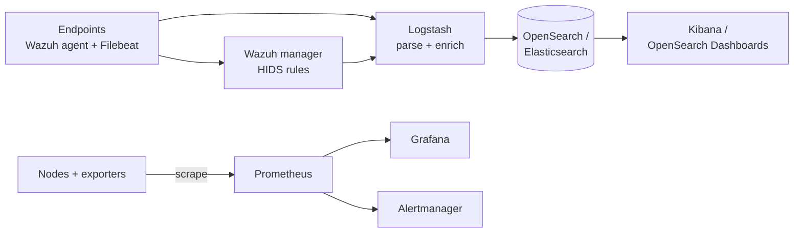
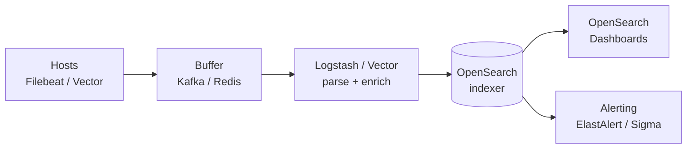

# Open-Source SIEM, Logging and Monitoring

A focused look at the open-source tools that make up the detection and observability layers of a defensible environment — the host-based intrusion detection agents, log aggregation pipelines, and infrastructure monitoring engines that small teams can run without a Splunk-shaped invoice.

This page assumes you have already deployed the perimeter controls covered in the [Firewall, IDS/IPS, WAF and NAC](./firewall-ids-waf.md) lesson. The detection stack here is what consumes the telemetry those controls produce, alongside host telemetry from agents.

## Why this matters

You cannot defend what you cannot see. Every incident response post-mortem ever written has the same first finding: the signal was in the logs, but no one was watching. For a team running a commercial SIEM, "watching" costs roughly the price of a junior engineer per gigabyte per day of ingestion — and most organisations end up either dropping logs to stay under quota or paying for visibility they never look at.

The detection-and-monitoring layer is also where security and platform engineering naturally meet. The same OpenSearch cluster that holds Wazuh alerts can hold application logs; the same Prometheus that watches CPU can watch authentication failures per minute. Investing in the open-source observability stack therefore pays dividends to both teams — and the cost of *not* investing falls disproportionately on whoever is awake at 3am during the next incident.

For `example.local` — a 200-person engineering organisation that needs real detection coverage but cannot stomach a $200,000/year Splunk Enterprise quote — the open-source detection and monitoring stack is a serious alternative. **Wazuh + OpenSearch + Prometheus + Grafana** covers endpoint HIDS, log aggregation, dashboards, alerting, and infrastructure metrics for a hardware bill that fits in a single rack and an engineering bill measured in FTE-fractions, not headcount.

- **Visibility is the foundation of detection.** Firewalls block, EDR catches, but neither tells you the story of what happened across the environment over the last 30 days. That story lives in aggregated logs, host telemetry, and metrics — and you only get it if you collected and indexed it before the incident.
- **Commercial SIEM costs scale with log volume, not with risk.** Splunk, Sentinel and QRadar all bill by gigabyte ingested. The same volume on OpenSearch + Wazuh runs on commodity storage at roughly 10% of the per-GB cost.
- **HIDS catches what network IDS misses.** Suricata sees packets on the wire; Wazuh sees `auditd`, file integrity, registry changes, and process trees on the host. They are complementary, not redundant.
- **Monitoring is detection's twin.** A "service is down" alert from Prometheus is sometimes the first sign of an attack — ransomware crashing services, a webshell exhausting CPU, or an attacker stopping logging daemons. Treat the monitoring stack as a peer of the SIEM, not a separate operations concern.
- **Compliance lives in the log store.** PCI-DSS, ISO 27001, SOC 2 and most regulatory regimes require centralised log retention, integrity protection, and access review. The open-source stack handles all three with no per-seat licence — you supply the disks and the policy.
- **Observability and security are converging.** What used to be two parallel stacks (DevOps metrics on one side, security logs on the other) is increasingly one shared telemetry plane. Building it open-source from the start avoids the painful "we need to migrate logs to security tooling" project five years in.

This page maps the three observability families — **HIDS/SIEM, log aggregation, infrastructure monitoring** — to the leading open-source tools, explains where each one fits, and gives you a concrete deployment sketch you can copy.

## Stack overview

The three families compose into a single telemetry path with two parallel data flows — events through the SIEM/log path, metrics through the monitoring path. Both terminate in dashboards and alert routers, but the storage engines and query languages are deliberately different.

Read the diagram as data flow, not deployment. In practice the Wazuh manager, Logstash, and OpenSearch can live on three boxes or on one beefy node for a small site; Prometheus and Grafana usually share a separate monitoring host. The point is the *shape* of the pipeline — agents and shippers at the edge, parsing in the middle, an index for search, dashboards for humans, and a parallel metrics path that does not go through the log store.

Two patterns to internalise from the diagram. First, **logs and metrics travel different paths for good reason**: log data is high-volume, schema-flexible, and queried by humans during investigation; metric data is low-volume, fixed-schema, and queried by alert rules every few seconds. Cramming both into one store works at toy scale and breaks at production scale. Second, the **Wazuh manager sits between agents and the log store** rather than the agent shipping straight to OpenSearch — that intermediate hop is where rules fire, ATT&CK tags get attached, and active-response actions are dispatched.

## SIEM/HIDS — Wazuh

Wazuh is an open-source XDR and SIEM platform that grew out of an OSSEC fork in 2015. It bundles a host-based intrusion detection agent, a centralised manager that processes alerts, an OpenSearch-based indexer, and a web dashboard — all under a single project with active commercial backing.

In the open-source detection space, Wazuh is the closest thing to a default. It is what most "small SOC, no licence budget" reference architectures land on, and the documentation, community, and rule coverage have all matured to the point where it is the boring, low-risk choice rather than a brave one.

- **Components.** A Wazuh deployment has four moving parts. **Agents** run on each monitored host (Windows, Linux, macOS, AIX, Solaris) and ship logs, file-integrity events, and inventory data. The **manager** is the central server that receives agent traffic, evaluates rules, and emits alerts. The **indexer** (a packaged OpenSearch) stores events for search. The **dashboard** (a packaged OpenSearch Dashboards) is the UI for analysts.
- **Built-in rule sets.** Wazuh ships with thousands of decoders and rules out of the box: SSH brute force, Windows event log signatures, sudo abuse, file integrity changes, web-server access patterns, container runtime events, cloud audit logs, and compliance check rules for PCI-DSS, HIPAA, NIST 800-53, GDPR and TSC. You can run useful detection on day one without writing a single rule.
- **File integrity monitoring (FIM).** The agent watches configurable directories for create, modify, delete and attribute changes. Reports include the changed file path, the user that touched it, and (optionally) the before/after content hashes. FIM is the single feature that makes Wazuh useful for PCI-DSS req. 11.5 and tamper detection on production hosts.
- **MITRE ATT&CK mapping.** Wazuh tags built-in rules with ATT&CK technique IDs, so an alert for `T1110 — Brute Force` carries the framework reference automatically. The dashboard has a dedicated ATT&CK navigator view that highlights which techniques you have coverage for.
- **Vulnerability detection.** The manager pulls CVE feeds (NVD, vendor advisories) and cross-references the agent-reported software inventory. You get a per-host list of known-vulnerable packages without standing up a separate scanner.
- **Active response.** Agents can run scripts triggered by alerts — block an IP at the local firewall, kill a process, disable a user account. Powerful, and a foot-gun: misconfigured active response has locked organisations out of their own infrastructure.
- **Integrations.** Native modules for AWS, Azure, GCP, Office 365, GitHub audit, Docker, Kubernetes, VirusTotal lookups, and Slack/PagerDuty notifications. The integration footprint is the strongest reason to pick Wazuh over plain OSSEC.
- **When to choose.** You want a turnkey HIDS + SIEM with a UI, prebuilt rules, and an active maintainer. Wazuh is the default starting point for any greenfield open-source SOC.

## SIEM/HIDS — OSSEC and OSSEC+

OSSEC is the original open-source HIDS, released in 2004. It is the lineage Wazuh forked from, and the project is still maintained — both as the community OSSEC and as the commercially-backed OSSEC+ from Atomicorp.

There is occasional confusion about whether to "still bother" with OSSEC given Wazuh's dominance. The honest answer: most teams should not — but OSSEC remains the right choice in narrow cases where the Wazuh dashboard, indexer, and four-component footprint are overkill, and where the organisation already has its own log pipeline and just wants the agent.

### OSSEC (community)

The classic OSSEC agent and manager. File integrity monitoring, log analysis, rootkit detection, active response — all under 50 MB, all in C, all extremely stable.

- **Strengths.** Tiny footprint (runs happily on appliances and embedded systems), zero external dependencies, extremely mature codebase, decades of production use.
- **Weaknesses.** No native UI — you wire it to your own dashboard or use a third-party front-end. Rule-set updates are slower than Wazuh's. Smaller integration ecosystem.
- **Rule format.** XML-based decoders and rules. Decoders normalise raw log lines into named fields; rules match on those fields and assign a severity level (1–15). The same XML format is what Wazuh inherited and extended, which is why migrations between the two are mostly mechanical.
- **When to choose.** You want a minimal HIDS agent on resource-constrained hosts, you have an existing log pipeline that already handles visualisation, or you specifically want the unforked upstream codebase.

### OSSEC+ (Atomicorp)

OSSEC+ is the free-but-registration-gated edition maintained by Atomicorp. It adds machine-learning anomaly detection, PKI agent encryption, prebuilt ELK integration, and access to Atomicorp's community threat-sharing feed.

- **Strengths.** ML-based anomaly engine, real-time community threat intelligence, encrypted agent transport, modernised packaging.
- **Weaknesses.** Requires free account registration to download, smaller community than Wazuh, some features push you toward Atomicorp's paid offerings.
- **When to choose.** You like the OSSEC heritage, want ML enrichment without writing it yourself, and are comfortable with vendor-gated downloads.

The historical context matters: OSSEC was *the* open-source HIDS for most of the 2000s and 2010s, and almost every modern HIDS lineage — Wazuh, OSSEC+, several internal forks at large organisations — traces back to that codebase. The community OSSEC project is still alive, but most active feature development has moved to the Wazuh fork or Atomicorp's enterprise track.

## Wazuh vs OSSEC — comparison

The three-way comparison below should help you place each option against the specific dimensions that actually matter when picking a HIDS — release pace, UI, integrations, and deployment complexity dominate the decision in practice.

| Dimension | Wazuh | OSSEC | OSSEC+ |
|---|---|---|---|
| Release pace | Frequent (multiple/year) | Slow (occasional) | Moderate |
| Built-in UI | Yes (dashboard) | No | No (pairs with ELK) |
| Rule format | XML (OSSEC-derived, extended) | XML | XML |
| Integrations | AWS/Azure/GCP/O365/K8s/VT | Minimal | ELK + threat feed |
| ATT&CK mapping | Yes, native | No | Partial |
| Vulnerability detection | Built-in CVE feed | No | Partial |
| ML/anomaly engine | No (rules only) | No | Yes |
| Deployment complexity | Higher (4 components) | Lower (2 components) | Medium |
| License | GPLv2 | GPLv2 | Free with registration |
| Best fit | Greenfield SIEM/SOC | Lightweight HIDS only | OSSEC fans wanting ML |

The short version: **Wazuh for almost everyone**, OSSEC if you specifically want minimal footprint or the unforked upstream, OSSEC+ if you want OSSEC heritage with modern enrichment and accept Atomicorp's account gate.

A note on migration. If you inherit an OSSEC deployment, you can usually point existing OSSEC agents at a Wazuh manager with minimal config changes — the wire protocol is backward compatible. Conversely, custom OSSEC rules (XML decoders and rules) port to Wazuh with little or no editing. The migration cost is mostly in adopting the Wazuh dashboard and the additional integrations, not in re-writing detections.

## Logging — ELK / OpenSearch stack

The "ELK stack" — Elasticsearch, Logstash, Kibana — has been the de facto open-source log aggregation platform for over a decade. Since Elastic's 2021 license change, the ecosystem has bifurcated into the commercial Elastic stack and the AWS-led OpenSearch fork. For most teams the OpenSearch path is the safer open-source choice.

The original "ELK" name is now a slight misnomer. Real production deployments rarely use the bare three-letter acronym anymore — they swap Logstash for Filebeat or Vector, swap Kibana for OpenSearch Dashboards, and add a buffer between shippers and the indexer. The terminology survives because the architecture pattern survives, even as the components rotate.

- **Elasticsearch (license-restricted).** Since version 7.11, Elasticsearch and Kibana ship under the Elastic License v2 (ELv2) and SSPL — source-available but not OSI open source. You can run them for free internally, but you cannot offer them as a managed service or embed them in a commercial product without a licence.
- **OpenSearch (AWS fork).** AWS forked Elasticsearch 7.10 (the last Apache-2.0 release) and maintains it as OpenSearch under Apache 2.0. Functionally equivalent for the vast majority of log-management use cases, with a growing plugin ecosystem of its own. Wazuh, Graylog and many other tools have migrated their default backend to OpenSearch.
- **Logstash vs Vector vs Filebeat.** **Logstash** is the original heavyweight ETL pipeline — JVM-based, plugin-rich, slow to start, expensive on RAM. **Filebeat** (and the rest of the Beats family) is a lightweight Go shipper that reads files and ships to Logstash or directly to the index. **Vector** is the modern Rust-based alternative — faster than Logstash, lighter than Filebeat for transforms, and increasingly the default for new deployments.
- **Kibana vs OpenSearch Dashboards.** Kibana ships with Elasticsearch (ELv2). OpenSearch Dashboards is the Apache-2.0 fork, near-identical UX. If you index in OpenSearch, you visualise in OpenSearch Dashboards.
- **Index lifecycle.** Both Elasticsearch and OpenSearch support hot/warm/cold tiering, automatic rollover by size or age, and snapshot-and-restore to S3-compatible object storage. A typical security tenant keeps 7 days hot on SSD, 30 days warm on spinning disk, and 365 days cold in object storage — at a fraction of an all-hot footprint.
- **Detection-as-code with Sigma.** Sigma is a vendor-neutral rule format that compiles to Elasticsearch query DSL, OpenSearch, Splunk SPL and others. Authoring detections in Sigma keeps you portable across the indexer-of-the-decade and avoids re-writing rules every time the licence shifts.
- **When to choose.** ELK/OpenSearch is the right answer any time you need to search across structured event data — security logs, application logs, audit trails, web access logs. It is overkill for pure metrics (use Prometheus) and underpowered for unstructured forensic packet data (use Zeek).

## Logging architecture

A production log pipeline rarely connects shippers directly to the index — the buffer in the middle is what keeps the system resilient when ingestion spikes or the indexer hiccups. The shape below is the canonical pattern adopted by mature deployments regardless of which specific shipper, parser, or indexer is in use.

The buffer (Kafka for high-volume environments, Redis for smaller ones) decouples shippers from parsers. If Logstash falls over, hosts keep producing into the buffer; if the indexer is rebuilding, the buffer holds events for hours instead of dropping them. Skipping the buffer works at small scale and breaks badly the first time you have a real outage. For `example.local`-sized environments (~200 hosts, ~50 GB/day), a single-broker Kafka or a Redis stream is enough.

Two operational details that bite small teams. **Time synchronisation** is non-negotiable: every shipper and every indexer node must be on NTP, otherwise log correlation across hosts becomes guesswork. **Index naming and lifecycle** matter from day one: pick a daily index pattern (`logs-syslog-YYYY.MM.DD`), wire up an Index State Management (ISM) policy that rolls over by size and deletes by age, and you avoid the classic six-months-in panic of "the cluster ran out of disk".

## Monitoring — Zabbix

Zabbix is the veteran open-source monitoring platform — first released in 2001, GPLv2, used by tens of thousands of organisations from telcos to small businesses. It is a full-stack monitoring product: server, agents, web frontend, and a database backend (PostgreSQL, MySQL, or TimescaleDB).

Zabbix predates the cloud-native era and shows it in places — the UI is dense, the configuration model is host-and-template-centric rather than label-and-discovery-centric — but it remains a strong fit for the kind of environment where the inventory is mostly stable named hosts (servers, switches, UPSes) rather than ephemeral pods.

- **Agent-based and agentless.** Zabbix agents ship for Linux, Windows, macOS, BSD, AIX and Solaris and report metrics over a custom protocol. For devices that cannot run an agent (switches, printers, UPS units), Zabbix supports SNMP, IPMI, JMX, ODBC, SSH and Telnet checks.
- **Templates.** Zabbix ships hundreds of templates for common targets — Linux, Windows, VMware, AWS, Cisco, Juniper, MySQL, PostgreSQL — and the community publishes thousands more. Apply a template to a host and you get a curated set of items, triggers, graphs and dashboards out of the box.
- **Infrastructure focus.** Zabbix is built for "is the server up, is the disk filling, is the RAID degraded, is the link saturated" questions. It does host metrics, network metrics, hardware health, application checks (HTTP, database queries, custom scripts), and it does them well.
- **Alerting and escalation.** Native escalation chains, on-call rotations, dependency suppression (don't page on the 100 services downstream of a failed switch), and integrations to Slack, Teams, Telegram, OpsGenie, PagerDuty.
- **When to choose.** You need traditional infrastructure monitoring with a single product, agent-based visibility into Windows and Linux fleets, and SNMP coverage of network gear. Zabbix is a better fit than Prometheus for organisations that think in "hosts and services" rather than "metrics and labels".

Zabbix is also unusually self-contained — server, agents, frontend, database — which matters in environments where every additional moving part is an additional approval cycle. A single Zabbix server on a single VM handles a few hundred hosts comfortably; clustering and proxies enter the picture only at thousands.

## Monitoring — Prometheus + Grafana

Prometheus is the cloud-native metrics standard — born at SoundCloud, donated to the CNCF in 2016, now the metrics backbone of Kubernetes and most modern infrastructure tooling. It is paired with Grafana for visualisation.

Where Zabbix asks "what hosts and services do I have, and how are they performing", Prometheus asks "what metrics am I collecting, and how do they relate to each other through labels". The label-driven model is what makes Prometheus comfortable with autoscaling, ephemeral workloads, and multi-tenant environments where the target list changes by the minute.

- **Pull-based scraping.** Prometheus scrapes HTTP `/metrics` endpoints from targets at a configured interval. The targets expose metrics in Prometheus' text format, either natively or via an "exporter" that translates from another protocol.
- **Service discovery.** Targets can be defined statically in a config file, or discovered dynamically from Kubernetes, Consul, AWS EC2, Azure, GCP, file-based discovery, and many more. The dynamic-discovery model is what makes Prometheus a natural fit for autoscaling fleets.
- **PromQL.** A powerful query language for time-series — rate calculations, percentile aggregations, label-based filtering, and joins between metrics. Once you internalise PromQL, dashboards and alerts compose naturally.
- **Exporters.** A huge ecosystem of exporters: `node_exporter` for Linux host metrics, `windows_exporter` for Windows, `blackbox_exporter` for HTTP/TCP/ICMP probes, plus exporters for nearly every database, message queue, and application server in production use.
- **Grafana dashboards.** Grafana is a separate project, but the pairing is conventional. It supports Prometheus, InfluxDB, OpenSearch, MySQL, PostgreSQL and dozens of other sources. The community dashboard library (grafana.com/dashboards) gives you turnkey visualisations for `node_exporter`, Kubernetes, Nginx, PostgreSQL and most common targets.
- **Long-term storage.** Vanilla Prometheus stores about two weeks comfortably on local disk. For year-plus retention, federate to **Thanos**, **Cortex** or **Mimir** — all of which back Prometheus with object storage and a query layer that fans out across shards.
- **Alertmanager.** A separate component that handles alert deduplication, grouping, silencing, and routing to Slack/PagerDuty/email. Prometheus generates alerts; Alertmanager decides who gets paged.
- **When to choose.** You run containerised or cloud workloads, you want metrics with high cardinality and dynamic targets (autoscaling, ephemeral pods), and you are willing to invest in learning PromQL.

The pairing has become so standard that "Prometheus + Grafana" is effectively one product in most engineering minds. Pick this stack when your operational mental model is "metrics, dashboards and alerts described as code" — the combination is essentially the open-source default for cloud-native observability today.

## Monitoring — Uptime Kuma

Uptime Kuma is the lightweight self-hosted answer to status-page services like StatusCake or UptimeRobot. It is a single Node.js application with a clean web UI, written and maintained by Louis Lam since 2021.

The whole project is small enough — single binary, embedded SQLite by default — that it sits in the "stand it up and forget about it" category. That simplicity is the point: it does one thing, does it well, and never asks for more than a few hundred MB of RAM.

- **What it does.** HTTP(S), TCP port, DNS, ping (ICMP), database connection, Docker container health, push-based heartbeat checks. Configurable interval, expected response codes, keyword matching.
- **Notifications.** Telegram, Slack, Discord, Email, Webhook, Microsoft Teams, Gotify, ntfy, Matrix, and dozens more. Per-monitor notification routing.
- **Status pages.** Built-in public status pages with custom branding — useful for an internal "is everything green" page or a customer-facing service status site.
- **Certificate expiry alerts.** Every HTTPS monitor automatically tracks the leaf certificate expiry date and can fire a configurable warning (default 14/7/3 days). For small teams this single feature pays for the whole deploy.
- **What it does not do.** Uptime Kuma does not collect system metrics — no CPU, RAM, disk, or network counters. It answers "is the service responding" not "is the service healthy".
- **When to choose.** You want a five-minute deploy that tells you when public-facing endpoints go down, you need a public status page, or you want a complementary check that does not depend on the same monitoring stack as your infrastructure metrics (so a Prometheus outage does not blind you to outages).

Uptime Kuma is intentionally narrow: it is the equivalent of a smoke detector, not a building management system. Pair it with Prometheus + Grafana for a complete picture — Prometheus answers "how is the service performing", Uptime Kuma answers "is it answering at all" — and run Uptime Kuma on a different VM, in a different network segment, ideally in a different cloud region or data centre from the rest of the monitoring plane.

## Tool selection

The matrix below maps the most common needs in this space to a recommended open-source tool, with a one-line "why" — use it as a starting point when scoping a new build, not as a final architecture.

| Need | Pick | Why |
|---|---|---|
| HIDS + SIEM, greenfield | Wazuh | Turnkey UI, prebuilt rules, ATT&CK mapping |
| Minimal HIDS agent | OSSEC | Tiny footprint, no UI overhead |
| HIDS with vendor ML enrichment | OSSEC+ | OSSEC heritage plus Atomicorp threat feed |
| Open-source log search | OpenSearch | Apache 2.0, Wazuh-compatible, AWS-backed |
| Elastic-licensed log search | Elasticsearch | Newer features, official Elastic plugins |
| Log shipping (lightweight) | Filebeat / Vector | Low RAM, ship-and-forget |
| Log parsing pipeline | Logstash / Vector | Heavy parsing, enrichment, routing |
| Pipeline buffer | Kafka / Redis | Decouple shippers from indexer |
| Traditional infra monitoring | Zabbix | Hosts/services model, SNMP coverage |
| Cloud-native metrics | Prometheus + Grafana | Pull model, PromQL, K8s-native |
| Long-term metrics retention | Thanos / Cortex / Mimir | Object-storage backend for Prometheus |
| Uptime + status page | Uptime Kuma | Five-minute deploy, public status pages |
| Detection-as-code rules | Sigma | Vendor-neutral, compiles to most backends |

For most `example.local`-shaped environments the answer is **Wazuh + OpenSearch + Prometheus + Grafana + Uptime Kuma**, with Zabbix only when there is significant SNMP-managed gear that Prometheus exporters do not cover well.

A short note on overlap. There is a real temptation to consolidate — "can OpenSearch store metrics?" (yes, badly), "can Prometheus alert on logs?" (no), "do I need both Zabbix and Prometheus?" (only if you have both worlds to monitor). Resist the temptation to merge for its own sake; each tool is good at one job. The right consolidation strategy is to standardise the *interfaces* (one Slack channel for alerts, one Grafana for dashboards across data sources), not to pick a single backend that does everything mediocrely.

A second short note on team boundaries. The HIDS/SIEM stack is usually owned by security; the metrics stack is usually owned by platform engineering; the uptime stack is often owned by whoever is on-call this quarter. Pick clear ownership before deployment, write it down, and make sure each tool has a documented escalation path — orphan monitoring tools become noise generators within a year.

## Hands-on / practice

Five exercises to make this concrete in a home lab or a sandbox environment for `example.local`. Each one targets a different layer of the stack, and together they exercise the full pipeline from agent to alert to dashboard to status page.

1. **Deploy Wazuh in Docker.** Clone the Wazuh Docker repo, generate certificates with the bundled script, bring up the single-node `docker-compose.yml`, and log into the dashboard at `https://localhost`. Install the Wazuh agent on a second VM, register it, and confirm `auditd` events appear in the dashboard within five minutes. Trigger a `sudo cat /etc/shadow` from the agent host and find the resulting alert in the dashboard.
2. **Ship Linux audit logs to ELK with Filebeat.** Stand up a single-node OpenSearch + Dashboards stack. Install Filebeat on a Linux host, enable the `auditd` and `system` modules, and point it at the OpenSearch endpoint. Confirm an `auditd` index appears and you can search for `sudo` events from the last hour. Build a Lens visualisation that counts unique sudo invocations by user over the last 24 hours.
3. **Write a Wazuh custom rule for SSH brute force.** Write a custom rule in `/var/ossec/etc/rules/local_rules.xml` that fires when 10 failed SSH attempts come from the same source IP in 60 seconds and tags the alert with ATT&CK technique `T1110.001`. Trigger it with a `hydra` run from another VM and verify the alert lands with the right tag. Then add a second rule that suppresses the alert when the source IP belongs to your office NAT range.
4. **Build a Grafana dashboard from `node_exporter`.** Install `node_exporter` on a Linux host, scrape it from Prometheus, then import community dashboard `1860` ("Node Exporter Full") into Grafana pointed at your Prometheus data source. Add a panel for "5-minute load average" using the PromQL `node_load5` and save the dashboard. Add an Alertmanager rule that fires when any host's load5 exceeds 4 for ten minutes, and route it to a Slack webhook.
5. **Set up an Uptime Kuma status page.** Deploy Uptime Kuma in Docker, add three monitors (one HTTPS check against your homepage, one DNS check against your nameserver, one ping against your gateway), create a public status page that lists all three, and configure a Telegram notification for any monitor going down. Confirm certificate-expiry warnings fire by pointing a monitor at a known short-lived staging cert.

## Worked example — `example.local` consolidates the SOC

`example.local` started with five separate point solutions: a SaaS log search tool, a self-hosted Nagios installation, a third-party uptime checker, a SaaS HIDS agent on every server, and a free-tier APM. Each owner-team was happy with their tool; the security team had no single place to investigate an incident. The new design consolidates the lot into an open-source detection and observability platform.

The driver was not cost — though the cost story turned out to matter — but operational fragmentation. Investigating any incident meant logging into five different tools, correlating timestamps by hand, and explaining to leadership why mean-time-to-detect was measured in hours.

- **HIDS + SIEM — Wazuh cluster.** Three Wazuh manager nodes behind an internal load balancer, agents deployed via configuration management to all 350 Linux and Windows hosts. Built-in rules enabled out of the box, with twenty internal custom rules tuned over the first month for environment-specific noise. ATT&CK navigator view enabled in the dashboard, with a printed coverage map next to the SOC desk so analysts can see at a glance which techniques are detected and which are blind spots.
- **Log aggregation — OpenSearch + Filebeat + Kafka.** A three-node OpenSearch cluster (replica 1, hot/warm tiering for cost), Filebeat shipping syslog and application logs to a single-broker Kafka, and Logstash consuming from Kafka and writing to OpenSearch. Wazuh writes to the same indexer. Index State Management policies roll over indices at 50 GB or 1 day, move to warm at 7 days, snapshot to S3 at 30 days, and delete at 365 days — all driven by a Git-managed JSON policy.
- **Infrastructure metrics — Prometheus + Grafana.** A pair of Prometheus servers with shared Thanos storage for long-term retention, scraping `node_exporter` on every host, `windows_exporter` on the Windows fleet, and SNMP exporter for the network gear. Grafana with twenty internal dashboards, all imported from the community library and lightly customised. Alertmanager routes high-severity alerts to PagerDuty and informational alerts to a dedicated Slack channel.
- **Uptime + status page — Uptime Kuma.** A small VM running Uptime Kuma with monitors for every public-facing service. Public status page at `status.example.local` for customer-facing services; an internal page for internal infrastructure. Hosted in a separate cloud region from the main monitoring stack so a regional outage does not also blind the team to whether the site is up.
- **Detection-as-code workflow.** All custom Wazuh rules, Sigma rules, Prometheus alert rules and Grafana dashboards live in a Git repository, reviewed via pull request and deployed by CI. The SOC keeps an audit trail of every detection change without anyone touching the dashboard UI.
- **Cost.** Hardware and cloud: ~$2,500/month across the OpenSearch cluster, Wazuh managers, Prometheus+Thanos and ancillary VMs. Subscriptions: $0. Engineering: ~6 months of one engineer's time for the rollout, ongoing ~25% of one FTE for tuning, upgrades, and on-call rotation support.

The previous SaaS bill — log search alone — was higher than the entire new stack. The team gained a single pane of glass for incident investigation, full retention instead of 30-day rolling windows, and a HIDS layer that was previously absent. The trade-off, again, is engineer-hours: the stack does not run itself, but it returns far more visibility per dollar than any vendor will.

The first incident after rollout closed in 90 minutes instead of the previous mean of six hours, primarily because the responder could pivot from a Wazuh alert to the related syslog, web access log, and host metric in a single OpenSearch query. That single faster MTTD-to-containment cycle paid for the rollout time; everything after is upside.

## Troubleshooting & pitfalls

A short list of mistakes that turn an open-source SIEM/monitoring stack from "the thing we depend on" into "the thing we are about to rip out". Most of these are operational rather than technical — the tools are mature, the failure modes are people-and-process patterns.

- **The Elasticsearch license trap.** Teams that started on Elasticsearch pre-7.11 and never noticed the license change can find themselves blocked from upgrading, embedding, or productising. Plan migrations to OpenSearch (or pay for an Elastic subscription) before you are surprised by a legal review.
- **Wazuh manager scaling.** A single Wazuh manager comfortably handles a few hundred agents. Beyond that, run a cluster — and put the indexer on dedicated hardware. The most common Wazuh outage is "manager OOM-killed under sustained agent load"; size for peaks, not averages.
- **Log volume forecasting.** New SIEM operators routinely under-estimate log volume by 5–10x. A single noisy app server can produce 50 GB/day on its own; a busy Windows DC churns gigabytes of event log per day. Before sizing storage, run a one-week sample collection and multiply for headroom.
- **Alert fatigue is a real outage.** A Wazuh deployment with default rules and no tuning produces hundreds of alerts a day. Analysts learn to ignore the dashboard within a week. Tune aggressively, suppress known noise, and treat "everything is high severity" as a configuration bug.
- **Prometheus retention and cardinality.** Prometheus' on-disk storage is fast but not infinite. Two weeks of retention is the conservative default; if you need months, use Thanos or Cortex for long-term storage. Watch label cardinality — a single misbehaving exporter that emits per-request labels can crash a Prometheus server within hours.
- **Monitoring stack co-located with monitored stack.** If your Wazuh, OpenSearch, Prometheus and Grafana all run inside the same Kubernetes cluster they monitor, an outage of that cluster blinds you precisely when you need visibility most. Run the monitoring plane on separate infrastructure (separate VMs, separate cluster, separate region) so you can see the fire while the building burns.
- **No SIEM means no incident response timeline.** Without centralised logging, the first hour of an incident is wasted reconstructing event order from scattered host logs. Make sure that before you need it, every host is shipping audit, auth, and application logs to the indexer with synchronised time (NTP) and a consistent timestamp format.
- **Backups for the indexer, too.** A ransomware-encrypted OpenSearch cluster is exactly as useless as a ransomware-encrypted file server. Snapshot the indexer to off-cluster storage on a schedule and test the restore at least once a year.
- **Default credentials and exposed dashboards.** Internet-exposed Kibana/OpenSearch Dashboards and Grafana instances with default credentials are a recurring source of public breaches. Bind dashboards to internal networks, require SSO, and audit the network exposure of every component on a schedule.
- **Agent rollout without baselines.** Deploying a HIDS agent fleet-wide on day one and immediately turning on every rule is how you trigger your own incident — every legitimate change suddenly looks anomalous. Roll out in waves, snapshot baselines per host group, and tune before turning on aggressive alerting.
- **Mermaid diagrams as documentation, not implementation.** Stack-overview diagrams age fast. Refresh them after every architectural change, or stop drawing them — a stale diagram is worse than none.

## Key takeaways

The headline points to take away from this lesson, in order from "always true" to "useful when you remember it".

- **Wazuh is the default greenfield open-source HIDS+SIEM**, with built-in rules, ATT&CK mapping, and an integrated dashboard — start here unless you have a specific reason not to.
- **OpenSearch over Elasticsearch for new deployments**: same engine, same API surface, real Apache-2.0 licence, no rug-pull risk.
- **Buffer your log pipeline.** Kafka or Redis between shippers and Logstash is the difference between graceful degradation and lost events under load.
- **Prometheus + Grafana for metrics, Zabbix for traditional infrastructure** — they are not the same product, and most mature environments end up running both.
- **Uptime Kuma is the cheap insurance policy.** Stand it up on independent infrastructure so a SIEM outage does not also blind you to service outages.
- **Tune ruthlessly.** An open-source SIEM with default rules and no tuning is alert noise, not detection. Budget time for tuning the same way you budget time for ingestion.
- **Treat detections as code.** Version-control your Wazuh rules, Sigma queries, Prometheus alerts and dashboards. The SOC that can answer "why did we add this rule, when, by whom, with what test data" is the SOC that does not regress.
- **Plan for storage tiers from day one.** Hot SSD for the last week, warm spinning disk for the last month, cold object storage for the last year — this is the only way SIEM storage costs stay manageable as ingestion grows.
- **The monitoring plane must outlive the things it monitors.** Run Prometheus, Wazuh and OpenSearch on infrastructure separate from the workloads they observe, so a workload outage does not also blind the responders.
- **Detection coverage is iterative, not one-shot.** Plan for a quarterly review where you map current rules against the ATT&CK matrix, identify the biggest gaps, and add coverage. The point is not to reach 100% — it is to know where the gaps are and to be deliberate about closing them.
- **The cost story is not the whole story.** Yes, you save money. The bigger win is *control* — over retention, over rules, over the data you keep, and over the decisions about how the SOC works. Open-source SIEM is a strategic capability, not just a budget line.

Putting it bluntly: an `example.local`-shaped organisation that adopts Wazuh + OpenSearch + Prometheus + Grafana + Uptime Kuma can match commercial-SIEM coverage at perhaps 10% of the cost — provided the engineering capacity exists to tune, watch, and maintain the stack.

## References

- [Wazuh — wazuh.com](https://wazuh.com)
- [Wazuh documentation — documentation.wazuh.com](https://documentation.wazuh.com)
- [OSSEC — ossec.net](https://www.ossec.net)
- [OSSEC+ — atomicorp.com](https://www.atomicorp.com/products/ossec/)
- [Elastic Stack — elastic.co](https://www.elastic.co/elastic-stack)
- [OpenSearch — opensearch.org](https://opensearch.org)
- [OpenSearch vs Elasticsearch licence comparison](https://opensearch.org/faq/)
- [Logstash — elastic.co/logstash](https://www.elastic.co/logstash)
- [Filebeat — elastic.co/beats/filebeat](https://www.elastic.co/beats/filebeat)
- [Vector — vector.dev](https://vector.dev)
- [Zabbix — zabbix.com](https://www.zabbix.com)
- [Prometheus — prometheus.io](https://prometheus.io)
- [Prometheus exporters list](https://prometheus.io/docs/instrumenting/exporters/)
- [Grafana — grafana.com](https://grafana.com)
- [Grafana community dashboards](https://grafana.com/grafana/dashboards/)
- [Thanos — thanos.io](https://thanos.io)
- [Uptime Kuma — github.com/louislam/uptime-kuma](https://github.com/louislam/uptime-kuma)
- [MITRE ATT&CK — Enterprise techniques](https://attack.mitre.org/techniques/enterprise/)
- [Sigma rules — github.com/SigmaHQ/sigma](https://github.com/SigmaHQ/sigma)
- [Apache Kafka — kafka.apache.org](https://kafka.apache.org)
- [Alertmanager — prometheus.io/docs/alerting](https://prometheus.io/docs/alerting/latest/alertmanager/)
- [ElastAlert 2 — github.com/jertel/elastalert2](https://github.com/jertel/elastalert2)
- [Wazuh ATT&CK module documentation](https://documentation.wazuh.com/current/user-manual/ruleset/mitre.html)
- Related lessons: [Open-Source Stack Overview](./overview.md) · [Firewall, IDS/IPS, WAF and NAC](./firewall-ids-waf.md) · [Vulnerability and AppSec](./vulnerability-and-appsec.md) · [Threat Intel and Malware Analysis](./threat-intel-and-malware.md) · [Log Analysis](../../blue-teaming/log-analysis.md)
