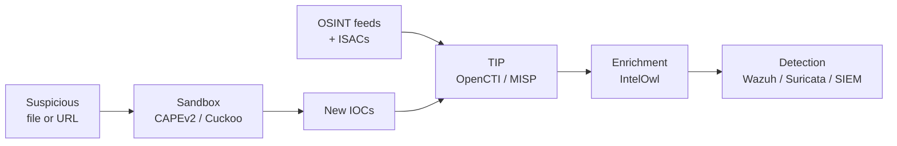

# Open-Source Threat Intelligence and Malware Analysis

A focused look at the open-source tools that let a small team operate a credible threat intelligence and malware analysis capability — the platforms that ingest, normalise, share and enrich indicators, and the sandboxes that turn an unknown binary into a behavioural report you can act on.

This page assumes a working detection stack from the [Open-Source SIEM, Logging and Monitoring](./siem-and-monitoring.md) lesson and a perimeter defence layer from the [Firewall, IDS/IPS, WAF and NAC](./firewall-ids-waf.md) lesson. Threat intelligence is the tissue that connects them — feeding fresh indicators into your detections and pulling the context out of your alerts.

## Why this matters

Indicators of compromise without context are noise. A list of 50,000 IPs labelled "malicious" by some feed is, on its own, almost useless — half are stale, a quarter are CDN front-ends, and the remaining 25% need attribution, confidence scoring, and a kill-chain stage before any analyst can act on them. Commercial threat intel platforms — Recorded Future, ThreatConnect, Anomali, Mandiant Advantage — bundle this enrichment into a polished product, and they bill accordingly: six figures a year is the entry point, and the seat-license model gets uncomfortable as a SOC scales.

Open-source TIPs (Threat Intelligence Platforms) cover roughly 70% of that workflow without the licence fee. **OpenCTI** and **MISP** are mature, production-grade platforms used by national CERTs, ISACs and Fortune 500 SOCs; **YETI** is the lighter Python-based option for analyst-led teams. Pair any of them with an automated sandbox — **CAPEv2** is the active fork of the legacy **Cuckoo Sandbox** — and an enrichment orchestrator like **IntelOwl**, and you have a defensible TI capability built entirely on free software.

For `example.local` — a 200-person organisation with a small SOC, a phishing problem, and a board that asks quarterly about "threat intelligence" — the open-source path is the right answer. **MISP** for sharing with sector peers, **CAPEv2** for sandbox triage of phishing payloads, **IntelOwl** as the enrichment hub, and automated push of vetted IOCs into Wazuh and Suricata. No vendor lock-in, full control over data sharing, and a clear upgrade path if the team ever outgrows the open-source stack.

- **IOCs without context are noise.** A hash, an IP, a domain — without first-seen date, kill-chain stage, source confidence and TTP context, these are just strings. The TIP is what attaches the metadata that makes them actionable.
- **Sandbox analysis is non-negotiable for incident response.** When a phishing email lands and the user clicks before reporting, "what does this binary do" is a question the responder has to answer in minutes, not hours. A self-hosted sandbox gives you a definitive answer without sending sensitive samples to a third-party SaaS.
- **Sharing communities multiply value.** Threat intel is one of the few areas where collaboration genuinely scales — an IOC seen by one organisation in a sector ISAC is an early warning for everyone else. MISP is the lingua franca of that sharing.
- **Enrichment is where time goes.** Most analyst time on an alert is spent pivoting through VirusTotal, AbuseIPDB, Shodan, MISP and a dozen other sources. An orchestrator like IntelOwl collapses that into a single API call and a single report.
- **Open-source TI keeps the data home.** Sending samples and IOCs to a SaaS vendor is, for many regulated organisations, a compliance event in itself. Self-hosted TI keeps the analysis loop entirely inside your perimeter.

## Stack overview

A working threat-intel and malware-analysis pipeline has two main flows that meet in the middle. The intel flow ingests OSINT and ISAC feeds, normalises them through a TIP, enriches them through orchestrators, and pushes vetted indicators into detection. The analysis flow takes suspicious files and traffic, runs them through a sandbox, extracts new IOCs, and feeds those back into the TIP.

Read the diagram as two complementary loops, not a single pipeline. The intel loop is mostly continuous and automated — connectors pull from feeds on a schedule, enrichment runs on every new IOC, and the SIEM picks up watchlists from the TIP every few minutes. The analysis loop is event-driven — a sample arrives from a phishing report, a SOC ticket, or a network capture, and the sandbox produces a report that closes the loop by feeding fresh indicators back into the TIP.

The point worth internalising is that the **TIP is the system of record** for threat intelligence in your environment. Detection tools consume from it; sandboxes feed into it; analysts pivot through it. If the TIP is the central node, the whole pipeline composes; if it is bolted on as an afterthought, you end up with five disconnected tools and an analyst alt-tabbing between browser tabs.

## TIP — OpenCTI

OpenCTI is the modern open-source threat intelligence platform from Filigran (formerly Luatix), first released in 2019 and now in production at dozens of national CERTs and large enterprises. It is a STIX 2.1-native knowledge graph with first-class MITRE ATT&CK and D3FEND awareness, exposed through a GraphQL API.

The defining design choice in OpenCTI is the **graph model**: every entity (indicator, threat actor, campaign, malware, technique, vulnerability, observable) is a node, and every relationship (uses, targets, attributed-to, mitigates, indicates) is an edge. That model maps cleanly onto how analysts actually think about threats — "this campaign uses this malware which exploits this CVE attributed to this actor targeting this sector" — and the UI lets you navigate that graph visually as well as query it via GraphQL.

- **STIX 2.1 native.** OpenCTI's internal data model is STIX 2.1 — every object has a STIX ID, every relationship is a STIX Relationship Object, and TAXII import/export works without translation. If you ever migrate off OpenCTI, your data leaves in a standard format.
- **MITRE ATT&CK and D3FEND.** The platform ships with the full MITRE knowledge bases preloaded — ATT&CK (offensive techniques), D3FEND (defensive countermeasures), and CAPEC (attack patterns). New indicators can be linked to techniques in a click, and the navigator view shows coverage across the matrix.
- **Connectors.** Over 100 community connectors pull from public feeds (AlienVault OTX, Abuse.ch, MISP, CIRCL, MITRE), commercial APIs (when licensed), and internal sources. Connectors run as separate containers and write into OpenCTI through the GraphQL API.
- **GraphQL API.** Everything in the UI is also exposed via GraphQL, which makes scripting, integration, and automation straightforward. The Python SDK (`pycti`) is the most-used client and covers the common operations.
- **Architecture.** Heavyweight: OpenCTI requires Elasticsearch (or OpenSearch), Redis, RabbitMQ and MinIO alongside the platform itself. Plan for at least 16 GB RAM and 4 vCPU on a single-node deploy; production deployments run each backing service on dedicated hardware.
- **When to choose.** You want graph-based threat modelling, deep MITRE integration, and a structured platform you can grow into. OpenCTI is the right call for teams that intend to invest in threat intel as a discipline.

## TIP — MISP

MISP (Malware Information Sharing Platform) is the original community-driven threat-sharing platform — first developed inside the Belgian military CERT in 2011, now maintained by CIRCL (Computer Incident Response Center Luxembourg) and used by hundreds of CERTs, ISACs, and SOCs worldwide. It is, in practice, the lingua franca of threat sharing.

Where OpenCTI emphasises the graph and the analyst experience, MISP emphasises **sharing** — the protocol for federating intelligence between organisations, the taxonomies that let those organisations agree on what an indicator means, and the sharing groups that control who sees what. If you join an ISAC or a sector CERT, MISP is almost certainly how they will share with you.

- **Sharing groups.** MISP's permission model is built around sharing groups — sets of organisations that exchange events. An event can be shared with one group, multiple groups, or marked as community-only. The sync protocol (MISP-to-MISP) handles federation between instances.
- **Taxonomies and galaxies.** Taxonomies are tag vocabularies (TLP, PAP, kill-chain stages, confidence levels) that let producers and consumers agree on what an indicator means. Galaxies are richer cluster definitions (threat actors, malware families, campaigns) maintained by the community.
- **Attributes and objects.** The atomic unit is the attribute (an IOC with type, value, category and tags); related attributes group into objects (a `file` object bundles MD5 + SHA1 + SHA256 + size + filename). Objects map cleanly to STIX SDOs on export.
- **ISAC integration.** Most sector ISACs (FS-ISAC, H-ISAC, EE-ISAC) operate MISP instances and accept MISP-to-MISP sync from member organisations. The sharing-group model is what makes that workable across organisational boundaries.
- **Architecture.** PHP-based (CakePHP) with MySQL/MariaDB backend and Redis for queues. Single-node deployments handle thousands of events comfortably; large national instances scale to millions of attributes with proper tuning.
- **When to choose.** You participate (or want to participate) in a threat-sharing community, you need ISAC integration out of the box, or you want the platform with the deepest community of producers and consumers. MISP is the default for sharing-first deployments.

## TIP — YETI

YETI (Your Everyday Threat Intelligence) is the lightweight Python-based option for analyst workflows. First released in 2017 and now maintained by a small but active community, YETI sits in a different niche from OpenCTI and MISP — it is built around the day-to-day analyst rather than around the federation network.

The pitch for YETI is simplicity: a single Python application with a MongoDB backend, a clean web UI, and a focus on the analyst loop of "I am tracking this actor, here are the observables, here are the related indicators". It does not try to be a federated sharing platform or a graph database — it tries to be the notebook the analyst actually uses.

- **Lightweight architecture.** Python + MongoDB + Redis. A single VM with 4 GB RAM runs a small-team instance comfortably. No Elasticsearch, no RabbitMQ, no MinIO.
- **Observables and indicators.** YETI distinguishes between observables (raw data — a hash, an IP) and indicators (observables with context — confidence, source, kill-chain stage). The model is simpler than STIX and easier to onboard analysts onto.
- **Enrichment plugins.** Built-in enrichment for VirusTotal, MISP, PassiveTotal, Shodan and others. Plugins are Python and easy to write for in-house data sources.
- **Export to detection.** YETI can export feeds in formats consumable by Suricata, Bro/Zeek, MISP, OpenIOC and YARA. The integration story is one-way (export) rather than two-way (federate).
- **When to choose.** Small analyst team, no federation requirement, preference for a Python-first stack, or you want to prototype a TI capability before committing to the operational weight of OpenCTI or MISP. YETI is also a reasonable choice as an analyst-side workbench *in front of* a larger MISP instance.

Treat YETI as a personal-or-small-team tool that may eventually graduate into MISP or OpenCTI as the team and the data both grow. Migration paths are well-trodden — observable export to MISP attributes is essentially a one-liner.

## OpenCTI vs MISP vs YETI — comparison

The three platforms are genuinely complementary as much as competitive — many mature TI teams run more than one. The table below maps the dimensions that actually drive a choice in practice.

| Dimension | OpenCTI | MISP | YETI |
|---|---|---|---|
| Data model | STIX 2.1 graph | MISP attributes + objects | Observables + indicators |
| Primary focus | Knowledge graph, analysis | Federation and sharing | Analyst workflow |
| Sharing protocol | TAXII 2.1, connectors | MISP sync, TAXII | Export only |
| MITRE ATT&CK | First-class, D3FEND too | Via galaxy | Via tags |
| API | GraphQL | REST (PyMISP) | REST (Python) |
| Backing services | ES + Redis + RabbitMQ + MinIO | MySQL + Redis | MongoDB + Redis |
| Resource footprint | High (16 GB+) | Medium (4–8 GB) | Low (2–4 GB) |
| Community | Filigran-led, growing fast | CIRCL, very large | Smaller, active |
| Best fit | Graph-driven analysis | Sector ISAC sharing | Analyst notebook |
| When to avoid | Tiny teams, simple needs | No sharing partners | Federation needed |

The short version: **MISP** when sharing matters, **OpenCTI** when graph-style analysis matters, **YETI** when neither matters and simplicity wins. Many teams start with MISP for the ISAC integration, add OpenCTI later when the graph model becomes worth its weight, and run YETI on the side as an analyst workbench.

## Malware analysis — Cuckoo Sandbox

Cuckoo Sandbox is the original open-source automated malware analysis system — first released in 2010 and for over a decade the default answer to "self-hosted sandbox". It runs suspicious files inside instrumented VMs (Windows, Linux, Android, macOS), records API calls, network traffic, dropped files and screenshots, and produces a structured JSON report that downstream tooling can ingest.

As of 2026 the honest status is: **the original Cuckoo project is effectively unmaintained**. The last meaningful release was years ago, the codebase carries Python 2 legacy in places, and the active development has moved to the **CAPEv2** fork. Plenty of organisations still run Cuckoo successfully — the architecture is solid and the existing deployments do not stop working — but no new deployment in 2026 should start from upstream Cuckoo.

- **Architecture.** A central host (the manager) orchestrates analysis VMs. The agent inside each guest VM hooks system calls, captures traffic via a tap, and ships results back to the manager. The manager renders the report (web UI) and exposes a REST API for submission and retrieval.
- **What it analyses.** PE files, Office documents, PDFs, URLs, archives, scripts. Analysis modules ("modules" in Cuckoo parlance) run inside the guest and capture different aspects of behaviour.
- **Reports.** Detailed JSON: process tree, loaded DLLs, registry changes, file system changes, network connections, DNS queries, dropped artefacts, signatures matched. Bundled signatures detect classic malware families and TTPs.
- **Status as of 2026.** Effectively unmaintained at the upstream `cuckoosandbox/cuckoo` project. The community has migrated to CAPEv2 for active feature development and security fixes.
- **When to choose.** You are inheriting an existing Cuckoo deployment that already works; otherwise, do not start fresh on Cuckoo — go to CAPEv2.

The historical note matters because Cuckoo's architectural choices — VM-per-analysis, agent-in-guest, JSON report format, signature plugins — set the template that every open-source sandbox since has followed. Understanding Cuckoo's design is still the right starting point for understanding CAPEv2.

## Malware analysis — CAPEv2

CAPEv2 (Config And Payload Extraction, version 2) is the actively maintained Cuckoo fork by Kevin O'Reilly and a wider community of malware researchers. It is what most modern open-source sandbox deployments actually run. CAPEv2 keeps the Cuckoo architecture but modernises the codebase to Python 3, adds malware-config extraction for over 200 families, and integrates YARA scanning throughout the pipeline.

The "config extraction" part is what distinguishes CAPEv2 from a generic sandbox. A vanilla sandbox tells you "this binary made network connections" — CAPEv2 tells you "this is Emotet, here is the C2 list, here is the campaign ID, here are the encryption keys". That makes CAPEv2's reports directly actionable as IOCs, not just behavioural traces.

- **Active development.** Regular releases, responsive maintainers, an engaged community of malware analysts contributing extractors. This is the project that gets new family support and platform updates.
- **Malware config extraction.** Built-in extractors for 200+ families — Emotet, IcedID, Qakbot, BumbleBee, RedLine, Ursnif, Cobalt Strike beacons, and so on. Extracted configs become first-class IOCs.
- **YARA integration.** YARA rules run at multiple stages — on submitted files, on memory dumps, on dropped artefacts — and matches drive both signatures and config extraction.
- **Process injection analysis.** First-class detection of process hollowing, process doppelgänging, and other injection techniques common in modern malware.
- **Report integration.** Reports can be pushed to MISP, OpenCTI, IntelOwl, or any consumer that speaks JSON or STIX.
- **Architecture caveats.** Same complexity as Cuckoo — you need a manager host, analysis VMs (preferably bare-metal or nested-virt for anti-sandbox-resistant samples), and careful network isolation. Plan for a dedicated subnet with no inbound paths to production.
- **When to choose.** Any new sandbox deployment in 2026. CAPEv2 is the default open-source malware analysis platform.

## Malware analysis — IntelOwl

IntelOwl is a Python-based threat intelligence orchestrator from the Honeynet Project that wraps 60+ analyzers behind a single API. It is not itself a sandbox — it is the layer that sits in front of your sandboxes, OSINT services, and reputation feeds, and gives an analyst (or an automated playbook) a single endpoint to call for "tell me everything you know about this hash/IP/domain/URL/file".

The pitch is workflow consolidation. Without IntelOwl, an analyst handling an alert opens VirusTotal, AbuseIPDB, GreyNoise, URLScan, MISP, internal CAPEv2, and three more browser tabs. With IntelOwl, they submit the indicator once, the orchestrator fans out to every relevant analyzer in parallel, and the consolidated report comes back in seconds.

- **Analyzer ecosystem.** 60+ built-in analyzers covering reputation (VT, AbuseIPDB, ThreatFox), passive DNS, malware sandboxes (CAPE, Cuckoo, Hybrid Analysis), YARA, file metadata, OSINT enrichment, and more. New analyzers are easy to add as Python plugins.
- **Connectors and pivots.** Push results into MISP, OpenCTI, YETI; pull from external SIEMs. Pivots are automatic — a domain analysis can trigger an IP analysis on the resolved address.
- **Playbooks.** Predefined chains of analyzers tied to indicator type. Submitting a hash runs a playbook that includes VT lookup, YARA scan, sandbox submission, and MISP search in a defined order.
- **Architecture.** Django + PostgreSQL + Redis + Celery, all in Docker. Add a worker container per analyzer family for parallelism. Single-node deployments serve a small SOC; horizontal scaling adds more workers.
- **When to choose.** You want to collapse the "open ten browser tabs per alert" workflow into a single API call. IntelOwl is the enrichment hub that makes a TI/SOC capability efficient rather than just thorough.

## Network detection — Maltrail

Maltrail is a passive network detection system that watches mirrored traffic for IOCs from a curated list of public feeds (suspicious domains, IPs, user-agents, URL patterns). It is intentionally simple: a Sensor process inspects packets, a Server process aggregates events, and a small web UI shows what fired.

It is not a replacement for Suricata or Zeek — those are deeper protocol-aware systems — but Maltrail is the lightweight "free, fast, useful" addition that catches the dumb stuff: a host beaconing to a known C2 domain, a user-agent string from a known commodity malware family, a download from a known malware-hosting URL.

- **What it watches.** DNS queries, HTTP requests, raw packets on a span/mirror port. Matches against ~40 public threat feeds plus user-supplied lists.
- **Lightweight.** A Sensor and a Server, both Python. Runs on commodity hardware, scales to gigabit links with appropriate hardware.
- **Output.** Web UI with timeline, source/destination breakdowns, and trail-type filters. Logs in a parseable format that ships easily to a SIEM.
- **When to choose.** You want a cheap, additive layer of IOC-based network detection that does not require the operational weight of a Suricata or Zeek deployment. Excellent as a complement, not a substitute.

A common deployment pattern: Maltrail on a low-end VM with a SPAN port from the perimeter switch, alerting into the SOC channel; Suricata on a beefier appliance for protocol-aware inspection. The two catch different things — Maltrail catches the long-tail OSINT IOC matches, Suricata catches the actual exploitation traffic.

## Browser tooling — ThreatPinch Lookup

ThreatPinch Lookup is a browser extension (Chrome and Firefox) that augments any web page with on-hover threat-intel lookups. Hover an IP, hash, domain or CVE in a SIEM dashboard, an email, or a web report, and a popup queries VirusTotal, AbuseIPDB, Shodan, Censys, MISP and other sources, surfacing the consolidated reputation in place.

The whole point is friction reduction during analyst work. The single biggest source of "I never finished investigating that alert" is context switching — three browser tabs deep, the analyst gets pulled into something else and the original alert gets stale. ThreatPinch lives where the analyst already is.

- **Lookups.** VirusTotal, AbuseIPDB, Shodan, Censys, GreyNoise, URLScan, MISP, Hybrid Analysis, ThreatCrowd, plus user-configurable URL patterns.
- **Indicator types.** IPv4, IPv6, hashes (MD5/SHA1/SHA256), domains, URLs, CVEs, MITRE technique IDs.
- **Configuration.** Per-lookup enable/disable, API keys for services that need them, custom lookup URLs.
- **When to choose.** Always — it is a free productivity multiplier for any analyst doing IOC triage in a browser, with no server-side footprint.

ThreatPinch is intentionally a browser-side tool. If you need server-side enrichment (because the analyst is working in a non-browser context, or because you want central audit of every lookup), use IntelOwl instead — the two are complementary, not redundant.

## Tool selection — comparison table

The matrix below maps the most common needs in this space to a recommended open-source tool. Treat it as a starting point for scoping, not a final architecture.

| Need | Pick | Why |
|---|---|---|
| Sharing-first TIP | MISP | Federation protocol, taxonomies, ISAC integration |
| Graph-style analysis TIP | OpenCTI | STIX 2.1 graph, ATT&CK + D3FEND, GraphQL API |
| Lightweight analyst notebook | YETI | Simple Python stack, low resource footprint |
| Active sandbox deployment | CAPEv2 | Maintained Cuckoo fork, config extraction, YARA |
| Legacy sandbox (existing) | Cuckoo | Keep what works, but migrate to CAPEv2 |
| Enrichment orchestration | IntelOwl | 60+ analyzers, single API, playbooks |
| Passive network IOC detection | Maltrail | Cheap additive layer, lightweight |
| Browser-side analyst lookup | ThreatPinch | Zero-cost productivity multiplier |
| Sector ISAC participation | MISP | The lingua franca, accepted by all major ISACs |
| MITRE ATT&CK navigation | OpenCTI | First-class technique nodes and coverage view |
| Sandbox config extraction | CAPEv2 | 200+ family-specific extractors |
| Detection feed for Suricata | MISP or YETI | Both export Suricata-format rule files |

For most `example.local`-shaped environments the answer is **MISP + IntelOwl + CAPEv2**, with OpenCTI added later if the team grows into graph-style analysis and ThreatPinch deployed to every analyst browser on day one.

A short note on overlap. There is real temptation to pick "the one TIP" — resist it. Most mature TI shops run MISP *and* OpenCTI: MISP is the federation endpoint, OpenCTI is the analyst-facing knowledge graph, and connectors keep them in sync. Treat the two as complementary tiers (federation tier + analysis tier), not as competitors for the same slot.

## Hands-on / practice

Five exercises to make this concrete in a home lab or a sandbox environment for `example.local`. Each one targets a different layer, and together they exercise the full intel-and-analysis pipeline.

1. **Deploy MISP in Docker and import a public feed.** Bring up MISP via the official docker-compose, log in with the default admin credentials, and rotate them. Enable the CIRCL OSINT feed, fetch it, and confirm events appear in the dashboard. Tag one event with `tlp:green` and `kill-chain:reconnaissance` and confirm the tags propagate to the constituent attributes. Export the event as STIX 2.1 and inspect the JSON.
2. **Deploy OpenCTI and connect a connector.** Stand up OpenCTI with the bundled docker-compose. Configure the MITRE ATT&CK connector and confirm the platform pulls the full enterprise matrix. Add the AlienVault OTX connector with a free API key and confirm pulses start arriving. Open the knowledge graph for a known threat actor (e.g., APT29) and verify the linked techniques, malware and campaigns are populated.
3. **Submit a benign sample to CAPEv2 and read the report.** Stand up CAPEv2 (use the bundled installer in a dedicated VM, with a Windows 10 analysis guest). Submit the EICAR test file or a known-benign signed binary (`notepad.exe` from a known-good Windows install). Confirm the analysis completes, then read the report — process tree, network activity, signatures matched, dropped files. Note where a real sample would differ.
4. **Query an IP through IntelOwl's analyzers.** Deploy IntelOwl via docker-compose, configure API keys for VirusTotal and AbuseIPDB (free tiers are fine), and submit a known-malicious IP from any public feed. Inspect the consolidated report. Then create a custom playbook that runs only the free analyzers, and submit a second IP through the playbook.
5. **Install ThreatPinch and look up an IOC from a Wazuh alert.** Install ThreatPinch in your browser, configure the VirusTotal and AbuseIPDB API keys. Open a Wazuh alert (from the [SIEM lesson](./siem-and-monitoring.md)) that contains a source IP. Hover the IP and confirm ThreatPinch surfaces a reputation popup without leaving the dashboard.

## Worked example — `example.local` builds a TI capability

`example.local` started with no formal threat intelligence — alerts came in, analysts triaged them with browser tabs, and the only "intel" was an internal wiki page of "known bad IPs" that was last updated 18 months ago. The new design builds a small but credible TI capability around three open-source pillars and ties it into the existing detection stack.

The driver was a phishing campaign that hit the company in Q3, where the same payload had been reported by a sector peer two weeks earlier — and `example.local` had no channel to receive that warning. Joining the sector ISAC required a MISP instance. Once that decision was made, the rest of the stack composed around it.

- **MISP for sharing.** A single MISP instance hosted in the security DMZ, syncing with the sector ISAC and with two trusted peer organisations. Sharing groups defined for "ISAC-only", "trusted peers", and "internal-only". TLP discipline enforced via taxonomy: nothing leaves the org without a TLP tag, and the sync feeds respect TLP boundaries. Daily import of the CIRCL OSINT feed and the MISP-default Abuse.ch feeds.
- **IntelOwl for daily enrichment.** A single IntelOwl instance behind the SOC dashboard, configured with API keys for VirusTotal, AbuseIPDB, GreyNoise, Shodan, and the internal MISP. A "Tier-1 triage" playbook runs on every alert IOC and writes the consolidated report back to the ticket. Average per-IOC triage time dropped from 8 minutes (browser tabs) to under 30 seconds (single API call).
- **CAPEv2 for sandbox analysis.** A dedicated bare-metal sandbox host with three analysis VMs (Windows 10 + Office, Windows 11 clean, Ubuntu desktop). Phishing payloads from the email gateway and reported attachments are auto-submitted via API. Reports flow into the SOC ticket and IOCs are pushed into MISP via a small connector script. The config-extraction feature has identified four distinct Emotet campaigns inside the first quarter of operation.
- **Automated push of MISP IOCs into Wazuh + Suricata.** A scheduled job exports MISP attributes tagged `to_ids:true` and pushes them as Wazuh CDB lists and Suricata rule files. Indicators reach detection within 15 minutes of being published in MISP. The same job ages-out indicators with `valid_until` timestamps so stale IOCs do not bloat the rule files.
- **Cost.** Hardware: one mid-range server for MISP + IntelOwl, one bare-metal sandbox host for CAPEv2, plus the existing SIEM infrastructure. Subscriptions: $0 (free tiers of public APIs only). Engineering: ~3 months for the rollout, ongoing ~15% of one analyst FTE for tuning and maintenance.

The first time the new stack proved its worth was a credential-phishing wave six weeks after MISP came online: a peer organisation published the campaign IOCs to the ISAC at 09:14, the sync ran at 09:17, and Wazuh started alerting on the matching domains at 09:32 — well before the first user click in `example.local`. The whole pipeline ran end-to-end without a human in the loop until the first SOC ticket fired.

The TI stack now also feeds the detection rule-set for [vulnerability and AppSec](./vulnerability-and-appsec.md) and is referenced by the [red-team tools](./red-team-tools.md) lesson when emulating known TTPs against the SOC.

## Troubleshooting & pitfalls

A short list of mistakes that turn an open-source TI/malware-analysis stack from "the thing we depend on" into "the thing we are about to rip out". Most are operational rather than technical — the tools are mature, the failure modes are people-and-process patterns.

- **IOC age and decay.** Most published IOCs are stale within days. A C2 IP burned by one detection is rotated within hours; a phishing domain reported on day one is sinkholed on day three. Always filter on `valid_until`, `first_seen` and `last_seen` before pushing IOCs into detection — pushing year-old indicators just generates false positives on legitimately reused IPs.
- **MISP taxonomy mismatch with consumers.** Producers and consumers must agree on TLP, kill-chain stage, and confidence taxonomies. A producer that tags everything `tlp:white` undermines the whole sharing protocol. Document your taxonomy usage in writing, audit it quarterly, and reject unsourced tags from sync feeds.
- **Sandbox detection by malware.** Modern malware checks for VM artefacts, sandbox indicators (specific usernames, file paths, mouse-jiggle absence), and timing anomalies. A naive Cuckoo or CAPEv2 deployment will be detected and the sample will refuse to detonate. Harden your guest VMs with anti-anti-VM patches, realistic user profiles, and (for the most evasive samples) bare-metal analysis hosts.
- **IntelOwl quota limits on free APIs.** VirusTotal, AbuseIPDB and similar all rate-limit the free tier — typically 4 requests/minute. A misconfigured IntelOwl playbook that fires every analyzer on every IOC will exhaust quotas in hours. Use playbooks to limit which analyzers run by default, and reserve heavy enrichment for explicit analyst submissions.
- **Cuckoo's unmaintained status — do not deploy fresh.** New Cuckoo deployments in 2026 inherit Python 2 legacy, unpatched dependencies, and no community support. If you find yourself standing up a new sandbox, go to CAPEv2 from the start. Migrate existing Cuckoo deployments on a roadmap measured in months, not years.
- **Sandbox network isolation.** Sandbox VMs detonate live malware, which means they make outbound connections — to C2, to download payloads, to exfiltrate. The sandbox subnet must not have any path into production, and outbound traffic should go through a dedicated egress (cellular modem, dedicated ISP link, INETSIM-faked network) so a real victim infrastructure never sees your sandbox traffic mistaken for a genuine attack.
- **TIP as a write-only system.** A common failure mode: the team imports feeds religiously, the TIP grows to millions of attributes, and nothing ever consumes from it. The TIP is only useful if detection tooling pulls from it on a schedule — wire that integration first, then worry about feed volume.
- **Confidence scoring matters.** A "malicious" IOC from a paid commercial feed and a "malicious" IOC from a random Pastebin paste are not the same. Tag every IOC with source confidence (high/medium/low) and let detection rules filter on confidence — high-confidence into block lists, low-confidence into watch lists.
- **MISP-to-MISP sync without segregation.** Syncing your MISP with a partner's MISP without sharing-group discipline can leak internal events to that partner. Configure sharing groups *before* enabling sync, and audit the first week of sync traffic to confirm only intended events leave.
- **Sandbox storage growth.** Every analysis produces a screenshot bundle, network capture, and dropped artefacts — easily 100 MB per submission. A busy SOC produces hundreds of submissions a week. Plan retention (often 30–90 days hot, archived on object storage) before the sandbox host fills up.
- **Browser extension supply chain.** ThreatPinch and similar extensions execute in the analyst's browser context. Pin to a specific reviewed version, audit updates, and discourage analysts from installing unrelated extensions in the same browser profile they use for IOC analysis.

## Key takeaways

The headline points to take away from this lesson, in order from "always true" to "useful when you remember it".

- **MISP for sharing, OpenCTI for graph-style analysis, YETI for analyst workbench.** The three are complementary, not competitive — many teams run more than one.
- **CAPEv2 is the default sandbox in 2026.** Cuckoo is effectively unmaintained; do not start fresh on Cuckoo. Migrate existing deployments on a roadmap.
- **IntelOwl is the enrichment hub.** It collapses the "ten browser tabs per alert" workflow into a single API call, and pays for its operational footprint within weeks of rollout.
- **The TIP is the system of record.** Detection tools consume from it; sandboxes feed into it; analysts pivot through it. If it is bolted on, the pipeline does not compose.
- **Filter on IOC age before pushing to detection.** Stale indicators generate false positives on legitimately reused infrastructure. Use `valid_until`, `last_seen` and confidence scores religiously.
- **Sandbox isolation is non-negotiable.** Live malware needs an egress path that does not touch production and does not look like your real network — a leaked sandbox connection can poison real-world threat intelligence about your organisation.
- **Sharing communities multiply value.** The single best decision you can make for a small SOC is to join a sector ISAC and run MISP. The cost is modest, the early-warning value is enormous.
- **Confidence scoring matters.** Treat "malicious" as a spectrum, not a binary. Tag every IOC with source confidence and let detection rules filter on it.
- **Plan sandbox retention from day one.** Hundreds of submissions a week, 100 MB each — without retention policy, the sandbox host fills up in months.
- **ThreatPinch on every analyst browser.** Free, near-zero footprint, and it eliminates a real source of investigation drop-off.
- **Anti-sandbox malware is the norm, not the exception.** Harden your guest VMs and accept that the most evasive samples need bare-metal analysis hosts.
- **Open-source TI keeps your data home.** For regulated environments, that alone is reason enough to choose self-hosted MISP and CAPEv2 over a SaaS vendor.

For an `example.local`-shaped organisation, **MISP + IntelOwl + CAPEv2 + ThreatPinch** is a credible TI/malware-analysis capability built entirely on open-source software at a hardware cost a small SOC can absorb — provided the engineering capacity exists to maintain the stack and the SOC discipline exists to actually use it.

## References

- [OpenCTI — opencti.io](https://www.opencti.io)
- [OpenCTI documentation](https://docs.opencti.io)
- [MISP project — misp-project.org](https://www.misp-project.org)
- [MISP documentation](https://www.misp-project.org/documentation/)
- [YETI — github.com/yeti-platform/yeti](https://github.com/yeti-platform/yeti)
- [Cuckoo Sandbox — cuckoosandbox.org](https://cuckoosandbox.org)
- [CAPEv2 — github.com/kevoreilly/CAPEv2](https://github.com/kevoreilly/CAPEv2)
- [IntelOwl — github.com/intelowlproject/IntelOwl](https://github.com/intelowlproject/IntelOwl)
- [Maltrail — github.com/stamparm/maltrail](https://github.com/stamparm/maltrail)
- [ThreatPinch Lookup — github.com/cloudtracer/ThreatPinchLookup](https://github.com/cloudtracer/ThreatPinchLookup)
- [STIX 2.1 specification — OASIS](https://docs.oasis-open.org/cti/stix/v2.1/stix-v2.1.html)
- [TAXII 2.1 specification — OASIS](https://docs.oasis-open.org/cti/taxii/v2.1/taxii-v2.1.html)
- [MITRE ATT&CK — Enterprise techniques](https://attack.mitre.org/techniques/enterprise/)
- [MITRE D3FEND — countermeasures](https://d3fend.mitre.org)
- [NIST SP 800-150 — Cyber Threat Information Sharing](https://csrc.nist.gov/publications/detail/sp/800-150/final)
- [Abuse.ch threat feeds](https://abuse.ch)
- [CIRCL OSINT feed](https://www.circl.lu/doc/misp/feed-osint/)
- Related lessons: [Open-Source Stack Overview](./overview.md) · [SIEM and Monitoring](./siem-and-monitoring.md) · [Firewall, IDS/IPS, WAF and NAC](./firewall-ids-waf.md) · [Vulnerability and AppSec](./vulnerability-and-appsec.md) · [Red Team Tools](./red-team-tools.md) · [Social Engineering](../../red-teaming/social-engineering.md)
