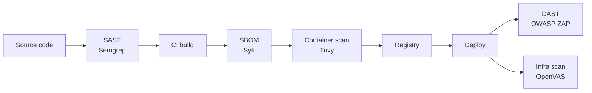

# Open-Source Vulnerability Scanning and Application Security

A focused tour of the open-source toolbox that powers a credible vulnerability-management and application-security programme — the network scanners that find missing patches on infrastructure, the dynamic scanners that prod web applications, the static analysers that read source code, and the SBOM generators that finally let teams answer the question "what is actually in this build?".

This page builds on the [open-source tools overview](./overview.md), pairs naturally with the perimeter controls in [firewall, IDS/IPS, WAF and NAC](./firewall-ids-waf.md), the detection layer in [SIEM and monitoring](./siem-and-monitoring.md), and the intel-and-analysis side in [threat intel and malware analysis](./threat-intel-and-malware.md). For the programmatic side — risk scoring, SLAs, ticket flow — see [vulnerability management](../assessment/vulnerability-management.md), the broader [security tools](../assessment/security-tools.md) catalogue, and the higher-level [security assessment](../assessment/security-assessment.md) lifecycle.

## Why this matters

Vulnerability scanning and application security are non-negotiable controls. Every framework worth its salt — PCI-DSS, ISO 27001, SOC 2, NIST CSF, the EU CRA — explicitly requires regular vulnerability assessment and some form of application-security testing. The commercial market for these tools (Tenable, Qualys, Rapid7, Veracode, Checkmarx) is well-funded and mature, with five and six-figure annual subscriptions for organisations that scan a few hundred hosts or a handful of applications.

The open-source equivalents are equally mature. They cover the same vulnerability classes, ingest the same CVE feeds, integrate with the same CI/CD pipelines, and produce the same SBOM formats — and they do so for the cost of a VM, a CI runner, and an analyst who can read CVE descriptions. For `example.local`, a 200-person engineering organisation with around 800 internal hosts and 30 internet-facing web properties, a fully open-source vulnerability and AppSec stack delivers credible coverage at a fraction of the commercial price.

- **Open-source is mature in this space.** Five years ago the gap between commercial and open-source scanners was real and measurable. Today, on most measures of coverage and accuracy, the open-source leaders are competitive with mid-tier commercial offerings. The remaining gap is in support, reporting polish, and integrations — not in finding bugs.
- **Coverage gaps cost more than tools.** A missed scan on a forgotten subnet is the classic root-cause of breach reports. Open source removes the per-IP licence excuse for skipping coverage.
- **AppSec lives in the SDLC, not in a quarterly scan.** SAST runs on every PR, DAST runs in staging on every release, SBOM and dependency checks gate every build. Tools that cannot integrate into the pipeline are tools that will not be used.
- **Supply-chain transparency is now table stakes.** Executive Order 14028 in the US, the EU CRA, and most enterprise procurement processes now demand SBOMs. Producing them is cheap; not producing them is increasingly a sales blocker.
- **Authenticated scans find ten times more.** Unauthenticated scans see banners; authenticated scans see installed package versions, kernel versions, and configuration drift. Plan credential storage from day one.
- **The five layers complement each other.** Infra scanners catch missing patches; DAST catches runtime web flaws; SAST catches insecure code patterns; IAST catches what fires at runtime; SBOMs catch what depends on what. No single tool replaces the others.
- **Speed of CVE coverage matters.** When a major vulnerability lands (Log4Shell, Spring4Shell, the next big one), the question every CISO gets asked within hours is "are we exposed?". The Nuclei community typically publishes a check the same day; OpenVAS NVTs land within a week; Grype matches as soon as the CVE hits NVD.
- **Findings without workflow are noise.** A scanner that emits 4,000 vulnerabilities and no triage is worse than no scanner at all — it generates fatigue and burns trust. Faraday or DefectDojo turn raw scan output into something a team can actually work through.
- **Regulators are catching up.** PCI-DSS 4.0 explicitly requires SAST or equivalent code review; the EU CRA mandates SBOMs for any product sold into the EU; cyber-insurance underwriters now ask for evidence of an AppSec programme. "We only do quarterly network scans" is no longer a defensible answer.

## The vulnerability + appsec stack at a glance

The open-source vulnerability and AppSec stack is a layered pipeline. Different tools see different parts of the attack surface, and the only way to get full coverage is to compose them across the software development lifecycle and the running infrastructure.

Read the diagram as a left-to-right pipeline. SAST sits at the leftmost position — it runs on a developer's keyboard before code even merges. The CI build is the chokepoint where SBOM generation and container scanning fire. The registry holds the signed and scanned artefact. After deployment, DAST exercises the running web application while infrastructure scanners sweep the hosts that run it.

Two patterns to internalise. First, **discovery feeds scanning** — without an Amass-style enumeration step, the network and web scanners can only see what someone remembered to put in the asset list. Second, **the cost of fixing a finding rises by an order of magnitude at every step rightward** — a Semgrep finding caught in a PR costs minutes; the same vulnerability shipped to production and caught by ZAP costs hours; the same vulnerability exploited by an attacker costs weeks.

A third pattern worth naming: **every lane writes into one aggregator**. The aggregator is the part most teams skip — and it is the part that makes the difference between a programme and a pile of tools. Faraday or DefectDojo deduplicates findings, applies risk scoring, and forwards survivors into the SIEM for correlation with runtime telemetry. Scanners produce findings; the aggregator decides what to do with them.

## Infrastructure vulnerability scanning — OpenVAS / Greenbone CE

OpenVAS, now packaged as the **Greenbone Community Edition**, is the most complete open-source network vulnerability scanner. It grew out of the original Nessus 2.x codebase when Tenable closed-sourced Nessus in 2005, and Greenbone has maintained it as a commercial product ever since while keeping a free community feed and engine available.

The lineage matters because it explains the depth: OpenVAS inherits two decades of network-scanner engineering and continues to receive new content via the Greenbone Community Feed. For most teams that need a credible network vuln scanner without a Tenable contract, this is the default starting point.

- **Scope.** Network-level vulnerability scanning for Linux, Windows, network devices, hypervisors, databases, and embedded systems. Not a web-application scanner — that is what ZAP and Nuclei are for.
- **Components.** Three moving parts. The **scanner** (`openvas-scanner` / `ospd-openvas`) executes Network Vulnerability Tests (NVTs). The **manager** (`gvmd`) stores results and orchestrates scans. The **web UI** (Greenbone Security Assistant, GSA) is the analyst front-end. The community packaging is now distributed primarily as a Docker Compose stack.
- **Greenbone Community Feed.** The NVTs are the rule equivalent of Nessus plugins. The feed ships 150,000+ tests covering CVEs, default credentials, missing patches, and configuration weaknesses. The commercial Enterprise Feed gets new content slightly faster.
- **Authenticated scans.** Provide SSH keys for Linux and SMB credentials for Windows and OpenVAS will run local security checks — listing installed packages, checking patch levels, reading configuration files. Coverage roughly triples versus unauthenticated scans.
- **Scan policies.** Pre-defined policies include "Full and fast" (the default for general use), "Discovery" (port and service detection only), and several PCI-DSS and CIS compliance policies. Custom policies let you whitelist or blacklist NVTs by family or by tag — useful for excluding loud or destructive tests against fragile targets.
- **Reporting.** GSA exports PDF, HTML, CSV, and XML reports. The XML output is what Faraday and DefectDojo ingest — wire that up rather than emailing PDFs around the team.
- **Watch out for.** Initial feed sync is slow (several hours on first install). The Postgres database grows quickly — budget disk and a retention policy. Web-app checks exist but are weak; do not rely on OpenVAS for OWASP Top 10 coverage.
- **When to choose.** You need recurring infrastructure scanning across a large internal estate, you have more than 16 IPs to scan (the Nessus Essentials cap), and you can give the scanner a beefy VM (8 vCPU, 16 GB RAM minimum for any serious scope). Plan for several hours per full scan of a /24.

## Infrastructure scanning — Nessus Essentials and Faraday

Two adjacent options round out the infrastructure tier. **Nessus Essentials** is Tenable's free tier of the commercial Nessus scanner — closed-source but free, widely used, and worth knowing because for very small environments it is often the path of least resistance. **Faraday Community Edition** is the open-source aggregator that consolidates the noise from multiple scanners into a single triage view.

Together they answer two different problems: Nessus Essentials answers "I have ten machines and want a polished scanner today", while Faraday answers "I have five different scanners and need one place to triage their output".

- **Nessus Essentials — the 16-IP cap.** Essentials is hard-capped at scanning 16 unique IP addresses. That ceiling rules it out for any organisation past the home-lab or single-rack stage, but it is generous enough for a personal lab, a small office, or a training environment. Polished UI, fast plugin updates, very low false-positive rate.
- **Nessus Essentials — registration required.** A Tenable account and a free activation code are required. Not strictly open source — if your organisation has an OSI-only policy, Essentials does not qualify; OpenVAS is the open-source choice.
- **Faraday CE — vulnerability-management aggregator.** Imports scanner output (OpenVAS, Nessus, Nmap, Nuclei, Nikto, ZAP, Burp, Qualys, dozens more) into a single workspace, deduplicates findings across sources, and lets analysts triage, comment, tag, and assign vulnerabilities through a web UI.
- **Faraday — workspace model.** Each engagement, environment, or business unit can be its own workspace. Maps cleanly to "we want to see findings for the prod environment separately from the corp environment" — a common ask once the programme reaches multi-team scale.
- **Faraday — API-first.** Full REST API. CI jobs upload scan output via API immediately after the scan, and the UI is reserved for human triage. Without an aggregator, scanner outputs become five separate workflows that no small team can sustain.
- **Faraday — multi-tool dedupe.** A web server with an outdated nginx will show up in OpenVAS, Nuclei, and Nikto with three different titles and CVSS scores. Faraday merges them so the analyst sees one finding with three sources of evidence.
- **Faraday — operational note.** Aggregators are databases — back them up. Faraday's Postgres has the entire vulnerability history of the organisation; losing it loses your audit trail. Daily snapshots and an off-host backup are non-negotiable.
- **Alternative — DefectDojo.** OWASP DefectDojo is a strong alternative aggregator with a similar feature set, slightly different UX, and a stronger CI/CD integration story for AppSec workflows.

## DAST — OWASP ZAP

The **OWASP Zed Attack Proxy (ZAP)** is the flagship open-source dynamic application-security scanner. It is a man-in-the-middle proxy with active and passive scanning bolted on, and it is the tool every web pentester learns first. ZAP's role in the stack is depth — authenticated walks through real applications, multi-step business-logic flows, and the kind of nuanced testing that template-based scanners cannot match.

ZAP is the heavyweight DAST option in the open-source toolbox; pair it with Nuclei (breadth) and Amass (discovery) for a complete external-testing pipeline.

- **Proxy mode.** ZAP sits between a browser and the application under test. As you click through the app it records every request, parses every response, and runs passive checks (cookie flags, security headers, info leaks). When you trigger an active scan, ZAP replays each request with attack payloads — XSS strings, SQLi probes, path traversal, command injection, header smuggling.
- **Automated scan.** The "Automated Scan" mode crawls a target URL with a spider, then runs a default active scan. Useful for a quick baseline. The packaged `zap-baseline.py` (passive only, safe for production) and `zap-full-scan.py` (active, staging only) scripts are designed to run in a CI job.
- **ZAP API and headless mode.** ZAP can run as a daemon (`zap.sh -daemon`) and be driven entirely by its REST API, which is what most CI integrations actually use. The GUI is for humans tuning context and triaging unusual findings.
- **CI integration.** The baseline and full-scan scripts produce HTML, XML, and JSON reports that Faraday and DefectDojo ingest natively. Drop them into a GitHub Action or GitLab pipeline and gate releases on critical findings.
- **Authentication.** ZAP supports form login, header-based auth, JSON login, and OAuth2 with some plumbing. Configure the authentication once in a context file and the scanner re-authenticates whenever it detects a logout. Without authenticated scans you only ever test public marketing pages.
- **Manual vs automated.** The manual mode — proxy through a browser, walk the app like a user, then attack the requests captured in the history — finds far more than automated mode, because the spider misses single-page-app routes, authenticated areas, and form workflows. Automated scans are for CI baselines; manual scans are for real depth.
- **Watch out for.** Active scans against fragile applications can corrupt data — point ZAP at a staging environment with a restorable database, never at production. False-positive rates depend heavily on context tuning; expect to spend an afternoon getting useful results from a complex SPA.
- **Add-ons and ecosystem.** The ZAP marketplace ships extensions for GraphQL, OpenAPI/Swagger import, advanced fuzzing, and AJAX spidering. The OpenAPI add-on is especially valuable for microservice estates — point it at the Swagger spec and ZAP enumerates every endpoint with the right method and parameter shape.
- **Heritage and governance.** ZAP is an OWASP Flagship project with broad community contribution and predictable release cadence. The project moved to the Software Security Project (SSP) Foundation in 2023; governance is healthy and active.

## DAST — Nuclei

**Nuclei** by ProjectDiscovery is the modern, fast, template-driven web scanner that has eaten a large share of the bug-bounty world over the past few years. Its design philosophy is the opposite of ZAP — instead of a heavyweight proxy, it is a single Go binary that fires a list of YAML templates at a list of URLs and prints the matches.

ZAP and Nuclei are complements, not substitutes. ZAP goes deep on a small number of applications; Nuclei goes broad across a large list of URLs. Most mature programmes run both at different cadences against different scopes.

- **Template-based.** Each Nuclei template describes one check: an HTTP request (or DNS, TCP, file, or workflow check), a set of matchers (status code, body regex, header value), and metadata (CVE ID, severity, references). The community templates repo at `projectdiscovery/nuclei-templates` ships thousands of pre-written checks for known CVEs, misconfigurations, exposed panels, and default credentials.
- **Fast.** Nuclei runs hundreds of templates against hundreds of targets in parallel and finishes in seconds where ZAP would take hours. Single binary, exit codes for severity thresholds, JSON output, runs in a few hundred MB of RAM. Drop it into a GitHub Action and gate releases on it.
- **Community templates.** The community-maintained library is curated by the same team that ships the binary, with thousands of contributors. Coverage of new CVEs typically lands within hours of public disclosure — the gold standard for rapid-response scanning.
- **Custom templates.** YAML format is shallow and well-documented. A custom template for "is our internal admin panel accidentally exposed to the internet" is a 20-line file. This is where Nuclei pays back the time invested.
- **When to pick over ZAP.** Nuclei is the right choice when you need to scan a large list of URLs quickly, when you want CI-friendly fail-the-build behaviour on critical CVEs, or when you need to detect a freshly disclosed CVE within hours of disclosure. ZAP remains the right choice when you need depth on a single complex application with authenticated workflows.
- **Severity tagging.** Every template carries a severity (`info`, `low`, `medium`, `high`, `critical`). The CLI lets you filter by severity, which makes it trivial to wire "fail the build on critical, warn on high" into CI.
- **Workflow templates.** Nuclei supports multi-step workflows that chain templates conditionally — discover a CMS, then run CMS-specific checks; identify a tech stack, then run framework-specific tests. Useful for reducing scan time by skipping irrelevant templates.
- **Limitations.** Nuclei does not crawl, does not handle stateful auth elegantly, and does not do deep vulnerability discovery — it finds things it has been told to look for. Pin to a release tag rather than tracking `main`, and review the diff before each upgrade.

## DAST — Nikto and Amass

Two niche tools that complete the external-testing picture. **Nikto** is the original "throw a battery of known web checks at a server and see what sticks" scanner — older than ZAP, less polished than Nuclei, but still useful for legacy web-server first-pass checks. **OWASP Amass** is the de facto open-source attack-surface discovery tool — it enumerates subdomains, IP ranges, ASNs, certificates and DNS records to map an organisation's external footprint.

Strictly speaking Amass is recon rather than DAST, but it is the natural companion to every DAST scan because you cannot scan what you have not discovered.

- **Nikto — legacy web-server checks.** Sends thousands of probes against a single web server looking for: outdated server software, dangerous CGI scripts, default files (`/phpinfo.php`, `/server-status`), insecure HTTP methods, missing security headers, and weak SSL/TLS configuration.
- **Nikto — when it is still useful.** First-pass reconnaissance against a freshly discovered web server when you have no idea what is on it. Nikto's signature database covers a lot of legacy Apache, IIS, Tomcat and PHP-era surface that newer scanners deprioritise. Run it once per asset on initial discovery, ingest into Faraday, then rely on ZAP and Nuclei for ongoing coverage.
- **Amass — attack-surface mapping.** Passive sources include certificate-transparency logs, search engines, DNS aggregators, threat-intel feeds, and Whois data. Active techniques include DNS brute-forcing, zone transfers, and reverse DNS sweeps.
- **Amass — subdomain enumeration.** Most "shadow IT" findings — the forgotten staging server, the marketing landing page on a third-party host, the demo environment that someone spun up six years ago — are discovered by Amass-style enumeration, not by the asset inventory the IT team thinks is complete.
- **Amass — operational model.** Run on a schedule (daily for external-facing organisations, weekly is fine for most), diff today's output against yesterday's, and route new assets to the on-call engineer for triage.
- **Pipeline pairing.** The canonical workflow is `amass enum -d example.local -o subs.txt`, then `nuclei -l subs.txt`. Add `httpx` from the ProjectDiscovery suite for technology fingerprinting and you have a respectable open-source external-recon pipeline.
- **Nikto verdict.** Useful as one of several tools in a layered scan; never useful as the only tool. The signature database updates slowly compared to Nuclei, false-positive rate is high, and there is no SPA support. Most defensible when an auditor explicitly asks for Nikto in the report.

## SAST — Semgrep, SonarQube CE, Bandit, gosec

Static Application Security Testing reads source code and flags insecure patterns before the code ever runs. Four open-source SAST tools cover the realistic spectrum, with very different trade-offs between language breadth, scan depth, and CI integration story.

- **Semgrep.** The modern default. Fast, language-aware (40+ languages), rules in YAML, generous open-source rule registry, free community edition with paid Pro tier for deeper analysis. Excellent CI integration — most teams gate PR merges on Semgrep findings of high severity. Custom rules are easy to write, and once a team has run Semgrep for a few months they almost always start writing in-house rules for deprecated internal APIs and required security headers. Drops into a GitHub Action or GitLab pipeline as `semgrep ci`.
- **SonarQube Community Edition.** Quality-and-security platform with a polished web dashboard, multi-language support, and a strong "code quality + security" combined story. The community edition is genuinely useful but the strongest security rules (taint analysis, deeper SAST) are reserved for Developer Edition and above. Note that SonarQube CE does not analyse pull-request branches — only the main branch. This is a meaningful limitation for trunk-based development teams; Semgrep is usually a better fit for PR-level gating.
- **Bandit (Python).** Python-specific SAST. Small, fast, focused on common Python pitfalls (use of `eval`, hardcoded secrets, weak crypto, unsafe yaml load, SQL string concatenation). Drop it into any Python project's CI in five minutes — `pip install bandit && bandit -r .`. Maintained by PyCQA; the natural Python complement to Semgrep when you want a deeper Python-only ruleset.
- **gosec (Go).** Go-specific SAST. Inspects Go source for common security issues — hardcoded credentials, unsafe SQL formatting, weak crypto, file path traversal, insecure TLS configuration. Single Go binary, runs as `gosec ./...`, integrates trivially into any Go CI pipeline. The Go-language complement to Bandit's Python coverage.
- **CI integration patterns.** Semgrep and gosec both ship native GitHub Actions and GitLab CI templates. Bandit pairs cleanly with `pre-commit` hooks for shift-leftmost feedback. SonarQube CE requires a separate server but provides the polished web dashboard executives like to see in compliance reviews.
- **Language coverage in practice.** Semgrep covers the polyglot case (Python, JS/TS, Java, Go, Ruby, C/C++, Kotlin, Scala, Swift, more). Bandit owns Python depth. gosec owns Go depth. SonarQube CE supports 15+ languages with quality rules and a smaller security ruleset. For Ruby on Rails, `brakeman`; for JavaScript, `eslint-plugin-security`.
- **Secrets scanning is the cheap win.** Pair SAST with a secrets scanner — `gitleaks`, `trufflehog`, or `detect-secrets`. Hardcoded API keys, database passwords, and AWS access keys are the single most common cause of credential-related breaches.
- **CodeQL — worth knowing about.** GitHub Security Lab's semantic-analysis engine, free for open-source repos via GitHub Code Scanning, commercial licence required for private repos beyond GitHub Advanced Security. Powerful query language, deep taint analysis, but a steep learning curve to write custom queries.

## SBOM and container scanning — Syft, Trivy, Grype

Software Bill of Materials tools enumerate every component, library, and dependency in a build. The output is just inventory — its value comes from feeding the inventory into a vulnerability matcher. The SBOM workflow has two halves: **generate** the SBOM at build time and stash it as an artefact next to the binary or container image, and **match** the SBOM against a CVE database on a continuous schedule.

Three tools dominate the open-source landscape. Syft generates SBOMs; Grype matches them against CVEs; Trivy does both in one binary plus container misconfiguration and IaC scanning.

- **Syft.** Anchore's SBOM generator. Single Go binary, scans containers, OCI images, filesystems, and source directories. Outputs SPDX, CycloneDX, and a native JSON format. The default SBOM tool for most pipelines today — fast, accurate, well-maintained. Typical invocation: `syft image:nginx:1.24 -o cyclonedx-json > sbom.json`.
- **Grype.** Anchore's vulnerability scanner that pairs with Syft. Takes an SBOM (or a container image directly) and matches every component against the NVD, GitHub Security Advisories, and OSV databases. The Syft + Grype combination is the canonical open-source supply-chain scan: `grype sbom:./sbom.json`.
- **Trivy.** Aqua Security's all-in-one container, IaC, and SBOM scanner. One binary covers container vulnerabilities, Dockerfile and Kubernetes misconfiguration, IaC (Terraform, CloudFormation), secrets, and SBOM generation in CycloneDX or SPDX format. Many teams pick Trivy specifically because it consolidates four scans into one, with friendly defaults and good CI exit-code semantics.
- **Trivy invocation patterns.** `trivy image nginx:1.24` for container CVEs, `trivy fs .` for filesystem and IaC, `trivy config .` for Dockerfile and Kubernetes manifest checks, `trivy sbom sbom.json` for matching an existing SBOM. The same binary covers most pipeline needs.
- **CycloneDX format.** The OWASP-stewarded SBOM standard with the strongest tooling ecosystem for security use cases. Includes vulnerability fields, exploitability metadata, and signed-attestation support. Pick CycloneDX if you only care about security.
- **SPDX format.** The Linux Foundation's broader SBOM format, originally designed for licence compliance and now extended for security. Pick SPDX if licence compliance is also in scope, or if your downstream consumers (procurement, legal) require it. Both formats are widely supported; many pipelines emit both.
- **Continuous re-evaluation.** OWASP Dependency-Track ingests CycloneDX SBOMs and continuously re-evaluates them against new CVEs, alerting whenever a previously-clean release becomes vulnerable. Essentially a managed Grype with a much nicer UI.
- **Signed SBOMs.** Pair SBOM generation with `cosign` to attach the SBOM to the container image as a signed attestation. The combination — cryptographically signed SBOM stapled to the image — is what makes downstream consumers able to verify what they are running. This is the direction the SLSA framework is pushing the industry.
- **OSV-Scanner alternative.** Google's OSV-Scanner cross-references against the Open Source Vulnerabilities database and is excellent for Go and JavaScript ecosystems. Many teams run two SBOM scanners in parallel because no single CVE database has full coverage.
- **VEX — Vulnerability Exploitability eXchange.** The natural complement to SBOMs. A VEX document says "we shipped this vulnerable component, but it is not exploitable in our context because X". The CycloneDX and OpenVEX formats are both gaining traction; OWASP Dependency-Track has first-class VEX ingestion.

## IAST briefly

Interactive Application Security Testing instruments the running application to observe data flow at runtime. It sees the actual call stack and confirms exploitability with very low false positives — library-deep flaws like a vulnerable deserialiser buried four frames deep that SAST flags as a maybe and DAST cannot reach without the right payload at the right URL.

Open-source IAST is the thinnest part of the AppSec stack. IAST requires deep language-runtime instrumentation (Java agents, .NET profilers, Node hooks), and that instrumentation is genuinely hard to build and harder to maintain across language versions. The maintenance burden has historically pushed serious IAST work into commercial products with vendor engineering teams behind them.

The result is a noticeable gap in the open-source AppSec story. SAST is well-served, DAST is well-served, SBOM is well-served — IAST is not. Most teams that need IAST coverage either pay for a commercial product or accept the gap and lean harder on the surrounding SAST/DAST layers.

- **Contrast Community Edition has ended.** The closest thing to a free IAST experience for years was Contrast's Community Edition (Java and .NET, capped on application count). Contrast announced end-of-life for the Community Edition in 2023, leaving open-source IAST without a credible flagship.
- **Alternatives are limited.** A handful of language-specific projects exist (e.g. `python-iast` research tooling, OpenTelemetry-based instrumentation for security signals), but none have the breadth or polish of the commercial IAST products.
- **Performance overhead.** IAST agents add measurable latency. Most teams run them only in non-production environments — staging or QA — to avoid hot-path regressions. If you do run IAST in production, sample rather than instrument every request.
- **The pragmatic position.** Most small teams skip IAST entirely. Coverage is narrow, deployment is invasive, and the value is real but marginal once you already have SAST and DAST. Worth piloting if you have Java or .NET monoliths in scope and a commercial budget; safe to defer otherwise.
- **RASP — the close cousin.** Runtime Application Self-Protection (RASP) goes a step further and actively blocks attacks at runtime. Open-source RASP options are even thinner than open-source IAST.

## Tool selection — comparison

The matrix below maps the most common needs in this space to a recommended open-source tool, with a one-line "why" — use it as a starting point when scoping a new build, not as a final architecture.

| Need | Pick | Why |
|---|---|---|
| Infrastructure vuln scanning | OpenVAS / Greenbone CE | 150,000+ NVTs, no IP cap, free |
| Tiny estate (under 16 IPs) | Nessus Essentials | Polished UI, fast plugin updates |
| Vuln-management aggregator | Faraday CE / DefectDojo | Dedupe across scanners, REST API |
| Interactive web testing | OWASP ZAP | Proxy mode, deep authenticated scans |
| Fast template-driven scans | Nuclei | Seconds-fast, CI-native, broad URL lists |
| Legacy web-server first pass | Nikto | Mature signature database |
| Attack-surface discovery | OWASP Amass | Subdomain enumeration, passive sources |
| SAST in CI | Semgrep | Polyglot, fast, custom rules |
| Python SAST depth | Bandit | PyCQA-maintained, five-minute setup |
| Go SAST depth | gosec | Single binary, idiomatic Go integration |
| Quality + security platform | SonarQube CE | Web dashboard, multi-language |
| Containers and SBOM | Trivy | Containers, IaC, SBOM in one binary |
| SBOM generation | Syft | Fast, accurate, CycloneDX + SPDX |
| SBOM CVE matching | Grype | Pairs with Syft, NVD + GHSA + OSV |

For most `example.local`-shaped environments the realistic answer is **OpenVAS for infra, ZAP plus Nuclei for web, Semgrep + Bandit/gosec for code, Trivy + Syft for containers and SBOM, Faraday for aggregation**.

A useful budgeting heuristic: the cost of running this stack is roughly **two VMs (scanner + aggregator), one storage volume (SBOM and report archive), and 0.5 FTE of engineering attention** for an estate of around 1,000 hosts and 50 web applications. Triple the FTE estimate if you skip the aggregator — the time goes into spreadsheet wrangling instead.

A short note on overlap. There is a real temptation to consolidate — "can ZAP replace Nuclei?" (no, different jobs), "can Trivy replace Syft?" (yes for SBOM generation, but you lose the cleaner separation between generator and scanner), "do I need both Bandit and Semgrep?" (not strictly, but Bandit's Python depth is hard to match). Resist the temptation to merge tools for its own sake; each open-source scanner is good at one job, and the small overhead of running two is cheaper than the gap left by running one.

## Hands-on / practice

Five exercises to make this stack concrete in a home lab or a sandbox environment for `example.local`. Each one targets a different layer, and together they exercise the full pipeline from infra scan to SBOM audit.

1. **Deploy OpenVAS in Docker and scan a lab subnet.** Pull the official Greenbone Community Container Compose stack, sync the NVT feed (allow several hours on first run), and launch a "Full and fast" scan against a /28 of lab hosts. Generate a PDF report; identify the top three findings by severity and confirm whether they are exploitable.
2. **Run a ZAP automated scan against OWASP Juice Shop.** Spin up the deliberately vulnerable OWASP Juice Shop (`docker run -p 3000:3000 bkimminich/juice-shop`), point `zap-baseline.py` at `http://localhost:3000`, then run `zap-full-scan.py` for comparison. Compare the finding counts and severity distributions; explain why the baseline is so much shorter.
3. **Write a custom Nuclei template.** Pick one finding from your ZAP scan (a missing `Strict-Transport-Security` header is easiest) and write a Nuclei template that detects it. Run the template against a list of three URLs; verify it matches only the vulnerable target. Submit the template upstream if it is generic enough.
4. **Integrate Semgrep into a GitHub Actions pipeline.** Fork a small open-source Python or Go repo. Add a `.github/workflows/semgrep.yml` that runs `semgrep ci` on every PR and uploads the SARIF results to GitHub Code Scanning. Open a PR that introduces a deliberate `eval()` call; confirm Semgrep blocks the merge with an annotated finding.
5. **Generate an SBOM with Syft and scan with Grype.** Take any container image (try `nginx:1.24` for a guaranteed-interesting result). Run `syft nginx:1.24 -o cyclonedx-json > sbom.json`, then `grype sbom:./sbom.json`. Identify the highest-severity CVE and write a one-paragraph remediation recommendation — fixed version, upgrade path, and any known compatibility risks.
6. **Wire two scanners into Faraday.** Stand up Faraday Community Edition in Docker, then import OpenVAS XML and ZAP JSON output for the same target host. Verify deduplication is working — confirm that a single host shows up once with multiple sources of evidence rather than twice with different titles.
7. **Run Amass against an authorised domain.** Discovery against a domain you own or have written permission to test (passive mode only). Compare the result list against your CMDB or DNS records. Note any subdomains you did not know about; investigate why they exist and whether they are still in use.
8. **Run Trivy against a Kubernetes manifest.** Take any Helm chart or raw Kubernetes YAML. Run `trivy config ./deploy/`. Note the misconfiguration findings (missing resource limits, root containers, privileged escalation). Pick the top three and fix them in a PR; rerun Trivy and confirm the score improves.
9. **Sign an SBOM with cosign.** Build a small container, generate a CycloneDX SBOM with Syft, then sign and attach the SBOM with `cosign attest --predicate sbom.json --type cyclonedx`. Verify the attestation downstream with `cosign verify-attestation`. This is the SLSA-style supply-chain workflow you will increasingly need to satisfy enterprise procurement.
10. **Run Bandit against a Python project.** Pick any non-trivial Python repo (the deliberately vulnerable `nodegoat`-Python or your own work-in-progress). Run `bandit -r .` and triage the top ten findings — for each, decide whether it is a true positive, a false positive, or "needs more context". Document the false positives as future Bandit `# nosec` annotations or skip-rules in `.bandit`.

## Worked example — `example.local` builds a vulnerability + AppSec pipeline

`example.local` runs around 800 internal hosts, 30 internet-facing web properties, and 50 microservices in Kubernetes. The security team is three people. They cannot do continuous scanning by hand, and they cannot afford a six-figure commercial scanner stack. The open-source programme they ended up with after twelve months of iteration covers infrastructure, web, code and supply chain — with one human-led pentest per year as the final layer.

The architecture mirrors the stack diagram from earlier in this lesson. Every scanner pushes to Faraday; Faraday fans alerts out to Slack and the SIEM; tickets flow into Jira via the API integration.

- **Weekly OpenVAS sweep of internal hosts.** Two scheduled "Full and fast" scans per week — one external against the public IP ranges, one internal against every internal /24 — run from a Greenbone CE VM with credentialed access via a vault-pulled SSH key. Results post to Faraday; high-severity findings auto-create Jira tickets with a 30-day SLA.
- **CI-integrated Semgrep on every PR.** A GitHub Action runs `semgrep ci` on every pull request. High-severity findings block merge; medium and low findings are advisory and tracked in a weekly tech-debt review. The community ruleset is the baseline; the team has added about 20 custom rules for in-house anti-patterns and required security headers.
- **CI-integrated Trivy + Syft on every container build.** The CI pipeline runs `syft` against the final container image, attaches the CycloneDX SBOM as a release artefact, and runs `trivy image` for vulnerability and misconfiguration scanning. Critical CVEs fail the build. The SBOMs are also pushed to OWASP Dependency-Track so that yesterday's clean release can be re-evaluated when a new CVE drops next week.
- **Monthly ZAP scan of staging.** Once a month, a CI pipeline spins up a fresh staging copy of each of the 30 web properties, runs `zap-full-scan.py` against the staging URL, and ships results to Faraday. Active scans never run against production.
- **Daily Nuclei sweep of external assets.** A separate cronned Nuclei job runs the entire `cve` and `exposures` template families against the public asset list (sourced from Amass, deduplicated, stored as a flat file). New critical findings open Slack alerts in `#secops-alerts` and are reviewed every morning.
- **Weekly Amass discovery diff.** Amass runs against the registered domain list every Sunday night, the output is diffed against the previous week, and any new subdomains create a Slack notification for the on-call engineer to triage Monday morning.
- **Annual external pentest.** Once per year the team commissions a third-party pentest of a rotating subset of external assets. Findings the consultants land that the in-house programme missed get turned into new Semgrep rules, Nuclei templates, or OpenVAS scan-policy adjustments — the programme learns from every test.
- **All results into Faraday.** Every scanner — OpenVAS, Trivy, ZAP, Nuclei, Semgrep — pushes findings into one Faraday workspace via the REST API. Dedupe collapses overlapping findings; analysts triage in the Faraday UI; survivors flow to Jira tickets with owner, severity, and SLA.
- **Alerts to the SOC.** Critical findings fan out from Faraday to Slack and to the SIEM. The SOC sees "high-severity SBOM CVE on production container `payments-api:v2.3.1`" alongside Wazuh and ZAP alerts on the same dashboard, so a runtime anomaly and a vulnerable dependency become one investigation rather than two.
- **Detection-as-code.** Every Nuclei template, Semgrep rule, OpenVAS scan policy and Trivy ignore-list lives in a Git repository, reviewed via pull request and deployed by CI. The team that can answer "why did we add this rule, when, by whom" is the team that does not regress.
- **Quarterly review of coverage.** The team maps current scan coverage against the OWASP Top 10 and the MITRE ATT&CK matrix every three months, identifies the biggest gaps, and adds coverage. The point is not to reach 100% — it is to know where the gaps are and to be deliberate about closing them.

The total tooling cost is the cost of the VMs and CI minutes. The total operational cost is roughly half of one engineer. The coverage is good enough that the last three external pentests have produced fewer than five novel findings each — the in-house programme is catching the rest before the consultants arrive.

A few extra notes on what made this programme work in practice. **First, the team gated on Faraday triage before scaling scan cadence** — they kept scanning weekly until they could clear a week's queue in two days, then dialled up frequency. **Second, they invested in the Jira integration early** — every escalated finding automatically created a ticket so engineers fixed through the workflow they already used. **Third, they treated false positives as a tuning problem** — every recurring FP got a Faraday rule that auto-closed similar future findings.

## Troubleshooting & pitfalls

A short list of mistakes that turn an open-source vuln + AppSec stack from "the thing we trust" into "the thing we are about to rip out". Most of these are operational rather than technical.

- **OpenVAS feed staleness.** The Community Feed sync is large and occasionally flaky over slow links. Symptoms: scans run but find suspiciously few CVEs, or `gvmd` log shows feed-sync errors. Fix: enable scheduled feed sync with retries, alert if the last successful sync is more than 48 hours old, and keep an HTTP proxy mirror of the feed for air-gapped or bandwidth-constrained sites.
- **ZAP on JS-heavy SPAs.** A first ZAP scan against a complex single-page app produces poor coverage because the default spider does not execute JavaScript — most of the route table is invisible. Switch to the AJAX Spider add-on, configure context for authentication, and budget an afternoon to tune. An untuned ZAP scan that gets ignored is worse than no ZAP scan.
- **Nuclei false positives without context.** Nuclei templates are written against generic targets; many fire on framework defaults that are intentional in your context (e.g. a `Server` header that exposes a version on a deliberately-internal service). Tune the template tag selection per scope, suppress known-OK findings in Faraday, and never run experimental templates against production without a test pass first.
- **SBOM format wars.** CycloneDX and SPDX both exist, both have OWASP/Linux Foundation backing, and downstream consumers may demand one or the other. Most pipelines emit both formats from the same SBOM generation step (`syft -o cyclonedx-json -o spdx-json`); the cost is negligible and the future-proofing is real.
- **SAST false positives drowning real findings.** Semgrep with default rules on a large legacy codebase can produce hundreds of low-severity findings on day one. Analysts learn to ignore the dashboard within a week. Tune aggressively in the first month — exclude vendored directories, suppress known-OK patterns, and surface only high-severity findings to PR checks. Treat "everything is high severity" as a configuration bug.
- **Treating CVSS as priority.** CVSS is severity, not priority. A CVSS 9.8 in a service that is not internet-reachable is less urgent than a CVSS 6.5 in your auth gateway. Faraday's tagging and asset-criticality fields exist so you can layer business context on top of raw scanner output.
- **Scanning production without throttling.** OpenVAS, ZAP active scans, and Nuclei can all overwhelm small services. Always set scan throttles, off-hours windows, and exclusion lists; coordinate with operations before the first scan; be ready to abort.
- **Scoping too narrow.** The most common cause of a "we got breached on an asset that was not in scope" finding is that the asset list was generated by hand from someone's memory of the network. Drive scope from CMDB plus Amass discovery plus external IP ranges, not from a wiki page.
- **Scanner version drift.** Outdated scanners are almost as dangerous as no scanners — they miss recent CVEs and silently report a clean bill. Auto-update the NVT feed, the Nuclei templates, the Semgrep registry, and the Grype/Trivy vulnerability DB on a daily cron, and alert if the update job fails twice in a row.
- **No exception process.** Every programme accumulates findings that cannot or will not be fixed in the SLA window — vendor patch unavailable, business-critical legacy system, accepted business risk. Without a documented exception workflow, those findings either ghost the dashboard forever or get force-closed and lost. Build the exception process before you need it.
- **Trusting the scan to be the test.** Scanners find what scanners find. The OWASP Top 10 contains plenty of vulnerability classes (broken access control, business logic flaws, sensitive data exposure) that no automated scanner reliably catches. Pair the open-source stack with periodic manual pentests and a bug-bounty channel.
- **SBOM blind spots.** Syft and Grype see what is declared in package manifests. They miss vendored dependencies copy-pasted into source trees, statically-linked binaries, system packages installed outside the package manager, and code in container layers added by `wget | sh`. For thorough coverage, scan the running container with both Syft (manifest-driven) and Trivy (file-driven), and accept that no single tool catches everything.
- **Default credentials and exposed dashboards.** Internet-exposed Faraday, OpenVAS GSA, SonarQube and Dependency-Track instances with default credentials are a recurring source of public breaches. Bind dashboards to internal networks, require SSO, and audit the network exposure of every component on a schedule.

## Key takeaways

The headline points to take away from this lesson, in order from "always true" to "useful when you remember it".

- **The open-source vulnerability and AppSec stack is genuinely viable** for small and mid-sized organisations — you trade analyst time for licence cost.
- **Five layers, not one tool.** Infrastructure, web, code, runtime, and dependencies all need different tools; aggregating them is the only way to keep the work manageable.
- **CI/CD integration is mandatory.** SAST on every PR, SBOM on every build, DAST on every staging deploy. Tools that do not fit into the pipeline get used twice and forgotten.
- **Discovery before scanning.** Amass-style enumeration finds the assets that the asset inventory missed.
- **Authenticated everywhere.** Unauthenticated scans are theatre; authenticated scans are real. Plan credential management as part of the rollout.
- **The aggregator is the keystone.** Faraday or DefectDojo turn a pile of scanner output into a workflow. Skip it and you will skip the programme.
- **Cadence beats coverage.** A weekly scan you actually triage beats a daily scan no one looks at. Set scan frequency to match your remediation throughput.
- **Measure the programme.** Open findings by severity, mean time to remediation, percentage of assets in scope. Without those numbers you cannot prove progress to leadership and you cannot tell whether tuning is working.
- **Cross-link your stack.** Vulnerability scanning produces findings; SIEM detections, EDR alerts and asset inventory all need to know about them. The aggregator is also the integration hub — push severity to the SIEM, asset metadata to the CMDB, ticket status to the dashboard.
- **Plan for the upgrade story.** Open-source tools change. Pin tool versions in CI, test upgrades in a dev pipeline before promoting, and budget time each quarter to absorb breaking changes in scanner output formats and rule libraries.
- **Treat detections as code.** Every Nuclei template, Semgrep rule, and OpenVAS scan policy lives in a Git repository, reviewed via pull request and deployed by CI.
- **The goal is the programme, not the tools.** Tools are commodities. The discipline of asset inventory, scan cadence, triage workflow, and remediation tracking is what actually moves the security posture.

Putting it bluntly: an `example.local`-shaped organisation that adopts OpenVAS + ZAP + Nuclei + Semgrep + Trivy + Syft + Faraday can match the coverage of a mid-tier commercial AppSec and vulnerability-management suite at perhaps 10% of the cost — provided the engineering capacity exists to tune, watch, and maintain the stack. The bigger win is *control* — over rules, over retention, over the data you keep, and over the decisions about how the AppSec programme works.

## References

- OpenVAS / Greenbone Community Edition — [greenbone.github.io/docs](https://greenbone.github.io/docs/latest/)
- Tenable Nessus Essentials — [tenable.com/products/nessus/nessus-essentials](https://www.tenable.com/products/nessus/nessus-essentials)
- Faraday Community Edition — [github.com/infobyte/faraday](https://github.com/infobyte/faraday)
- OWASP DefectDojo — [defectdojo.org](https://www.defectdojo.org/)
- OWASP ZAP — [zaproxy.org](https://www.zaproxy.org/)
- ProjectDiscovery Nuclei — [github.com/projectdiscovery/nuclei](https://github.com/projectdiscovery/nuclei)
- Nuclei templates — [github.com/projectdiscovery/nuclei-templates](https://github.com/projectdiscovery/nuclei-templates)
- Nikto — [github.com/sullo/nikto](https://github.com/sullo/nikto)
- OWASP Amass — [owasp.org/www-project-amass](https://owasp.org/www-project-amass/)
- Semgrep — [semgrep.dev](https://semgrep.dev/)
- SonarQube Community — [sonarqube.org](https://www.sonarqube.org/)
- Bandit — [github.com/PyCQA/bandit](https://github.com/PyCQA/bandit)
- gosec — [github.com/securego/gosec](https://github.com/securego/gosec)
- Aqua Trivy — [github.com/aquasecurity/trivy](https://github.com/aquasecurity/trivy)
- Anchore Syft — [github.com/anchore/syft](https://github.com/anchore/syft)
- Anchore Grype — [github.com/anchore/grype](https://github.com/anchore/grype)
- CycloneDX specification — [cyclonedx.org](https://cyclonedx.org/)
- SPDX specification — [spdx.dev](https://spdx.dev/)
- OWASP Dependency-Track — [dependencytrack.org](https://dependencytrack.org/)
- NVD (NIST National Vulnerability Database) — [nvd.nist.gov](https://nvd.nist.gov/)
- CWE (Common Weakness Enumeration) — [cwe.mitre.org](https://cwe.mitre.org/)
- CVE (Common Vulnerabilities and Exposures) — [cve.mitre.org](https://www.cve.org/)
- OWASP Top 10 — [owasp.org/Top10](https://owasp.org/Top10/)
- NIST SP 800-115 (Technical Guide to Information Security Testing) — [csrc.nist.gov/pubs/sp/800/115/final](https://csrc.nist.gov/pubs/sp/800/115/final)
- NIST SP 800-218 (Secure Software Development Framework) — [csrc.nist.gov/pubs/sp/800/218/final](https://csrc.nist.gov/pubs/sp/800/218/final)
- Related lessons: [open-source overview](./overview.md) · [firewall, IDS/IPS, WAF and NAC](./firewall-ids-waf.md) · [SIEM and monitoring](./siem-and-monitoring.md) · [threat intel and malware analysis](./threat-intel-and-malware.md) · [vulnerability management](../assessment/vulnerability-management.md) · [security tools](../assessment/security-tools.md) · [security assessment](../assessment/security-assessment.md)
