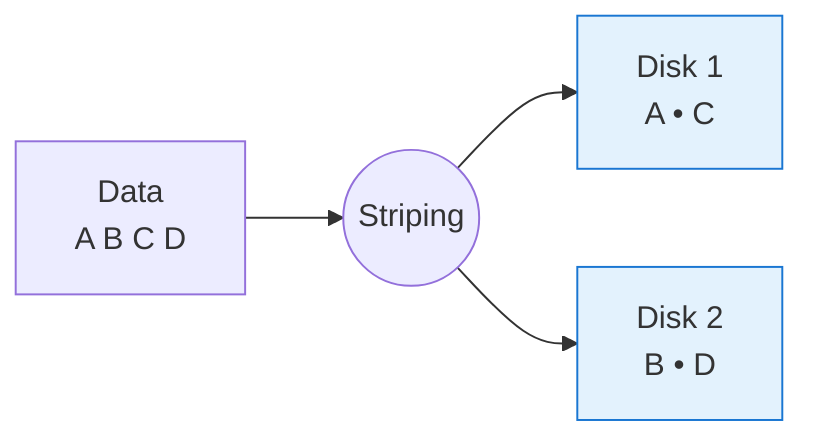
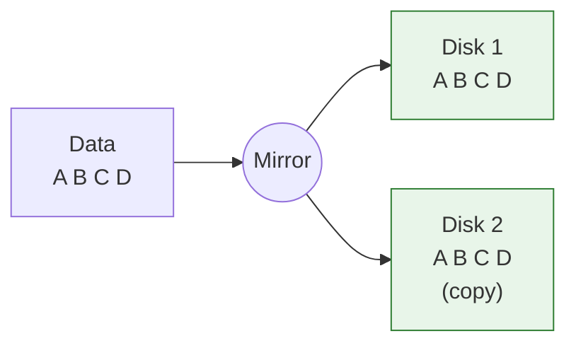
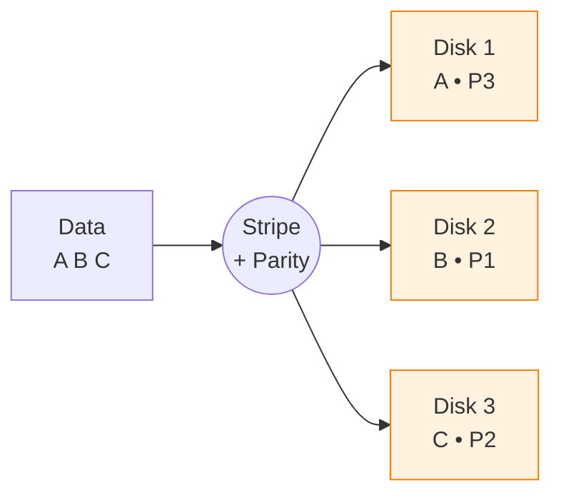
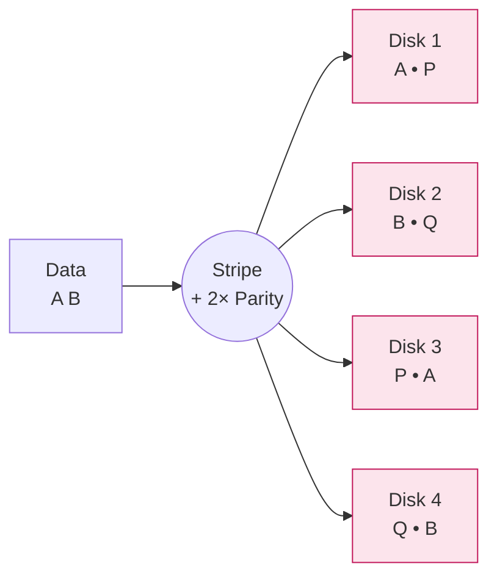
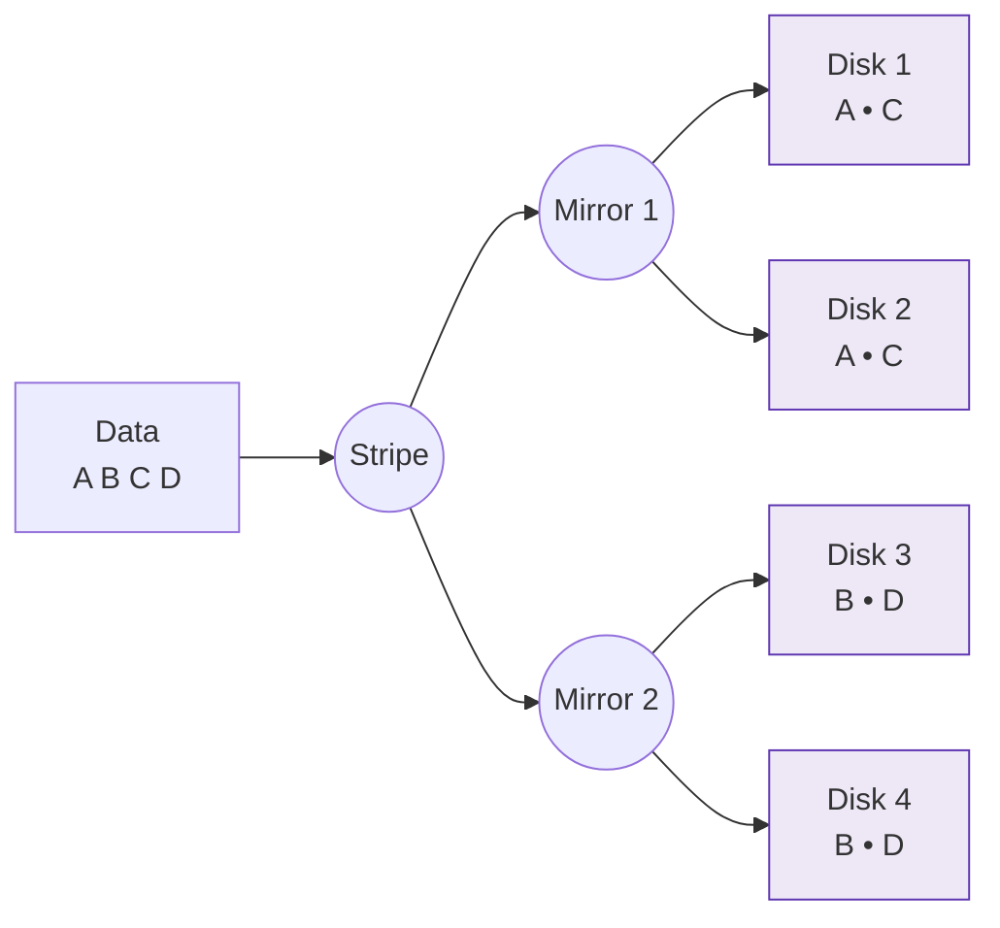

# 📦 What is RAID?

**RAID** (Redundant Array of Independent Disks) is a system consisting of several physical disks. The goal is either to **increase speed** or to **ensure data security**.

RAID, by distributing or copying data in different ways:
- Provides resilience against disk failure
- Increases performance
- Improves availability

> **In simple terms:** RAID means combining several disks so that either they work faster, or if one fails, data is not lost. It can also provide both at the same time.

> **Note:** RAID 2, RAID 3, and RAID 4 technologies are now considered obsolete and are not used in modern systems. These types are legacy, have no practical application today, and are not supported. In practice, only RAID 0, 1, 5, 6, and 10 are commonly used.

---

## 🛡️ Why use RAID?
- **Security:** If more than one disk is used, the failure of one does not cause data loss.
- **Speed:** Data is written/read in parallel.
- **Parity:** Additional parity disk allows data recovery in case of failure.

---

# 🛠️ RAID Types and Use Cases

RAID ensures memory distribution and data protection using different methods. Main techniques:
- **Striping:** Splitting data and writing it in parallel to multiple disks (RAID 0).
- **Mirroring:** Writing the same data to one or more disks simultaneously (RAID 1).
- **Parity:** Writing additional control data for error detection and recovery (RAID 5, RAID 6).

---

## 🚀 RAID 0 – Striping

- **How it works:** Data is split into blocks and written in parallel to multiple disks.
- **Advantages:** High read and write speed.
- **Disadvantages:** No data protection. If one disk fails, all data is lost.
- **Best for:** Systems where only performance matters and data loss is not critical (e.g., temporary files, test environments).

---

## 🛡️ RAID 1 – Mirroring

- **How it works:** Data is written to both disks at the same time. If one disk fails, the other continues to work.
- **Advantages:** High security. There is a full copy of the data.
- **Disadvantages:** Disk capacity is halved (only half is usable).
- **Best for:** Systems storing critical data (finance, medical records).

---

## ⚖️ RAID 5 – Striping + Single Parity

*Parity (P) blocks are distributed across all disks. If one disk fails, the missing data is reconstructed from the parity + remaining data.*

- **How it works:** Data and parity (control data) are distributed across multiple disks.
- **Advantages:** Balanced security and performance.
- **Disadvantages:** Parity calculations can reduce write speed. Data loss risk increases during rebuild.
- **Best for:** Mid-level servers, internal company databases.

---

## 🧩 RAID 6 – Striping + Double Parity

*Two parity blocks (P and Q) are stored — the array survives even if two disks fail.*

- **How it works:** Similar to RAID 5, but two different parities are stored.
- **Advantages:** Data can be recovered even if two disks fail.
- **Disadvantages:** Slower than RAID 5 (due to extra parity). Rebuild takes longer. Requires at least 4 disks.
- **Best for:** High-value and high-availability environments.

---

## 🚀 RAID 10 – (Combination of RAID 1 + RAID 0)

*First mirrored in pairs (RAID 1), then those pairs are striped (RAID 0) — best of both worlds.*

- **How it works:** Disks are first paired as mirrors, then these pairs are striped.
- **Advantages:** High performance + high security.
- **Disadvantages:** Requires at least 4 disks, only half of the total capacity is usable.
- **Best for:** Systems requiring both speed and security (e.g., high-performance databases).

---

# 📋 RAID Selection Guide

| Requirement | Suitable RAID |
|:------------|:-------------|
| High speed, security not important | RAID 0 |
| Maximum data protection, performance less important | RAID 1 |
| Good balance (performance and protection) | RAID 5 |
| Very high protection (even if 2 disks fail) | RAID 6 |
| Both high performance and high security | RAID 10 |

---

# 📦 Storage Usage in RAID (With Examples)

Disk capacity is calculated differently in RAID configurations.  
This affects both performance and data security.

---

## 📈 RAID 0 – Only speed (No data protection)

- **What happens:** All disks are combined. Capacities are summed.
- **Formula:** `Total Capacity = Number of disks × Disk size`
- **Example:**  
  - 2 disks × 1 TB = **2 TB** usable storage
  - If one disk fails, **all data** is lost.

---

## 🛡️ RAID 1 – Mirroring (Maximum protection)

- **What happens:** Each piece of data is written to two disks at the same time.
- **Formula:** `Total Capacity = (Number of disks / 2) × Disk size`
- **Example:**  
  - 2 disks × 1 TB = **1 TB** usable storage
  - If one disk fails, data is **not lost**.

---

## ⚖️ RAID 5 – Striping + Single Parity (Balanced solution)

- **What happens:** Data + parity is distributed across disks.
- **Formula:** `Total Capacity = (Number of disks - 1) × Disk size`
- **Example:**  
  - 3 disks × 2 TB = **4 TB** usable storage
  - If one disk fails, data **can be recovered**.

---

## 🧩 RAID 6 – Striping + Double Parity (Stronger protection)

- **What happens:** Two parities are stored.
- **Formula:** `Total Capacity = (Number of disks - 2) × Disk size`
- **Example:**  
  - 4 disks × 2 TB = **4 TB** usable storage
  - Even if two disks fail, data is **protected**.

---

## 🚀 RAID 10 – Combined security and speed

- **What happens:** First RAID 1 (mirroring), then RAID 0 (striping).
- **Formula:** `Total Capacity = (Number of disks / 2) × Disk size`
- **Example:**  
  - 4 disks × 1 TB = **2 TB** usable storage
  - Both speed increases and system is tolerant to disk failure.

---

# 📋 Quick Table

| RAID Type | Minimum Disks | How disks are used | Usable Storage |
|:----------|:--------------|:-------------------|:---------------|
| RAID 0    | 2             | Only striping      | Sum of all disks |
| RAID 1    | 2             | Mirroring          | Half of total capacity |
| RAID 5    | 3             | Striping with parity | (Number of disks - 1) × Disk size |
| RAID 6    | 4             | Striping with double parity | (Number of disks - 2) × Disk size |
| RAID 10   | 4             | Mirroring + striping | Half of total capacity |

---

## 💸 Price Considerations

| RAID Type | Advantages | Disadvantages | Cost |
|:----------|:-----------|:--------------|:-----|
| RAID 0    | High speed | No protection | Cheapest (just add more disks) |
| RAID 1    | Full protection | Half of storage lost | Need 2x disks |
| RAID 5    | Balanced solution | Risk during rebuild | Need 3+ disks |
| RAID 6    | Strong protection | Slightly lower performance | Need 4+ disks |
| RAID 10   | Speed + protection | High disk cost | Minimum 4 disks and high cost |

---

## 🚨 Common Mistakes and Recommendations

- **Choosing RAID 0 just because it's cheap:** Data loss can be a big problem.
- **Using RAID 5 with too few disks:** With only 3 disks, RAID 5 has weak performance and protection, and risk increases during rebuild.
- **Using disks of different sizes:** In RAID, all disks are treated as the size of the smallest disk. This can waste money.
- **Choosing the wrong RAID for the device:** For example, RAID 0 is better for video editing, but RAID 10 or RAID 6 is more logical for servers.
- **Not backing up:** RAID protects against physical disk failure, but **not** against human error, viruses, or disasters like fire/earthquake.  
  Always keep a **separate backup**!
- **Soft RAID vs. Hardware RAID:**  
  - *Soft RAID* — implemented in software, cheap, but lower performance and reliability.
  - *Hardware RAID* — uses a dedicated RAID controller, faster and more reliable, but more expensive.
- **SSD and RAID:**  
  - If using SSDs, consider write cycle limits and performance differences when choosing RAID configuration.

---

# 🧠 Final Recommendations

- For critical data, choose RAID 1, 5, 6, or 10 if you also want performance.
- For performance only, use RAID 0, but only if you have reliable backups!
- Even after setting up RAID, always maintain regular backups.
- Remember: RAID is never a substitute for a proper backup strategy.
- Evaluate your needs, risks, and budget before choosing a RAID level.
- Test your RAID recovery process before relying on it in production.

---

# 📚 Conclusion

Organizations and individual users should select the RAID type and number of disks based on their specific needs and budget.  
When designing a system, carefully consider both the number of disks and all potential risks.  
No matter which RAID level you choose, always implement a robust backup plan to ensure data safety.

