# Secure Application Development

## Why this matters

The majority of breaches that organisations actually suffer in production are not network-layer events. They are application-layer events — an injection that should have been parameterised, an authorisation check that was only enforced in JavaScript, a deserialisation routine that trusted attacker-controlled bytes, a transitive dependency four levels deep that turned out to be a backdoor. The firewall did its job; the application invited the attacker through the front door.

Secure application development is the discipline of building security into the software lifecycle rather than bolting it on after the fact. The single most expensive mistake in this space is treating security as a gate at the end — a penetration test the week before launch, a compliance review after the change is already in production. Findings discovered late are findings that ship anyway, because nobody wants to slip a release. The cheap mistakes are the ones that get caught while the code is still being typed: a static-analysis warning in the editor, a dependency scanner failing the pull request, a policy engine refusing to merge an infrastructure change that opens a public storage bucket. The same defect costs an order of magnitude more to fix at every stage it survives.

This lesson walks the practical concepts a security-conscious software team needs to internalise: how environments are separated, how code is shipped through them, what secure-coding habits prevent the predictable classes of bug, why client-side validation is theatre, what a modern CI/CD pipeline owes the security programme, and how version control and continuous monitoring close the loop. Examples use the fictional `example.local` organisation and the `EXAMPLE\` domain. Tool names (Semgrep, Trivy, Snyk, Dependabot, GitHub Actions) appear in neutral terms — the principles are the same regardless of vendor.

The risk categories every software-producing organisation has to answer for itself:

- **Environment integrity** — is code that runs in production the code that was reviewed, tested, and signed?
- **Input trust** — can the application distinguish between data and instructions when an adversary controls one of them?
- **Supply chain** — do you know what is in your dependency tree, and would you notice if it changed?
- **Identity at every hop** — does the build pipeline run with the minimum credentials it actually needs, or with administrator?
- **Observability** — when an exploitable defect reaches production, will telemetry catch it before it is exploited?
- **Reversibility** — can you roll back a bad release in minutes without losing data?

These six questions form the backbone of any secure-SDLC programme. The rest of the lesson is about the controls that answer them.

## Core concepts

Secure application development is a flow problem. Code starts on a developer's laptop, moves through a series of progressively more production-like environments, and ends up serving customers. At every transition, controls verify that nothing dangerous slipped through and that the people involved had the authority to move the artefact forward. Skip any of those checks and the only thing protecting production is luck.

### Environment lifecycle — Dev, Test, Staging, Production, QA

Most organisations separate computing environments by purpose so that work in one cannot disrupt another. The hardware is segregated and access control lists prevent users from straddling more than one environment at a time. The classic split is four — sometimes five — distinct environments, each with its own job.

**Development** is sized and configured for writing code. It does not need to be as scalable or as performant as production hardware, but it should match production in operating-system type and version. Developing on Windows and deploying to Linux is the kind of avoidable trap that produces "works on my machine" tickets the day after launch. Once code passes basic developer testing, it moves to the test environment.

**Test** mimics production closely — same software versions, same patch levels, same permissions, same file structures. Footprint matches even where scale does not. The point is to verify that everything bug-free in development still behaves correctly when it is run with the same configuration it will face in production. System-specific settings get exercised here, where surprises are cheap to fix.

**Staging** is optional but common where an organisation has multiple production estates. After test, the system moves into staging, from which it is rolled out to the various production sites. Staging is a sandbox between test and production: the test environment can run the next release while the current release sits in staging, and rollbacks remain possible without touching production. Staging also catches the integrations that test cannot — real third-party endpoints, real network paths, real volumes.

**Production** is where the application meets real users and real data. By design, very few changes occur here, and those that do go through change management — approved, tested, scheduled, and reversible.

**Quality assurance (QA)** is a process discipline rather than a place. Modern practice drives quality and security through the build process itself rather than a layer of inspectors at the end. There is still a role for people who own the bug register, triage findings, and route the right information to the right team — but the work is integration with the build, not gatekeeping the release.

**Environment summary:**

| Environment | Purpose | Data | Cadence | Who has access |
|---|---|---|---|---|
| Development | Code authoring, unit testing | Synthetic / fully fake | Continuous (per commit) | All engineers |
| Test | Functional and security testing | Synthetic or anonymised | Per merge or scheduled | Engineers, QA |
| Staging | Production-like acceptance | Anonymised production extract or synthetic | Per release candidate | QA, ops, limited engineers |
| Production | Real customers, real data | Real | Approved releases only | Ops, on-call only |
| QA (process) | Bug register, triage | N/A | Continuous | QA leads, engineering leads |

The cardinal rule across all five environments is **data segregation**. Production data — real customer PII, real payment cards, real medical records — does not belong in development, test, or staging. The temptation to "just copy a snapshot" so a developer can reproduce a bug is exactly how regulated data leaks: a development workstation rarely has the controls a production database does. When realistic data is required for testing, use anonymisation, tokenisation, or synthetic generation. The rule is non-negotiable for regulated workloads and a strong default for everything else.

A second rule: credentials, signing keys, and service-account tokens that work in production should not exist outside production. A developer who can read a production database from their laptop is a single laptop compromise away from a breach. Use environment-scoped identity, short-lived credentials, and break-glass procedures that page the right people when invoked. The architecture diagram should show explicitly which credentials cross which environment boundary — and most arrows should be empty.

### Provisioning and deprovisioning

**Provisioning** is the act of granting permissions or authorities to objects. Users get provisioned into groups; computer threads can be provisioned to higher execution permissions; environments get provisioned with infrastructure. **Deprovisioning** is the removal of those permissions when they are no longer needed.

In secure coding, the operating principle is to elevate only briefly. A thread that needs root for one operation is provisioned to that level, performs the operation, and is deprovisioned back down. The narrower the window of elevated privilege, the smaller the blast radius if the program is hijacked while elevated.

The same principle applies to whole environments. Modern teams manage infrastructure as code — Terraform, CloudFormation, Bicep, Pulumi — so an environment can be torn down and rebuilt deterministically. The **ephemeral environment** pattern takes this further: every pull request gets its own short-lived preview environment, complete with database, queues, and integrations, that lives for the duration of the review and is destroyed automatically when the PR is merged or closed. Ephemerality removes the long tail of forgotten lab environments accumulating credentials and stale data.

Provisioning workflows themselves need authentication and authorisation. The pipeline that deploys infrastructure has, by definition, the privilege to deploy infrastructure — which makes the pipeline an attractive target. Use OIDC federation between the pipeline platform and the cloud provider so the pipeline assumes a short-lived role rather than holding a long-lived access key, restrict the role to the resources the pipeline actually touches, and require a human approval step for any privileged action in production. The principle of least privilege applies to robots more than to humans.

### Integrity measurement

Integrity in software development is the assurance that data — including source code, build artefacts, container images, and release packages — has not been changed without authorisation. Even small unauthorised changes can have outsized consequences and are easy to miss without controls.

Two things have to be happening for integrity to hold. First, control over the codebase: developers must be working on the legitimate copy, not a fork that diverged a week ago. Second, a way to identify versions that cannot be tampered with. Version-control metadata is helpful but mutable; cryptographic hashes are not. A hash algorithm produces a unique fingerprint of a digital object, and a directory of hash values mapped to versions becomes the integrity record. Given a copy of the code, you hash it and look up the version in the table; if the hash matches, the bits are exactly what was approved.

When code is released for deployment it is signed digitally, and the hash and signature together assure consumers that the artefact has not been changed in transit or at rest. Modern supply-chain practice extends this to **software bills of materials (SBOMs)**, **in-toto attestations**, and **Sigstore-style transparent signing** so the entire chain from commit to deployed image can be verified by any consumer. NIST SP 800-218 (the Secure Software Development Framework) and SLSA (Supply-chain Levels for Software Artifacts) formalise these expectations.

The 2020 SolarWinds compromise made the abstract concrete: an attacker who compromises the build pipeline of a trusted vendor can ship malware to thousands of customers with the vendor's own signature on it. The defence is reproducible builds (the same source produces the same bits, byte-for-byte), hermetic builds (no dependency on the host environment beyond declared inputs), and verifiable provenance (the SBOM and attestation say which commit produced which artefact, and a third party can verify both).

Integrity controls also matter at runtime, not just at build time. Container orchestrators can be configured to refuse images without a valid signature; package managers can verify checksums and signatures of downloaded packages; operating systems can use Secure Boot to reject unsigned kernel modules. Every link in the chain that does not verify integrity is a place where a compromise upstream becomes a compromise of the running workload.

### Secure coding techniques — validation, encoding, normalization, stored procedures, obfuscation, dead code, code reuse

All code has weaknesses. Effective defences make those weaknesses harder to exploit. The Secure Development Lifecycle (SDL) bundles a set of habits that, applied consistently, stop most predictable defect classes.

**Input validation** is the first defence. Every value crossing a trust boundary — HTTP request, file upload, message-queue payload, database row from an external system — must be validated against an allow-list of acceptable shapes before it is used. Allow-list (specify what is permitted) is stronger than deny-list (specify what is forbidden) because attackers will always think of inputs the deny-list never imagined.

**Output encoding** is the complement: data sent into a particular context must be encoded for that context. HTML output gets HTML-encoded; SQL parameters get bound, not concatenated; shell commands get argv arrays, not single strings. Conflating data and instructions is the root cause of injection vulnerabilities — XSS, SQL injection, command injection, LDAP injection — and proper encoding is the cure. Modern web frameworks default to safe encoding in templates; the bugs typically appear where a developer reaches around the framework's safety to produce "raw" output for what they thought was trusted data.

**Normalization** is the step that often comes before validation. Strings can be encoded in many ways — Unicode normalisation forms, percent-encoding, HTML entities — so byte-by-byte comparison of user input to expected values is unreliable. The string `rose` can also appear as `r%6fse`, `r&#111;se`, or various Unicode confusables. Normalising to a canonical form first means equivalent strings have one binary representation, after which validation can be applied consistently.

**Stored procedures and parameterized queries** are the right way to talk to a relational database. A stored procedure is a precompiled, scripted database routine; a parameterized query separates the SQL statement from its parameters so user input cannot change the statement's structure. Either approach prevents the programmer from concatenating untrusted strings into SQL — the bug behind every SQL injection in history. Stored procedures additionally execute faster, but the security benefit is the parameter binding.

The same principle generalises beyond SQL. NoSQL databases (MongoDB, Cassandra) need parameterised queries. ORMs need to be used through their parameterised APIs, not their `.raw()` escape hatches. GraphQL needs depth and complexity limits to prevent denial of service. LDAP queries need escaping. Shell commands need argv arrays. Whenever the application builds an instruction string from user data, the principle "parse, do not concatenate" applies — and the standard library or a vetted helper almost always provides the right primitive.

**Obfuscation** is the practice of hiding obvious meaning to slow an attacker's reconnaissance. Naming mail servers `email1, email2, email3` advertises a namespace; renaming them with non-sequential identifiers makes enumeration harder. Obfuscation is a layer of defence in depth, not a substitute for security. Treating an obfuscated control as adequate on its own is "security by obscurity" and breaks the moment an attacker reads the source.

**Dead code** is code that runs but whose results are never used. Compiler optimisations can remove dead code — useful in general, but dangerous in specific cases. The classic example: a routine that overwrites a secret key with zeros after use to clear it from memory. Because nothing reads the key after the wipe, an aggressive optimiser deletes the wipe and the key lingers. Removing dead code is good hygiene; understanding the cases where the "dead" code is doing security work is essential. Use volatile writes, explicit memory-clearing primitives (`memset_s`, `SecureZeroMemory`), and SDL guidance that calls these out.

**Code reuse** is the foundation of modern software. Reusing components reduces development cost and concentrates expertise — cryptography in particular should always come from a vetted library, never a custom implementation. The trade-off is monoculture: when many systems depend on the same component, a vulnerability in that component has a wide blast radius. Reuse aggressively where the lineage is clean and the maintainer is trustworthy; resist reuse where provenance is unclear and the function is small enough to write yourself.

**Secure-coding habits compared:**

| Habit | What it prevents | How it fails when skipped |
|---|---|---|
| Allow-list input validation | Injection, deserialisation, parser confusion | Attacker submits unexpected shape; downstream parser misbehaves |
| Output encoding per context | XSS, SQL injection, command injection | Data interpreted as instructions; arbitrary code runs |
| Normalisation before validation | Encoding bypasses, Unicode confusables | Validator accepts equivalent string the rest of the system rejects |
| Parameterised queries / stored procs | SQL injection | Attacker controls the WHERE clause; data exfiltrates |
| Memory-safe language or sanitisers | Buffer overflows, UAF, double free | Attacker executes arbitrary code in the process |
| Secret manager (no secrets in code) | Credential leak via repository | Key leaked in commit; harvested in minutes |
| SBOM + dependency scanning | Vulnerable transitive dependency | Next Log4j-style CVE: weeks to discover impact |

### Server-side vs client-side validation

In any client/server application, data can be checked at the client before being sent or at the server after being received. Both have a role; only one is security.

Client-side validation improves the user experience: it catches typos, gives immediate feedback, and avoids a round-trip when a date is in the wrong format. That is its only job.

The client is not a trusted environment. The user — or an attacker on the user's machine, or a man-in-the-middle on the network, or a script bypassing the browser entirely — can change anything after the client check. Every value used for a security or business decision must therefore be validated again on the server, where the application controls the execution. The shorthand: **client-side validation is UX, server-side validation is security.** Anyone who skips the server check because "the form already validates" has built an authorisation system out of JavaScript and earned the consequences.

The same principle extends to mobile and desktop clients. A jailbroken phone, a modified game client, or a custom HTTP tool can issue any request the server accepts. Server-side authorisation must enforce that user A cannot read user B's records, that price fields submitted from the client are not trusted as the source of truth for charging, and that workflow state transitions are validated against the actual previous state in the database — not against whatever the client claims it was.

### Memory management

Memory management covers how a program allocates memory for variables and reclaims it when the variables are no longer needed. Bugs in this area produce some of the worst security defects: **buffer overflows** (writing past the end of an allocation, often onto adjacent stack frames or function pointers), **use-after-free** (accessing memory after it has been released, sometimes with attacker-controlled contents), **double free**, **memory leaks** (allocations that are never released, eventually exhausting resources).

Languages without automatic memory management — C and C++ classically — require the programmer to allocate and free memory explicitly. They produce the fastest binaries and the longest history of CVEs. Languages with automatic garbage collection — Java, C#, Python, Ruby, JavaScript — trade some efficiency for dramatically fewer memory-safety bugs. Modern memory-safe systems languages — Rust, Go, Swift — offer near-C performance with compile-time or runtime guarantees against most memory-corruption classes.

In 2026 the security advice is unambiguous for greenfield work: choose a memory-safe language by default. CISA, NSA, and the major cloud providers have all published guidance pushing in this direction, and rewriting hot paths of legacy C/C++ in Rust has become a mainstream pattern. Existing C/C++ code does not have to be thrown away, but it does need extra defences: AddressSanitizer in CI, fuzzing, MemorySanitizer for uninitialised reads, and modern compiler hardening flags.

Beyond memory safety, broader **safe-language features** matter too: type systems that prevent confusion between strings and SQL, between user IDs and account IDs, between trusted and untrusted data; null safety that prevents the most common runtime crash class; ownership models that make race conditions a compile error rather than a production incident. The cost of switching languages is real; the cost of not switching, paid in CVEs and emergency patches over the lifetime of the codebase, is usually higher.

### Third-party libraries and SDKs

Programming today is largely the integration of third-party libraries and software development kits (SDKs). Rewriting a debugged, well-tested library is rarely the best use of time, and for complex, sensitive routines — cryptography being the canonical example — vetted libraries remove enormous risk. The flip side is supply-chain risk: every dependency is an entry point into the application.

The discipline that addresses this is **software composition analysis (SCA)** — automated tooling that enumerates dependencies (direct and transitive), maps them to known vulnerabilities, and flags or blocks builds that include something dangerous. Tools include Snyk, Dependabot, Renovate, Trivy, OWASP Dependency-Check, and Grype. SBOMs in SPDX or CycloneDX format describe what is in a build so downstream consumers can verify and re-scan as new advisories appear. **Pinning** dependencies to specific versions or content hashes (rather than floating to "latest") makes builds reproducible and prevents an attacker who compromises an upstream maintainer's account from automatically reaching production. Cross-references for tooling: see [./open-source-tools/vulnerability-and-appsec.md](./open-source-tools/vulnerability-and-appsec.md) for the open-source toolset and [./open-source-tools/secrets-and-pam.md](./open-source-tools/secrets-and-pam.md) for related secret-management.

Beyond simply scanning for CVEs, mature programmes also vet new dependencies before they are introduced. Questions worth asking before `npm install`: who maintains this package, when was the last release, how many open security issues, what is the licence, what does it pull in transitively, is there a smaller alternative? **Dependency-confusion attacks** — where a malicious package on a public registry shadows a private internal package name — are defeated by configuring the package manager to use a private registry by default and to scope internal package names. **Typosquatting** — packages named one character away from a popular package — is defeated by code review of every new dependency add.

### Data exposure

Data exposure is loss of control over data during processing. Data must be protected at rest, in transit, and — increasingly — in use. The application team's job is to chart the flow of sensitive data through the system and verify that protection is applied at every hop. Confidentiality failures (unauthorised read) and integrity failures (unauthorised write) are equally serious. Data classification feeds directly into this — see [../grc/security-controls.md](../grc/security-controls.md) for the broader control catalogue.

Practical defences against data exposure include: encryption in transit (TLS 1.3 with strong ciphers, mTLS for service-to-service), encryption at rest (full-disk for hosts, transparent encryption for databases, customer-managed keys for sensitive stores), encryption in use where supported (Intel SGX, AMD SEV, AWS Nitro Enclaves, Azure Confidential Computing for highly sensitive workloads), tokenisation for fields like payment cards, and minimisation — collecting only the data the application actually needs and discarding it as soon as it is no longer required. The strongest data-exposure defence is the data the application does not store.

### OWASP and OWASP Top 10

The Open Web Application Security Project (OWASP) is a non-profit foundation focused on web application security. Its **Top 10** list — broken access control, cryptographic failures, injection, insecure design, security misconfiguration, vulnerable and outdated components, identification and authentication failures, software and data integrity failures, security logging and monitoring failures, server-side request forgery — is the lingua franca for application risk. OWASP also maintains the **Application Security Verification Standard (ASVS)** for verification requirements, the **Software Assurance Maturity Model (SAMM)** for programme maturity, the **Cheat Sheet Series** for implementation guidance, and ZAP for hands-on testing. Web developers should use OWASP resources actively. A dedicated lesson covers the Top 10 in depth: see [../red-teaming/owasp-top-10.md](../red-teaming/owasp-top-10.md).

The Top 10 is not exhaustive — it is the most common, not the only, list of risks. Adjacent OWASP projects worth knowing exist for APIs (the API Security Top 10), mobile (the Mobile Top 10), serverless, machine learning, and LLM applications (the OWASP LLM Top 10, which covers prompt injection, training-data poisoning, and model denial of service). Treat the lists as a starting set; threat-model each application for its specific surface and integrate the categories that apply.

### Software diversity — compilers, binaries, hardening

Software is a series of instructions for a computer. Based on design, coding, and environment decisions, every piece of it has vulnerabilities. **Software diversity** is the practice of avoiding monoculture so that a single vulnerability does not affect every system at once.

**Compilers** convert high-level code into machine code that runs on specific hardware. Modern compilers also manage memory layout, code efficiency, and security hardening. **Hardening compilers** apply protections automatically: stack canaries, position-independent executables (PIE), full RELRO, control-flow integrity (CFI), shadow stacks, and Spectre/Meltdown mitigations. Build flags such as `-fstack-protector-strong`, `-D_FORTIFY_SOURCE=2`, `-fPIE -pie`, `-Wl,-z,relro,-z,now` are the C/C++ baseline; equivalents exist for every mainstream toolchain.

**Binaries** are ultimately sequences of ones and zeros, and identical binaries on identical hardware behave identically — convenient for the defender, also convenient for the attacker building an exploit. **Address Space Layout Randomization (ASLR)** randomises memory layout per boot so the attacker cannot rely on fixed addresses. **Binary diversification** goes further: different builds of the same binary, identical in function but differing in instruction layout, function order, and memory placement, so an exploit that works against one binary does not work against the next. These techniques raise the cost of memory-corruption attacks substantially.

Diversity does not stop at compilers. Different operating systems, different languages, different runtime versions, different cryptographic libraries — used deliberately across an estate — mean a single CVE in one component does not bring down everything. The cost of diversity is operational: more configurations to patch, more knowledge to maintain, more permutations to test. In practice, organisations balance the two by standardising the boring layers (operating system, language runtime) while keeping diversity in the layers most likely to be attacked (TLS implementation, deserialisation library, web framework).

### Automation and scripting, automated courses of action

Automation through scripting and programmable infrastructure is the foundation of **DevOps** — the blending of development and operations into one continuous flow. DevOps emphasises communication between product, development, and operations to enable continuous integration, continuous delivery, and continuous monitoring. Where waterfall models advance phase by phase, DevOps advances change by change, with smaller increments and shorter time-to-fix.

The same automation enables **automated courses of action** for security: the playbooks that respond to detected events without waiting for a human to type the commands. Quarantine an endpoint when a host-based detection fires; rotate a credential when a leaked-secret scanner flags it; revoke an OAuth token when a session looks anomalous. Automating the repeatable work frees skilled cybersecurity staff for analysis the machines cannot do.

Automation also has a downside if applied carelessly: an automated response that makes the wrong decision at scale makes wrong decisions at scale. The safest pattern is graduated automation — high-confidence detections trigger automated actions, lower-confidence detections create high-priority tickets for a human, and the automation always logs what it did and emits an alert that a person reviews afterwards. The goal is to remove repetitive work, not the audit trail.

### Continuous monitoring and continuous validation

**Continuous monitoring** is the set of technologies and processes that enable rapid detection of compliance issues and security risks. Automation provides 24/7/365 coverage of conditions and processes, feeding alerts to a SOC for review and action. Monitoring is the eyes that turn ship-fast into ship-fast-safely.

For applications specifically, continuous monitoring reaches inside the running process. **Application Performance Monitoring (APM)** captures latency, error rate, and throughput per endpoint; **Runtime Application Self-Protection (RASP)** instruments the application to block exploitation in real time; structured application logs feed the SIEM with the security-relevant subset of business events (logins, privilege escalations, sensitive-data access, admin actions). The investment pays back the first time a deployed-but-not-yet-discovered vulnerability is exploited and the team detects it in minutes rather than weeks.

**Continuous validation** extends testing into the continuous flow of DevOps. As code changes, the new code is tested against the existing codebase to ensure functionality and stability. Without continuous validation, the velocity of DevOps is the velocity of regression — not a desirable trade.

The two together form a feedback loop: validation at build time catches regressions before they ship; monitoring at runtime catches whatever validation missed. Both must produce signals an engineer will actually look at — alert fatigue is the failure mode that turns sophisticated tooling into expensive noise. Tune thresholds, suppress known-good responses, and treat every false positive as a bug to fix in the alert configuration, not as a tax to be paid by the on-call rotation.

### CI, CD-Delivery, CD-Deployment

Three terms that get conflated and need to be distinguished:

**Continuous Integration (CI)** is the DevOps practice of continually merging small changes into the main branch and running automated build and test on every change. Safety nets — automated rollback, fast tests, isolated changes — let developers integrate frequently rather than batching huge merges. The result is fewer interactions between changes, easier debugging, and less time chasing integration bugs. Security gates that belong in CI: SAST (static analysis — Semgrep, SonarQube, CodeQL), SCA (dependency scanning — Snyk, Trivy, Dependabot), secret scanning (gitleaks, trufflehog), IaC scanning (Checkov, tfsec), unit tests, lint. The defining property of a CI gate is speed: if it does not return a verdict in minutes, developers stop waiting for it and the gate effectively stops mattering.

**Continuous Delivery (CD-Delivery)** extends CI so any change that passes the gates is automatically packaged and made ready for release to production at any time. Releases are an automated pipeline rather than a manual ceremony — but the final push to production is still a human decision. Security gates that belong here: container image scanning, SBOM generation and signing, artefact signing, and DAST (dynamic analysis — OWASP ZAP, Burp Suite Enterprise, Nuclei) against an ephemeral staging deployment.

**Continuous Deployment (CD-Deployment)** is delivery on autopilot. Every change that passes all pipeline stages is released to production automatically, with no human in the path. This requires strong feature flagging, fast rollback, comprehensive test coverage, and high-quality monitoring — when something does break, you find out from telemetry rather than from a deploy ticket. Security gates that belong here: progressive rollout (canary, blue/green), runtime detection, automated rollback on error budget burn, and post-deploy monitoring against the new version's signature.

**Pipeline gates compared:**

| Stage | Security gate | What it catches | What it misses |
|---|---|---|---|
| Pre-commit (laptop) | Lint, secret scan, format | Obvious mistakes, leaked secrets | Anything that requires the full repo or build |
| CI (per PR) | SAST, SCA, IaC scan, unit tests | Known-bad patterns, vulnerable deps | Runtime behaviour, integration bugs |
| Build | Reproducible build, SBOM, sign | Tampered toolchain, unsigned artefacts | Defects already in source |
| Staging (per merge) | DAST, integration tests, perf | Runtime defects, broken auth flows | Production-only data shapes |
| Pre-deploy approval | Human review of release notes | Bad change-management decisions | Deep technical defects |
| Progressive deploy | Canary, blue/green, error-budget | Production-only regressions | Slow-burn issues that take days |
| Post-deploy | RASP, APM, SIEM, bug bounty | Real-world abuse, novel attacks | Defects nobody is looking for yet |

### Elasticity and scalability

**Elasticity** is the property of changing capacity without breaking. In cloud, resources can be added and removed almost automatically; in software, elasticity means the application can run correctly under varying load and configuration. Single-threaded software is not elastic by design — it cannot use additional cores. Multi-threaded software is more elastic but also more complex (race conditions, deadlocks, ordering issues).

**Scalability** is the property of handling higher workloads on the same resources (scale up) or by adding more resources (scale out). Scalability matters for web systems, databases, application engines, and cloud workloads — but also has security implications. Auto-scaling that spawns identical workloads multiplies the blast radius of any embedded credential; scale-out that adds nodes without rotating shared secrets multiplies the targets for credential theft. Build scalability with workload identity, short-lived credentials, and per-instance secrets so adding a node does not add risk.

Stress and load testing are first-class security activities, not just performance ones. A denial-of-service condition that surfaces only at peak load is still a real availability vulnerability; a race condition that surfaces only under concurrency is still a real correctness bug, and many race conditions translate into security flaws (TOCTOU, double-spend, privilege confusion). Build the test for the expected production load, then add a margin, then run it.

### Version control

Version control tracks every change to source code and infrastructure: who changed what, when, and why. Git is the de facto standard. Versioning conventions — major, minor, patch (semantic versioning) — communicate the impact of each release. Beyond the basics, security teams care about:

- **Branch protection** — main and release branches require pull requests, code review by at least one other engineer (often more for security-critical paths), passing CI checks, and signed commits.
- **Signed commits** — `git commit -S` with GPG or SSH signing ties commits to a verified identity, defeating impersonation in the commit history.
- **Required reviews from CODEOWNERS** — security-relevant files (auth, crypto, IaC, deployment configs) get an automatic review request to the team that owns them.
- **Secret scanning on push** — the platform refuses pushes containing recognised secret patterns, preventing accidental key commits.
- **Audit logging** — every clone, push, branch creation, and permission change gets logged and forwarded to the SIEM.

DevOps practice produces many small, single-purpose releases rather than rare large ones, which makes version control central rather than incidental. The repository is not just storage — it is the source of truth, and its access controls are application security controls.

Version control is also the canonical place to record *why* a change happened. Commit messages, PR descriptions, and the link between a code change and the issue or incident that prompted it are evidence the team will rely on six months later when someone asks "why did we add this exception?" or "which release introduced this regression?" Disciplined commit hygiene — small focused commits, descriptive messages, references to issues and tickets — pays back during every audit and every incident.

## Secure SDLC diagram

The flow below reads left to right: code written by developers, integrated through a security-gated pipeline, deployed under observation, with telemetry feeding back into the next iteration. Each gate exists to catch a class of defect before it ships.

```mermaid
flowchart LR
    code["Source code in Git<br/>(signed commits, branch protection)"]
    sast["SAST in CI<br/>(Semgrep / CodeQL / SonarQube)"]
    build["Build<br/>(reproducible, hermetic)"]
    sca["SBOM &amp; SCA<br/>(Trivy / Snyk / Dependabot)"]
    cscan["Container scan<br/>(Trivy / Grype)"]
    registry["Signed artefact registry<br/>(cosign / Sigstore)"]
    dast["DAST in staging<br/>(OWASP ZAP / Nuclei)"]
    deploy["Progressive deploy<br/>(canary / blue-green)"]
    monitor["Continuous monitoring<br/>(SIEM / RASP / APM)"]
    telemetry["Telemetry feedback<br/>(bug bounty / red team)"]

    code --> sast --> build --> sca --> cscan --> registry --> dast --> deploy --> monitor --> telemetry
    telemetry -.->|new findings, new tests| code

    classDef build fill:#dbe8ff,stroke:#3d6fd8,color:#0a1a3a;
    classDef sec fill:#ffe3c9,stroke:#c46b1a,color:#3a1a0a;
    classDef ops fill:#d4f4dd,stroke:#1f8a3a,color:#0a3a1a;
    class code,build,registry build;
    class sast,sca,cscan,dast sec;
    class deploy,monitor,telemetry ops;
```

Read the diagram as a contract between development, security, and operations. Developers commit to signed branches; CI runs the security gates and refuses to advance defective builds; the registry holds only signed artefacts whose provenance is traceable back to a specific commit; staging exercises the build under DAST before any production traffic sees it; deployment is progressive so blast radius is bounded; monitoring closes the loop by feeding new findings back into the next sprint.

## Hands-on / practice

Five exercises a learner can do with a free GitHub account and a few open-source tools. Each one produces an artefact (a workflow file, a validation function, a settings page, a signed commit, a vulnerability report) that can become part of a real portfolio.

### 1. Set up CI security gates with Semgrep, Trivy and Dependabot

Pick a small project (a Python or Node.js side project works well). Create `.github/workflows/security.yml` with three jobs: Semgrep for SAST against the OWASP Top 10 ruleset, Trivy for container and dependency scanning, and Dependabot configured in `.github/dependabot.yml` to open pull requests for vulnerable dependencies weekly. Verify each one fails the build when you intentionally introduce a known-bad pattern (for example, `eval()` on user input, or a dependency with a known CVE such as old `lodash`). Tune severity thresholds so that critical and high findings block merge, while medium and low file an advisory issue.

### 2. Write input validation for five attack vectors

In your favourite language, write a `validate_user_input(value, kind)` function that defends against five distinct attack classes: SQL injection (parameterise), XSS (HTML-encode for output), command injection (use argv arrays, never shell strings), path traversal (resolve and reject anything outside the allowed root), and Server-Side Request Forgery (allow-list of schemes and hosts). Write unit tests that include the OWASP Top 10 cheat-sheet payloads and confirm each attack is rejected. Document why each defence works.

### 3. Configure branch protection on a repository

On a sandbox GitHub or GitLab repo, configure: pull requests required for `main`, at least one review from CODEOWNERS, status checks must pass (CI, SAST, SCA), conversation resolution required, signed commits required, force-push and deletion blocked, and administrator bypass disabled. Try to push a direct commit to `main` and confirm it fails. Try to merge a PR with a failing check and confirm it fails.

### 4. Produce a signed Git commit

Generate a GPG or SSH signing key, register the public key in your GitHub or GitLab profile, configure `git config --global commit.gpgsign true` (or the SSH equivalent), and make a signed commit to a public repository. Confirm the platform displays a "Verified" badge against the commit. Try to push an unsigned commit to a branch with required signed commits and confirm the push is rejected.

### 5. Deploy a deliberately broken app and watch DAST catch issues

Stand up a deliberately vulnerable application — OWASP Juice Shop, DVWA, or the Damn Vulnerable Web Service — in a sandbox container. Run OWASP ZAP in baseline mode against it as part of a CI workflow, save the report as a build artefact, and review the findings. Identify which OWASP Top 10 categories ZAP detected and which it missed. Add a Nuclei scan with a small template set and compare coverage. Tear the lab down when you are finished — never expose a deliberately vulnerable application on the public internet.

Each of these exercises has both a defensive and an attacker dimension worth practising. After running ZAP against the broken app, try to reproduce one of the findings manually with `curl` or Burp Suite Community to understand what the scanner actually saw. The shortest path to writing better defences is having tried to break similar code yourself.

## Worked example — `example.local` rolls out a secure SDLC for a 12-engineer team

`example.local` has a 12-engineer product team building an internal customer portal. Code is in a private GitHub Enterprise organisation, CI is GitHub Actions, infrastructure is in AWS via Terraform, and the application is a TypeScript backend with a React frontend talking to a managed PostgreSQL instance. The CISO has asked the team to formalise its secure-SDLC practices to satisfy a forthcoming SOC 2 audit and to reduce the steady trickle of findings the annual penetration test keeps surfacing.

**Branch and commit policy.** The `main` branch is protected: PR required, two reviews from CODEOWNERS for any change touching `auth/`, `crypto/`, `iam-policies/`, or `terraform/`, signed commits required, force-push blocked, conversation resolution required. All engineers register SSH signing keys in GitHub. A pre-commit hook running `gitleaks` rejects anything that smells like a credential before it leaves the laptop.

**CI security gates.** Every PR triggers a workflow that runs (in parallel where possible) Semgrep with the `p/owasp-top-ten` and `p/typescript` rulesets, ESLint security plugin, `npm audit` plus Snyk Open Source for SCA, `trivy fs` for the repository, `checkov` and `tfsec` for Terraform, and `gitleaks` for any committed secret. Critical and high findings block merge; medium findings post as PR comments. The team agrees a 30-day SLA for fixing medium findings, escalating to the team lead if they age out.

**Build and artefact integrity.** Builds run in ephemeral GitHub-hosted runners with no production credentials. Container images are built with `docker build` from a pinned base (`node:22.11-bookworm-slim@sha256:...`), tagged with the commit SHA, and pushed to a private ECR registry. Each image is signed with `cosign` using a key managed by AWS KMS, and an SBOM in CycloneDX format is generated by `syft` and attached to the image. The registry policy refuses to deploy images without a valid signature.

**Ephemeral preview environments.** Every PR spins up a Kubernetes namespace with a deployment of the build, a fresh PostgreSQL database (seeded with synthetic data only — no production extracts), and a unique URL on a wildcard domain (`pr-1234.preview.example.local`). OWASP ZAP runs a baseline scan against the preview URL and posts findings to the PR. The namespace is destroyed automatically when the PR is merged or closed, or after 7 days idle.

**Staging gate.** Merging to `main` triggers deploy to the staging environment, which mirrors production configuration (encryption, network isolation, IAM scopes) but is sized smaller. A more thorough Nuclei scan and an authenticated DAST run against staging produce a release report. Findings above medium block the release pipeline.

**Production deploy.** A release tag (`v2.45.1`) triggers the production pipeline, which requires explicit approval from a CODEOWNER on the deployment job. Deploy is progressive: 5% canary for 30 minutes with automatic rollback on error-rate burn, then 25%, 50%, 100%. A post-deploy verification job runs smoke tests and a re-scan of the running deployment.

**Monitoring and feedback.** CloudWatch metrics, structured application logs, and AWS GuardDuty findings flow into the central SIEM. The team subscribes to alerts for any IAM policy change in the production account, any unsigned image deploy attempt, and any anomalous database query pattern. Findings from the SIEM, the bug bounty programme, and the annual pentest are filed as Jira tickets with the appropriate CWE category and feed into the next sprint's planning.

**Outcome after one quarter.** The pentest finds three medium issues instead of the previous twelve, all of which are also flagged by the new CI gates (validating the toolchain). Mean time from a CVE disclosure in a dependency to a merged patch drops from 21 days to 4 days. The SOC 2 audit asks for evidence; the team exports the GitHub branch protection settings, the workflow definitions, the cosign signing logs, and the deployment approval audit trail, and the auditor closes the control without follow-up. None of this required hiring a dedicated AppSec engineer — it required treating the existing 12 engineers' time as the most precious resource and giving them tools that fail loudly close to where the bug was created.

**Cost and friction.** The team measures the cost of the new programme in two ways: tool spend (Snyk and GitHub Advanced Security licences, totalling roughly $40 per engineer per month) and time spent on findings (an average of two engineer-hours per week across the team). Both are dwarfed by the previous cost of late-stage pentest remediation (typically two to three engineer-weeks per cycle of unplanned work). The friction that does remain — the occasional false-positive that blocks a PR, the slower deploy cadence on Fridays — is documented and reviewed quarterly, with rule tuning and gate changes treated as engineering work rather than security overhead.

## Troubleshooting and pitfalls

- **Dev branches with production data.** A developer needs to reproduce a production bug, copies the database snapshot to a dev environment that has weaker controls, and the regulator notices six months later. Use anonymisation, tokenisation, or synthetic data generation. Make production extracts a logged, approved exception, not a routine.
- **"We will fix the security findings later."** Findings deferred at release time become findings that ship and never get fixed. Define an SLA per severity, attach it to the release process, and treat overdue findings as a release-blocking event for the next change to that component.
- **Dependency hell from over-pinning.** Pinning every transitive dependency to an exact version makes builds reproducible but also makes upgrades painful and slow. Use a range with a lockfile (`package-lock.json`, `Pipfile.lock`, `Gemfile.lock`) and let Renovate or Dependabot open small, frequent upgrade PRs.
- **Dependency drift from under-pinning.** Floating to `latest` means tomorrow's build is not today's build, which destroys reproducibility and exposes you to dependency-confusion attacks. Always lock to specific versions or content hashes, scan on every build, and alert on unexpected changes.
- **Flaky DAST scans gating deploys.** A DAST tool that produces 30% false positives or times out intermittently teaches engineers to rerun until green, which trains them to ignore real findings. Tune the rules, mark known-good responses, and treat scanner reliability as a first-class engineering problem.
- **Obfuscation mistaken for security.** Minified JavaScript, renamed binaries, and stripped debug symbols slow an attacker by minutes. They do not protect a hard-coded API key. Treat obfuscation as defence in depth, never as the security control.
- **Memory-unsafe code in 2026.** Greenfield C or C++ for new services is a hard sell when memory-safe alternatives exist. For existing C/C++, invest in AddressSanitizer in CI, fuzzing, and modern compiler hardening — and consider rewriting the most security-critical paths in Rust.
- **Bypassing branch protection for "emergency."** The first time someone disables branch protection to push a hotfix is the day branch protection effectively ends. Define the emergency procedure in advance: a documented two-person break-glass, a post-incident review, and re-enabling within hours.
- **Secrets in commits.** A leaked AWS key in a public repository is harvested in minutes. Use pre-commit secret scanning, server-side push protection, and assume any secret that has ever existed in any history is permanently burned — rotate it the moment you find it, even after a force-push.
- **Unsigned production releases.** If the artefact in the registry has no signature, nothing prevents an attacker who compromises the registry from substituting a malicious image. Sign every image with cosign or equivalent, and configure the orchestrator to refuse unsigned images.
- **CI runners with broad cloud privileges.** A GitHub Actions runner with `AdministratorAccess` to the production account is a single secret leak away from a total breach. Use OIDC federation with short-lived credentials scoped to the minimum, environment-specific runners, and require manual approval for production deploys.
- **Trusting client-side validation.** A form that only validates in JavaScript is a public API with no validation. Every value that crosses a trust boundary gets validated again on the server.
- **No SBOM means no answer when the next Log4j hits.** When the industry asks "are you affected by CVE-2099-12345 in library X version Y?" you need to be able to answer in minutes, not weeks. Generate SBOMs at build time, store them with the artefact, and make them queryable.
- **One-shot pentests as the only AppSec activity.** An annual pentest is a sample, not a programme. Continuous testing — SAST, DAST, SCA, secret scanning, IaC scanning, periodic threat modelling — catches the steady drip; the pentest validates that the steady drip is working.
- **Threat modelling skipped because "we know our app."** New features change the threat surface. Add a lightweight threat-modelling step (STRIDE, attack trees, or even a 30-minute "what could go wrong" workshop) to the design phase for any change that touches authentication, authorisation, sensitive data, or external integration.
- **Logging that does not reach the SIEM.** Application logs in a file on the container that gets recycled every hour are not logs at all. Forward structured logs to a central store, retain them for the period the threat model requires, and alert on the security-relevant subset.
- **Forgotten preview environments.** A PR that was abandoned without being merged or closed leaves an ephemeral environment that is no longer ephemeral. Automate teardown on a TTL (7 days idle) and report any environment older than the TTL to the team owner.
- **Compliance theatre.** Generating evidence that the gate exists is not the same as ensuring the gate works. Periodically test the controls — push a known-bad pattern through CI and confirm the gate fires; try a deploy without an approval and confirm it is blocked. If the test passes, the control works; if it does not, you have just discovered a finding before the auditor does.

## Key takeaways

- Most breaches are application-layer; security has to be built into the SDLC, not added at the end.
- Environments — dev, test, staging, production, QA — exist for separation. Production data does not belong outside production.
- Provisioning and deprovisioning narrow the window of elevated privilege and enable ephemeral environments that leave no debt behind.
- Integrity measurement — hashes, signed releases, SBOMs, transparent logs — proves that what runs in production is what was reviewed and built.
- Secure coding habits — input validation, output encoding, normalisation, parameterised queries — prevent the predictable bug classes. Obfuscation is defence in depth, never the control.
- Server-side validation is security; client-side is UX. Skipping the server check builds an authorisation system out of JavaScript.
- Memory management is a security topic. In 2026 the default for new code is a memory-safe language; existing C/C++ needs sanitisers, fuzzing, and hardening flags.
- Third-party libraries are a supply-chain risk. SCA tools, SBOMs, and pinned versions are not optional.
- OWASP — Top 10, ASVS, SAMM, Cheat Sheets — is the lingua franca of web application security. Use it.
- Software diversity — hardening compilers, ASLR, binary diversification — raises the cost of memory-corruption attacks.
- Automation, continuous monitoring, and continuous validation give the security programme the same velocity as DevOps.
- CI / CD-Delivery / CD-Deployment are three different things. Each gets different security gates.
- Version control is an application-security control. Branch protection, signed commits, and CODEOWNERS turn the repository into a controlled artefact.
- Continuous improvement closes the loop. Telemetry from production, bug bounties, and red-team exercises feeds the next iteration's tests.

A secure-SDLC programme that answers the six questions at the top of this lesson — environment integrity, input trust, supply chain, identity at every hop, observability, reversibility — in writing, automated where possible, reviewed annually, signed by an executive sponsor, scales with the organisation. One that answers them by tribal knowledge and end-of-cycle pentests will not survive its second incident.

The cultural shift is as important as the tooling. Security has to be a property of how the team works, not a department the team negotiates with. The most successful programmes embed AppSec engineers inside product teams, treat security findings the same way they treat any other defect, and reward engineers who propose proactive improvements rather than only those who fix what is already broken. When the developer who notices the missing rate-limit on a new endpoint is the one who adds it — without filing a ticket and waiting — the programme is mature.

Cross-references: [./aaa-non-repudiation.md](./aaa-non-repudiation.md) for the identity foundations every pipeline relies on; [vulnerability management](./assessment/vulnerability-management.md) for the broader vulnerability lifecycle; [../grc/security-controls.md](../grc/security-controls.md) for the catalogue of controls these practices instantiate.

## Reference images

These illustrations are from the original training deck and complement the lesson content above.

  <figure><figcaption>Slide 1</figcaption></figure>
  <figure><figcaption>Slide 2</figcaption></figure>
  <figure><figcaption>Slide 3</figcaption></figure>
  <figure><figcaption>Slide 4</figcaption></figure>
  <figure><figcaption>Slide 5</figcaption></figure>
  <figure><figcaption>Slide 6</figcaption></figure>
  <figure><figcaption>Slide 7</figcaption></figure>
  <figure><figcaption>Slide 8</figcaption></figure>
  <figure><figcaption>Slide 10</figcaption></figure>
  <figure><figcaption>Slide 11</figcaption></figure>
  <figure><figcaption>Slide 12</figcaption></figure>
  <figure><figcaption>Slide 13</figcaption></figure>
  <figure><figcaption>Slide 14</figcaption></figure>
  <figure><figcaption>Slide 15</figcaption></figure>
  <figure><figcaption>Slide 16</figcaption></figure>
  <figure><figcaption>Slide 17</figcaption></figure>
  <figure><figcaption>Slide 18</figcaption></figure>
  <figure><figcaption>Slide 19</figcaption></figure>
  <figure><figcaption>Slide 20</figcaption></figure>
  <figure><figcaption>Slide 22</figcaption></figure>
  <figure><figcaption>Slide 24</figcaption></figure>
  <figure><figcaption>Slide 25</figcaption></figure>
  <figure><figcaption>Slide 26</figcaption></figure>
  <figure><figcaption>Slide 28</figcaption></figure>
  <figure><figcaption>Slide 29</figcaption></figure>
  <figure><figcaption>Slide 30</figcaption></figure>
  <figure><figcaption>Slide 34</figcaption></figure>
  <figure><figcaption>Slide 35</figcaption></figure>
  <figure><figcaption>Slide 40</figcaption></figure>
  <figure><figcaption>Slide 43</figcaption></figure>
  <figure><figcaption>Slide 44</figcaption></figure>
  <figure><figcaption>Slide 45</figcaption></figure>
  <figure><figcaption>Slide 46</figcaption></figure>
  <figure><figcaption>Slide 47</figcaption></figure>
  <figure><figcaption>Slide 48</figcaption></figure>
  <figure><figcaption>Slide 49</figcaption></figure>
  <figure><figcaption>Slide 50</figcaption></figure>
  <figure><figcaption>Slide 52</figcaption></figure>
  <figure><figcaption>Slide 53</figcaption></figure>
  <figure><figcaption>Slide 54</figcaption></figure>
  <figure><figcaption>Slide 56</figcaption></figure>

## References

- NIST SP 800-218 — *Secure Software Development Framework (SSDF)* — [https://csrc.nist.gov/publications/detail/sp/800-218/final](https://csrc.nist.gov/publications/detail/sp/800-218/final)
- NIST SP 800-204 — *Security Strategies for Microservices-based Application Systems* — [https://csrc.nist.gov/publications/detail/sp/800-204/final](https://csrc.nist.gov/publications/detail/sp/800-204/final)
- OWASP Top 10 — [https://owasp.org/www-project-top-ten/](https://owasp.org/www-project-top-ten/)
- OWASP Application Security Verification Standard (ASVS) — [https://owasp.org/www-project-application-security-verification-standard/](https://owasp.org/www-project-application-security-verification-standard/)
- OWASP Software Assurance Maturity Model (SAMM) — [https://owaspsamm.org/](https://owaspsamm.org/)
- OWASP Cheat Sheet Series — [https://cheatsheetseries.owasp.org/](https://cheatsheetseries.owasp.org/)
- CIS Software Supply Chain Security Benchmark — [https://www.cisecurity.org/benchmark/software-supply-chain-security](https://www.cisecurity.org/benchmark/software-supply-chain-security)
- SLSA — *Supply-chain Levels for Software Artifacts* — [https://slsa.dev/](https://slsa.dev/)
- Sigstore — [https://www.sigstore.dev/](https://www.sigstore.dev/)
- CycloneDX SBOM standard — [https://cyclonedx.org/](https://cyclonedx.org/)
- SPDX SBOM standard — [https://spdx.dev/](https://spdx.dev/)
- CISA — *The Case for Memory Safe Roadmaps* — [https://www.cisa.gov/resources-tools/resources/case-memory-safe-roadmaps](https://www.cisa.gov/resources-tools/resources/case-memory-safe-roadmaps)
- MITRE CWE Top 25 Most Dangerous Software Weaknesses — [https://cwe.mitre.org/top25/](https://cwe.mitre.org/top25/)
