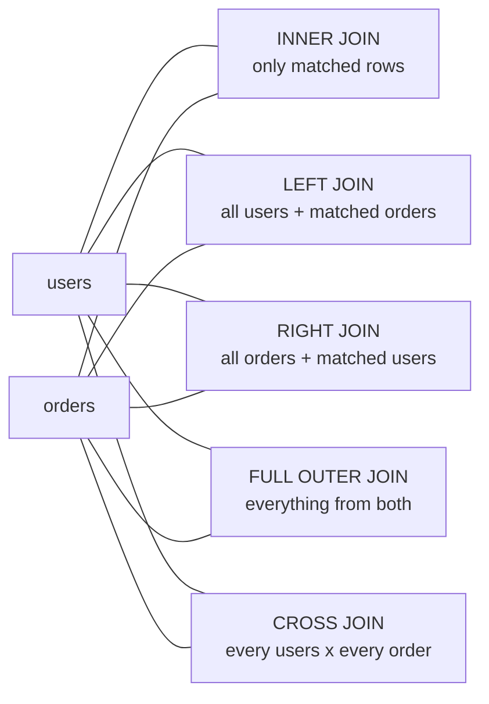

# SQL Basics for Security Engineers

Security engineers do not need to be database administrators, but the day you cannot read SQL is the day you stop being useful in three very common situations: pulling evidence out of an audit table after an incident, writing a hunt query in a SIEM (most of them speak SQL or a SQL dialect like KQL or SPL), and reading a SQL injection payload in a WAF log and understanding *why* it would have worked. SQLi is the most famous web vulnerability on the planet, but the payload `' OR 1=1--` is just a snippet of a real query — if you have never seen the query, the payload is meaningless.

This lesson is the working SQL literacy a security engineer needs. It covers the relational model, the five statements that make up 90% of day-to-day SQL, joins, aggregates, indexes, transactions, users and privileges, parameterized queries, and a hands-on lab. The deep dive into injection itself lives in the OWASP Top 10 lesson at [/red-teaming/owasp-top-10](/red-teaming/owasp-top-10); the goal here is to give you the foundation that lesson assumes.

We use **PostgreSQL** syntax for examples because it is the strictest dialect — anything that runs on PostgreSQL will, with tiny edits, run on MySQL, MS SQL Server, Oracle and SQLite. We use the company `example.local` and the SQL user `EXAMPLE\svc-app` throughout.

## The relational model in one page

A **relational database** stores data in **tables**. A table is a grid:

- A **column** is a typed field — `email`, `created_at`, `amount`. Each column has a fixed data type (`INTEGER`, `TEXT`, `TIMESTAMP`, `BOOLEAN`, `NUMERIC`).
- A **row** is one record — one user, one order, one log event.
- A **schema** is the collection of table definitions: which tables exist, which columns they have, and which constraints apply.
- A **primary key** (`PK`) is the column (or columns) that uniquely identifies a row. Every table should have one. The convention is an integer `id` column.
- A **foreign key** (`FK`) is a column that points at the primary key of another table. It enforces a relationship: an order belongs to exactly one user, and the database refuses to insert an order whose `user_id` does not exist.

Two example tables we will reuse throughout the lesson:

`users`

| id (PK) | email | role |
|---|---|---|
| 1 | a.aliyev@example.local | admin |
| 2 | k.huseynov@example.local | analyst |
| 3 | m.mammadova@example.local | viewer |

`orders`

| id (PK) | user_id (FK → users.id) | amount | ts |
|---|---|---|---|
| 100 | 1 | 49.00 | 2026-04-01 09:12 |
| 101 | 2 | 199.00 | 2026-04-02 10:33 |
| 102 | 1 | 12.50 | 2026-04-03 15:00 |
| 103 | 2 | 75.00 | 2026-04-10 08:45 |

`users.id` is the primary key. `orders.user_id` is a foreign key that references `users.id`. The two tables together let us answer questions like "which user spent the most last month?" without duplicating the user's email into every row of the `orders` table — that is the point of relational design.

## The five statements that cover 90% of daily SQL

Almost everything you read in a SIEM, audit table, or application code is one of these five statements. Four are **DML** (Data Manipulation Language): `SELECT`, `INSERT`, `UPDATE`, `DELETE`. One is **DDL** (Data Definition Language): `CREATE TABLE`. The other DDL verbs (`ALTER`, `DROP`, `TRUNCATE`) and the DCL verbs (`GRANT`, `REVOKE`) appear later.

### CREATE TABLE — define a table

```sql
CREATE TABLE users (
    id     SERIAL       PRIMARY KEY,
    email  TEXT         NOT NULL UNIQUE,
    role   TEXT         NOT NULL DEFAULT 'viewer',
    created_at TIMESTAMP NOT NULL DEFAULT NOW()
);
```

`SERIAL` is PostgreSQL shorthand for an auto-incrementing integer. `NOT NULL` and `UNIQUE` are constraints — the database will reject any row that violates them. Constraints are free defence in depth: a `NOT NULL email` column means a buggy app can never silently insert a half-formed user.

### INSERT — add a row

```sql
INSERT INTO users (email, role)
VALUES ('a.aliyev@example.local', 'admin');
```

Always list the columns explicitly. `INSERT INTO users VALUES (...)` without a column list breaks the moment someone adds a column.

### SELECT — read rows

```sql
SELECT id, email, role
FROM users
WHERE role = 'admin';
```

`SELECT *` returns every column. It is fine for ad-hoc exploration and a code smell in production code: if a column is added later you do not want random downstream consumers to start receiving it.

### UPDATE — change rows

```sql
UPDATE users
SET role = 'analyst'
WHERE email = 'k.huseynov@example.local';
```

The `WHERE` clause on `UPDATE` is the most dangerous habit to forget in SQL. `UPDATE users SET role = 'admin'` with no `WHERE` makes everyone an admin. Test it as a `SELECT` first; only then convert to `UPDATE`.

### DELETE — remove rows

```sql
DELETE FROM users
WHERE id = 3;
```

Same warning. `DELETE FROM users` with no `WHERE` empties the table. In production, prefer **soft delete** — a `deleted_at TIMESTAMP` column you flip instead of removing the row — so an audit trail survives.

## WHERE, ORDER BY, LIMIT

Three modifiers that let you turn "everything in this table" into "the part I actually want."

- `WHERE` — filter rows by a boolean condition.
- `ORDER BY` — sort the result.
- `LIMIT` — return at most N rows. (MS SQL Server uses `TOP N` instead, Oracle uses `FETCH FIRST N ROWS ONLY`.)

A combined example — the 5 most recent orders over 50 manat from user `2`:

```sql
SELECT id, amount, ts
FROM orders
WHERE user_id = 2
  AND amount > 50
ORDER BY ts DESC
LIMIT 5;
```

Useful operators inside `WHERE`:

| Operator | Meaning | Example |
|---|---|---|
| `=` `<>` `<` `<=` `>` `>=` | Comparison | `amount > 100` |
| `AND` `OR` `NOT` | Boolean combination | `role = 'admin' AND active = TRUE` |
| `IN (...)` | Match any of a list | `role IN ('admin', 'analyst')` |
| `BETWEEN a AND b` | Inclusive range | `ts BETWEEN '2026-04-01' AND '2026-04-30'` |
| `LIKE` | Pattern with `%` and `_` | `email LIKE '%@example.local'` |
| `IS NULL` / `IS NOT NULL` | NULL check | `deleted_at IS NULL` |

NULL is not zero and not the empty string — it is "unknown." `WHERE x = NULL` is **always false**. Use `IS NULL`.

## JOINs — the one concept that trips up everyone

A JOIN combines rows from two (or more) tables on a shared key. It is the question "which row in table A matches which row in table B?" There are five flavours, and the difference between them is *which non-matching rows survive*.



A picture in a table:

| Join type | Rows from `users` with no orders | Rows from `orders` with no matching user |
|---|---|---|
| `INNER JOIN` | dropped | dropped |
| `LEFT JOIN` | kept (order columns NULL) | dropped |
| `RIGHT JOIN` | dropped | kept (user columns NULL) |
| `FULL OUTER JOIN` | kept | kept |
| `CROSS JOIN` | every user paired with every order, no key needed | — |

A concrete example — list every user with the total they have spent, including users who have never placed an order:

```sql
SELECT u.id,
       u.email,
       COALESCE(SUM(o.amount), 0) AS total_spent
FROM   users u
LEFT JOIN orders o
       ON o.user_id = u.id
GROUP BY u.id, u.email
ORDER BY total_spent DESC;
```

Three things to notice:

1. The aliases `u` and `o` save typing and make the join condition readable.
2. `LEFT JOIN` keeps users with no orders; `INNER JOIN` would silently drop them.
3. `COALESCE(SUM(o.amount), 0)` turns a NULL total (a user with no orders) into 0 — `SUM` of nothing is NULL, which surprises beginners.

The single most common bug in real SQL is using `INNER JOIN` when `LEFT JOIN` was meant. The query "looks right" — it returns numbers — but quietly omits every left-hand row with no match. Always ask: *do I want unmatched rows to disappear or to show up with NULLs?*

## Aggregates and GROUP BY

Aggregate functions collapse many rows into one number. The five you need:

| Function | What it does |
|---|---|
| `COUNT(*)` | Number of rows |
| `COUNT(col)` | Number of rows where `col IS NOT NULL` |
| `SUM(col)` | Sum of a numeric column |
| `AVG(col)` | Average of a numeric column |
| `MIN(col)` / `MAX(col)` | Smallest / largest value |

Without `GROUP BY` an aggregate returns a single row covering the whole table. `GROUP BY` says "give me one row per distinct value of these columns." `HAVING` filters the result of `GROUP BY` (you cannot use `WHERE` for that — `WHERE` runs *before* the grouping).

Example — find every user with more than 10 orders:

```sql
SELECT u.id,
       u.email,
       COUNT(o.id) AS order_count,
       SUM(o.amount) AS total_amount
FROM   users u
JOIN   orders o ON o.user_id = u.id
GROUP BY u.id, u.email
HAVING COUNT(o.id) > 10
ORDER BY order_count DESC;
```

Mental model: `WHERE` filters rows *before* grouping; `HAVING` filters the *groups* after they exist.

## Indexes in 2 minutes

An **index** is a side data structure that lets the database find rows by a column value without scanning the whole table. A 100 million-row table with no index on `email` takes seconds (or minutes) to answer `WHERE email = 'x@y'`; with an index, it takes microseconds.

```sql
CREATE INDEX ix_users_email ON users(email);
```

The price you pay:

- Each index uses disk space.
- Every `INSERT`, `UPDATE` or `DELETE` has to update the index too — write-heavy tables suffer if you over-index them.
- The query planner picks indexes automatically; redundant indexes simply waste space.

Rule of thumb: index columns you `WHERE`, `JOIN ON`, or `ORDER BY` frequently. Do **not** index columns that change constantly or have only a few distinct values (a `gender` column with two values gains nothing from an index).

Three index types you will see:

- **B-tree** — the default. Good for equality (`=`), ranges (`<`, `>`, `BETWEEN`), and prefix `LIKE 'foo%'`.
- **Hash** — equality only. Faster for `=` but useless for ranges. Niche.
- **Full-text** (PostgreSQL `tsvector`, MySQL `FULLTEXT`) — for searching natural language inside long text columns.

When a report that used to take 200 ms suddenly takes 30 seconds, the answer is almost always "a table grew and it has no useful index for the new query."

## Transactions and ACID

A **transaction** is a group of statements that succeed together or fail together. The classic example is moving money: debit one account, credit another. If only the debit lands, money disappears.

```sql
BEGIN;

UPDATE accounts SET balance = balance - 100 WHERE id = 1;
UPDATE accounts SET balance = balance + 100 WHERE id = 2;

COMMIT;        -- both writes become visible
-- ROLLBACK;   -- neither write happens
```

The four **ACID** guarantees a real RDBMS gives you:

- **Atomicity** — all statements in a transaction commit or none of them do.
- **Consistency** — constraints (`NOT NULL`, `FK`, `UNIQUE`, `CHECK`) are never violated by a committed transaction.
- **Isolation** — concurrent transactions do not see each other's half-finished work.
- **Durability** — once `COMMIT` returns, the change survives a power loss.

Why a security engineer cares: an audit log written *outside* a transaction can disagree with the data it claims to describe. If you log "user X deleted record Y" and then the deletion rolls back, your audit trail lies. The right pattern is to write the audit row inside the same transaction as the change it records, so they commit or roll back together.

## Users, roles, privileges

A database has its own users, separate from the OS. SQL has two verbs for managing what they can do — `GRANT` and `REVOKE`.

```sql
-- Create a low-privilege user for the web application
CREATE USER svc_app WITH PASSWORD 'a-long-random-secret';

-- Give it only what it actually needs
GRANT CONNECT ON DATABASE shop TO svc_app;
GRANT USAGE   ON SCHEMA   public TO svc_app;
GRANT SELECT, INSERT, UPDATE ON users, orders TO svc_app;

-- Read-only reporting account
CREATE USER readonly WITH PASSWORD 'another-long-secret';
GRANT CONNECT ON DATABASE shop TO readonly;
GRANT USAGE   ON SCHEMA   public TO readonly;
GRANT SELECT  ON ALL TABLES IN SCHEMA public TO readonly;

-- Take a privilege back
REVOKE INSERT ON users FROM svc_app;
```

The single most-violated rule: **web applications should never connect with the DBA account.** If the app is compromised by SQL injection, the attacker inherits whatever the DB user can do. A DBA account can `DROP DATABASE`; a properly-scoped `svc_app` account that only has `SELECT, INSERT, UPDATE` on three tables turns a catastrophic breach into a manageable one.

A **role** in PostgreSQL is the same object as a user; the convention is to grant privileges to roles and then `GRANT role TO user`, so you can recycle privilege bundles.

```sql
CREATE ROLE r_reader;
GRANT SELECT ON ALL TABLES IN SCHEMA public TO r_reader;
GRANT r_reader TO readonly;
```

## Stored procedures and parameterized queries

A **stored procedure** is a named block of SQL stored inside the database, called by name with arguments. It runs server-side, can encapsulate complex logic, and is one way (not the only way) to enforce parameterised input.

```sql
CREATE OR REPLACE FUNCTION get_user_by_email(p_email TEXT)
RETURNS TABLE (id INT, email TEXT, role TEXT)
LANGUAGE SQL AS $$
    SELECT id, email, role
    FROM   users
    WHERE  email = p_email;
$$;

-- call it
SELECT * FROM get_user_by_email('a.aliyev@example.local');
```

The point worth memorising: a **parameterised query** (also called a *prepared statement*) sends the SQL text and the parameter values to the database as **separate things**. The database compiles the query first, then plugs in the values. The values are never parsed as SQL, which is why parameterisation is the single most effective SQL injection defence — it does not "escape" the input, it makes injection structurally impossible.

In Python with `psycopg2`:

```python
cur.execute(
    "SELECT id, role FROM users WHERE email = %s",
    (user_supplied_email,)
)
```

The `%s` is a parameter marker, not Python string formatting. Other dialects use `?` (SQLite, JDBC) or `:name` (Oracle, named parameters in `psycopg2`).

The OWASP Top 10 lesson at [/red-teaming/owasp-top-10](/red-teaming/owasp-top-10) covers SQLi exploitation in depth (A03 — Injection). Read the next section first to see why string concatenation is fatal.

## SQLi preview — vulnerable vs safe in 10 lines

```python
import psycopg2
conn = psycopg2.connect("dbname=shop user=svc_app")
cur  = conn.cursor()

# VULNERABLE — never do this
email = request.form['email']         # attacker-controlled
sql   = "SELECT id FROM users WHERE email = '" + email + "'"
cur.execute(sql)

# SAFE — parameterised
cur.execute(
    "SELECT id FROM users WHERE email = %s",
    (request.form['email'],)
)
```

Against the vulnerable version, an attacker submits `email = ' OR '1'='1`. The string concatenation produces:

```sql
SELECT id FROM users WHERE email = '' OR '1'='1'
```

`'1'='1'` is always true, so every row matches and the login bypasses authentication. Against the safe version, the same input is sent as a literal string value `' OR '1'='1` and the query looks for a user with exactly that email — finds none — and the login fails as it should.

The full deep dive — UNION-based injection, blind injection, time-based, ORM caveats, the OWASP cheat sheet — lives at [/red-teaming/owasp-top-10](/red-teaming/owasp-top-10).

## Hands-on

Pick **either** SQLite (no install needed on macOS, ships with most distros, one binary on Windows) **or** PostgreSQL. The exercises work on both with tiny syntax differences noted inline.

### 1. Install SQLite, create a `users` table, SELECT them back

```bash
# macOS / most Linux: already installed
sqlite3 lab.db

# Windows: download sqlite-tools from https://sqlite.org/download.html
# then from PowerShell or cmd:
sqlite3.exe lab.db
```

Inside the `sqlite3` prompt:

```sql
CREATE TABLE users (
    id    INTEGER PRIMARY KEY AUTOINCREMENT,
    email TEXT    NOT NULL UNIQUE,
    role  TEXT    NOT NULL DEFAULT 'viewer'
);

INSERT INTO users (email, role) VALUES ('a.aliyev@example.local',   'admin');
INSERT INTO users (email, role) VALUES ('k.huseynov@example.local', 'analyst');
INSERT INTO users (email, role) VALUES ('m.mammadova@example.local','viewer');

SELECT * FROM users;
```

You should see three rows numbered 1, 2, 3.

### 2. JOIN across `users` and `orders`

```sql
CREATE TABLE orders (
    id      INTEGER PRIMARY KEY AUTOINCREMENT,
    user_id INTEGER NOT NULL REFERENCES users(id),
    amount  REAL    NOT NULL,
    ts      TEXT    NOT NULL DEFAULT CURRENT_TIMESTAMP
);

INSERT INTO orders (user_id, amount) VALUES (1, 49.00), (2, 199.00), (1, 12.50), (2, 75.00);

SELECT u.email, COUNT(o.id) AS n_orders, COALESCE(SUM(o.amount), 0) AS spent
FROM   users u
LEFT JOIN orders o ON o.user_id = u.id
GROUP BY u.email
ORDER BY spent DESC;
```

`m.mammadova` should appear with 0 orders and 0 spent. Re-run the query with `INNER JOIN` and confirm she disappears — that is the LEFT vs INNER bug from earlier, in your own database.

### 3. Create a `readonly` user with `GRANT SELECT` only

SQLite has no users; do this on PostgreSQL. From the `psql` prompt as a superuser:

```sql
CREATE USER readonly WITH PASSWORD 'lab-only-secret';
GRANT CONNECT ON DATABASE postgres TO readonly;
GRANT USAGE   ON SCHEMA   public   TO readonly;
GRANT SELECT  ON ALL TABLES IN SCHEMA public TO readonly;
```

Then connect as `readonly` and confirm `INSERT` and `DELETE` are rejected:

```bash
psql -U readonly -d postgres
```

```sql
SELECT * FROM users;                 -- works
INSERT INTO users (email) VALUES ('x@y');  -- ERROR: permission denied
```

### 4. Try `' OR 1=1--` against a vulnerable login query, then fix it

A tiny Python script with the vulnerability built in. Save as `vuln_login.py`:

```python
import sqlite3, sys

conn = sqlite3.connect("lab.db")
cur  = conn.cursor()

email    = sys.argv[1]
password = sys.argv[2]   # we ignore this for the demo

# VULNERABLE
sql = f"SELECT id, role FROM users WHERE email = '{email}'"
print("running:", sql)
print(cur.execute(sql).fetchall())
```

Run it normally and then with the classic payload:

```bash
python vuln_login.py 'a.aliyev@example.local' 'whatever'
python vuln_login.py "' OR 1=1--" 'whatever'
```

The second call returns *every* user. Now fix it:

```python
sql = "SELECT id, role FROM users WHERE email = ?"
print(cur.execute(sql, (email,)).fetchall())
```

Re-run the same payload. The query searches for an email literally equal to `' OR 1=1--`, finds nothing, returns the empty list. That is the entire SQL injection mitigation in five characters of diff.

## Worked example — example.local audit table

You inherit an `audit_events` table that the application writes one row to for every security-relevant action. The schema:

```sql
CREATE TABLE audit_events (
    id      BIGSERIAL    PRIMARY KEY,
    ts      TIMESTAMP    NOT NULL DEFAULT NOW(),
    user_id INT          NOT NULL REFERENCES users(id),
    action  TEXT         NOT NULL,    -- 'login', 'login_failed', 'delete', 'export', ...
    target  TEXT,                     -- the object touched, may be NULL for logins
    result  TEXT         NOT NULL     -- 'success' | 'failure'
);

CREATE INDEX ix_audit_ts      ON audit_events(ts);
CREATE INDEX ix_audit_user_ts ON audit_events(user_id, ts);
CREATE INDEX ix_audit_action  ON audit_events(action);
```

Three queries you will write the moment something looks off.

### Failed logins in the last 24 hours

```sql
SELECT u.email,
       COUNT(*) AS failures,
       MAX(a.ts) AS last_attempt
FROM   audit_events a
JOIN   users u ON u.id = a.user_id
WHERE  a.action = 'login'
  AND  a.result = 'failure'
  AND  a.ts >= NOW() - INTERVAL '24 hours'
GROUP BY u.email
ORDER BY failures DESC
LIMIT 50;
```

Useful for spotting brute force or password-spray. A user with 200 failed logins in a row from one source is the obvious case; a hundred users with 3 failed logins each from the same `/24` is the subtle one.

### Top 10 most active users this week

```sql
SELECT u.email,
       COUNT(*) AS events
FROM   audit_events a
JOIN   users u ON u.id = a.user_id
WHERE  a.ts >= DATE_TRUNC('week', NOW())
GROUP BY u.email
ORDER BY events DESC
LIMIT 10;
```

A useful sanity check — if a service account that normally generates 50 events per day is suddenly at 50,000, somebody is automating something they shouldn't.

### Unique users who performed a `delete` action

```sql
SELECT DISTINCT u.email
FROM   audit_events a
JOIN   users u ON u.id = a.user_id
WHERE  a.action = 'delete'
  AND  a.result = 'success'
ORDER BY u.email;
```

`DISTINCT` removes duplicates so each user appears once regardless of how many deletions they performed.

## Common mistakes

- **String-concatenated SQL in application code.** The `' + email + '` antipattern. Always use parameterised queries (`?` / `%s` / `:name`). This is the root of A03 in OWASP Top 10.
- **Overly broad `GRANT`s.** `GRANT ALL ON DATABASE` to the web app's user. The blast radius of any compromise grows in lockstep with the privileges of the DB account that did the work.
- **Ignoring indexes until reports time out.** A table that worked fine at 100k rows starts crawling at 10M. Profile slow queries with `EXPLAIN ANALYZE` and add the missing index *before* it becomes an outage.
- **Confusing `LEFT JOIN` with `INNER JOIN`.** Silently dropping rows whose right side is missing is the most common "the numbers look right but they aren't" bug in SQL.
- **Trusting client-side escape.** JavaScript on the browser stripping quotes is decoration, not security. The attacker sends raw HTTP; only server-side parameterisation counts.
- **Storing plaintext passwords.** Even in dev. Use `bcrypt`, `argon2id`, or `scrypt` with a per-user salt. A leaked plaintext password table is the worst-case breach because users reuse passwords across sites.
- **Forgetting `WHERE` on `UPDATE` / `DELETE`.** Test the predicate as a `SELECT` first, then convert. Wrap risky changes in `BEGIN; ... ROLLBACK;` until you are sure.
- **Logging audit rows outside the transaction they describe.** If the change rolls back and the log doesn't, the audit lies.

## Key takeaways

- The relational model is tables, rows, columns, primary keys and foreign keys — five terms that explain almost everything.
- `SELECT`, `INSERT`, `UPDATE`, `DELETE` and `CREATE TABLE` cover the vast majority of SQL you will read or write.
- `LEFT JOIN` keeps unmatched rows; `INNER JOIN` drops them. Choosing the wrong one is a silent data bug.
- Aggregates collapse rows; `GROUP BY` controls how they collapse; `HAVING` filters the groups.
- Indexes turn linear scans into constant-time lookups; do not over-index, do not under-index.
- Transactions plus ACID are why audit data can be trusted — wrap related changes together, including the audit write.
- Web apps must connect as least-privileged users. Parameterised queries — not string escaping — are the SQL injection mitigation that actually works.

## References

- PostgreSQL documentation — https://www.postgresql.org/docs/current/
- SQLite documentation — https://sqlite.org/docs.html
- OWASP SQL Injection Prevention Cheat Sheet — https://cheatsheetseries.owasp.org/cheatsheets/SQL_Injection_Prevention_Cheat_Sheet.html
- OWASP Top 10 — A03:2021 Injection — https://owasp.org/Top10/A03_2021-Injection/
- PortSwigger Web Security Academy — SQL injection — https://portswigger.net/web-security/sql-injection
- PostgreSQL `EXPLAIN` documentation — https://www.postgresql.org/docs/current/sql-explain.html
