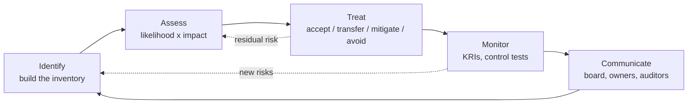

# Risk Management and Privacy

Every serious conversation with a CISO eventually turns into a risk conversation. Budgets are finite, threats are infinite, and the only honest way to decide what to fund, what to postpone, and what to live with is to translate each problem into the language of likelihood and impact. Firewalls, patch cycles, awareness training, and incident-response retainers are not ends in themselves — they are controls whose entire reason for existing is to move specific risks to a level the business is willing to tolerate. A security program without a risk register is not a security program; it is a shopping list.

Privacy is the twin of security, not a subset of it. Security asks "who is allowed to touch this data and how do we stop everyone else?" Privacy asks a larger question: "should we be collecting this data at all, for what purpose, for how long, and what rights does the person it describes have over it?" You can have strong security without privacy — a perfectly encrypted database of information you were never entitled to collect — and you can have privacy commitments that are hollow without security. A mature organisation treats them as parallel disciplines: same vocabulary, overlapping controls, different accountabilities. This lesson covers the practical mechanics of both.

## Core terminology

Before the lifecycle makes sense, the words have to be precise. Casual conversation uses "threat", "risk", and "vulnerability" interchangeably; a risk register cannot. The shared definitions below come from ISO 27005 / NIST SP 800-30 and are used across the rest of the document.

| Term | Definition | Concrete example |
|---|---|---|
| **Asset** | Anything of value to the organisation — data, system, person, reputation | Customer database on `sql01.example.local` |
| **Threat** | A potential cause of an unwanted event | Ransomware operator, disgruntled admin, flood |
| **Vulnerability** | A weakness that a threat can exploit | Unpatched CVE, weak password policy, no UPS |
| **Risk** | The effect of uncertainty on objectives; likelihood × impact | "Ransomware encrypts `sql01` → 48 h outage → $120k" |
| **Impact** | The business consequence if the risk materialises | Financial loss, regulatory fine, reputational damage |
| **Likelihood** | The probability of the event occurring in a given timeframe | 1-in-5 per year, "possible", ARO of 0.2 |
| **Inherent risk** | Risk level **before** any controls are applied | What it would look like if we did nothing |
| **Residual risk** | Risk level **after** existing controls are applied | What is left after MFA, EDR, backups |

The rule of thumb: **risk = threat × vulnerability × impact**. Remove any factor and the risk collapses. A threat with nothing to exploit is noise; a vulnerability no one is interested in is a curiosity; an event with no impact is a non-event. Controls attack one or more of those three factors.

## The risk management lifecycle

Risk management is not an annual event; it is a continuous cycle. The steps below align with **NIST RMF** (SP 800-37), **ISO 31000**, and **ISO 27005** — the naming varies slightly between frameworks, but the motion is the same.



- **Identify** — what could go wrong and to which asset.
- **Assess** — how bad and how often, qualitatively or quantitatively.
- **Treat** — choose one of the four responses (covered below).
- **Monitor** — watch whether the treatment is still working; control effectiveness, KRIs, incident data.
- **Communicate** — risks that are not reported up are effectively accepted silently. Quarterly to the risk committee, annually to the board, on-demand to auditors.

The loop never closes. A new product launch, a new regulation, an acquisition, or a vendor change all feed fresh entries back into **Identify**.

## Risk identification

You cannot treat risks you have not written down. Risk identification is the deliberate exercise of harvesting risks from every plausible source and landing them in one place — the risk register. The five most productive inputs are:

1. **Structured workshops.** Two hours with the business owner, the system owner, and a security facilitator. Walk the process end-to-end and ask "what could go wrong here?" at every step. Most risks are surfaced this way; the people who run the system know its soft spots.
2. **Asset inventory feeds.** Your CMDB, IAM system, cloud-account inventory, and data-classification tooling all produce lists of things that have value. Every item in those lists is a candidate asset; every asset attracts its own set of threats.
3. **Prior incidents and near-misses.** Last year's tickets are a gold mine. Any incident worth writing a post-mortem for is almost certainly worth a matching risk-register entry, so the same thing is not "surprising" a second time.
4. **Threat intelligence.** Industry-sector reports (FS-ISAC, H-ISAC), vendor advisories, CISA alerts, and the MITRE ATT&CK heat-map for your sector tell you which techniques are actually being used against organisations like yours right now.
5. **Audit findings.** Internal audit, external audit, ISO certification audits, penetration tests, red-team exercises — anything marked "finding" or "observation" is a pre-packaged risk identification.

A good first-pass register for a mid-size company typically lands between 80 and 200 entries. Fewer than that and you are missing things; many more and you are listing controls or observations instead of risks.

### Categorising risks at intake

To keep the register navigable, every entry gets one primary category. The categories are arbitrary — what matters is that they are small in number and used consistently. A workable starter set:

- **Technology** — systems, infrastructure, software, network, cloud configuration.
- **People** — insider threat, key-person dependency, skills gap, social engineering.
- **Process** — change management, separation of duties, manual error, missing procedure.
- **Third-party** — vendor risk, supply chain, sub-processor, contractual exposure.
- **Legal / Regulatory** — non-compliance with a law or contract, evolving regulation.
- **Strategic** — failed product launch, market shift, mis-aligned investment.
- **Reputational** — public-facing incident, social-media event, customer-trust event.

A risk that touches two categories goes under the dominant one and is cross-referenced — duplicate rows for the same risk pollute the register.

## Risk assessment: qualitative vs quantitative

Once a risk exists on paper, you need to size it. There are two families of techniques; mature programs use both.

### Qualitative — the 5×5 heat map

Qualitative assessment uses ordinal scales (Very Low → Very High) for likelihood and impact, and plots each risk on a matrix. It is fast, requires no dollar figures, and is understandable at a glance to a non-technical audience. The matrix below is the classic 5×5 heat map.

| Likelihood \ Impact | 1 Insignificant | 2 Minor | 3 Moderate | 4 Major | 5 Severe |
|---|---|---|---|---|---|
| **5 Almost certain** | Medium | High | High | Critical | Critical |
| **4 Likely** | Medium | Medium | High | High | Critical |
| **3 Possible** | Low | Medium | Medium | High | High |
| **2 Unlikely** | Low | Low | Medium | Medium | High |
| **1 Rare** | Low | Low | Low | Medium | Medium |

Risk levels map to response timelines: **Critical** demands executive attention and action within 30 days; **High** within 90 days; **Medium** tracked and treated during the normal planning cycle; **Low** accepted and reviewed annually.

Qualitative is the right tool when: the program is young, historical data is sparse, the audience is non-financial, or the volume of risks (hundreds) makes numeric estimation impractical.

### Quantitative — putting a number on it

Quantitative assessment expresses risk in money. Three formulas do almost all the work:

- **SLE (Single Loss Expectancy)** = Asset Value × Exposure Factor
    - How much a single occurrence of the event would cost.
    - *Exposure Factor* is the percentage of the asset lost in one event (0.0 – 1.0).
- **ARO (Annualised Rate of Occurrence)** = expected number of occurrences per year
    - 0.1 = once in 10 years; 4 = four times a year.
- **ALE (Annualised Loss Expectancy)** = SLE × ARO
    - The budgetable, annualised cost of the risk.

**Worked example — web server.** A revenue-bearing web server at `www.example.local` is valued at $50,000 (replacement plus lost revenue during outage). A typical incident — a ransomware hit, a prolonged DDoS, a disk failure that slips through backups — takes out roughly 40 % of that value before recovery, so the exposure factor is 0.4. The security team, looking at last three years of data, estimates two such incidents per year (ARO = 2).

```
SLE = AV × EF = $50,000 × 0.4 = $20,000
ALE = SLE × ARO = $20,000 × 2 = $40,000
```

$40,000 per year is the annualised cost of **doing nothing** about this risk. It is also the ceiling on rational spend for controls that would eliminate it — if a $60k/year WAF + DDoS service closes out this risk, it is not worth the money; if a $15k/year one does, it is.

Quantitative is the right tool when: there is enough historical data to estimate ARO honestly, the audience is financial (CFO, board finance committee), or the decision is a clear cost-benefit trade-off ("do we buy the $X control?").

### When to use which

Use **qualitative** for breadth — covering the entire register quickly so nothing is missed. Use **quantitative** for depth — for the top-20 risks that drive budget decisions, for insurance-renewal conversations, and for anything the CFO has to sign off on. The register below carries both: a qualitative score everyone can read, and an ALE column populated for the risks where the numbers are defensible.

## Risk treatment — the four choices

Every risk, once assessed, gets exactly one treatment decision. There are only four options; everything else is a variation on them.

1. **Accept.** Acknowledge the risk, document the decision, and do nothing further. Appropriate when the cost of any treatment exceeds the expected loss. Requires a named accepter (usually the business owner at the appropriate seniority level) and an expiry date — accepted risks are re-reviewed, not accepted forever.
    - *Example:* example.local accepts the risk that customers occasionally re-use weak passwords. Cost of enforcing a full FIDO2 roll-out to 10,000 customers outweighs the current fraud rate.
2. **Transfer.** Shift the financial consequences to a third party. The two common mechanisms are **insurance** (cyber insurance policy pays out on a covered incident) and **contract** (a clause making the vendor liable for breaches of data they process for you). Transfer does not remove the operational disruption or the reputational damage — those stay with you.
    - *Example:* example.local buys a $5M cyber-insurance policy covering ransomware response, legal costs, and regulatory fines, with a $100k deductible.
3. **Mitigate.** Apply a control that reduces either the likelihood, the impact, or both. This is where most of the security budget goes — MFA, EDR, backups, network segmentation, awareness training. Mitigation rarely drives residual risk to zero; it drives it down to a level that is accepted.
    - *Example:* example.local deploys EDR on all 200 laptops and enforces MFA on VPN and email, dropping the ransomware ALE from $180k to $35k.
4. **Avoid.** Stop doing the activity that creates the risk. This is the nuclear option: the risk goes to zero because the process goes to zero. Used when no control is cheap enough to bring the risk into tolerance.
    - *Example:* example.local decides not to build an in-house payment-processing platform. Instead, payments are routed to a PCI-certified third party. The entire category of card-data breach risk disappears — at the cost of the feature.

The treatment decision is recorded on the register next to the residual-risk score. If a control is added, the residual cell goes down; if nothing is added, residual = inherent and the decision column must read "Accept".

## The risk register

The risk register is the operational output of everything above. It is a living document — a spreadsheet, a GRC-tool table, a ServiceNow module — that lists every identified risk with enough information to act on it. A usable register has the following columns:

| Column | Purpose |
|---|---|
| **ID** | Stable key (e.g. `R-2026-014`) |
| **Description** | One sentence — "If X happens, Y results" |
| **Category** | People / Process / Technology / Third-party / Legal |
| **Owner** | Named person accountable, not a team |
| **Inherent L** | Likelihood before controls (1–5) |
| **Inherent I** | Impact before controls (1–5) |
| **Inherent score** | L × I |
| **Controls in place** | What currently mitigates this risk |
| **Residual L** | Likelihood after controls |
| **Residual I** | Impact after controls |
| **Residual score** | L × I — what is actually carried |
| **Treatment** | Accept / Transfer / Mitigate / Avoid |
| **Target date** | When the treatment is expected to complete |
| **Review date** | When we look at this entry again |

### Tiny example — three rows from the example.local register

| ID | Description | Category | Owner | Inh L | Inh I | Inh | Controls | Res L | Res I | Res | Treatment | Review |
|---|---|---|---|---|---|---|---|---|---|---|---|---|
| R-2026-001 | Ransomware encrypts production file shares | Technology | Head of IT | 4 | 5 | 20 | EDR, immutable backups, MFA on admin | 2 | 4 | 8 | Mitigate | 2026-10-01 |
| R-2026-002 | Loss of a supplier hosting our payroll portal | Third-party | CFO | 2 | 5 | 10 | Contracted RTO 4h, exit clause, alt. vendor vetted | 2 | 3 | 6 | Transfer | 2026-07-15 |
| R-2026-003 | Internal admin exfiltrates customer PII | People | CISO | 3 | 5 | 15 | Least privilege, quarterly access review, DLP, UEBA | 2 | 4 | 8 | Mitigate | 2026-09-01 |

Numbers matter less than discipline. A register with honest numbers and regular reviews beats a register with elegant maths that no one has opened in 18 months.

### Tooling for the register

- **Spreadsheet** (Excel, Google Sheets) — entirely sufficient for organisations under ~150 risks. Use data-validation lists for L, I, Treatment so scores are comparable across rows.
- **GRC platforms** (ServiceNow IRM, Archer, OneTrust, LogicGate) — required at scale: workflow on review-date overdue, evidence attachment, control-to-risk mapping, board-report generation.
- **Issue tracker** (Jira, Linear) — a popular hybrid: each risk is an issue with a custom field set, the register is a saved filter, and treatment work is naturally linked as child issues.
- **Wiki** — last resort. Wikis lose structure; a 200-risk register on a wiki cannot be sorted by residual score.

Whatever the tool, the register must be **single-source**. Two registers — "the spreadsheet IT keeps" and "the document audit shows the regulator" — guarantee divergence and embarrassment.

## Privacy fundamentals

The security disciplines above protect *any* data you hold. Privacy narrows the focus to data **about people**. The moment personal data enters your systems, a separate body of obligation begins — regulatory, ethical, and contractual.

### Data types

- **PII (Personally Identifiable Information)** — any information that can, alone or in combination, identify an individual. Name, email, national ID, IP address, device identifier, precise geolocation.
- **Sensitive PII (special categories under GDPR)** — a higher-risk subset: racial or ethnic origin, political opinions, religious beliefs, union membership, genetic/biometric data, health data, sex life, sexual orientation. Requires explicit consent or another narrow lawful basis.
- **PHI (Protected Health Information)** — US-specific term from HIPAA; health data combined with any of 18 identifiers. Governs what hospitals, insurers, and their business associates may do.
- **PCI data (Payment Card Industry)** — primary account number (PAN), cardholder name, service code, expiration, and the sensitive authentication data (CVV, PIN, full magnetic stripe). Governed by PCI-DSS, not a law but a contract binding on anyone that touches card data.

### GDPR's core principles (Article 5)

GDPR lists seven principles governing **any** processing of personal data of people in the EU/EEA, regardless of where the processor is located.

1. **Lawfulness, fairness and transparency** — every processing has a documented lawful basis (consent, contract, legal obligation, vital interest, public task, or legitimate interest) and the person knows it is happening.
2. **Purpose limitation** — data collected for one purpose is not repurposed for an unrelated one.
3. **Data minimisation** — collect only what is necessary for the stated purpose. No "might be useful later" fields.
4. **Accuracy** — data is correct and kept up to date; inaccurate data is rectified or deleted.
5. **Storage limitation** — retained no longer than needed. Document the retention period per dataset.
6. **Integrity and confidentiality** — appropriate technical and organisational security; this is where GDPR and infosec explicitly meet.
7. **Accountability** — the controller can demonstrate compliance with all the above. "We do it" is not enough; "we do it and here is the evidence" is.

### Data subject rights

GDPR gives the individual (the **data subject**) enforceable rights against the controller. The ones you must be able to honour within one month of request:

- **Access** — a copy of the personal data held plus information about how it is used.
- **Rectification** — correction of inaccurate data.
- **Erasure** ("right to be forgotten") — deletion when the data is no longer needed, consent is withdrawn, or processing was unlawful. Not absolute — public-interest and legal-obligation exceptions exist.
- **Restriction of processing** — the data stays but is frozen pending a dispute.
- **Portability** — a machine-readable export for the subject to move to another controller.
- **Objection** — the right to stop processing based on legitimate interest, direct marketing, or profiling.
- **Rights related to automated decision-making** — no purely automated decision with legal/significant effect without consent, contract, or legal basis, plus human-review safeguards.

A **Data Subject Request (DSR) intake process** — a named channel, a ticket-tracking queue, a legal-review step, and an SLA clock — is the operational consequence of these rights. Without it, rights are theoretical and fines are real.

### Roles around the data

GDPR distinguishes two principal roles that are easy to confuse but legally distinct:

- **Data Controller** — the entity that decides **why** and **how** personal data is processed. The controller is the primary accountable party in front of the regulator.
- **Data Processor** — the entity that processes data **on behalf of** the controller, under documented instructions. A SaaS vendor handling your customer database is a processor; you remain the controller.
- **Data Protection Officer (DPO)** — required under GDPR for public bodies and for organisations whose core activity is large-scale special-category processing or large-scale systematic monitoring. The DPO is independent, advises on GDPR compliance, and is the contact point for the supervisory authority.
- **Data Owner** — internal accountability role; the business person who decides what the data is for and who can access it.
- **Data Custodian / Steward** — operational role; day-to-day handling, quality and access provisioning per the owner's policies.

Every controller-processor relationship requires a **Data Processing Agreement (DPA)** under Article 28 — clauses on instructions, sub-processors, security measures, breach notification, audit rights and end-of-contract data return/deletion.

## Privacy impact assessments (DPIA / PIA)

A **DPIA** (Data Protection Impact Assessment, GDPR term) or **PIA** (Privacy Impact Assessment, broader / US term) is a structured exercise performed **before** a new processing activity starts, to surface privacy risks and drive them down to an acceptable level. Under GDPR Article 35, a DPIA is **mandatory** when the processing is likely to result in a high risk to rights and freedoms, including:

- Systematic and extensive profiling with legal or significant effects.
- Large-scale processing of special-category data (health, biometric, criminal records).
- Systematic monitoring of a publicly accessible area (CCTV, ANPR).
- New technologies whose privacy implications are not yet understood.

### Mini DPIA — new HR portal at example.local

example.local is launching an internal HR self-service portal at `hr.example.local`. It will hold employee profile data, salary information, performance reviews, health-related absence records, and dependants' names for benefits enrolment. A DPIA is triggered (large-scale special-category data — health absence records — about identifiable individuals).

Questions the DPIA must answer:

| Area | Finding |
|---|---|
| **Purpose** | Employee self-service for HR; salary admin; absence management. Documented per processing activity. |
| **Lawful basis** | Contract (employment) for most fields; legal obligation for tax records; explicit consent for voluntary health declarations. |
| **Data minimised?** | Dependants' national IDs removed — date of birth is enough for benefit eligibility. |
| **Retention** | Active employees: duration of employment + 7 years (tax law). Applicants: 12 months. |
| **Access controls** | Role-based: employee self only; manager one-up chain; HR team full; IT admin break-glass audited. |
| **Transfers** | Data stays in the EU. Payroll vendor is EU-based, DPA signed. |
| **Data subject rights** | Portal has "Download my data" and "Request correction" buttons wired to the DSR queue. |
| **Residual risk** | Medium → acceptable after controls; reassess at 12 months. |

Sign-off: **DPO** (required), **Head of HR** as business owner, **CISO** as security owner, **Legal** for compliance, **CFO** as ultimate data accountable. The DPIA is filed, and the portal's go-live is contingent on the sign-offs.

## Privacy-by-design

Ann Cavoukian's seven principles of Privacy by Design predate GDPR but are explicitly referenced by it (Article 25: "data protection by design and by default"). One sentence each:

1. **Proactive not reactive; preventative not remedial** — anticipate privacy risks before they materialise, rather than cleaning up after a breach.
2. **Privacy as the default setting** — the out-of-the-box configuration must protect privacy; the user should not have to opt out of sharing.
3. **Privacy embedded into design** — privacy is a core architectural requirement, not a feature bolted on at the end.
4. **Full functionality — positive-sum, not zero-sum** — reject the false trade-off; well-designed systems deliver both privacy and the business function.
5. **End-to-end security — full lifecycle protection** — the data is protected from the moment it is collected until the moment it is irreversibly destroyed.
6. **Visibility and transparency** — all stakeholders can verify that the claims match the practice; independent audit-ability is built in.
7. **Respect for user privacy — keep it user-centric** — strong defaults, clear notices, and effective user controls make the individual the focus, not an afterthought.

## Breach notification timelines

When a breach happens, different regimes impose different clocks. Knowing them **before** the breach is the point — the incident-response playbook should name the responsible person, the regulator contacts, and the per-regime deadline.

| Regime | Who must be notified | Deadline | Trigger |
|---|---|---|---|
| **GDPR (EU/EEA)** | Supervisory authority | **72 hours** from awareness | Personal-data breach likely to risk rights and freedoms |
| **GDPR (EU/EEA)** | Data subjects | "Without undue delay" | Breach likely to result in **high** risk to rights and freedoms |
| **HIPAA (US health)** | Individuals | **60 days** from discovery | Breach of unsecured PHI |
| **HIPAA (US health)** | HHS | 60 days (≥500 affected) or annually (&lt;500) | As above |
| **US state laws (e.g. California CCPA/CPRA)** | Individuals + AG if ≥500 CA residents | "Most expedient time possible, without unreasonable delay" | Unencrypted personal-information breach; definitions vary state-by-state |
| **PCI-DSS (card data)** | Card brands, acquiring bank | Immediately | Suspected or confirmed card-data compromise |
| **NIS2 (EU, critical sectors)** | National CSIRT / competent authority | **24 h** early warning, **72 h** notification, **1 month** full report | Significant incident affecting service |
| **SEC (US public companies)** | SEC (Form 8-K) | **4 business days** | Material cybersecurity incident |

When multiple regimes apply, follow the strictest clock. Late notification is itself a violation in most regimes, and it is usually the part that draws the biggest fine — the breach may be forgiven; the cover-up never is.

### What the notification must say

GDPR Article 33-34 sets the minimum content of a notification — and most other regimes overlap heavily:

- **Nature of the breach** — categories and approximate number of data subjects and records involved.
- **DPO contact details** — or another contact point for follow-up.
- **Likely consequences** — what could happen to the affected individuals.
- **Measures taken or proposed** — containment, eradication, mitigation of adverse effects.

When notifying individuals (the "high risk" tier), the language must be plain and specific. A vague "we experienced an incident affecting some user data" is non-compliant; the user must understand what data of *theirs* was involved and what they should do.

## Hands-on

### Exercise 1 — Fill out a 5-row risk register

You are the first security hire at `shop.example.local`, a 15-person e-commerce startup. Build a 5-row risk register covering the risks below. Use a 1–5 scale for L and I, pick controls, score residual, and choose a treatment.

Risks to cover:

1. Credit-card data theft from the checkout flow.
2. Single developer (no backup) holding all AWS root credentials.
3. Customer-support laptop stolen from a café with saved session cookies.
4. DDoS attack on launch day taking the shop offline.
5. GDPR DSR request backlog — no intake process exists.

For each row, write: ID, description (one sentence), owner role, inherent L/I, existing or proposed controls, residual L/I, treatment, target date. Aim for five rows under 20 minutes.

### Exercise 2 — Calculate ALE for three scenarios

Compute SLE, ARO and ALE for each scenario. Show working.

1. A customer database worth $200,000. A realistic breach exposes 30 % of its value. Historically, peer companies suffer one such breach every 8 years.
2. A 1 TB file server valued at $15,000. A ransomware incident destroys 100 % of its live data, but backups recover 95 %. Adjusted EF = 0.05. The industry ARO is 0.25.
3. A marketing-automation platform valued at $80,000. A misconfigured bucket leaks 10 % of contact records (EF = 0.1). The team pushes three such misconfigs a year (ARO = 3).

Then rank the three by ALE and argue which you would fund mitigation for first.

### Exercise 3 — Classify a sample dataset by sensitivity

For each dataset, mark it **Public / Private / Confidential / Restricted**, identify whether it is PII / sensitive PII / PHI / PCI, and state the minimum controls you would require at rest.

| Dataset | Classification? | Regulatory tag? | Minimum controls? |
|---|---|---|---|
| **HR record** — full name, national ID, salary, bank IBAN, sickness absences | ? | ? | ? |
| **Marketing email list** — first name, email, consent timestamp, open-rate statistics | ? | ? | ? |
| **CCTV footage** — 30 days of unattended building-entry video, includes licence plates and faces | ? | ? | ? |

### Exercise 4 — Draft the breach-notification email

A misconfigured storage bucket has exposed 10,000 customer records from `shop.example.local`: name, email, hashed password (bcrypt), and order history. No payment-card data was exposed. The bucket was open for 11 days before closure.

Draft the notification email to affected customers. Constraints: plain language, under 200 words, covers what happened, what data was affected, what you have done, what they should do, and where to get help. Resist the temptation to use "sophisticated cyberattack" language — it was a misconfiguration; say so.

## Worked example — example.local annual risk review

example.local is a 200-person software company running an ISO 27001-aligned program with NIST CSF as its control framework. Its risk cycle runs on an annual clock with quarterly check-ins:

- **Q1 — Register refresh.** The GRC team runs four workshops (Engineering, Sales/CS, Finance/HR, Executive). Each produces a delta to the register: new risks from product launches, retired risks from decommissioned systems, and re-scored risks from changed control effectiveness. Typical output: ~30 new entries, ~15 retirements, ~50 re-scores against a 180-entry register.
- **Q2 — Control testing.** Internal audit samples the top-40 risks. For each, the listed control is tested: evidence reviewed, configuration verified, a walk-through performed. Control failures feed back into residual-risk re-scoring.
- **Q3 — Quantitative deep-dive.** The top-20 risks by residual score are re-analysed quantitatively. ALE is computed or refreshed. The output is a funding proposal: which mitigations are cost-justified for next year's budget.
- **Q4 — Board report.** A six-page report covers: risk heat-map (current vs last year), top-10 risks with treatment status, the quantitative proposals from Q3, regulatory-horizon updates (new laws coming), and a KRI dashboard (incident count, MTTR, patching SLA, phishing click rate).

The cycle is explicitly tied to **ISO 27001 Annex A** (each Annex A control is mapped to one or more register rows, so control failures surface as risk-score moves) and to **NIST CSF** categories (Identify / Protect / Detect / Respond / Recover) for communication with US-based customers and partners. Privacy rides along: the DPO owns the privacy-risk subset of the register, and DPIA outputs land as register rows under category "Privacy".

The operational rhythm — quarterly workshops, annual refresh, board-level report — is more important than the exact framework. Organisations that do the cycle on a mediocre framework consistently beat those that pick a better framework and then do the cycle once.

## Common mistakes

- **Confusing risk with vulnerability.** "Unpatched CVE-2025-1234 on `sql01`" is a vulnerability, not a risk. The risk is what bad outcome the exploitation of that vulnerability leads to. Registers full of vulnerabilities masquerading as risks produce treatment plans that are really just patch lists.
- **The "set and forget" register.** Building the register is the easy part. A register that has not moved in 12 months is a work of fiction. Dates, owners, and residual scores should be revisited on a defined cadence — monthly for Critical, quarterly for High, annually for the rest.
- **Treating privacy as legal's problem only.** Privacy obligations land on technology and operations, not just on the legal clause library. A privacy notice is fine; a DSR intake that actually works end-to-end is the test.
- **No DSR intake process.** A GDPR-regulated company that cannot demonstrate, today, how an access request would be received, routed, fulfilled within 30 days, and logged, is exposed. The regulator's first question after a complaint is "show me the process."
- **Skipping DPIAs for "small" changes.** A change is small to engineering and large to privacy when it introduces a new data element or purpose. The DPIA question — "is this likely to result in high risk?" — must be asked at design time, not after launch.
- **Accepting risks without a named accepter or an expiry date.** "Accepted" is a decision, not a shrug. If no one is named and no review date is set, the risk is not accepted — it is forgotten.

## Key takeaways

- Risk management is a cycle — Identify, Assess, Treat, Monitor, Communicate — that never ends; frameworks (NIST RMF, ISO 31000/27005) name the steps, but the loop is the point.
- Every risk has one of four treatments: **Accept, Transfer, Mitigate, Avoid**. Mitigation is not automatic; Accept is a legitimate decision when documented with an owner and a review date.
- Use **qualitative** scoring (5×5 heat map) for breadth and **quantitative** scoring (SLE / ARO / ALE) for the top risks and for cost-justified mitigation decisions.
- The risk register is the single source of truth. Its value comes from being current, owned, and reviewed — not from being elegant.
- Privacy is the twin of security, not a subset. Collect only what you need, document why, protect it, retain it only as long as needed, and honour data-subject rights within the regulatory clock.
- Run a **DPIA** before any new processing with high risk to individuals. File it, sign it off, and treat it as a gating decision for go-live.
- Breach clocks are not negotiable: **GDPR 72 h**, **HIPAA 60 days**, **NIS2 24 h early / 72 h notification**, **SEC 4 business days**. Know your clocks before you need them.
- A DSR intake process that works on a random Tuesday is worth more than an elegant privacy notice that no one links to the back-office.


## Reference images

These illustrations are from the original training deck and complement the lesson content above.

<div className="lesson-image-grid">
  <figure><figcaption>Slide 1</figcaption></figure>
  <figure><figcaption>Slide 16</figcaption></figure>
  <figure><figcaption>Slide 47</figcaption></figure>
</div>
## References

- **NIST SP 800-30 Rev. 1**, *Guide for Conducting Risk Assessments* — https://csrc.nist.gov/publications/detail/sp/800-30/rev-1/final
- **NIST SP 800-37 Rev. 2**, *Risk Management Framework for Information Systems and Organizations* — https://csrc.nist.gov/publications/detail/sp/800-37/rev-2/final
- **NIST SP 800-39**, *Managing Information Security Risk* — https://csrc.nist.gov/publications/detail/sp/800-39/final
- **ISO 31000:2018**, *Risk management — Guidelines* — https://www.iso.org/standard/65694.html
- **ISO/IEC 27005:2022**, *Information security risk management* — https://www.iso.org/standard/80585.html
- **GDPR — full text** — https://gdpr-info.eu/
- **NIST Privacy Framework 1.0** — https://www.nist.gov/privacy-framework
- **ENISA — Handbook on Security of Personal Data Processing** — https://www.enisa.europa.eu/publications/handbook-on-security-of-personal-data-processing
- **Ann Cavoukian — Privacy by Design: The 7 Foundational Principles** — https://privacy.ucsc.edu/resources/privacy-by-design---foundational-principles.pdf
- **FAIR (Factor Analysis of Information Risk)** — https://www.fairinstitute.org/
