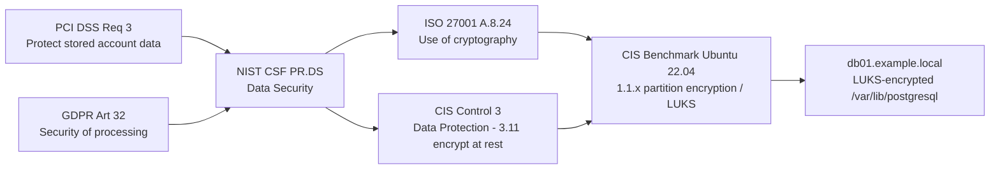

# Security Controls and Frameworks

## Why this matters

A security program is a set of decisions about which **controls** to put between an attacker and a business outcome. The decisions are driven by risk, but they are constrained by something just as important — the regulations, contracts, and frameworks the organisation is bound by. A bank that ignores PCI DSS does not get to process cards. A SaaS provider that cannot produce a SOC 2 report cannot sell into the US enterprise. A controller that mishandles EU personal data ends up in front of a supervisory authority. Controls are how every one of those promises is kept, day to day.

The vocabulary around controls is precise on purpose. **Categories** describe who or what enforces a control (managerial, operational, technical). **Types** describe when and how it acts (preventative, detective, corrective, deterrent, compensating, physical). **Regulations** are mandatory rules issued by governments. **Standards** are consensus specifications. **Frameworks** are structured catalogues of controls and processes that organisations adopt to meet both. Confusing any of these terms turns a control conversation into a definitional argument and slows everything down.

This lesson is the map. It walks through the categories and types, the regulations that drive most enterprise security programs (GDPR and PCI DSS), the frameworks that organise the response (NIST CSF/RMF, ISO 27000-series, CIS Controls, SOC 2, CSA CCM), and the benchmarks that translate framework language into platform-specific configuration. The goal is fluency: by the end you should be able to look at any control on any register and place it precisely on this map.

## Core concepts

### Control categories — managerial, operational, technical

Categories describe **what kind of mechanism** enforces the control. The categories overlap; a single control often sits in two of them. The point is to make sure a program is not exclusively one flavour — a stack of technical controls with no policy behind it is brittle, and a stack of policies with no technical enforcement is theatre.

| Category | What enforces it | Concrete examples |
|---|---|---|
| **Managerial** | Risk-management decisions, governance structures, oversight | Risk register, security policy, annual risk assessment, vendor risk programme, ISMS scope statement |
| **Operational** | People — what humans do as part of a documented process | Change-approval meetings, joiner/mover/leaver procedure, security-awareness training, incident-response runbook, manual log review |
| **Technical** | Hardware, software, firmware — automated enforcement | Firewall rule, MFA enforcement, EDR agent, full-disk encryption, IDS/IPS signature, biometric reader |

A working program uses all three. Multi-factor authentication is technical — but the policy that says *which* systems require it is managerial, and the joiner process that issues the token is operational. Categories are not a taxonomy; they are a checklist that helps you notice when one leg of the stool is missing.

### Control types — preventative, detective, corrective, deterrent, compensating, physical

Types describe **when in the timeline of an event** a control acts. Like categories, they overlap — a door lock is both a physical control and a preventative one. The value of the type vocabulary is that it forces you to ask "do I have something that *prevents* this, something that *detects* it, and something that *recovers* from it?" If the answer to any of those is "no", you have a gap.

- **Preventative** — acts **before** the event to stop it from happening. Firewall rules block a connection. A mantrap stops tailgating. Pre-merge code review stops a vulnerable change. MFA stops a stolen password from working alone.
- **Detective** — acts **during** the event to alert that something is happening. An IDS fires on an exploit attempt. A SIEM correlates and pages on-call. A motion sensor trips an alarm. A file-integrity monitor notices a binary changed.
- **Corrective** — acts **after** the event to limit damage and restore service. Backups restore encrypted data. Load balancers shed traffic from a degraded node. An incident-response playbook contains, eradicates, and recovers. A patch closes the vulnerability that was exploited.
- **Deterrent** — discourages the attacker by raising their cost or reducing their expected payoff. Visible CCTV signs. Banners warning of legal consequences for unauthorised access. Salts on password hashes that defeat pre-built rainbow tables. Public prosecutions of prior attackers.
- **Compensating** — used when the primary control is impractical and an alternative achieves a comparable outcome. PCI DSS allows compensating controls when a requirement cannot be met as written, provided the alternative addresses the same risk with equal rigour. A fire-suppression system does not prevent fires but limits damage when one occurs.
- **Physical** — prevents physical interaction with a system. Door locks, cages, bollards, biometric readers, Kensington locks, plastic covers over critical buttons, the big red emergency-stop button.

**Where types stack — a worked scenario.** Consider the risk "an attacker steals customer data from `db01.example.local`". A defensible posture stacks types:

- *Preventative* — network segmentation puts `db01.example.local` in a tier reachable only from app servers; MFA is required for any admin connection; least-privilege roles limit what a compromised account can read.
- *Detective* — database auditing logs every `SELECT` against the `customers` table; the SIEM alerts on bulk reads outside business hours; UEBA flags an admin account that suddenly downloads 1 GB.
- *Corrective* — encrypted, immutable, off-site backups allow rebuild; a rehearsed incident-response runbook contains the host within an hour; rotated database credentials revoke the attacker's session.
- *Deterrent* — a login banner warns that all sessions are recorded; the organisation publicly prosecuted an insider in the prior year.
- *Compensating* — the database vendor does not support a required logging field, so a sidecar log shipper produces equivalent evidence and is documented as a compensating control.
- *Physical* — the data centre uses badge-and-biometric access, locked cabinets, and CCTV on the racks.

No single type is sufficient. Skipping detective controls means you find out from a customer that you were breached. Skipping corrective controls means an attacker who gets through is permanent.

### Regulations vs standards vs frameworks

The terms get used loosely, but they are different things and they bind you differently.

- **Laws** are made by legislatures. They define behaviour and penalties. Non-compliance is a legal risk. *Examples:* GDPR (EU), HIPAA (US), CCPA/CPRA (California).
- **Regulations** are issued by government agencies to implement laws. *Examples:* HHS HIPAA Security Rule, EU national data-protection authority guidance, US SEC cybersecurity disclosure rules.
- **Standards** are consensus specifications produced by a standards body or industry group. Adoption is sometimes voluntary, sometimes contractually required. *Examples:* ISO/IEC 27001, NIST SP 800-53, PCI DSS (private-sector contractual standard).
- **Frameworks** are structured catalogues that organise controls, processes, and outcomes so an organisation can plan and measure its program. *Examples:* NIST CSF, NIST RMF, CIS Controls, CSA Cloud Controls Matrix.
- **Benchmarks and hardening guides** translate framework or standard language into specific configuration settings for a platform. *Examples:* CIS Benchmark for Ubuntu 22.04, DISA STIG for Windows Server 2022, vendor hardening guide for Cisco IOS.

A regulator points at the law. The law points at "appropriate technical and organisational measures". The framework explains what "appropriate" looks like in practice. The benchmark tells you which checkbox to tick. Each layer makes the one above it operational.

### GDPR (General Data Protection Regulation)

GDPR is the EU's omnibus data-protection regulation. It applies to any organisation — wherever located — that processes personal data of people in the EU/EEA, either by offering goods/services or by monitoring behaviour.

**Scope and lawful bases.** Every processing activity must have one of six lawful bases: consent, contract, legal obligation, vital interest, public task, or legitimate interest. Special categories of data (health, biometric, racial/ethnic, political, religious, union, sex life, sexual orientation, genetic) require an additional explicit basis.

**Key obligations.**

- **Data Protection Officer (DPO)** — required for public bodies and for organisations whose core activity is large-scale special-category processing or large-scale systematic monitoring. The DPO is independent, reports to the highest management level, and is the contact point for the supervisory authority.
- **Records of Processing Activities (RoPA)** under Article 30 — a written inventory of every processing activity.
- **Data Protection Impact Assessment (DPIA)** under Article 35 for high-risk processing.
- **Data Subject Rights** — access, rectification, erasure, restriction, portability, objection, rights related to automated decision-making — fulfilled within one month.
- **Privacy by design and by default** under Article 25 — privacy as a baseline architectural requirement.
- **Breach notification** under Articles 33 and 34 — supervisory authority within 72 hours, data subjects without undue delay if high risk.
- **International transfers** — restricted to adequate jurisdictions or covered by safeguards: Standard Contractual Clauses (SCCs, also called Model Contract Clauses), Binding Corporate Rules (BCRs), or other Article 46 mechanisms.

**Fines structure.** Two tiers, whichever is higher in each case:

- **Lower tier** — up to **&euro;10 million** or **2 %** of global annual turnover. Applies to administrative breaches such as failing to maintain RoPA, missing DPIA, no DPO, weak technical/organisational measures.
- **Upper tier** — up to **&euro;20 million** or **4 %** of global annual turnover. Applies to violations of core principles, lawful basis, data subject rights, and unlawful international transfers.

Fines are not the only consequence — orders to stop processing can be commercially fatal in their own right.

### PCI DSS (Payment Card Industry Data Security Standard)

PCI DSS is a contractual standard issued by the PCI Security Standards Council on behalf of the major card brands. It binds anyone that stores, processes, or transmits cardholder data, plus any system component that can affect the security of those activities. It is **not a law** — but it is enforced by acquiring banks through merchant agreements, with fines up to $500,000 per incident, raised transaction fees for non-compliant merchants, and in extreme cases revocation of the right to process cards.

**Two data classes.**

- **Cardholder Data (CHD)** — primary account number (PAN), cardholder name, expiration date, service code. The PAN is the protected element; the others are protected when stored with the PAN.
- **Sensitive Authentication Data (SAD)** — full magnetic stripe / chip data, CAV2/CVC2/CVV2/CID, PINs and PIN blocks. Must never be stored after authorisation, even encrypted.

**The 12 requirements at a glance** (PCI DSS v4.0):

1. Install and maintain network security controls.
2. Apply secure configurations to all system components.
3. Protect stored account data (encryption, truncation, tokenisation).
4. Protect cardholder data with strong cryptography during transmission over open networks.
5. Protect all systems and networks from malicious software.
6. Develop and maintain secure systems and software.
7. Restrict access to system components and cardholder data by business need to know.
8. Identify users and authenticate access (MFA for non-console admin and for all remote access).
9. Restrict physical access to cardholder data.
10. Log and monitor all access to system components and cardholder data.
11. Test security of systems and networks regularly (vulnerability scans, penetration tests).
12. Support information security with organisational policies and programs.

**SAQ vs ROC.**

- **Self-Assessment Questionnaire (SAQ)** — for smaller merchants. Multiple SAQ types (A, A-EP, B, B-IP, C, C-VT, D-Merchant, D-Service Provider, P2PE) match how the merchant accepts cards. The merchant attests; no on-site assessor required.
- **Report on Compliance (ROC)** — required for Level 1 merchants (over 6 million card transactions a year) and Level 1 service providers. Conducted annually by a Qualified Security Assessor (QSA) and accompanied by an Attestation of Compliance (AOC).

### National, territorial, and state laws

GDPR is the most influential, but it is not alone. A multi-jurisdiction program tracks at minimum:

- **CCPA / CPRA (California)** — broad consumer rights for California residents: notice at collection, right to know, delete, correct, opt out of sale/sharing, and limit use of sensitive personal information. Enforcement by the California Privacy Protection Agency.
- **HIPAA (US)** — Health Insurance Portability and Accountability Act, with the Privacy Rule and Security Rule governing covered entities (health plans, providers, clearinghouses) and their business associates handling PHI.
- **GLBA (US)** — Gramm-Leach-Bliley Act, financial-services privacy and safeguards.
- **SOX (US)** — Sarbanes-Oxley financial-reporting controls, with implications for IT general controls (ITGCs) at public companies.
- **NIS2 (EU)** — security obligations and incident-reporting for essential and important entities in critical sectors.
- **DORA (EU)** — Digital Operational Resilience Act for the financial sector.
- **PIPEDA (Canada)**, **LGPD (Brazil)**, **PIPL (China)**, **POPIA (South Africa)**, **APPI (Japan)** — GDPR-style omnibus regimes in other jurisdictions.
- **State-level US privacy laws** — Virginia (VCDPA), Colorado (CPA), Connecticut (CTDPA), Utah (UCPA), Texas (TDPSA), and a growing list. Sector-specific laws cover education (FERPA), children's privacy (COPPA), and more.

Cross-border crime and computer-trespass laws — such as the US Computer Fraud and Abuse Act (CFAA) and the UK Computer Misuse Act — also apply when investigating or responding to incidents that cross national boundaries.

### NIST Cybersecurity Framework (CSF) and Risk Management Framework (RMF)

The US National Institute of Standards and Technology publishes two complementary frameworks that together cover most of what an enterprise needs.

**NIST CSF** is outcome-oriented and intentionally accessible. It organises cybersecurity activity into **five functions**, each broken into categories and subcategories:

- **Identify** — asset management, business environment, governance, risk assessment, risk management strategy, supply chain risk.
- **Protect** — access control, awareness and training, data security, information protection processes, maintenance, protective technology.
- **Detect** — anomalies and events, continuous monitoring, detection processes.
- **Respond** — response planning, communications, analysis, mitigation, improvements.
- **Recover** — recovery planning, improvements, communications.

CSF 2.0 (2024) added a sixth function: **Govern** — organisational context, risk management strategy, roles and responsibilities, policy, oversight, supply chain. Govern wraps the other five.

**NIST RMF** (SP 800-37) is the federal-system control selection and authorisation process. Its **seven steps**:

1. **Prepare** — establish context and priorities.
2. **Categorise** the system based on impact (low, moderate, high) per FIPS 199.
3. **Select** controls from SP 800-53 baselines, tailored to the system.
4. **Implement** the controls.
5. **Assess** whether the controls are operating as intended.
6. **Authorise** — a senior official accepts the residual risk and grants Authorisation to Operate (ATO).
7. **Monitor** continuously; re-authorise on significant change.

CSF tells you *what* to do at a strategic level. RMF tells you *how* to select, document, and authorise the specific controls, drawing from the SP 800-53 catalogue.

### ISO 27001 / 27002 / 27701 / 31000

The ISO/IEC 27000-series and ISO 31000 are the international consensus standards most widely referenced outside the US.

- **ISO/IEC 27001** — the certifiable standard for an Information Security Management System (ISMS). Defines the requirements for context, leadership, planning, support, operation, performance evaluation, and improvement. Annex A lists the controls; the 2022 revision reorganises Annex A into 93 controls across four themes (Organisational, People, Physical, Technological).
- **ISO/IEC 27002** — implementation guidance for the Annex A controls. Not certifiable on its own; it is the companion explaining each control in depth.
- **ISO/IEC 27701** — privacy extension to 27001/27002. Adds Privacy Information Management System (PIMS) requirements and maps to GDPR. Certifiable as an extension to an existing 27001 certificate.
- **ISO 31000** — generic risk-management guidelines applicable to any kind of risk, not only cybersecurity. Provides the principles, framework, and process used by ISO/IEC 27005 (information-security risk management) and many enterprise risk programs.

A typical enterprise stack: ISO 31000 for the overall risk philosophy, ISO 27001 for the ISMS structure and certification, ISO 27002 for control detail, ISO 27701 when the same program must demonstrate privacy maturity.

### CIS Controls v8

The Center for Internet Security publishes the **CIS Controls** — a prioritised, prescriptive list of cybersecurity safeguards. Version 8 (2021) reorganised the historical "Top 20" into **18 controls** with 153 safeguards, grouped into **Implementation Groups** sized to the maturity and resources of the adopting organisation.

The 18 controls:

1. Inventory and Control of Enterprise Assets.
2. Inventory and Control of Software Assets.
3. Data Protection.
4. Secure Configuration of Enterprise Assets and Software.
5. Account Management.
6. Access Control Management.
7. Continuous Vulnerability Management.
8. Audit Log Management.
9. Email and Web Browser Protections.
10. Malware Defenses.
11. Data Recovery.
12. Network Infrastructure Management.
13. Network Monitoring and Defense.
14. Security Awareness and Skills Training.
15. Service Provider Management.
16. Application Software Security.
17. Incident Response Management.
18. Penetration Testing.

**Implementation Groups (IG):**

- **IG1 (essential cyber hygiene)** — 56 safeguards. Baseline for small organisations with limited expertise; assumes commodity hardware and SaaS.
- **IG2** — 130 safeguards. Adds depth for organisations storing sensitive data and running multi-department IT.
- **IG3** — all 153 safeguards. Aimed at organisations with mature security teams and high-impact data; covers advanced techniques and adversary emulation.

CIS pairs the controls with **CIS Benchmarks** (configuration guides) and **CIS-CAT** (a scanner that reports a system's compliance score against a benchmark).

### SSAE SOC 2 — Type I vs Type II

The American Institute of Certified Public Accountants (AICPA) publishes the **Statement on Standards for Attestation Engagements (SSAE)** under which Service Organization Control (SOC) reports are produced. **SOC 2** is the most relevant to security teams; it reports on the controls at a service organisation against the **Trust Services Criteria (TSC)**.

**The five Trust Services Criteria:**

- **Security** (the only mandatory one — the "common criteria").
- **Availability**.
- **Processing Integrity**.
- **Confidentiality**.
- **Privacy**.

Customers commonly demand Security at minimum; SaaS providers serving healthcare or financial customers add Confidentiality and Availability; consumer-facing services may add Privacy.

**Type I vs Type II.**

- **SOC 2 Type I** — reports on the **design** of controls **at a point in time**. "Did the controls exist on date X?" Useful for early-stage providers showing they have built the right controls; rarely sufficient on its own for enterprise procurement.
- **SOC 2 Type II** — reports on the **operating effectiveness** of controls **over a period of time** (typically 6 to 12 months). The auditor samples evidence across the period. This is what enterprise customers ask for and what unlocks regulated-industry sales.

Two related reports: **SOC 1** focuses on financial-reporting controls relevant to a customer's audit; **SOC 3** is a public, marketing-friendly summary derived from a SOC 2.

### Cloud Security Alliance (CSA), CCM, and STAR

The **Cloud Security Alliance** is the main industry body for cloud-security guidance. Three CSA outputs sit at the centre of any cloud-security program.

- **Cloud Controls Matrix (CCM)** — a meta-framework of cloud-specific security controls organised across **17 domains** in v4 (the older v3 had 16 domains and 133 control objectives) covering everything from IAM to supply-chain transparency. Each control is mapped to leading standards — ISO/IEC 27001/27002/27017/27018, NIST SP 800-53, PCI DSS, ISACA COBIT, HIPAA, AICPA TSC — so a single CCM control can satisfy multiple regimes.
- **Consensus Assessments Initiative Questionnaire (CAIQ)** — a yes/no questionnaire derived from CCM that customers send to providers, and providers publish to streamline due diligence.
- **STAR (Security, Trust, Assurance and Risk) registry** — a public registry of providers that have published a CAIQ (Level 1 self-assessment) or undergone third-party attestation/certification (Level 2). Buyers consult STAR to short-circuit redundant assessments.

CSA also publishes the **Enterprise Architecture Reference Architecture** through its Enterprise Architecture Working Group — a methodology and tool set for security and enterprise architects to assess where internal IT and cloud providers stand and to plan a cloud-security roadmap. CSA credentials include the CCSK and the ISC2-jointly-issued CCSP.

### Benchmarks and secure configuration guides

A framework tells you "harden the operating system". A **benchmark** tells you "set `PermitRootLogin` to `no` in `/etc/ssh/sshd_config`". Three main sources cover most of the territory.

- **Vendors / manufacturers.** The original source. Microsoft publishes Security Compliance Toolkit baselines and product-specific guides (IIS, SharePoint, SQL Server). Cisco, Apache Software Foundation, and Oracle publish hardening documents for their products. Vendor guidance is authoritative for the product but rarely formatted for audit consumption.
- **Government.** The US Department of Defense publishes **DISA STIGs** (Security Technical Implementation Guides) for hundreds of products, with companion SCAP content for automated scanning. STIGs are rigorous and free; they read like military checklists, which is exactly what they are.
- **Independent organisations.** **CIS Benchmarks** are the de facto civilian standard — consensus-developed configuration guides for operating systems, cloud providers, databases, network devices, and applications. They come in two profile levels: **Level 1** (sensible defaults that should not break things) and **Level 2** (defence-in-depth, may sacrifice functionality). The **Cloud Security Alliance** publishes guidance for cloud-specific configurations.

**Coverage by domain.**

- *Web servers* — IIS, Apache, Nginx all have CIS Benchmarks; vendors publish their own guidance; STIGs cover IIS and Apache.
- *Operating systems* — Windows Server, Windows 10/11, RHEL, Ubuntu, Amazon Linux, macOS — CIS, vendor, and STIG.
- *Application servers* — email (Exchange), database (SQL Server, Oracle, PostgreSQL, MySQL), middleware (Tomcat, JBoss). CIS and STIG cover the standard ones; in-house custom servers must be hardened by the in-house team.
- *Network infrastructure* — Cisco IOS/IOS-XE/NX-OS, Juniper Junos, Palo Alto PAN-OS, F5, firewalls and switches. CIS and STIG cover most; the highest residual risk is in customer-specific rulesets that no vendor guide can mandate.

**Operational discipline.** Benchmarks only matter if a system is scanned against them on a recurring schedule and the drift is fixed. CIS-CAT, OpenSCAP, vendor compliance dashboards, and cloud Config-rule services all produce a numeric score against a benchmark; that score belongs on a dashboard the asset owner sees.

## Control mapping diagram

A control objective rarely lives at one layer. The most useful mental model is the chain from regulation down to a concrete configuration setting on a single host. The diagram below traces one example end to end: protecting cardholder data on a Linux database server.

The chain reads top-down: a regulation states an obligation; one or more frameworks translate the obligation into a control objective; benchmarks make the objective specific to a platform; and a single host carries the implemented setting that satisfies all of the above. When evidence is requested by a PCI QSA, an ISO 27001 auditor, or a SOC 2 examiner, it is the same evidence — a screenshot of `cryptsetup status`, the asset record showing LUKS enabled, the change ticket from the day it was rolled out. **One control, one piece of evidence, multiple regulations satisfied.** This is the entire reason for harmonised control sets.

## Hands-on

### Exercise 1 — Categorise 20 real controls

Take the list below and assign each control to (a) one or more **categories** (Managerial / Operational / Technical) and (b) one or more **types** (Preventative / Detective / Corrective / Deterrent / Compensating / Physical). Justify any control that lands in more than two boxes.

1. Annual security policy review by the CISO.
2. Quarterly user access review for the production VPN.
3. Full-disk encryption on all laptops via BitLocker/FileVault.
4. CCTV cameras at the data-centre entrance.
5. SIEM correlation rule for impossible travel.
6. Immutable nightly backups to S3 Object Lock.
7. Login banner warning of monitoring and prosecution.
8. Manual review of firewall rule-base every six months.
9. Mantrap with badge + biometric at the SCIF entry.
10. EDR agent with auto-isolation on confirmed malware.
11. Sidecar log shipper because the legacy app cannot emit syslog.
12. Annual phishing simulation with mandatory remedial training.
13. Change Advisory Board approval before production deploys.
14. Hot-site DR with automated failover via Route 53 health checks.
15. WAF blocking OWASP Top 10 patterns.
16. Vendor risk questionnaire and SOC 2 review during procurement.
17. Bollards in front of the lobby glass.
18. Tamper-evident seals on server cabinets.
19. Tokenisation of PAN at the payment gateway.
20. DLP rule blocking outbound email containing 16-digit numbers.

Aim to complete in 30 minutes. Compare with a colleague — disagreements are the point.

### Exercise 2 — Build a PCI-to-NIST-CSF mapping spreadsheet

Create a spreadsheet with columns: `PCI DSS Requirement`, `Sub-requirement`, `NIST CSF Function`, `NIST CSF Category`, `NIST CSF Subcategory`, `Owner`, `Evidence source`. Populate it for at least PCI DSS Requirements **1, 3, 8, 10, and 11**. For each row, identify the most specific CSF subcategory (e.g. PR.AC-1 for identity management, DE.CM-1 for network monitoring) and name a single owner. The output is the seed of a harmonised control set; a complete version typically runs 200–400 rows for a mid-size SaaS.

### Exercise 3 — Run a CIS-CAT scan and triage findings

Pick a sandbox host (a spare Ubuntu 22.04 VM is ideal). Download CIS-CAT Lite (free) or CIS-CAT Pro if licensed. Run the **CIS Ubuntu Linux 22.04 LTS Benchmark Level 1** scan. Open the resulting HTML report. Triage findings into three buckets:

- **Fix now** — high-impact, low-effort, no functionality risk.
- **Plan and fix** — requires a change window or testing.
- **Risk-accept with justification** — would break a documented business need.

Write a one-line justification for every Risk-accept entry. The triage skill is more important than the scan score — auditors expect to see findings; they expect to see disciplined responses to them.

### Exercise 4 — Draft a SOC 2 Trust Services scope statement

You are the security lead at a fintech preparing for its first SOC 2 Type II. Draft a scope statement under 250 words that states: which Trust Services Criteria are in scope (and why), which products and environments are covered, which subservice organisations are carved out, the audit period (e.g. April 1 to September 30), and the system boundary. Use `example.local` and its products as the subject. The statement should read cleanly to both an auditor and a procurement reviewer.

### Exercise 5 — Perform a GDPR Article 30 RoPA inventory for one business unit

Pick a business unit (HR is the classic worked example). Identify every processing activity it performs. For each activity, populate the Article 30 RoPA columns: name and contact of controller and DPO, purposes of processing, categories of data subjects, categories of personal data, categories of recipients, third-country transfers and safeguards, retention period, technical and organisational security measures. Aim for 8–12 activities for HR (recruiting, onboarding, payroll, benefits, performance, learning, absence, leavers, employee monitoring, occupational health, expense reimbursement, references). The exercise is unglamorous and unavoidable.

## Worked example — example.local builds a harmonised control set

`example.local` is a 250-person fintech that processes card payments in the EU and the US, serves enterprise SaaS customers in regulated industries, and holds personal data of European residents. Three obligations land on it simultaneously:

- **PCI DSS** because it processes cards.
- **SOC 2 Type II** because enterprise customers require it for procurement.
- **GDPR** because it processes personal data of EU residents.

A naive program would build three control sets, run three audit cycles, and produce three sets of evidence. The team instead chooses the **harmonised control set** path.

**Step 1 — Pick a backbone framework.** They adopt **NIST CSF 2.0** as the strategic backbone (it is well understood by US enterprise customers) and **ISO 27001:2022 Annex A** as the certifiable control catalogue (already required for some EU clients). The two are mapped to each other internally so a single control row carries both labels.

**Step 2 — Build a single control catalogue.** The GRC team produces a catalogue of about 180 controls, each row carrying: control ID, description, owner, NIST CSF subcategory, ISO 27001 Annex A reference, **PCI DSS requirement(s) satisfied**, **SOC 2 Trust Services Criteria reference(s) satisfied**, **GDPR article(s) addressed**, evidence source, test frequency. The mapping work takes two months and consumes two analysts; the spreadsheet is the most valuable artefact in the program.

**Step 3 — Standardise evidence.** Every control names a single evidence source — a Splunk dashboard, a CrowdStrike report, a Jira board, a Confluence page, an AWS Config rule. When PCI's QSA, SOC 2's CPA, and the ISO 27001 lead auditor each ask "show me access reviews for production", the answer is the same Confluence page generated from the same Okta export. **One piece of evidence, three audits.**

**Step 4 — Operate it on a single rhythm.** Internal audit tests 25 % of controls per quarter, so every control is tested once a year. Findings flow into the same risk register as risk-driven items. The board receives a single quarterly compliance and risk report, not three.

**Step 5 — Use the cloud baseline.** All workloads run on AWS, so the team adopts **CSA Cloud Controls Matrix** as a sanity check on cloud-specific gaps and runs **CIS Benchmarks** plus **CIS AWS Foundations Benchmark** as the baseline for every account. CIS-CAT scores per host and AWS Config compliance per account are the daily operational signal.

**Outcome.** PCI DSS ROC, SOC 2 Type II report, and ISO 27001 certificate are issued from the same evidence base in overlapping audit windows. The total annual external-audit cost is roughly half what three siloed programs would cost, and engineering time spent answering auditor questions falls by an estimated 60 %. The price is paid up front in the mapping work; the payoff lasts every year afterwards.

## Troubleshooting and pitfalls

- **Treating categories and types as a taxonomy.** They overlap on purpose. Arguing about whether a door lock is "really" preventative or "really" physical wastes time the program does not have.
- **Picking a framework before understanding the obligations.** A SOC 2 push for a company that is also PCI-regulated and GDPR-bound should not be three separate projects. Map the obligations first; pick the framework that covers the most ground; harmonise.
- **Confusing standards with regulations.** PCI DSS is contractual, not legal; ISO 27001 is voluntary; GDPR is law. The penalty mechanisms differ and so does the urgency.
- **Forgetting that GDPR applies extraterritorially.** A US-only company that markets to EU residents or monitors their behaviour is in scope. "We are not in the EU" is not a defence.
- **Storing Sensitive Authentication Data after authorisation.** Never store CVV, full track data, or PIN blocks. Period. This is the single fastest way to fail a PCI assessment.
- **Buying a benchmark and not scanning against it.** A printed CIS Benchmark in a SharePoint folder is not a control. Continuous scanning, drift detection, and remediation are.
- **Adopting Level 2 benchmarks without testing.** CIS Level 2 is "defence in depth, may break things". Roll it out in a lab first; production deployments without testing have caused outages and rollbacks that set the program back further than it would have without the benchmark.
- **One-time SOC 2 Type I and never advancing to Type II.** Type I is a starting point. Enterprise procurement asks for Type II within a year; staying on Type I signals immaturity.
- **Confusing SOC 1 and SOC 2.** SOC 1 is for financial-reporting controls. SOC 2 is for security, availability, processing integrity, confidentiality, privacy. Customers asking for "a SOC report" almost always mean SOC 2.
- **Undefined SOC 2 scope.** A SOC 2 covering the entire company is rarely cheaper or better than one covering the production environment of the product the customer cares about. Carve-outs are legitimate; vague scopes are expensive.
- **Compensating controls without documentation.** PCI's compensating-control process requires a written compensating control worksheet that a QSA accepts in advance. "We do something equivalent" without paperwork is a finding.
- **No DPIA where one is mandatory.** GDPR Article 35 says when a DPIA is required; skipping it because the project schedule is tight is a documented violation, not a calculated risk.
- **Ignoring the Govern function in NIST CSF 2.0.** CSF 2.0 added Govern for a reason: programs that excel at Protect/Detect/Respond but have weak governance produce contradictory decisions and uneven risk acceptance.
- **CIS Implementation Group inflation.** Small organisations claim IG3 in marketing materials and operate IG1 in reality. Auditors and customers can tell. Choose the IG you actually run; advance deliberately.
- **One register for risks, another for controls, another for evidence.** Three sources of truth means none. The register, the control catalogue, and the evidence index must reconcile — ideally in the same GRC tool.
- **Treating benchmark scores as the security posture.** A 92 % CIS-CAT score is meaningless if the missing 8 % includes the controls that mattered. Score per-control criticality, not just count.

## Key takeaways

- **Categories** (managerial / operational / technical) describe what enforces a control; **types** (preventative / detective / corrective / deterrent / compensating / physical) describe when and how it acts. Both matter; neither is a strict taxonomy.
- A defensible posture **stacks types**: prevention raises the cost, detection finds what slipped through, correction restores the business, deterrence shapes attacker behaviour, and physical controls protect the substrate.
- **Regulations** bind by law (GDPR, HIPAA, CCPA), **standards** bind by contract or by certification (PCI DSS, ISO 27001), and **frameworks** (NIST CSF/RMF, CIS, CSA CCM) organise the response. Benchmarks (CIS, STIGs, vendor guides) make it concrete.
- **GDPR**: lawful basis, data subject rights, DPIA when high risk, RoPA always, breach notification within 72 hours, fines up to &euro;20 M or 4 % of global turnover.
- **PCI DSS**: 12 requirements, two data classes (CHD vs SAD — never store SAD), SAQ for small merchants, ROC for Level 1, compensating controls only with a documented worksheet.
- **NIST CSF** organises strategy across Identify / Protect / Detect / Respond / Recover (and Govern in 2.0). **NIST RMF** runs the seven-step Prepare / Categorise / Select / Implement / Assess / Authorise / Monitor cycle for control selection and authorisation.
- **ISO 27001** certifies the ISMS; **27002** explains the controls; **27701** adds privacy; **31000** provides the risk-management backbone.
- **CIS Controls v8** are 18 controls and 153 safeguards, sized to the organisation via Implementation Groups IG1/IG2/IG3, paired with **CIS Benchmarks** for platform-specific hardening.
- **SOC 2** reports against the five Trust Services Criteria. **Type I** is point-in-time design; **Type II** is operating effectiveness over a period — and the one enterprise customers actually ask for.
- **CSA's CCM** maps cloud controls to every major standard. The **STAR registry** lets buyers short-circuit due diligence.
- The biggest leverage in any program is a **harmonised control set** mapped to all in-scope regulations: one control, one piece of evidence, multiple audits satisfied.

## Reference images

These illustrations are from the original training deck and complement the lesson content above.

  <figure><figcaption>Slide 1</figcaption></figure>
  <figure><figcaption>Slide 17</figcaption></figure>

## References

- **NIST Cybersecurity Framework (CSF) 2.0** — https://www.nist.gov/cyberframework
- **NIST SP 800-37 Rev. 2** — Risk Management Framework — https://csrc.nist.gov/publications/detail/sp/800-37/rev-2/final
- **NIST SP 800-53 Rev. 5** — Security and Privacy Controls — https://csrc.nist.gov/publications/detail/sp/800-53/rev-5/final
- **ISO/IEC 27001:2022** — Information security management systems — https://www.iso.org/standard/27001
- **ISO/IEC 27002:2022** — Information security controls — https://www.iso.org/standard/75652.html
- **ISO/IEC 27701:2019** — Privacy information management — https://www.iso.org/standard/71670.html
- **ISO 31000:2018** — Risk management guidelines — https://www.iso.org/standard/65694.html
- **GDPR full text** — https://gdpr-info.eu/
- **PCI Security Standards Council** — https://www.pcisecuritystandards.org/
- **CIS Controls v8** — https://www.cisecurity.org/controls/v8
- **CIS Benchmarks** — https://www.cisecurity.org/cis-benchmarks/
- **DISA STIGs** — https://public.cyber.mil/stigs/
- **AICPA SOC 2 Trust Services Criteria** — https://www.aicpa-cima.com/topic/audit-assurance/audit-and-assurance-greater-than-soc-2
- **Cloud Security Alliance — Cloud Controls Matrix** — https://cloudsecurityalliance.org/research/cloud-controls-matrix
- **CSA STAR Registry** — https://cloudsecurityalliance.org/star/
- **CSA Enterprise Architecture** — https://cloudsecurityalliance.org/research/working-groups/enterprise-architecture
