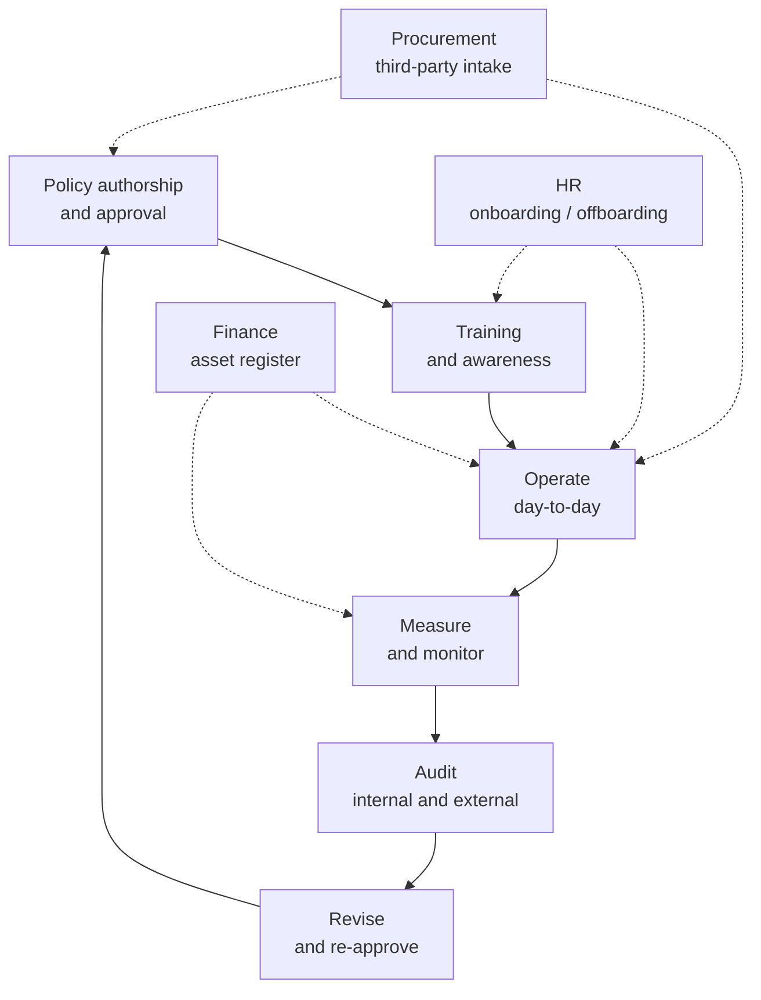

# Security Governance, Policies and People

## Why this matters

The previous lesson on [Security Controls and Frameworks](./security-controls.md) catalogued the technical and procedural mechanisms an organisation chooses from. This one is about everything that has to be true for those controls to actually work in production. A firewall rule does not enforce itself: somebody decided that the rule belongs in the policy, somebody else trained the on-call engineer to recognise an alert, a third person reviewed the change before it went live, and a fourth signed the contract with the vendor that supplies the firewall. Strip any of those four people away and the rule is just a line of configuration that nobody owns.

Governance is the discipline that turns "we have a policy" into "the policy is operated, measured, audited, and revised on a schedule everybody follows". It covers the policies themselves (acceptable use, NDA, separation of duties, least privilege), the people who must follow them (joiners, movers, leavers, contractors, third parties), the training that keeps them current, the legal instruments that bind vendors and partners, the rules that govern data through its lifecycle, the credential policies that apply to humans and machines alike, and the change and asset management processes that keep the environment knowable. It is unglamorous, paperwork-heavy, and the single biggest determinant of whether a security program survives its first audit.

This lesson is the second half of the Security Controls deck. Where the first half asked "what kind of control is it and which framework does it map to?", this half asks "who owns it, how is it taught, who signs the contract, and where does the data go when somebody leaves?" Together they make a complete picture: technical defences on one side, the people and process scaffolding that holds them up on the other.

## Core concepts

### Organisational policies — the foundation document, the policy hierarchy

Security governance starts with documents, and those documents form a strict hierarchy. The vocabulary matters because each layer binds people differently and is changed on a different cadence.

| Layer | What it is | Who writes it | How often it changes |
|---|---|---|---|
| **Policy** | High-level statement of management intent. Short, principle-based, mandatory. | Executive management, ratified by the board. | Annually, or on a major business change. |
| **Standard** | Mandatory specification of how a policy is implemented (e.g. password length, encryption algorithms). | Security team and architecture board. | Every 1 to 2 years, or on a technology shift. |
| **Procedure** | Step-by-step instructions to perform a task in line with policy and standard. | The team that operates the system. | Whenever the system or tooling changes. |
| **Guideline** | Recommended (not mandatory) practice. Useful where flexibility is needed. | Subject matter experts. | As needed. |

A typical mid-sized organisation maintains 10 to 25 policies — Information Security Policy, Acceptable Use, Access Control, Cryptography, Incident Response, Business Continuity, Backup, Data Classification, Third-Party Risk, Change Management, Asset Management, Privacy, and a handful of role- or sector-specific additions. Each policy points down to standards and procedures, and every piece of the hierarchy carries an owner, a review date, and a version number.

The single most common failure here is the **shelfware policy** — a document approved years ago, never read, never trained on, never enforced. Auditors spot it within minutes; attackers do not need to spot it because the absence of operation already left the door open. The second most common failure is the opposite: a thirty-page policy that nobody can follow because it is full of internal contradictions, references to systems that no longer exist, and aspirational statements written by a consultant who never had to operate them. Short, current, owned, and trained — those are the four qualities every policy must have.

The Information Security Policy sits at the top of the pyramid. It is the umbrella document signed by the CEO or board that states the organisation's commitment to security, names the accountable executive (typically the CISO), establishes the security committee, and points to all the subsidiary policies. It changes rarely (once a year is normal, once every two years is acceptable). The subsidiary policies cite it; standards cite the subsidiary policies; procedures cite the standards. This citation chain is what allows an auditor to trace a single configuration setting on a single server back to a board-level commitment, and it is what makes the program defensible.

### Personnel security policies

People are the largest, most expensive, and most variable part of any security program. The personnel-policy stack is what an organisation uses to keep that variability inside acceptable limits.

**Acceptable Use Policy (AUP).** The AUP says what employees may and may not do with company resources — laptops, email, the corporate network, the company name in social posts, AI tools, removable media. A good AUP is short (one to three pages), readable by a non-technical employee, and explicit about consequences ("violation may result in termination"). It is signed during onboarding and re-acknowledged annually. The minimum topic list:

- Permitted personal use of company assets and the boundary against personal business.
- Prohibited content (illegal material, harassment, content that brings the company into disrepute).
- Software installation rules — typically allow-listed via an enterprise app catalogue, with exceptions requiring approval.
- Remote access expectations (corporate device required, MFA, no split tunnelling on hostile networks).
- Data handling tied to the data classification scheme.
- BYOD rules — what is permitted, what enrolment is required, what the company can wipe.
- Removable media (USB sticks, external drives) — typically discouraged, encrypted if used.
- Social media use — what may be said about the company, who speaks for it.
- AI and LLM tools — what may be sent to public LLMs (typically: nothing classified above Internal), which enterprise tools are sanctioned.
- Monitoring — the explicit reservation of the company's right to monitor email, network traffic, and endpoint activity, with clear notice that there is no expectation of privacy on company systems.

**Job rotation.** Periodically moving people between roles — particularly in privileged or finance-adjacent functions — produces three benefits. It cross-trains, so no single person is a single point of failure. It surfaces fraud, because a successor sees what the predecessor was doing. It broadens the security team's understanding of the wider business. The cost is real (productivity dips during handover) and small organisations find it hard to operate, but in any function with significant trust it is one of the strongest controls available.

**Mandatory vacation.** Requiring employees in sensitive roles to take consecutive days off forces a temporary handover that often surfaces fraud. The classic case is the bank teller who never takes leave because their reconciliations would not survive a week of audit by a colleague. A two-week consecutive vacation policy for finance, treasury, IT operations, and security roles is a low-cost control with disproportionate fraud-detection value.

**Separation of Duties (SoD).** No single person should be able to start and finish a sensitive transaction. The classic example: the person who requests a payment cannot also approve it; the developer who writes code cannot also deploy it to production; the administrator who creates a privileged account cannot also approve its access entitlements. SoD is one of the oldest controls in audit and accounting, and it remains one of the hardest to operate in small teams — see the troubleshooting section.

**Least privilege.** A user, process, or service should have exactly the permissions needed to do its job and no more. Least privilege applies to humans (their AD group memberships), machines (the IAM role attached to an EC2 instance), and applications (the database account a microservice uses). It is the most cited principle in security and the most violated. Periodic access reviews and just-in-time elevation (e.g. PAM platforms, AWS IAM Identity Center session-duration limits) are the operational levers that keep it real.

**Clean desk policy.** Sensitive material — paper, sticky notes, printouts, USB sticks, badges — must not be left unattended in the workspace. The policy is small but the cultural signal it sends is large: the organisation takes physical confidentiality seriously. Modern variants extend the rule to laptop screens (lock when stepping away), to printer queues (pull-printing only), and to whiteboards in meeting rooms.

**Background checks.** Pre-employment screening commensurate with the role. A junior support engineer warrants identity verification and right-to-work checks; a domain administrator or finance lead warrants criminal-record, credit, and reference checks; certain regulated industries layer security clearances on top. The depth of the check is set by role criticality, not seniority. Repeat checks for sensitive roles every three to five years are common in regulated environments.

**Non-Disclosure Agreement (NDA).** A contract that defines what information must not be disclosed and to whom. NDAs are signed by employees as part of onboarding, by contractors as part of statement-of-work execution, and by external parties before commercial discussions involving non-public information. Mutual NDAs cover both directions; one-way NDAs cover only the disclosing party's information. The clauses that matter most: definition of confidential information, permitted recipients, return or destruction obligations on termination, and the duration of the obligation (typically 3 to 5 years post-termination, longer for trade secrets).

**Social media analysis.** Two distinct meanings live behind this term, and both matter. First, the AUP-side question: what may employees post about the company on personal accounts? Second, the third-party-risk side: what does the organisation's relationship with social-media platforms look like, what do those platforms' terms of service mean for company data shared on them, and how is the corporate brand monitored against impersonation, phishing, and data-leak indicators? Both deserve a paragraph in the AUP and a recurring task on someone's plate.

A third dimension is increasingly part of personnel security: **OSINT exposure of staff**. Adversaries scrape LinkedIn, conference attendee lists, and public commit history to build target profiles for spear-phishing. The organisation cannot tell employees what to put on LinkedIn, but it can train them to recognise that detailed posts about internal projects and tooling raise the targeting precision of the next phishing wave. For the highest-risk roles (executives, finance, IT operations leaders), some organisations offer voluntary OSINT-reduction services that scrub data-broker listings and tighten social-media privacy settings.

### Onboarding and offboarding — the lifecycle of an employee identity

Every employee is an identity that gets created, used, modified, and eventually removed. Failures in this lifecycle are the source of an enormous fraction of real-world incidents: dormant accounts that never got disabled, contractors with admin rights three months after their engagement ended, departing employees who took a USB stick with a customer database on the way out the door.

**Onboarding** is what happens between "offer accepted" and "fully productive". From a security standpoint it must include:

- Identity creation in the directory (`EXAMPLE\jdoe`, `jdoe@example.local`).
- Group memberships matched to the role from a documented role-to-entitlements catalogue, not copied from a similarly-titled colleague.
- MFA enrolment (phishing-resistant where the role warrants it).
- Device issuance with full-disk encryption, EDR, MDM enrolment, and the corporate browser profile.
- AUP and NDA signing, with the signed copy filed in HR.
- Baseline security awareness training before any access to production data.
- Role-specific deepening training scheduled for completion within 30 days.
- An induction conversation with the security team for sensitive roles (engineering leads, finance, HR, IT operations).

The standard model is the **30/60/90-day plan**: 30-day basic-access checklist, 60-day role-specific training and access tuning, 90-day review of access against actual work performed.

**Offboarding** is the reverse, with sharper edges. Within 24 hours of a departure (and within minutes for involuntary terminations), the joiner-mover-leaver workflow should:

- Disable the user account in the directory and force-revoke active sessions and tokens across Microsoft 365, Okta, AWS, GitHub, Slack, the VPN, and any other federated SaaS.
- Terminate MFA tokens (TOTP secrets, hardware keys returned).
- Retrieve company devices (laptop, phone, hardware tokens) and confirm receipt.
- Transfer ownership of files, mailboxes, and shared resources to a designated successor.
- Revoke physical access (badge deactivated, building access removed).
- Run an exit interview with HR and, for sensitive roles, with the security team.
- Document the offboarding in the JML system with a completion timestamp.

A termination that drags out for weeks because somebody had to find the right Jira ticket is the textbook insider-threat scenario.

**Movers** — employees changing roles inside the organisation — are the silent third leg. Their old permissions accumulate on top of their new ones because nobody removes them. A two-year-tenured employee in a growing company commonly accrues three or four times the access they actually need. Quarterly access reviews are the only realistic remedy.

The technical implementation of joiner-mover-leaver (JML) typically routes through an identity provider (Entra ID, Okta, Google Workspace) acting on signals from the HR system (Workday, BambooHR, SAP SuccessFactors). The pattern: HR is the source of truth for employment status; the identity provider provisions and deprovisions accounts on schedule; downstream applications (Microsoft 365, AWS, GitHub, Slack, Salesforce, the VPN) consume identity events from the IdP. A clean JML pipeline with five-minute SLAs from HR change to downstream propagation is one of the strongest single investments a mid-sized organisation can make in its security posture; it eliminates dozens of manual steps and the dozens of opportunities for a step to be skipped.

### User training

Training is a control, not a courtesy. It is also the control most likely to be reduced to a slide deck nobody reads. The strong programs share a few traits: they are role-based, they use multiple techniques, they measure outcomes, and they treat phishing as live-fire training rather than punishment.

**Computer-Based Training (CBT).** Self-paced modules covering the baseline — security policies, phishing awareness, data classification, incident reporting. CBT scales cheaply, produces auditable completion records, and is well suited to onboarding induction and annual refreshers. Its weakness is shallow engagement: completion does not equal competence. Modules of 5 to 10 minutes that drop on a regular cadence (a "monthly security minute" pattern) outperform a single 90-minute annual marathon both on retention and on completion rates.

**Role-based training.** Generic awareness for everyone, plus role-specific deepening for those whose decisions affect security. The mapping varies by organisation, but the pattern is consistent:

| Role | Role-specific training topics |
|---|---|
| Software developers | Secure coding (OWASP Top 10, language-specific pitfalls), threat modelling, dependency hygiene. |
| Sysadmins / SRE | System hardening, patch management, incident response runbooks, log analysis. |
| Finance / accounting | Separation of duties, fraud awareness, business email compromise, payment-process tampering. |
| HR | Privacy, lawful basis under GDPR, JML security, sensitive-data handling. |
| Executives | Whaling and impersonation, board-level risk reporting, regulator interactions. |
| Reception / front desk | Tailgating, social engineering, badge-control, visitor handling. |
| Cleaning / facilities crews | Physical security, what to do when something looks wrong, escalation paths. |

The mistake is treating "the SOC" as the only role that needs role-based training.

**Phishing simulations.** Realistic phishing emails sent to employees, with safe landing pages that explain why the email was suspicious. The objective is *teachable moments*, not a punishment record. A mature program:

- Starts with a baseline measurement (a single template, all employees, no warning).
- Runs monthly campaigns with rotating themes — delivery notification, HR document, MFA reset, cloud share, executive impersonation, vendor invoice.
- Tracks click rate and report rate over time, with the report rate (people who click the "this is phishing" button in Outlook) as the leading indicator.
- Uses repeat clickers as the trigger for additional one-on-one training, not for HR action.
- Coordinates with the SOC so that simulation reports are distinguishable from real-incident reports without compromising training.

Aiming the metric at *report rate* tends to produce better cultural outcomes than aiming at *click rate* alone.

**Phishing campaigns** in the attacker sense — chains of related lures targeting the same organisation — are the threat the simulations rehearse against. Internal communications about live phishing waves ("we are seeing a wave of HR-themed lures with payslip attachments") materially raise vigilance for the next 24 to 48 hours. See [Social Engineering](../red-teaming/social-engineering.md) for the offensive perspective.

**Gamification.** Points, badges, leaderboards, and friendly competition layered onto CBT or simulation results. Done well, it converts compliance training from a chore into a low-grade game; done poorly, it produces gaming-the-metric behaviour. The teams that run it best publish team-level scores rather than individual ones, change the rewards regularly, and tie it to a small but real budget for prizes.

**Capture the Flag (CTF).** Hands-on exercises where participants solve security challenges to retrieve "flags". Internal CTFs sharpen the security team's skills and surface latent talent in engineering. External CTFs (DEF CON CTF, picoCTF) are excellent for hiring and team development. CTFs are not awareness training; they are skills training for a smaller audience.

**Diversity of training techniques.** People learn differently. A program that uses only CBT will lose the people who need conversation; one that uses only in-person workshops will not scale. The strong programs combine CBT for baseline coverage, instructor-led sessions for new policies and high-impact roles, simulations for live-fire practice, gamification for engagement, and CTFs for the technical population. Outcomes are measured (test scores, simulation results, incident-reporting rate, time-to-report on real incidents).

The maturity question to ask at the end of each year is not "did we hit 100 % completion" but "did the report rate on phishing simulations rise, did the time from real incident to first internal report shrink, and did the secure-coding training reduce the volume of security findings in code review". Those are outcome metrics; completion is an input. Programs that swap from input to outcome metrics typically discover that their old training was producing very little change and have to redesign accordingly — which is exactly the point of measuring outcomes.

### Third-party risk — vendors, supply chain, business partners

Modern organisations run on third parties. The cloud provider, the payroll SaaS, the email security gateway, the open-source package the CI/CD pipeline pulled in last week, the contracted MSP that runs the EDR, the law firm with a copy of the customer contracts — all are third parties, all carry risk, and all need to be managed inside a single program.

**Vendors** are the firms that supply goods and services. The risk they carry includes: vulnerabilities in their software, mishandling of data they hold on the organisation's behalf, financial collapse leaving the organisation stranded, and supply-chain compromise (the SolarWinds case being the canonical example).

**Supply chain** is the wider chain of suppliers, sub-suppliers, and logistics partners that produce the goods and services the organisation consumes. The third party's third parties matter: a payroll SaaS that subcontracts data hosting to a fourth party adds risk the contracting organisation may not see at first glance. Modern third-party risk programs ask about subprocessors explicitly.

**Business partners** are organisations the company has a strategic relationship with — joint ventures, channel partners, technology integrations. Their risk profile is different from a vendor because the relationship is bilateral and often gives them deeper systems access.

**The legal instruments.** Each of the following is a contract type used to formalise a third-party relationship; the right one depends on the depth of the relationship and the precision required.

| Instrument | What it does | When to use |
|---|---|---|
| **Service Level Agreement (SLA)** | Defines measurable performance levels (uptime, response times, throughput) and remedies for missing them. | Inside or alongside a contract for a service. |
| **Memorandum of Understanding (MOU)** | A bilateral statement of intent. Less formal than a contract; usually not legally binding by itself. | Between business units or with partners where the relationship is being framed. |
| **Master Service Agreement (MSA)** | A master contract that sets the terms governing all subsequent statements of work. | Long-term services relationship with multiple engagements. |
| **Business Partnership Agreement (BPA)** | Defines the legal structure of a partnership: profit and loss sharing, responsibilities, exit terms. | Entering a formal business partnership. |

Note that **MSA** is also sometimes used in a different sense — *Measurement Systems Analysis*, a quality discipline for evaluating measurement system accuracy — when discussing the metrics underpinning security programs. Context disambiguates which sense is meant.

**End of Life (EOL)** is the date a vendor stops selling a product. **End of Service Life (EOSL)** is the date the vendor stops supporting it — no more patches, no more security updates, no more help-desk. EOSL is a hard deadline for security: an EOSL operating system on an internet-facing host is a known, dated, attacker-accessible vulnerability. Asset inventories must record EOL/EOSL dates, and budget cycles must plan replacement before EOSL hits.

The third-party intake process — the sequence of steps a new vendor goes through before a contract is signed — is where a third-party risk program lives or dies. A typical intake: business need stated by the requesting team, security questionnaire issued (tiered by risk), evidence collected (SOC 2 report, ISO 27001 certificate, recent penetration test summary, security.txt review, breach disclosure history), legal review of contract clauses (data processing addendum, security exhibit, audit rights, termination), final approval gated by procurement and finance. Without procurement and finance enforcing the gate, the intake becomes optional and the vendor risk program becomes theatre.

### Data lifecycle — classification, governance, retention

Data has a lifecycle: it is created or collected, classified, used, shared, retained, and eventually destroyed. Governance is the policy layer that keeps each phase intentional.

**Classification.** Not all data is equally sensitive, and treating it as if it were makes the strong protections cheap (everybody ignores them) and the weak protections expensive (everybody resents them). A workable scheme is small enough to remember — typically four tiers — and labelled clearly enough that a non-technical employee can pick the right one. A common scheme:

| Tier | Examples | Handling baseline |
|---|---|---|
| **Public** | Marketing pages, published reports. | No restriction; integrity controls only. |
| **Internal** | Org charts, internal wikis, project plans. | Inside corporate boundary; no external sharing without approval. |
| **Confidential** | Contracts, source code, customer lists. | Encrypted at rest and in transit; access on need-to-know; DLP monitored. |
| **Restricted** | Cardholder data, personal data of EU residents, secrets, medical records. | Strong access controls, MFA, full audit logging, segregated storage, regulator-grade controls. |

Whatever the scheme, three rules apply: classifications must be consistent across the organisation, every data asset must have a classification, and the handling rules per tier must be enforceable.

**Governance.** Data governance is the umbrella program that keeps data trustworthy and well-controlled. It defines data owners (an accountable executive per data domain), data stewards (the operational caretakers), and the policies that apply to the data through its lifecycle. A data-governance committee usually arbitrates disputes between owners. The technical artefacts — data catalogue, lineage, quality metrics — are operated by data engineering but governed at the policy level by this committee.

**Retention.** Keeping data forever is itself a risk: any data the organisation holds is data an attacker could steal, a regulator could subpoena, or a litigant could demand in discovery. A retention policy specifies how long each data class is kept and how it is destroyed at the end. Inputs to the policy include regulatory requirements (tax records: 7 years in many jurisdictions; medical records: long; payment-card data: as short as possible), business need, and litigation holds (which suspend destruction for specific records under legal scrutiny). Implementation is the hard part: a policy that says "delete after 7 years" and a backup system that retains everything forever are inconsistent, and the inconsistency is what regulators ask about.

Destruction methods deserve a paragraph of their own. For paper, cross-cut shredding to NAID AAA standard or equivalent. For magnetic media, degaussing followed by physical destruction. For SSDs, cryptographic erasure (destroy the encryption key) is the only reliable software method; physical destruction (pulverisation, incineration) is the conservative fallback. For cloud storage, the provider's secure-delete primitive plus a documented retention period until backups expire. For SaaS data, contractual deletion obligations on the vendor with attestation. The destruction method must match the data class and must be auditable.

### Credential policies — for personnel, third parties, devices, service accounts, admin/root

Credentials are the keys to the kingdom and the most-attacked surface in any environment. A credential policy is the single document that says, per credential class, who owns it, how it is issued, how strong it must be, how it is rotated, how it is monitored, and how it is revoked. The classes deserve different treatment because they behave differently.

**Personnel credentials.** Human identities backed by a directory (Active Directory, Entra ID, Okta). The policy specifies:

- Password length and complexity (NIST SP 800-63B aligned: minimum 12 to 15 characters, no forced periodic rotation, breach-list checking).
- MFA requirement, with phishing-resistant MFA (FIDO2/WebAuthn) mandated for sensitive roles and break-glass admin paths.
- Session lifetimes (8 to 12 hours for normal, shorter for elevated).
- Access-review frequency (quarterly for production, semi-annually for general).
- Lockout thresholds and account recovery procedures that cannot be socially engineered.

Most modern policies favour **passphrases over complexity** (length beats character-class requirements for resistance to cracking). See [Identity and MFA tooling](../general-security/open-source-tools/iam-and-mfa.md).

**Third-party credentials.** External users — contractors, auditors, vendors with system access — require credentials that are issued through a tracked process, scoped to specific systems, time-limited, and revoked at engagement end. The right pattern is federation (the third party authenticates against their own identity provider) rather than local accounts; if local accounts are unavoidable, they must be tagged and surfaced in monthly access reviews.

**Device credentials.** Computer accounts in Active Directory, certificates issued to laptops for VPN authentication, machine identities in cloud IAM. Devices cannot rotate their own passwords, so machine credentials use long, randomly generated values stored in a credential store (TPM, Secure Enclave, AWS Systems Manager Parameter Store, Azure Key Vault). The policy specifies storage requirements, rotation frequency where applicable, and decommissioning steps when devices are retired.

**Service accounts.** Non-human identities used by applications to access other systems — the database connection string a microservice uses, the AD service account a backup tool runs under. They are dangerous because they are widely shared, rarely rotated (rotation often breaks the application), and frequently over-privileged (because troubleshooting access errors is harder than granting too much). The policy must require: every service account has a named human owner, credentials are stored in a secrets manager (HashiCorp Vault, AWS Secrets Manager, Azure Key Vault, CyberArk), rotation cadence is defined and enforced, privileges are minimised, interactive logon is disabled, and use is monitored.

**Administrator and root accounts.** The highest-privilege accounts in any environment — domain admins, root on Linux, AWS root user, Azure global administrators. The policy must require: a separate admin account from the user's daily account, MFA on every elevated session (phishing-resistant MFA only), session recording for break-glass scenarios, the AWS root user locked away with no API keys and a hardware MFA token, regular review of the admin population, and just-in-time elevation rather than standing access wherever practical.

### Change and asset management

Two more processes underpin the entire program. Without them, controls drift, inventories rot, and "we don't know what we have or what changed" becomes the common cause of outages and breaches alike.

**Change management** is the policy and process that governs every modification to the production environment. A modification is a code deploy, a firewall rule change, a database schema update, an OS patch, a vendor SaaS reconfiguration — anything that alters the production state. The standard process:

1. **Request** — a ticket with rationale, scope, risk assessment, rollback plan, and validation steps.
2. **Review** — peer or CAB review proportionate to risk.
3. **Approval** — the named approver signs off; no self-approval for non-standard changes.
4. **Schedule** — implementation slotted into a defined change window.
5. **Implement** — per runbook, with the implementer different from the approver for high-risk changes.
6. **Verify** — explicit verification step against documented success criteria.
7. **Document** — closure with the actual outcome, any deviations, and lessons learned.

Mature programs categorise changes:

- **Standard** — pre-approved, low-risk, often automated (e.g. routine OS patching of non-critical servers, certificate renewals via ACME).
- **Normal** — the full review-approve-implement cycle.
- **Emergency** — compressed review, post-implementation justification within 48 hours, audited monthly.

**Change control** is the narrower discipline of tracking the details of a specific change — what changed, who changed it, when, with which approver — versus the broader process of change management. The terms are often used interchangeably; the practical artefact is a ticket in Jira, ServiceNow, or an equivalent system.

**Asset management** is the policy and process for knowing what the organisation owns. The scope is broader than people often assume:

- **Hardware** — laptops, desktops, servers, network gear, mobile devices, hardware tokens, IoT devices, OT and ICS equipment, printers, removable media in active use.
- **Software** — every package on every host, every SaaS subscription, every API consumed, every open-source library imported by the codebase.
- **Data** — covered in the data-lifecycle section above; included here because data assets need owners and lifecycle tracking too.
- **Cloud resources** — every account, subscription, project, VPC, bucket, function, container — discovered through provider APIs and reconciled to a business owner.

Without asset management there is no scope for vulnerability management, no scope for incident response, no basis for capacity planning, and no defensible insurance claim. A practical program runs: a single source of truth (often a CMDB), automated discovery (network scans, agent reports, SaaS API queries, cloud provider APIs) feeding it, ownership for every asset, EOL/EOSL tracking, and quarterly reconciliation against finance's fixed-asset register.

The two CIS Controls that sit at the top of every prioritised control list — **Inventory and Control of Enterprise Assets** (CIS Control 1) and **Inventory and Control of Software Assets** (CIS Control 2) — are at the top because everything downstream depends on them. A vulnerability scanner cannot scan a host it does not know exists. A patch program cannot patch software it cannot find. An incident responder cannot triage a system whose owner is unknown. Investing in asset management is unglamorous and high-leverage; skipping it makes every other control weaker than it appears.

## Governance lifecycle diagram

Governance is a cycle, not a project. Policies are written, people are trained, the policy operates, somebody measures the operation, audit verifies, the policy is revised, and the cycle starts again. Cross-cutting touchpoints with HR, procurement, and finance keep the cycle integrated with the rest of the business.

The dotted lines matter as much as the solid ones. HR is the upstream system for joiner-mover-leaver workflow and for delivering onboarding training. Procurement is the upstream system for every third-party engagement and is the only realistic place to enforce vendor-risk intake. Finance owns the asset register that the security asset inventory must reconcile with. A governance program that operates entirely inside the security team will lose to a smaller program that integrates with these three functions.

## Hands-on

### Exercise 1 — Write an Acceptable Use Policy for example.local in one page

Draft a one-page AUP for `example.local` (a 250-person fintech). Constraints:

- Readable by a non-technical employee in ten minutes.
- Covers personal use, prohibited content, software installation, removable media, BYOD, AI/LLM tools, social media, and monitoring.
- Ends with a signature block and a clause on consequences.
- Cites the umbrella Information Security Policy.

Compare your draft with two real published AUPs (universities are a good source) and shorten yours by 30 %. Then ask a non-IT colleague to read it and time how long they take and how many questions they have at the end.

### Exercise 2 — Design a 30/60/90-day onboarding security checklist

Build a checklist for a new joiner at `example.local` covering days 0 through 90.

- **Day 0** — device issuance, MFA enrolment, AUP and NDA signing, baseline access provisioned to a documented role-to-entitlements mapping.
- **Days 1 to 30** — completion of baseline CBT modules, first role-specific training, induction conversation with the security team for sensitive roles, first inclusion in a phishing simulation cohort.
- **Days 31 to 60** — tuning of access against actual work performed, deeper role-specific training, first quarterly access review participation.
- **Days 61 to 90** — formal access review against work performed, removal of any access not used, sign-off by the manager and the security team that onboarding is complete.

Each item names an owner (HR, IT, security, manager) and a verification step. The deliverable is a one-page checklist plus a one-page narrative explaining the rationale for each item.

### Exercise 3 — Build a phishing simulation rollout plan

Plan the first six months of phishing simulations for `example.local`. Include:

- A baseline measurement campaign in month 1 (single template, all employees).
- Monthly campaigns thereafter with rotating themes — delivery notification, HR document, MFA reset, cloud share, executive impersonation, vendor invoice.
- An internal communications plan for handling live phishing waves and how it interacts with the simulation cadence.
- An escalation pathway for repeat clickers — one-on-one training, not HR action.
- The metrics dashboard (click rate, report rate, time-to-report) and target trajectory over six months.
- The criteria for declaring the program mature enough to move to quarterly cadence.

### Exercise 4 — Complete a third-party security questionnaire from the requestor side

Take a real questionnaire (CSA CAIQ Lite is a good choice — about 60 questions) and answer it as if you were the security team at `example.local` evaluating a candidate vendor. Identify the questions whose answers would be deal-breakers, the ones where a "no" would require a compensating control, and the ones that are check-the-box only. Write a one-page summary that a procurement manager could act on.

### Exercise 5 — Design a four-tier data classification scheme for an SME

Design a Public / Internal / Confidential / Restricted scheme tailored to `example.local`. For each tier, specify:

- Examples relevant to the business (marketing copy, internal wikis, customer contracts, cardholder data).
- Who can grant access, and what the approval process looks like.
- Encryption requirements at rest and in transit.
- Sharing rules (internal only, partners under NDA, public).
- Retention default before a litigation hold could change it.
- Destruction method appropriate to the tier and the storage medium.

The scheme must fit on one page and be testable: pick ten randomly chosen documents from a test corpus and classify each in under two minutes per document. If the test is harder than that, the scheme is too complex.

## Worked example — example.local rolls out a governance refresh

`example.local` has grown from 60 people to 250 in two years. The original security policies were written when the company was 30 people; everybody read them on day one and nobody has looked at them since. The new CISO discovers that there are nine policies, none of them have a review date, three reference systems the company no longer uses, and one cites a regulation that was superseded eighteen months ago. A governance refresh is launched.

**Step 1 — Hire a part-time GRC consultant.** The CISO does not have the bandwidth to write twelve policies, run training, and re-build the third-party intake process simultaneously. A two-day-a-week GRC consultant is engaged for six months, scoped to "deliver a refreshed policy set, a training program, and a third-party intake process operating end-to-end". Budget: roughly EUR 60,000 over six months, signed off by the COO out of the operations budget rather than IT.

**Step 2 — Gap analysis.** Two weeks of interviews with department heads, review of the existing policies, mapping against the company's NIST CSF profile and ISO/IEC 27001 Annex A. Output: a one-page heatmap showing where the company has policy coverage, where it has policy on paper but no operation, and where it has no policy. The biggest red flags: no separation-of-duties policy, no documented offboarding workflow, no third-party intake process, no data classification, no service-account credential standard.

**Step 3 — Write and approve twelve policies.** The consultant drafts and the security team revises a refreshed set: Information Security Policy (the umbrella), Acceptable Use, Access Control, Cryptography, Data Classification and Handling, Data Retention, Incident Response, Business Continuity, Backup, Third-Party Risk Management, Change Management, Asset Management. Each policy is one to three pages, references the standards and procedures that operationalise it, has a named owner, a one-year review date, and a version number. Approval routes through the security committee and then the executive team; the board ratifies the umbrella Information Security Policy. Total elapsed time: ten weeks.

**Step 4 — Run training.** A new CBT course covering the refreshed policies is rolled out, with completion required for all employees within thirty days. Role-specific deepening is run for engineering (secure coding), IT operations (hardening, change management), finance (separation of duties, fraud awareness), and HR (privacy, onboarding/offboarding security). The first phishing simulation runs in week 14 and produces a baseline of 18 % click rate and 22 % report rate.

**Step 5 — Integrate vendor onboarding into procurement.** The hardest piece of the refresh. Procurement currently signs vendor contracts without security review. A new intake process is designed: every new vendor passing a EUR-10,000 threshold or handling any personal or confidential data triggers a security review. The review uses a tiered questionnaire (CSA CAIQ Lite for low-risk SaaS, full CAIQ for cloud infrastructure, custom deep-dive for vendors with access to production data). A two-week SLA is agreed with procurement, with a fast-path for low-risk renewals. Finance enforces the gate by refusing to raise a PO without the security sign-off. The process goes live in week 18 and processes its first eleven vendors before the end of the engagement.

**Step 6 — Sustain via quarterly review.** A quarterly governance forum is established, chaired by the CISO and attended by HR, procurement, finance, IT, engineering, and legal. The agenda: review the policy hierarchy for upcoming review dates, review the third-party intake throughput, review the training metrics, review the access-review backlog, and surface any item from any department that has implications for the policy set. The first forum runs two weeks after the consultant rolls off; the program now operates under steady-state ownership. The total elapsed time from kick-off to steady state is twenty-six weeks; the cost is roughly EUR 75,000 in consultant fees and an estimated EUR 90,000 in internal time. The program survives its first ISO/IEC 27001 surveillance audit twelve months later with three minor non-conformities, all addressed within the agreed timeframe.

## Troubleshooting and pitfalls

- **Shelfware policies.** Policies approved years ago, never read, never trained on, never enforced. Auditors spot them in minutes; they are functionally an absence of policy. Every policy needs an owner, a review date, training coverage, and operational evidence.
- **Training fatigue.** Annual mandatory CBT that everybody clicks through in fifteen minutes produces no behaviour change. Mix techniques, vary themes, keep individual modules short, measure outcomes other than completion rate.
- **Separation of duties broken in small teams.** A team of three cannot perfectly separate request, approval, and implementation. Compensating controls — peer review of the implementer's work by a second engineer, after-the-fact approval by a manager, rotation of who holds which hat — must be documented and operated, not just claimed.
- **Third-party questionnaires nobody actually reads.** A 200-question CAIQ that nobody opens is theatre. A 30-question intake plus a deeper dive on the answers that matter is a control. Tier the questionnaires by risk; pre-fill the easy answers; spend the analyst time on the hard ones.
- **Data classification scheme too complex to use.** A seven-tier scheme with sub-classifications and per-region overrides will not be applied consistently. Four tiers, clear examples, one-page handling matrix.
- **Credential policies that ignore service accounts.** Personnel credentials get all the attention; service accounts run the production systems. Inventory them, name an owner, store the secret in a vault, rotate, and monitor.
- **Change management bypassed for "emergency" changes.** Emergencies are real, but unbounded emergency-change powers become the loophole through which unreviewed changes flow. Define what qualifies, require post-implementation review within 48 hours, and audit the emergency-change rate.
- **Onboarding fast, offboarding slow.** Joiners get accounts in a day; leavers' accounts linger for weeks because no system pulls the trigger. HR's termination event must drive an automated workflow with a defined SLA — minutes for involuntary terminations, 24 hours for voluntary.
- **Movers ignored.** Internal role changes accumulate access. A two-year tenured employee in a growing company commonly carries three to four times the access needed. Quarterly access reviews driven by HR's mover events are the only realistic remedy.
- **AUP signed once and never re-acknowledged.** Annual re-signing is a small ceremony with a large legal benefit. Bake it into the annual training cycle.
- **NDAs that do not survive contractor turnover.** A consulting firm signs an NDA, but the actual consultant on site changes every six months. The NDA needs flow-down language requiring the firm to bind every individual who touches the data.
- **Background checks scoped by seniority instead of role criticality.** A junior sysadmin with domain admin rights warrants a deeper check than a senior marketing manager with no production access. Calibrate to the role, not the title.
- **Mandatory vacation policy that nobody enforces.** A policy that says "must take ten consecutive days" with a manager-discretion override is the same as no policy. Make consecutive vacation a default and require documented justification to override.
- **Phishing simulation used to punish.** Linking simulation failures to performance reviews destroys the report-rate metric (employees stop reporting because they fear punishment). Treat failures as teachable moments and measure improvement, not infraction count.
- **Asset inventory that does not reconcile with finance.** Finance's fixed-asset register and security's asset inventory drifting apart means one of them is wrong. Quarterly reconciliation is a small task with high audit value.
- **EOL/EOSL dates not tracked.** An EOSL operating system on an internet-facing host is a dated, known, attacker-accessible vulnerability. Asset records must carry EOL/EOSL fields and feed into capacity-planning calendars at least 18 months in advance.
- **Data retention policy unimplemented in backups.** A policy that says "delete after 7 years" and a backup system that retains everything forever are inconsistent. The inconsistency is exactly what regulators ask about.
- **Vendor reviews that stop at the questionnaire.** A signed CAIQ is the start of due diligence, not the end. Spot-check answers against publicly available evidence (SOC 2 reports, breach disclosures, security.txt, recent CVEs in the vendor's product line).
- **No subprocessor visibility.** A vendor that uses a fourth-party data hoster adds risk that does not appear on the original vendor's questionnaire. Modern programs require subprocessor disclosure and a notification window for changes.
- **Policies in PDFs nobody can search.** Storing the policy set as PDFs in a SharePoint folder makes them invisible. Native pages (Confluence, Notion, Markdown wiki) with version history and full-text search are reachable; PDFs are not.
- **Annual training that arrives the same week as Q4 reporting.** Scheduling matters. A campaign launched the week of fiscal year-end gets ignored. Pick a quiet quarter and protect the calendar slot.

## Key takeaways

- Governance turns "we have a policy" into "the policy is operated". Every policy needs an owner, a review date, training coverage, and operational evidence.
- The policy hierarchy is **policy → standard → procedure → guideline**. Each layer is changed on a different cadence and binds people differently.
- Personnel security policies — AUP, job rotation, mandatory vacation, separation of duties, least privilege, clean desk, background checks, NDA, social media — are old controls that remain among the highest-leverage in any program.
- Onboarding, offboarding, and (the often-neglected) **mover** workflow are the lifecycle of an employee identity. Failures here are the source of an enormous fraction of real-world incidents.
- Training is a **control, not a courtesy**. The strong programs combine CBT, role-based deepening, phishing simulations, gamification, and CTFs, and measure outcomes beyond completion rate.
- Third-party risk needs a **single intake process** integrated with procurement. The legal instruments — SLA, MOU, MSA, BPA — formalise the relationship; EOL and EOSL dates govern when the relationship must end.
- Data classification, governance, and retention together form the data lifecycle. Four tiers and one page beats seven tiers and a binder.
- Credential policies must distinguish personnel, third party, device, service account, and admin/root — each behaves differently and needs different handling.
- Change management and asset management are the unglamorous backbones. Without them, controls drift and inventories rot; with them, every other control becomes audit-defensible.
- The governance program lives inside the cycle of authorship, training, operation, measurement, audit, and revision — and it integrates with HR, procurement, and finance. Operating it in the security silo is the failure mode.
- The two highest-leverage investments most mid-sized organisations under-make are a clean **JML pipeline** (HR system → IdP → downstream apps with five-minute SLAs) and a **third-party intake gate** enforced by procurement and finance. Both pay back across every other control in the program.

## References

- **NIST SP 800-53 Rev. 5** — Security and Privacy Controls (PE/AT/PS/MA families) — https://csrc.nist.gov/publications/detail/sp/800-53/rev-5/final
- **NIST SP 800-50** — Building an Information Technology Security Awareness and Training Program — https://csrc.nist.gov/publications/detail/sp/800-50/final
- **NIST SP 800-181** — NICE Cybersecurity Workforce Framework — https://csrc.nist.gov/publications/detail/sp/800-181/rev-1/final
- **ISO/IEC 27002:2022** — Information security controls (people controls section) — https://www.iso.org/standard/75652.html
- **ISO/IEC 27701:2019** — Privacy information management — https://www.iso.org/standard/71670.html
- **CIS Controls v8** — Control 14 Security Awareness and Skills Training; Control 15 Service Provider Management — https://www.cisecurity.org/controls/v8
- **CSA Consensus Assessments Initiative Questionnaire (CAIQ)** — https://cloudsecurityalliance.org/research/cloud-controls-matrix
- **Verizon Data Breach Investigations Report (DBIR)** — annual human-factor statistics — https://www.verizon.com/business/resources/reports/dbir/
- **SANS Security Awareness Maturity Model** — https://www.sans.org/security-awareness-training/resources/security-awareness-maturity-model/
- **Related lessons:** [Security Controls and Frameworks](./security-controls.md), [Risk Management and Privacy](./risk-and-privacy.md), [Policies, Standards, Procedures](./policies.md), [GRC Tools](../general-security/open-source-tools/grc-tools.md), [Identity and MFA](../general-security/open-source-tools/iam-and-mfa.md), [Social Engineering](../red-teaming/social-engineering.md)
