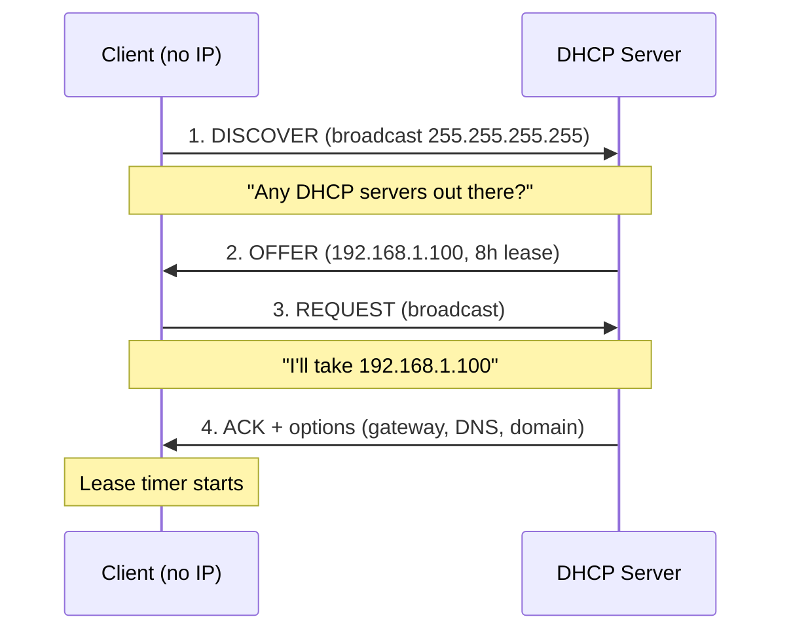

# DHCP (Dynamic Host Configuration Protocol)

**DHCP** hands out IP addresses — and the rest of the network configuration a client needs — automatically. Without it, every new machine has to be walked through "IP, mask, gateway, DNS" by hand, which at fleet scale is both tedious and the single biggest source of address conflicts (two hosts with the same IP and neither works).

DHCP is not *just* the IP. It also delivers:

- **Subnet mask** — defines the local network
- **Default gateway** — the router to the rest of the world
- **DNS servers** — who resolves names
- **DNS domain suffix** — e.g. `example.local`
- **Lease time** — how long the address is yours
- **Extras** — NTP servers, WINS (legacy), PXE boot, vendor-specific options



## DORA — the four-step handshake

This is the fundamental flow. Every DHCP-assigned IP goes through these four packets.

### D — Discover

The client has no IP yet, so it **broadcasts**:

- Source IP: `0.0.0.0`
- Destination IP: `255.255.255.255`
- Ports: UDP 67 (server) / UDP 68 (client)

### O — Offer

The server picks a free address from its pool and offers it back. The offer already contains the mask, gateway, DNS and lease duration. If several DHCP servers exist, each sends its own Offer — the client usually accepts whichever arrives first.

### R — Request

The client broadcasts again ("I'll take 192.168.1.100"). Why broadcast, not unicast? So any *other* DHCP servers that made offers can see which one was chosen and release their own tentative reservation.

### A — Acknowledge

The server commits the lease. The client starts using the IP and the lease timer begins.

## Leases — addresses are rented, not owned

A lease has a timer with two renewal points:

```
0%                50%               87.5%            100%
|--- Lease start --|--- T1 renew ----|--- T2 rebind --|-- Lease expired --|
```

- **T1 (50%)** — client tries to renew with the **same** server (unicast).
- **T2 (87.5%)** — if the original server did not answer, client **broadcasts** for *any* DHCP server to take over.
- **100%** — nobody answered, the address is released and the client restarts DORA from scratch. Network connectivity drops until a new lease is granted.

How long should the lease be?

| Environment | Lease | Why |
|---|---|---|
| Office desktops | 8 days | Fixed endpoints, low churn |
| WiFi / guest | 4–8 hours | Devices come and go |
| Hotel / café | 1–2 hours | Extremely short stays |
| Lab / classroom | 8 hours | New people every session |
| Server / data-centre | 12–24 h (or reservation) | Stable, reservations preferred |

Short lease → faster pool turnover, more DHCP traffic. Long lease → addresses are held by absent clients for a long time.

## Core concepts

### Scope

A **scope** is the range of IPs a DHCP server is allowed to give out on one subnet:

```
Scope: Example-Network
    Start:  192.168.1.100
    End:    192.168.1.200
    Mask:   255.255.255.0
    = 101 usable addresses
```

One DHCP server can host multiple scopes — one per subnet.

### Exclusion range

Addresses *inside* the scope that DHCP must **not** hand out — typically reserved for devices you configure statically (servers, switches, printers).

```
Scope:      192.168.1.100 — 192.168.1.200
Exclusion:  192.168.1.150 — 192.168.1.160
Result:     DHCP gives out .100–.149 and .161–.200; .150–.160 stay free for manual use.
```

### Reservation

A reservation tells DHCP "this MAC address always gets this IP". The device is still a DHCP client — it just always receives the same lease.

```
Reservation: Printer-Floor1
    IP:  192.168.1.101
    MAC: AA-BB-CC-DD-EE-FF
```

Reservation vs static IP: a reservation is managed centrally in DHCP, so you can see and change it from one console. A static IP lives on the device itself and nobody else knows about it. Reservations are almost always the better choice.

### DHCP options

Options carry everything *beyond* the IP address. The ones you will actually configure:

| Code | Name | Example |
|---|---|---|
| 003 | Router (gateway) | 192.168.1.1 |
| 006 | DNS servers | 10.0.0.4 |
| 015 | DNS domain name | example.local |
| 044 | WINS / NBNS | (legacy) |
| 046 | NetBIOS node type | 0x8 (H-node) |
| 051 | Lease time | 28800 s (8 h) |
| 066 | Boot server host | PXE |
| 067 | Bootfile name | PXE |

Options can be set at three levels, with more specific winning:

**Reservation > Scope > Server**

### Superscope

A container that groups several scopes on the same physical segment (multiple subnets on one LAN). Rare, but worth recognising.

### DHCP relay / IP helper

DHCP Discover is a broadcast, and broadcasts do not cross routers. If the server is on a different subnet than the client, the router needs a **DHCP relay agent** (Cisco calls it `ip helper-address`) that forwards the broadcast to the DHCP server as unicast:

```
Subnet A 192.168.1.0/24          Router              Subnet B 192.168.2.0/24
   Client  ── broadcast ──▶   Relay agent   ── unicast ──▶  DHCP server
                               ip helper-address 192.168.2.10
```

In a flat lab everyone is on one subnet, so this is invisible — but in any real environment it is essential.

## Installing the DHCP role

### Azure limitation

Azure VMs cannot act as DHCP servers for other VMs — the Azure fabric handles DHCP itself and blocks traffic. You *can* install the role and configure scopes for practice, but leases will never actually reach real clients. For the full end-to-end flow use Hyper-V, VirtualBox or VMware.

### GUI

1. **Server Manager** → **Manage** → **Add Roles and Features**.
2. **Role-based or feature-based installation** → select the target server.
3. **Server Roles** → tick **DHCP Server** → accept the required features popup.
4. Finish the wizard and let it install.
5. In the post-install notification click **Complete DHCP configuration**.
6. In the post-install wizard, authorise the server in AD using your admin credentials → **Commit**.

**Why AD authorisation matters.** Without authorisation, anyone who plugs a rogue DHCP server into the network can hand out wrong gateways and DNS entries to clients, hijacking their traffic (a classic MITM setup). Windows domain-joined DHCP servers refuse to hand out leases unless they appear in the AD authorised list.

### PowerShell

```powershell
# Install
Install-WindowsFeature DHCP -IncludeManagementTools

# Post-install: create the security groups DHCP uses
netsh dhcp add securitygroups

# Authorise in Active Directory
Add-DhcpServerInDC `
    -DnsName   "dc01.example.local" `
    -IPAddress 10.0.0.4

# Restart the service so group membership takes effect
Restart-Service dhcpserver

# Clear the "pending configuration" flag in Server Manager
Set-ItemProperty `
    -Path "HKLM:\SOFTWARE\Microsoft\ServerManager\Roles\12" `
    -Name "ConfigurationState" -Value 2
```

## DHCP console tour

Open **Server Manager** → **Tools** → **DHCP** (or `dhcpmgmt.msc`). The tree:

```
DHCP
└── dc01.example.local
    ├── IPv4
    │   ├── Server Options         Options that apply to every scope
    │   ├── Scope [192.168.1.0]    A specific scope
    │   │   ├── Address Pool       Range + exclusions
    │   │   ├── Address Leases     Who currently has what
    │   │   ├── Reservations       MAC-bound fixed addresses
    │   │   ├── Scope Options      Options for this scope only
    │   │   └── Policies           Scope-level conditional rules
    │   ├── Policies               Server-wide policies
    │   └── Filters
    │       ├── Allow              MAC allow-list
    │       └── Deny               MAC deny-list
    └── IPv6                       DHCPv6 (rarely used in SMB)
```

## Creating a scope

### GUI

**DHCP** → right-click **IPv4** → **New Scope…**. Step through:

- **Name**: `Example-Network`.
- **IP address range**: start `192.168.1.100`, end `192.168.1.200`, mask `255.255.255.0`.
- **Exclusions**: add `192.168.1.150 – 192.168.1.160` for infrastructure.
- **Lease duration**: 8 hours (lab) or 8 days (office).
- **Configure options now** → Yes.
- **Router**: `192.168.1.1`.
- **DNS**: parent domain `example.local`, server `dc01.example.local` → **Resolve** → **Add**.
- **WINS**: skip.
- **Activate scope**: yes → **Finish**.

### PowerShell

```powershell
# Scope
Add-DhcpServerv4Scope `
    -Name          "Example-Network" `
    -StartRange    192.168.1.100 `
    -EndRange      192.168.1.200 `
    -SubnetMask    255.255.255.0 `
    -LeaseDuration 0.08:00:00 `
    -Description   "Example campus DHCP scope" `
    -State         Active

# Exclusion
Add-DhcpServerv4ExclusionRange `
    -ScopeId    192.168.1.0 `
    -StartRange 192.168.1.150 `
    -EndRange   192.168.1.160

# Gateway
Set-DhcpServerv4OptionValue `
    -ScopeId 192.168.1.0 `
    -Router  192.168.1.1

# DNS + domain
Set-DhcpServerv4OptionValue `
    -ScopeId   192.168.1.0 `
    -DnsServer 10.0.0.4 `
    -DnsDomain "example.local"
```

## Reservations

Good candidates for reservations:

- printers — users configure them by IP
- servers that use DHCP (rare, but happens)
- IP cameras, access points, VoIP phones
- anything that must be findable at a known address

First get the MAC from the client:

```powershell
ipconfig /all    # look for "Physical Address"
```

### GUI

Scope → right-click **Reservations** → **New Reservation…**:

- Name: `Printer-Floor1`
- IP: `192.168.1.101`
- MAC: `AA-BB-CC-DD-EE-FF` (dashes or no dashes both work)
- Supported types: **Both** (DHCP + BOOTP)

### PowerShell

```powershell
Add-DhcpServerv4Reservation `
    -ScopeId     192.168.1.0 `
    -IPAddress   192.168.1.101 `
    -ClientId    "AA-BB-CC-DD-EE-FF" `
    -Name        "Printer-Floor1" `
    -Description "HP LaserJet on floor 1"

# Reservation-specific option
Set-DhcpServerv4OptionValue `
    -ReservedIP 192.168.1.101 `
    -DnsServer  10.0.0.4 `
    -Router     192.168.1.1
```

## MAC filtering

DHCP has two filter lists:

- **Deny** — these MACs never get a lease.
- **Allow** — *only* these MACs can get a lease (strict allow-list).

```powershell
Add-DhcpServerv4Filter -MacAddress "BB-CC-DD-EE-FF-00" -List Deny  -Description "Unauthorized device"
Add-DhcpServerv4Filter -MacAddress "AA-BB-CC-DD-EE-FF" -List Allow -Description "Approved printer"

Get-DhcpServerv4Filter -List Deny
Get-DhcpServerv4Filter -List Allow
```

Activating the **Allow** list is a hard lockdown — anything not on the list stops receiving leases, including laptops you forgot about. Use with care.

## Failover

A single DHCP server is a single point of failure — when it dies, nobody gets a new lease. **DHCP failover** pairs two servers on the same scope(s).

Two modes:

| Mode | Behaviour |
|---|---|
| **Hot Standby** | One primary, one passive. Partner takes over if primary fails. Simpler. |
| **Load Balance** | Both servers actively answer (50/50 by default). Better performance. |

Configure via the console: right-click a scope → **Configure Failover…** → pick the partner server and mode.

Failover is IPv4-only on Windows; DHCPv6 does not support it.

## Monitoring

### Leases

```powershell
# Every active lease in a scope
Get-DhcpServerv4Lease -ScopeId 192.168.1.0 |
    Select-Object IPAddress, HostName, ClientId, LeaseExpiryTime |
    Format-Table -AutoSize

# Find a specific host
Get-DhcpServerv4Lease -ScopeId 192.168.1.0 |
    Where-Object { $_.HostName -like "*ws01*" }
```

### Statistics

```powershell
Get-DhcpServerv4Statistics
Get-DhcpServerv4ScopeStatistics -ScopeId 192.168.1.0
```

Or in the console: right-click **IPv4** → **Display Statistics**. The numbers to watch are **In Use** and **Percentage In Use** — if you are at 90%+ and rising, plan to extend the scope before clients start failing to get leases.

### Audit log

DHCP writes a rolling log per weekday under `C:\Windows\System32\dhcp\` — `DhcpSrvLog-Mon.log`, `DhcpSrvLog-Tue.log`, etc.

```powershell
Get-Content "C:\Windows\System32\dhcp\DhcpSrvLog-$(Get-Date -Format 'ddd').log" -Tail 50
```

Key event IDs in the log:

| ID | Meaning |
|---|---|
| 10 | New lease granted |
| 11 | Lease renewed |
| 12 | Lease released by client |
| 13 | Lease expired |
| 15 | Denied by MAC filter |
| 20 | BOOTP request |
| 30+ | DNS update events |

## Client-side troubleshooting

```powershell
ipconfig /release    # give up the current lease
ipconfig /renew      # ask DHCP for a new one
ipconfig /all        # full network config + DHCP server IP
```

If the client is not getting a lease, run through:

1. Is the DHCP service up?  `Get-Service dhcpserver`
2. Is the scope active? (green arrow in the console)
3. Is the pool full? Check statistics.
4. Is the Windows firewall blocking UDP 67/68?
5. Is the server still authorised in AD?  `Get-DhcpServerInDC`
6. Does the client have a **169.254.x.x** address?

### APIPA — the "169.254" tell

If a Windows client fails to reach any DHCP server, it self-assigns a random **169.254.x.x / 16** address (Automatic Private IP Addressing). Other APIPA hosts on the same LAN can talk to each other, but there is no gateway and no DNS, so nothing external works. Seeing `169.254.*` on a client = DHCP is broken for that client (server down, relay misconfigured, port 67 blocked, cable pulled, VLAN wrong).

## Backup and restore

DHCP has its own backup separate from Windows Server Backup.

```powershell
# Full backup (directory)
Backup-DhcpServer  -Path "C:\DHCP-Backup"

# Export to XML (database + optionally active leases)
Export-DhcpServer  -File "C:\DHCP-Backup\dhcp-export.xml" -Leases

# Restore in place
Restore-DhcpServer -Path "C:\DHCP-Backup"

# Import from XML (takes a safety backup first)
Import-DhcpServer  -File       "C:\DHCP-Backup\dhcp-export.xml" `
                   -Leases `
                   -BackupPath "C:\DHCP-Backup-Before-Import"
```

The service auto-backs up to `C:\Windows\System32\dhcp\backup\` every 60 minutes. To change that interval:

```powershell
Set-ItemProperty `
    -Path  "HKLM:\SYSTEM\CurrentControlSet\Services\DHCPServer\Parameters" `
    -Name  "BackupInterval" `
    -Value 30    # minutes
```

## DHCP + DNS integration

When DHCP issues a lease, it can register the client's A and PTR records in DNS automatically — so every new laptop is resolvable by name without the user touching anything.

### Configure dynamic updates

**DHCP** → right-click **IPv4** → **Properties** → **DNS** tab:

- **Enable DNS dynamic updates according to the settings below** — on.
- **Dynamically update DNS records only if requested by the DHCP clients** — default, recommended.
- **Discard A and PTR records when lease is deleted** — on, so DNS stays clean.
- **Dynamically update DNS records for DHCP clients that do not request updates** — only needed for very old (Windows 2000-era) clients.

Or in PowerShell:

```powershell
Set-DhcpServerv4DnsSetting `
    -DynamicUpdates            "Always" `
    -DeleteDnsRROnLeaseExpiry  $true
```

Pair this with **DNS scavenging** on the DNS server — without scavenging, stale records accumulate forever. In DNS Manager → server **Properties** → **Advanced** → enable *"Enable automatic scavenging of stale records"* with a 7-day period.

## DHCPv4 vs DHCPv6

| Topic | DHCPv4 | DHCPv6 |
|---|---|---|
| Address family | IPv4 | IPv6 |
| Transport | UDP 67/68 | UDP 546/547 |
| Reservation identity | MAC | DUID |
| Windows failover | Yes | No |
| Usually paired with | Nothing | Router Advertisements, SLAAC |

In pure IPv6 networks DHCPv6 is only one piece — Router Advertisements and SLAAC often handle address assignment and DHCPv6 delivers only DNS / domain info ("stateless DHCPv6"). Plan the two together.

## PowerShell cheat sheet

```powershell
# --- Install ---
Install-WindowsFeature DHCP -IncludeManagementTools
Add-DhcpServerInDC -DnsName "dc01.example.local" -IPAddress 10.0.0.4

# --- Scope ---
Add-DhcpServerv4Scope -Name "Name" -StartRange 192.168.1.100 -EndRange 192.168.1.200 -SubnetMask 255.255.255.0 -LeaseDuration 0.08:00:00 -State Active
Get-DhcpServerv4Scope
Remove-DhcpServerv4Scope -ScopeId 192.168.1.0 -Force

# --- Exclusions ---
Add-DhcpServerv4ExclusionRange    -ScopeId 192.168.1.0 -StartRange 192.168.1.150 -EndRange 192.168.1.160
Get-DhcpServerv4ExclusionRange    -ScopeId 192.168.1.0
Remove-DhcpServerv4ExclusionRange -ScopeId 192.168.1.0 -StartRange 192.168.1.150 -EndRange 192.168.1.160

# --- Options ---
Set-DhcpServerv4OptionValue -ScopeId 192.168.1.0 -Router 192.168.1.1
Set-DhcpServerv4OptionValue -ScopeId 192.168.1.0 -DnsServer 10.0.0.4 -DnsDomain "example.local"
Get-DhcpServerv4OptionValue -ScopeId 192.168.1.0

# --- Reservations ---
Add-DhcpServerv4Reservation  -ScopeId 192.168.1.0 -IPAddress 192.168.1.101 -ClientId "AA-BB-CC-DD-EE-FF" -Name "Printer"
Get-DhcpServerv4Reservation  -ScopeId 192.168.1.0
Remove-DhcpServerv4Reservation -ScopeId 192.168.1.0 -ClientId "AA-BB-CC-DD-EE-FF"

# --- Leases / stats ---
Get-DhcpServerv4Lease           -ScopeId 192.168.1.0
Get-DhcpServerv4Statistics
Get-DhcpServerv4ScopeStatistics -ScopeId 192.168.1.0

# --- Filters ---
Add-DhcpServerv4Filter -MacAddress "BB-CC-DD-EE-FF-00" -List Deny
Get-DhcpServerv4Filter

# --- Backup / restore ---
Backup-DhcpServer  -Path "C:\DHCP-Backup"
Restore-DhcpServer -Path "C:\DHCP-Backup"
Export-DhcpServer  -File "C:\dhcp-export.xml" -Leases
Import-DhcpServer  -File "C:\dhcp-export.xml" -Leases

# --- Client side ---
ipconfig /release
ipconfig /renew
ipconfig /all

# --- Health ---
Get-Service      dhcpserver
Get-DhcpServerInDC
Test-Connection  192.168.1.1
```

## Practical takeaways

- Give DHCP servers themselves a static IP. Don't let them DHCP from each other.
- Document every scope, exclusion and reservation — undocumented static IPs are where conflicts hide.
- Reservations beat static IPs for printers and appliances. Central view, central change.
- DHCP problems usually look like "DNS broken" or "internet down" first. Check for `169.254.*` early.
- Authorise the DHCP server in AD — it's the only thing between you and a rogue DHCP server.
- Run failover in production. Hot Standby is fine, Load Balance is better if both servers are healthy.
- Turn on DNS dynamic updates, turn on DNS scavenging. Stale records hurt months later.
- Plan lease length to match how fast the environment changes, not to a round number.
