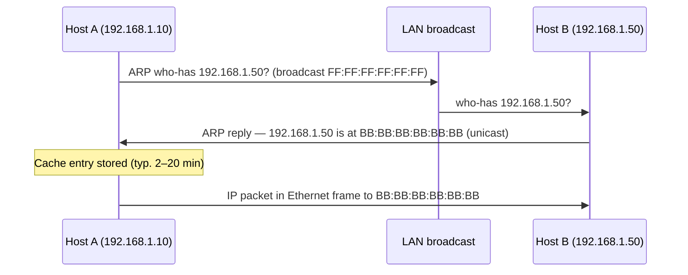

# Ethernet and ARP

## Why this matters

Every wired LAN you will ever touch runs **Ethernet**, and every IP packet that leaves your machine is wrapped in an Ethernet frame before it hits the cable. Ethernet is the floor under everything — TCP, HTTP, TLS, DNS, your VPN tunnel — and when it misbehaves, every layer above it misbehaves too. A flapping switch port, a duplicate MAC, a misconfigured VLAN, a half-duplex mismatch: each one looks like "the application is slow" until you read the L2 counters and realise the problem was never in the application at all.

**ARP** (Address Resolution Protocol) is the small, ancient piece of glue that lets [the Internet layer](./tcp-ip-model.md) talk to the [Data Link layer](./osi-model.md). The kernel knows the destination IP. The switch only understands MACs. ARP is what bridges the two — by broadcasting "who has this IP?" onto the local segment and trusting whoever answers. That trust is also why **ARP spoofing** is one of the oldest attacks still in active use today: any malicious host on your VLAN can claim to be the gateway and silently man-in-the-middle every conversation that crosses it. If you do not understand Layer 2, you cannot defend it — and pen-testers, SOC analysts, and network engineers all live here.

## MAC addresses

Every network interface has a 48-bit **MAC address** burned in at the factory, written as six hex pairs separated by colons or hyphens: `AA:BB:CC:DD:EE:FF`. The first three octets are the **OUI** (Organizationally Unique Identifier) and identify the vendor — `00:50:56` is VMware, `F4:5C:89` is Apple, `00:1A:11` is Google, `00:0C:29` is also VMware. The last three octets are the vendor's own per-interface serial number. The IEEE maintains the OUI registry; lookup tools like `wireshark`, `arp-scan`, or the online MA-L registry will tell you who made any NIC.

Two bits in the very first octet carry meaning. The **least-significant bit** (the multicast bit) marks an address as unicast (`0`) or group/multicast (`1`); the broadcast address `FF:FF:FF:FF:FF:FF` is the all-ones case. The **second-least-significant bit** marks an address as globally unique (`0`, the burned-in factory address) or locally administered (`1`, an OS-assigned address — common on virtual interfaces, container networks, and Wi-Fi MAC randomisation). When you see a MAC starting with `02`, `06`, `0A`, or `0E` it is locally administered, not vendor-assigned.

A MAC is only meaningful **inside a single broadcast domain**. The moment a frame leaves through a router, the original L2 header is stripped and a new one is built with the router's MAC as the source. You never see the MAC of a remote server in your ARP cache — only the MAC of your default gateway. That property is why MAC-based filtering at scale does not work past the first hop, and why "the MAC address of `8.8.8.8`" is not a meaningful question.

## The Ethernet frame

Conceptually, every Ethernet II frame on a modern LAN looks like this:

```
┌───────────────┬───────────────┬─────────┬───────────────┬─────┐
│ Dest MAC (6B) │ Src MAC (6B)  │ Type(2B)│ Payload (IP…) │ FCS │
└───────────────┴───────────────┴─────────┴───────────────┴─────┘
```

The fields, briefly:

- **Destination MAC (6 bytes)** — the NIC the switch should deliver this frame to. `FF:FF:FF:FF:FF:FF` means broadcast (every port in the VLAN); a multicast address means a group; anything else is unicast.
- **Source MAC (6 bytes)** — the sender's NIC. The switch reads this and learns "MAC X lives on port Y" for its CAM table.
- **EtherType (2 bytes)** — what is inside the payload. `0x0800` is IPv4, `0x86DD` is IPv6, `0x0806` is ARP, `0x8100` is an 802.1Q VLAN tag (which then carries another EtherType inside).
- **Payload (46–1500 bytes)** — the encapsulated upper-layer packet. The 1500-byte cap is the classic **MTU**; jumbo frames extend it to 9000 inside data centres.
- **FCS (4 bytes)** — Frame Check Sequence, a CRC32 over the rest of the frame. A receiver that computes a different CRC silently drops the frame; you only see the damage as climbing **CRC error** counters on the interface.

Wireshark exposes every one of these fields in its `Ethernet II` section. If you are looking at a packet and cannot point to its destination MAC and its EtherType, slow down and find them.

## Hubs vs switches

| Device | OSI layer | Forwarding decision | Collision domain | Security implication |
|---|---|---|---|---|
| **Hub** | 1 (Physical) | Repeats every bit out of every other port | One per hub | Anyone plugged in can sniff everything |
| **Switch** | 2 (Data Link) | Looks up dest MAC in CAM table, forwards only to the right port | One per port | Frames isolated to their destination |

A **hub** is electrically a single shared wire pretending to be many ports — every bit that comes in on one port goes back out every other port. That makes the entire hub one collision domain (only one device can transmit at a time), one broadcast domain (everything is broadcast), and one giant wiretap (any port can sniff every other port's traffic without touching the network at all). Hubs were normal in the late 1990s; today they are obsolete and should never appear in a real network.

A **switch** learns. The first time it sees a frame from MAC `AA:...` arriving on port 3, it writes `AA:... → port 3` into its **CAM table** (also called the MAC address table). The next time a frame is destined for `AA:...`, the switch forwards it only to port 3 — the rest of the network never sees the frame. This is faster, scales to thousands of ports, and is dramatically better for security: a port-mirrored span port is now required to see traffic that is not yours. If you ever encounter a hub in a modern network, replacing it is the first remediation.

## Broadcast domain and VLANs

A **broadcast domain** is the set of devices that all receive each other's broadcasts — ARP who-has, DHCP Discover, NetBIOS name announcements, gratuitous ARP, and so on. A switch with no VLAN configuration is one big broadcast domain: every host on every port hears every broadcast. That works fine for a few dozen devices and starts to fall over at a few hundred, when broadcast traffic becomes a non-trivial fraction of the wire and any compromised host can listen to every ARP exchange.

A **VLAN** (Virtual LAN, IEEE 802.1Q) splits a single physical switch into several logical switches. Each VLAN is its own broadcast domain — hosts in VLAN 10 cannot talk to hosts in VLAN 20 at Layer 2 at all. To cross VLANs, traffic must go up to a router or Layer-3 switch where you can apply ACLs, firewall rules, or deep inspection. 802.1Q adds a 4-byte **VLAN tag** to the Ethernet header carrying a 12-bit VLAN ID (1–4094). Switch ports come in two flavours: an **access port** belongs to one VLAN and carries untagged frames; a **trunk port** carries tagged frames for multiple VLANs (typically between switches or to a hypervisor). VLANs are how you keep printers, cameras, guests, servers, and user laptops separated on the same physical infrastructure — a fundamental segmentation control. See [Network Devices](./network-devices.md) for how routers and L3 switches enforce inter-VLAN policy.

## ARP — Address Resolution Protocol

You know the destination's IP. The switch in front of you only understands MACs. **ARP** (RFC 826) is the small protocol that bridges the gap. It runs directly on Ethernet (EtherType `0x0806`) — it is not carried inside IP, which is why it has no TTL and cannot cross routers.

When host A wants to send a packet to `192.168.1.50` on the same subnet and does not know its MAC, it **broadcasts** an ARP request: "Who has 192.168.1.50? Tell me." The destination MAC of the frame is `FF:FF:FF:FF:FF:FF`, so every host on the LAN receives it. The owner of `.50` answers directly to A's MAC with an ARP reply: "192.168.1.50 is at `BB:BB:BB:BB:BB:BB`." A writes the mapping into its **ARP cache** for a few minutes (typically 2–20) and then sends the IP packet inside an Ethernet frame to that MAC.

A **gratuitous ARP** (GARP) is an ARP packet a host sends *unsolicited* to announce its own IP-to-MAC mapping. It is used legitimately when an interface comes up, when an IP is moved between hosts (failover, VRRP, keepalived), or when a VM migrates between hypervisors — every other host on the segment refreshes its ARP cache and starts sending to the new MAC. It is also the primary mechanism behind ARP spoofing, because there is no authentication on who is allowed to claim an IP.

The ARP cache lives in the kernel; you can read it on any operating system:

```powershell
# Windows — show ARP cache
arp -a
```

```bash
# Linux — modern
ip neigh show

# Linux — legacy
arp -n
```

## ARP request/reply diagram



Two details worth noting. First, the request is a broadcast but the reply is unicast — the responder already knows A's MAC because it was in the source field of the request. Second, every host that hears the request will *also* learn A's IP-to-MAC mapping for free — ARP is "promiscuously cached" on most stacks, which is efficient but is also part of why ARP poisoning is so easy to amplify across a segment.

## ARP spoofing / poisoning

ARP has **no authentication**. Any host on the LAN can send an ARP reply, gratuitous ARP, or even an unsolicited update claiming to be any IP it wants — and every other host that hears it will dutifully overwrite its cache. The classic attack:

1. Attacker on the LAN sends a stream of gratuitous ARPs to the victim claiming "the gateway (192.168.1.1) is at MY-MAC."
2. The victim's ARP cache now points the gateway IP at the attacker's MAC.
3. The attacker sends a similar stream to the gateway claiming "the victim is at MY-MAC."
4. Both sides now send their traffic to the attacker, who forwards it on (man-in-the-middle) while sniffing, modifying, or downgrading TLS where it can.

Tools like `arpspoof`, `ettercap`, and `bettercap` automate the whole sequence. The attack works against any unencrypted protocol on the segment and is the reason "encryption everywhere" is the only durable defence — you cannot trust the link layer.

Defences, in order of strength:

- **Encrypt everything end-to-end.** TLS, SSH, IPsec, WireGuard. If the attacker sees only ciphertext, the MITM is reduced to traffic analysis. This is the only defence that survives a fully hostile L2.
- **Dynamic ARP Inspection (DAI)** on managed switches. The switch validates every ARP packet against a trusted DHCP snooping binding table and drops anything that doesn't match. This is the standard mitigation in enterprise networks.
- **Port security** on the switch — limit the number of MACs allowed per port, sticky-learn the first one, shut the port if a second appears. Stops casual MAC flooding and rogue devices.
- **Static ARP entries** for critical hosts (the gateway, the DNS server). Effective on a small scale, painful to maintain at any size.
- **Network segmentation by VLAN.** A smaller broadcast domain means fewer hosts an attacker can poison from a single foothold.
- **Detection** — host-based agents (`arpwatch`, `arping`) that alert when a known IP suddenly resolves to a new MAC.

## Hands-on / practice

Four exercises. Do them in order — each builds the next.

### 1. Read your own MAC

On Windows:

```powershell
ipconfig /all
```

On Linux:

```bash
ip a
```

Find your active interface and identify the **physical address** (Windows) / **link/ether** (Linux). Note the OUI (first three octets) and look it up — does the vendor match the hardware you are sitting in front of? On a laptop with Wi-Fi MAC randomisation enabled, you will see a locally administered MAC (one of the second-bit-set prefixes like `02`, `06`, `0A`, `0E`).

### 2. Read your ARP cache

On Windows:

```powershell
arp -a
```

On Linux:

```bash
ip neigh show
```

Identify the entry for your **default gateway** — that is the MAC every outbound packet to the internet is being addressed to. Identify entries for any other hosts you have recently talked to on the LAN (your printer, your NAS, your phone). State entries (`REACHABLE`, `STALE`, `DELAY`, `PROBE` on Linux) tell you how fresh each mapping is.

### 3. Capture an ARP exchange in Wireshark

Install Wireshark and start a capture on your active interface with the filter:

```text
arp
```

In another terminal, force an ARP by clearing your cache and pinging a fresh host on the LAN:

```bash
# Linux
sudo ip neigh flush all
ping -c 1 192.168.1.1
```

```powershell
# Windows (admin)
arp -d *
ping 192.168.1.1
```

Find the **who-has** request (broadcast `ff:ff:ff:ff:ff:ff`) and the unicast reply that follows. Inspect the Ethernet header (`Type: ARP 0x0806`) and the ARP payload (sender MAC, sender IP, target MAC, target IP). This is exactly the diagram above, recorded from the wire.

### 4. Identify the OUI of five MAC addresses

Collect five MAC addresses from your environment — your laptop, your phone, your printer, your router, a co-worker's machine — and look up each OUI against the IEEE registry (or paste them into Wireshark's `Resolve Address` dialog). Note any locally administered addresses (Wi-Fi randomisation, VMs, containers). The point of the exercise is to make the OUI feel like a useful first-pass identification tool, the way a phone area code used to be.

## Worked example — ARP poisoning on the user VLAN at example.local

A SOC analyst at `example.local` opens a ticket: "Multiple users on the user VLAN report intermittent HTTPS warnings about certificate mismatches when reaching `portal.example.local`." A junior would chase the certificate. The networking-literate engineer goes to Layer 2 first.

**Step 1 — gather ground truth.** From a workstation on the user VLAN, `arp -a` shows the gateway `10.20.0.1` mapped to `00:0C:29:1A:2B:3C`. The CMDB says the real gateway MAC is `00:50:56:AA:BB:CC`. The MAC in the ARP cache is wrong — and it is a VMware OUI, on a VLAN that should have no VMs. Red flag.

**Step 2 — confirm at the switch.** SSH to the access switch, `show mac address-table address 000c.291a.2b3c` reveals the rogue MAC is learned on `Gi0/14`. The cabling map shows that port goes to a meeting-room jack. Someone has plugged a device in.

**Step 3 — check DAI logs.** `show ip arp inspection statistics` shows zero drops on the user VLAN — DAI was never enabled here. That is the root cause of why the attack succeeded; it would have been blocked at the switch on a properly configured VLAN.

**Step 4 — contain.** `interface Gi0/14` → `shutdown`. The TLS warnings stop within seconds as victims' ARP caches time out and re-resolve to the real gateway. Pull the device for forensics.

**Step 5 — remediate at scale.** Enable **DHCP snooping** on the user VLAN, then enable **DAI** that references the snooping binding table. Add **port security** with `maximum 1` and `sticky` learning to every access port. Schedule a sweep across all user VLANs to verify these are universal. File a change to make DAI + port security a baseline for every new access switch.

**Step 6 — write the detection.** Push a daily job that diffs the live ARP table on key hosts against the known-good gateway MAC, and pages the SOC on mismatch. Cheap, simple, catches the next attempt within minutes instead of hours.

Total time from ticket to root cause: under 30 minutes, because the engineer asked the L2 question first.

## Troubleshooting and pitfalls

**Duplicate IP causes ARP storms.** When two hosts claim the same IP, both reply to ARP requests for that IP. Caches flap between two MACs every few seconds, connections break, and the wire fills with gratuitous ARPs. `arping -D` from a third host reveals both replies; check DHCP scopes and static assignments for the conflict.

**Gratuitous ARP after failover is normal — silence after failover is the bug.** When a VRRP/HSRP master fails over or a VM live-migrates, the new owner sends a GARP so everyone updates immediately. If you fail over and clients hang for 5–10 minutes, GARP was suppressed somewhere — check the cluster software and the switch port profile.

**Switch CAM table overflow (MAC flooding).** Older or smaller switches have a finite CAM table (a few thousand entries on cheap kit). An attacker running `macof` floods the switch with bogus source MACs until the CAM fills; new legitimate frames now have to be flooded to every port (fail-open), turning the switch back into a hub. DAI and port security are the standard mitigations.

**VLAN-tagged frames on access ports.** If a host sends 802.1Q-tagged frames into an access port, most switches will drop them — but a misconfigured trunk-as-access (or a VLAN hopping attack with double-tagging) can leak frames between VLANs. Always set explicit `switchport mode access` on user ports and explicit `switchport trunk` on uplinks; never leave ports in the default `dynamic auto` mode.

**MTU mismatch shows up at L2 too.** A jumbo-frame interface (MTU 9000) pushed onto a segment of standard 1500-byte ports will see frames silently dropped above 1500 bytes. Symptoms: small pings work, large pings fail. `ping -M do -s 1472` (Linux) or `ping -f -l 1472` (Windows) probes the path MTU.

**ARP cache poisoning detection lag.** Default ARP cache lifetimes (minutes) mean a victim can keep sending to the wrong MAC long after the attacker stops. Shortening ARP timeouts reduces the window but increases broadcast traffic — pick deliberately.

## Key takeaways

- **Ethernet is the floor.** Every IP packet on a wire is wrapped in an Ethernet frame; if the frame is wrong, nothing above it works.
- **MAC addresses are local-only.** They mean nothing past the first router; do not try to filter or trust based on a remote MAC.
- **The frame has five fields:** dest MAC, source MAC, EtherType, payload, FCS. Memorise them — Wireshark shows you exactly these.
- **Switches learn, hubs flood.** A hub in a modern network is a wiretap; replace it on sight.
- **VLANs split a switch into broadcast domains.** Use them to segment printers, cameras, guests, servers, and users — and remember inter-VLAN traffic is a routing decision.
- **ARP is fast, stateless, and unauthenticated.** That is why ARP spoofing still works; defend with encryption end-to-end plus DAI and port security at the switch.
- **Reading the ARP cache is a five-second sanity check** that detects most L2 attacks. Make it a habit.
- **When the application looks broken, ask Layer 2 first.** A duplex mismatch, a CRC storm, or a poisoned cache will look exactly like an application bug until you check.

## References

- RFC 826 — An Ethernet Address Resolution Protocol: https://www.rfc-editor.org/rfc/rfc826
- RFC 5227 — IPv4 Address Conflict Detection: https://www.rfc-editor.org/rfc/rfc5227
- IEEE 802.3 — Ethernet (standard family): https://standards.ieee.org/ieee/802.3/
- IEEE 802.1Q — VLAN tagging and bridging: https://standards.ieee.org/ieee/802.1Q/
- IEEE OUI registry (Manufacturer / MA-L lookup): https://standards-oui.ieee.org/
- Cloudflare Learning Center — What is ARP: https://www.cloudflare.com/learning/network-layer/what-is-arp/
- Cisco — Configuring Dynamic ARP Inspection: https://www.cisco.com/c/en/us/td/docs/switches/lan/catalyst/security/dynamic_arp_inspection.html
- Wireshark User Guide — Ethernet and ARP dissection: https://www.wireshark.org/docs/wsug_html_chunked/
- Sibling lessons: [The OSI Model](./osi-model.md) · [The TCP/IP Model](./tcp-ip-model.md) · [IP Addressing & Subnetting](./ip-addressing.md) · [Network Devices](./network-devices.md)
