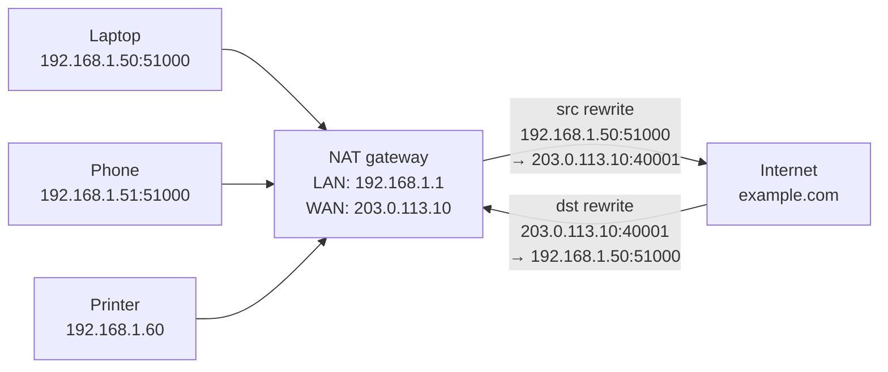

# IP Addressing — IPv4 and IPv6

An **IP address** is the logical address a device uses to be reachable on a network. It is the Layer 3 identifier that lets a packet travel beyond the wire it started on. MAC addresses move a frame across one link; IP addresses move a packet across the Internet.

## Why this matters

Every device on every network has at least one IP — your laptop, your phone, the printer, the IoT thermostat, the cloud VM, the firewall. The address itself encodes a surprising amount of information: whether the host is reachable from the Internet, what kind of network it lives on, whether it has been auto-configured because DHCP failed, whether it is a real address or a placeholder. A SOC analyst who can glance at `192.168.1.50`, `169.254.31.4`, `100.64.0.7` and `2001:db8::1` and immediately know the role and reachability of each is doing in seconds what a beginner needs a wiki page for. This lesson is the recognition vocabulary.

This lesson covers **what IP addresses are and how they're structured**. The math of slicing a network into smaller subnets — CIDR computation, splitting a `/24` into `/26`s, binary refresher — lives in the sibling lesson [Subnetting](./subnetting.md). Read this one first; subnetting only makes sense once you know what you're cutting up.

## IPv4 structure

IPv4 addresses are **32 bits** wide, written as four decimal **octets** (each 0–255) separated by dots — the "dotted-quad" notation:

```
192  .  168  .   1  .  10
 8bit    8bit    8bit   8bit
         32 bits total
```

Every IPv4 address is logically split into two parts:

- **Network portion** — identifies the subnet the host lives on
- **Host portion** — identifies the individual device inside that subnet

The split is defined by the **subnet mask**, written either as a dotted-quad (`255.255.255.0`) or as a CIDR prefix (`/24`). Bits set to 1 in the mask are the network part; bits set to 0 are the host part. Two devices whose network portions match (under the same mask) can reach each other directly at Layer 2; otherwise they must go through a router. The full math of how to compute and split masks lives in [Subnetting](./subnetting.md).

Two addresses in every subnet are reserved by convention: the **network ID** (first address) identifies the subnet itself, and the **broadcast** (last address) reaches every host on it. Neither is assigned to an individual device.

## IPv4 classes

Before CIDR, IPv4 was carved into fixed-size **classes** based on the first octet. Modern networks use classless routing, but the historical class boundaries still describe the **default masks** you'll see on equipment that hasn't been configured otherwise — and the vocabulary lingers in everyday speech.

| Class | First-octet range | Default mask | Prefix | Typical use |
| --- | --- | --- | --- | --- |
| A | 1 – 126 | 255.0.0.0 | /8 | Very large networks |
| B | 128 – 191 | 255.255.0.0 | /16 | Medium networks |
| C | 192 – 223 | 255.255.255.0 | /24 | Small networks |
| D | 224 – 239 | n/a | n/a | Multicast |
| E | 240 – 255 | n/a | n/a | Reserved / experimental |

`127.0.0.0/8` is the loopback range and is excluded from Class A. Classful boundaries were officially replaced by **CIDR (Classless Inter-Domain Routing)** in 1993 — see [Subnetting](./subnetting.md) for how CIDR works in practice.

## Private vs public

Public IPs are globally unique and routable on the Internet — every web server, mail server, and cloud endpoint sits on a public address allocated through an ISP or a Regional Internet Registry. **Private** ranges, defined in **RFC 1918**, are explicitly **not routable on the public Internet**: a packet with a source or destination in `10.0.0.0/8` will be dropped by any properly-configured Internet router. Private addresses exist so that the same blocks can be reused inside every organisation in the world without conflict, with **NAT** (covered below) translating between private and public at the network edge.

| Class | Private range | CIDR | Typical use |
| --- | --- | --- | --- |
| A | 10.0.0.0 – 10.255.255.255 | 10.0.0.0/8 | Large enterprises, clouds |
| B | 172.16.0.0 – 172.31.255.255 | 172.16.0.0/12 | Medium networks, DMZs |
| C | 192.168.0.0 – 192.168.255.255 | 192.168.0.0/16 | Home, small office |

| | Public IP | Private IP |
| --- | --- | --- |
| Other names | WAN IP, global IP | LAN IP, internal IP |
| Internet reachability | Directly routable | Only via NAT |
| Issued by | ISP / cloud provider / RIR | Router / DHCP / admin |
| Uniqueness | Globally unique | Unique only inside your network |
| Example | 173.222.14.238 | 192.168.1.10 |

A typical home: laptop `192.168.1.2`, PC `192.168.1.3`, phone `192.168.1.4` — all private, all reusing the same block as a million other homes. Public services like `example.com` live on a public address. The router on the edge of your LAN is the bridge between the two worlds.

A common warning: **private does not mean safe**. RFC 1918 just means "not directly routed from the Internet." Anything an attacker reaches from inside — AD, file shares, databases — is fair game. Segment by VLAN and firewall, do not assume "internal" equals "secure."

## Special-purpose IPv4 ranges

Beyond the RFC 1918 blocks, several IPv4 ranges have specific meanings. Recognising them on sight saves enormous diagnosis time.

| Range | CIDR | Purpose |
| --- | --- | --- |
| `127.0.0.0` – `127.255.255.255` | `127.0.0.0/8` | Loopback — `127.0.0.1` is "this host" |
| `169.254.0.0` – `169.254.255.255` | `169.254.0.0/16` | APIPA / link-local — DHCP failed |
| `224.0.0.0` – `239.255.255.255` | `224.0.0.0/4` | Multicast (one-to-many delivery) |
| `255.255.255.255` | `/32` | Limited broadcast (this subnet only) |
| `0.0.0.0` | `/32` | "This network" / unspecified / any |
| `100.64.0.0` – `100.127.255.255` | `100.64.0.0/10` | CGNAT (carrier-grade NAT, RFC 6598) |

A few practical notes:

- **Loopback** is used for local service testing — `curl http://127.0.0.1:8080` hits your own machine without ever touching a NIC. A daemon bound to `127.0.0.1` is reachable only from the local host; bound to `0.0.0.0` it accepts traffic from any interface.
- **APIPA** (Automatic Private IP Addressing) is what Windows assigns when no DHCP server answers. Seeing a host with `169.254.x.x` is a strong signal that DHCP is broken — that host can only talk to other APIPA hosts on the same wire, not to the Internet.
- **Multicast** sends one packet to many subscribed receivers — used by routing protocols (OSPF on `224.0.0.5`), service discovery (mDNS on `224.0.0.251`), and IPTV.
- **`0.0.0.0/0`** is the default route — "everything not matched by anything more specific."

## NAT — Network Address Translation

**NAT** translates private addresses into public ones (and back) so that hosts inside a private network can reach the Internet despite their addresses being unrouteable. The router on the edge of the LAN does the translation and typically also serves as the **default gateway** for the inside hosts.

When a private host opens a connection, the NAT gateway rewrites the source IP (and usually the source port) of the outbound packet from the private value to one of its public values, and remembers the mapping in a translation table. Return packets are matched against the table and rewritten back to the original private address before being delivered inside.

Three flavours you should know:

- **Static NAT (1:1)** — one private IP is permanently mapped to one public IP. Used for inbound services where a fixed public address is needed.
- **Dynamic NAT** — a pool of public IPs is shared; each outbound flow grabs the next free public address. Rarely seen today.
- **PAT / NAPT (Port Address Translation, "NAT overload")** — many private hosts share **one** public IP by multiplexing on source ports. This is what every home router does, and it's what most people actually mean by "NAT."

Critically, **NAT is not a security control**. It is an address-rewriting feature that happens to drop unsolicited inbound traffic as a side effect. It does not inspect packets, does not understand applications, and does not protect against any outbound malware connection — once an inside host opens an outbound flow, the return path is wide open. Use a firewall for security; use NAT for addressing.

## DMZ — demilitarized zone

A **DMZ** is a separate network segment isolated between the public Internet and the internal network by firewalls. Public-facing services — web servers, mail relays, reverse proxies, public DNS — live in the DMZ so that a compromise of those Internet-exposed services does not give an attacker direct access to the internal network where the sensitive systems (Active Directory, databases, file servers) live.

```
Internet → [Edge firewall] → DMZ (web, mail, reverse proxy)
                          → [Inner firewall] → Internal (AD, DB, users)
```

The 172.16–31.x private range is often used for DMZ networks by convention, though any private (or public) range works. The point is the **architecture**, not the address: a DMZ exists because there are firewall rules between it and both the Internet and the internal network. Without those rules, it's just another subnet.

## IPv6 structure

IPv6 addresses are **128 bits** wide — an effectively infinite address space — written as eight groups of four hex digits separated by colons:

```
2001:0db8:85a3:0000:0000:8a2e:0370:7334
```

Two compression rules make them tolerable to read and write:

1. **Leading zeros in any group can be dropped** — `0db8` becomes `db8`, `0000` becomes `0`.
2. **One run of consecutive all-zero groups can be collapsed to `::`** — but only one run, otherwise it would be ambiguous.

So the address above shortens to `2001:db8:85a3::8a2e:370:7334`.

Major structural differences from IPv4:

- **No broadcast.** IPv6 dropped broadcast entirely; "all hosts on link" is a multicast group instead.
- **SLAAC (Stateless Address Autoconfiguration).** A host can build its own global IPv6 address from a prefix advertised by the router, no DHCP server required.
- **Multiple addresses per interface are normal.** An interface typically has at least a link-local address plus one or more global addresses simultaneously.
- **Prefix is always CIDR.** There are no IPv6 "classes" — everything is `address/prefix-length` from day one.

The headline IPv6 ranges:

- **Link-local** `fe80::/10` — auto-assigned to every interface, valid only on the local link, never routed
- **Global unicast** `2000::/3` — the Internet-routable equivalent of a public IPv4 address
- **Unique Local Addresses (ULA)** `fc00::/7` — the IPv6 analogue of RFC 1918 private space

## IPv6 special addresses

| Address / Range | Purpose |
| --- | --- |
| `::1/128` | Loopback (equivalent to `127.0.0.1`) |
| `::/128` | Unspecified address (equivalent to `0.0.0.0`) |
| `fe80::/10` | Link-local (auto-assigned per interface) |
| `fc00::/7` | Unique Local Addresses (private, like RFC 1918) |
| `ff00::/8` | Multicast (replaces broadcast) |
| `2000::/3` | Global unicast (Internet-routable) |
| `::ffff:0:0/96` | IPv4-mapped IPv6 (e.g. `::ffff:192.0.2.1`) |

Two everyday examples: `ff02::1` is "all nodes on this link" (the closest IPv6 has to a broadcast), and `ff02::2` is "all routers on this link" — used by SLAAC and Neighbor Discovery.

## Dual-stack and transition

Most networks today run **dual-stack** — IPv4 and IPv6 simultaneously on the same interfaces — because not everything supports IPv6 yet, and the world cannot turn off IPv4 in a single weekend. A modern host will typically have an IPv4 address, an IPv6 link-local, and one or more IPv6 global addresses, all at once. Applications generally prefer IPv6 when both are available (Happy Eyeballs, RFC 8305, races them and uses whichever connects first). Tunnelling and translation technologies (6to4, Teredo, NAT64, DS-Lite) exist for transition edge cases, but pure dual-stack is the norm. When you see an unfamiliar `2001:` or `fe80:` address on a host you thought was "IPv4 only," it is almost certainly because IPv6 has been quietly enabled by default.

## NAT diagram



Inside the LAN, every host sees its own private address. From the Internet's point of view, every connection appears to come from the gateway's single public IP — distinguished only by source port. The translation table on the gateway is what makes return traffic find the correct inside host.

## Hands-on / practice

Five exercises. Do them on your own machine — addresses you read with your own eyes stick.

### 1. Read your own IPv4 and IPv6 addresses

On Windows:

```powershell
ipconfig /all
```

On Linux:

```bash
ip a
```

Find your active interface. Identify: the IPv4 address and mask, the default gateway, every IPv6 address (you will likely see one `fe80::` link-local plus one or more global) and the DNS servers. Write them on paper.

### 2. Classify eight sample addresses

For each address below, decide whether it is private, public, loopback, APIPA, multicast, broadcast, or unspecified. Answers at the end of the lesson — try first, check after.

```
10.20.30.40
8.8.8.8
192.168.0.1
169.254.10.5
127.0.0.1
224.0.0.251
255.255.255.255
172.20.5.7
```

### 3. Trigger and observe APIPA

On a test laptop with no critical traffic, disconnect the cable (or disable Wi-Fi), then `ipconfig /release` (Windows). Reconnect to a network where DHCP is unreachable — for example, plug into an unused switch port. After a few seconds, run `ipconfig` again. You should see a `169.254.x.x` address. That is APIPA — the OS giving up on DHCP and assigning itself a link-local IPv4. Reconnect to a working DHCP network to recover.

### 4. Find your loopback

```bash
ping 127.0.0.1
ping ::1
```

Both should reply almost instantly. They never leave your machine — the kernel short-circuits loopback traffic before it touches any NIC driver. This is also the address you use when testing a local web server with `curl http://127.0.0.1:8080`.

### 5. Decode a compressed IPv6 address

Expand the following to its full eight-group form, restoring all dropped leading zeros and the collapsed `::`:

```
2001:db8::1:0:0:1
```

Hint: count the groups present, work out how many zero-groups the `::` represents, and write each group as four hex digits. Answer: `2001:0db8:0000:0000:0001:0000:0000:0001`.

## Worked example — example.local migrates from flat /16 to a segmented design

`example.local` started small. Day one, the founder rented an office and set up one network: `10.0.0.0/16`, everything on it — laptops, the file server, the printer, the Wi-Fi. DHCP handed out addresses, NAT to the Internet through a consumer router. It worked because there were eight people.

Three years in, there are 180 people, four offices, a public website, a mail server, a few cloud VMs, and a "guest Wi-Fi" that's currently on the same `/16` as payroll. The CISO's first ask is an addressing plan that maps each role to its own subnet behind firewall rules. Here is the rewrite:

| Segment | Range | Routable? | Purpose |
| --- | --- | --- | --- |
| User LAN (HQ) | `10.10.0.0/16` | Private | Employee laptops, phones |
| Server LAN (HQ) | `10.20.0.0/16` | Private | AD, file, print, internal apps |
| DMZ | `172.16.10.0/24` | Private (NATed in) | Public web, reverse proxy |
| Management | `172.16.99.0/24` | Private | Switches, firewalls, OOB |
| Guest Wi-Fi | `192.168.50.0/24` | Private (Internet only) | Visitors, no LAN access |
| Public IP block | `203.0.113.0/29` | Public | Edge firewall, mail, web NAT |
| IPv6 prefix | `2001:db8:1000::/48` | Public | Dual-stack rollout |

Three things to notice. First, the addressing **maps to roles**, not to "whatever was free" — every address tells you what the host does. Second, **public-facing services live in the DMZ**, behind both an edge firewall and an inner firewall — a compromise of the web server cannot pivot directly into AD. Third, an **IPv6 /48** is allocated up front even though IPv6 isn't fully rolled out yet; retrofitting addresses across 180 people later is far more painful than reserving the prefix on day one.

The mechanics of how each `/16` and `/24` was sized — picking the prefix length, computing the network ID, splitting further if needed — is the [Subnetting](./subnetting.md) lesson.

## Troubleshooting & pitfalls

**Duplicate IPs.** Two hosts with the same IP on the same subnet behave erratically — sometimes one answers, sometimes the other, ARP caches flap. On Windows look for "There is an IP address conflict" in the event log; on Linux `arping -D` detects it. Usually caused by a static IP colliding with a DHCP scope.

**APIPA when DHCP fails.** A host with `169.254.x.x` got no answer from any DHCP server. Check the DHCP server is up, the relay is configured on the router, and the scope hasn't been exhausted. The host itself is doing the right thing — it's the infrastructure that's broken.

**An IPv6 address you didn't know you had.** Modern OSes enable IPv6 by default. If you've been ignoring IPv6 in your firewall rules, you may have hosts reachable via IPv6 that you never accounted for. Audit `ip -6 a` on Linux and the IPv6 sections of `ipconfig /all` on Windows.

**NAT hairpinning.** An inside host tries to reach an inside service by its **public** IP (e.g. typing the company website's public DNS name from inside the office). Some NAT gateways drop this — the packet leaves with a public destination, comes back to the same gateway, and the gateway gets confused. Either fix it with hairpin NAT (loopback NAT) configuration or use split-horizon DNS so internal clients resolve the internal IP directly.

**Missing default gateway — "only my LAN works".** If a host can ping everything in its own subnet but nothing outside, it has no default route. Check `ipconfig` / `ip r` for the `0.0.0.0/0` entry. A common cause is a typoed gateway IP that isn't in the host's own subnet.

**Wrong subnet mask.** A host with mask `/16` on a `/24` network thinks distant hosts are local and ARPs for them instead of routing — so it can reach some things and not others, in a pattern that looks random until you look at the mask.

(Answers to the classification exercise: `10.20.30.40` private, `8.8.8.8` public, `192.168.0.1` private, `169.254.10.5` APIPA, `127.0.0.1` loopback, `224.0.0.251` multicast, `255.255.255.255` broadcast, `172.20.5.7` private.)

## Key takeaways

- IPv4 is 32 bits in dotted-quad; IPv6 is 128 bits in colon-hex with `::` shorthand for one zero-run.
- Classes A/B/C/D/E are historical — modern routing is CIDR (covered in [Subnetting](./subnetting.md)).
- RFC 1918 private ranges (`10/8`, `172.16/12`, `192.168/16`) are not routed on the Internet — NAT bridges them.
- Recognise special ranges on sight: `127/8` loopback, `169.254/16` APIPA, `224/4` multicast, `255.255.255.255` broadcast, `0.0.0.0` unspecified.
- NAT is an addressing feature, **not** a security control. Use a firewall for security.
- A DMZ is an isolated segment for Internet-exposed services, separated by firewalls from the internal network.
- IPv6 has no broadcast (multicast only), supports SLAAC autoconfig, and uses `fe80::/10` for link-local and `2000::/3` for global unicast.
- Most networks run dual-stack today — assume your hosts have both IPv4 and IPv6 unless you proved otherwise.
- Plan addressing by **role**, not by "next free range" — every subnet should tell you what's on it.

## References

- RFC 791 — Internet Protocol (IPv4): https://www.rfc-editor.org/rfc/rfc791
- RFC 8200 — IPv6 Specification: https://www.rfc-editor.org/rfc/rfc8200
- RFC 1918 — Address Allocation for Private Internets: https://www.rfc-editor.org/rfc/rfc1918
- RFC 6598 — IANA-Reserved IPv4 Prefix for Shared Address Space (CGNAT): https://www.rfc-editor.org/rfc/rfc6598
- RFC 4291 — IP Version 6 Addressing Architecture: https://www.rfc-editor.org/rfc/rfc4291
- RFC 3927 — Dynamic Configuration of IPv4 Link-Local Addresses (APIPA): https://www.rfc-editor.org/rfc/rfc3927
- IANA IPv4 Special-Purpose Address Registry: https://www.iana.org/assignments/iana-ipv4-special-registry/iana-ipv4-special-registry.xhtml
- IANA IPv6 Special-Purpose Address Registry: https://www.iana.org/assignments/iana-ipv6-special-registry/iana-ipv6-special-registry.xhtml
- Related: [Subnetting](./subnetting.md), [OSI model](./osi-model.md), [TCP/IP model](./tcp-ip-model.md), [Network devices](./network-devices.md), [DHCP](./dhcp.md), [DNS](./dns.md)
