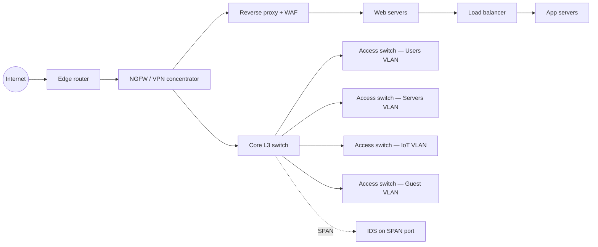

# Network Devices

## Why this matters

Every network you will ever touch — a home office, a campus, a data centre, a cloud VPC — is built out of the same handful of devices. Switches push frames. Routers push packets. Firewalls allow or deny. Load balancers spread work. Proxies stand in the middle. Each one makes a forwarding decision at a specific layer of the stack, and the layer that the device operates at tells you exactly what it can see, what it can protect, and what it is blind to. A switch cannot block a SQL injection. A WAF cannot stop a ping flood. A NAT gateway is not a firewall, no matter how often a vendor's marketing slide says otherwise.

Get the layer wrong and the control is theatre. Put an IDS where it cannot see the traffic and it will never alert. Buy a Layer-4 load balancer for a Layer-7 problem and you will be confused for years. Trust NAT to keep your internal services safe and the next outbound connection from a compromised laptop will prove you wrong. This lesson maps every device you are likely to meet in your first five years of infosec work to its layer, its decision input, its typical placement, and the security implications that follow. Once the **decision-by-layer** principle clicks, every architecture diagram you read becomes legible — and the questions on every design review answer themselves.

The deeper material — stateful firewall internals, IDS tuning, NGFW deep packet inspection, segmentation patterns — lives in the intermediate and advanced lessons. Here we stay at the foundation: what each device is, where it sits, and what it can and cannot do. For the layer model itself, see [the OSI model](./osi-model.md) and [the TCP/IP model](./tcp-ip-model.md). For the L2 mechanics behind switches, see [Ethernet and ARP](./ethernet-and-arp.md). When you start designing networks, [secure network design](../secure-design/secure-network-design.md) and [secure protocols](../secure-design/secure-protocols.md) extend everything below.

## The decision-by-layer principle

Every networking device makes a single forwarding decision and makes it at a specific layer. The layer dictates which header field it reads, which means it also dictates what the device can possibly know about the traffic. A switch that only reads MAC addresses cannot distinguish a legitimate HTTPS connection from a beacon to a C2 server — both look like Ethernet frames. A WAF that reads HTTP request bodies cannot tell you which physical port the laptop is plugged into. Layer awareness is everything.

| Device | OSI layer | Decision input |
|---|---|---|
| Hub | 1 | None — repeats every bit out of every port |
| Switch | 2 | Destination MAC, looked up in CAM table |
| Router | 3 | Destination IP, longest-prefix match in routing table |
| Stateless firewall | 3–4 | 5-tuple (proto, src IP, src port, dst IP, dst port), per packet |
| Stateful firewall | 3–4 | 5-tuple plus connection state table |
| Next-gen firewall (NGFW) | 3–7 | All of stateful, plus app-ID, user-ID, optional TLS inspection |
| Load balancer (L4) | 4 | 5-tuple plus pool health |
| Load balancer (L7) | 7 | HTTP method/host/path/header plus pool health |
| Forward proxy | 7 | Outbound HTTP/S request from a client |
| Reverse proxy | 7 | Inbound HTTP/S request to a server |
| IDS / IPS | 3–7 | Signature or anomaly match across packet/flow |
| WAF | 7 | HTTP request structure and payload |
| NAT gateway | 3 (with port awareness for PAT) | Source/destination address rewrite |
| VPN concentrator | 3 | Tunnel termination plus routing |

The mental model: pick the lowest layer at which the decision can be made. A frame to the printer next door does not need a router. A rule that allows TCP 443 to your web server does not need an NGFW. A check that blocks `' OR 1=1 --` in a login form does need Layer 7. Match the layer to the problem and the architecture stays simple.

## Layer 1 — hubs and repeaters

A **hub** is a Layer-1 device that repeats every incoming bit out of every other port. It has no idea what a MAC address is, no idea what a frame is. If two hosts transmit at the same time, they collide and both retransmit. Every port shares one **collision domain** and one **broadcast domain**. A **repeater** is the same idea with two ports — it boosts the signal so a longer cable can still deliver clean bits.

In modern networks, hubs are extinct. The only places you still see them are old industrial control rooms, deliberate test setups, and the occasional thrift-store router from 2002. Their security implication is severe and one-sentence: **everyone on a hub can sniff everyone else's traffic for free**, because every frame goes to every port. If a regulator or auditor finds a hub on a production network, replace it before you finish the meeting.

## Layer 2 — switches

A **switch** is the Layer-2 workhorse of every modern LAN. When a frame arrives, the switch reads the destination MAC, looks it up in the **CAM table** (also called the MAC address table), and forwards the frame only to the port where that MAC lives. If the MAC is unknown, the switch **floods** the frame out of every port in the VLAN except the one it came in on, and learns the source MAC's port for next time. Broadcasts (`FF:FF:FF:FF:FF:FF`) and multicasts go to every port in the VLAN by design.

Switches come in two flavours that look identical from the front but behave very differently:

- **Unmanaged switch** — plug it in, it works. No web UI, no console, no VLANs, no monitoring. Fine for a four-port desk hub at home; never appropriate for a business network because you cannot see what is on it.
- **Managed switch** — has a console port, an IP address for management, and a configuration. Supports VLANs, port security, port mirroring (SPAN), spanning-tree, link aggregation, 802.1X, SNMP. This is what every office, branch, and data centre runs.

Common managed-switch features that you will meet immediately:

- **VLANs and 802.1Q trunking** — splits one physical switch into many logical switches, so users, servers, IoT devices, printers, and guest Wi-Fi each live in their own broadcast domain. A **trunk** port carries multiple VLANs between switches by tagging each frame.
- **Port security** — limits how many MAC addresses can appear on a port; can shut down the port if a new MAC shows up. Stops users plugging in their own switch under the desk.
- **Port mirroring (SPAN)** — copies traffic from one or more ports to a monitor port, so an IDS or packet-capture box can see it without being inline.
- **DHCP snooping and Dynamic ARP Inspection (DAI)** — protect against rogue DHCP servers and ARP spoofing. Covered in depth in [Ethernet and ARP](./ethernet-and-arp.md).

A switch is the right tool to **segment** a LAN, but it cannot inspect anything above its own headers. Two hosts in the same VLAN can talk freely; if you need a policy decision between them, you need a Layer-3 device.

## Layer 3 — routers

A **router** is a Layer-3 device that forwards packets between networks. Where a switch reads MACs, a router reads the destination IP, looks it up in the **routing table**, finds the **next-hop** address, and forwards the packet out the corresponding interface — rewriting the Layer-2 header on the way out. Every packet that leaves a subnet crosses at least one router; the **default gateway** is just the router that handles "everything else."

The routing table itself is a list of `network → next-hop / interface` rules sorted by prefix length. The router uses **longest-prefix match**: if `10.0.0.0/8` and `10.0.1.0/24` both match a packet, the `/24` wins because it is more specific. The catch-all `0.0.0.0/0` — the **default route** — is what you fall back to when nothing more specific matches. Routes can be **static** (typed in by an admin) or **dynamic** (learned from a neighbour via OSPF, EIGRP, BGP). On a small network, static routes are fine; in anything that grows, dynamic routing is what stops the routing table going out of sync.

**Route redistribution** is the act of teaching one routing protocol about routes learned from another (e.g. OSPF learning a static route, or BGP learning OSPF routes). It is powerful and famously the source of routing loops when done carelessly — always set a metric and a route-tag, and filter what you redistribute.

A common deployment for VLANs without a Layer-3 switch is **router-on-a-stick** (also called one-arm routing): a single physical router interface carries an 802.1Q trunk with multiple VLAN sub-interfaces, and the router routes between them. It is cheap, it works, and it bottlenecks at the router's backplane — fine for a branch office, never for a data centre.

## Firewalls — stateless vs stateful vs NGFW

A **firewall** enforces an allow/deny policy on traffic crossing a boundary. The three generations you will see:

| Class | Layer | What it inspects | Can it allow return traffic automatically? | Can it block by app? |
|---|---|---|---|---|
| Stateless (packet filter / ACL) | 3–4 | Single packet's 5-tuple | No — you must write the reverse rule by hand | No |
| Stateful | 3–4 | 5-tuple plus connection state table | Yes — return traffic for established sessions is allowed | No |
| NGFW (next-generation) | 3–7 | All of stateful, plus app-ID, user-ID, IPS, optional TLS inspection | Yes | Yes (e.g. block "BitTorrent" regardless of port) |

Two rules of thumb that will save you hours:

- **Rule order matters.** Firewalls evaluate rules top-down and stop at the first match. A broad allow rule above a narrow deny rule will silently negate the deny. Always end with `deny any any` and audit the order regularly.
- **A stateful firewall replaces two stateless rules with one.** Where a stateless ACL needs `permit tcp client → server eq 443` and `permit tcp server → client established`, a stateful firewall needs only the first rule and tracks the return automatically.

The intermediate and advanced lessons go deep on rule writing, NGFW capabilities, and TLS inspection trade-offs. At the foundation level, know which generation you are looking at and what each can and cannot see.

## Load balancers

A **load balancer** spreads incoming connections across a pool of backend servers so no single server is overwhelmed and any one server can fail without taking the service down. The two flavours:

- **Layer 4 (transport)** — distributes TCP/UDP connections by 5-tuple. Fast, simple, blind to the request content. Cannot route by URL path, cannot terminate TLS, cannot insert headers. Good fit for protocols where the only knob is "send to a healthy backend" — SMTP relays, RDP farms, raw database front-ends.
- **Layer 7 (application)** — terminates the TCP connection, parses the HTTP request, can route by `Host`, path, header, cookie, or method, can rewrite headers, can terminate TLS and re-encrypt to the backend, often hosts a WAF in front of the pool. The default for any modern web service.

Common scheduling algorithms:

- **Round-robin** — next request to the next backend in order. Simple, fine for short uniform requests.
- **Least connections** — next request to the backend with the fewest active connections. Better when request durations vary.
- **Source IP hash** — same client always lands on the same backend. Used for sticky sessions before session storage was externalised.
- **Weighted variants** — weight each backend by capacity (a 16-core server gets twice the share of an 8-core one).

**Health checks** are non-optional: the load balancer probes each backend on a schedule (TCP connect, HTTP `GET /healthz`, custom script) and removes failing backends from the pool. A misconfigured health check that always returns `200 OK` defeats the entire point of having a pool.

## Proxies — forward vs reverse

Both kinds of proxy are Layer-7 devices that sit between a client and a server. The direction is what differs.

- **Forward proxy** — sits between **your users** and the **Internet**. Outbound traffic from inside your network goes through the proxy on its way out. Used for content filtering (block known-bad categories), data-loss prevention (inspect outbound for sensitive data), authenticated egress (every request is logged with the user), bandwidth control, and caching. Squid is the classic; SASE/SSE platforms are the modern cloud-delivered version.
- **Reverse proxy** — sits between **the Internet** and **your servers**. Inbound traffic to your services goes through the proxy first. Used for TLS termination, caching of static content, request routing across several backend services, hosting a WAF, hiding the real backend from the public, and load balancing. NGINX, HAProxy, Envoy, Traefik, and every CDN edge are reverse proxies.

The same product can play both roles depending on configuration; the distinction is which side it is "fronting." A useful mnemonic: a **forward** proxy faces forward (out of the org, toward the Internet); a **reverse** proxy faces back (into the org, toward your servers).

## IDS / IPS

Both are detection devices that look at traffic and decide whether it is malicious. The difference is what they do about it.

- **IDS — Intrusion Detection System** — passive. Sees a copy of the traffic via a SPAN port or network tap. Generates alerts. Cannot block. If nobody reads the alerts, it does nothing useful.
- **IPS — Intrusion Prevention System** — inline. Sits in the path of the traffic. Generates alerts and drops/resets matching connections. A misconfigured IPS rule can take production down.

Both use two detection styles, often combined:

- **Signature-based** — matches known patterns (a specific exploit's payload, a known malware C2 string). Cheap, fast, no false positives on the rule itself, but blind to anything not yet in the rule set.
- **Anomaly-based** — flags traffic that deviates from a learned baseline (sudden traffic to a country you never talk to, a host beaconing every 60 seconds, an unusual port). Catches novel attacks but produces more false positives and requires tuning.

**Placement** is the part that beginners get wrong. An IDS lives off a SPAN port or tap so it can read traffic without being in the path — a failure of the IDS does not break the network. An IPS lives inline, usually next to or inside the firewall, so it can drop packets — a failure of the IPS *can* break the network, so you design for fail-open or high availability. The deeper tuning, signature management, and detection engineering are intermediate-level material; for now, know the placement rule and that **an IDS without anyone watching the alerts is theatre**.

## WAF — Web Application Firewall

A **WAF** is a Layer-7 firewall that inspects HTTP and HTTPS requests for application-layer attacks: SQL injection, cross-site scripting, command injection, path traversal, the rest of the OWASP Top 10. It sits in front of a web application — typically as a reverse-proxy module, a CDN feature, or a dedicated appliance — and either blocks or alerts on requests that match its rules.

The most common rule set is the **OWASP Core Rule Set (CRS)**, an open, community-maintained collection that covers the standard attack patterns. Vendors layer their own rules on top, plus per-application virtual patches. WAFs are typically run in two modes during rollout: **monitor-only** (log what would have been blocked) for tuning, then **block** once false positives are wrung out. The pitfall is staying in monitor-only forever — alerts that nothing acts on are no defence at all.

A WAF is not a substitute for writing safe code. It catches known attack shapes; a determined attacker who finds a logic bug in your application will sail past it. Use a WAF as a defence-in-depth layer, not as the only defence.

## NAT gateway

**NAT — Network Address Translation** rewrites the IP addresses (and often ports) in a packet as it crosses a boundary. The three modes you will meet:

- **SNAT (Source NAT)** — rewrites the source address. Used so internal hosts on private addresses can reach the Internet under a shared public address.
- **DNAT (Destination NAT)** — rewrites the destination address. Used to expose an internal service to the Internet (Internet → public IP → DNAT → internal server).
- **PAT (Port Address Translation), aka NAT overload** — many internal hosts share one public IP by also rewriting the source port. The default behaviour of every consumer router.

NAT is a routing trick, not a security control. The fact that home routers bundle NAT and a firewall together has convinced a generation of users that NAT itself is a firewall. It is not. NAT will happily forward an outbound connection from a compromised laptop to any C2 server on the Internet, and will happily forward the response back. The state table NAT maintains looks superficially like a firewall's, but it is built to translate addresses, not to enforce policy. **NAT is not a firewall.** Run an actual stateful firewall alongside it.

## VPN concentrators

A **VPN concentrator** terminates encrypted tunnels at the perimeter of your network — often as a feature of the firewall, sometimes as a dedicated appliance. Two flavours, two use cases:

- **Site-to-site VPN** — a permanent encrypted tunnel between two networks (HQ and branch, on-prem and cloud). Usually **IPsec** (IKEv2 + ESP) at Layer 3, terminating on routers or firewalls at each end. Users see no client; the tunnel is invisible.
- **Remote access VPN** — individual users connect from a laptop into the corporate network. Historically IPsec; now mostly **SSL/TLS VPN** (OpenVPN, WireGuard with TLS, vendor clients) because it traverses NAT and corporate firewalls more easily and only needs the standard HTTPS port outbound.

Placement is at the perimeter — the concentrator sits where the encrypted tunnel meets the internal network, so traffic decrypted at the concentrator can then be inspected by the firewall, IDS, and other controls. A VPN that drops users straight onto the LAN with no segmentation is a flat-network problem with extra steps; modern designs route remote-access traffic through the same policy stack as on-premises traffic.

## Network device diagram

A representative mid-size `example.local` network, with a public web service in a DMZ behind a reverse proxy and WAF.

Read it once: every device is at exactly one layer, in exactly one place, doing exactly one job. That is the goal of a clean design.

## Hands-on / practice

Four exercises. Do them on paper or in a lab; none require expensive kit.

### 1. Match the device to the problem

For each scenario, name the **single best** device and the layer it operates at:

1. Block all inbound traffic to a server except TCP 443.
2. Stop a contractor's laptop from talking to the finance VLAN at Layer 2.
3. Spread incoming HTTP requests across five identical web servers and route `/api/*` to a different pool than `/`.
4. Detect (but not block) a host beaconing to a known malicious IP every 30 seconds.
5. Allow staff to reach the Internet from inside the network while logging every request by username.
6. Reject HTTP requests that look like SQL injection before they hit the web app.
7. Translate a single public IP into many internal hosts so they can browse the web.
8. Let a remote employee on a coffee-shop Wi-Fi reach internal resources securely.

(Answers — write yours first: 1 stateful firewall, L3–4. 2 managed switch with VLANs, L2. 3 L7 load balancer, L7. 4 IDS, L3–7. 5 forward proxy, L7. 6 WAF, L7. 7 NAT gateway / PAT, L3. 8 VPN concentrator, L3.)

### 2. Map a network diagram

Find a network diagram of your office, lab, or a sample reference architecture from a vendor. For every box on it, write down (a) the device class, (b) the OSI layer it operates at, and (c) one thing it can see and one thing it cannot. If you cannot answer (c) for a box, you do not yet understand what is on the diagram.

### 3. Configure a basic ACL on a virtual router

Spin up a free virtual router (VyOS, pfSense, or a Cisco IOSv image in GNS3 / EVE-NG / Containerlab). Configure two interfaces on different subnets and write an ACL that:

- Permits established/related return traffic.
- Permits TCP 443 inbound from `any` to a single web-server IP.
- Permits TCP 22 inbound only from your jump-host's IP.
- Denies and logs everything else.

Test it from a host in each subnet. Try to reach the web server from an unauthorised source; confirm the deny shows up in the log.

### 4. Place an IDS span port

On a managed switch (a virtual one is fine — Open vSwitch in a lab works), pick the inter-VLAN trunk port, configure SPAN to mirror its traffic to a monitor port, and connect a packet capture host. Run a simple test (browse to a known IP from one VLAN; verify the capture sees the traffic). The exercise is the *placement* — the SPAN port must see the traffic you want the IDS to watch, or the IDS will be silent.

## Worked example — `example.local` redesigning the home-office network

`example.local` started life as a one-room consultancy with a single 8-port unmanaged switch behind a consumer Wi-Fi router. Everything was on `192.168.1.0/24`: laptops, the office printer, the founder's smart TV, two web servers running the public booking app, the bookkeeping PC, and a NAS full of client files. After a phishing incident exposed the bookkeeping PC, the founder asked for a redesign without enterprise budget.

The new design follows the layer principle:

- **Edge** — a small business router replaces the consumer Wi-Fi router. The router runs static routes between subnets and points the default route at the ISP.
- **Stateful firewall** — a low-cost firewall appliance (or pfSense on a small box) sits between the router and the internal network. Every inter-VLAN flow is policy-controlled. NAT is enabled, but the firewall is what is doing the security work, not NAT.
- **Managed switch with VLANs** — the unmanaged switch is replaced with a managed one. Four VLANs are defined: `Users` (laptops), `Servers` (NAS, internal app), `IoT` (TV, printer, smart bulbs), `Guest` (visitors and personal phones). Each VLAN is its own broadcast domain; inter-VLAN traffic crosses the firewall.
- **DMZ for the public web app** — the two web servers move into a DMZ VLAN. A reverse proxy with a WAF (NGINX with the OWASP CRS, or a lightweight commercial appliance) terminates TLS and inspects requests before they reach the web servers. Only the reverse proxy is exposed publicly via DNAT; the web servers themselves are not directly reachable.
- **Wi-Fi for guests** — the guest SSID maps to the Guest VLAN, which has Internet access only and no route to any internal subnet.
- **VPN for remote work** — the firewall's built-in SSL/TLS VPN gives the founder access from outside the office; the VPN drops users into a dedicated subnet that only reaches the resources they need.

The total spend is one managed switch, one small firewall, and a few hours of configuration. The result: a flat, defenceless LAN becomes a properly segmented network where a compromised IoT device cannot reach the NAS, a guest cannot see the bookkeeping PC, and the public web app sits behind a WAF instead of being exposed raw to the Internet. Every change is justifiable by the same principle: pick the lowest layer at which the decision can be made, and put a device there that can make it.

## Troubleshooting & pitfalls

**Confusing managed and unmanaged switches.** They look identical from the front. An unmanaged switch has no VLANs, no monitoring, no security features — it is a dumb box. If you "configured the VLAN" but cannot find it in the web UI, you are probably staring at an unmanaged switch.

**An IDS without monitoring is theatre.** Buying an IDS, deploying it, and never reading its alerts is a control that exists on paper and nowhere else. Either staff the alert queue or do not pretend to have detection.

**A WAF stuck in monitor-only forever.** Monitor-only mode is for tuning, not for production. If the WAF has been "about to flip to block" for two years, it is detecting nothing useful — the alerts are being ignored. Set a deadline, fix the false positives, flip the switch.

**Treating NAT as a security control.** NAT translates addresses; it does not inspect. A compromised host inside will happily make outbound C2 connections through the NAT gateway and the responses will come straight back. Always run a real stateful firewall.

**Static routes that loop.** Two routers each pointing the other as the next hop for the same network sends every packet ping-ponging until TTL hits zero. Always check `traceroute` after changing static routes; a loop shows up as the same two hops repeating.

**Putting an L4 load balancer in front of an L7 problem.** If you need to route by URL path, host header, or cookie, an L4 balancer cannot do it — the bytes it forwards are opaque TCP. Pick L7 from the start, or you will rebuild later.

**Trunk port misconfiguration.** A managed-switch trunk that is missing a VLAN, or has the wrong native VLAN, manifests as "everything works except hosts in VLAN X." Always check trunk allowed-VLAN lists when a single VLAN is the only one broken.

## Key takeaways

- Every networking device makes a forwarding decision at a specific layer. The layer dictates what the device can possibly see.
- Hubs are extinct; if you find one, replace it.
- Managed switches are non-negotiable for any network bigger than a desk: VLANs, port security, port mirroring, and 802.1X are all there.
- Stateful firewalls replaced stateless packet filters for a reason; NGFWs add Layer-7 awareness on top.
- Load balancers come in L4 and L7 flavours — pick the layer your decision actually needs.
- Forward proxies face out (filter user egress); reverse proxies face in (front your servers).
- IDS is passive on a SPAN port; IPS is inline. Both are useless without people watching the alerts.
- A WAF is Layer-7 only and complements, never replaces, secure code.
- NAT is not a firewall, monitor-only is not blocking, and any device "configured" without verification is unconfigured.
- Match the layer to the problem, and the architecture writes itself.

## References

- RFC 1812 — Requirements for IP Version 4 Routers: https://www.rfc-editor.org/rfc/rfc1812
- RFC 2663 — IP Network Address Translator (NAT) Terminology and Considerations: https://www.rfc-editor.org/rfc/rfc2663
- NIST SP 800-41 Rev. 1 — Guidelines on Firewalls and Firewall Policy: https://csrc.nist.gov/publications/detail/sp/800-41/rev-1/final
- NIST SP 800-94 — Guide to Intrusion Detection and Prevention Systems (IDPS): https://csrc.nist.gov/publications/detail/sp/800-94/final
- NIST SP 800-77 Rev. 1 — Guide to IPsec VPNs: https://csrc.nist.gov/publications/detail/sp/800-77/rev-1/final
- OWASP Core Rule Set (CRS): https://coreruleset.org/
- OWASP Web Application Firewall: https://owasp.org/www-community/Web_Application_Firewall
- Cisco — Catalyst Switch device taxonomy and feature overview: https://www.cisco.com/c/en/us/products/switches/catalyst-9000.html
- Cloudflare Learning Center — What is a reverse proxy: https://www.cloudflare.com/learning/cdn/glossary/reverse-proxy/
- Cloudflare Learning Center — What is a load balancer: https://www.cloudflare.com/learning/performance/what-is-load-balancing/
