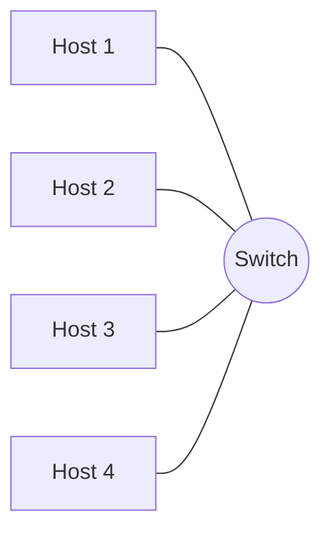
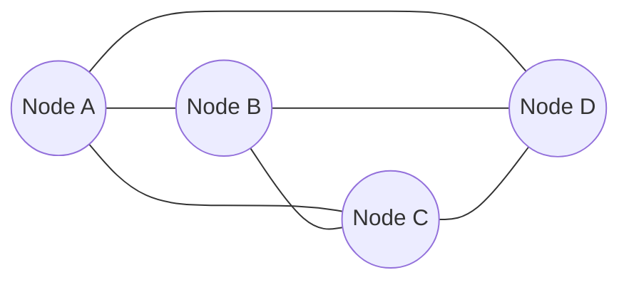

# Network Types and Topology

## Why this matters

Before you wire a single cable or click a single button in a cloud console, somebody has to answer two questions: *what kind of network is this* and *what shape will it have*. The answer determines almost everything that follows — the hardware budget, the failure modes, the security boundaries, the protocols you can use, even the staffing model. A campus LAN connecting two thousand laptops to a file share is not the same problem as a SAN moving block I/O between a hypervisor and an array, and a SAN is not the same problem as a WAN backhaul stretching from `example.local` headquarters to a branch office on the other side of a country. The wires look similar; the engineering is not.

The same applies to **topology**. A pure star is cheap and easy to manage but the central switch is a single point of failure for every host hanging off it. A full mesh is gloriously resilient but the link count grows quadratically with the node count, so a 20-node mesh needs 190 links and a 100-node mesh needs 4,950. Most real networks pick a hybrid — physical star at the access layer, logical partial mesh at the core — for reasons that only make sense once you have lived with the trade-offs of each pure form. This lesson gives you the vocabulary and the trade-offs so the rest of the foundation track (the [OSI model](./osi-model.md), [TCP/IP model](./tcp-ip-model.md), [Ethernet and ARP](./ethernet-and-arp.md), [network devices](./network-devices.md), [IP addressing](./ip-addressing.md)) lands on a solid mental model of *where everything actually lives*.

## What is a network

A **network** is just three things in agreement: **devices** that want to talk, a **medium** that carries the signal between them, and a **protocol** that says what the signal means. The devices can be laptops, phones, servers, printers, cameras, sensors, virtual machines, or containers. The medium can be copper twisted pair, fibre optic, radio, satellite, or even infrared in some legacy IoT cases. The protocol is the agreement: TCP/IP at the bottom, then DNS, DHCP, HTTP, TLS, and the dozens of others that make the network usable.

Take any one of those three away and you have nothing. Two laptops with the same Ethernet cable but no agreed-upon protocol can pass voltage but cannot pass meaning. Two laptops running TCP/IP perfectly with no medium between them cannot talk at all. Networking, end-to-end, is the discipline of making all three agree at the same time across thousands of independent components built by hundreds of vendors over fifty years — which is why standards bodies like the IEEE and the IETF exist, and why this material spends so much time on protocols.

## Types of area networks

The classification below sorts networks by **scope** — how far they physically (or logically) reach. Scope drives everything else: bandwidth, latency, ownership, the hardware involved, and how you secure it.

| Type | Scope | Typical scale | Examples | Where used |
|---|---|---|---|---|
| **LAN** (Local Area Network) | One building or floor | Tens to thousands of hosts | Office Ethernet, home network | The default network you sit on at a desk |
| **WLAN** (Wireless LAN) | Same as LAN, wireless medium | Tens to hundreds of clients per AP | Office Wi-Fi, home Wi-Fi | Anywhere mobility matters |
| **PAN** (Personal Area Network) | Around one person, ~1–10 m | A handful of devices | Bluetooth headphones, smartwatch, phone tether | Wearables, peripherals |
| **CAN** (Campus Area Network) | A group of nearby buildings | Thousands of hosts | University campus, corporate HQ park | Multi-building single-owner sites |
| **MAN** (Metropolitan Area Network) | A city or large district | Tens of thousands | City fibre rings, ISP metro networks | Carriers, municipal networks |
| **WAN** (Wide Area Network) | Country, continent, global | Unlimited | The Internet, MPLS backbones | Anything between cities |
| **SAN** (Storage Area Network) | Data centre row or rack | Storage arrays plus servers | Fibre Channel fabric, iSCSI fabric | Block storage to hypervisors and DB hosts |
| **VPN** (Virtual Private Network) | Logical, rides over a WAN | Two endpoints to thousands | Site-to-site IPsec, remote-access OpenVPN/WireGuard | Private overlay across a public WAN |

A few clarifications worth memorising. A **WLAN** is not a different network type from a **LAN** — it is a LAN whose medium is radio instead of cable, and it almost always plugs into a wired LAN at an access point. A **CAN** is just a LAN that grew up to span multiple buildings; the line between CAN and large LAN is fuzzy. A **MAN** is normally owned by an ISP or municipality, not by you. The **Internet** is the world's biggest WAN — a WAN of WANs — and the protocol that holds it together is BGP. A **SAN** carries *block* I/O (disk reads and writes) and is usually confused with NAS, which carries *file* I/O over a regular LAN; the troubleshooting section below revisits this. A **VPN** is not a physical network at all — it is an encrypted tunnel layered on top of an existing WAN (almost always the Internet), and it only feels like a private LAN because the tunnel hides the public hops in the middle. For wireless specifics see [Wireless Security](../secure-design/wireless-security.md); for designing segmentation across these types see [Secure Network Design](../secure-design/secure-network-design.md).

Two more terms you will see in the wild. **Intranet** is just an organisation's private network, usually a LAN or set of LANs joined by VPN/WAN, scoped to staff. **Extranet** is the same idea extended to a controlled set of outsiders — partners, suppliers, contractors — usually via VPN or a tightly firewalled DMZ. Neither is a separate physical type; both are policy and access labels on top of LAN/WAN/VPN technology you already know.

## Physical vs logical topology

Two networks can have identical physical wiring and behave completely differently, because **physical topology** (which cable goes where) is not the same as **logical topology** (how traffic actually flows).

The **physical topology** is what you would draw with a flashlight in the cable tray: every cable, every port, every patch panel. Almost every modern wired LAN is physically a **star** — every host plugs into a central switch — because that is what structured cabling pulls back to a wiring closet. The **logical topology** is what you would draw if you traced packets: which host can reach which, through which broadcast domains, across which VLANs and routing boundaries. The same star-wired switch can host one big flat broadcast domain, three isolated VLANs, or a partial mesh of point-to-point Layer-3 links to other switches — same cables, different logic. Wireless is similar: physically every client talks to one access point (a star at the radio), but logically a mesh Wi-Fi deployment forms a partial mesh between the APs themselves. Whenever you read a topology diagram, ask which one it is showing.

## Common topologies

Each of the six classical topologies below has a characteristic shape, a characteristic failure mode, and a characteristic place where it still earns its keep.

### Star

```
          ┌──────┐
          │ Host │
          └──┬───┘
             │
   ┌─────┐   │   ┌─────┐
   │Host ├───┼───┤ Host│
   └─────┘   │   └─────┘
          ┌──┴───┐
          │Switch│
          └──┬───┘
          ┌──┴───┐
          │ Host │
          └──────┘
```

Every host has its own dedicated link to a central switch. **Pros:** simplest cabling, easy to add or remove a host without disturbing others, easy fault isolation (a bad cable affects one port, not the whole LAN). **Cons:** the central switch is a single point of failure for everyone hanging off it. **Typical use case:** essentially every wired access layer on Earth — every office floor, every home router with four LAN ports, every server rack's top-of-rack switch.

### Bus

```
   ┌─────┐   ┌─────┐   ┌─────┐   ┌─────┐
   │Host │   │Host │   │Host │   │Host │
   └──┬──┘   └──┬──┘   └──┬──┘   └──┬──┘
      │         │         │         │
   ═══╧═════════╧═════════╧═════════╧═══   shared coax bus
```

All hosts share one physical cable (classically a thick or thin coax). **Pros:** trivially cheap; no active equipment in the middle. **Cons:** every host hears every transmission so you need collision avoidance (CSMA/CD); a single break anywhere takes the whole segment down; the longer the cable, the harder it is to terminate correctly. **Typical use case:** historical 10BASE2/10BASE5 Ethernet, and the CAN bus inside a car. You will not build a new bus LAN today.

### Ring

```
        ┌──────┐
   ┌────┤ Host ├────┐
   │    └──────┘    │
┌──┴───┐         ┌──┴───┐
│ Host │         │ Host │
└──┬───┘         └──┬───┘
   │    ┌──────┐    │
   └────┤ Host ├────┘
        └──────┘
```

Each node connects to exactly two neighbours, forming a closed loop; data travels around the ring. **Pros:** predictable, deterministic timing; easy to extend by inserting a node. **Cons:** a single break stops traffic unless the ring is dual-counter-rotating (FDDI, SONET, Token Ring with redundancy); harder to troubleshoot than a star. **Typical use case:** legacy Token Ring; modern metropolitan fibre rings (SONET/SDH, Resilient Ethernet Protocol) where the ring topology gives sub-50 ms failover.

### Mesh

```
    ┌──────┐ ─────────── ┌──────┐
    │Node A├─────────────┤Node B│
    └───┬──┘             └──┬───┘
        │  \             /  │
        │    \         /    │
        │      \     /      │
        │        X          │
        │      /   \        │
        │    /       \      │
        │  /           \    │
    ┌───┴──┐             ┌──┴───┐
    │Node D├─────────────┤Node C│
    └──────┘ ─────────── └──────┘
```

Every node connects to every other node (full mesh), or to most of them (partial mesh). **Pros:** maximum resilience — multiple paths between any two nodes, so a link or node failure rarely partitions the network. **Cons:** the link count for a full mesh is `n × (n-1) / 2`, so cost and complexity explode with node count; impractical past about a dozen nodes. **Typical use case:** WAN backbones (partial mesh between core routers), Wi-Fi mesh systems for whole-home coverage, and high-availability DC fabrics like spine-leaf (a partial mesh in a structured pattern).

### Tree (hierarchical)

```
                  ┌──────────┐
                  │ Core sw  │
                  └────┬─────┘
              ┌────────┴────────┐
        ┌────┴────┐        ┌────┴────┐
        │ Distrib │        │ Distrib │
        └────┬────┘        └────┬────┘
       ┌────┴────┐         ┌────┴────┐
   ┌───┴──┐  ┌───┴──┐  ┌───┴──┐  ┌───┴──┐
   │Access│  │Access│  │Access│  │Access│
   └──────┘  └──────┘  └──────┘  └──────┘
```

A hierarchy of stars: access switches uplink to distribution switches, which uplink to a core. **Pros:** scales cleanly to thousands of hosts; clear fault domains per layer; matches the physical layout of multi-floor buildings. **Cons:** an upper-layer failure cuts off everything below it (mitigated with redundant uplinks, MLAG/LACP, and STP); requires careful capacity planning at each layer. **Typical use case:** the classic Cisco three-tier campus design — still the dominant pattern in enterprise LANs and the implicit shape of most cloud VPCs.

### Hybrid

Almost every real network is a **hybrid** because no single topology answers every requirement. A typical enterprise is a tree at the campus layer, a partial mesh at the core, a star at every access switch, a ring on the metro fibre between buildings, and a Wi-Fi mesh in the warehouse. The art is matching each topology to the part of the network where its trade-offs make sense, and documenting clearly which is which so the next engineer does not have to guess.

## Topology mermaid diagrams

A **star** topology — one switch, four hosts:



A **full mesh** of four nodes — every node directly connected to every other node, six links total:



For four nodes that is `4 × 3 / 2 = 6` links; for ten nodes it would be `45`; for a hundred, `4,950`. The quadratic blow-up is why full mesh stops scaling almost immediately.

In practice, what you see at scale is a **partial mesh** — every core node connects to several other core nodes but not all of them — which keeps most of the resilience benefit while keeping the link count manageable. Modern data-centre **spine-leaf** fabrics are exactly this: every leaf switch connects to every spine switch, but leaves do not connect to leaves and spines do not connect to spines.

## Switching vs routing

The two basic forwarding decisions a network has to make are **switching** and **routing**, and the difference is where traffic *can* go.

**Switching** happens at Layer 2 inside a single broadcast domain. A switch reads the destination MAC of an Ethernet frame, looks it up in its CAM table, and forwards the frame out the matching port — fast, simple, and bounded by the size of one VLAN. Everything in the same broadcast domain hears the same broadcasts (ARP who-has, DHCP Discover) and cannot reach anything outside the domain at all without help. For the deep dive on MACs, frames, CAM tables, and VLAN tagging, see [Ethernet and ARP](./ethernet-and-arp.md).

**Routing** happens at Layer 3 *between* broadcast domains. A router reads the destination IP of a packet, looks it up in its routing table, and forwards the packet out the interface toward the next hop — possibly rewriting the L2 header along the way. Routing is what lets traffic cross between subnets, between sites, and ultimately across the public Internet. For the deep dive on what routers, L3 switches, firewalls, and load balancers actually do, see [Network Devices](./network-devices.md). The single most important rule to internalise: **switching keeps you inside the box, routing gets you out of it.**

## Communication patterns

Independently of topology, every transmission has a **delivery model** — how many recipients the sender intends to reach. There are four classical patterns.

| Pattern | Cardinality | Meaning | Example protocols |
|---|---|---|---|
| **Unicast** | One-to-one | A single sender, a single receiver | HTTP, SSH, SMTP, almost every TCP session |
| **Multicast** | One-to-many-of-group | One sender, every host that has joined a group | mDNS (`224.0.0.251`), IGMP, OSPF hellos, IPTV streams, financial market data feeds |
| **Broadcast** | One-to-all | One sender, every host in the broadcast domain | ARP requests (`FF:FF:FF:FF:FF:FF`), DHCP Discover, NetBIOS name announcements |
| **Anycast** | One-to-nearest | One sender, the topologically nearest member of an address group | DNS root servers, public DNS resolvers (`1.1.1.1`, `8.8.8.8`), CDN edge points |

A few notes that catch people out. **IPv6 has no broadcast** — what IPv4 did with broadcast, IPv6 does with link-local multicast (`ff02::1` is "all nodes on this link"). **Anycast** is a routing trick, not a frame-level mode: many physically distinct servers advertise the same IP from many sites, and BGP routes each client to whichever site is closest in network terms — this is how `1.1.1.1` answers globally with single-digit millisecond latency. **Multicast** at scale needs the network to cooperate (IGMP snooping on switches, PIM on routers); otherwise multicast traffic floods like broadcast. Broadcast is fine on a small LAN and a disaster on a huge flat one — which is exactly why VLANs exist.

## VLANs in one paragraph

A **VLAN** (IEEE 802.1Q, Virtual LAN) is a logical partition that turns one physical switch (or many connected switches) into several independent broadcast domains. Hosts in VLAN 10 cannot send Layer-2 frames to hosts in VLAN 20 at all — they are, as far as Ethernet is concerned, on different switches. To talk between VLANs you must route through a Layer-3 device where you can apply ACLs, firewall rules, or inspection. VLANs are *the* basic segmentation tool in any modern LAN: separate VLANs for users, servers, management, voice, guest Wi-Fi, IoT, cameras, and printers are normal. For the 802.1Q tag format, trunk vs access ports, native VLAN, and configuration details, see [Ethernet and ARP](./ethernet-and-arp.md).

## Hands-on / practice

1. **Match scenarios to network types.** For each of the eight scenarios below, name the most appropriate network type (LAN / WLAN / PAN / CAN / MAN / WAN / SAN / VPN) and justify in one sentence: (a) Bluetooth keyboard talking to a laptop. (b) A university connecting twelve buildings on one fibre backbone. (c) An ISP fibre ring connecting twenty businesses across one city. (d) A hypervisor cluster reading block storage from an array over Fibre Channel. (e) An employee at home connecting back to the office over WireGuard. (f) Two corporate offices in different countries linked by MPLS. (g) An open-plan office with sixty laptops on three access points. (h) A home router with four wired ports and one Wi-Fi radio.
2. **Draw a star and a 5-node full mesh.** On paper or a whiteboard, draw both. Count the links in the mesh and verify against the formula `n × (n-1) / 2`. Then draw the same five hosts as a tree (one core, one distribution, three access nodes) and count the links there.
3. **Identify your home network's topology.** Note your router/AP, the wired hosts, the wireless hosts, and (if you have one) any switch. Is the wired side a star? Is the wireless side a star, a mesh, or a single AP? Are there any rings or buses? Sketch it as a topology diagram.
4. **Identify the communication pattern.** For each protocol below, name the pattern (unicast / multicast / broadcast / anycast) and explain why: HTTPS to `example.local`, DHCP Discover from a freshly booted laptop, an IPTV stream of a football match, a query to `1.1.1.1`, an ARP request for the default gateway, an OSPF hello, an `ssh` session, and an mDNS announcement of an AirPrint printer.

## Worked example

`example.local` is opening a small branch office for fifteen staff in another city, and you have been asked to spec the network end-to-end. The brief is "modest budget, must feel like part of the head office, must be ready in two weeks."

**LAN type and topology.** Fifteen wired hosts, ten phones, and a printer fit comfortably into a single 24-port PoE switch — a physical **star** with the switch at the centre. PoE powers the desk phones and the two ceiling access points without separate injectors. There is no need for a second switch or a distribution layer at this size; if the office grows to forty seats you would add a second access switch and uplink it to the first.

**WLAN.** Two ceiling APs (one per end of the open-plan space) form a small **WLAN**, both cabled back to the PoE switch. Three SSIDs: `corp` (staff devices, mapped to the corporate VLAN), `guest` (Internet-only, isolated VLAN, captive portal), and `iot` (printer and smart sensors, isolated VLAN with no inbound from the others). For radio planning details see [Wireless Security](../secure-design/wireless-security.md).

**Backhaul to HQ.** Rather than buying expensive MPLS, the branch uses a commodity business fibre line and brings up an **IPsec site-to-site VPN** to the head-office firewall over the public WAN. The tunnel makes the branch look like another segment of the corporate LAN; routing between branch and HQ is point-to-point through the tunnel; DNS is split-horizon so internal names resolve to internal IPs. If the link goes down the branch is offline, so a backup 5G link with automatic failover gets added in phase two.

**Segmentation.** Three VLANs at the branch: `VLAN 10` corp, `VLAN 20` guest, `VLAN 30` iot. The PoE switch trunks all three to the firewall; the firewall enforces inter-VLAN policy (corp can reach HQ via VPN, guest can reach the Internet only, iot can reach the printer and a syslog collector and nothing else). This is the textbook secure-by-design pattern from [Secure Network Design](../secure-design/secure-network-design.md).

The whole branch — one star LAN, one small WLAN, one VPN over a WAN, three VLANs — is sized in an afternoon and racked in a day.

## Troubleshooting and pitfalls

**Single point of failure in a pure star.** If the central switch dies, every host on it loses connectivity. Mitigate with stacked or chassis-redundant switches, dual uplinks (LACP/MLAG), and a hot spare on the shelf for small sites.

**Broadcast storms in flat networks.** A LAN with a thousand hosts in one broadcast domain spends a non-trivial fraction of its capacity on ARP, DHCP, mDNS, and other broadcasts. Worse, a switching loop on a flat network with no spanning tree turns every broadcast into an exponentially amplified flood that takes the whole VLAN down within seconds. Segment with VLANs, run STP/RSTP, and watch your broadcast counters.

**Full-mesh cost.** Engineers love drawing full meshes on whiteboards because they look resilient. They scale terribly: `n × (n-1) / 2` links means a 10-node full mesh is 45 links and a 50-node full mesh is 1,225 links. Past a dozen or so nodes you almost always want a partial mesh, a spine-leaf fabric, or a hierarchical design.

**VLAN sprawl.** "Just add another VLAN" is easy; managing eighty VLANs across thirty switches with inconsistent native-VLAN settings, stale trunk allow-lists, and undocumented inter-VLAN ACLs is not. Keep a VLAN inventory, prune unused VLANs from trunks, and resist creating a new VLAN every time someone new asks for "their own network."

**Mistaking SAN for NAS.** A **SAN** (Storage Area Network) carries block-level I/O — the host sees a raw disk and runs its own filesystem on top. A **NAS** (Network-Attached Storage) carries file-level I/O over a normal LAN — the host mounts an NFS/SMB share and the storage device runs the filesystem. They look superficially similar (both are "storage over the network") but the protocols, latency requirements, and architectural implications are completely different. SANs typically run on dedicated Fibre Channel or lossless Ethernet fabrics; NAS runs on the same LAN as your laptops.

**Confusing physical and logical topology.** A junior engineer sees that "every host plugs into a switch" and concludes the network is a star, then designs failure-domain analysis as if a switch failure isolates one host at a time. The logical reality is that the failure of that one switch may take out the entire VLAN, the inter-VLAN gateway, the trunk to the firewall, and the only path to the WAN — a much bigger blast radius than the physical star suggests. Always reason about logical topology when you are reasoning about failures.

## Key takeaways

- A network is **devices + medium + protocol**; remove any one and there is no network.
- Network types are classified by **scope**: LAN/WLAN at the building level, PAN around a person, CAN across a campus, MAN across a city, WAN between cities, SAN inside a data centre for block storage, and VPN as a logical overlay across any WAN.
- **Physical topology** (which cable goes where) and **logical topology** (how traffic actually flows) can differ — a star-cabled switch can host a partial mesh, multiple isolated broadcast domains, or one flat segment.
- The classical topologies (**star, bus, ring, mesh, tree, hybrid**) each trade simplicity, cost, and resilience differently; almost every real network is hybrid because no single shape answers every requirement.
- **Switching** keeps traffic inside a broadcast domain; **routing** moves it between domains. Both are needed; neither replaces the other.
- The four communication patterns — **unicast, multicast, broadcast, anycast** — describe *who receives* a transmission, and each maps to specific protocols and design considerations.
- **VLANs** segment one physical switch into many logical broadcast domains and are the basic building block of LAN security.

## References

- IEEE 802 LAN/MAN Standards Committee — index of all IEEE 802 networking standards (Ethernet, Wi-Fi, VLAN tagging, etc.): https://www.ieee802.org/
- RFC 4541 — *Considerations for IGMP and MLD Snooping Switches* (multicast in switched networks): https://www.rfc-editor.org/rfc/rfc4541
- Cloudflare Learning Center — *What is network topology?* (clear visual primer): https://www.cloudflare.com/learning/network-layer/what-is-network-topology/
- Cisco — *Campus LAN and Wireless LAN Design Guide* (the canonical hierarchical design reference): https://www.cisco.com/c/en/us/td/docs/solutions/CVD/Campus/cisco-campus-lan-wlan-design-guide.html
