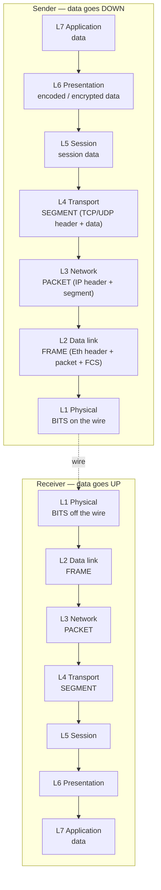

# The OSI Model

## Why this matters

Every infosec role you will ever hold runs on the same vocabulary, and the OSI model is that vocabulary. When a SOC analyst says "this is a Layer 7 problem," when a pen-tester says "I poisoned Layer 2," when a network engineer says "the firewall is doing Layer 4 inspection," they are all pointing at the same seven-layer mental map. Without it, every conversation becomes hand-waving. With it, troubleshooting collapses from "what is wrong" to **which layer is broken** — and the answer arrives in minutes instead of hours. Encryption lives at one layer, routing at another, framing at another; an attack or a fault almost always lives at exactly one of them, and naming that layer is half the fix.

The OSI model is also a teaching model — the packets on the wire actually follow [TCP/IP Model](./tcp-ip-model.md), not OSI. But OSI is the language we use to talk about both, and that is why every certification, every vendor, and every textbook still teaches it first.

## The seven layers at a glance

The model goes from the physical wire at the bottom up to the user-facing application at the top. Data travels **down** the stack on the sender, across the wire, and **up** the stack on the receiver. Each layer adds (or strips) one header.

| # | Layer | What it does | Real protocol examples |
|---|---|---|---|
| 7 | Application | User-facing protocols | HTTP, HTTPS, SMTP, SSH, DNS, FTP |
| 6 | Presentation | Encoding, encryption, compression | TLS, MIME, JPEG, ASCII, gzip |
| 5 | Session | Opening, maintaining, tearing down sessions | NetBIOS, RPC, SMB, SOCKS |
| 4 | Transport | End-to-end delivery, ports, segmentation | TCP, UDP, QUIC, SCTP |
| 3 | Network | Logical addressing, routing between networks | IP, ICMP, IPsec, OSPF, BGP |
| 2 | Data link | Framing, MAC addressing on one link | Ethernet, Wi-Fi 802.11, ARP, VLAN (802.1Q), PPP |
| 1 | Physical | Electrical/optical signal, cable, RF | Copper UTP, fibre, RJ-45, signal modulation |

A useful rule of thumb: **the lower the layer, the more local the scope**. Layer 1 is one cable. Layer 2 is one broadcast domain. Layer 3 spans the Internet. Layers 4–7 live inside two communicating endpoints.

## Layer-by-layer deep dive

### Layer 1 — Physical

The physical layer carries raw bits as electrical signals on copper, light pulses on fibre, or radio waves in the air. It defines voltages, frequencies, connector shapes, pin-outs, and bit-encoding schemes. Devices at this layer include cables, hubs, repeaters, transceivers, and the radio in your Wi-Fi card. There is no concept of an address here — just "is the signal getting through?"

**What breaks at L1:** unplugged cables, bent fibre, electromagnetic interference, dead SFPs, exhausted PoE budgets, a switch port stuck in `down`. The fastest L1 check is `ip link` on Linux or the link LED on the NIC.

### Layer 2 — Data Link

Layer 2 turns a stream of bits into **frames** with a source and destination **MAC address**, so multiple devices can share one physical medium without garbling each other. **Ethernet** (IEEE 802.3) and **Wi-Fi** (IEEE 802.11) are the dominant L2 protocols. **ARP** (Address Resolution Protocol) lives here as the glue between L2 and L3. **VLANs** (802.1Q) split a single switch into multiple isolated L2 networks. Switches are the canonical L2 device — they learn which MAC sits on which port and forward frames only where needed.

**What breaks at L2:** ARP cache poisoning, MAC flooding, duplex mismatches, broadcast storms, misconfigured VLAN trunks, a switch port still in the wrong VLAN after a move. See [Ethernet & ARP](./ethernet-arp.md) for the deep dive.

### Layer 3 — Network

Layer 3 introduces **logical addressing** (IP) and **routing**, so packets can travel across many different L2 networks to reach a destination on the other side of the planet. The dominant protocols are **IPv4**, **IPv6**, and **ICMP** (used by `ping` and `traceroute`). Routing protocols like OSPF and BGP also live here. Routers are the canonical L3 device — they read the destination IP, consult a routing table, and forward toward the next hop.

**What breaks at L3:** wrong default gateway, missing route, blackhole routes, MTU mismatches, asymmetric routing, an IP collision after a static-IP machine joins a DHCP scope. `tracert` / `traceroute` is the L3 debugging tool of choice.

### Layer 4 — Transport

Layer 4 is where "host talks to host" becomes "**application** talks to application." It introduces **ports** (so one host can run many services), **segmentation** (chopping a stream into pieces that fit in a packet), and — for TCP — **reliability** (sequence numbers, acknowledgements, retransmission, flow control). The two dominant L4 protocols are **TCP** (reliable, connection-oriented) and **UDP** (best-effort, connectionless). **QUIC** is a newer reliable protocol built on top of UDP.

**What breaks at L4:** firewall dropping a port, full connection table on a NAT box, TCP window stalls, SYN floods, services bound to the wrong interface. See [TCP & UDP](./tcp-udp.md) for the deep dive.

### Layer 5 — Session

Layer 5 manages the lifecycle of a **session** between two endpoints — establishing it, keeping it alive, checkpointing it, and tearing it down cleanly. In modern networks, much of this work has migrated up into the application layer (HTTP cookies, OAuth tokens) or down into the transport layer (TCP itself), so L5 is the most "blurry" of the seven. Classic L5 examples include **NetBIOS session service**, **RPC**, **SMB session setup**, and the **SOCKS** proxy protocol. TLS session resumption tickets also live here in spirit.

**What breaks at L5:** sessions that won't resume after a hiccup, RPC binding failures, SMB sessions that drop on Wi-Fi roam, half-closed connections that never get cleaned up.

### Layer 6 — Presentation

Layer 6 is the "translator" — it converts the application's data into a form the network can carry, and back again. This includes **character encoding** (ASCII, UTF-8), **data serialisation** (JSON, XML, ASN.1), **compression** (gzip, deflate), and most importantly **encryption** (**TLS**). When you see a padlock in the browser, that's L6 doing its job: the application speaks plain HTTP, but L6 wraps it in TLS before handing it down to L4.

**What breaks at L6:** expired or untrusted TLS certificates, cipher mismatches between client and server, character-encoding corruption (mojibake), broken compression negotiation, SNI inspection by middleboxes.

### Layer 7 — Application

Layer 7 is everything the user — and most developers — actually see. **HTTP**, **HTTPS**, **DNS**, **SMTP**, **SSH**, **FTP**, **LDAP**, **SNMP**, **RDP** all live here. The "application" in OSI does not mean "the program you double-clicked"; it means the **protocol** the program speaks. A web browser is a user application; HTTP is the L7 protocol it uses. Web Application Firewalls (WAFs), reverse proxies, and API gateways operate at L7 because they need to read and rewrite the actual application messages.

**What breaks at L7:** broken DNS records, expired API tokens, malformed JSON, HTTP 4xx/5xx responses, application logic bugs, a web server returning 200 OK with an error message in the body. This is the layer most "the site is down" tickets actually live at.

## Encapsulation — how data moves through the stack

When you send data, each layer wraps the payload from the layer above with its own header (and sometimes a trailer). On the receiver, each layer strips its header and passes the payload up. This is **encapsulation**, and it is why packet captures look like nested boxes.

Memorise the **PDU names** (Protocol Data Units): bits at L1, frames at L2, packets at L3, segments at L4, data at L5–L7. When someone says "drop the packet," they mean L3. "Drop the frame" means L2. The vocabulary is precise on purpose.

## OSI vs TCP/IP

The OSI model has seven layers and was designed by committee in the 1980s as a clean reference. The **TCP/IP model** has four layers and is what the Internet actually runs on. They overlap heavily but are not identical.

| OSI (7 layers) | TCP/IP (4 layers) |
|---|---|
| Application (7) + Presentation (6) + Session (5) | Application |
| Transport (4) | Transport |
| Network (3) | Internet |
| Data link (2) + Physical (1) | Network Access (Link) |

OSI is the **vocabulary**; TCP/IP is the **implementation**. Every engineer uses both — "Layer 7 problem" and "Layer 2 issue" are everyday speech, even though the packets on the wire follow TCP/IP. For the implementation side, see [TCP/IP Model](./tcp-ip-model.md).

## Mnemonics

Two classics — pick the one that sticks. Bottom-up (Layer 1 → 7):

> **P**lease **D**o **N**ot **T**hrow **S**ausage **P**izza **A**way
> Physical · Data link · Network · Transport · Session · Presentation · Application

Top-down (Layer 7 → 1):

> **A**ll **P**eople **S**eem **T**o **N**eed **D**ata **P**rocessing
> Application · Presentation · Session · Transport · Network · Data link · Physical

If you can recite either one in your sleep, you can place any protocol or device on the right layer in seconds.

## Hands-on / practice

Three short exercises. Do them with a notebook open — writing the answers down is what builds the muscle.

### 1. Place each item on the right layer

For each item below, name the OSI layer (1–7). Answers at the bottom of the lesson — try first.

1. `RJ-45 connector`
2. `MAC address AA:BB:CC:DD:EE:FF`
3. `IP address 10.0.0.25`
4. `TCP port 443`
5. `TLS handshake`
6. `HTTP GET /index.html`
7. `ARP who-has`
8. `Wi-Fi radio signal`
9. `JPEG image encoding`
10. `BGP route advertisement`

### 2. Map a Wireshark capture to the layers

Open Wireshark on your laptop, capture for 10 seconds while loading a website, then click any packet. The detail pane shows nested sections — usually `Frame`, `Ethernet II`, `Internet Protocol`, `Transmission Control Protocol`, `Transport Layer Security`, `Hypertext Transfer Protocol`. Match each section to its OSI layer. You should see five or six layers in one packet — that is encapsulation made visible.

### 3. Diagnose by layer

A user reports: "I can ping `example.local` by IP but not by name." Which layer is broken? (Hint: ping works = L1–L4 are fine. Names resolve through DNS, which is an L7 service.) Now reverse it: "I can resolve the name but ping fails." Which layers are still in play? Write a one-sentence diagnosis for each scenario before moving on.

## Worked example — diagnosing a slow web app at example.local

A user calls: "The internal portal `https://portal.example.local` is really slow today." A junior reaches for "restart the server." A networking-literate engineer walks the OSI stack.

**L1 — Physical.** Is the link up? `ip link show eth0` reports `state UP`, no errors on the interface counters. The cable is fine.

**L2 — Data link.** `arp -a` shows the gateway's MAC is stable and matches the documented value. No duplicate-IP warnings in the system log. L2 is healthy.

**L3 — Network.** `ping portal.example.local` returns replies, but with 400 ms latency and the occasional `Request timed out`. `tracert portal.example.local` shows the latency appears at hop 3 — an internal router. L3 is reachable but degraded; the routing path is suspect.

**L4 — Transport.** `Test-NetConnection portal.example.local -Port 443` returns `TcpTestSucceeded : True`. The TCP three-way handshake completes — the port is open and the service is listening. But the round-trip time is 400 ms instead of the usual 5 ms.

**L5/L6 — Session/Presentation.** The TLS handshake completes and the certificate is valid (not expired, correct SAN, trusted chain). No L6 problem.

**L7 — Application.** The browser eventually loads the page after 12 seconds. The HTTP response code is `200 OK`. The application itself is working — it is just slow because every TCP segment is taking 400 ms to round-trip.

**Conclusion.** The application is fine. The problem is at **Layer 3** — an internal router is congested or has a flapping link, inflating latency and causing TCP retransmits. No need to restart the portal. The fix is upstream, on the network team's side. By naming the layer, the right team gets the ticket the first time.

## Troubleshooting & pitfalls

**"OSI is how the Internet runs."** It isn't — TCP/IP is. Use OSI as vocabulary and mental model, not as a literal description of the packets on the wire.

**"Layer 5 is dead."** Not quite — it is just thin. Most session work happens in TCP (L4) or HTTP/TLS (L6/7) today, but classic Windows protocols like SMB and RPC still very much have an L5 component.

**Confusing "Application layer" with "the application program."** The app you launched is a user-space program. L7 is the **protocol** it speaks. Browser ≠ HTTP. Outlook ≠ SMTP/IMAP.

**Putting TLS at L7.** TLS encrypts the data **before** the application protocol runs on top of it. It is L6 (presentation). HTTP-inside-TLS is L7-inside-L6.

**Putting ARP at L3 because it deals with IPs.** ARP **resolves** an IP to a MAC, but the protocol itself runs in Ethernet frames with EtherType `0x0806` — it is L2.

**Treating layer boundaries as walls.** Real protocols cheat. QUIC re-implements TCP-like reliability inside UDP. WireGuard tunnels L3 inside UDP. The model is a guide, not a contract.

**Diagnosing top-down on a clearly broken cable.** Always start at the lowest layer that could plausibly be wrong. If the link LED is off, no amount of L7 debugging will help.

## Key takeaways

- The OSI model is **seven layers** of vocabulary that every infosec role uses every day.
- **Down on send, up on receive** — each layer adds or strips one header. That is encapsulation.
- **PDU names matter:** bits, frames, packets, segments, data. Use them precisely.
- The **lower the layer, the more local the scope** — L1 is one wire, L3 spans the Internet.
- Troubleshoot **bottom-up** by default — there is no point debugging HTTP if the cable is unplugged.
- OSI is the **vocabulary**; [TCP/IP Model](./tcp-ip-model.md) is the **implementation** that actually runs on the wire.
- Master one mnemonic — "Please Do Not Throw Sausage Pizza Away" or "All People Seem To Need Data Processing" — and you can place any protocol in seconds.

(Exercise 1 answers: 1=L1, 2=L2, 3=L3, 4=L4, 5=L6, 6=L7, 7=L2, 8=L1, 9=L6, 10=L3.)

## References

- ITU-T X.200 — The Open Systems Interconnection Reference Model: https://www.itu.int/rec/T-REC-X.200
- ISO/IEC 7498-1 — OSI Basic Reference Model: https://www.iso.org/standard/20269.html
- RFC 1122 — Requirements for Internet Hosts (TCP/IP layering): https://www.rfc-editor.org/rfc/rfc1122
- Cloudflare Learning Center — What is the OSI Model: https://www.cloudflare.com/learning/ddos/glossary/open-systems-interconnection-model-osi/
- Cisco — The OSI Model Explained: https://www.cisco.com/c/en/us/solutions/small-business/resource-center/networking/networking-basics.html
- Wireshark User Guide — Packet Details: https://www.wireshark.org/docs/wsug_html_chunked/
- Sibling lessons: [TCP/IP Model](./tcp-ip-model.md) · [Ethernet & ARP](./ethernet-arp.md) · [TCP & UDP](./tcp-udp.md) · [Ports & Protocols](./ports-protocols.md)
