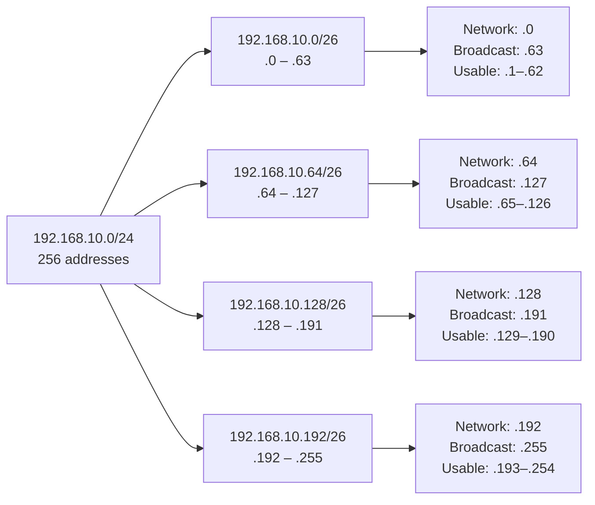

# Subnetting and CIDR

Subnetting is the math of dividing a single block of IP addresses into smaller, purpose-built networks. The previous lesson, [IP addressing](./ip-addressing.md), explained *what an IP is*. This one is the part most learners avoid: the binary, the masks, the CIDR slashes, and the arithmetic that lets you carve a `/22` into a precisely-sized addressing plan without burning a single address.

## Why this matters

Every network engineer needs subnetting. A cloud architect designing a VPC who guesses at masks ends up with overlapping CIDR blocks the day a peering or VPN goes live. A pen-tester reading an engagement scope of `10.0.42.0/23` needs to know instantly that it covers `10.0.42.0` through `10.0.43.255` — and *not* attack a host one bit outside the line. A SOC analyst reading a firewall rule like `permit tcp any 192.168.16.0/20 eq 443` needs to know that "any" actually means hosts from `192.168.16.0` to `192.168.31.255`, not the whole `192.168.x.x` space. Subnetting failure is silent: the packet just goes to the wrong place, and you find out hours later from an angry user or a missed alert.

Get this lesson into muscle memory and you stop fearing whiteboard interview questions, you stop reaching for the calculator on every change, and you start *seeing* the network instead of guessing at it.

## Binary refresher

Every IPv4 octet is 8 bits. Each bit position has a fixed decimal value, doubling from right to left:

```
bit position:   7    6   5   4   3   2   1   0
decimal value: 128  64  32  16   8   4   2   1
```

To convert a decimal octet to binary, walk left to right and ask "does this position fit?" — if yes, write 1 and subtract; if no, write 0 and continue.

```
192 = 128 + 64                       → 1100 0000
224 = 128 + 64 + 32                  → 1110 0000
240 = 128 + 64 + 32 + 16             → 1111 0000
255 = 128 + 64 + 32 + 16 + 8 + 4 + 2 + 1 → 1111 1111
```

To go the other way, just sum the positions where the bit is 1. `1010 1010` = 128 + 32 + 8 + 2 = 170.

Why this matters: a subnet mask is nothing but a string of consecutive 1s followed by 0s. Once you can convert the eight "interesting" mask values (128, 192, 224, 240, 248, 252, 254, 255) in your head, every other piece of subnet math reduces to counting bits.

## Subnet mask — what it actually does

A subnet mask splits a 32-bit IPv4 address into a **network part** and a **host part**. The rule is simple: **a bit set to 1 in the mask is a network bit; a bit set to 0 is a host bit.** All hosts that share the same value in the network bits live on the same subnet.

```
IP        : 192.168.10.130   →  11000000.10101000.00001010.10000010
Mask      : 255.255.255.0    →  11111111.11111111.11111111.00000000
            ^^^ network part (24 bits) ^^^      ^^^ host (8 bits) ^^^
Network ID:                      11000000.10101000.00001010.00000000  →  192.168.10.0
```

The mask `255.255.255.0` has 24 ones, so 24 network bits and 8 host bits — written `/24`. Two hosts can talk Layer-2-directly only when their network bits match under the same mask; otherwise they must traverse a router.

## CIDR notation

**CIDR** (Classless Inter-Domain Routing, RFC 4632) writes a prefix as `address/N`, where `N` is the number of 1-bits in the mask. The conversion is mechanical — count the 1s.

```
255.255.255.0     = 11111111.11111111.11111111.00000000  → 24 ones → /24
255.255.255.192   = 11111111.11111111.11111111.11000000  → 26 ones → /26
255.255.255.252   = 11111111.11111111.11111111.11111100  → 30 ones → /30
```

CIDR freed the Internet from the old class-A/B/C straitjacket: any prefix length from `/0` (the whole Internet) to `/32` (one host) is valid. The full mask cheat-table appears further down.

## Network address vs broadcast vs usable hosts

Every classical IPv4 subnet has three categories of addresses:

- **Network address** — the very first address in the range, where all host bits are 0. It identifies the subnet itself; never assign it to a host.
- **Broadcast address** — the very last address in the range, where all host bits are 1. A packet to this address reaches every host in the subnet; never assign it to a host.
- **Usable host addresses** — everything in between.

The formula is:

```
total addresses = 2^(host bits)
usable hosts   = 2^(host bits) - 2
```

The "minus 2" subtracts the network and broadcast addresses. Two important exceptions:

- **/31** (RFC 3021) — point-to-point links between routers. With only 2 addresses, the spec waives the network/broadcast convention and both addresses are usable. Saves an address on every WAN link in a large network.
- **/32** — a single host route, used for loopbacks, ACL entries, and BGP next-hops. No host bits at all.

## Subnetting math — splitting a /24 into smaller subnets

Take `192.168.10.0/24` and split it into four equal subnets. Four subnets means we need 2 extra network bits (`2^2 = 4`), so the new prefix is `/24 + 2 = /26`. Each `/26` has `32 - 26 = 6` host bits, giving `2^6 = 64` addresses per subnet (62 usable).

The shortcut: **block size = 256 - mask-octet**. Mask `/26` = `255.255.255.192`, so block size = `256 - 192 = 64`. Subnets start at multiples of 64 in the last octet.

| Subnet | Network | Broadcast | Usable range |
| --- | --- | --- | --- |
| 1 | `192.168.10.0/26` | `192.168.10.63` | `.1` – `.62` |
| 2 | `192.168.10.64/26` | `192.168.10.127` | `.65` – `.126` |
| 3 | `192.168.10.128/26` | `192.168.10.191` | `.129` – `.190` |
| 4 | `192.168.10.192/26` | `192.168.10.255` | `.193` – `.254` |

Step by step for subnet 3: network bits give `.128`; host bits all 1 give `.128 + 63 = .191`; subtract the two reserved addresses for `64 - 2 = 62` usable hosts.

## VLSM — Variable-Length Subnet Masking

Real networks are not made of equal-sized teams. A guest Wi-Fi might need 500 addresses; a server VLAN might need 30; a router-to-router link needs 2. **VLSM** is the practice of carving one block into subnets of *different* sizes — always biggest first, then halve the remaining space.

Example: split `10.0.0.0/16` (65,536 addresses) into one `/22`, one `/24`, and two `/27`s.

| Block | Prefix | Addresses | Usable | Range |
| --- | --- | --- | --- | --- |
| Engineering LAN | `10.0.0.0/22` | 1,024 | 1,022 | `10.0.0.0` – `10.0.3.255` |
| Servers | `10.0.4.0/24` | 256 | 254 | `10.0.4.0` – `10.0.4.255` |
| Lab A | `10.0.5.0/27` | 32 | 30 | `10.0.5.0` – `10.0.5.31` |
| Lab B | `10.0.5.32/27` | 32 | 30 | `10.0.5.32` – `10.0.5.63` |
| (free) | `10.0.5.64/26 …` | — | — | remaining space |

Always allocate the largest block first; if you start with the small ones you fragment the space and the big block no longer fits at a clean boundary. Document each allocation — the worst VLSM mistakes are not math errors, they are silent overlaps after a year of changes.

## Supernetting / route summarisation

Supernetting is subnetting in reverse: combine several adjacent subnets into one shorter prefix so the routing table carries one entry instead of many. Routers love this — smaller tables, faster lookups, fewer updates to flood when something changes.

To summarise four `/24`s — `192.168.16.0/24`, `192.168.17.0/24`, `192.168.18.0/24`, `192.168.19.0/24` — find the common prefix in binary:

```
192.168.16.0  →  11000000.10101000.00010000.00000000
192.168.17.0  →  11000000.10101000.00010001.00000000
192.168.18.0  →  11000000.10101000.00010010.00000000
192.168.19.0  →  11000000.10101000.00010011.00000000
                  ^^^^^^^^^^^^^^^^^^^^^^^^^^ 22 common bits
```

The common prefix is 22 bits, so the summary route is `192.168.16.0/22`. One advertised prefix replaces four. Be careful: a summary covers the *whole* range, including any hole you didn't intend to advertise.

## IPv6 prefix notation

IPv6 uses the same `/N` idea, but the numbers and conventions are different. There is **no broadcast** in IPv6 — only multicast — so the "minus 2" rule does not apply. The standard subnet length on a LAN is **/64**: half the address (64 bits) is network, half is the **interface identifier** (often derived from the MAC via EUI-64 or randomised for privacy).

Common IPv6 prefix sizes:

| Prefix | Meaning |
| --- | --- |
| `/128` | Single host |
| `/127` | Point-to-point link (RFC 6164) |
| `/64` | Standard LAN subnet — never go smaller for SLAAC to work |
| `/56` | Typical home-user allocation |
| `/48` | Typical site/enterprise allocation |
| `/32` | Typical ISP allocation from the RIR |

Address `2001:db8:abcd:0012::/64` means: the first 64 bits (`2001:db8:abcd:0012`) are the network; everything after is host. With a 64-bit host field, every LAN has 18 quintillion addresses — scarcity is no longer a design constraint.

## Comprehensive CIDR mask cheat-table

Memorise the rows for `/24`, `/25`, `/26`, `/30`, `/16`, `/8`, and `/32` — the rest fall out of bit-counting.

| Prefix | Decimal mask | Hosts (usable) | Typical use |
| --- | --- | --- | --- |
| `/8`  | `255.0.0.0`         | 16,777,214 | Big RFC 1918 / legacy class A |
| `/9`  | `255.128.0.0`       | 8,388,606 | Half of a /8 |
| `/10` | `255.192.0.0`       | 4,194,302 | Large carrier block |
| `/11` | `255.224.0.0`       | 2,097,150 | Carrier sub-allocation |
| `/12` | `255.240.0.0`       | 1,048,574 | RFC 1918 `172.16.0.0/12` |
| `/13` | `255.248.0.0`       | 524,286   | Large enterprise |
| `/14` | `255.252.0.0`       | 262,142   | Large enterprise |
| `/15` | `255.254.0.0`       | 131,070   | Two contiguous /16s |
| `/16` | `255.255.0.0`       | 65,534    | Campus / large site / RFC 1918 `192.168.0.0/16` |
| `/17` | `255.255.128.0`     | 32,766    | Large building |
| `/18` | `255.255.192.0`     | 16,382    | Large department |
| `/19` | `255.255.224.0`     | 8,190     | Department |
| `/20` | `255.255.240.0`     | 4,094     | Floor or building wing |
| `/21` | `255.255.248.0`     | 2,046     | Big VLAN |
| `/22` | `255.255.252.0`     | 1,022     | Office floor / cloud VPC subnet |
| `/23` | `255.255.254.0`     | 510       | Two-/24 user VLAN |
| `/24` | `255.255.255.0`     | 254       | Standard office / lab subnet |
| `/25` | `255.255.255.128`   | 126       | Half-/24 |
| `/26` | `255.255.255.192`   | 62        | Quarter-/24, small VLAN |
| `/27` | `255.255.255.224`   | 30        | Small lab, IoT segment |
| `/28` | `255.255.255.240`   | 14        | DMZ, management VLAN |
| `/29` | `255.255.255.248`   | 6         | Small DMZ, hardware appliance |
| `/30` | `255.255.255.252`   | 2         | Classic point-to-point WAN |
| `/31` | `255.255.255.254`   | 2 (RFC 3021) | Modern point-to-point WAN |
| `/32` | `255.255.255.255`   | 1         | Single host route, loopback, ACL entry |

## Subnet calculation diagram



## Hands-on / practice

Work these through on paper before reaching for a calculator — that is how the math becomes automatic.

### 1. Decimal-to-binary

Convert each decimal value to its 8-bit binary form: **11**, **47**, **128**, **200**, **255**.

### 2. Decode CIDR blocks

For each prefix, write the network address, broadcast address, and number of usable hosts: `10.20.30.0/27`, `172.16.40.0/22`, `192.168.5.128/25`, `203.0.113.16/29`, `198.51.100.0/30`.

### 3. Split a /24 into eight /27s

Starting from `192.168.50.0/24`, list all eight `/27` subnets with network, broadcast, and usable range for each.

### 4. Design a VLSM plan

You have `10.10.0.0/22` to assign to four teams: 400 hosts, 100 hosts, 50 hosts, 10 hosts. Allocate non-overlapping subnets, biggest first, and leave the remaining space documented as "free".

### 5. Summarise /24s into a /22

Write the single CIDR summary for `172.20.4.0/24`, `172.20.5.0/24`, `172.20.6.0/24`, `172.20.7.0/24`. Show the binary that proves the prefix length.

### 6. Pick the right prefix

What is the smallest IPv4 prefix that can host **30** users? **62** users? **125** users? **500** users? **1,000** users? Justify each with the `2^n - 2` formula.

## Worked example

`example.local` is opening a small office and has been allocated `10.42.0.0/22` (1,024 addresses, four contiguous `/24`s). The plan must cover: 60 users, 12 servers, 8 cameras, 4 printers, 1 IoT lab — each on its own VLAN, with room to grow roughly 50%.

Step 1 — round each requirement up to the next power-of-two prefix that fits, including growth:

- **Users:** 60 × 1.5 = 90 → smallest fit is `/25` (126 usable)
- **Servers:** 12 × 1.5 = 18 → `/27` (30 usable)
- **Cameras:** 8 × 1.5 = 12 → `/28` (14 usable)
- **Printers:** 4 × 1.5 = 6 → `/29` (6 usable)
- **IoT lab:** keep generous → `/27` (30 usable)

Step 2 — allocate biggest first, on natural boundaries:

| VLAN | Purpose | Subnet | Range | Usable |
| --- | --- | --- | --- | --- |
| 10 | Users | `10.42.0.0/25` | `10.42.0.0` – `10.42.0.127` | 126 |
| 20 | Servers | `10.42.0.128/27` | `10.42.0.128` – `10.42.0.159` | 30 |
| 30 | IoT lab | `10.42.0.160/27` | `10.42.0.160` – `10.42.0.191` | 30 |
| 40 | Cameras | `10.42.0.192/28` | `10.42.0.192` – `10.42.0.207` | 14 |
| 50 | Printers | `10.42.0.208/29` | `10.42.0.208` – `10.42.0.215` | 6 |
| (free) | Future | `10.42.0.216/29 …` | remainder of the `/22` | — |

The whole office fits in less than a quarter of the allocation, leaving roughly 800 addresses for growth, a future site-to-site VPN, or a second floor without any re-numbering pain.

## Subnet-math tools

Three handy tools — useful, but never trust them blindly. Verify any production subnet by hand at least once.

- **`ipcalc`** (Linux) — `ipcalc 192.168.10.0/26` prints network, broadcast, mask, and host range. Available in most distro repos.
- **`Get-Subnet`** (PowerShell module) — `Install-Module -Name Subnet`, then `Get-Subnet -IP 10.0.0.5 -MaskBits 22` returns the same data on Windows.
- **Online calculators** — `subnet-calculator.com`, `cidr.xyz`, and the AWS/Azure VPC subnet planners. Good for quick lookups; bad for compliance evidence.

The point of learning the math is that one day a tool will be wrong — typically when its UI defaults to a class boundary you didn't intend — and you need to spot it instantly.

## Troubleshooting & pitfalls

- **Off-by-one errors.** A `/26` has 64 addresses, *not* 63. The third `/26` of a `/24` starts at `.128`, not `.127` — you forgot the network address counts as an address.
- **Forgetting the -2 exception.** A `/30` gives you 2 usable hosts, not 4. Plan accordingly on every WAN link.
- **Mismatched masks on link partners.** If one router has `/24` and the peer has `/25`, the wider side will try to reach hosts the narrow side rejects. Always confirm both ends.
- **Summary route hides a more-specific route.** Advertise `192.168.16.0/22` and you also "claim" `192.168.18.0/24` even if another router owns it. More-specific entries win in the routing table — but they must be present on the device that needs them.
- **/31 confusion (RFC 3021).** Older devices treat `/31` as illegal because both addresses look like network/broadcast. Modern Cisco, Juniper, and Linux handle it fine, but check before deploying on legacy gear.
- **Overlapping VPC CIDRs.** Two cloud VPCs with the same `10.0.0.0/16` cannot peer. Pick non-overlapping blocks at the *organisation* level, not per-project.
- **Decimal math vs binary math.** "Subnet 192.168.10.100/26 — what's the network?" Decimal-divide does not work; you must mask the host bits. Practise the binary AND until it is reflex.

For the wider context — devices that route between subnets, Layer-3 VLAN interfaces, and how segmentation maps to security — see [Network devices](./network-devices.md) and [Secure network design](../secure-design/secure-network-design.md). The transport over which subnetted packets travel is described in [OSI](./osi-model.md) and [TCP/IP](./tcp-ip-model.md).

## Key takeaways

- A subnet mask is a string of consecutive 1-bits then 0-bits; CIDR `/N` is just the count of 1-bits.
- Block size in the variable octet = `256 - mask-octet`. Memorise it; it removes most of the arithmetic.
- Usable hosts = `2^(host bits) - 2`, except `/31` (2 usable) and `/32` (1 usable).
- VLSM means biggest first, on natural boundaries, with documentation — fragmentation is forever.
- Supernetting is the inverse: shorter prefix, fewer routes, but watch for unintended coverage.
- IPv6 keeps the `/N` notation, drops broadcast, and standardises `/64` for every LAN.
- Verify production subnets by hand at least once — tools are convenient, not infallible.

## References

- RFC 1519 — Classless Inter-Domain Routing (CIDR), original 1993: https://www.rfc-editor.org/rfc/rfc1519
- RFC 4632 — CIDR address assignment and aggregation, 2006 update: https://www.rfc-editor.org/rfc/rfc4632
- RFC 950 — Internet Standard Subnetting Procedure: https://www.rfc-editor.org/rfc/rfc950
- RFC 3021 — Using 31-bit prefixes on IPv4 point-to-point links: https://www.rfc-editor.org/rfc/rfc3021
- RFC 4291 — IP Version 6 Addressing Architecture: https://www.rfc-editor.org/rfc/rfc4291
- RFC 6164 — Using 127-bit IPv6 prefixes on inter-router links: https://www.rfc-editor.org/rfc/rfc6164
- Cisco — IP Subnet Calculator and worked examples: https://www.cisco.com/c/en/us/support/docs/ip/routing-information-protocol-rip/13788-3.html
- IANA IPv4 Special-Purpose Address Registry: https://www.iana.org/assignments/iana-ipv4-special-registry/iana-ipv4-special-registry.xhtml
