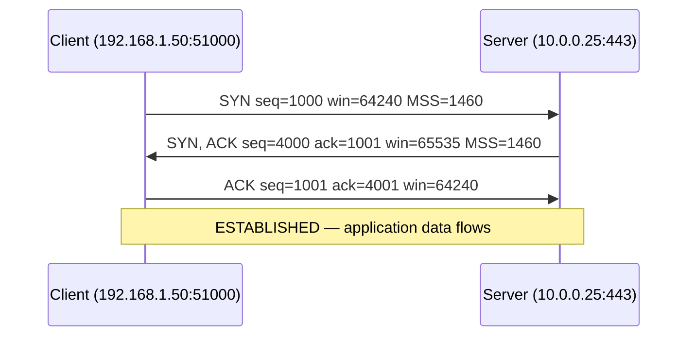
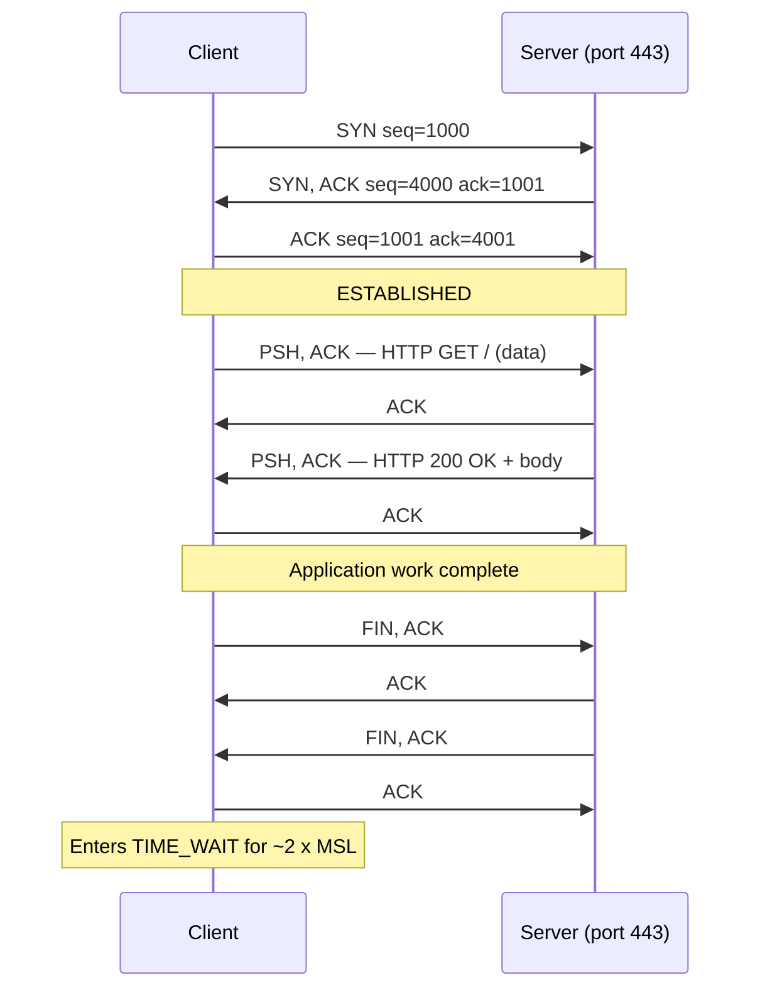

# TCP and UDP — The Transport Layer

## Why this matters

Every connection a server accepts is either TCP or UDP. Every alert your SOC raises about a "suspicious connection" is built on the five-tuple that Layer 4 produces. Every pen-tester probing for an open service is sending crafted SYN, ACK, FIN, or UDP packets and reading what comes back. Every cloud engineer writing a security group is, whether they realise it or not, programming a stateful TCP filter.

If you cannot read TCP flags fluently, you cannot read a PCAP. If you cannot reason about connection states, you will not understand why a "fixed" service still rejects clients for two minutes after restart. If you cannot tell a SYN flood from honest load, you will mitigate the wrong thing during an outage. TCP and UDP are the two protocols every other application sits on top of — and the seam where most real network problems show up.

This lesson goes deep on Layer 4 only. Ports, the IANA registry, and the well-known protocol map are covered separately in [ports and protocols](./ports-and-protocols.md).

## The role of Layer 4

Layer 3 (IP) gets a packet from one host to another. Layer 4 turns that into a conversation between two **applications** by adding **ports** — small integers that identify which process on each side owns the bytes. Together with the IP addresses and the protocol number, the two ports make the **5-tuple** that uniquely identifies a flow:

```text
(protocol, source IP, source port, destination IP, destination port)
```

Two simultaneous browser tabs to the same web server use the same destination IP and port (`10.0.0.25:443`) but different source ports (`51000`, `51001`) — so they are different flows, kept apart by the kernel and by every stateful device on the path. The 5-tuple is the unit firewalls allow, IDS sensors alert on, NAT gateways translate, and load balancers hash. Internalise it.

For more on how Layer 4 sits in the bigger picture, see [the OSI model](./osi-model.md) and [the TCP/IP model](./tcp-ip-model.md). For where the IP halves of the tuple come from, see [IP addressing](./ip-addressing.md).

## TCP — connection-oriented

**TCP** (Transmission Control Protocol, RFC 9293) gives the application above it four guarantees:

- **Ordered** — bytes arrive in the order they were sent, even if packets took different paths.
- **Reliable** — lost segments are detected and retransmitted; duplicates are dropped.
- **Flow-controlled** — a fast sender cannot drown a slow receiver.
- **Byte-stream** — there are no message boundaries; the application sees a continuous stream and frames it itself (HTTP uses headers, TLS uses records, etc.).

Those guarantees are not free. TCP costs a round-trip to set up, a round-trip to tear down, and bookkeeping on every byte. When the guarantees match what the application needs (web, mail, SSH, databases), the cost is invisible. When they do not (real-time voice, DNS lookups), TCP is the wrong tool.

Every TCP connection is identified end-to-end by the 5-tuple. The kernel keeps a **TCP control block** per connection holding the current sequence numbers, window sizes, retransmission timers, and state.

## TCP three-way handshake

Before a single byte of application data can flow, the two peers complete a **three-way handshake**. It is the most-seen pattern in any packet capture, and the place every TCP attack starts.



What each segment carries:

1. **SYN (client → server).** The client picks an **Initial Sequence Number (ISN)** — a random 32-bit value, e.g. `1000`. It also advertises its **Maximum Segment Size (MSS)**, its initial **window size**, and TCP options (SACK permitted, window scaling, timestamps). The SYN consumes one sequence number even though it carries no data.
2. **SYN/ACK (server → client).** The server picks **its** ISN (`4000`) and acknowledges the client's ISN+1 (`1001`). It advertises its own MSS and window. This single packet is both an opening (SYN) and an acknowledgement (ACK).
3. **ACK (client → server).** The client acknowledges the server's ISN+1 (`4001`). The connection is now `ESTABLISHED` on both ends and either side may send data.

Why two random ISNs and not zero? **Sequence number randomisation** prevents an off-path attacker from guessing the next valid sequence number and injecting forged data into the stream. Modern stacks derive the ISN from a cryptographic hash of the 5-tuple plus a secret, per RFC 6528.

## TCP flags

Every TCP segment carries a small bit-field of control flags. There are six classic ones; learn them cold.

| Flag | Meaning | What an attacker uses it for |
|---|---|---|
| **SYN** | Open a connection (carries ISN) | **SYN flood** — send millions of SYNs from spoofed IPs to fill the server's half-open queue |
| **ACK** | Acknowledging received data / sequence number | **ACK scan** — bypass simple stateless filters that only block SYN |
| **FIN** | Clean close — "I'm done sending in this direction" | **FIN scan** — closed ports return RST, open ports stay silent on some stacks |
| **RST** | Abrupt reset — tear down immediately | **RST injection** — forge a RST mid-stream to kill someone else's connection (great-firewall style) |
| **PSH** | Push buffered data up to the application now | Rarely used offensively; useful in fingerprinting |
| **URG** | Urgent pointer is valid (almost never used) | Old IDS-evasion trick; many stacks behave inconsistently |

Modern TCP also defines **ECE**, **CWR**, and **NS** for congestion notification, but the six above are the ones you read in Wireshark every day.

A useful pattern: a `SYN` to a closed TCP port returns `RST, ACK` from the kernel of the target — that is exactly how `nmap -sS` distinguishes "closed" from "open" (which returns `SYN, ACK`) from "filtered" (which returns nothing because a firewall dropped the SYN).

## TCP connection states

Each side of a TCP connection moves through a small state machine. You will see these states in `ss -tan`, `netstat -an`, and every kernel-level network tool.

| State | Meaning |
|---|---|
| **LISTEN** | Server socket waiting for incoming SYN |
| **SYN_SENT** | Client has sent SYN, waiting for SYN/ACK |
| **SYN_RECEIVED** | Server got SYN, sent SYN/ACK, waiting for final ACK (the half-open state) |
| **ESTABLISHED** | Handshake complete, data may flow |
| **FIN_WAIT_1** | Local side has sent FIN, waiting for ACK or peer FIN |
| **FIN_WAIT_2** | Local FIN was acknowledged; waiting for peer's FIN |
| **CLOSE_WAIT** | Peer sent FIN; local app has not yet closed |
| **LAST_ACK** | Local app closed after CLOSE_WAIT, waiting for final ACK |
| **TIME_WAIT** | Local side closed; holds the 5-tuple for 2 x MSL (typ. 60–120 s) to absorb stragglers |
| **CLOSED** | No connection exists |

`TIME_WAIT` is the one that surprises people. After a clean close, the side that sent the **first** FIN keeps the 5-tuple reserved for roughly two minutes so that any delayed segment from the old connection cannot be misinterpreted as belonging to a brand-new connection that happens to reuse the same ports. On a busy load balancer or proxy, `TIME_WAIT` sockets can pile into the tens of thousands and start exhausting ephemeral ports — the classic `TIME_WAIT` exhaustion.

## Sliding window and flow control

TCP would be unusable if the sender just blasted bytes and hoped. Instead, the receiver tells the sender, in every ACK, how much buffer space it currently has free — the **advertised receive window** (`win=65535` in Wireshark). The sender keeps a "window" of unacknowledged bytes in flight no larger than that. As the receiver's application drains the buffer, the window grows; as it fills, the window shrinks toward zero.

```text
Sent and ACKed | Sent, not yet ACKed | May send now | Cannot send yet
---------------+---------------------+--------------+-----------------
              snd_una              snd_nxt       snd_una + win
```

This is the **sliding window**: the boundary moves forward as ACKs arrive. It is end-to-end **flow control** — a slow consumer protects itself without help from any router.

Separately, **congestion control** (slow start, congestion avoidance, fast retransmit, fast recovery; modern Linux uses CUBIC or BBR) responds to packet loss and RTT changes to keep the sender from overwhelming the **path**, not the peer. Flow control and congestion control are different mechanisms with the same effect of slowing down — both can clamp throughput, and diagnosing which is which is a senior-level skill.

## TCP teardown

There are two ways to end a TCP connection: politely and rudely.

**Clean close — FIN/ACK.** Either side sends `FIN`. The peer ACKs it, finishes anything it still wants to send, then sends its own `FIN`. The originator ACKs that and enters `TIME_WAIT`. Four packets total, no data lost.

**Abrupt close — RST.** Either side sends `RST` and immediately forgets the connection. Anything in flight is discarded. RSTs are sent by the kernel when an application closes a socket without draining it, when a packet arrives for a connection that doesn't exist, or by an attacker forging traffic to kill a connection they do not own. RST injection by intermediate boxes is a known censorship technique and a known cause of mysterious "connection reset by peer" errors when an over-eager firewall decides it doesn't like a flow.

## UDP — connectionless

**UDP** (User Datagram Protocol, RFC 768) is the opposite of TCP: deliberately minimal. The header is eight bytes total.

```text
 0      7 8     15 16    23 24    31
+--------+--------+--------+--------+
|     Source     |  Destination    |
|      Port      |      Port       |
+--------+--------+--------+--------+
|     Length     |    Checksum     |
+--------+--------+--------+--------+
|             Data ...              |
+-----------------------------------+
```

That is it. No handshake, no sequence numbers, no acknowledgements, no retransmission, no ordering, no connection state. You hand the kernel a payload and a destination, and it sends one datagram. If it arrives, the receiver gets it. If it does not, nobody tells you. If two arrive out of order, the application sees them out of order. The only correctness check is the optional checksum.

This minimalism is the point. DNS sends a query, gets an answer, done — no need for a handshake that costs more round-trips than the lookup itself. VoIP and video would rather skip a lost frame than wait 300 ms for retransmission. SNMP and syslog are write-mostly and tolerate loss. DHCP runs on UDP because the client doesn't even have an IP yet. The application takes responsibility for whatever subset of TCP-like behaviour it actually needs.

## QUIC and HTTP/3

For decades the rule was "if you need reliability, use TCP." That changed with **QUIC** (RFC 9000), the transport that **HTTP/3** runs on. QUIC is built on **UDP** — but it implements ordered, reliable, multiplexed, encrypted streams **inside** UDP, in user space, with TLS 1.3 baked in.

Why move off TCP at all? Three reasons:

- **Faster handshake.** QUIC combines transport setup and TLS into a single round-trip (and 0-RTT for resumed connections), versus TCP's separate three-way handshake plus TLS handshake.
- **Head-of-line blocking.** In HTTP/2 over TCP, one lost packet stalls every multiplexed stream until retransmission. QUIC streams are independent, so a loss only blocks its own stream.
- **Connection migration.** A QUIC connection has its own ID, not a 5-tuple, so a phone switching from Wi-Fi to cellular keeps the same connection without reconnecting.

The cost: QUIC bypasses every middlebox optimisation built for TCP, and it is encrypted end-to-end so on-path inspection is far harder. Most major web properties (Google, Cloudflare, Meta) now serve a large share of traffic over HTTP/3 — if your firewall only understands TCP 443, you are blind to a growing fraction of your users' web traffic.

## TCP vs UDP — decision matrix

| Choose **TCP** when… | Choose **UDP** when… |
|---|---|
| Losing a byte is unacceptable (HTTPS, SSH, SMTP, IMAP) | A dropped packet is easier to replace than to wait for (VoIP, video) |
| Data must arrive in order (file transfer, database queries) | The app handles its own ordering (RTP timestamps, game state ticks) |
| Throughput matters less than correctness | Latency matters more than correctness |
| Sessions are long-lived and chatty | Exchanges are one-shot (DNS query, NTP poll) |
| Crossing firewalls and NATs that are TCP-friendly | Speed of setup matters (no handshake) |
| Clients need automatic flow/congestion control | The app does its own pacing (QUIC, custom protocols) |
| Examples: HTTP/1.1, HTTP/2, SSH, SMTP, RDP, MySQL, LDAP | Examples: DNS (typical), DHCP, NTP, SNMP, syslog, VoIP, QUIC/HTTP/3 |

A useful rule of thumb: if the application can survive a missing packet by displaying a glitch for one frame, prefer UDP. If a missing byte means corruption, prefer TCP. And if you want both speed and reliability with modern crypto, the right answer in 2026 is usually QUIC.

## TCP/UDP mermaid diagram



## Hands-on / practice

Four exercises. Do them in order; each builds the muscle memory for the next.

### 1. Capture a TCP three-way handshake

Open Wireshark, start a capture on your active interface, and apply the filter:

```text
tcp.flags.syn == 1 and host neverssl.com
```

In a browser, visit `http://neverssl.com`. Stop the capture. Find the three packets: `SYN`, `SYN, ACK`, `ACK`. Note the absolute sequence numbers and the relative ones Wireshark shows. Right-click any packet and **Follow → TCP Stream** to see the whole conversation reassembled.

### 2. Identify TCP states with `ss` / `netstat`

On Linux:

```bash
ss -tan
```

On Windows:

```powershell
netstat -ano -p tcp
```

Find at least one socket in `LISTEN`, one in `ESTABLISHED`, and one in `TIME_WAIT`. If you cannot find a `TIME_WAIT`, open and immediately close a connection (e.g. `curl -s https://example.com >/dev/null`) and re-run within 60 seconds.

### 3. Observe a UDP DNS query

Start Wireshark with the filter `udp.port == 53`, then run:

```bash
dig example.com @8.8.8.8
```

You should see exactly two UDP packets: query and response. No handshake, no teardown. Compare the simplicity to the TCP capture above.

### 4. TCP-or-UDP triage

Without looking at the cheat-sheet, classify each of these as TCP, UDP, or both: **HTTPS, DNS, SSH, DHCP, SMTP, NTP, RDP, SNMP, SMB, Syslog**. Then verify with `ss -tulpn` or the IANA registry. The goal is to build the intuition that the choice of transport is information about the protocol's design.

## Worked example — a SYN flood at example.local

A SOC analyst at `example.local` gets a Sunday-night page: the public web app `www.example.local` is intermittently unreachable, but the host is up and the application logs are quiet. They SSH in and run:

```bash
ss -tan state syn-recv | wc -l
```

The number is **47,318**. Normal is under fifty.

That distribution — tens of thousands of sockets stuck in `SYN_RECEIVED`, each one a half-finished handshake whose final ACK never arrived — is the signature of a **SYN flood**. An attacker (or a botnet) is sending SYN packets from spoofed source IPs. The kernel dutifully replies with SYN/ACK, allocates a control block, and waits for an ACK that will never come. The half-open queue fills, and legitimate clients can no longer get a slot.

The analyst checks the source IPs:

```bash
ss -tan state syn-recv | awk '{print $5}' | cut -d: -f1 | sort | uniq -c | sort -rn | head
```

Hundreds of thousands of distinct sources, no concentration — classic spoofed-source flood. Blocking individual IPs is pointless.

**Mitigation, in order of escalation:**

1. **Enable SYN cookies** (`net.ipv4.tcp_syncookies = 1`) — already on in modern Linux. Under attack, the kernel stops allocating control blocks for SYNs and instead encodes the connection state into the ISN it sends back. Real clients return a valid cookie in the final ACK; spoofed clients never do.
2. **Increase the backlog** (`net.ipv4.tcp_max_syn_backlog`) and shorten retries (`tcp_synack_retries=2`) so half-open entries expire faster.
3. **Push the floor up** — put a CDN, scrubbing service, or the cloud provider's anti-DDoS in front. They absorb the SYNs at a much higher capacity than a single VM ever can.
4. **Capture and report** — keep a PCAP for incident response, and report to the upstream ISP if the volume is sustained.

The analyst confirms `tcp_syncookies` is active, scales the load balancer's anti-DDoS profile up a tier, and watches the half-open count fall back under 100 within minutes. Service is restored without ever touching the application. Recognising the **state distribution** — not the bandwidth, not the CPU — is what made the diagnosis fast.

## Troubleshooting and pitfalls

**TIME_WAIT exhaustion on busy reverse proxies.** A proxy that opens and closes thousands of short upstream TCP connections per second will accumulate `TIME_WAIT` sockets and eventually run out of ephemeral source ports for new outbound connections. Fixes: enable connection pooling/keep-alive to the upstream, raise `ip_local_port_range`, or in extreme cases enable `tcp_tw_reuse`. Do **not** blindly enable `tcp_tw_recycle` — it was removed from Linux for good reason and breaks NAT.

**Too-aggressive RSTs break NAT keepalives.** Some firewalls send RSTs for "idle" TCP connections to clean up state. If the idle timer is shorter than the application's keep-alive interval, every long-running session (SSH, database connection, websocket) will mysteriously die. Either lengthen the firewall idle timeout or shorten the TCP keepalive interval (`tcp_keepalive_time`).

**MTU/MSS mismatch.** When the path MTU is smaller than the negotiated MSS — common with VPNs and tunnels — full-size packets get fragmented or dropped. Symptom: the TCP handshake completes (small packets) but the first big POST or response hangs forever. Fix: clamp the MSS at the tunnel endpoint (`iptables -t mangle ... --clamp-mss-to-pmtu`) or enable PMTU discovery and stop dropping ICMP "fragmentation needed" messages at your firewall.

**Retransmissions hide the real problem.** TCP will paper over packet loss by retransmitting. The user sees "slow," not "broken." Look at `Retransmits` in `ss -ti` or Wireshark's **Expert Info**. A retransmission rate above ~1% is a problem worth chasing — usually a duplex mismatch, a saturated link, or a flaky cable on one hop.

**Half-closed sockets.** A misbehaving application that calls `shutdown(SHUT_WR)` but never `close()` leaves the socket in `CLOSE_WAIT` forever. Lots of `CLOSE_WAIT` on a server means an application bug, not a network problem. Counterintuitive but extremely common.

## Key takeaways

- Layer 4 turns host-to-host into app-to-app via ports; the 5-tuple uniquely identifies a flow.
- TCP gives ordered, reliable, flow-controlled byte streams at the cost of a handshake and per-connection state.
- The three-way handshake exchanges initial sequence numbers, MSS, and window sizes — and is where SYN floods strike.
- Six classic flags (SYN, ACK, FIN, RST, PSH, URG) carry every TCP control decision; learn them cold.
- Connection states (LISTEN, ESTABLISHED, TIME_WAIT, etc.) are diagnostic gold — `ss -tan` is your friend.
- Sliding-window flow control is end-to-end; congestion control is path-aware. They are different and both matter.
- UDP is deliberately minimal — eight-byte header, no guarantees, fast and cheap. Used where loss is cheaper than waiting.
- QUIC (HTTP/3) puts reliability and TLS inside UDP, sidestepping TCP's limitations and middlebox baggage.
- Choose TCP for correctness, UDP for latency, and QUIC when you need both with modern crypto.
- A SOC analyst who reads connection-state distributions diagnoses floods and exhaustion in minutes, not hours.

## References

- RFC 9293 — Transmission Control Protocol (modern rewrite, 2022): https://www.rfc-editor.org/rfc/rfc9293
- RFC 768 — User Datagram Protocol: https://www.rfc-editor.org/rfc/rfc768
- RFC 9000 — QUIC: A UDP-Based Multiplexed and Secure Transport: https://www.rfc-editor.org/rfc/rfc9000
- RFC 6528 — Defending against Sequence Number Attacks: https://www.rfc-editor.org/rfc/rfc6528
- RFC 4987 — TCP SYN Flooding Attacks and Common Mitigations: https://www.rfc-editor.org/rfc/rfc4987
- Cloudflare Learning Center — TCP vs UDP: https://www.cloudflare.com/learning/ddos/glossary/user-datagram-protocol-udp/
- Cloudflare Learning Center — What is QUIC: https://www.cloudflare.com/learning/performance/what-is-http3/
- Wireshark User Guide — TCP analysis: https://www.wireshark.org/docs/wsug_html_chunked/ChAdvTCPAnalysis.html
