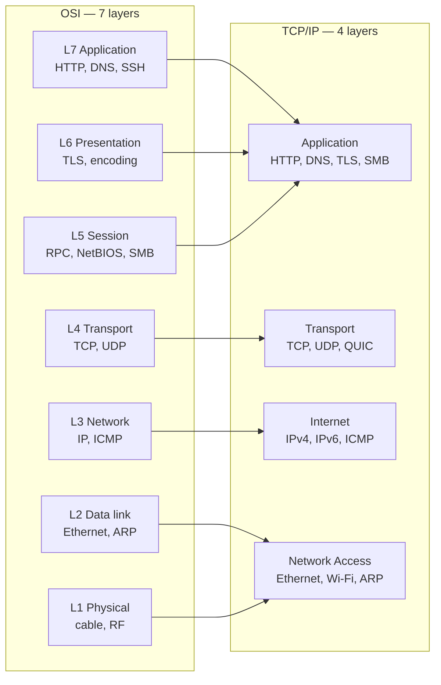
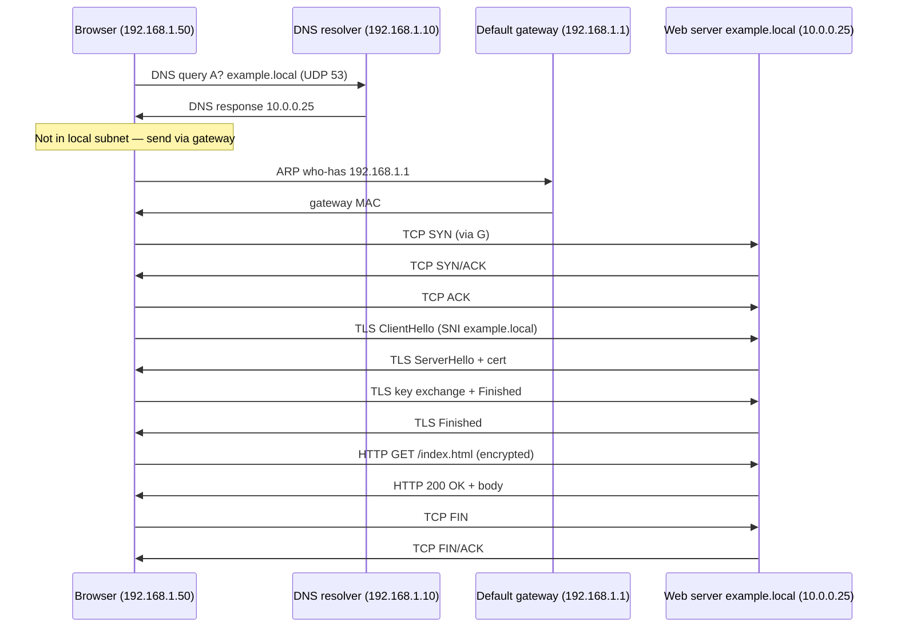

# The TCP/IP Model

## Why this matters

OSI is the vocabulary the industry uses to talk about networks; **TCP/IP is what actually runs on the wire.** Every packet that crosses the internet — every HTTPS request, every DNS query, every video stream, every malware beacon — is built, addressed, routed, and delivered by the four-layer TCP/IP stack. The seven OSI layers are a teaching reference; the TCP/IP four are the implementation. If you can only learn one stack, learn TCP/IP, because that is the one your operating system, your network card, your router, your firewall, and your packet capture tool all actually speak.

For an infosec practitioner this matters in two concrete ways. First, every tool you will use — `tcpdump`, Wireshark, `nmap`, Suricata, Zeek — labels its output by the actual protocols on the wire (Ethernet, IP, TCP, TLS, HTTP), which fall cleanly into the four TCP/IP layers. Second, when you write firewall rules, IDS signatures, or segmentation policies, you are reasoning about TCP/IP layers, not OSI ones. This lesson focuses on those four layers, shows how they map to the seven OSI layers from [The OSI Model](./osi-model.md), and walks through the full end-to-end journey of a single HTTPS request.

## The four layers at a glance

The TCP/IP model collapses OSI's top three layers into one **Application** layer and OSI's bottom two into one **Network Access** layer. The middle two — Transport and Internet — line up almost exactly. The result is leaner, closer to what real protocols do, and easier to map onto a packet capture.

| # | TCP/IP layer | Function | Maps to OSI | Real protocols |
|---|---|---|---|---|
| 4 | Application | User-facing protocols, encoding, sessions, encryption | 5 + 6 + 7 | HTTP, HTTPS, DNS, SMTP, SSH, TLS, FTP, SMB |
| 3 | Transport | End-to-end delivery, ports, reliability or speed | 4 | TCP, UDP, QUIC |
| 2 | Internet | Logical addressing, routing between networks | 3 | IPv4, IPv6, ICMP, IPsec, OSPF, BGP |
| 1 | Network Access | Framing, MAC addressing, physical signal | 1 + 2 | Ethernet, Wi-Fi 802.11, ARP, VLAN (802.1Q), PPP |

A useful intuition: each TCP/IP layer answers exactly one question. **Network Access** answers "how do I put bits on this specific wire?" **Internet** answers "how do I reach a host on a different network?" **Transport** answers "which application on that host, and how reliably?" **Application** answers "what does the conversation actually say?" When something breaks, you are almost always asking which of these four questions has stopped having a good answer.

The model is also called the **DoD model** (Department of Defense model) or the **internet protocol suite**, since it grew out of ARPANET research in the 1970s and was formalised in RFC 1122 in 1989. The names are interchangeable — every textbook and certification uses "TCP/IP model" today.

## Layer-by-layer

### Network Access (Link)

The Network Access layer — sometimes called Link or Network Interface — covers everything OSI splits into Physical and Data Link. It defines the physical medium (copper, fibre, radio), the bit-encoding, the **frame** format, and the **MAC address** that identifies a NIC on its local segment. **Ethernet** (IEEE 802.3) dominates wired LANs; **Wi-Fi** (IEEE 802.11) dominates wireless. **ARP** lives here as the glue that resolves an IP to the MAC needed to actually deliver the frame. Switches forward at this layer using a CAM table; VLANs (802.1Q) split a single switch into multiple isolated segments.

The crucial property of this layer is **scope**: a frame is only valid on the link it was built for. The moment a packet crosses a router, the L2 header is stripped and rebuilt with new MAC addresses. You never "see" the MAC of a remote server — only the MAC of your default gateway. **What breaks here:** unplugged cables, dead SFPs, ARP poisoning, MAC flooding, duplex mismatches, a switch port still in the wrong VLAN. See [Ethernet & ARP](./ethernet-and-arp.md) for the deep dive.

### Internet

The Internet layer is what makes the **inter**-network possible. It introduces a **logical address** — the IP address — that is independent of the underlying physical medium, and a **routing** decision that lets a packet travel across many different L2 networks to reach its destination. **IPv4** uses 32-bit addresses; **IPv6** uses 128-bit addresses. **ICMP** carries control and error messages (it is what `ping` and `traceroute` use). Routing protocols like OSPF and BGP also live here.

Routers are the canonical Internet-layer device — they read the destination IP, consult a routing table, and forward toward the next hop. If your packet has to leave your subnet, it goes through your **default gateway**, which is just a router with a route to everywhere else (the `0.0.0.0/0` default route). **What breaks here:** wrong default gateway, missing route, MTU mismatches, asymmetric routing, blackholes from a flapping BGP peer. `tracert` / `traceroute` is the diagnostic tool of choice. See [IP Addressing & Subnetting](./ip-addressing.md) for the deep dive.

### Transport

The Transport layer is where "host talks to host" becomes "**application** talks to application." It introduces **ports** (so one host can run many services at once), **segmentation** (chopping a stream into pieces that fit in a packet), and — for TCP — **reliability**, ordering, and flow control. The two dominant protocols are **TCP** (reliable, connection-oriented, three-way handshake) and **UDP** (best-effort, connectionless, no handshake). **QUIC** is a newer reliable protocol built on top of UDP that powers HTTP/3.

Every TCP or UDP connection is identified by a five-tuple: protocol, source IP, source port, destination IP, destination port. Ports 0–1023 are "well-known" (HTTP 80, HTTPS 443, SSH 22, DNS 53), 1024–49151 are "registered," and 49152–65535 are ephemeral and handed out to client connections. **What breaks here:** firewall dropping a port, a full NAT connection table, TCP window stalls, SYN floods, services bound to the wrong interface. See [TCP & UDP](./tcp-and-udp.md) and [Ports & Protocols](./ports-and-protocols.md) for the deep dives.

### Application

The Application layer in TCP/IP rolls together OSI's Session, Presentation, and Application into one. This is everything users and developers actually see: **HTTP/HTTPS** for web traffic, **DNS** for name resolution, **SMTP** / **IMAP** / **POP3** for mail, **SSH** for remote shell, **FTP** / **SFTP** for file transfer, **LDAP** for directory lookups, **SMB** for Windows file sharing, **RDP** for remote desktop. Encryption (**TLS**), encoding (UTF-8, JSON), and session management (HTTP cookies, OAuth tokens) all live in this same layer in TCP/IP, even though OSI splits them out.

The "application" here means the **protocol** the program speaks, not the program itself — a browser is a user-space application, but HTTP is the Application-layer protocol it uses. Web Application Firewalls, reverse proxies, and API gateways all operate at this layer because they need to read and rewrite the actual messages. **What breaks here:** broken DNS records, expired certificates, expired API tokens, malformed JSON, HTTP 4xx/5xx, application logic bugs. See [DNS](./dns.md), [Ports & Protocols](./ports-and-protocols.md), and [Secure Protocols](../secure-design/secure-protocols.md) for the protocol deep dives.

## Encapsulation in TCP/IP

The same encapsulation idea from OSI applies, just with four layers instead of seven. Application data is handed to Transport, which adds a TCP or UDP header and turns it into a **segment** (TCP) or **datagram** (UDP). Internet adds an IP header and turns the segment into a **packet**. Network Access adds an Ethernet (or Wi-Fi) header and a trailer and turns the packet into a **frame**. The frame becomes bits on the wire. On the receiver, each layer strips its header and passes the payload up.

| TCP/IP layer | PDU name | Adds | Reads |
|---|---|---|---|
| Application | data / message | Application protocol headers (HTTP, DNS, TLS) | Application protocol fields |
| Transport | segment (TCP) / datagram (UDP) | Source + dest port, flags, seq/ack | Five-tuple, flags |
| Internet | packet | Source + dest IP, TTL, protocol number | Destination IP for routing |
| Network Access | frame | Source + dest MAC, EtherType, FCS | Destination MAC for switching |

When you open a packet in Wireshark, you are looking at this stack from the outside in: the Ethernet header is the outermost wrapper, then IP, then TCP, then the Application protocol. Every header you peel off corresponds to one TCP/IP layer.

## TCP/IP vs OSI mapping

The two models describe the same reality at different resolutions. OSI gives you seven slots for vocabulary; TCP/IP gives you four slots that match what is actually on the wire. Use OSI when you want to be precise about *where* in a protocol stack something lives ("TLS is L6, HTTP is L7"); use TCP/IP when you are reasoning about the actual packets, kernel sockets, or firewall rules.

A clarifying point: TCP/IP **does not skip** session and presentation work — it just doesn't give them their own layer. TLS still runs, sessions are still managed, encoding still happens. The four-layer model simply acknowledges that on the real internet, those concerns are handled inside the same protocol implementation as the application itself, not by separate independent layers.

In practical work, you flip between the two models constantly. A SOC analyst looking at a Suricata alert says "this is an L7 anomaly" (OSI vocabulary) while reading an HTTP payload that, on the wire, is an Application-layer message in TCP/IP terms. A network engineer writing a firewall rule says "permit TCP from 10/8 to 10.0.0.25 port 443" and is operating purely in TCP/IP Transport + Internet language. Both speakers are describing the same packet — just at different resolutions.

## End-to-end walkthrough — what happens when you type `https://example.local/index.html`

This is the worked example that ties every layer together. The end-to-end walk from the moment you hit Enter to the moment the page renders touches all four TCP/IP layers, often more than once. Follow it once slowly, and the model stops being abstract.

Assume you are on `192.168.1.50/24`, the gateway is `192.168.1.1`, your DNS server is `192.168.1.10`, the web server `example.local` lives at `10.0.0.25`, and nothing is cached.

1. **Browser parses the URL.** Scheme `https`, host `example.local`, port defaults to `443`, path `/index.html`. *(Application)*
2. **DNS lookup.** The OS resolver asks `192.168.1.10` over UDP 53: "A record for `example.local`?" Before the UDP packet can go out, the OS needs the MAC of the DNS server. That server is on the same subnet, so: *(Application over Transport over Internet)*
3. **ARP.** "Who has `192.168.1.10`?" → reply `AA:BB:CC:...`. Cached. *(Network Access)*
4. **DNS query/response.** Answer: `10.0.0.25`. Cached for the TTL. *(Application)*
5. **Routing decision.** `10.0.0.25` is **not** in `192.168.1.0/24`, so the packet goes to the default gateway. Another ARP if the gateway's MAC isn't cached: "Who has `192.168.1.1`?" → gateway replies. *(Internet + Network Access)*
6. **TCP 3-way handshake.** `SYN` → `SYN/ACK` → `ACK` between `192.168.1.50:51000` and `10.0.0.25:443`. All IP packets go out with the gateway's MAC as the next hop; the router rewrites Layer 2 and forwards toward `10.0.0.25`. *(Transport)*
7. **TLS handshake.** ClientHello (supported ciphers, SNI `example.local`) → ServerHello (chosen cipher, cert chain) → key exchange → **Finished**. Now the tunnel is encrypted. *(Application)*
8. **HTTP request inside TLS.** `GET /index.html HTTP/1.1`, headers, end. *(Application)*
9. **Server response.** `200 OK`, headers, body. TCP segments carry it back, ack'd in the opposite direction. *(Application + Transport)*
10. **Browser renders.** Parses HTML, discovers CSS / JS / images, and repeats steps 5–9 for each (often on the **same** TCP connection — HTTP keep-alive — or HTTP/2 multiplexed). *(Application)*
11. **Teardown.** When the tab closes or the timer fires, `FIN` / `FIN/ACK` closes the TCP connection cleanly. If either side is rude, a `RST` ends it abruptly. *(Transport)*

Once you can label each arrow with its TCP/IP layer without looking, the model is permanent.

Notice how often the layers are re-entered. A single page load fires off a DNS lookup (Application + Transport + Internet + Network Access), then ARPs (Network Access), then a TCP handshake (Transport + Internet + Network Access), then TLS, then HTTP. The same four layers are crossed many times per second on a busy machine — that is why a small inefficiency at any layer becomes a visible performance problem.

## Hands-on / practice

Three exercises. Do them in order — each builds on the last.

### 1. Capture traffic and identify each TCP/IP layer

Install **Wireshark** and start a capture on your active interface. In a browser, load `http://neverssl.com` (plain HTTP keeps TLS out of the way for this exercise). Stop the capture and pick any HTTP packet. The detail pane shows nested sections like `Frame`, `Ethernet II`, `Internet Protocol Version 4`, `Transmission Control Protocol`, `Hypertext Transfer Protocol`. Match each section to one of the four TCP/IP layers — Ethernet to Network Access, IPv4 to Internet, TCP to Transport, HTTP to Application. You should see all four layers in a single packet. That is encapsulation made visible.

### 2. Trace an HTTPS request layer-by-layer

Browse to any HTTPS site you control or are allowed to capture (your own lab portal at `example.local` is ideal). Capture the full exchange and find, in order: the DNS query (Application + Transport + Internet + Network Access), the TCP three-way handshake (Transport), the TLS handshake (Application), the encrypted HTTP request (Application, hidden inside TLS), and the TCP teardown. For each packet, write down which TCP/IP layer added which header. By the end you should have a one-page diagram of every layer touched by a single page load.

### 3. Map troubleshooting commands to TCP/IP layers

For each command below, name the TCP/IP layer it primarily exercises. Try first, then check your answers against the rest of the lesson:

1. `ping 8.8.8.8`
2. `traceroute example.local` / `tracert example.local`
3. `nslookup example.local` / `dig example.local`
4. `arp -a` / `ip neigh show`
5. `Test-NetConnection example.local -Port 443`
6. `curl -v https://example.local/`
7. `ip link show eth0`

(Answers: 1=Internet, 2=Internet, 3=Application, 4=Network Access, 5=Transport, 6=Application, 7=Network Access.)

The point of this exercise is not the trivia — it is the habit. Whenever something on the network misbehaves, your first move should be naming the TCP/IP layer involved, then picking the tool that operates at that layer. That single discipline collapses most "the network is down" tickets into a five-minute fix.

## Common misconceptions

**"The OSI model is what runs the internet."** It isn't. The internet runs on TCP/IP. OSI is a teaching model and a vocabulary — use it for naming layers when you troubleshoot, not as a literal description of the headers in a packet.

**"TCP/IP doesn't have presentation or session, so encryption and sessions don't exist."** They very much do — TCP/IP just folds them into the Application layer. TLS, HTTP cookies, OAuth, SMB session setup all happen; they are simply implemented inside the same code as the application protocol rather than as separate independent layers.

**"TCP/IP is older than OSI, so it's outdated."** The opposite: TCP/IP won precisely because it was simpler, ran on real hardware, and shipped working code. OSI was specified beautifully and implemented poorly. The internet you use today is TCP/IP from end to end.

**"The Internet layer means the public internet."** No — it means the layer that handles **inter-network** routing, public or private. Your home LAN talking to your printer over IP uses the Internet layer just as much as a packet crossing twelve ASes between continents.

**"IP guarantees delivery."** It does not. IP is best-effort: it will try to forward your packet, but a congested router can drop it without telling anyone. Reliability is the Transport layer's job (and only TCP and QUIC do it; UDP doesn't).

**"Network Access only means cables."** It includes the data-link work — framing, MACs, ARP, VLANs — not just the physical medium. A Wi-Fi association, an 802.1Q trunk, and an ARP reply all live at this layer.

**"HTTP is its own layer."** No — HTTP is one Application-layer protocol among many. So is DNS, SSH, SMTP, FTP, and TLS. They share the same layer because they all sit directly on top of the Transport layer.

**"QUIC replaces TCP, so the layers are obsolete."** QUIC re-implements reliability and ordering on top of UDP, but it still occupies the Transport layer in TCP/IP terms. The model survives because it labels *roles*, not specific protocols.

## Key takeaways

- **TCP/IP has four layers:** Network Access, Internet, Transport, Application. That is what runs on the wire.
- **OSI is the vocabulary**, TCP/IP is the implementation. Use both together — see [The OSI Model](./osi-model.md) for the seven-layer view.
- **Each TCP/IP layer answers one question:** how to put bits on this wire, how to reach another network, which application and how reliably, what to actually say.
- **Encapsulation still applies** — every layer adds a header on the way down and strips one on the way up. Wireshark makes this visible.
- **Sessions, encoding, and encryption are not missing from TCP/IP** — they live inside the Application layer alongside the protocol they serve.
- **Master the end-to-end walkthrough.** If you can label every step of an HTTPS request with its TCP/IP layer, you understand the model.
- **Cross-link to siblings as you go:** [IP Addressing & Subnetting](./ip-addressing.md), [TCP & UDP](./tcp-and-udp.md), [Ports & Protocols](./ports-and-protocols.md).
- **Practise the diagnostic reflex:** when something breaks, name the layer first, pick the tool second, fix third — in that order, every time.

## References

- RFC 1122 — Requirements for Internet Hosts (Communication Layers): https://www.rfc-editor.org/rfc/rfc1122
- RFC 791 — Internet Protocol (IPv4): https://www.rfc-editor.org/rfc/rfc791
- RFC 9293 — Transmission Control Protocol (modern rewrite, 2022): https://www.rfc-editor.org/rfc/rfc9293
- RFC 768 — User Datagram Protocol: https://www.rfc-editor.org/rfc/rfc768
- RFC 8200 — Internet Protocol, Version 6 (IPv6) Specification: https://www.rfc-editor.org/rfc/rfc8200
- Cloudflare Learning Center — What is the TCP/IP model: https://www.cloudflare.com/learning/ddos/glossary/open-systems-interconnection-model-osi/
- Cisco — Networking Basics: https://www.cisco.com/c/en/us/solutions/small-business/resource-center/networking/networking-basics.html
- Wireshark User Guide: https://www.wireshark.org/docs/wsug_html_chunked/
- IANA Service Name and Transport Protocol Port Number Registry: https://www.iana.org/assignments/service-names-port-numbers/service-names-port-numbers.xhtml
- Sibling lessons: [The OSI Model](./osi-model.md) · [IP Addressing & Subnetting](./ip-addressing.md) · [TCP & UDP](./tcp-and-udp.md) · [Ports & Protocols](./ports-and-protocols.md)
