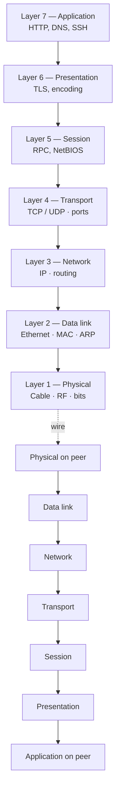
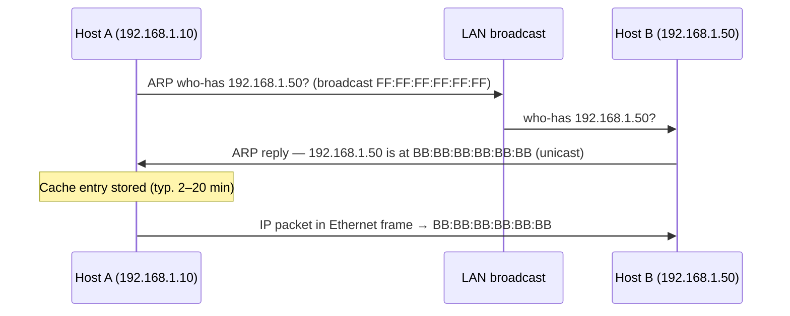
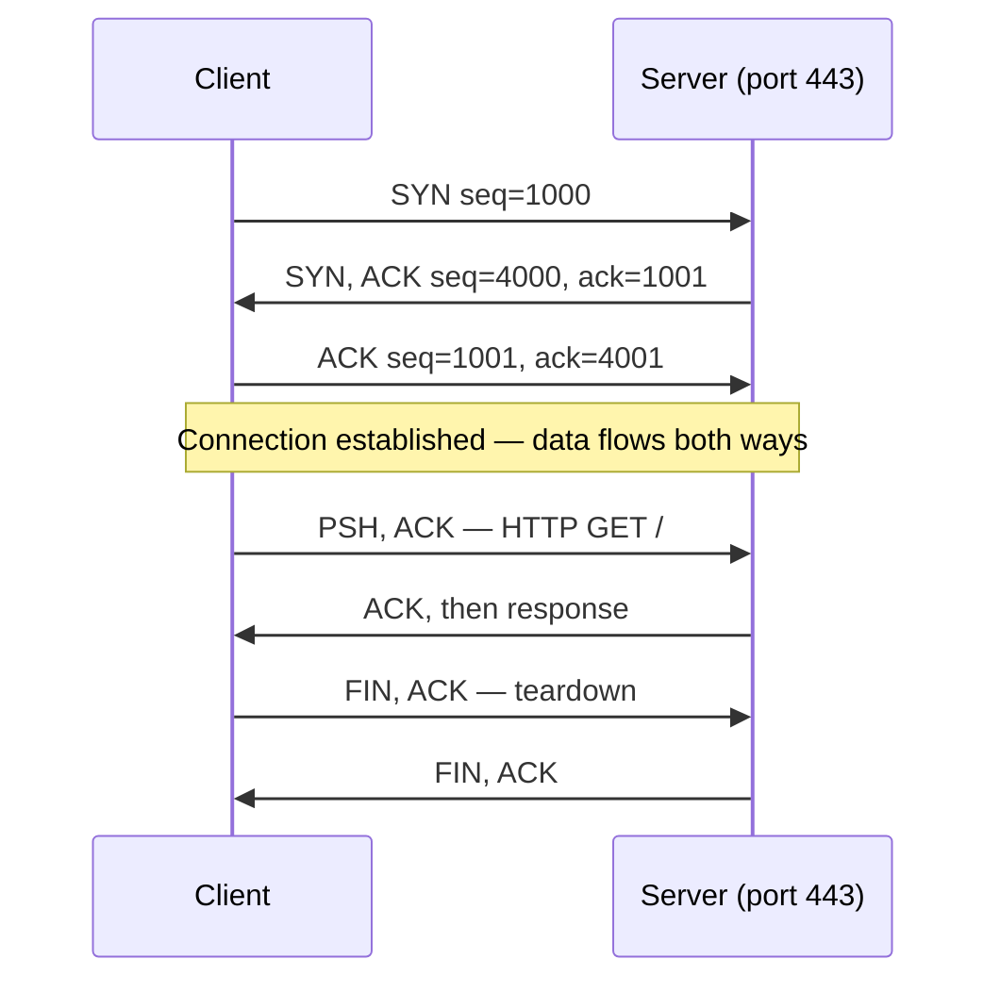
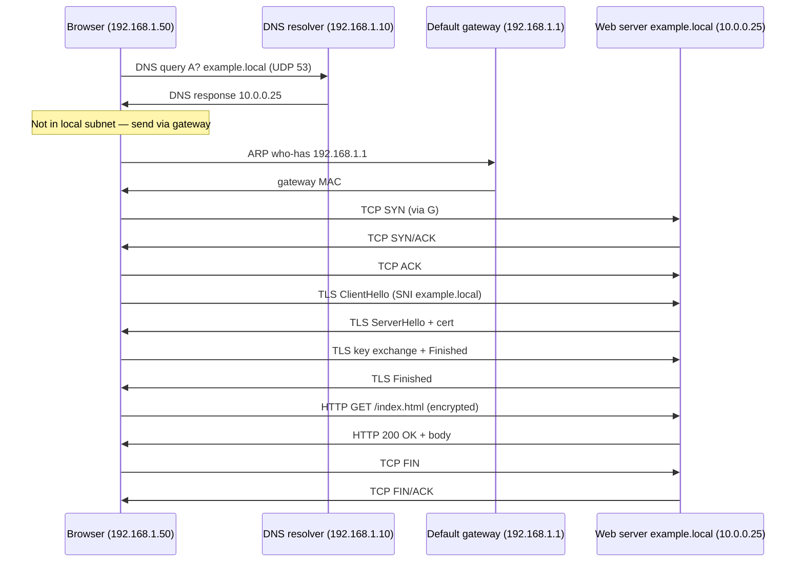

# Networking Fundamentals

Every security incident you will ever respond to ends up on a wire. Malware beacons over TCP 443. An attacker pivots through SMB on 445. A user complains the portal is "slow" and the real answer is a broken MTU three hops away. A SOC analyst who cannot read a PCAP is guessing, and a blue-teamer who cannot reason about routing will always lose to the person who can. Pen-testers live in ARP and DNS. Cloud engineers live in NAT and security groups. Even application developers spend half their debugging time on TLS and HTTP headers. Any infosec role is about 30% networking under the hood, and this lesson is the baseline you build everything else on.

This lesson is deliberately the **top-level overview**. The deep dives live in dedicated lessons — IP addressing and subnetting, DNS, DHCP, network types — and are linked where they fit. Read this one first; the others make more sense once the full stack is in your head.

A single idea before we start: on a real network, data doesn't teleport. It is framed, addressed, routed, segmented, reassembled, presented, and finally handed to an application. Every layer does exactly one thing. When something breaks, you ask **which layer**, not **what is wrong** — and the answer collapses fast.

## Two models side by side

The **OSI model** is seven layers and was the first attempt to describe *how* networks should work. The **TCP/IP model** is four layers and describes *how the Internet actually does* work. OSI is the vocabulary; TCP/IP is the implementation. Every engineer uses both — "Layer 7 problem" and "Layer 2 issue" are everyday speech, even though the packets on the wire follow TCP/IP.

| OSI layer | # | TCP/IP layer | What it does | Real protocol examples |
|---|---|---|---|---|
| Application | 7 | Application | User-facing protocols | HTTP, HTTPS, SMTP, SSH, DNS, FTP |
| Presentation | 6 | Application | Encoding, encryption, compression | TLS, MIME, JPEG, ASCII |
| Session | 5 | Application | Opening, maintaining, tearing down sessions | NetBIOS, RPC, SMB |
| Transport | 4 | Transport | End-to-end delivery, ports | TCP, UDP, QUIC |
| Network | 3 | Internet | Logical addressing, routing between networks | IP, ICMP, IPsec, OSPF, BGP |
| Data link | 2 | Network Access | Framing, MAC addressing on one link | Ethernet, Wi-Fi 802.11, ARP, VLAN (802.1Q) |
| Physical | 1 | Network Access | Electrical/optical signal, cable, RF | Copper UTP, fibre, RJ-45, signal modulation |

A rule of thumb: the **data** on your screen is broken down as it travels down the stack (application data → segments → packets → frames → bits) and reassembled on the way up. Every layer adds a header on the way down and strips it on the way up. That is **encapsulation**, and it is why packet captures look like nested boxes.



A useful mnemonic for the OSI stack, bottom-up: **P**lease **D**o **N**ot **T**hrow **S**ausage **P**izza **A**way.

## Ethernet and the data-link layer

Layer 2 is where a single physical segment becomes a functioning network. On a wired LAN the dominant technology is **Ethernet** (IEEE 802.3); on wireless it is Wi-Fi (IEEE 802.11). Both use the same idea — a frame with MAC addresses — so the concepts transfer.

### MAC addresses

Every network interface has a 48-bit **MAC address** burned in at the factory, written as six hex pairs: `AA:BB:CC:DD:EE:FF`. The first three octets are the **OUI** (Organizationally Unique Identifier) and identify the vendor — `00:50:56` is VMware, `F4:5C:89` is Apple, etc. The last three are the vendor's own serial.

A MAC address is only meaningful **on its own broadcast domain**. Once a frame leaves through a router, the original MAC is gone — the router rewrites the Layer 2 header with its own MAC. This is why you never "see" the MAC of a remote server, only the MAC of your default gateway.

### Ethernet frame, conceptually

```
┌───────────────┬───────────────┬─────────┬───────────────┬─────┐
│ Dest MAC (6B) │ Src MAC (6B)  │ Type(2B)│ Payload (IP…) │ FCS │
└───────────────┴───────────────┴─────────┴───────────────┴─────┘
```

The **Type** field tells the receiver what is inside the payload — `0x0800` means IPv4, `0x86DD` is IPv6, `0x0806` is ARP. **FCS** is a CRC used to detect corruption; a bad FCS means the frame is silently dropped.

### Hubs vs switches

| Device | OSI layer | Behaviour |
|---|---|---|
| **Hub** | 1 | Repeats every bit out of every port. Shared collision domain. Obsolete. |
| **Switch** | 2 | Learns which MAC is on which port (CAM/MAC table) and forwards only to the right port. |

Hubs mean everyone can sniff everyone's traffic — a wiretap that comes free with the device. Switches mean the frame only goes to its destination, which is better for performance and much better for security. You should not see a hub in any modern network; if you do, it is the first thing to replace.

### Broadcast domain

Every device in the same **broadcast domain** receives the same broadcasts (ARP who-has, DHCP Discover, etc.). A switch without VLANs is one big broadcast domain — which works fine until you have a few hundred devices and the broadcast traffic starts drowning out useful traffic.

### VLANs in one paragraph

A **VLAN** (Virtual LAN, 802.1Q) is a way to split a physical switch into several logical switches. Each VLAN is its own broadcast domain — hosts in VLAN 10 cannot talk to hosts in VLAN 20 at Layer 2 at all. To cross, traffic must go up to a router or Layer-3 switch, where you can apply ACLs, firewalls, or inspection. VLANs are how you keep printers, cameras, guests, servers, and user laptops separated on the same physical switch — a fundamental segmentation control.

## IP addressing and routing

Layer 3 is where a packet gets the *logical* address it needs to travel across networks. A MAC takes a frame across one wire; an IP takes a packet across the Internet.

### IPv4 at a glance

IPv4 addresses are 32 bits, written as four decimal octets: `192.168.1.50`. The address is divided into a **network** part and a **host** part by the **subnet mask** (`255.255.255.0` or the CIDR form `/24`). Two hosts whose network parts match are on the same subnet and can speak directly at Layer 2. Two hosts whose network parts differ must go through a **default gateway** — a router — to reach each other.

### IPv6 at a glance

IPv6 addresses are 128 bits, written as eight hex groups separated by colons: `2001:0db8:85a3:0000:0000:8a2e:0370:7334`. Leading zeros can be dropped and one run of all-zero groups can be collapsed with `::`, so that becomes `2001:db8:85a3::8a2e:370:7334`. IPv6 has no broadcasts (only multicast), supports autoconfiguration (SLAAC) out of the box, and its address space is effectively infinite. It is now the default on most cellular networks and large cloud providers — expect to see it.

### Private vs public

**Private** ranges (RFC 1918) are not routed on the Internet — they exist only inside organisations, with **NAT** translating between private and public at the edge.

| Range | CIDR | Typical use |
|---|---|---|
| `10.0.0.0 – 10.255.255.255` | `10.0.0.0/8` | Large enterprises, clouds |
| `172.16.0.0 – 172.31.255.255` | `172.16.0.0/12` | Medium networks |
| `192.168.0.0 – 192.168.255.255` | `192.168.0.0/16` | Home, small office |
| `169.254.0.0 – 169.254.255.255` | `169.254.0.0/16` | APIPA — DHCP failed, link-local only |
| `127.0.0.0 – 127.255.255.255` | `127.0.0.0/8` | Loopback (`localhost`) |

### CIDR in one table

CIDR (`/N`) tells you how many bits are the network part. Remember two or three of these and the rest fall out.

| CIDR | Mask | Hosts (usable) | Typical use |
|---|---|---|---|
| `/8` | `255.0.0.0` | 16,777,214 | Big ISP / RFC 1918 block |
| `/16` | `255.255.0.0` | 65,534 | Campus or large site |
| `/24` | `255.255.255.0` | 254 | Standard office subnet |
| `/25` | `255.255.255.128` | 126 | Small subnet |
| `/28` | `255.255.255.240` | 14 | Point-to-point, small DMZ |
| `/30` | `255.255.255.252` | 2 | WAN link |
| `/32` | `255.255.255.255` | 1 | Single host (ACLs, loopbacks) |

### Default gateway and routing table

Your machine's routing table is a very short list of rules: "for packets in this subnet, go out this interface; for everything else, send it to the gateway." The `0.0.0.0/0` entry — the **default route** — is where everything that doesn't match anything more specific goes. Routers extend that with dynamic protocols (OSPF, BGP) that let them learn paths from neighbours.

```text
PS> route print
IPv4 Route Table
===========================================================
Active Routes:
Network Destination        Netmask          Gateway       Interface   Metric
          0.0.0.0          0.0.0.0     192.168.1.1    192.168.1.50      25
      192.168.1.0    255.255.255.0         On-link     192.168.1.50     281
      192.168.1.50  255.255.255.255         On-link     192.168.1.50     281
===========================================================
```

Everything else about subnetting — how to split a `/24` into four `/26`s, VLSM, supernetting, IPv6 prefixes — lives in the dedicated lesson: see [IP addressing and subnetting](/networking/ip-addressing-subnetting).

## ARP — the glue between L2 and L3

You know the destination's IP. The switch in front of you only understands MACs. How do you bridge that gap? **ARP** (Address Resolution Protocol, RFC 826) is the answer.

When host A wants to send a packet to IP `192.168.1.50` and does not know its MAC, it **broadcasts** a question: "Who has 192.168.1.50? Tell me." Every host on the LAN hears it; the owner of `.50` replies directly with its MAC. A records the mapping in its **ARP cache** for a few minutes and fires off the packet.



Inspect the cache on either OS:

```powershell
# Windows
arp -a
```

```bash
# Linux
ip neigh show
```

The ugly reality of ARP is that it has **no authentication**. Any host on the LAN can send a gratuitous ARP claiming to be the gateway, and everyone else will dutifully update their cache and start sending their traffic through the attacker — **ARP spoofing** / ARP poisoning, one of the oldest and still the most common Layer-2 attacks. We cover the attack and its defences (DAI, port security, static ARP) in a later lesson. For now, know that ARP is fast, stateless, and trusting.

## Transport layer: TCP vs UDP

Layer 4 is where "host talks to host" becomes "**application** talks to **application**." The two main protocols are **TCP** (reliable, connection-oriented) and **UDP** (best-effort, connectionless).

### TCP in one page

TCP gives you an ordered, reliable byte stream between two endpoints, identified by `(source IP : source port) ↔ (dest IP : dest port)`. It guarantees delivery by numbering every byte (**sequence number**) and acknowledging what has been received (**ack number**). Lost segments are retransmitted; reordered segments are put back in order; flow is controlled by a **sliding window** so a fast sender cannot overwhelm a slow receiver.

Before any data flows, the two peers complete a **three-way handshake** — the thing you will see thousands of times in Wireshark.



### TCP flags

Every TCP segment carries a 6-bit flag field. Memorise these six — every tool from `tcpdump` to an IDS shows them.

| Flag | Meaning |
|---|---|
| **SYN** | Open a connection (initial seq number) |
| **ACK** | Acknowledging received data |
| **FIN** | Clean close — "I'm done sending" |
| **RST** | Abrupt reset — tear down now |
| **PSH** | Push buffered data to the application immediately |
| **URG** | Urgent pointer valid (rare) |

A `SYN` with no matching service on the target gets a `RST` back — that is how a port scanner tells "closed" from "open". A half-open connection stuck in `SYN_SENT` is probably a filtered port or a firewall dropping the packet.

### UDP in one paragraph

UDP (RFC 768) is a thin wrapper: source port, dest port, length, checksum, payload. No handshake, no acknowledgement, no retransmission, no order. If a packet is lost, it's lost. The application on top decides what to do (or doesn't care). This is why UDP is used where speed matters more than perfect delivery: DNS queries, DHCP, VoIP, game traffic, video streaming, syslog, SNMP. The new **QUIC** protocol (which HTTP/3 rides on) uses UDP and rebuilds reliability inside it, skipping the kernel TCP stack entirely.

### When to use which

| Use TCP when… | Use UDP when… |
|---|---|
| Losing a byte is unacceptable (HTTPS, SSH, SMTP) | A dropped packet is easier to replace than to wait for |
| Data must arrive in order | The app handles its own ordering (RTP timestamps) |
| Throughput matters less than correctness | Latency matters more than correctness |
| Sessions are long-lived | Exchanges are one-shot (DNS query) |

Sliding-window flow control: the receiver advertises how much buffer it has, and the sender never has more unacknowledged bytes in flight than that — it is how TCP self-paces without fair-queueing in the routers.

## Ports and protocol cheat-sheet

Every TCP/UDP connection is identified by **five pieces**: protocol, source IP, source port, destination IP, destination port. Ports run 0–65535. Ports **0–1023** are "well-known" and require root/admin to bind; **1024–49151** are "registered"; **49152–65535** are ephemeral / dynamic and handed out to client connections.

Thirty ports you will actually see in the wild:

| Port | Proto | Service | Why it matters |
|---|---|---|---|
| 20 / 21 | TCP | FTP data / control | Legacy file transfer, cleartext |
| 22 | TCP | SSH / SCP / SFTP | Remote admin everywhere |
| 23 | TCP | Telnet | Cleartext remote shell — red flag |
| 25 | TCP | SMTP | Mail submission (server-to-server) |
| 53 | TCP/UDP | DNS | Name resolution — UDP for queries, TCP for large/AXFR |
| 67 / 68 | UDP | DHCP server / client | DORA |
| 69 | UDP | TFTP | Network boot, config backup |
| 80 | TCP | HTTP | Plain web — almost always redirected to 443 |
| 88 | TCP/UDP | Kerberos | Windows auth |
| 110 | TCP | POP3 | Mail retrieval, legacy |
| 123 | UDP | NTP | Time sync — critical for Kerberos, logs |
| 137 / 138 / 139 | UDP/TCP | NetBIOS | Legacy Windows file/name service |
| 143 | TCP | IMAP | Mail retrieval, modern |
| 161 / 162 | UDP | SNMP / SNMP trap | Network device monitoring |
| 389 | TCP/UDP | LDAP | Directory lookups |
| 443 | TCP | HTTPS | Web over TLS — the default |
| 445 | TCP | SMB / CIFS | Windows file sharing — ransomware favourite |
| 465 / 587 | TCP | SMTPS / submission | Authenticated mail submission |
| 500 | UDP | IKE | IPsec VPN key exchange |
| 514 | UDP | Syslog | Log shipping |
| 636 | TCP | LDAPS | LDAP over TLS |
| 993 | TCP | IMAPS | Secure IMAP |
| 995 | TCP | POP3S | Secure POP3 |
| 1433 | TCP | MSSQL | Microsoft SQL Server |
| 1521 | TCP | Oracle DB | Oracle listener |
| 3306 | TCP | MySQL / MariaDB | Open-source SQL |
| 3389 | TCP | RDP | Remote desktop |
| 5432 | TCP | PostgreSQL | Open-source SQL |
| 5985 / 5986 | TCP | WinRM / WinRM-HTTPS | PowerShell remoting |
| 8080 / 8443 | TCP | HTTP-alt / HTTPS-alt | Proxies, admin UIs |

Security habit: when you see an **unexpected listening port** on a host, treat it as guilty until proven innocent. Backdoors love obscure high ports; a forgotten test server loves 8080.

## DNS and DHCP in 60 seconds

**DNS** (Domain Name System) converts names you can type (`example.local`) to addresses the stack can route (`10.0.0.25`). Without DNS, the web becomes unusable within seconds. The query normally runs over UDP 53 and falls back to TCP 53 for large answers and zone transfers. DNS is also one of the most abused protocols on the Internet — cache poisoning, tunnelling, typosquatting, DGA-powered malware. Full deep dive: [DNS](/networking/dns).

**DHCP** (Dynamic Host Configuration Protocol) hands new clients their IP, mask, gateway and DNS servers automatically via the four-step **DORA** exchange (Discover, Offer, Request, Acknowledge) on UDP 67/68. Without it, every machine needs manual IP configuration — which at fleet scale is both tedious and a constant source of address conflicts. Full deep dive: [DHCP](/networking/dhcp).

The two are the **invisible infrastructure** of every network you will ever touch: when they break, everything looks broken.

## Network devices you'll meet

Every piece of networking kit makes a forwarding decision at a specific layer. Knowing which layer a device works at tells you what it can and cannot protect.

| Device | OSI layer | Decision based on |
|---|---|---|
| Hub | 1 | Repeats bits. No decision. |
| Switch | 2 | Destination MAC → CAM table → correct port |
| Router | 3 | Destination IP → routing table → next hop |
| Stateless firewall | 3–4 | 5-tuple ACL, per-packet |
| Stateful firewall | 3–4 | Connection state table + ACL |
| Next-gen firewall (NGFW) | 3–7 | Plus app ID, user ID, TLS inspection |
| Load balancer | 4 (L4) or 7 (L7) | Pool health + algorithm (round-robin, least-conn, hash) |
| Forward proxy | 7 | Acts on behalf of clients going out |
| Reverse proxy | 7 | Acts on behalf of servers taking traffic in |
| IDS / IPS | 3–7 | Signature / anomaly detection (IDS alerts, IPS blocks) |
| WAF (Web App Firewall) | 7 | HTTP request inspection (SQLi, XSS, OWASP Top 10) |
| NAT gateway | 3 | Rewrites source IP/port — private ↔ public |
| VPN concentrator | 3 | IPsec/SSL tunnels + routing |

Two distinctions worth internalising:

- **Stateless** firewall allows/denies each packet in isolation — fast, but oblivious. **Stateful** firewall tracks the connection (`SYN` → `SYN/ACK` → `ACK` → established) and only allows return traffic that belongs to a known session. Almost everything modern is stateful.
- **Forward proxy** sits between your users and the Internet — content filtering, malware scanning, outbound DLP. **Reverse proxy** sits between the Internet and your servers — TLS termination, caching, WAF, load balancing. Same technology, opposite direction.

## Putting it together — what happens when you type `https://example.local/index.html`

This is the "everything clicks" section. The end-to-end walk from the moment you hit Enter to the moment the page renders touches every layer in this lesson. Follow it once slowly, and networking stops being a bag of disconnected terms.

Assume you are on `192.168.1.50/24`, the gateway is `192.168.1.1`, your DNS server is `192.168.1.10`, the web server `example.local` lives at `10.0.0.25`, and nothing is cached.

1. **Browser parses the URL.** Scheme `https`, host `example.local`, port defaults to `443`, path `/index.html`.
2. **DNS lookup.** The OS resolver asks `192.168.1.10` over UDP 53: "A record for `example.local`?" Before the UDP packet can go out, the OS needs the MAC of the DNS server. That server is on the same subnet, so:
3. **ARP.** "Who has `192.168.1.10`?" → reply `AA:BB:CC:...`. Cached.
4. **DNS query/response.** Answer: `10.0.0.25`. Cached for the TTL.
5. **Routing decision.** `10.0.0.25` is **not** in `192.168.1.0/24`, so the packet goes to the default gateway. Another ARP if the gateway's MAC isn't cached: "Who has `192.168.1.1`?" → gateway replies.
6. **TCP 3-way handshake.** `SYN` → `SYN/ACK` → `ACK` between `192.168.1.50:51000` and `10.0.0.25:443`. All IP packets go out with the gateway's MAC as the next hop; the router rewrites Layer 2 and forwards toward `10.0.0.25`.
7. **TLS handshake.** ClientHello (supported ciphers, SNI `example.local`) → ServerHello (chosen cipher, cert chain) → key exchange → **Finished**. Now the tunnel is encrypted.
8. **HTTP request inside TLS.** `GET /index.html HTTP/1.1`, headers, end.
9. **Server response.** `200 OK`, headers, body. TCP segments carry it back, ack'd in the opposite direction.
10. **Browser renders.** Parses HTML, discovers CSS / JS / images, and repeats steps 5–9 for each (often on the **same** TCP connection — HTTP keep-alive — or HTTP/2 multiplexed).
11. **Teardown.** When the tab closes or the timer fires, `FIN` / `FIN/ACK` closes the TCP connection cleanly. If either side is rude, a `RST` ends it abruptly.



Once you can explain this diagram without looking, you *speak* networking.

## Hands-on

Five exercises, all doable on any laptop. Do them in order.

### 1. Read your own configuration

On Windows:

```powershell
ipconfig /all
```

On Linux:

```bash
ip a
ip r
```

Identify, for your active interface: the MAC (`physical address`), the IPv4 and its mask, the default gateway, and the DNS servers. Sketch them on paper. This is the ground truth for everything else.

### 2. Trace the path to 8.8.8.8

Windows:

```powershell
tracert 8.8.8.8
```

Linux:

```bash
traceroute 8.8.8.8
```

Every line is one hop — one router your packet crosses. The first hop is your gateway; the last few hops are Google's edge; the middle is your ISP's core. A `* * *` means the hop didn't reply to ICMP/UDP probes — that is common and not usually a problem. Look at the RTT (round-trip time): which hop first went over 20 ms? That is probably the one carrying your traffic to another city.

### 3. Capture a real TCP 3-way handshake

Install **Wireshark**. Start a capture on your active interface with the filter:

```text
tcp and host neverssl.com
```

In a browser go to `http://neverssl.com` (plain HTTP — easier to see without TLS in the way). Stop the capture. Find the first three packets of the flow:

- Client → server with flag **SYN** only
- Server → client with flags **SYN, ACK**
- Client → server with flag **ACK**

Right-click any of them → **Follow → TCP Stream** to see the whole conversation reassembled. Note how the sequence numbers increment.

### 4. Resolve a domain two ways

```powershell
# Windows — A record
nslookup example.com

# Mail-exchange records
nslookup -type=mx example.com
```

```bash
# Linux — same with dig
dig example.com A +short
dig example.com MX +short
```

The A record tells you the IP. The MX records tell you which mail server accepts mail for the domain, in priority order. Both are answered by the same DNS infrastructure, just different record types.

### 5. List listening services

On any Linux host you can reach:

```bash
sudo ss -tulpn
```

`-t` TCP, `-u` UDP, `-l` listening, `-p` process, `-n` numeric. Every line is a socket your machine is listening on, with the port and the process. Map each port to the cheat-sheet table above — that is what your box is exposing. Do the same on Windows with:

```powershell
Get-NetTCPConnection -State Listen | Sort-Object LocalPort | Format-Table LocalAddress, LocalPort, OwningProcess
```

Unexpected listener? Good catch — find out why it exists before you do anything else.

## Worked example — diagnosing "the printer is slow" at example.local

User calls: "Printing to `printer01.example.local` is really slow today." A junior reaches for the printer and restarts it. A networking-literate engineer walks the stack.

**Layer 1 — is it even on?** You can't diagnose what isn't plugged in. `ping -n 4 printer01.example.local` — three of four replies, but with 600 ms latency on the slow ones. So it **is** alive, and it **is** reachable, but something on the path is misbehaving. Do not pull the cable yet.

**Layer 3 — where does the latency come from?** `tracert printer01.example.local` shows two hops. The first hop (the gateway) is 1 ms. The second hop (the printer) is 600 ms. So the delay is on the printer's side of the LAN or in the printer itself, not upstream.

**Layer 2 — is ARP sane?** `arp -a | Select-String printer01-IP`. The MAC matches the printer's usual MAC (you keep a list). Good — this rules out ARP poisoning or a duplicate IP having been assigned. If the MAC had changed, you'd go to the switch next.

**The switch — where is the MAC?** On a managed switch, `show mac address-table address AABB.CCDD.EEFF` pinpoints the port. You can see duplex and error counters with `show interfaces GigabitEthernet0/12`. A cracked patch cable or a fallback to half-duplex is a classic "suddenly slow" cause: the interface shows `CRC errors` climbing.

**Layer 7 — DNS resolution.** Is `printer01.example.local` even resolving to the right thing? `nslookup printer01.example.local` — answer matches the current IP. If it had resolved to an old, decommissioned IP, that would explain 4× retries per print job.

**Port 9100 — is the print service listening?** Most network printers expose **raw print** on TCP 9100. From a workstation:

```powershell
Test-NetConnection -ComputerName printer01.example.local -Port 9100
```

`TcpTestSucceeded : True`. The port is open, the printer will accept a job.

**Firewall rules.** The server is on a different VLAN than the printer. Check that a rule allows the print server's source IP → printer01 on TCP 9100 (raw) and TCP 515 (LPD if used). Firewall shows a `deny` hit count spiking since yesterday's rule update — someone narrowed the allow-rule and broke the retry path.

**Conclusion.** The "slow printer" is actually intermittent firewall drops on a retry port the print server uses as fallback. Fix the rule, clear the queue, printing returns to normal. No cables pulled. No hardware replaced. This is the difference a layered diagnosis makes: you ask *which layer* — and the answer arrives in minutes instead of hours.

## Common misconceptions

**"The OSI model is how the Internet runs."** It isn't. The Internet runs on TCP/IP. OSI is a teaching model — use it for vocabulary and troubleshooting, not to expect an `L5` header in the packet.

**"NAT is a firewall."** It isn't. NAT translates addresses; it doesn't *inspect* traffic. The fact that most home routers bundle NAT + firewall has created a generation of people who think NAT makes them secure. It doesn't — any outbound connection from inside can carry an attacker's C2.

**"Firewalls are magic."** They apply rules you wrote. If the rule allows `any → web-server:443`, the firewall will happily let malicious payloads through on 443. Firewalls without monitoring are just expensive speed bumps.

**"Private IP means safe."** It means "not directly routable from the Internet." Everything you run inside — AD, databases, file shares — is a lateral-movement target once anyone gets in. Assume breach, segment by VLAN and firewall, and patch.

**"DNS cache poisoning is an Internet-only problem."** It isn't. A compromised machine on your LAN can poison the local resolver, hijack internal name resolution, and route users to fake portals. Local DNS needs the same scrutiny as perimeter DNS.

**"If I block ICMP, attackers can't find my hosts."** They will still find them. ICMP makes reconnaissance easier, but any scan using TCP SYN or UDP probes will map live hosts regardless. Blocking ICMP also breaks path-MTU discovery and troubleshooting. Rate-limit ICMP instead of dropping it.

**"Wi-Fi and Ethernet are the same thing."** Up at Layer 3 and above, yes. At Layer 2 they are very different: Wi-Fi is a shared, half-duplex medium with collisions, retries, roaming, and authentication — far more things to go wrong. When both a wired and wireless device misbehave the same way, the problem is at Layer 3 or above.

## Key takeaways

- Every packet has a journey through layers — when something breaks, ask *which layer*, not *what is wrong*.
- OSI is the vocabulary, TCP/IP is the implementation. Use them together.
- MAC addresses matter only inside one broadcast domain; IPs travel between them.
- TCP gives reliability at the cost of latency; UDP gives speed at the cost of guarantees. Pick deliberately.
- ARP and DNS are fast, trusting, and constant targets — understand how they fail before the attacker shows you.
- NAT is not security, ICMP-off is not stealth, and private IP is not safe. Segment properly.
- A SOC analyst who can't read a PCAP is guessing. Wireshark is the single best investment in your fundamentals.
- Reading this lesson once is not enough — redo the hands-on exercises on every new network you touch until the mental model is automatic.

## References

- RFC 791 — Internet Protocol (IPv4): https://www.rfc-editor.org/rfc/rfc791
- RFC 793 — Transmission Control Protocol (original): https://www.rfc-editor.org/rfc/rfc793
- RFC 9293 — TCP (modern rewrite, 2022): https://www.rfc-editor.org/rfc/rfc9293
- RFC 826 — Address Resolution Protocol: https://www.rfc-editor.org/rfc/rfc826
- RFC 1918 — Address Allocation for Private Internets: https://www.rfc-editor.org/rfc/rfc1918
- RFC 8200 — IPv6 Specification: https://www.rfc-editor.org/rfc/rfc8200
- Cloudflare Learning Center — What is the OSI Model: https://www.cloudflare.com/learning/ddos/glossary/open-systems-interconnection-model-osi/
- Cloudflare Learning Center — TCP vs UDP: https://www.cloudflare.com/learning/ddos/glossary/user-datagram-protocol-udp/
- Cisco — Networking Basics: https://www.cisco.com/c/en/us/solutions/small-business/resource-center/networking/networking-basics.html
- Wireshark User Guide: https://www.wireshark.org/docs/wsug_html_chunked/
- IANA Service Name and Transport Protocol Port Number Registry: https://www.iana.org/assignments/service-names-port-numbers/service-names-port-numbers.xhtml
