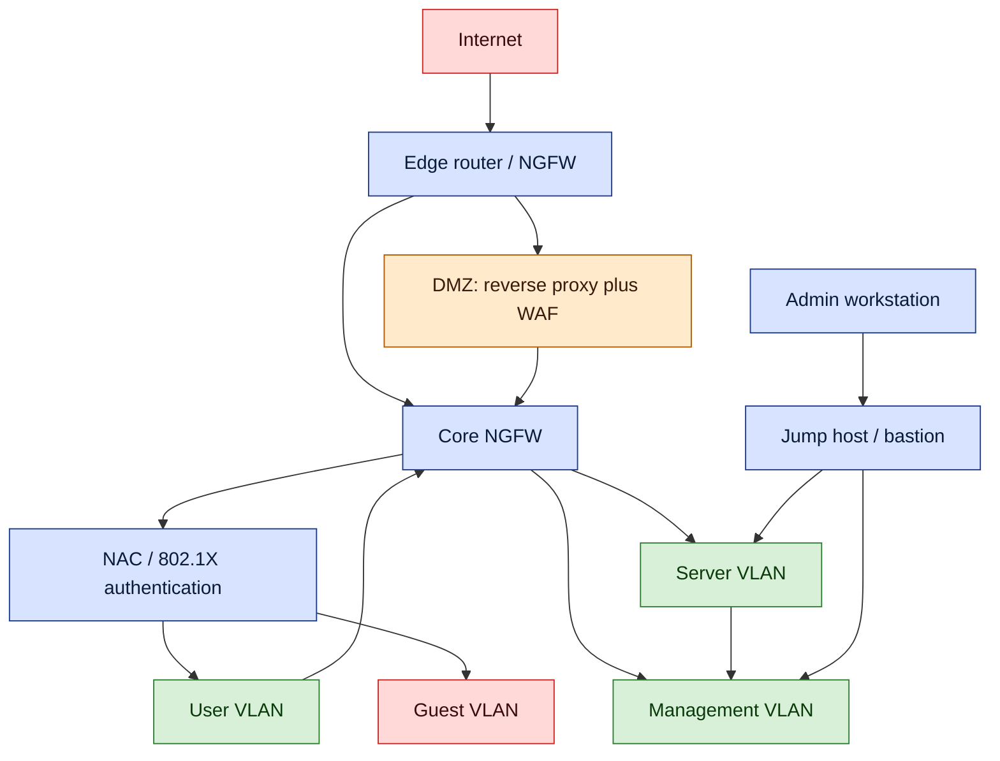

# Secure Network Design

## Why this matters

A flat network — one broadcast domain, one address space, one set of firewall rules at the perimeter — is the default that most organisations start with and almost none should stay with. Every host can talk to every other host, every user VLAN can reach every server, and once an attacker lands on any endpoint the rest of the estate is one `nmap` away. The castle-and-moat model assumes the moat holds; modern attacks, from phishing to supply-chain compromise to malicious insiders, routinely start inside the moat.

Secure network design is the discipline of deciding, deliberately, which parts of the network can reach which other parts, what has to authenticate on the way, what inspects the traffic in transit, and what records the evidence if something goes wrong. It is not one control — it is a stack: segmentation at layer 2 and 3, access control at the port and at the session, perimeter inspection for traffic crossing zone boundaries, encrypted transport for anything that leaves a trusted zone, and monitoring that can answer "what happened" after the fact.

The payoff is measured in blast radius. A well-segmented network with zero-trust admission, port security on the access layer, an NGFW between zones, and a jump host for administrative access turns a compromised laptop into a contained incident. The same compromise on a flat network is a domain-wide event. Every control in this lesson exists to shrink the blast radius of the next incident.

This lesson uses the fictional `example.local` organisation and the `EXAMPLE\` domain for worked examples. Port numbers, protocol references, and configuration fragments are included so that the lesson doubles as a field reference.

## Core concepts

Secure network design spans every layer of the stack. Some controls operate at layer 2 (port security, BPDU Guard, DHCP snooping, VLANs). Some at layer 3 (ACLs, routing protocols, NAT). Some at layer 7 (WAF, URL filters, proxies). Knowing which layer a control lives at tells you what it can and cannot see, and therefore what it can and cannot protect.

### Segmentation and zones — VLANs, extranet, intranet, east-west traffic, zero trust

**Network segmentation** is the configuration of network devices to limit traffic between different parts of the estate. Segmentation rarely requires more hardware; it is a matter of how the existing switches, routers, and firewalls are configured to forward (or refuse to forward) traffic across defined boundaries. A database cluster that never initiates outbound connections to the internet can live in a segment where routing rules forbid that path entirely. A screened subnet (DMZ) is a segment reachable from both the internet and the internal network but not traversable in a single hop between them.

**Virtual LANs (VLANs)** are the layer 2 building block of segmentation. A VLAN is a logical LAN implemented in switch configuration — hosts on physically different switches behave as if they shared one broadcast domain, and hosts on the same switch can be placed in different broadcast domains. VLANs give administrators the ability to reorganise the network by function (finance, engineering, servers, guests) without recabling. **Trunking** is the technique that carries multiple VLANs across a single inter-switch link, tagged with 802.1Q headers so the receiving switch knows which VLAN each frame belongs to. Hosts on different VLANs cannot talk directly through a trunk — they must cross a router or layer-3 switch where ACLs and inspection can be applied.

**East-west traffic** is the data flow between functionally related systems inside the enterprise — a web tier talking to its application tier, an application tier talking to its database tier, a backup server pulling from file servers. **North-south traffic** is data in or out of the data centre or enterprise boundary. The distinction matters because most legacy security spend was north-south (perimeter firewalls, internet proxies) while the volume of modern attacks moves east-west after an initial foothold. Segmentation that only addresses the perimeter leaves east-west traffic in the clear.

**Intranet** is a network inside the trusted area of an organisation, under the security control of the same administrators. It carries the same protocols as the internet (HTTP, file sharing, messaging) but with the added assumption of trust among its users and devices. **Extranet** is a controlled extension of the intranet to selected external partners — customers, suppliers, contractors — typically carried over VPN across the public internet. An extranet implies privacy (partners should not see each other) and security (unauthorised outsiders are kept out), enforced through firewalls, authentication, encryption, and sometimes dedicated DMZ-style zones.

**Zero trust** is a security model that rejects the castle-and-moat assumption. Rather than granting access based on network location (inside the LAN = trusted), zero-trust architectures verify every access request's authentication and authorisation, regardless of origin. The practical implications are identity-aware proxies in front of every resource, microsegmentation that isolates workloads from one another, device posture checks before sessions are granted, and continuous monitoring rather than one-shot admission. Zero trust does not mean "no trust" — it means "do not rely on location alone as a trust signal."

### Remote connectivity — VPN, always-on, split versus full tunnel, remote-access versus site-to-site

**VPN (Virtual Private Network)** technologies connect two networks, or a remote device and a network, securely across an untrusted intermediate network (usually the internet) by tunnelling. Common VPN protocols include IPSec, SSL/TLS, L2TP, and SSH. Only the endpoints hold the keys — intermediate hops carry encrypted packets they cannot read. The two dominant uses are site-to-site and remote-access.

**Always-on VPN** avoids the friction of the user having to launch a VPN client and enter credentials every time they want to work. Pre-provisioned connection parameters and device-stored credentials let the VPN self-establish as soon as the device has an internet connection. This increases compliance (users cannot forget to connect) but raises the stakes on device-level security — a compromised endpoint with always-on VPN is an attacker permanently inside the tunnel.

**Split tunnel versus full tunnel.** A **full-tunnel** VPN routes all of the client's traffic through the corporate gateway — internal traffic plus internet traffic — and inspects or filters it according to corporate policy. A **split-tunnel** VPN only sends corporate-destined traffic through the VPN; the rest goes direct to the internet from the client. Full tunnels are more secure (all traffic inspected, leak paths closed) but bandwidth-hungry. Split tunnels reduce VPN load but expose the client's non-VPN path to attack, and a compromised client can pivot between the two networks. The trade-off depends on the threat model: finance and admin roles usually get full tunnel; general staff often get split tunnel for usability.

**Remote-access VPN** connects an individual device (a laptop, a phone) to a corporate network, making it behave as if plugged into the office LAN. The security implication is the obvious one: if you would not trust that device to be physically connected inside the building, you should not trust it on remote-access VPN either.

**Site-to-site VPN** connects two networks (two offices, an office and a cloud VPC, partner networks) across an intermediate network. Encryption at each end turns the public path between them into an opaque tunnel. IPSec in tunnel mode is the standard building block; SSL VPN alternatives exist for environments where IPSec is impractical.

### Access enforcement — NAC, 802.1X, out-of-band management, jump servers

**NAC (Network Access Control)** manages which endpoints are allowed onto the network, on a case-by-case basis at the moment of connection. The principle is that every new connection is an additional risk until the endpoint's posture (operating system patch level, antivirus status, domain membership, certificate) is checked. Two historical implementations illustrate the idea: Microsoft's Network Access Protection (NAP) and Cisco's Network Admission Control (NAC) — the industry uses "NAC" as the generic term today.

**Agent versus agentless NAC.** An **agent-based** NAC solution runs a small piece of software on each managed endpoint; the agent checks posture and reports to the NAC server before the network grants access. The upside is rich posture data; the downside is deploying, updating, and supporting the agent across every OS in the estate. **Agentless** NAC performs the same checks from the network side, typically via Active Directory group policy at login, DHCP fingerprinting, or intrusion prevention signatures. The code does not persist on the host. In performance terms the two are similar when deployed well; the difference is operational — is an agent feasible on your device population, or not.

**802.1X** is the IEEE port-based authentication standard that NAC commonly rides on. Before a port forwards traffic to the network, the attached device authenticates to an authentication server (usually RADIUS) via EAP, typically with a client certificate or username/password. If authentication fails, the port stays in an unauthorised state or is placed in a guest VLAN. 802.1X is the layer-2 enforcement point for "only authenticated devices may join the LAN" and is a building block for zero-trust admission.

**Out-of-band management** means the channel used to manage a device is physically separate from the channel that carries the device's production traffic. In-band management — SSH over the same switch ports that carry user data — is simpler but fails exactly when the network fails, leaving administrators unable to reach the device they need to fix. Out-of-band uses a dedicated management interface, often on a separate management VLAN or even a separate physical network, so that production outages do not take the management path down with them. Serial consoles, console servers, and lights-out management (iDRAC, iLO, IPMI) are classic out-of-band tools.

**Jump servers (bastion hosts)** are hardened systems placed on a boundary between zones, used as the only authorised entry point to a protected area. An administrator connects to the jump host first — authenticated, logged, and monitored — and only from the jump host can reach the internal devices. The alternative (allowing direct SSH/RDP from admin workstations to every server) multiplies attack paths; the jump host concentrates and audits them. A jump host should be minimal (no running services beyond SSH/RDP), patched aggressively, protected by MFA, and its session logs centralised.

### Switch-level hardening — port security, BPDU Guard, DHCP snooping, MAC filtering, broadcast storm and loop prevention

Access-layer switches see every frame entering the network, and a compromised switch or a rogue device plugged into a switch port is a layer-2 foothold that bypasses most higher-layer controls. Switch hardening is unglamorous but essential.

**Port security** controls which devices, and how many of them, may connect via each physical switch port. Enforcement is by MAC address — not perfect (MACs can be spoofed) but a meaningful speed bump. Port security has three common learning modes:

- **Static learning.** An administrator configures the allowed MAC address on the port. Useful for fixed hardware — a printer, a kiosk, a server. The downside is the administrative overhead of knowing every MAC in advance.
- **Dynamic learning.** The switch learns MAC addresses as they connect, up to a configured maximum. Useful where a small number of devices are expected but not known in advance.
- **Sticky learning.** Like dynamic, but the learned addresses are written to persistent configuration so they survive a reboot. This prevents an attacker from power-cycling the switch to reset the learned table.

When the port-security violation threshold is exceeded, the port can be configured to shut down, restrict (drop offending frames but keep the port up), or protect (drop silently).

**Broadcast storm prevention** addresses flooding — ping floods, SYN floods, Smurf attacks, general traffic flooding — that overwhelm a segment. Flood guards monitor broadcast, multicast, and unicast traffic rates per port or per VLAN; when the rate crosses a threshold, the switch rate-limits or blocks the offending traffic. Detecting a flood is relatively easy; the skill is in mitigating it without cutting legitimate bursts (backups, large file transfers).

**BPDU Guard** protects the Spanning Tree Protocol. STP uses Bridge Protocol Data Units to negotiate a loop-free topology; an attacker who injects crafted BPDUs on an edge port can force repeated STP recalculations, consuming switch CPU and causing network instability — a denial-of-service condition. BPDU Guard, enabled on access ports where BPDUs should never appear, drops such packets and typically shuts the offending port to `err-disabled`.

**Loop prevention at layer 2** uses Spanning Tree Protocol (STP) and its successors (Rapid STP, Multiple STP). Layer 2 frames have no TTL, so a loop at layer 2 is permanent until intervention. STP elects a root bridge, computes a spanning tree, and blocks redundant links to guarantee a single active path between any two points; if the active path fails, STP unblocks an alternate. OSPF (Open Shortest Path First) is the layer-3 equivalent for routing between gateways in an autonomous system, computing loop-free paths through a link-state database.

**DHCP snooping** defends against rogue DHCP servers. Without it, any device on the LAN can answer a DHCP discovery and hand out addresses, gateways, and DNS servers — a classic man-in-the-middle vector. DHCP snooping configured on a switch marks each port as trusted or untrusted; DHCP server messages from untrusted ports are dropped. The feature is standardised in RFC 7513. It also builds a binding table (MAC, IP, VLAN, port, lease) that can be fed to Dynamic ARP Inspection and IP Source Guard for deeper layer-2 protection.

**MAC filtering** selectively admits or denies packets based on source MAC address. On wired switches it provides a basic form of machine authentication — combined with port security it keeps the "wrong cable in the wrong port" case from silently granting access. In wireless networks, MAC filtering is much weaker because an attacker can passively observe allowed MACs on the air and spoof them; it should not be relied on as a primary wireless control.

### Perimeter and inspection — NGFW, UTM, WAF, NIDS/NIPS, proxies, content and URL filtering

Traffic that crosses zone boundaries — internet to DMZ, DMZ to internal, internal to management — is inspected. The inspection layer is a stack of devices each optimised for a different part of the problem.

**Next-generation firewall (NGFW).** A stateful packet-inspection firewall that also performs deep packet inspection (DPI) — inspecting the payload, not just headers — and includes intrusion prevention capabilities. NGFWs identify applications regardless of port, block based on user identity (via AD integration), and enforce policy on HTTPS after TLS decryption. They are the dominant perimeter and inter-zone control in modern enterprise networks.

**Unified Threat Management (UTM).** A marketing term for a single appliance that bundles firewall, IDS/IPS, antivirus, anti-spam, content filtering, VPN, and sometimes switching or routing. UTMs trade specialised performance for simplicity and cost — they target small and midsize networks where one device at the edge is easier to run than five. The throughput and feature parity varies by vendor and workload; the more features enabled simultaneously, the more the single device is stressed.

**Web application firewall (WAF).** An application-layer firewall focused specifically on HTTP and HTTPS traffic to web servers and APIs. A WAF inspects HTTP requests for patterns of attack — SQL injection, cross-site scripting, path traversal, command injection, XML external entity attacks, OWASP Top 10 generally — and blocks or alerts before the request reaches the web server. Unlike a network firewall, which looks at all traffic but does not understand HTTP semantics, a WAF understands the protocol and can reason about URL paths, headers, cookies, and body content.

**NIDS and NIPS.** A **network-based intrusion detection system (NIDS)** observes network traffic, compares it against a signature database and behavioural rules, and alerts when a match occurs. A **network-based intrusion prevention system (NIPS)** has the same detection engine but can also block traffic — drop the packet, reset the connection, or reprogram the firewall — when a match indicates an attack. A typical NIDS/NIPS has four logical components: a **traffic collector (sensor)** that copies or intercepts traffic; an **analysis engine** that compares traffic against patterns; a **signature database** of known-bad patterns; and a **user interface** for alerts, tuning, and investigation.

**Inline versus passive.** The deployment mode determines what a NIDS/NIPS can do. An **inline (in-band)** sensor sits in the path of traffic — every packet passes through it, and it can drop packets in real time. This gives strong protection but adds latency and a failure mode (sensor down = traffic down, unless bypassed). A **passive (out-of-band)** sensor receives a copy of traffic via a SPAN/mirror port and alerts after the fact; it cannot block in real time but it does not risk bringing down production. High-value segments with predictable traffic (database front-ends) often use inline; broad visibility across the whole estate is usually passive.

**Proxy servers** mediate traffic between clients and servers. A proxy can filter requests, cache responses, log activity, enforce acceptable-use policy, and terminate encrypted connections for inspection.

- **Forward proxy.** Sits on the client side, forwarding outbound requests on behalf of internal clients. Used for outbound content filtering, cache acceleration, URL logging, and hiding internal client addresses. Deployed either explicitly (clients configured to use it) or transparently (intercepting traffic without client configuration).
- **Reverse proxy.** Sits on the server side, typically in front of a group of web servers, intercepting incoming requests. Used for TLS termination (offloading encryption from application servers), load balancing, static content caching, request filtering, and hiding the identity of back-end servers. A reverse proxy is the natural pairing with a WAF — the WAF inspects before the proxy forwards.

**Content and URL filtering.** Limits which categories of content or specific URLs a user may access — blocking social networks from production VLANs, blocking malware-hosting domains, blocking adult content per acceptable-use policy. Filters can match on URL alone (faster, simpler) or examine returned content (slower, catches dynamically generated pages and obfuscated URLs). The perennial issue is over-blocking; the policy needs a fast, documented exception path or users will find ways around it.

**Appliance versus host-based versus virtual firewalls.** Firewalls come in three form factors. **Appliance** firewalls are dedicated hardware boxes inserted into the network path — the classic enterprise perimeter device. **Host-based** firewalls run on the endpoint itself (Windows Defender Firewall, `iptables`/`nftables`, macOS PF) and filter traffic in or out of that one host; they provide a last line of defence if network segmentation is bypassed. **Virtual** firewalls instantiate the same logic as a software image inside a hypervisor or a cloud VPC — increasingly the dominant form in software-defined networking and public cloud environments, where placing a physical appliance in the path is impossible.

### Routing and addressing — ACL, route security, NAT types, IPv6 implications, QoS

**Access Control Lists (ACLs)** are lists of rules that permit or deny traffic based on properties of the packet — source and destination address, port, protocol, interface, direction. Applied on routers, switches, and firewalls, ACLs are the coarsest and most ubiquitous filter in the network. A well-designed ACL is explicit: it lists what is allowed, denies everything else by default, and logs denials for investigation.

**Route security.** Routing protocols — BGP, OSPF, IS-IS, EIGRP, RIPv2 — carry the reachability information that keeps the internet, and each enterprise network, connected. A rogue or misconfigured router that injects false routes can redirect traffic (prefix hijacking), black-hole traffic, or cause instability. Route security features authenticate neighbour routers (MD5 or SHA keys on OSPF, BGP TCP MD5 or TCP-AO), filter accepted prefixes (BGP prefix lists, route maps, RPKI validation), and rate-limit updates. Misconfiguration and malicious BGP announcements remain a recurring cause of large internet outages.

**Network Address Translation (NAT).** A technique for mapping one IP address space into another by rewriting addresses in the IP header of packets in transit. NAT was invented to let organisations use private RFC 1918 address space internally and share a small pool of public addresses for internet egress. It has become ubiquitous because of IPv4 exhaustion. Three common variants:

- **Static NAT.** A one-to-one mapping — an internal private address always maps to the same external public address. Used when a specific internal host must be reachable from outside, such as a web server.
- **Dynamic NAT.** An internal private address is mapped to a public address drawn from a pool, on demand. The mapping is not fixed; the NAT device tracks it for the lifetime of the flow.
- **PAT (Port Address Translation), also called NAT overload.** Many internal addresses share one external address; the NAT device distinguishes flows by rewriting the source port as well as the address. PAT is what most home routers and small offices use — one public IP, many internal devices.

**IPv6 implications.** IPv6 is not a larger IPv4 — it is a redesign with its own security story. The 128-bit address space eliminates the scarcity that made NAT necessary; there is effectively no NAT in IPv6. End-to-end encryption is built into the original design. Secure Neighbor Discovery (SEND) replaces ARP and eliminates ARP-poisoning attacks. ICMPv6 carries more control traffic than ICMPv4, so over-aggressive ICMP blocking at the firewall breaks IPv6 entirely. Many networks run dual-stack (IPv4 and IPv6 simultaneously) and have to reason about two security postures at once — a rule enforced on the IPv4 stack that is missing on the IPv6 stack is a real bypass. Plan IPv6 segmentation and firewalling as carefully as IPv4, not as an afterthought.

**Quality of Service (QoS).** QoS is the set of techniques a network uses to give different priority to different kinds of traffic. High-bandwidth real-time traffic (VoIP, video conferencing, streaming) is sensitive to latency, jitter, and loss; bulk traffic (backups, batch transfers) is tolerant but greedy. QoS marks packets (DSCP, 802.1p), classifies them into queues, polices rates, and shapes bursts so that a backup job does not starve a voice call. From a security perspective QoS is adjacent — it ensures availability, the "A" in CIA — and QoS marks can themselves be manipulated if trust is not enforced at the ingress.

### Monitoring and integrity — port mirroring, NSM, file integrity monitors

**Port spanning / port mirroring (SPAN).** Most enterprise switches can copy the traffic of one or more ports (or an entire VLAN) to a designated SPAN port, for analysis by an IDS, a packet broker, or a capture tool. SPAN is how passive NIDS/NIPS gets its data. Limitations matter: the SPAN port cannot exceed its own link speed, so on a busy switch a SPAN that aggregates many high-utilisation ports can drop frames silently. A 16-port 1 Gbps switch running at full duplex on every port can generate aggregate traffic of up to 32 Gbps — far beyond any single mirror port's capacity. Purpose-built network TAPs (test access points) and packet brokers solve this for heavy traffic.

**Network security monitoring (NSM).** The discipline of collecting and analysing network data to detect activity that preventive controls missed. NSM does not block; it watches. A monitored network can tell an incident responder when defences failed, what the attacker did next, and what data left the network. NSM services are increasingly outsourced to managed detection and response (MDR) providers, which combine sensors, centralised analysis, and 24x7 human triage.

**File integrity monitors (FIM).** Periodically hash the contents of critical OS and application files and compare against a known-good baseline; any change triggers an alert. Host-based IDS systems, configuration management tools, and dedicated FIM products implement the same idea. FIM is how an operator detects that a binary on a production server has been silently replaced — a common post-compromise persistence tactic. Application whitelisting is a related control: a hash check against a known-good value before a program is allowed to execute. Downloads from vendors should always be verified against the publisher's hash, not just implicitly trusted because they came from a vendor URL.

## Segmentation architecture diagram

The diagram below shows a reference enterprise segmentation pattern: a hardened internet edge feeding a DMZ with a reverse proxy and WAF, an NGFW at the core enforcing inter-zone policy, an NAC / 802.1X boundary gating user and device admission, and separate VLANs for users, servers, management, and guests. A jump host mediates all administrative access to the server VLAN.



Read the diagram as a sequence of boundaries: internet to edge (first filter), edge to DMZ (public-facing services only), DMZ and edge to core (east-west policy), core to NAC (admission control), NAC to user or guest VLAN (post-authentication placement), core to server and management VLANs (no direct user-to-server path), and admin workstations through a jump host to servers and management. Every arrow in the diagram is an enforcement point where ACLs, NGFW rules, or NAC policy can block, log, and alert.

## Hands-on / practice

Five exercises that can be completed in a lab with a small number of virtual machines and a switch (physical or simulated, such as GNS3 or Cisco Packet Tracer for the switch-specific work).

### 1. Configure port security on a Cisco or Juniper access switch

On a Cisco-style switch, configure an access port so that it learns a single MAC dynamically, sticks it to the running configuration, and shuts down on violation.

```conf
interface GigabitEthernet0/5
 switchport mode access
 switchport access vlan 10
 switchport port-security
 switchport port-security maximum 1
 switchport port-security mac-address sticky
 switchport port-security violation shutdown
 spanning-tree bpduguard enable
```

Plug in an allowed device and confirm the sticky MAC appears in `show port-security`. Then plug in a different device and verify the port goes to `err-disabled`. Answer: how would you recover a shut port? What changes if you set `violation restrict` instead of `shutdown`? When would you prefer `maximum 2` (for example, a phone with a PC behind it)?

### 2. Design a 3-VLAN segmentation plan for `example.local`

Given a single flat `10.0.0.0/24` network, produce a short design document that splits it into three VLANs with an inter-VLAN ACL policy:

- VLAN 10 — Users (`10.10.10.0/24`) — workstations, printers, laptops
- VLAN 20 — Servers (`10.10.20.0/24`) — file, application, and database servers
- VLAN 30 — Management (`10.10.30.0/24`) — switch, router, firewall, hypervisor management interfaces

Define the ACLs: users may reach servers only on approved application ports (SMB 445, RDP 3389 via jump host, HTTPS 443); servers may not initiate connections to the user VLAN; only the management VLAN (reached via jump host) may reach management interfaces; no VLAN may reach another's broadcast domain. Answer: which SVIs or router sub-interfaces host the VLAN gateways? Where do the ACLs apply (inbound or outbound)? How do you test the policy?

### 3. Deploy a WAF rule to block SQL injection against a test application

Stand up a vulnerable test application (OWASP Juice Shop or DVWA) behind a reverse proxy with ModSecurity or an equivalent WAF. Enable the OWASP Core Rule Set. Trigger a basic SQL injection against the login page and confirm it is blocked by the WAF before the request reaches the application.

```conf
# Minimal ModSecurity rule snippet
SecRuleEngine On
Include /etc/modsecurity/crs/crs-setup.conf
Include /etc/modsecurity/crs/rules/*.conf
```

Answer: which CRS rule matched? What is the false-positive rate on legitimate application traffic in your test run? How would you tune the paranoia level for a production rollout?

### 4. Set up an SSH jump host with logging

Build a bastion VM (`bastion.example.local`) with sshd configured for key-only authentication, two-factor authentication via Google Authenticator PAM module, and session logging. Configure an internal target (`target.example.local`) to accept SSH only from the bastion's IP address.

```bash
# Client connects through bastion in a single command
ssh -J admin@bastion.example.local admin@target.example.local

# On the bastion, enable session audit logging via auditd or sshd ForceCommand wrapper
```

Answer: where are the session logs stored and how long are they retained? How do you rotate the administrator's SSH key across the estate? What happens if the bastion is unavailable — is there a break-glass path, and how is its use alerted?

### 5. Capture traffic via a SPAN / mirror port

On a managed switch, configure a SPAN session that mirrors traffic from the server VLAN to a monitoring port. Connect a Linux host running `tcpdump` or Zeek to the monitoring port.

```conf
# Cisco SPAN example
monitor session 1 source vlan 20
monitor session 1 destination interface GigabitEthernet0/24
```

```bash
# Capture on the monitoring host
sudo tcpdump -i eth1 -w /var/log/span.pcap not port 22
```

Generate representative traffic and verify the capture. Answer: what traffic does the SPAN miss (for example, traffic that never leaves a local port)? What is the aggregate bandwidth of the mirrored VLAN and can the SPAN port sustain it? Which fields would you extract with Zeek for long-term storage, versus keeping full packets?

## Worked example — `example.local` redesigns a flat `/24` into segmented zones

`example.local` is a mid-size business with a legacy flat network: one VLAN, `10.0.0.0/24`, containing workstations, servers, printers, phones, and management interfaces. A recent penetration test found that a compromised laptop could reach the domain controllers, the finance file server, and the switch management interface within minutes. The CISO commissions a redesign.

**Inventory first.** The `EXAMPLE\secops` team scans the flat network, catalogues every device by function, and groups them into role buckets: user endpoints, general servers, finance servers, domain controllers, printers, VoIP phones, switch and router management, hypervisor management, and guest / BYOD devices. The inventory is the foundation — segmentation without knowing what is on the network always misses something.

**VLAN plan.** The team defines seven VLANs:

- VLAN 10 — Users (`10.10.10.0/24`)
- VLAN 11 — Guest / BYOD (`10.10.11.0/24`) — internet only, no internal reach
- VLAN 20 — General servers (`10.10.20.0/24`)
- VLAN 21 — Finance servers (`10.10.21.0/24`) — stricter policy
- VLAN 22 — Domain controllers and PKI (`10.10.22.0/24`)
- VLAN 30 — Switch / router / firewall / hypervisor management (`10.10.30.0/24`)
- VLAN 40 — VoIP phones (`10.10.40.0/24`)

Each VLAN has its own SVI on a layer-3 switch, with inter-VLAN traffic passed up to a core NGFW for policy enforcement rather than permitted by default.

**NGFW and zero-trust overlay.** A core NGFW is inserted between VLANs. Policy is deny-by-default: every permit rule names a source VLAN, destination VLAN, destination service, and (where available) a user or device identity. Users may reach general servers on published application ports; only finance staff authenticating via `EXAMPLE\finance` may reach finance servers on the finance app port; no user-to-user lateral traffic is permitted; guests have internet only. An identity-aware proxy in front of sensitive web consoles enforces per-request authentication regardless of network location.

**Access layer hardening.** Every user-facing switch port is configured with `switchport port-security`, `maximum 1`, `sticky`, `violation shutdown`, and `spanning-tree bpduguard enable`. DHCP snooping is enabled on every access VLAN, with the uplink to the DHCP server marked as the only trusted port. Dynamic ARP Inspection builds on the DHCP snooping table. MAC filtering is used where appropriate but not relied on as a sole control. 802.1X is rolled out in monitor mode first, then enforced once every domain-joined workstation passes posture.

**Jump host for administrative access.** A bastion, `bastion.example.local`, is placed between the user VLAN and the management VLAN. Administrators authenticate to the bastion with a smart card plus MFA; only then can they SSH into switches, routers, and hypervisor hosts. Direct admin-workstation-to-management-device traffic is blocked by the NGFW. Every bastion session is recorded; session logs flow to the SIEM with 90-day retention.

**WAF in the DMZ.** The company's public web applications (`portal.example.com`, `billing.example.com`) sit behind a reverse proxy in the DMZ. A WAF in front of the proxy runs the OWASP Core Rule Set at paranoia level 2, with custom rules tuned for the two applications. TLS terminates at the proxy (with certificates managed by `EXAMPLE\pki`) and re-encrypts to the back-end if the application is sensitive. The WAF logs feed the SIEM.

**VPN and remote access.** Staff working from home use an IPSec IKEv2 VPN to `vpn.example.com`, authenticating with certificates issued by `EXAMPLE-CA` plus a TOTP second factor. Split tunnelling is enabled for general staff to reduce corporate egress load. The `EXAMPLE\finance` group is placed in a full-tunnel profile so that all their traffic passes through corporate inspection. Always-on VPN is enabled for corporate-owned laptops; personal devices go through a browser-based ZTNA portal instead.

**Out-of-band management.** Every core switch, router, and firewall has a dedicated management interface on VLAN 30, and a serial console connected to a terminal server reachable only from the bastion. When a routing change misfires and the in-band path is lost, administrators still have a console path that does not depend on the production network being up.

**NIDS and SPAN.** A SPAN session on the core switch mirrors inter-VLAN traffic to a NIDS sensor running Suricata with the ET Open ruleset. A second sensor taps the internet-edge link with a passive TAP. Alerts flow to the SIEM; high-severity alerts page the on-call SOC analyst.

**File integrity monitoring.** The domain controllers, finance servers, and bastion run a FIM agent that hashes critical OS and application files hourly, comparing against a baseline stored off-host. Changes outside a documented change-window trigger an incident.

**Monitoring services.** An MDR partner receives a copy of the SIEM feed and network TAP traffic metadata. The MDR triages alerts 24x7 and escalates confirmed incidents to the internal SOC during business hours and to an on-call phone after hours.

**Verification.** Six weeks after cutover, the penetration test is rerun. A compromised user laptop can now reach only the published application ports on general servers, cannot reach finance servers without authenticated finance credentials, cannot reach domain controllers directly, cannot reach management interfaces at all, and cannot pivot to another user. The blast radius has shrunk from "domain" to "one application port on one server". The `EXAMPLE\secops` team documents the new baseline and encodes the VLAN / ACL / NGFW policy into an infrastructure-as-code repository so that configuration drift is detected automatically.

The redesign is not exotic — no novel protocols, no bleeding-edge vendors. It is disciplined segmentation, consistent hardening, and zero-trust admission applied end-to-end. That is what actually moves the security posture.

## Troubleshooting and pitfalls

- **Flat networks left "temporarily" for years.** Every flat network started as a pragmatic shortcut. Every segmentation project starts by wishing it had not been. Baseline the network, publish a target state, and incentivise the teams that move services into properly segmented zones.
- **VLAN hopping via double tagging.** An attacker on a native VLAN can send 802.1Q-tagged frames that a misconfigured trunk will forward into another VLAN. Mitigations: do not use VLAN 1 for anything, set the native VLAN on trunks to an unused VLAN, and disable Dynamic Trunking Protocol on access ports.
- **ACLs that permit too much "for now".** An ACL rule added to unblock an incident rarely gets removed. Review ACLs periodically with the owning team, tag each rule with a ticket number, and automate expiry for temporary rules.
- **Jump hosts that become general-purpose servers.** A bastion accrues scripts, development tools, and cached credentials until it is itself the crown jewel. Keep the bastion minimal, reimage on a schedule, and forbid local storage of credentials.
- **Always-on VPN on compromised endpoints.** Always-on means the attacker who compromises the device is permanently inside the tunnel. Pair always-on VPN with strong endpoint posture, EDR, and rapid offboarding.
- **Split tunnelling on privileged users.** Finance, admin, and executive roles are exactly the populations where split tunnelling is the biggest risk — their traffic is the most valuable. Make the policy role-based and default those roles to full tunnel.
- **NAC in monitor mode forever.** Many organisations turn on 802.1X in monitor mode "to gather data" and never turn on enforcement. Set a calendar date for enforcement and hold to it; otherwise the control exists only on paper.
- **Agentless NAC that only runs at logon.** If posture is only checked at logon, a machine can fall out of compliance during the session and nothing notices. Re-check periodically or on specific triggers.
- **Out-of-band management reachable from the production network.** The point of out-of-band is that it is out of band. A management network reachable by routing from the production network is just a second production network with fancier labels. Air-gap, filter, or dedicate bandwidth on a physically separate medium.
- **Port security with `violation protect`.** Silent dropping of offending frames means the attacker keeps trying with no feedback loop to the security team. Prefer `shutdown` or `restrict` with SNMP traps.
- **BPDU Guard not enabled on access ports.** Default Cisco and Juniper configurations often do not enable BPDU Guard; a user plugging in an unmanaged switch can cause a broadcast storm or worse. Include BPDU Guard in every access-port template.
- **DHCP snooping without a trusted uplink.** If no port is marked trusted, DHCP snooping drops legitimate DHCP responses too. Verify after enabling and before rollout.
- **MAC filtering as the only wireless control.** MACs are broadcast in the clear on wireless; an attacker can observe an allowed MAC and spoof it in seconds. Use MAC filtering only as a secondary control behind WPA2/3 and 802.1X.
- **NGFW with deep inspection disabled on HTTPS.** If the NGFW does not decrypt HTTPS, it can only see IP addresses and SNI — an attacker who uses a legitimate-looking SNI has a free pass. Decrypt by policy; exempt health-data and banking categories to avoid regulatory issues.
- **WAF false positives that cause teams to disable rules wholesale.** A noisy WAF gets turned off. Tune paranoia level per application, log-only before enforce, and keep an exception workflow so legitimate traffic does not force a disable.
- **NIDS signature databases that are not updated.** A NIDS with month-old signatures misses month-old attacks. Automate updates and alert on failed updates.
- **SPAN ports silently oversubscribed.** When aggregate mirror traffic exceeds the SPAN port's link speed, frames drop without warning. Monitor SPAN port utilisation and use a TAP or packet broker for high-volume segments.
- **Forward proxies bypassed by direct egress.** A perfectly configured forward proxy does nothing if clients can route directly to the internet. Block direct internet egress at the firewall; only the proxy should reach port 80/443 outbound.
- **Reverse proxies that terminate TLS and then re-encrypt with self-signed certificates.** The back-end thinks it is using TLS; the front-end uses a certificate the proxy cannot meaningfully validate. Use a real internal CA, chained to an internally trusted root.
- **PAT mapping table exhaustion.** A busy NAT device can run out of source port entries, causing intermittent connection failures that look like application bugs. Size the pool and monitor utilisation.
- **IPv6 enabled by default but ignored.** Modern OSes enable IPv6 by default. A firewall ruleset that only covers IPv4 leaves IPv6 wide open. Either disable IPv6 everywhere or enforce parity between the two stacks.
- **QoS markings trusted at the network edge.** An attacker can set DSCP 46 on their own traffic to get priority treatment. Trust QoS markings only at boundaries you control, and re-mark at ingress.
- **File integrity monitors with noisy baselines.** A FIM that alerts on every patch day is a FIM that gets ignored. Integrate with the change calendar and suppress expected changes automatically.
- **Monitoring data that nobody looks at.** Collecting NIDS alerts, NSM feeds, and FIM events without a team that reads them is expensive theatre. Either staff a SOC, buy an MDR, or scope the monitoring to what will actually be actioned.

## Key takeaways

- A flat network is a single blast radius. Segmentation shrinks the blast radius — the benefit of every other control scales with how well the network is segmented in the first place.
- VLANs segment at layer 2; ACLs, routing, and NGFWs enforce at layer 3 and above. Inter-VLAN traffic should cross a policy enforcement point, not a router configured for open forwarding.
- East-west traffic matters more than it used to. Modern attacks pivot inside the network after an initial foothold; segmentation that only addresses the perimeter is half the job.
- Zero trust replaces "location equals trust" with "every request is authenticated and authorised". Implementing it means identity-aware proxies, microsegmentation, and continuous verification — not a single product.
- VPNs enable remote access and site-to-site connectivity, but a remote-access VPN is logically a cable plugged into the LAN. Trust the device accordingly. Always-on raises compliance and raises the stakes on endpoint security. Full tunnel protects; split tunnel saves bandwidth.
- NAC with 802.1X at the port level enforces "only known, compliant devices on the LAN". Agent-based and agentless approaches have similar end results; the choice is operational.
- Out-of-band management keeps the admin path available when production is broken. Jump hosts concentrate and audit admin access to sensitive zones.
- Switch hardening — port security, BPDU Guard, DHCP snooping, loop prevention, flood guards — is the unglamorous baseline that keeps a layer-2 foothold from becoming a layer-2 catastrophe.
- NGFWs, UTMs, WAFs, and NIDS/NIPS each address a different slice of the inspection problem. Deploy them together in a stack; none of them is a replacement for the others.
- Proxies (forward and reverse) give you a control point for outbound policy and inbound inspection respectively. A WAF is a specialised reverse proxy for HTTP.
- ACLs, route security, and NAT are the routing-layer controls that decide what can reach what and under what identity. IPv6 changes the address story and removes NAT; plan IPv6 security deliberately, not by default.
- SPAN and TAP ports feed the monitoring stack. Network security monitoring and file integrity monitoring tell you when the preventive controls failed — and they will fail eventually.
- Everything in this lesson is mundane by design. Good network security is boring network security applied consistently. The estate that can answer "which zone is this in, who can reach it, and who sees the traffic" has a posture that will survive both audits and attackers.

## References

- NIST SP 800-207 — *Zero Trust Architecture* — https://csrc.nist.gov/publications/detail/sp/800-207/final
- NIST SP 800-41 Rev. 1 — *Guidelines on Firewalls and Firewall Policy* — https://csrc.nist.gov/publications/detail/sp/800-41/rev-1/final
- NIST SP 800-77 Rev. 1 — *Guide to IPSec VPNs* — https://csrc.nist.gov/publications/detail/sp/800-77/rev-1/final
- NIST SP 800-94 Rev. 1 (Draft) — *Guide to Intrusion Detection and Prevention Systems (IDPS)* — https://csrc.nist.gov/publications/detail/sp/800-94/rev-1/draft
- NIST SP 800-125B — *Secure Virtual Network Configuration for Virtual Machine (VM) Protection* — https://csrc.nist.gov/publications/detail/sp/800-125b/final
- RFC 7513 — *Source Address Validation Improvement (SAVI) Solution for DHCP* — https://datatracker.ietf.org/doc/html/rfc7513
- RFC 4301 — *Security Architecture for the Internet Protocol* (IPSec) — https://datatracker.ietf.org/doc/html/rfc4301
- RFC 7296 — *Internet Key Exchange Protocol Version 2 (IKEv2)* — https://datatracker.ietf.org/doc/html/rfc7296
- RFC 3022 — *Traditional IP Network Address Translator (Traditional NAT)* — https://datatracker.ietf.org/doc/html/rfc3022
- IEEE 802.1X-2020 — *Port-Based Network Access Control* — https://standards.ieee.org/ieee/802.1X/7345/
- IEEE 802.1Q-2018 — *Bridges and Bridged Networks* (VLAN tagging) — https://standards.ieee.org/ieee/802.1Q/6844/
- CIS Benchmarks — *Cisco IOS / NX-OS / Juniper / Palo Alto* hardening guides — https://www.cisecurity.org/cis-benchmarks
- OWASP ModSecurity Core Rule Set — https://coreruleset.org/
- MITRE ATT&CK — *Network Service Scanning, Lateral Movement, Command and Control* techniques — https://attack.mitre.org/
- ENISA — *Good Practices on Network and Information Security* — https://www.enisa.europa.eu/
