# Secure Network Protocols

## Why this matters

Most of the protocols that run the internet were designed in an era when the network was small, the participants mostly trusted one another, and nobody seriously expected packets to be captured, replayed, or forged at scale. Telnet, FTP, HTTP, SMTP, SNMPv1, POP3, IMAP, LDAP, DNS, and NTP all emit their payloads — including usernames, passwords, mail bodies, configuration changes, and zone data — in plaintext. On any network segment where an attacker can observe traffic, those protocols give the attacker everything.

The fix is not to invent new protocols. The fix is to wrap or replace the insecure ones with versions that provide four specific properties: confidentiality (an eavesdropper cannot read the payload), integrity (a tamperer cannot change the payload without detection), authentication (each side knows who the other is), and replay protection (a recorded exchange cannot be captured and re-sent later to trick the system). Every "secure" protocol covered in this lesson solves some subset of those four problems.

This matters operationally because secure protocols are not free. They add CPU cost, add certificate lifecycle, add key management, and sometimes change port numbers, firewall rules, or client software. A hardening programme that mandates HTTPS but leaves internal SNMPv1, DNS, FTP and LDAP running unencrypted has closed the front door and left the service corridor wide open. The goal is not to turn on one protocol — it is to map every protocol in the estate to a secure replacement or an explicit exception, and to keep that map current as the estate changes.

Examples in this lesson use the fictional `example.local` organisation and the `EXAMPLE\` domain. Port numbers and RFC references are given so that the lesson doubles as a field reference.

## Core concepts

Secure protocols span every layer of the network stack. Some operate at the application layer and wrap a specific protocol (HTTPS wraps HTTP, LDAPS wraps LDAP). Some operate at the transport layer and protect any application on top of them (TLS itself). Some operate at the network layer and protect every packet regardless of application (IPSec). Understanding which layer a control sits at tells you what it can and cannot protect.

### Protocol security taxonomy — confidentiality, integrity, authentication, replay

Before cataloguing specific protocols it helps to be precise about what "secure" means. The four properties below are the building blocks; each secure protocol picks some combination of them.

**Confidentiality** keeps the payload unreadable to anyone without the key. In practice this is symmetric encryption — AES in CBC, GCM, or a similar mode — with keys negotiated through an asymmetric handshake (RSA, ECDHE). Confidentiality defeats passive eavesdropping; it does not by itself defeat active tampering.

**Integrity** ensures that a modified message is detected as modified. This is cryptographic message authentication — HMAC-SHA-256, Poly1305, or an authenticated-encryption mode like AES-GCM or ChaCha20-Poly1305 that provides integrity as a side effect of decryption. Integrity defeats in-flight tampering and certain classes of injection attack.

**Authentication** proves identity. Server authentication via X.509 certificates anchored in a certificate authority is the dominant pattern on the public internet. Mutual authentication — where the client also presents a certificate — is common in machine-to-machine and high-security environments. Pre-shared keys and public-key fingerprints (SSH host keys) are alternatives where certificate infrastructure is overkill.

**Replay protection** stops a captured exchange from being replayed later. It is provided by sequence numbers, nonces, timestamps, or one-time session keys. DNSSEC validates responses but does not by itself prevent replay across TTL windows; IPSec explicitly includes an anti-replay window on every security association; TLS session keys are ephemeral.

A protocol that provides only confidentiality (rare but possible) stops passive observation but allows an active attacker to swap messages. A protocol that provides confidentiality and integrity but not authentication will happily talk to an impostor in the middle. Authentication without integrity is nonsense — if the message can be altered, the original authenticator is worthless. The useful combinations are CIA-plus-replay (most enterprise secure protocols) or integrity-plus-authentication without confidentiality (DNSSEC is the canonical example — it proves answers are real, but it does not hide them).

### Name resolution and directory — DNSSEC and LDAPS

**DNSSEC (Domain Name System Security Extensions)** is a set of extensions to DNS that provides origin authentication of DNS data, authenticated denial of existence, and data integrity. It does not provide confidentiality or availability. DNSSEC responses are cryptographically signed so that a resolver can prove a reply came from the authoritative zone and has not been modified — including proving that a non-existent name genuinely does not exist in the zone. Standard DNS uses UDP port 53 and is limited to 512-byte responses; DNSSEC packets are larger, so DNSSEC typically uses TCP port 53, or UDP with the EDNS0 extension (RFC 2671) raising the limit to 4096 bytes. DNSSEC is available in Windows Active Directory domains since 2012 but is still not universally deployed on the public internet — the chain of trust must exist from the root zone down to the target zone, and any gap breaks validation.

**LDAP (Lightweight Directory Access Protocol)** is the primary protocol for transmitting directory information — user accounts, group memberships, organisational structure, machine inventory. Active Directory is the canonical example. Plain LDAP on TCP 389 is plaintext; authentication binds, user attributes, and search results all travel in the clear. **LDAPS (LDAP over SSL/TLS)** wraps LDAP in a TLS tunnel on TCP 636. Historically LDAPS was standardised via a dedicated port; more modern deployments use **StartTLS on the standard LDAP port** with **SASL (Simple Authentication and Security Layer)**, a framework that lets LDAPv3 negotiate TLS (or other mechanisms) over the original connection. Either approach protects directory traffic from the network, so long as the server presents a valid certificate chained to a CA the client trusts.

Directory services run behind the scenes for almost every sign-in event in an enterprise. If that traffic is plaintext, an attacker on the same segment can harvest credentials wholesale. LDAPS is cheap insurance; modern domain controllers and client stacks support it by default, and the main operational cost is certificate lifecycle — the domain controllers need CA-issued server certificates, renewed on schedule.

### Remote access and terminal — SSH, SFTP, FTPS

**SSH (Secure Shell)** is the encrypted remote terminal protocol on TCP 22. It uses asymmetric cryptography for the handshake (the client verifies the server's host key; the server authenticates the client by key or password), then derives symmetric session keys for the bulk traffic. SSH replaces Telnet (TCP 23), rlogin, and rsh — all plaintext — everywhere a human or a script logs into a Unix-like host or a network device. SSH also tunnels arbitrary TCP connections, forwards X11 sessions, and carries file transfer protocols.

**SFTP (SSH File Transfer Protocol)** runs file transfer inside an SSH session, also on TCP 22. Because it piggy-backs on SSH, SFTP inherits SSH's authentication model (server host key plus client key/password) and needs no additional ports opened. It is structurally different from FTP — it is a single request-response protocol over one channel, not a command channel plus a separate data channel.

**FTPS (File Transfer Protocol, Secure)** is classical FTP wrapped in SSL/TLS. It uses TCP 989 for the data connection and TCP 990 for the control connection in the implicit mode, or the standard FTP port 21 with explicit TLS negotiation via `AUTH TLS`. Under RFC 7568 only TLS is permitted — SSL versions are deprecated. FTPS keeps full FTP compatibility (separate control and data channels, passive and active modes) but firewalls have a harder time inspecting the encrypted data connection, and NAT traversal is fiddly.

The operational rule of thumb: **SFTP is easier to run, SFTP is what most people actually want.** One port, one channel, standard SSH tooling. FTPS exists where legacy FTP clients must be supported and where a regulator or a trading partner specifically mandates it. Plain FTP and Telnet have no place on any modern network outside of an air-gapped lab.

### Mail — S/MIME, POP/IMAP with TLS, SMTP and STARTTLS

Mail is harder to secure than it first appears because it has three distinct transport hops — the sender's client to their outbound server, server to server across the internet, and the receiving server to the recipient's client — and each hop has its own protocol and its own security story.

**S/MIME (Secure/Multipurpose Internet Mail Extensions)** provides end-to-end cryptographic protection of mail content. S/MIME uses X.509 certificates to sign (for integrity and non-repudiation) and encrypt (for confidentiality) the body and attachments of an email. Because the protection is applied to the message itself, it survives every hop — each server sees an encrypted blob, not plaintext. S/MIME is built into most modern mail clients but requires that both sender and recipient have certificates and a way to exchange public keys. It is the serious option for regulated mail; it is not the default for most staff mail because of the certificate logistics.

**POP3 (Post Office Protocol)** and **IMAP4 (Internet Message Access Protocol)** are the protocols a mail client uses to read mail from its server. Plain POP3 is TCP 110 and plain IMAP4 is TCP 143 — both plaintext. **POP3S** (TCP 995) and **IMAPS** (TCP 993) wrap the exchange in SSL/TLS. With SSL deprecated, only TLS is used today. If the client starts on a non-secure port, **STARTTLS** is a directive that tells the server and client to upgrade the same connection to TLS. STARTTLS is convenient but is susceptible to stripping attacks where an active attacker removes the STARTTLS advertisement — strict clients should require TLS upfront.

**SMTP (Simple Mail Transfer Protocol)** is the server-to-server mail protocol. Its default port is TCP 25. For mail clients submitting outbound mail to a relay server, the submission port is TCP 587 with STARTTLS, or TCP 465 with implicit TLS (RFC 8314). Opportunistic TLS between SMTP servers is now the norm — most large providers support it — but it is not universally enforced, and SMTP gateways will generally fall back to plaintext rather than drop mail. Layered protocols — DANE, MTA-STS, DNSSEC — exist to make TLS mandatory for specific destinations.

The pragmatic view: enforce TLS on every client-to-server submission and retrieval (IMAPS, POP3S, submission with STARTTLS), enable opportunistic TLS on server-to-server SMTP, and use S/MIME for the subset of mail that actually requires end-to-end protection.

### Real-time media — SRTP and secure SIP

**RTP (Real-time Transport Protocol)** carries audio and video payloads for voice-over-IP, video conferencing, and streaming. Plain RTP is unauthenticated and unencrypted, so anyone on the path can record calls or inject media. **SRTP (Secure Real-time Transport Protocol, RFC 3711)** adds encryption, message authentication, integrity, and replay protection to RTP. The encryption is typically AES in counter mode; authentication is HMAC-SHA-1 by default; keys are negotiated out-of-band, most commonly via SDES in SIP signalling or DTLS-SRTP for WebRTC.

The signalling protocol alongside SRTP is normally SIP (Session Initiation Protocol), which sets up the media session. Plain SIP on UDP or TCP 5060 is as plaintext as HTTP; **secure SIP (SIPS)** on TCP 5061 wraps the signalling in TLS so that call metadata — who called whom, when, from where — is not exposed. A complete secure voice deployment needs both SIPS for signalling and SRTP for media; securing one without the other leaves half the call visible.

### Management and telemetry — SNMPv3 and HTTPS

**SNMP (Simple Network Management Protocol)** manages devices on IP networks — routers, switches, firewalls, printers, servers. SNMPv1 and SNMPv2c use "community strings" as authentication, sent in the clear; on most equipment the default community is `public` for read and `private` for write, which is as bad as it sounds. **SNMPv3** replaces the community model with per-user accounts, HMAC-based authentication (MD5 or SHA), and optional AES/3DES encryption of the payload. All three SNMP versions use UDP 161 for queries and UDP 162 for traps. On any network where management traffic can be observed, SNMPv3 with `authPriv` (authentication plus encryption) is the only sensible choice; `authNoPriv` is acceptable where confidentiality does not matter but integrity does; `noAuthNoPriv` is equivalent to SNMPv2c and has no place outside a lab.

**HTTPS (HTTP over TLS)** on TCP 443 is the most widely deployed secure protocol on the internet. It protects web traffic — browser to server and, increasingly, API client to API endpoint — with TLS. HTTPS provides confidentiality, integrity, and server authentication; mutual TLS adds client authentication for machine-to-machine APIs. Modern TLS versions (1.2 with strong ciphers, 1.3 by preference) are the industry standard; SSL all versions and TLS 1.0/1.1 are deprecated. The ubiquity of HTTPS means many other protocols tunnel over it — HTTP/2 and HTTP/3, gRPC-over-TLS, most REST APIs, most SaaS application endpoints.

### Network-layer VPN — IPSec, AH vs ESP, tunnel vs transport

**IPSec** is a suite of network-layer (OSI layer 3) protocols for securely exchanging packets, defined in RFCs 2401-2412. Because IPSec protects every packet at the IP layer, any higher-layer protocol (TCP, UDP, ICMP, BGP, and so on) is protected without modification. IPSec provides access control, connectionless integrity, traffic-flow confidentiality, rejection of replayed packets, data encryption, and data origin authentication. It is the standard building block of site-to-site VPNs, remote-access VPNs, and some zero-trust network overlays.

IPSec uses two protocols to provide traffic security:

- **AH (Authentication Header)** provides integrity and origin authentication for the entire packet, including non-changing fields of the IP header. AH does not encrypt. Because it protects the IP header, AH cannot traverse NAT — any IP rewrite breaks the signature.
- **ESP (Encapsulating Security Payload)** provides confidentiality, origin authentication, and integrity for the payload (not the outer IP header). ESP is the common choice in practice because it encrypts as well as authenticates and because it traverses NAT with the NAT-Traversal extension.

IPSec has two modes:

- **Transport mode** protects only the payload of the packet, leaving the original IP header visible. It is used host-to-host when both endpoints are IPSec-aware, typically inside an organisation.
- **Tunnel mode** protects the entire original packet (header plus payload) by encapsulating it inside a new outer IP packet. Tunnel mode is used gateway-to-gateway (site-to-site VPN) and remote-access-client to gateway, because the outer header carries only the gateway addresses — the inner addresses are hidden.

IPSec does not mandate specific algorithms; it is an open framework, and operators select from the approved suites: Diffie-Hellman (RFC 3526) or ECDH (RFC 4753) for key exchange, RSA/ECDSA/PSK for authentication, HMAC-SHA2 for integrity, AES-CBC or AES-GCM for confidentiality, ChaCha20-Poly1305 as a modern alternative.

IPSec uses the concept of a **security association (SA)**, a unidirectional agreement on algorithms and keys between two endpoints. Bidirectional traffic needs two SAs, and the two can use different parameters. SAs are negotiated by IKE (Internet Key Exchange, usually IKEv2 today) on UDP 500 (and UDP 4500 when NAT-T is in use).

### Time synchronization — secure NTP

**NTP (Network Time Protocol)** on UDP 123 synchronises clocks across servers and clients. Accurate time is a foundational control — authentication tickets, TLS certificates, log timestamps, and many cryptographic protocols all depend on the clock being within a small window of the rest of the world. Classical NTP has no built-in authentication and is vulnerable to man-in-the-middle manipulation, which could push a client's clock far enough to accept an expired certificate or miss an audit correlation. Despite this, secure NTP variants (NTPv4 autokey, NTS — Network Time Security) are not universally deployed. Operators who are unusually sensitive to time-manipulation risk can enclose NTP in a TLS tunnel, use NTS, or use authenticated symmetric-key NTP — though this is not a common industry practice. The more usual defence is to restrict which NTP sources a host trusts (internal NTP appliances, known good peers) and to log and alert on large time jumps.

### Use-case decision matrix

A useful way to think about the protocol landscape is by use case — "given this task, what protocol do I reach for?" The table below maps common enterprise tasks to the secure protocol of choice.

| Use case | Insecure default | Secure replacement | Default port | Notes |
|---|---|---|---|---|
| Web browsing / REST API | HTTP | HTTPS (TLS) | 443 | Universal; deprecate TLS 1.0/1.1 |
| Remote terminal to a server | Telnet | SSH | 22 | Key-based auth preferred |
| File transfer | FTP | SFTP (preferred) or FTPS | 22 / 989-990 | SFTP is simpler |
| Email retrieval | POP3 / IMAP4 | POP3S / IMAPS | 995 / 993 | Require TLS upfront |
| Email submission | SMTP on 25 | SMTP submission with STARTTLS | 587 / 465 | 465 = implicit TLS |
| Email end-to-end | Plain MIME | S/MIME | n/a | Per-user certificates |
| Directory / authentication | LDAP | LDAPS or LDAP+StartTLS | 636 / 389 | Active Directory default |
| Name resolution | DNS | DNSSEC (authoritative side) | 53 | Validation at resolvers |
| Voice / video media | RTP | SRTP | dynamic | RFC 3711 |
| Voice signalling | SIP | SIPS | 5061 | TLS-wrapped SIP |
| Device management | SNMPv1 / SNMPv2c | SNMPv3 (authPriv) | 161 / 162 | Per-user accounts |
| Site-to-site VPN | GRE / plain | IPSec tunnel mode | 500 / 4500 | IKEv2 + ESP |
| Host-to-host VPN | none | IPSec transport mode | 500 / 4500 | Inside trusted LAN |
| Time sync | NTP | NTS, or restricted NTP | 123 | NTS still rare |
| Network address allocation | DHCP | DHCP with DHCP snooping + management SNMPv3 | 67 / 68 | Harden switches, not DHCP itself |
| Subscription / directory sync | LDAP | LDAPS | 636 | Behind SSO |

The matrix is a starting point, not a mandate. Any real deployment layers additional controls — certificate pinning, mutual TLS, IP allow-lists, private endpoints, management VLANs, out-of-band admin networks — on top of the protocol choice. Protocol hygiene is necessary but not sufficient for network security.

## Decision flow diagram

Use the flow below to pick a secure protocol from a requirement. It covers the common enterprise tasks; the leaves are the protocols from the matrix above.

```mermaid
flowchart TB
    start["What do you need to protect?"]
    start --> web["Web / HTTP traffic"]
    start --> term["Remote shell"]
    start --> file["File transfer"]
    start --> mail["Email"]
    start --> dir["Directory / auth"]
    start --> name["DNS"]
    start --> media["Voice or video"]
    start --> mgmt["Device management"]
    start --> vpn["Site-to-site or remote VPN"]
    start --> time["Time sync"]

    web --> https["HTTPS on 443"]
    term --> ssh["SSH on 22"]
    file --> sftp["SFTP on 22"]
    file --> ftps["FTPS on 989/990"]
    mail --> submit["SMTP submission 587/465"]
    mail --> retrieve["IMAPS 993 or POP3S 995"]
    mail --> e2e["S/MIME for end-to-end"]
    dir --> ldaps["LDAPS 636 or StartTLS"]
    name --> dnssec["DNSSEC signed zones"]
    media --> srtp["SRTP plus SIPS"]
    mgmt --> snmpv3["SNMPv3 authPriv"]
    vpn --> ipsec["IPSec IKEv2 with ESP"]
    time --> nts["NTS, or restricted NTP sources"]

    classDef good fill:#d8f0d8,stroke:#2e7d32,color:#0a3a0a;
    classDef need fill:#ffeacc,stroke:#b15a00,color:#3a1a0a;
    class https,ssh,sftp,ftps,submit,retrieve,e2e,ldaps,dnssec,srtp,snmpv3,ipsec,nts good;
    class start,web,term,file,mail,dir,name,media,mgmt,vpn,time need;
```



Read each branch as "pick the leaf, open only that port, and block the plaintext equivalent at the firewall." The reverse case — leaving TCP 23 (Telnet), TCP 21 (FTP), UDP 161 (SNMPv1) or TCP 110 (POP3 plaintext) open "just in case" — is how a hardened estate quietly un-hardens itself over time.

## Hands-on / practice

Five exercises that require only a lab VM, a Linux terminal, and a free-tier DNS registrar where mentioned. None need commercial equipment.

### 1. Generate an SSH key pair and connect through a jump host

Create an Ed25519 key pair, copy the public key to a target host, and confirm password authentication can be disabled. Then front the target with a jump host (bastion) and connect through it in one command.

```bash
ssh-keygen -t ed25519 -C "admin@example.local" -f ~/.ssh/id_ed25519_example
ssh-copy-id -i ~/.ssh/id_ed25519_example.pub admin@target.example.local
# Edit /etc/ssh/sshd_config on target: PasswordAuthentication no, PermitRootLogin no
# On the client, use a ProxyJump to reach the target via a bastion
ssh -J admin@bastion.example.local admin@target.example.local
```

Answer: which log lines on the bastion show the connection? What changes if you forget to disable password auth on the target? How would you revoke a lost key across the estate?

### 2. Verify DNSSEC on a signed zone

Use `dig` to query a signed zone and inspect the RRSIG, DNSKEY, and DS records. Confirm that the `AD` (Authenticated Data) flag is set in the answer.

```bash
dig +dnssec +multi example.com
dig DNSKEY example.com +short
dig DS example.com +short
# Verify chain of trust through the resolver
dig @1.1.1.1 example.com +dnssec +noall +answer
```

Answer: which records are signed, which are not, and why? What happens if you query a zone that signs its parent but whose own DS record is missing? Repeat against `dnssec-failed.org` — the resolver should refuse to return an answer.

### 3. Build a minimal IPSec VPN skeleton between two Linux hosts

On two Linux hosts `gw-a.example.local` and `gw-b.example.local`, configure strongSwan with a pre-shared key, IKEv2, ESP with AES-GCM, and tunnel mode.

```conf
# /etc/ipsec.conf on gw-a
conn example-tunnel
    left=203.0.113.10
    leftsubnet=10.10.0.0/16
    right=203.0.113.20
    rightsubnet=10.20.0.0/16
    ike=aes256-sha256-ecp256!
    esp=aes256gcm16-ecp256!
    keyexchange=ikev2
    authby=secret
    auto=start
```

Mirror on `gw-b` with left/right reversed. Load the PSK in `/etc/ipsec.secrets`. Bring the tunnel up with `ipsec up example-tunnel` and verify with `ipsec statusall`. Answer: what changes if you switch from ESP to AH? What breaks if you are behind NAT and do not enable NAT-Traversal?

### 4. Configure SNMPv3 on a network device

On a lab switch (or the `snmpd` daemon on a Linux host), replace SNMPv2c community strings with an SNMPv3 user that requires `authPriv`.

```conf
# snmpd.conf fragment for Net-SNMP
createUser monitor SHA "AuthPass123!" AES "PrivPass456!"
rouser monitor authPriv
```

From a management station, poll the device:

```bash
snmpwalk -v3 -u monitor -l authPriv -a SHA -A 'AuthPass123!' -x AES -X 'PrivPass456!' target.example.local system
```

Answer: what happens if you omit `-l authPriv`? Capture the traffic with `tcpdump` — are the OIDs visible in the clear? Try again with SNMPv2c and compare.

### 5. Compare SFTP and FTPS for the same transfer

Transfer a 100 MB file between two lab hosts first over SFTP, then over FTPS (with `vsftpd` or similar on the server side). Measure wall-clock time, firewall rules required, and CPU usage on both sides. Answer:

- Which protocol required more open ports on the firewall, and why?
- Which protocol's traffic was easier to inspect with a next-generation firewall, and why is that both a feature and a risk?
- Which one would you recommend to a partner who has only legacy FTP tooling, and which to a partner starting fresh?

Document your recommendation with a one-page justification — this is the artefact that architecture committees actually want.

## Worked example — `example.local` replaces FTP, Telnet, SNMPv1, and HTTP across the estate

`example.local` runs a mixed estate: several Linux servers, a Windows Active Directory domain (`EXAMPLE\`), a handful of Cisco switches and routers, two legacy Solaris boxes, and a small VoIP platform. A penetration test has flagged plaintext management protocols on nearly every tier. The CISO authorises a six-month programme to retire Telnet, FTP, HTTP, SNMPv1/v2c, unauthenticated LDAP, plaintext POP3/IMAP, and plaintext SMTP submission everywhere they appear.

**Inventory first.** The `EXAMPLE\secops` team runs `nmap` and authenticated scans across the management VLAN, production VLAN, and VoIP VLAN. They produce a CSV with every device, every listening port, and the protocol version where detectable. The inventory is the baseline — migrations without an inventory always miss something.

**Directory and authentication.** The domain controllers run Windows Server with LDAP on 389. The team enables LDAPS on 636 using certificates from the internal CA chained to `EXAMPLE-CA`, then configures the domain to require LDAP signing and channel binding. A group policy deploys the CA chain to every domain-joined workstation. After a two-week soak, they block TCP 389 inbound on the domain controllers from all but the domain controllers themselves (which still need it for replication), forcing every other client onto LDAPS.

**DNS.** `example.local` is an internal zone served by the domain controllers, and `example.com` is a public zone at an external registrar. The team enables DNSSEC on `example.com` at the registrar, publishes the DS record, and verifies the chain with `dig +dnssec`. Internal `example.local` is left unsigned for now (Active Directory DNSSEC is supported but is a bigger change); instead, they restrict recursion on the internal resolvers to the internal CIDRs and configure response rate limiting to reduce amplification risk.

**Remote terminal.** Every Cisco device has Telnet disabled (`no transport input telnet`) and SSH enabled (`ip ssh version 2`, `transport input ssh`). Linux and Solaris hosts already default to SSH; the team audits `sshd_config` to disable password authentication, disable root login, restrict to protocol 2, and set an idle timeout. A jump host (`bastion.example.local`) fronts all production SSH, logs every session, and is itself isolated on a management VLAN with a dedicated `EXAMPLE\sysadmins` group.

**File transfer.** The legacy Solaris boxes run FTP for nightly batch exchange with a vendor. The team stands up SFTP on a new jump service (`sftp.example.local`), migrates the vendor (who accepts SFTP in a week after some scripting), and decommissions the FTP daemon. Internal file transfers switch to SFTP as well; where a legacy application cannot speak anything but FTP, the team wraps it in an IPSec transport-mode tunnel between the application server and the file target as a temporary mitigation while the application is scheduled for replacement.

**Mail.** The on-premises Exchange organisation already requires TLS for client access; the team confirms IMAPS on 993 and POP3S on 995 are the only external paths for client fetch, with plaintext 143 and 110 blocked at the firewall. SMTP submission moves entirely to 587 with STARTTLS required; the old 25-on-client path is blocked. Server-to-server SMTP keeps opportunistic TLS; MTA-STS is added on the `example.com` mail domain so that peer MTAs are told to require TLS. A small pilot of S/MIME is rolled out to the finance and legal teams for sensitive mail — not across the whole company, because the certificate logistics are non-trivial.

**Real-time media.** The VoIP platform is moved from plain SIP+RTP to SIPS on 5061 and SRTP for media. The session border controller gets a certificate, the desk phones are reconfigured, and internal recording systems are updated to decrypt for compliance purposes with keys held in the recording system's HSM.

**Device management.** SNMPv2c with community `public` is replaced wholesale with SNMPv3 user `EXAMPLE-monitor` using SHA authentication and AES privacy. The monitoring platform (`EXAMPLE\noc`) is updated, the legacy community strings removed from every device, and `snmpwalk -v2c` no longer returns data from any production device. Syslog over UDP 514 is moved to TLS-wrapped syslog on TCP 6514 for the core devices, and the management VLAN is kept off the general routing table.

**Remote access.** Staff working from home connect through an IPSec VPN terminating at `vpn.example.com`. The gateway uses IKEv2 with ECDSA certificates, ESP with AES-GCM, tunnel mode, and enforces AnyConnect profile policies. Split tunnelling is disabled for the `EXAMPLE\finance` group; that group's traffic is fully tunnelled through the corporate egress for inspection.

**Web services.** All public web endpoints on `example.com` already run HTTPS; the team raises TLS minimum version to 1.2 and tunes the cipher suite to HSTS-compliant AEAD ciphers only, adds `Strict-Transport-Security`, and disables TLS 1.0/1.1. Internal web consoles that were HTTP on management interfaces (switches, storage arrays, the hypervisor) get internal CA-signed certificates and are enrolled in the certificate lifecycle managed by `EXAMPLE\pki`.

**Time.** NTP is restricted to three internal appliances that peer with authenticated external sources; every other host on the estate uses those three appliances as their only NTP sources, and UDP 123 outbound to the internet is blocked except for the appliances.

**Verification.** A second `nmap` sweep three months later, compared with the baseline, proves that Telnet, plain FTP, SNMPv1/v2c, HTTP-on-management, plaintext POP3/IMAP, and plaintext LDAP are gone from every production device. The CSV that started the programme now has a "secure protocol" column, and any future deployment that tries to turn a plaintext protocol back on is blocked by a policy-as-code check in the `EXAMPLE\DevOps` pipeline.

The `example.local` programme is deliberately not interesting — no exotic cryptography, no novel architectures. It is just every boring secure protocol applied consistently. That is usually the project that moves the security posture the most.

## Troubleshooting and pitfalls

- **Plaintext fallback.** A protocol that negotiates TLS but gracefully falls back to plaintext when TLS fails gives an active attacker an easy downgrade. Configure clients to require TLS (`require`, not `preferred`), disable opportunistic modes where the counterparty is under your control, and monitor for negotiated TLS version below your minimum.
- **Certificate chain gaps.** A server certificate that does not chain to a CA the client trusts produces confusing errors — "connection refused", "bad certificate", or silent timeouts depending on the stack. Test with `openssl s_client -connect host:port -showcerts` and ensure intermediates are served.
- **Expired certificates on internal services.** External-facing certs usually have monitoring; internal ones frequently do not. The day a wildcard cert on a management console expires is the day half the platform team tries to log in at once. Inventory every certificate, alert 30/14/7 days before expiry, and automate renewal where possible.
- **Mismatched cipher suites.** A hardened server with only modern ciphers will reject older clients silently. Check the intersection of what your server offers and what your client population actually supports before enforcing a new cipher list.
- **SNMPv3 `noAuthNoPriv` left enabled.** Operators sometimes bring up SNMPv3 without authentication or privacy just to make it work, intending to harden later. Later never comes. Enforce `authPriv` as the minimum in device templates and in monitoring-platform defaults.
- **LDAPS referrals to plaintext.** A domain controller can return an LDAP referral whose URL is `ldap://` rather than `ldaps://`. Clients that follow referrals will then downgrade. Configure domain controllers to return `ldaps://` referrals, and clients to reject plaintext referrals.
- **DNSSEC without DS.** Signing a zone without registering the DS record at the parent does nothing — resolvers will not validate. Always complete the chain of trust and test with an online DNSSEC analyser after every key rollover.
- **IPSec NAT-Traversal disabled.** Behind NAT, IPSec needs UDP 4500 (NAT-T) enabled or ESP will be silently dropped. If a tunnel comes up but no traffic flows, NAT-T is the first place to look.
- **STARTTLS stripping.** An active attacker between a client and a mail server can remove the STARTTLS advertisement; the client thinks the server does not support TLS and continues in plaintext. Clients must require TLS, not merely prefer it, to defeat this attack.
- **Key reuse across environments.** The same SSH private key installed on developer laptops, CI runners, and the bastion host means one compromise is all an attacker needs. Separate keys per environment, per user, and rotate after any suspected compromise.
- **Leaked community strings in configuration backups.** SNMPv1/v2c community strings committed into Git, or saved in configuration exports, are effective credentials. Even after migrating to SNMPv3, scrub the old community strings from backups and version control history.
- **SIP without SRTP.** SIPS protects signalling metadata but the media stream is still plaintext RTP unless SRTP is explicitly negotiated. A "secure" voice deployment without SRTP is confidentiality theatre.
- **IPSec without anti-replay.** The anti-replay window is enabled by default on most implementations, but operators sometimes disable it to troubleshoot packet loss and forget to re-enable. Verify on both ends.
- **NTP over the public internet without authentication.** Time manipulation attacks are real. Restrict NTP sources to known appliances, use NTS where possible, and alert on clock skews larger than a few seconds.
- **FTPS through a firewall that cannot inspect it.** The encrypted data channel on FTPS uses dynamic ports and cannot be deep-inspected by most NGFWs without terminating TLS on the firewall. This is often not worth the complexity — SFTP is simpler.
- **"Self-signed certificates" in production.** A self-signed cert on an internal service trains users to click through warnings, which trains them to ignore warnings everywhere. Use an internal CA, chain it to a trusted root in managed device stores, and retire self-signed certs.
- **Protocols re-enabled by a vendor appliance update.** Some vendors re-enable Telnet or plaintext HTTP on firmware upgrades, especially in "reset to factory" or "recovery" modes. Include a post-upgrade hardening check in the change process.
- **Management protocols reachable from the internet.** SSH, LDAPS, SNMPv3, and IPSec control planes have no business being reachable from arbitrary source addresses. Restrict with firewall rules, bastion hosts, and VPN requirements.
- **Silent downgrade to SSL or TLS 1.0/1.1.** A vulnerable server will accept whatever the client proposes. Configure explicit minimums, and test with `nmap --script ssl-enum-ciphers` or `testssl.sh`.
- **Forgotten IPSec pre-shared keys.** PSKs that never rotate, and that are shared by email to a counterparty years ago, are credentials. Move to certificate authentication where feasible; where PSKs are unavoidable, rotate on a schedule.

## Key takeaways

- Every plaintext protocol on the network — Telnet, FTP, HTTP, SMTP/25, SNMPv1-v2c, POP3/IMAP4 plaintext, plain LDAP, plain DNS, plain NTP — has a secure replacement. Map each one to its replacement and retire the original.
- The properties a secure protocol must provide are confidentiality, integrity, authentication, and replay protection. Different protocols pick different subsets — DNSSEC authenticates but does not encrypt, for instance.
- HTTPS, SSH, and LDAPS are the three controls with the highest leverage in most enterprises; they cover web traffic, remote access, and directory services — collectively the bulk of network volume.
- SFTP is the preferred file-transfer replacement for FTP; FTPS exists for legacy compatibility. Plain FTP has no place on a modern network.
- S/MIME provides end-to-end mail security but has certificate-logistics overhead; POP3S, IMAPS, and SMTP submission with STARTTLS protect the transport hops and are the baseline for every mailbox.
- SRTP plus SIPS is the pair for secure voice — media and signalling both need their own TLS/crypto layer.
- SNMPv3 with `authPriv` replaces SNMPv1/v2c community strings; nothing less is acceptable on a production network.
- IPSec at the network layer protects everything above it, independent of application; AH authenticates, ESP encrypts and authenticates, tunnel mode hides inner addresses, transport mode preserves them.
- DNSSEC provides origin authentication for DNS answers; it does not provide confidentiality. Coverage on the public internet is uneven, so validation has to account for unsigned zones.
- Time synchronisation is a foundational control; secure NTP (NTS) is emerging but restricted trusted sources plus monitoring is the current norm.
- Port hygiene is half the job — open the secure port, close the insecure one at the firewall, and verify with a follow-up scan.
- The highest-value security work is boring: inventory every protocol version, migrate to secure equivalents, block the legacy ports, and put the state into a configuration-as-code pipeline that makes regressions impossible.

An estate that can answer, for every service, "which secure protocol are we on, which version of TLS/SSH/IPSec, and when was the last certificate rotated" has a management story that will survive both an audit and a penetration test. An estate that cannot is held together by hope.

## References

- NIST SP 800-52 Rev. 2 — *Guidelines for the Selection, Configuration, and Use of TLS Implementations* — https://csrc.nist.gov/publications/detail/sp/800-52/rev-2/final
- NIST SP 800-77 Rev. 1 — *Guide to IPSec VPNs* — https://csrc.nist.gov/publications/detail/sp/800-77/rev-1/final
- NIST SP 800-81-2 — *Secure Domain Name System (DNS) Deployment Guide* — https://csrc.nist.gov/publications/detail/sp/800-81/2/final
- NIST SP 800-177 Rev. 1 — *Trustworthy Email* — https://csrc.nist.gov/publications/detail/sp/800-177/rev-1/final
- RFC 4033 / 4034 / 4035 — *DNS Security Extensions (DNSSEC)* — https://datatracker.ietf.org/doc/html/rfc4033
- RFC 4253 — *The Secure Shell (SSH) Transport Layer Protocol* — https://datatracker.ietf.org/doc/html/rfc4253
- RFC 8446 — *The Transport Layer Security (TLS) Protocol Version 1.3* — https://datatracker.ietf.org/doc/html/rfc8446
- RFC 8314 — *Cleartext Considered Obsolete: Use of TLS for Email Submission and Access* — https://datatracker.ietf.org/doc/html/rfc8314
- RFC 7568 — *Deprecating Secure Sockets Layer Version 3.0* — https://datatracker.ietf.org/doc/html/rfc7568
- RFC 3711 — *The Secure Real-time Transport Protocol (SRTP)* — https://datatracker.ietf.org/doc/html/rfc3711
- RFC 3414 — *User-based Security Model (USM) for SNMPv3* — https://datatracker.ietf.org/doc/html/rfc3414
- RFC 4301 — *Security Architecture for the Internet Protocol* (IPSec) — https://datatracker.ietf.org/doc/html/rfc4301
- RFC 7296 — *Internet Key Exchange Protocol Version 2 (IKEv2)* — https://datatracker.ietf.org/doc/html/rfc7296
- RFC 8915 — *Network Time Security for the Network Time Protocol* — https://datatracker.ietf.org/doc/html/rfc8915
- OWASP Transport Layer Protection Cheat Sheet — https://cheatsheetseries.owasp.org/cheatsheets/Transport_Layer_Protection_Cheat_Sheet.html
- Mozilla SSL Configuration Generator — https://ssl-config.mozilla.org/
- ENISA — *Good Practices on Secure Software Development, Cryptography* — https://www.enisa.europa.eu/
